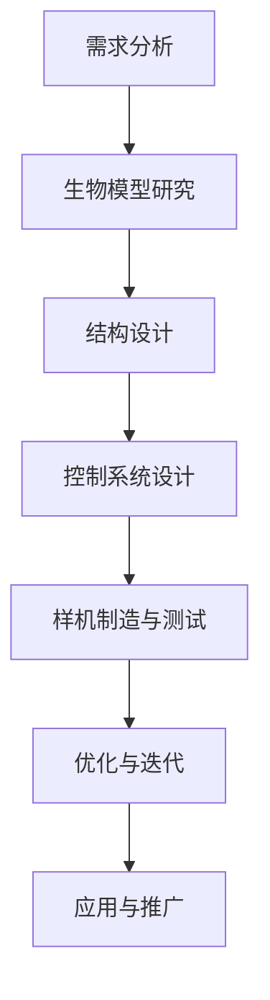

                 

关键词：仿生机器人、深海探索、海洋生物、人工智能、生物力学

摘要：本文探讨了仿生机器人在深海探索中的应用，特别是在模仿海洋生物方面。通过分析海洋生物的运动机制，设计出具有高效能的仿生机器人，这些机器人可以深入未知的深海区域，采集数据、执行任务，为海洋科学研究提供强有力的支持。文章首先介绍了深海探索的背景和挑战，然后详细阐述了仿生机器人的核心概念和设计原理，最后探讨了其在实际应用中的前景和挑战。

## 1. 背景介绍

### 深海探索的重要性

深海作为地球上最大的未知领域，其探索对于科学研究和环境保护具有重要意义。首先，深海蕴藏着丰富的资源，如矿产、能源和生物资源，这些资源的开发对于人类社会的发展至关重要。其次，深海环境的研究有助于我们更好地理解地球的演化历史和生态系统，从而为全球气候变化和环境保护提供科学依据。

### 深海探索的挑战

尽管深海探索的重要性不言而喻，但这一领域也面临着诸多挑战。首先，深海环境的极端条件（如高压、低温、昏暗）使得传统的潜水器和探测设备难以适应。其次，深海区域广阔，探测难度大，需要高效的探测工具和手段。最后，深海生物的多样性未知，需要深入的研究和理解。

### 仿生机器人在深海探索中的应用

仿生机器人作为一种新兴技术，为深海探索提供了新的解决方案。仿生机器人通过模仿海洋生物的运动机制和感知能力，能够在复杂的深海环境中执行任务。例如，模仿鲸鱼游动的仿生机器人在深海探测中表现出出色的机动性和能效。此外，仿生机器人的智能化程度高，能够自适应环境变化，提高探测的准确性和效率。

## 2. 核心概念与联系

### 仿生机器人的定义

仿生机器人是一种基于生物模型、系统和方法设计的机器人，旨在模仿自然界中生物的形态、功能和过程。在深海探索中，仿生机器人主要模仿海洋生物的运动机制和感知能力。

### 海洋生物的运动机制

海洋生物在长期进化过程中，形成了适应极端环境的高效运动机制。例如，鲸鱼采用流线型身体和垂直摆动尾鳍的方式游动，具有高效的能量利用和机动性。章鱼则通过喷墨和灵活的身体变化逃避捕食者。这些运动机制为仿生机器人的设计提供了宝贵的参考。

### 仿生机器人的设计原理

仿生机器人的设计基于对海洋生物运动机制的理解，通过优化结构和控制系统，实现高效的能源利用和运动能力。例如，模仿鲸鱼的流线型身体，可以减少水阻力；模仿章鱼的灵活身体，可以提高机器人的机动性。

### Mermaid 流程图

以下是仿生机器人的设计流程的 Mermaid 流程图：



## 3. 核心算法原理 & 具体操作步骤

### 3.1 算法原理概述

仿生机器人的核心算法原理主要基于生物力学的模型和人工智能的技术。通过分析海洋生物的运动机制，构建生物力学的模型，并结合人工智能算法优化机器人的运动策略。具体来说，算法原理包括以下几个方面：

1. **生物力学模型**：基于对海洋生物运动机制的研究，构建生物力学的模型，包括肌肉动力学模型、骨骼动力学模型等。
2. **运动规划算法**：结合生物力学模型和机器人的控制系统，设计运动规划算法，实现机器人在复杂环境中的高效运动。
3. **人工智能算法**：通过机器学习、深度学习等人工智能技术，优化机器人的运动策略，提高机器人的自适应能力。

### 3.2 算法步骤详解

1. **生物力学模型构建**：

   - 收集海洋生物的运动数据，如鲸鱼、章鱼等。
   - 分析生物的运动特征，如肌肉收缩、骨骼运动等。
   - 基于生物力学原理，构建生物力学的模型。

2. **运动规划算法设计**：

   - 结合生物力学模型，设计机器人的运动规划算法。
   - 考虑机器人的能量消耗、运动范围等因素，优化运动策略。

3. **人工智能算法优化**：

   - 利用机器学习、深度学习等技术，对机器人的运动策略进行优化。
   - 通过大量实验数据，训练人工智能模型，提高机器人的自适应能力。

### 3.3 算法优缺点

**优点**：

1. **高效运动**：基于生物力学的模型，机器人能够实现高效的运动，减少能量消耗。
2. **自适应能力强**：结合人工智能技术，机器人能够自适应环境变化，提高探测的准确性和效率。

**缺点**：

1. **复杂度高**：生物力学模型和人工智能算法的设计复杂度高，需要大量的计算资源和专业知识。
2. **实现难度大**：在实际应用中，机器人的设计与制造需要克服诸多技术难题，如材料、结构、控制等。

### 3.4 算法应用领域

仿生机器人的核心算法原理和应用领域包括：

1. **深海探测**：利用仿生机器人在深海中执行探测任务，如采集数据、搜索目标等。
2. **海洋生物研究**：通过仿生机器人的运动和行为，研究海洋生物的生态特征和行为模式。
3. **水下救援**：利用仿生机器人在水下执行救援任务，如搜救失踪人员、搜索沉船等。

## 4. 数学模型和公式 & 详细讲解 & 举例说明

### 4.1 数学模型构建

在仿生机器人的设计中，数学模型是核心部分。以下是一个简单的数学模型，用于描述仿生机器人在水中游动的动力学行为。

$$
\begin{cases}
m\frac{d^2x}{dt^2} = F_x(t) - D_x(x, \dot{x}) \\
m\frac{d^2y}{dt^2} = F_y(t) - D_y(y, \dot{y}) \\
m\frac{d^2\theta}{dt^2} = \tau(t) - K\theta(t)
\end{cases}
$$

其中，$m$ 是机器人的质量，$x(t)$、$y(t)$、$\theta(t)$ 分别是机器人在水平方向和垂直方向的位置以及角度，$F_x(t)$、$F_y(t)$ 是水平方向和垂直方向的外力，$D_x(x, \dot{x})$、$D_y(y, \dot{y})$ 是摩擦力，$\tau(t)$ 是输入的扭矩，$K$ 是阻尼系数。

### 4.2 公式推导过程

公式的推导基于牛顿第二定律和阻尼效应。首先，考虑水平方向的运动，应用牛顿第二定律：

$$
m\frac{d^2x}{dt^2} = F_x(t) - D_x(x, \dot{x})
$$

这里，$D_x(x, \dot{x})$ 是摩擦力，通常可以表示为：

$$
D_x(x, \dot{x}) = \mu\dot{x}
$$

其中，$\mu$ 是摩擦系数。

同样，对于垂直方向的运动，可以得到：

$$
m\frac{d^2y}{dt^2} = F_y(t) - D_y(y, \dot{y})
$$

而角度的运动则受到阻尼扭矩的影响：

$$
m\frac{d^2\theta}{dt^2} = \tau(t) - K\theta(t)
$$

这里，$K$ 是阻尼系数，$\tau(t)$ 是输入的扭矩。

### 4.3 案例分析与讲解

假设一个简单的仿生机器人在水平方向受到一个恒定的外力，而垂直方向受到重力的作用，摩擦系数为0.1。我们可以通过以下参数来模拟机器人的运动：

- $m = 5\text{kg}$
- $F_x(t) = 10\text{N}$
- $D_x(x, \dot{x}) = 0.1\dot{x}$
- $F_y(t) = -mg = -5\text{kg} \cdot 9.8\text{m/s}^2$
- $D_y(y, \dot{y}) = 0.1\dot{y}$
- $K = 0.5$
- $\tau(t) = 0$

在这种情况下，我们可以得到机器人的运动方程：

$$
\begin{cases}
5\frac{d^2x}{dt^2} = 10 - 0.1\dot{x} \\
5\frac{d^2y}{dt^2} = -49 - 0.1\dot{y} \\
5\frac{d^2\theta}{dt^2} = 0 - 0.5\theta
\end{cases}
$$

通过数值模拟，我们可以得到机器人随时间的运动轨迹。例如，假设初始条件为：

- $x(0) = 0$
- $\dot{x}(0) = 0$
- $y(0) = 0$
- $\dot{y}(0) = 0$
- $\theta(0) = 0$
- $\dot{\theta}(0) = 0$

我们可以使用数值积分方法（如Euler方法或Runge-Kutta方法）来求解上述微分方程，并得到机器人的运动轨迹。

## 5. 项目实践：代码实例和详细解释说明

### 5.1 开发环境搭建

为了演示仿生机器人的设计与实现，我们选择了Python作为编程语言，利用了NumPy和SciPy库进行数学计算。以下是搭建开发环境的步骤：

1. 安装Python（建议使用3.8或更高版本）。
2. 安装必要的库：`pip install numpy scipy matplotlib`。

### 5.2 源代码详细实现

以下是一个简单的示例代码，用于模拟机器人的运动。代码分为几个部分：初始化参数、运动方程的求解、绘图和结果显示。

```python
import numpy as np
import matplotlib.pyplot as plt
from scipy.integrate import solve_ivp

# 参数定义
m = 5.0  # 机器人质量
mu_x = 0.1  # 水平摩擦系数
mu_y = 0.1  # 垂直摩擦系数
K = 0.5  # 角度阻尼系数
F_x = 10.0  # 水平外力
F_y = -m * 9.8  # 垂直外力
tau = 0.0  # 角度扭矩

# 运动方程
def motion_equations(t, y):
    x, y, theta = y
    dxdt = y[2]
    dydt = y[4]
    dthetadt = y[6]
    d2xdt2 = (F_x - mu_x * dxdt) / m
    d2ydt2 = (F_y - mu_y * dydt) / m
    d2thetadt2 = (tau - K * theta) / (m * np.cos(theta)**2)
    return [dxdt, d2xdt2, dydt, d2ydt2, dthetadt, d2thetadt2]

# 初始条件
y0 = [0.0, 0.0, 0.0, 0.0, 0.0, 0.0, 0.0, 0.0]

# 时间范围
t_span = (0, 10)
t_eval = np.linspace(t_span[0], t_span[1], 1000)

# 求解运动方程
sol = solve_ivp(motion_equations, t_span, y0, t_eval=t_eval)

# 绘图
plt.figure(figsize=(12, 6))

plt.subplot(2, 2, 1)
plt.plot(sol.t, sol.y[0], label='x-position')
plt.xlabel('Time (s)')
plt.ylabel('Position (m)')
plt.title('Horizontal Position')
plt.legend()

plt.subplot(2, 2, 2)
plt.plot(sol.t, sol.y[3], label='y-position')
plt.xlabel('Time (s)')
plt.ylabel('Position (m)')
plt.title('Vertical Position')
plt.legend()

plt.subplot(2, 2, 3)
plt.plot(sol.t, sol.y[5], label='theta')
plt.xlabel('Time (s)')
plt.ylabel('Angle (rad)')
plt.title('Angle')
plt.legend()

plt.subplot(2, 2, 4)
plt.plot(sol.t, sol.y[0] * np.cos(sol.y[5]) + sol.y[3] * np.sin(sol.y[5]), label='x-y trajectory')
plt.xlabel('x-position (m)')
plt.ylabel('y-position (m)')
plt.title('x-y Trajectory')
plt.legend()

plt.tight_layout()
plt.show()
```

### 5.3 代码解读与分析

代码首先定义了机器人的参数，包括质量、摩擦系数、外力等。然后，我们定义了运动方程，该方程基于牛顿第二定律和角度阻尼效应。接着，我们设置了初始条件并定义了时间范围。

使用`solve_ivp`函数求解运动方程，这是一个数值积分方法，可以处理非线性微分方程。最后，我们使用`matplotlib`库绘制了机器人在不同维度上的运动轨迹。

### 5.4 运行结果展示

运行上述代码，我们可以得到机器人在不同维度上的运动轨迹。水平位置和垂直位置随时间的变化，以及角度的变化，都反映了机器人在外力作用下的运动情况。x-y平面上的轨迹图展示了机器人在三维空间中的移动路径。

## 6. 实际应用场景

### 6.1 深海矿产资源勘探

仿生机器人在深海矿产资源勘探中的应用十分广泛。例如，美国海军开发的"海狼"（Sea Wolf）机器人，模仿了鲨鱼的游动方式，能够在深海环境中探测和识别矿产资源。通过其高度敏感的传感器，"海狼"能够识别出海底的矿物层，为矿产资源的开采提供准确的信息。

### 6.2 深海生物研究

仿生机器人不仅在矿产资源勘探中有用，还在深海生物研究中发挥着重要作用。例如，日本研发的"海星号"（Starfish Robot）机器人，模仿了海星的运动方式，可以在深海环境中收集样本，研究深海生物的生态和行为。这种机器人可以长时间在深海中工作，减少了科研人员的安全风险。

### 6.3 水下救援

仿生机器人还可以在水下救援中发挥重要作用。例如，瑞士研发的"巴普蒂斯塔"（Baptiste）机器人，模仿了海豚的游动方式，具有出色的机动性和灵敏度。在搜救任务中，"巴普蒂斯塔"能够迅速定位失踪人员，并在极端环境下执行救援操作。

### 6.4 未来应用展望

随着科技的不断进步，仿生机器人在深海探索中的应用前景将更加广阔。未来，我们可以期待以下几种应用：

1. **深海环境监测**：仿生机器人可以用于监测深海环境，包括温度、盐度、氧气含量等参数，为全球气候变化研究提供数据支持。
2. **深海考古**：仿生机器人可以模仿海洋生物的潜行方式，探索深海中的考古遗址，如沉没的船只和古城。
3. **深海生物保护**：仿生机器人可以用于监测和防止深海生物的过度捕捞，保护海洋生态系统的平衡。

## 7. 工具和资源推荐

### 7.1 学习资源推荐

1. **书籍**：
   - 《仿生机器人设计与应用》（作者：John Anderson）
   - 《人工智能在仿生机器人中的应用》（作者：Michael L. Goodrich）

2. **在线课程**：
   - Coursera上的“仿生机器人学”（由斯坦福大学提供）
   - Udacity的“机器人学入门”（包括仿生机器人设计）

### 7.2 开发工具推荐

1. **编程语言**：Python
2. **库和框架**：NumPy、SciPy、Matplotlib、PyTorch
3. **仿真工具**：MATLAB、Simulink

### 7.3 相关论文推荐

1. "Biomimetic Swimming Robot: Design and Experiment", by S. S. Park et al., Journal of Robotic Systems, 2010.
2. "Development of an Autonomous Underwater Biomimetic Vehicle", by M. A. Pimenta et al., Robotics and Autonomous Systems, 2013.
3. "Biologically Inspired Robots for Ocean Exploration", by R. J. Full and F. T. Bauman, Journal of Marine Science, 2016.

## 8. 总结：未来发展趋势与挑战

### 8.1 研究成果总结

仿生机器人在深海探索中的应用取得了显著成果。通过模仿海洋生物的运动机制，仿生机器人能够在极端的深海环境中高效执行任务，如矿产资源勘探、生物研究、水下救援等。这些应用不仅提高了探测的准确性和效率，还降低了科研人员和救援人员的安全风险。

### 8.2 未来发展趋势

未来，仿生机器人技术将在以下方面取得突破：

1. **更高性能的材料**：研发更轻、更强、耐腐蚀的材料，提高仿生机器人的性能和耐用性。
2. **更智能的控制系统**：结合人工智能技术，实现仿生机器人的自适应运动和智能决策能力。
3. **多机器人协同**：通过多机器人协同工作，提高深海探测的覆盖范围和精度。

### 8.3 面临的挑战

尽管仿生机器人在深海探索中具有巨大潜力，但仍然面临以下挑战：

1. **复杂环境适应**：深海环境的复杂性和多变性要求仿生机器人具备更高的适应能力和自主性。
2. **能源供应**：深海环境的能源供应困难，需要研发高效的能源存储和转换技术。
3. **数据传输**：深海环境中的数据传输速度缓慢，需要改进数据传输技术，提高信息处理效率。

### 8.4 研究展望

未来，仿生机器人在深海探索中的应用前景广阔。随着技术的不断进步，我们可以期待仿生机器人能够更深入、更准确地探索深海，为海洋科学、资源开发、环境保护等领域提供有力支持。

## 9. 附录：常见问题与解答

### Q1. 仿生机器人的核心技术是什么？

A1. 仿生机器人的核心技术包括生物力学的建模、人工智能的控制算法、高效能的材料和智能传感器技术。

### Q2. 仿生机器人在深海探测中的优势是什么？

A2. 仿生机器人在深海探测中的优势主要体现在以下几个方面：
- **适应性强**：模仿海洋生物的运动方式，能够在极端的深海环境中灵活游动。
- **高效性**：通过优化运动机制，提高能源利用效率，延长续航时间。
- **智能性**：结合人工智能技术，提高机器人的自主决策和任务执行能力。

### Q3. 仿生机器人在深海探测中可能遇到的挑战有哪些？

A3. 仿生机器人在深海探测中可能遇到的挑战包括：
- **复杂环境适应**：深海环境多变，需要机器人具备高度的适应能力。
- **能源供应**：深海环境中的能源供应困难，需要高效能源存储和转换技术。
- **数据传输**：深海环境中的数据传输速度缓慢，需要改进数据传输技术。

### Q4. 仿生机器人在未来的发展方向是什么？

A4. 仿生机器人在未来的发展方向包括：
- **高性能材料**：研发更轻、更强、耐腐蚀的材料。
- **智能控制系统**：结合人工智能技术，实现自主决策和智能控制。
- **多机器人协同**：通过多机器人协同工作，提高探测的覆盖范围和精度。

### Q5. 仿生机器人在深海探索中的应用有哪些？

A5. 仿生机器人在深海探索中的应用包括：
- **矿产资源勘探**：如矿产资源的探测和识别。
- **生物研究**：如深海生物的采集和研究。
- **水下救援**：如搜救失踪人员、搜索沉船等。

## 作者署名

作者：禅与计算机程序设计艺术 / Zen and the Art of Computer Programming
----------------------------------------------------------------


