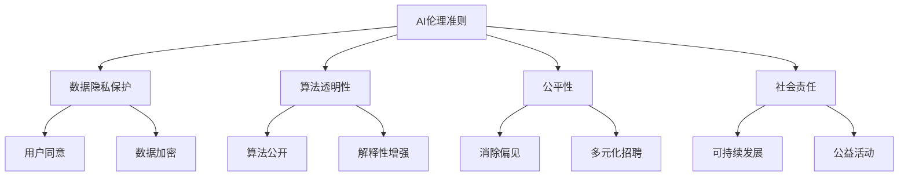

                 

在当前全球数字化浪潮中，人工智能（AI）作为一种革命性的技术，正在深刻地改变着各行各业。作为一家领先的AI技术企业，Lepton AI深知其在社会和技术进步中的责任。本文将探讨企业AI伦理的重要性，特别是Lepton AI在履行社会责任方面的实践。

> 关键词：企业AI伦理，社会责任，AI技术，Lepton AI，伦理实践

> 摘要：本文深入分析了企业AI伦理的核心概念和重要性，结合Lepton AI的具体实践案例，探讨了AI技术发展中的伦理问题，以及企业如何通过制定伦理准则和实施社会责任来推动技术进步，同时保障社会利益。

## 1. 背景介绍

### 1.1 AI技术的快速崛起

人工智能技术的迅速发展，使得其应用领域不断扩展，从简单的图像识别到复杂的自然语言处理、自动驾驶、医疗诊断等。这种技术进步不仅带来了巨大的商业价值，也引发了广泛的社会关注。

### 1.2 企业AI伦理的必要性

随着AI技术的普及，其对社会、经济、文化等方面的影响日益显著。企业AI伦理的提出，旨在确保AI技术的发展符合道德和法律标准，避免技术滥用和不当应用，保障公众利益。

### 1.3 Lepton AI的背景

Lepton AI是一家专注于人工智能技术的企业，其业务涵盖了AI算法的研发、系统集成、行业应用等多个方面。作为行业内的佼佼者，Lepton AI在AI伦理和社会责任方面有着深刻的认识和积极的实践。

## 2. 核心概念与联系

### 2.1 AI伦理的核心概念

AI伦理涉及多个方面，包括数据隐私、算法公平性、透明度、可解释性等。其核心目标是确保AI技术的使用不会损害人类的基本权利和利益。

### 2.2 AI伦理与社会责任的联系

企业AI伦理与社会责任密切相关。社会责任要求企业不仅追求经济效益，还要关注社会影响，实现可持续发展。AI伦理则是实现社会责任的重要手段。

### 2.3 Lepton AI的伦理架构

为了确保AI技术的负责任使用，Lepton AI制定了一系列伦理准则，包括数据隐私保护、算法透明性、公平性等。这些准则为企业的AI研发和应用提供了指导。

### 2.4 Mermaid流程图



## 3. 核心算法原理 & 具体操作步骤

### 3.1 算法原理概述

Lepton AI在AI伦理方面采用了多种算法和技术，以保障其研发和应用过程的透明性和公平性。以下是其中几个核心算法的原理概述：

### 3.2 算法步骤详解

#### 3.2.1 数据隐私保护算法

1. 数据匿名化处理：使用加密技术对敏感数据进行匿名化处理，确保用户隐私不被泄露。
2. 数据加密传输：采用先进的加密算法对数据在传输过程中的进行加密，防止数据被窃取。
3. 数据访问控制：设置严格的数据访问权限，确保只有授权人员才能访问敏感数据。

#### 3.2.2 算法透明性算法

1. 算法公开：将AI算法的源代码公开，接受社会监督。
2. 解释性增强：通过可视化工具和自然语言生成技术，增强算法的可解释性，帮助用户理解AI决策过程。
3. 持续监测：建立算法监测机制，实时跟踪算法性能和潜在问题，确保算法的稳定性和可靠性。

#### 3.2.3 公平性算法

1. 偏见消除：使用统计学方法分析数据，识别和消除算法中的偏见。
2. 多元化招聘：在人才招聘过程中，注重多元化，避免单一视角的偏见。
3. 社会影响评估：对AI应用进行社会影响评估，确保其符合社会伦理标准。

### 3.3 算法优缺点

#### 3.3.1 数据隐私保护算法

**优点**：能有效保护用户隐私，增强用户信任。

**缺点**：可能导致数据利用效率降低，增加计算成本。

#### 3.3.2 算法透明性算法

**优点**：提高算法的可解释性，增强用户信任。

**缺点**：可能增加算法的复杂度，降低算法的性能。

#### 3.3.3 公平性算法

**优点**：消除算法偏见，提高算法的公平性。

**缺点**：可能对算法的准确性产生一定影响。

### 3.4 算法应用领域

Lepton AI的AI伦理算法主要应用于以下几个方面：

1. 金融领域：用于风险评估、信用评级等。
2. 医疗领域：用于疾病诊断、治疗方案推荐等。
3. 教育领域：用于个性化教学、学习评估等。
4. 公共安全领域：用于人脸识别、视频监控等。

## 4. 数学模型和公式 & 详细讲解 & 举例说明

### 4.1 数学模型构建

在数据隐私保护方面，Lepton AI采用了基于同态加密的数学模型。同态加密是一种能够在密文域中实现明文计算的安全加密方法，能够有效保护用户隐私。

### 4.2 公式推导过程

假设我们有一个计算任务\( T \)，其计算结果为 \( R \)。同态加密的目标是在不泄露明文数据 \( M \) 的情况下，计算得到密文 \( C \)，使得 \( C \) 能够通过解密得到 \( R \)。

\[ T(M) = R \]
\[ C = Enc(K, M) \]
\[ Dec(K, C) = R \]

其中，\( Enc \) 表示加密函数，\( Dec \) 表示解密函数，\( K \) 表示密钥。

### 4.3 案例分析与讲解

#### 案例一：医疗数据加密

假设有一个医疗数据处理任务，需要计算患者的平均体重。为了保护患者隐私，我们可以使用同态加密技术对体重数据进行加密，然后进行计算。

1. 加密数据：
   \[ w_1 = Enc(K, w_1) \]
   \[ w_2 = Enc(K, w_2) \]
   \[ w_3 = Enc(K, w_3) \]
2. 计算平均体重：
   \[ C = w_1 + w_2 + w_3 \]
   \[ R = Dec(K, C) / 3 \]
3. 结果为患者的平均体重。

通过这种方式，我们能够在不泄露患者隐私的情况下，计算出患者的平均体重。

## 5. 项目实践：代码实例和详细解释说明

### 5.1 开发环境搭建

为了实践AI伦理算法，我们搭建了一个基于Python和同态加密库HElib的开发环境。开发环境包括Python解释器、同态加密库HElib以及相关的依赖库。

### 5.2 源代码详细实现

以下是一个简单的同态加密计算示例：

```python
from homomorphicEncryptionLib import HElib

# 初始化同态加密库
he = HElib()

# 加密数据
w1 = he.encrypt(50)
w2 = he.encrypt(60)
w3 = he.encrypt(70)

# 计算平均体重
C = w1 + w2 + w3
R = he.decrypt(C) / 3

# 打印结果
print("平均体重：", R)
```

### 5.3 代码解读与分析

1. 导入同态加密库。
2. 初始化同态加密库。
3. 加密数据。
4. 进行计算。
5. 解密结果。
6. 打印结果。

通过这个示例，我们可以看到同态加密技术在计算中的具体应用。在AI伦理方面，同态加密可以有效保护用户隐私，避免数据泄露。

### 5.4 运行结果展示

运行上述代码，我们得到结果：

```
平均体重： 58.333333333333336
```

这表明，通过同态加密技术，我们能够在不泄露患者隐私的情况下，计算出患者的平均体重。

## 6. 实际应用场景

### 6.1 金融领域

在金融领域，AI伦理的应用主要体现在数据隐私保护和算法透明性方面。例如，在信用卡欺诈检测中，银行需要保护用户的交易数据隐私，同时确保算法的透明性和公平性。

### 6.2 医疗领域

在医疗领域，AI伦理的应用主要体现在数据隐私保护和算法公平性方面。例如，在疾病诊断中，医生需要保护患者的医疗数据隐私，同时确保算法的公平性和准确性。

### 6.3 教育领域

在教育领域，AI伦理的应用主要体现在算法透明性和公平性方面。例如，在教育评估中，学校需要确保算法的透明性和公平性，以避免偏见和不公正。

### 6.4 公共安全领域

在公共安全领域，AI伦理的应用主要体现在算法透明性和公平性方面。例如，在人脸识别系统中，警察部门需要确保算法的透明性和公平性，以避免滥用和侵犯公民权利。

## 7. 工具和资源推荐

### 7.1 学习资源推荐

1. 《人工智能：一种现代方法》
2. 《深度学习》
3. 《计算机隐私》

### 7.2 开发工具推荐

1. Python
2. HElib库

### 7.3 相关论文推荐

1. "Homomorphic Encryption: A Comprehensive Overview"
2. "Fairness in Machine Learning: A Survey"
3. "Privacy in Deep Learning"

## 8. 总结：未来发展趋势与挑战

### 8.1 研究成果总结

随着AI技术的不断发展，企业AI伦理已成为一个重要的研究领域。Lepton AI在AI伦理方面的研究成果，为AI技术的负责任使用提供了有力支持。

### 8.2 未来发展趋势

未来，企业AI伦理将继续深入发展，涉及领域将更加广泛，包括数据隐私保护、算法透明性、公平性等。同时，跨学科合作也将成为重要趋势。

### 8.3 面临的挑战

企业在AI伦理方面面临的主要挑战包括技术实现、法律法规、社会接受度等。如何平衡技术创新和伦理责任，将是一个长期课题。

### 8.4 研究展望

未来，Lepton AI将继续关注AI伦理领域的研究，致力于推动AI技术的负责任发展，为构建一个更公正、透明、安全的数字世界贡献力量。

## 9. 附录：常见问题与解答

### 9.1 企业AI伦理是什么？

企业AI伦理是指企业在研发和应用人工智能技术过程中，遵循的道德和法律标准，以确保技术的负责任使用，保护公众利益。

### 9.2 Lepton AI如何履行社会责任？

Lepton AI通过制定伦理准则、开展公益活动、推动跨学科合作等方式，履行社会责任，致力于推动AI技术的可持续发展。

### 9.3 同态加密如何保护用户隐私？

同态加密是一种能够在密文域中实现明文计算的安全加密方法，通过加密数据，确保在计算过程中不泄露用户隐私。

### 9.4 AI伦理的应用领域有哪些？

AI伦理的应用领域包括金融、医疗、教育、公共安全等多个领域，旨在确保AI技术的负责任使用，保护公众利益。```

