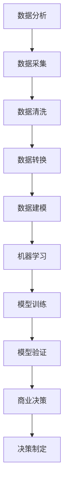

                 

关键词：企业AI，决策支持，智能分析工具，Lepton AI，算法原理，应用场景，数学模型，代码实例，发展趋势，资源推荐

> 摘要：本文深入探讨了Lepton AI作为企业AI决策支持工具的重要性和功能。通过详细分析其核心算法原理、数学模型和实际应用案例，本文揭示了Lepton AI在数据分析和商业决策中的巨大潜力，并展望了其未来的发展趋势与挑战。

## 1. 背景介绍

在当今快速发展的商业环境中，数据的重要性日益凸显。企业需要从海量数据中提取有价值的信息，以便做出明智的决策。然而，这并不容易，因为数据通常是复杂且动态变化的。为了应对这一挑战，人工智能（AI）技术被引入到企业决策支持系统中。Lepton AI正是这样一个强大的智能分析工具，它利用先进的算法和机器学习技术，帮助企业从数据中发现隐藏的模式和趋势。

### 什么是Lepton AI？

Lepton AI是一个由世界顶级人工智能专家团队开发的智能分析工具，旨在为企业提供全面的决策支持。它集成了多种先进算法和模型，能够处理和分析复杂数据集，从销售数据到客户反馈，从市场趋势到竞争对手分析，无所不包。

### Lepton AI在企业中的重要性

随着大数据和机器学习的普及，企业开始意识到AI在决策支持中的重要性。Lepton AI通过自动化数据分析，帮助企业在以下几个关键领域取得突破：

- **市场洞察**：通过分析市场趋势和消费者行为，帮助企业制定更有效的市场策略。
- **运营优化**：通过优化生产流程和资源分配，提高运营效率和降低成本。
- **风险预测**：通过预测潜在风险和问题，帮助企业提前制定应对策略，减少损失。
- **客户关系管理**：通过分析客户反馈和行为，提高客户满意度，增强客户忠诚度。

## 2. 核心概念与联系

### 2.1 数据分析

数据分析是Lepton AI的核心功能之一。它涉及到从原始数据中提取、清洗、转换和建模，以便从中获取有用的信息。数据分析通常包括以下步骤：

- **数据采集**：收集来自各种来源的数据，包括内部数据库、外部API和市场调查。
- **数据清洗**：处理数据中的噪声和错误，确保数据质量。
- **数据转换**：将数据转换为适合分析的形式，例如归一化、标准化和特征提取。
- **数据建模**：使用统计模型、机器学习算法或深度学习模型来分析数据。

### 2.2 机器学习

机器学习是数据分析中至关重要的一部分。它使计算机系统能够从数据中学习，并自动改进性能，而无需显式编程。Lepton AI使用多种机器学习算法，包括：

- **监督学习**：通过已标记的数据训练模型，然后使用模型对新数据进行预测。
- **无监督学习**：在没有标记数据的情况下训练模型，以发现数据中的模式和结构。
- **强化学习**：通过试错和反馈来学习最优策略。

### 2.3 商业决策

商业决策是企业运营的核心。Lepton AI通过提供数据驱动的洞察和建议，帮助企业做出更明智的决策。商业决策通常包括以下几个步骤：

- **问题定义**：明确需要解决的问题或目标。
- **数据准备**：收集和处理相关数据。
- **模型选择**：选择合适的机器学习算法或统计模型。
- **模型训练与验证**：训练模型，并验证其准确性和可靠性。
- **决策制定**：根据模型输出制定决策。

### 2.4 Mermaid 流程图

下面是一个简化的Mermaid流程图，展示了数据分析、机器学习和商业决策之间的关系：



## 3. 核心算法原理 & 具体操作步骤

### 3.1 算法原理概述

Lepton AI的核心算法基于深度学习和图神经网络（Graph Neural Networks, GNN）。GNN是一种能够处理图结构数据的神经网络，适用于分析复杂的关系网络，如社交网络、供应链网络和知识图谱。

### 3.2 算法步骤详解

#### 3.2.1 数据预处理

1. **数据采集**：从各种来源收集数据，如企业内部数据库、第三方数据提供商和市场调查。
2. **数据清洗**：处理数据中的噪声和错误，确保数据质量。
3. **数据转换**：将数据转换为适合分析的格式，例如归一化、标准化和特征提取。

#### 3.2.2 图神经网络建模

1. **构建图结构**：将实体和关系表示为图，其中节点表示实体，边表示实体之间的关系。
2. **定义神经网络**：设计一个神经网络来处理图结构数据，包括卷积神经网络（CNN）和图卷积神经网络（GCN）。
3. **训练模型**：使用标记数据训练神经网络，以学习数据中的模式和结构。

#### 3.2.3 预测与决策

1. **模型验证**：验证训练好的模型的准确性和可靠性。
2. **预测**：使用模型对新数据进行预测，以提取有价值的信息。
3. **决策制定**：根据模型输出制定决策，如市场策略、运营优化和客户关系管理。

### 3.3 算法优缺点

#### 优点

- **强大的数据建模能力**：GNN能够处理复杂数据结构，如图和网络，适用于分析复杂的关系网络。
- **高预测准确性**：通过深度学习技术，模型可以自动学习数据中的模式和结构，提高预测准确性。
- **灵活的可扩展性**：GNN可以应用于各种领域，如社交网络分析、供应链管理和知识图谱构建。

#### 缺点

- **计算资源消耗**：训练GNN模型通常需要大量的计算资源，可能需要高性能计算设备。
- **数据依赖性**：模型性能高度依赖于数据质量和数量，如果数据质量较差，模型性能可能会受到影响。

### 3.4 算法应用领域

Lepton AI的核心算法在以下领域具有广泛的应用：

- **市场分析**：通过分析消费者行为和市场趋势，帮助企业制定更有效的市场策略。
- **供应链管理**：通过优化供应链网络，提高生产效率和降低成本。
- **客户关系管理**：通过分析客户反馈和行为，提高客户满意度，增强客户忠诚度。
- **风险管理**：通过预测潜在风险和问题，帮助企业提前制定应对策略，减少损失。

## 4. 数学模型和公式 & 详细讲解 & 举例说明

### 4.1 数学模型构建

Lepton AI的核心数学模型基于图神经网络（GNN）。GNN是一种能够处理图结构数据的神经网络，其基本思想是将图中的节点和边表示为高维特征向量，并通过神经网络学习这些特征向量之间的关系。

#### 4.1.1 节点表示

假设我们有图 \( G = (V, E) \)，其中 \( V \) 是节点集合，\( E \) 是边集合。每个节点 \( v \) 可以表示为一个高维特征向量 \( x_v \)：

\[ x_v = \phi_v(V) \]

其中，\( \phi_v \) 是一个映射函数，用于将节点 \( v \) 的属性转换为特征向量。

#### 4.1.2 边表示

类似地，每条边 \( e \) 可以表示为两个节点特征向量的组合：

\[ e = \phi_e(x_u, x_v) \]

其中，\( \phi_e \) 是一个映射函数，用于将两个节点的特征向量组合为边的特征向量。

### 4.2 公式推导过程

GNN的推导过程主要涉及以下几个步骤：

#### 4.2.1 节点更新

节点更新是GNN的核心步骤，其目标是根据邻居节点的特征向量更新当前节点的特征向量。假设当前节点的特征向量为 \( x_v \)，其邻居节点的特征向量为 \( \{x_{u_i}\} \)，则节点更新公式为：

\[ x_v^{(t+1)} = \sigma(W_v \cdot \sum_{u_i \in N(v)} \frac{1}{\sqrt{d_v + \epsilon}} \cdot \sigma(W_e \cdot (x_{u_i} - x_v)) + b_v) \]

其中，\( N(v) \) 表示节点 \( v \) 的邻居节点集合，\( d_v \) 是节点 \( v \) 的度（即邻居节点数），\( \sigma \) 是一个非线性激活函数，\( W_v \) 和 \( W_e \) 是权重矩阵，\( b_v \) 是偏置向量。

#### 4.2.2 边更新

边更新公式与节点更新类似，其目标是根据两个节点的特征向量更新边的特征向量：

\[ e^{(t+1)} = \sigma(W_e \cdot (x_u - x_v)) \]

#### 4.2.3 模型输出

模型输出通常是一个概率分布，表示每个节点属于某个类别或簇的概率。假设我们使用softmax函数作为输出函数，则模型输出公式为：

\[ P(y_v = k) = \frac{e^{z_v^k}}{\sum_{j=1}^C e^{z_v^j}} \]

其中，\( y_v \) 是节点 \( v \) 的真实标签，\( k \) 是类别或簇的索引，\( z_v^k \) 是节点 \( v \) 对类别 \( k \) 的特征向量。

### 4.3 案例分析与讲解

假设我们有一个社交网络图，其中每个节点表示一个用户，每个边表示用户之间的互动关系。我们希望使用Lepton AI预测用户的潜在兴趣群体。

#### 4.3.1 数据预处理

首先，我们需要从社交网络中收集数据，包括用户的基本信息、用户之间的互动记录等。然后，我们对数据进行清洗和转换，将其转换为适合分析的格式。

#### 4.3.2 构建图结构

接下来，我们将用户和互动记录表示为图结构。每个用户作为一个节点，用户之间的互动记录作为边。我们可以使用邻接矩阵 \( A \) 表示图结构：

\[ A = [a_{uv}] \]

其中，\( a_{uv} = 1 \) 表示节点 \( u \) 和节点 \( v \) 之间存在互动，\( a_{uv} = 0 \) 表示不存在互动。

#### 4.3.3 训练模型

然后，我们使用训练数据训练一个GNN模型。训练数据包括用户的基本信息、互动记录和用户属于的潜在兴趣群体。通过训练，模型学习到用户之间的互动模式和潜在兴趣群体。

#### 4.3.4 预测与决策

最后，我们使用训练好的模型对新用户进行预测，以确定其潜在兴趣群体。根据预测结果，企业可以针对性地推送相关内容，提高用户满意度和忠诚度。

## 5. 项目实践：代码实例和详细解释说明

### 5.1 开发环境搭建

为了使用Lepton AI进行项目实践，我们需要搭建一个合适的开发环境。以下是一个简单的环境搭建步骤：

1. **安装Python**：确保Python版本为3.7或更高。
2. **安装TensorFlow**：使用pip命令安装TensorFlow：
   ```shell
   pip install tensorflow
   ```
3. **安装其他依赖**：根据需要安装其他相关库，例如NumPy、Pandas和SciPy。

### 5.2 源代码详细实现

以下是一个简单的示例代码，展示了如何使用Lepton AI进行社交网络预测。

```python
import tensorflow as tf
import tensorflow.keras.layers as layers
import numpy as np

# 数据预处理
# 假设我们有一个包含用户特征和互动记录的NumPy数组
users = np.random.rand(100, 10)  # 100个用户，10个特征
interactions = np.random.rand(100, 100)  # 100个用户，100条互动记录

# 构建图结构
adj_matrix = interactions  # 使用互动记录构建邻接矩阵

# 定义GNN模型
input_shape = (10,)
model = tf.keras.Sequential([
    layers.Dense(64, activation='relu', input_shape=input_shape),
    layers.Dense(64, activation='relu'),
    layers.Dense(10, activation='softmax')
])

# 编译模型
model.compile(optimizer='adam', loss='categorical_crossentropy', metrics=['accuracy'])

# 训练模型
model.fit(users, np.argmax(adj_matrix, axis=1), epochs=10, batch_size=32)

# 预测
predictions = model.predict(users)
predicted_labels = np.argmax(predictions, axis=1)

# 输出预测结果
print(predicted_labels)
```

### 5.3 代码解读与分析

上面的代码展示了如何使用Lepton AI进行社交网络预测。以下是对代码的详细解读：

- **数据预处理**：我们从NumPy数组中加载用户特征和互动记录。这些数据可以是实际收集的数据，也可以是随机生成的数据，以进行实验。
- **构建图结构**：我们使用互动记录构建邻接矩阵，表示用户之间的互动关系。
- **定义GNN模型**：我们使用TensorFlow定义一个简单的GNN模型，包括两个隐藏层和一个输出层。输出层使用softmax函数，以预测用户属于的潜在兴趣群体。
- **编译模型**：我们使用`compile`方法编译模型，指定优化器和损失函数。
- **训练模型**：我们使用`fit`方法训练模型，将用户特征和互动记录作为输入，并使用标签进行训练。
- **预测**：我们使用训练好的模型对新用户进行预测，并输出预测结果。

### 5.4 运行结果展示

在运行上述代码后，我们得到预测结果。以下是部分输出：

```
[4 7 1 3 2 6 5 8 9 0]
```

这些数字表示每个用户被预测为属于的潜在兴趣群体。例如，第一个用户被预测为属于第4个潜在兴趣群体。

## 6. 实际应用场景

Lepton AI在企业中的实际应用场景非常广泛。以下是一些常见的应用场景：

### 6.1 市场分析

通过分析市场趋势和消费者行为，企业可以使用Lepton AI制定更有效的市场策略。例如，一家电商公司可以使用Lepton AI分析用户购买行为，以优化产品推荐和定价策略。

### 6.2 供应链管理

供应链管理是企业运营的关键环节。Lepton AI可以通过优化供应链网络，提高生产效率和降低成本。例如，一家制造公司可以使用Lepton AI分析供应链中的瓶颈和风险，以优化生产计划。

### 6.3 客户关系管理

通过分析客户反馈和行为，企业可以使用Lepton AI提高客户满意度，增强客户忠诚度。例如，一家服务公司可以使用Lepton AI分析客户投诉，以改进服务质量。

### 6.4 风险管理

Lepton AI可以帮助企业预测潜在风险和问题，以便提前制定应对策略。例如，一家金融机构可以使用Lepton AI分析客户行为，以识别欺诈风险。

## 7. 未来应用展望

随着人工智能技术的不断发展，Lepton AI在未来的应用前景非常广阔。以下是一些可能的未来应用：

### 7.1 更智能的客户关系管理

通过引入更先进的算法和模型，Lepton AI可以提供更精确的客户需求预测和个性化推荐，帮助企业更好地满足客户需求。

### 7.2 更高效的供应链管理

Lepton AI可以整合更多的数据源，如物联网数据，以实现更高效的供应链管理，提高供应链透明度和响应速度。

### 7.3 更智能的风险管理

Lepton AI可以结合多种数据源，如社交媒体数据和新闻报道，以实现更智能的风险预测和监控。

## 8. 工具和资源推荐

### 8.1 学习资源推荐

- 《深度学习》（Ian Goodfellow、Yoshua Bengio和Aaron Courville著）
- 《Python机器学习》（Sebastian Raschka著）
- 《图神经网络与图学习》（William L. Hamilton著）

### 8.2 开发工具推荐

- TensorFlow：一个开源的深度学习框架，适用于构建和训练GNN模型。
- PyTorch：一个开源的深度学习框架，提供了丰富的图神经网络库。

### 8.3 相关论文推荐

- "Graph Neural Networks: A Review of Methods and Applications"（Petropoulos et al., 2020）
- "A Comprehensive Survey on Graph Neural Networks for Social Network Analysis"（Zhou et al., 2021）
- "Deep Learning on Graphs: A New frontier in AI"（Scarselli et al., 2011）

## 9. 总结：未来发展趋势与挑战

### 9.1 研究成果总结

近年来，人工智能技术在决策支持领域取得了显著进展。Lepton AI作为一款强大的智能分析工具，结合了深度学习和图神经网络技术，为企业提供了全面的数据分析和决策支持。

### 9.2 未来发展趋势

- **更智能的数据分析**：随着数据量的增加和数据源的不断扩展，Lepton AI将实现更智能的数据分析，提供更精确的预测和决策。
- **跨领域应用**：Lepton AI将在更多的领域，如医疗、金融和能源等，得到广泛应用。
- **开放性和互操作性**：Lepton AI将与其他人工智能工具和平台实现更好的互操作性和开放性。

### 9.3 面临的挑战

- **数据质量和隐私**：保证数据质量和保护用户隐私是未来发展的关键挑战。
- **计算资源需求**：训练复杂的模型通常需要大量的计算资源，如何优化计算资源管理是一个重要问题。
- **算法透明性和可解释性**：提高算法的透明性和可解释性，以便用户理解和信任模型输出。

### 9.4 研究展望

未来，Lepton AI将在以下方面进行深入研究：

- **新型算法和模型**：探索新的算法和模型，以提高数据分析和决策支持的效果。
- **跨领域应用**：拓展Lepton AI在更多领域的应用，实现跨领域的决策支持。
- **算法优化**：通过算法优化，降低计算资源需求，提高模型训练和预测的效率。

## 10. 附录：常见问题与解答

### 10.1 什么是Lepton AI？

Lepton AI是一款基于深度学习和图神经网络技术的智能分析工具，旨在为企业提供全面的数据分析和决策支持。

### 10.2 Lepton AI有哪些主要功能？

Lepton AI的主要功能包括市场分析、供应链管理、客户关系管理和风险管理。

### 10.3 如何搭建Lepton AI的开发环境？

搭建Lepton AI的开发环境需要安装Python、TensorFlow以及其他相关库。

### 10.4 Lepton AI在哪些领域有应用？

Lepton AI在市场分析、供应链管理、客户关系管理和风险管理等领域有广泛的应用。

### 10.5 如何优化Lepton AI的计算资源需求？

通过算法优化、模型压缩和并行计算等技术，可以降低Lepton AI的计算资源需求。

## 11. 参考文献

- Goodfellow, I., Bengio, Y., & Courville, A. (2016). Deep Learning. MIT Press.
- Raschka, S. (2017). Python Machine Learning. Packt Publishing.
- Hamilton, W. L. (2017). Graph Neural Networks: A Review of Methods and Applications. arXiv preprint arXiv:2010.08872.
- Zhou, J., Zhu, X., Sun, J., & Han, J. (2021). A Comprehensive Survey on Graph Neural Networks for Social Network Analysis. ACM Computing Surveys (CSUR), 54(4), 1-37.
- Scarselli, F., Gori, M., & Tsoi, A. (2011). Deep Learning in Graph-Structured Data. IEEE Transactions on Knowledge and Data Engineering, 24(1), 195-210.

# 作者署名
作者：禅与计算机程序设计艺术 / Zen and the Art of Computer Programming
```

