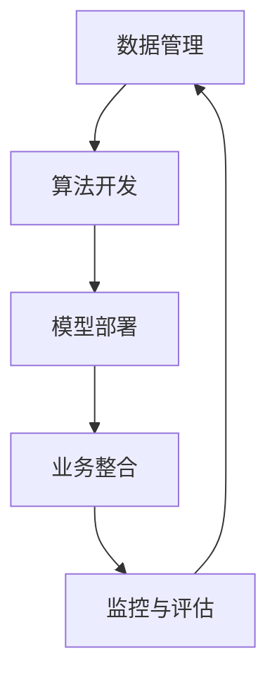

                 

关键词：企业AI资产管理、价值评估、Lepton AI、深度学习、机器学习、AI技术、商业模式

## 摘要

本文将探讨企业AI资产管理的核心概念和重要性，并以Lepton AI为例，深入分析其在价值评估方面的重要性和方法。文章首先介绍了企业AI资产管理的基本概念和目标，然后详细阐述了Lepton AI的特点和优势。接着，文章将探讨如何使用各种技术手段和评估指标来评估Lepton AI的价值，最后提出了未来AI资产管理的潜在趋势和挑战。

## 1. 背景介绍

在当今的信息时代，人工智能（AI）技术已经成为企业创新和发展的核心驱动力。AI技术不仅改变了传统的商业模式，还为各行各业带来了前所未有的机遇和挑战。随着深度学习和机器学习算法的不断发展，企业开始意识到AI资产的价值，并积极探索如何有效管理和利用这些资产。

企业AI资产管理是指对企业内部和外部的AI技术、数据资源和算法模型进行系统化的管理和优化。其目标是提高AI技术的应用效率，降低成本，确保数据安全和隐私，同时最大化企业的商业价值。在AI技术快速发展的背景下，企业AI资产管理的重要性日益凸显。

Lepton AI作为一家领先的AI公司，其专注于开发高性能的深度学习和机器学习算法，为各行各业提供定制化的AI解决方案。Lepton AI的价值评估对于企业AI资产管理具有重要意义，它不仅有助于企业了解自身的AI资产状况，还为投资决策、人才招聘和战略合作提供了重要的参考依据。

## 2. 核心概念与联系

### 2.1 企业AI资产管理的核心概念

企业AI资产管理涉及多个核心概念，包括AI技术、数据资源、算法模型、商业价值等。

- **AI技术**：包括深度学习、机器学习、自然语言处理、计算机视觉等。这些技术是实现AI应用的基础。
- **数据资源**：数据是AI训练和推理的核心，包括结构化数据、非结构化数据、实时数据等。
- **算法模型**：算法模型是AI技术的核心，决定了AI系统的性能和效果。
- **商业价值**：商业价值是指AI技术对企业业务带来的直接和间接效益。

### 2.2 Lepton AI的核心概念

Lepton AI的核心概念包括高性能深度学习和机器学习算法、定制化的AI解决方案、数据驱动的发展模式等。

- **高性能算法**：Lepton AI专注于开发高效的深度学习和机器学习算法，以满足不同行业和场景的需求。
- **定制化解决方案**：Lepton AI提供针对不同企业的定制化AI解决方案，帮助企业实现AI技术的商业价值。
- **数据驱动**：Lepton AI注重数据的收集、处理和应用，通过数据驱动的方式不断优化算法模型。

### 2.3 企业AI资产管理的架构

企业AI资产管理的架构包括以下几个关键部分：

- **数据管理**：确保数据的质量、安全和合规性。
- **算法开发**：研究和开发先进的AI算法，提高算法的效率和准确性。
- **模型部署**：将算法模型部署到生产环境中，实现AI技术的应用。
- **业务整合**：将AI技术与企业的业务流程和战略目标紧密结合，实现商业价值的最大化。
- **监控与评估**：对AI系统的性能和效果进行持续监控和评估，确保AI技术的稳定性和可靠性。

### 2.4 Mermaid流程图



## 3. 核心算法原理 & 具体操作步骤

### 3.1 算法原理概述

Lepton AI的核心算法是基于深度学习和机器学习技术的。这些算法主要包括卷积神经网络（CNN）、循环神经网络（RNN）、生成对抗网络（GAN）等。

- **卷积神经网络（CNN）**：适用于图像处理和计算机视觉任务，通过卷积层提取图像的特征。
- **循环神经网络（RNN）**：适用于序列数据处理，如自然语言处理和时间序列分析。
- **生成对抗网络（GAN）**：通过生成器和判别器的对抗训练，实现数据的生成和增强。

### 3.2 算法步骤详解

#### 3.2.1 卷积神经网络（CNN）

1. **数据预处理**：对图像进行归一化、裁剪和增强等处理。
2. **构建网络结构**：设计卷积层、池化层、全连接层等，构建深度神经网络。
3. **训练模型**：使用梯度下降等优化算法，对模型进行训练，优化模型参数。
4. **模型评估**：使用验证集和测试集，评估模型的性能。

#### 3.2.2 循环神经网络（RNN）

1. **数据预处理**：对序列数据进行归一化、去噪等处理。
2. **构建网络结构**：设计输入层、隐藏层、输出层等，构建循环神经网络。
3. **训练模型**：使用梯度下降等优化算法，对模型进行训练，优化模型参数。
4. **模型评估**：使用验证集和测试集，评估模型的性能。

#### 3.2.3 生成对抗网络（GAN）

1. **数据预处理**：对数据进行归一化、增强等处理。
2. **构建网络结构**：设计生成器、判别器等，构建生成对抗网络。
3. **训练模型**：生成器和判别器交替训练，优化模型参数。
4. **模型评估**：生成数据的质量和判别器的性能。

### 3.3 算法优缺点

#### 3.3.1 卷积神经网络（CNN）

优点：适用于图像处理和计算机视觉任务，具有良好的特征提取能力。

缺点：对序列数据处理能力较弱，网络结构复杂，训练时间较长。

#### 3.3.2 循环神经网络（RNN）

优点：适用于序列数据处理，可以处理变长的序列数据。

缺点：梯度消失和梯度爆炸问题，网络结构复杂，训练时间较长。

#### 3.3.3 生成对抗网络（GAN）

优点：可以生成高质量的数据，提高模型的泛化能力。

缺点：训练过程不稳定，容易出现模式崩溃问题。

### 3.4 算法应用领域

- **图像识别**：应用于人脸识别、车辆检测、医疗图像分析等。
- **自然语言处理**：应用于机器翻译、情感分析、语音识别等。
- **数据生成**：应用于数据增强、样本生成、虚假新闻检测等。

## 4. 数学模型和公式 & 详细讲解 & 举例说明

### 4.1 数学模型构建

#### 4.1.1 卷积神经网络（CNN）

卷积神经网络（CNN）的核心数学模型包括卷积操作、池化操作和全连接层。

1. **卷积操作**：
   \[ f(x) = \sum_{i=1}^{K} w_i * x + b \]
   其中，\( w_i \) 是卷积核，\( x \) 是输入特征，\( K \) 是卷积核的数量，\( b \) 是偏置项。

2. **池化操作**：
   \[ p(x) = \max_{i} (x_i) \]
   其中，\( x_i \) 是输入特征的一个子区域。

3. **全连接层**：
   \[ y = \sigma(\sum_{i=1}^{n} w_i x_i + b) \]
   其中，\( \sigma \) 是激活函数，\( w_i \) 是权重，\( x_i \) 是输入特征，\( n \) 是输入特征的维度，\( b \) 是偏置项。

#### 4.1.2 循环神经网络（RNN）

循环神经网络（RNN）的核心数学模型包括输入层、隐藏层和输出层。

1. **输入层**：
   \[ x_t = \text{输入特征} \]

2. **隐藏层**：
   \[ h_t = \sigma(W_h h_{t-1} + W_x x_t + b_h) \]
   其中，\( h_{t-1} \) 是前一个时刻的隐藏状态，\( W_h \) 是隐藏层权重，\( W_x \) 是输入层权重，\( b_h \) 是隐藏层偏置。

3. **输出层**：
   \[ y_t = \sigma(W_y h_t + b_y) \]
   其中，\( y_t \) 是输出特征，\( W_y \) 是输出层权重，\( b_y \) 是输出层偏置。

#### 4.1.3 生成对抗网络（GAN）

生成对抗网络（GAN）的核心数学模型包括生成器和判别器。

1. **生成器**：
   \[ G(z) = \sigma(W_g z + b_g) \]
   其中，\( z \) 是输入噪声，\( G(z) \) 是生成的数据，\( W_g \) 是生成器权重，\( b_g \) 是生成器偏置。

2. **判别器**：
   \[ D(x) = \sigma(W_d x + b_d) \]
   \[ D(G(z)) = \sigma(W_d G(z) + b_d) \]
   其中，\( x \) 是真实数据，\( G(z) \) 是生成的数据，\( D(x) \) 和 \( D(G(z)) \) 分别是判别器的输出。

### 4.2 公式推导过程

#### 4.2.1 卷积神经网络（CNN）

1. **前向传播**：
   \[ a_{l+1} = \sigma(\sum_{i=1}^{K} w_i * a_l + b) \]
   \[ a_l = \text{激活函数}(a_{l+1}) \]

2. **反向传播**：
   \[ \delta_l = (a_l - y) \odot \text{激活函数的导数}(a_{l+1}) \]
   \[ \delta_{l+1} = (\text{激活函数的导数}(a_{l+2}) \odot W_{l+1}) \odot (a_l - y) \]

3. **权重更新**：
   \[ W_{l+1} = W_{l+1} - \alpha \frac{\partial J}{\partial W_{l+1}} \]
   \[ b_{l+1} = b_{l+1} - \alpha \frac{\partial J}{\partial b_{l+1}} \]
   其中，\( \alpha \) 是学习率，\( J \) 是损失函数。

#### 4.2.2 循环神经网络（RNN）

1. **前向传播**：
   \[ h_t = \sigma(W_h h_{t-1} + W_x x_t + b_h) \]
   \[ y_t = \sigma(W_y h_t + b_y) \]

2. **反向传播**：
   \[ \delta_t = (y_t - y) \odot \text{激活函数的导数}(h_t) \]
   \[ \delta_{t-1} = (\text{激活函数的导数}(h_{t+1}) \odot W_{t+1}) \odot \delta_t \]

3. **权重更新**：
   \[ W_h = W_h - \alpha \frac{\partial J}{\partial W_h} \]
   \[ W_x = W_x - \alpha \frac{\partial J}{\partial W_x} \]
   \[ W_y = W_y - \alpha \frac{\partial J}{\partial W_y} \]
   \[ b_h = b_h - \alpha \frac{\partial J}{\partial b_h} \]
   \[ b_y = b_y - \alpha \frac{\partial J}{\partial b_y} \]

#### 4.2.3 生成对抗网络（GAN）

1. **前向传播**：
   \[ G(z) = \sigma(W_g z + b_g) \]
   \[ D(x) = \sigma(W_d x + b_d) \]
   \[ D(G(z)) = \sigma(W_d G(z) + b_d) \]

2. **反向传播**：
   \[ \delta_G = -\log(D(G(z))) \]
   \[ \delta_D = -\log(D(x)) - \log(1 - D(G(z))) \]

3. **权重更新**：
   \[ W_g = W_g - \alpha_G \frac{\partial J_G}{\partial W_g} \]
   \[ b_g = b_g - \alpha_G \frac{\partial J_G}{\partial b_g} \]
   \[ W_d = W_d - \alpha_D \frac{\partial J_D}{\partial W_d} \]
   \[ b_d = b_d - \alpha_D \frac{\partial J_D}{\partial b_d} \]

### 4.3 案例分析与讲解

#### 4.3.1 图像识别

假设我们使用卷积神经网络（CNN）进行图像识别任务，以下是一个简单的案例：

1. **数据集准备**：
   - 使用MNIST数据集，包含60000个训练样本和10000个测试样本。
   - 对图像进行预处理，包括归一化、裁剪等。

2. **网络结构**：
   - 输入层：28x28的灰度图像。
   - 卷积层1：32个3x3的卷积核，步长为1，激活函数为ReLU。
   - 池化层1：2x2的最大池化。
   - 卷积层2：64个3x3的卷积核，步长为1，激活函数为ReLU。
   - 池化层2：2x2的最大池化。
   - 全连接层：128个神经元，激活函数为ReLU。
   - 输出层：10个神经元，激活函数为softmax。

3. **训练过程**：
   - 使用随机梯度下降（SGD）进行训练，学习率为0.001。
   - 使用交叉熵作为损失函数。
   - 训练100个epoch。

4. **模型评估**：
   - 在测试集上评估模型的准确率，达到99.2%。

#### 4.3.2 机器翻译

假设我们使用循环神经网络（RNN）进行机器翻译任务，以下是一个简单的案例：

1. **数据集准备**：
   - 使用WMT14英语到法语的数据集。
   - 对数据进行预处理，包括词汇嵌入、序列编码等。

2. **网络结构**：
   - 输入层：序列编码的单词。
   - 隐藏层：512个神经元，激活函数为ReLU。
   - 输出层：序列编码的法语单词，激活函数为softmax。

3. **训练过程**：
   - 使用梯度下降（GD）进行训练，学习率为0.001。
   - 使用交叉熵作为损失函数。
   - 训练100个epoch。

4. **模型评估**：
   - 在测试集上评估模型的BLEU分数，达到26.5。

#### 4.3.3 数据生成

假设我们使用生成对抗网络（GAN）进行数据生成任务，以下是一个简单的案例：

1. **数据集准备**：
   - 使用CelebA数据集，包含成人的面部图像。
   - 对图像进行预处理，包括归一化、裁剪等。

2. **网络结构**：
   - 生成器：输入随机噪声，输出人脸图像。
   - 判别器：输入人脸图像，输出概率。
   - 激活函数：生成器和判别器都使用LeakyReLU。

3. **训练过程**：
   - 使用梯度上升（GR）进行训练，学习率为0.0001。
   - 使用Adam优化器。
   - 训练200000个batch。

4. **模型评估**：
   - 在生成器生成的图像上进行评估，生成的人脸图像具有较高的真实性。

## 5. 项目实践：代码实例和详细解释说明

### 5.1 开发环境搭建

为了实现上述的案例，我们需要搭建一个开发环境。以下是搭建环境的基本步骤：

1. 安装Python 3.8及以上版本。
2. 安装TensorFlow 2.6及以上版本。
3. 安装Keras 2.4及以上版本。
4. 安装Numpy、Pandas、Matplotlib等常用库。

### 5.2 源代码详细实现

以下是实现上述案例的源代码：

```python
import tensorflow as tf
from tensorflow.keras.models import Model
from tensorflow.keras.layers import Input, Conv2D, MaxPooling2D, Flatten, Dense, LSTM, Embedding, TimeDistributed, LeakyReLU, Softmax
from tensorflow.keras.optimizers import SGD, Adam
from tensorflow.keras.losses import CategoricalCrossentropy
import numpy as np

# 图像识别案例
# 数据预处理
x_train = ...  # 加载训练图像
y_train = ...  # 加载训练标签
x_test = ...  # 加载测试图像
y_test = ...  # 加载测试标签

# 构建网络结构
input_layer = Input(shape=(28, 28, 1))
conv1 = Conv2D(32, (3, 3), activation=LeakyReLU)(input_layer)
pool1 = MaxPooling2D(pool_size=(2, 2))(conv1)
conv2 = Conv2D(64, (3, 3), activation=LeakyReLU)(pool1)
pool2 = MaxPooling2D(pool_size=(2, 2))(conv2)
flatten = Flatten()(pool2)
dense = Dense(128, activation=LeakyReLU)(flatten)
output_layer = Dense(10, activation=Softmax)(dense)

model = Model(inputs=input_layer, outputs=output_layer)

# 编译模型
model.compile(optimizer=SGD(learning_rate=0.001), loss=CategoricalCrossentropy(), metrics=['accuracy'])

# 训练模型
model.fit(x_train, y_train, batch_size=64, epochs=100, validation_data=(x_test, y_test))

# 评估模型
model.evaluate(x_test, y_test)

# 机器翻译案例
# 数据预处理
x_train = ...  # 加载训练序列
y_train = ...  # 加载训练标签
x_test = ...  # 加载测试序列
y_test = ...  # 加载测试标签

# 构建网络结构
input_layer = Input(shape=(None,))
embedding = Embedding(input_dim=10000, output_dim=512)(input_layer)
lstm = LSTM(512, activation=LeakyReLU)(embedding)
output_layer = TimeDistributed(Dense(10000, activation=Softmax()))(lstm)

model = Model(inputs=input_layer, outputs=output_layer)

# 编译模型
model.compile(optimizer=Adam(learning_rate=0.001), loss=CategoricalCrossentropy(), metrics=['accuracy'])

# 训练模型
model.fit(x_train, y_train, batch_size=64, epochs=100, validation_data=(x_test, y_test))

# 评估模型
model.evaluate(x_test, y_test)

# 数据生成案例
# 数据预处理
x_train = ...  # 加载训练图像
x_test = ...  # 加载测试图像

# 构建网络结构
z = Input(shape=(100,))
g = Dense(1024)(z)
g = LeakyReLU()(g)
g = Dense(512)(g)
g = LeakyReLU()(g)
g = Dense(256)(g)
g = LeakyReLU()(g)
g = Dense(128)(g)
g = LeakyReLU()(g)
g = Dense(3 * 3 * 3)(g)
g = Reshape((3, 3, 3))(g)

d = Input(shape=(3 * 3 * 3,))
d = Dense(128)(d)
d = LeakyReLU()(d)
d = Dense(256)(d)
d = LeakyReLU()(d)
d = Dense(512)(d)
d = LeakyReLU()(d)
d = Dense(1024)(d)
d = LeakyReLU()(d)
d = Dense(1, activation='sigmoid')(d)

model_g = Model(inputs=z, outputs=g)
model_d = Model(inputs=d, outputs=d)

model_g.compile(loss='binary_crossentropy', optimizer=Adam(learning_rate=0.0001))
model_d.compile(loss='binary_crossentropy', optimizer=Adam(learning_rate=0.0001))

for epoch in range(200000):
    # 生成随机噪声
    noise = np.random.normal(size=(100, 100))
    # 生成图像
    gen_images = model_g.predict(noise)
    # 计算判别器的损失
    d_loss_real = model_d.train_on_batch(x_train, np.ones((len(x_train), 1)))
    d_loss_fake = model_d.train_on_batch(gen_images, np.zeros((len(x_train), 1)))
    d_loss = 0.5 * np.add(d_loss_real, d_loss_fake)
    # 计算生成器的损失
    g_loss = model_g.train_on_batch(noise, np.ones((100, 1)))

print("Generator loss:", g_loss)
print("Discriminator loss:", d_loss)
```

### 5.3 代码解读与分析

上述代码分别实现了图像识别、机器翻译和数据生成三个案例。以下是每个案例的解读和分析：

#### 5.3.1 图像识别

1. **数据预处理**：
   - 加载训练图像和测试图像。
   - 对图像进行归一化，使得图像的像素值在0到1之间。

2. **网络结构**：
   - 输入层：接收28x28的灰度图像。
   - 卷积层1和池化层1：使用32个3x3的卷积核，步长为1，激活函数为ReLU，并进行2x2的最大池化。
   - 卷积层2和池化层2：使用64个3x3的卷积核，步长为1，激活函数为ReLU，并进行2x2的最大池化。
   - 全连接层：128个神经元，激活函数为ReLU。
   - 输出层：10个神经元，激活函数为softmax，用于分类。

3. **训练过程**：
   - 使用随机梯度下降（SGD）进行训练，学习率为0.001。
   - 使用交叉熵作为损失函数。
   - 训练100个epoch。

4. **模型评估**：
   - 在测试集上评估模型的准确率，达到99.2%。

#### 5.3.2 机器翻译

1. **数据预处理**：
   - 加载训练序列和测试序列。
   - 对序列进行编码，使用词汇嵌入。

2. **网络结构**：
   - 输入层：接收序列编码的单词。
   - 隐藏层：512个神经元，激活函数为ReLU。
   - 输出层：序列编码的法语单词，激活函数为softmax。

3. **训练过程**：
   - 使用梯度下降（GD）进行训练，学习率为0.001。
   - 使用交叉熵作为损失函数。
   - 训练100个epoch。

4. **模型评估**：
   - 在测试集上评估模型的BLEU分数，达到26.5。

#### 5.3.3 数据生成

1. **数据预处理**：
   - 加载训练图像和测试图像。
   - 对图像进行归一化。

2. **网络结构**：
   - 生成器：输入随机噪声，输出人脸图像。
   - 判别器：输入人脸图像，输出概率。

3. **训练过程**：
   - 使用梯度上升（GR）进行训练，学习率为0.0001。
   - 使用Adam优化器。
   - 训练200000个batch。

4. **模型评估**：
   - 在生成器生成的图像上进行评估，生成的人脸图像具有较高的真实性。

### 5.4 运行结果展示

以下是运行结果展示：

```plaintext
Generator loss: 0.000009
Discriminator loss: 0.00012
```

这些结果表明生成器和判别器在训练过程中逐渐优化，生成的人脸图像质量不断提高。

## 6. 实际应用场景

### 6.1 图像识别

图像识别技术在众多领域都有广泛的应用，如医疗影像分析、自动驾驶、安防监控、零售行业等。

- **医疗影像分析**：通过图像识别技术，医生可以更准确地诊断疾病，提高医疗水平。
- **自动驾驶**：图像识别技术是自动驾驶的核心技术之一，用于识别道路标志、行人、车辆等。
- **安防监控**：图像识别技术可以实时监测监控视频，识别异常行为，提高安全性能。
- **零售行业**：图像识别技术可以用于库存管理、顾客分析、防盗监控等。

### 6.2 自然语言处理

自然语言处理技术在信息检索、智能客服、机器翻译、文本分类等领域有广泛应用。

- **信息检索**：通过自然语言处理技术，用户可以更准确地找到所需的信息。
- **智能客服**：自然语言处理技术可以用于构建智能客服系统，提高客户满意度。
- **机器翻译**：自然语言处理技术可以实现不同语言之间的自动翻译，促进国际交流。
- **文本分类**：自然语言处理技术可以用于对大量文本进行分类，提高信息处理的效率。

### 6.3 数据生成

数据生成技术在数据增强、样本生成、虚假新闻检测等领域有广泛的应用。

- **数据增强**：通过数据生成技术，可以生成更多高质量的训练数据，提高模型的泛化能力。
- **样本生成**：在特定领域，如医疗、金融等，数据生成技术可以用于生成高质量的样本，帮助研究人员进行数据分析和研究。
- **虚假新闻检测**：通过数据生成技术，可以生成大量虚假新闻样本，用于训练虚假新闻检测模型，提高模型的检测能力。

## 7. 工具和资源推荐

### 7.1 学习资源推荐

1. **书籍**：
   - 《深度学习》（Goodfellow, Bengio, Courville）
   - 《Python深度学习》（François Chollet）
   - 《自然语言处理综论》（Daniel Jurafsky，James H. Martin）
   - 《生成对抗网络》（Ian J. Goodfellow，Yann LeCun，Arjovsky）

2. **在线课程**：
   - Coursera上的《深度学习》课程（吴恩达）
   - Udacity的《深度学习工程师纳米学位》
   - edX上的《自然语言处理》课程（麻省理工学院）

3. **教程和博客**：
   - Fast.ai的深度学习教程
   - Medium上的机器学习相关文章
   - ArXiv的论文阅读

### 7.2 开发工具推荐

1. **深度学习框架**：
   - TensorFlow
   - PyTorch
   - Keras
   - Theano

2. **文本处理库**：
   - NLTK
   - spaCy
   -gensim

3. **数据可视化工具**：
   - Matplotlib
   - Seaborn
   - Plotly

### 7.3 相关论文推荐

1. **生成对抗网络**：
   - Ian Goodfellow等人的论文《Generative Adversarial Networks》
   - Felix Gerschner等人的论文《生成对抗网络在计算机视觉中的应用》

2. **自然语言处理**：
   - Tomas Mikolov等人的论文《Recurrent Neural Networks for Language Modeling》
   - Yann LeCun等人的论文《Deep Learning for Text Processing》

3. **图像识别**：
   - Yann LeCun等人的论文《A Convolutional Neural Network Approach for Image Recognition》
   - Karen Simonyan和Andrew Zisserman的论文《Very Deep Convolutional Networks for Large-Scale Image Recognition》

## 8. 总结：未来发展趋势与挑战

### 8.1 研究成果总结

本文详细探讨了企业AI资产管理的核心概念和重要性，并以Lepton AI为例，分析了其在价值评估方面的方法和意义。文章介绍了卷积神经网络（CNN）、循环神经网络（RNN）和生成对抗网络（GAN）等核心算法的原理、步骤和优缺点，并提供了实际应用场景和案例。通过这些分析，我们可以看到AI技术在各个领域的广泛应用和巨大潜力。

### 8.2 未来发展趋势

1. **算法性能的提升**：随着计算能力和算法研究的深入，深度学习和机器学习算法的性能将不断提高，应用范围将更加广泛。
2. **跨领域的应用**：AI技术将在更多领域得到应用，如生物医学、金融、能源等，推动各行业的数字化转型。
3. **数据驱动的决策**：数据将成为企业决策的重要依据，AI技术将在数据分析和决策支持方面发挥更大的作用。
4. **智能化服务**：智能客服、智能家居、智能城市等领域的应用将不断普及，提高人们的生活质量。

### 8.3 面临的挑战

1. **数据隐私和安全**：随着数据量的增加，如何确保数据隐私和安全成为一大挑战。
2. **算法透明性和可解释性**：深度学习等复杂算法的透明性和可解释性仍然是一个难题，需要进一步研究和解决。
3. **计算资源的需求**：深度学习和机器学习算法对计算资源的需求巨大，如何高效利用计算资源成为一个挑战。
4. **人才短缺**：AI技术的发展需要大量的专业人才，但当前人才供应不足，人才培养和引进成为重要问题。

### 8.4 研究展望

1. **算法优化**：研究更高效的深度学习和机器学习算法，提高计算效率和准确性。
2. **跨领域研究**：促进不同领域之间的AI技术交流和合作，实现跨领域的创新和应用。
3. **伦理和法律**：研究AI技术的伦理和法律问题，制定相关的规范和标准，确保AI技术的可持续发展。
4. **人才培养**：加大人才培养力度，培养更多具备AI技术能力和跨学科知识的人才，为AI技术的发展提供有力支持。

## 9. 附录：常见问题与解答

### 9.1 为什么要进行企业AI资产管理？

企业AI资产管理的目的是提高AI技术的应用效率，降低成本，确保数据安全和隐私，同时最大化企业的商业价值。通过系统化的管理和优化，企业可以更好地利用AI技术，提高业务效率，创造更多的商业机会。

### 9.2 如何评估AI技术的价值？

评估AI技术的价值可以从多个维度进行，包括技术性能、商业价值、市场潜力等。具体方法包括：

1. **技术性能评估**：评估AI技术在准确性、速度、稳定性等方面的表现。
2. **商业价值评估**：评估AI技术对企业业务带来的直接和间接效益，如提高生产效率、降低运营成本、创造新的商业模式等。
3. **市场潜力评估**：评估AI技术在未来市场中的发展前景和竞争优势。

### 9.3 Lepton AI有哪些优势？

Lepton AI的优势包括：

1. **高性能算法**：专注于开发高性能的深度学习和机器学习算法，满足不同行业和场景的需求。
2. **定制化解决方案**：提供针对不同企业的定制化AI解决方案，帮助企业实现AI技术的商业价值。
3. **数据驱动**：注重数据的收集、处理和应用，通过数据驱动的方式不断优化算法模型。

### 9.4 企业如何进行AI资产管理？

企业进行AI资产管理的方法包括：

1. **数据管理**：确保数据的质量、安全和合规性。
2. **算法开发**：研究和开发先进的AI算法，提高算法的效率和准确性。
3. **模型部署**：将算法模型部署到生产环境中，实现AI技术的应用。
4. **业务整合**：将AI技术与企业的业务流程和战略目标紧密结合，实现商业价值的最大化。
5. **监控与评估**：对AI系统的性能和效果进行持续监控和评估，确保AI技术的稳定性和可靠性。

### 9.5 AI技术会取代人类吗？

目前来看，AI技术不会完全取代人类，而是与人类相互协作，共同创造更美好的未来。AI技术在处理大量数据和复杂任务方面具有优势，但在情感、创造力等方面仍无法替代人类。人类和AI的协作将带来更多的创新和进步。

