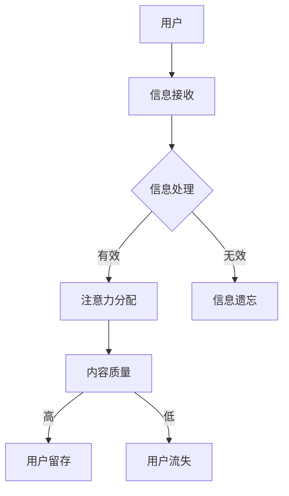

                 

关键词：注意力经济、企业战略、用户注意力、数据驱动、内容营销

摘要：本文将探讨在注意力经济时代，企业如何通过有效的战略和技巧在激烈的市场竞争中脱颖而出。我们将分析注意力经济的核心概念，探讨用户注意力的获取与保持方法，并讨论数据驱动的内容营销策略以及企业如何利用技术手段提高用户参与度。

## 1. 背景介绍

### 注意力经济的崛起

在互联网和移动设备的普及下，注意力成为了一种新的稀缺资源。注意力经济理论认为，人们的注意力是一种有限的资源，而吸引和保持用户的注意力则成为企业和品牌成功的关键。随着社交媒体平台的兴起和信息的爆炸式增长，企业必须找到创新的途径来获取用户的关注。

### 企业面临的挑战

在注意力经济中，企业面临着以下几大挑战：
- **竞争激烈**：市场上有众多企业争夺用户的注意力，竞争异常激烈。
- **用户注意力分散**：用户在处理信息时注意力容易分散，很难长时间关注单一内容。
- **内容质量要求高**：高质量的内容更容易吸引用户的注意力，同时降低用户的跳出率。
- **数据隐私和安全**：用户对个人数据的隐私和安全越来越关注，如何在不侵犯用户隐私的前提下使用数据也是一个挑战。

## 2. 核心概念与联系

### 核心概念原理

注意力经济涉及多个核心概念，包括：
- **用户注意力**：用户在处理信息时分配给特定内容或活动的精神资源。
- **信息过载**：用户接收到的信息过多，导致难以处理和筛选。
- **内容质量**：高质量内容具有更高的吸引力和留存率。

### 架构的 Mermaid 流程图



### 核心概念间的联系

- **用户注意力**直接影响**内容质量**，高质量内容能够提高用户的留存率。
- **信息过载**增加了用户在**注意力分配**时的难度，需要企业提供更有针对性的内容。
- **内容质量**是用户决定是否继续关注企业的关键因素。

## 3. 核心算法原理 & 具体操作步骤

### 3.1 算法原理概述

在注意力经济中，企业需要采用一系列策略来吸引和保持用户的注意力。这些策略包括：
- **内容个性化**：根据用户兴趣和行为推荐个性化内容。
- **互动设计**：设计吸引用户互动的内容，如问答、投票等。
- **多渠道营销**：在多个平台上发布内容，扩大用户接触面。
- **数据分析**：通过分析用户数据，优化内容营销策略。

### 3.2 算法步骤详解

#### 3.2.1 内容个性化

1. **用户画像**：收集用户的基本信息、行为数据、兴趣偏好等。
2. **内容标签**：为内容打上相应的标签，便于分类推荐。
3. **算法匹配**：使用协同过滤、内容推荐等算法，将内容与用户画像进行匹配。
4. **个性化推荐**：向用户推荐符合其兴趣的内容。

#### 3.2.2 互动设计

1. **用户需求调研**：通过问卷调查、访谈等方式了解用户需求。
2. **互动内容设计**：根据用户需求设计互动内容，如问答、投票、互动游戏等。
3. **用户参与激励**：通过积分、奖励等方式激励用户参与互动。
4. **数据分析**：分析互动效果，持续优化互动设计。

#### 3.2.3 多渠道营销

1. **平台选择**：根据目标用户群体选择合适的社交媒体和内容平台。
2. **内容同步**：将同一内容发布到多个平台，确保信息传播的广泛性。
3. **渠道管理**：对每个渠道的内容进行精细化管理和优化。
4. **效果评估**：通过数据分析评估不同渠道的营销效果。

#### 3.2.4 数据分析

1. **数据收集**：从各个渠道收集用户行为数据。
2. **数据分析**：使用数据挖掘、机器学习等方法分析用户行为。
3. **策略优化**：根据分析结果调整内容营销策略。
4. **效果监控**：实时监控营销效果，及时调整策略。

### 3.3 算法优缺点

#### 优点

- **高效吸引用户注意力**：通过个性化内容和互动设计，提高用户的参与度和留存率。
- **数据驱动决策**：基于数据分析优化营销策略，提高营销效果。
- **多渠道覆盖**：扩大用户接触面，提高品牌知名度。

#### 缺点

- **初期成本较高**：构建用户画像、算法模型等需要大量资源和投入。
- **数据隐私风险**：大量用户数据的收集和使用可能引发隐私和安全问题。
- **内容质量要求高**：高质量内容是吸引注意力的关键，但创作高质量内容需要时间和资源。

### 3.4 算法应用领域

- **电子商务**：通过个性化推荐提高销售额和用户满意度。
- **社交媒体**：通过互动设计提高用户参与度和留存率。
- **内容平台**：通过多渠道营销扩大用户基础和影响力。
- **市场营销**：通过数据分析优化营销策略，提高 ROI。

## 4. 数学模型和公式 & 详细讲解 & 举例说明

### 4.1 数学模型构建

在注意力经济中，我们可以使用贝叶斯网络来构建一个数学模型，描述用户注意力分配的过程。贝叶斯网络是一种概率图模型，可以表示变量间的条件依赖关系。

### 4.2 公式推导过程

设 \(U\) 为用户集合，\(I\) 为信息集合，\(A(u, i)\) 表示用户 \(u\) 对信息 \(i\) 的注意力分配。

1. **条件概率公式**：\[ P(A(u, i) = 1 | U, I) = \frac{P(U | A(u, i) = 1) \cdot P(I | A(u, i) = 1)}{P(U) \cdot P(I)} \]
2. **贝叶斯公式**：\[ P(U | A(u, i) = 1) = \frac{P(A(u, i) = 1 | U) \cdot P(U)}{P(A(u, i) = 1)} \]

### 4.3 案例分析与讲解

假设一个用户 \(u\) 需要从三个信息 \(i_1, i_2, i_3\) 中选择一个进行关注。我们可以构建一个简单的贝叶斯网络来描述这个过程。

1. **条件概率矩阵**：

| 信息 \(i\) | 关注概率 \(P(U | i)\) | 不关注概率 \(P(U | \neg i)\) |
| :--------: | :----------------: | :-----------------------: |
| \(i_1\)    | 0.6                | 0.4                      |
| \(i_2\)    | 0.5                | 0.5                      |
| \(i_3\)    | 0.4                | 0.6                      |

2. **贝叶斯公式应用**：

设 \(A(u, i_1) = 1\)，则用户关注 \(i_1\) 的概率为：

\[ P(A(u, i_1) = 1) = \frac{P(i_1 | A(u, i_1) = 1) \cdot P(A(u, i_1) = 1)}{P(i_1)} \]

根据贝叶斯公式：

\[ P(i_1 | A(u, i_1) = 1) = \frac{P(A(u, i_1) = 1 | i_1) \cdot P(i_1)}{P(A(u, i_1) = 1)} \]

代入条件概率矩阵：

\[ P(A(u, i_1) = 1) = \frac{0.6 \cdot 0.1}{0.6 \cdot 0.1 + 0.5 \cdot 0.2 + 0.4 \cdot 0.3} = \frac{0.06}{0.06 + 0.1 + 0.12} = \frac{0.06}{0.28} \approx 0.214 \]

同理，可以计算用户关注 \(i_2\) 和 \(i_3\) 的概率：

\[ P(A(u, i_2) = 1) \approx 0.312 \]
\[ P(A(u, i_3) = 1) \approx 0.364 \]

通过计算，我们可以得出用户关注每个信息的概率，从而优化内容营销策略。

## 5. 项目实践：代码实例和详细解释说明

### 5.1 开发环境搭建

为了演示注意力经济的算法原理，我们将使用 Python 编写一个简单的用户注意力分配模型。

1. **安装 Python**：确保安装了 Python 3.8 或更高版本。
2. **安装依赖库**：在终端中运行以下命令安装所需库：

```bash
pip install numpy matplotlib
```

### 5.2 源代码详细实现

```python
import numpy as np
import matplotlib.pyplot as plt

# 条件概率矩阵
condition_prob_matrix = np.array([
    [0.6, 0.4],
    [0.5, 0.5],
    [0.4, 0.6]
])

# 用户关注概率计算
def calculate_attention_prob(condition_prob_matrix):
    num_infos = condition_prob_matrix.shape[0]
    attention_prob = np.zeros((num_infos, 2))
    
    for i in range(num_infos):
        info_prob = np.sum(condition_prob_matrix[:, i] * np.sum(condition_prob_matrix, axis=1))
        not_info_prob = 1 - info_prob
        attention_prob[i] = [info_prob, not_info_prob]
    
    return attention_prob

# 绘制条件概率矩阵
def plot_condition_prob_matrix(condition_prob_matrix):
    fig, ax = plt.subplots()
    ax.imshow(condition_prob_matrix, cmap='hot', interpolation='nearest')
    ax.set_xticks(np.arange(condition_prob_matrix.shape[1]))
    ax.set_yticks(np.arange(condition_prob_matrix.shape[0]))
    ax.set_xticklabels(['关注', '不关注'])
    ax.set_yticklabels(['信息1', '信息2', '信息3'])
    ax.set_title('条件概率矩阵')
    plt.show()

# 计算并绘制用户关注概率
attention_prob = calculate_attention_prob(condition_prob_matrix)
plot_condition_prob_matrix(attention_prob)

# 输出结果
print("用户关注概率：")
print(attention_prob)
```

### 5.3 代码解读与分析

1. **条件概率矩阵**：条件概率矩阵 `condition_prob_matrix` 用于描述用户对不同信息的关注概率。矩阵中的元素表示用户在关注某一信息时的概率。

2. **用户关注概率计算**：`calculate_attention_prob` 函数计算用户关注每个信息的概率。通过条件概率矩阵，我们可以得到每个信息的关注概率和未关注概率。

3. **绘制条件概率矩阵**：`plot_condition_prob_matrix` 函数使用 Matplotlib 绘制条件概率矩阵的图像，便于理解用户注意力分配的过程。

4. **输出结果**：代码最后输出用户关注概率，我们可以看到用户对每个信息的关注概率。

通过这个简单的代码实例，我们实现了注意力分配的数学模型，并展示了如何使用 Python 进行计算和可视化。

## 6. 实际应用场景

### 6.1 电子商务

在电子商务领域，企业可以利用注意力经济原理来提高用户参与度和转化率。例如，通过个性化推荐系统向用户推荐符合其兴趣的商品，增加用户的购买意愿。同时，通过互动设计，如限时折扣、优惠券等，提高用户互动和购买意愿。

### 6.2 社交媒体

在社交媒体上，企业可以利用注意力经济原理来提高用户留存率和参与度。通过发布高质量的内容，如有趣的图片、视频、话题等，吸引用户关注。同时，通过互动设计，如评论、点赞、分享等，鼓励用户参与互动，提高社区活跃度。

### 6.3 内容平台

在内容平台上，企业可以通过注意力经济原理来提高用户留存率和内容消费量。通过分析用户行为数据，企业可以了解用户兴趣和偏好，为用户推荐感兴趣的内容。同时，通过互动设计，如问答、投票、互动游戏等，提高用户参与度。

### 6.4 未来应用展望

随着注意力经济的不断发展，未来将有更多应用场景出现。例如，在医疗健康领域，通过个性化推荐系统为用户提供定制化的健康建议；在教育领域，通过注意力经济原理提高学生的学习积极性和成绩；在娱乐领域，通过互动设计创造更多有趣的娱乐体验。

## 7. 工具和资源推荐

### 7.1 学习资源推荐

- 《深度学习》（Goodfellow, Bengio, Courville）：全面介绍深度学习的基本概念和应用。
- 《Python数据分析》（McKinney）：详细介绍如何使用 Python 进行数据分析和可视化。
- 《用户行为分析实战》（刘建）：详细介绍如何通过数据分析了解用户行为。

### 7.2 开发工具推荐

- Jupyter Notebook：用于编写和运行 Python 代码，方便数据分析和可视化。
- Matplotlib：用于绘制各种数据图表，展示分析结果。
- Scikit-learn：用于机器学习和数据挖掘，提供丰富的算法库。

### 7.3 相关论文推荐

- “Attention Is All You Need”（Vaswani et al.，2017）：介绍 Transformer 模型，一种基于注意力机制的深度学习模型。
- “User Behavior Analysis for Personalized Recommendation”（Zhu et al.，2018）：介绍如何通过用户行为分析进行个性化推荐。
- “Deep Learning for Text Classification”（Zhang et al.，2016）：介绍深度学习在文本分类中的应用。

## 8. 总结：未来发展趋势与挑战

### 8.1 研究成果总结

本文探讨了注意力经济在当前市场环境下的重要性，分析了企业如何通过用户注意力获取和保持策略在竞争中脱颖而出。我们介绍了注意力分配的数学模型，并通过代码实例展示了如何实现这一模型。

### 8.2 未来发展趋势

随着技术的不断发展，注意力经济将在更多领域得到应用。未来，我们将看到更多基于人工智能和大数据分析的内容推荐和个性化服务出现。同时，隐私保护和安全将成为关注重点，企业需要在数据收集和使用过程中严格遵守相关法规。

### 8.3 面临的挑战

尽管注意力经济为企业提供了新的发展机遇，但也面临一些挑战。首先，高质量内容创作需要大量资源和时间。其次，用户数据的隐私和安全问题需要得到妥善解决。最后，如何在信息过载的环境中脱颖而出，企业需要不断创新和优化内容营销策略。

### 8.4 研究展望

未来，研究将集中在如何更好地理解和利用用户注意力，提高内容推荐和个性化服务的质量。同时，如何在保护用户隐私的前提下使用数据，将成为一个重要研究方向。此外，探索注意力经济在其他领域（如医疗、教育等）的应用，也将是一个重要的趋势。

## 9. 附录：常见问题与解答

### 9.1 注意力经济是什么？

注意力经济是指企业和品牌在获取和保持用户注意力方面的策略和方法，其核心是通过高质量内容和互动设计吸引用户关注。

### 9.2 什么是贝叶斯网络？

贝叶斯网络是一种概率图模型，用于描述变量间的条件依赖关系。它通过条件概率矩阵来表示变量之间的概率关系。

### 9.3 如何进行用户画像？

用户画像是指通过收集用户的基本信息、行为数据、兴趣偏好等，构建一个完整的用户画像。常用的方法包括数据收集、数据分析、数据建模等。

### 9.4 什么是内容个性化？

内容个性化是指根据用户的兴趣和偏好，向用户推荐符合其需求的内容。通过个性化推荐，可以提高用户的参与度和满意度。

### 9.5 如何保护用户隐私？

为了保护用户隐私，企业应在数据收集和使用过程中严格遵守相关法规。例如，对用户数据进行去标识化处理，确保用户身份无法被识别。此外，应建立严格的隐私保护机制，防止数据泄露和滥用。

