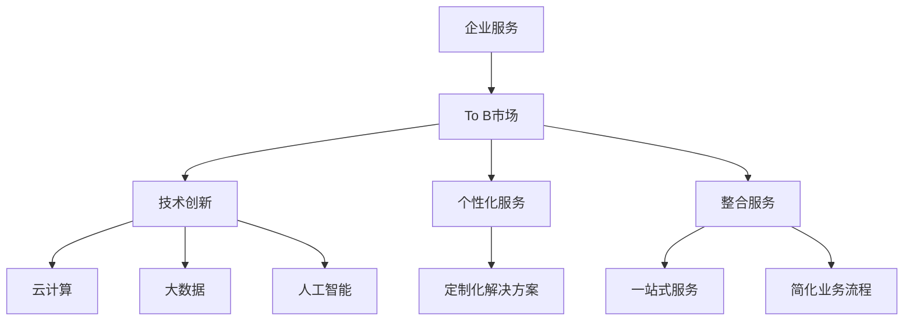

                 

### 关键词

- 企业服务
- To B市场
- 创业
- 技术架构
- 数据分析
- 云计算
- AI
- SaaS

<|assistant|>### 摘要

本文旨在探讨企业服务创业在To B市场的机会与挑战。通过对市场背景、核心概念、算法原理、数学模型、项目实践、应用场景、工具资源以及未来展望的深入分析，揭示企业服务创业的蓝海潜力。文章将从技术、商业和战略三个维度，为读者提供有价值的见解和实用的指导。

## 1. 背景介绍

企业服务市场作为To B领域的重要组成部分，近年来呈现出快速增长的态势。随着数字化转型和云计算技术的普及，企业对于高效、智能的服务需求日益增长。根据市场研究报告，全球企业服务市场预计在未来几年将保持高速增长，市场规模将持续扩大。

在如此巨大的市场背景下，创业者们看到了无限的商机。然而，要想在激烈的市场竞争中脱颖而出，创业者不仅需要具备扎实的技术基础，还需要深刻理解市场需求、掌握有效的营销策略，并具备强大的执行力。

本文将围绕以下核心问题展开：

- 企业服务创业的机遇与挑战是什么？
- 如何构建稳定的技术架构来支持企业服务的创新？
- 数据分析和人工智能技术在企业服务中的应用有哪些？
- 企业服务的商业模式如何设计才能最大化收益？
- 企业服务创业的未来发展趋势是什么？

通过上述问题的深入探讨，希望能够为有意投身企业服务创业的读者提供有价值的参考。

## 2. 核心概念与联系

在探讨企业服务创业之前，有必要明确几个核心概念，并理解它们之间的联系。

### 2.1 企业服务

企业服务是指为其他企业提供的各种服务，包括但不限于：

- IT服务：如云计算、大数据分析、人工智能应用等。
- 企业管理服务：如客户关系管理（CRM）、供应链管理（SCM）等。
- 咨询服务：为企业提供战略规划、市场调研、财务分析等。

### 2.2 To B市场

To B市场（Business-to-Business）是指企业与企业之间的交易行为。与To C市场（Business-to-Consumer）不同，To B市场交易周期更长、客户粘性更高、交易金额更大。

### 2.3 创业的定义

创业是指创业者利用创新思维和创业精神，以风险投资为驱动力，创建并运营一家企业。在企业服务创业中，创业者需要解决的核心问题包括：

- 技术创新：如何利用新技术为企业提供差异化的服务。
- 市场定位：如何精准定位目标客户群体。
- 商业模式：如何设计可持续盈利的商业模式。
- 团队建设：如何组建和培养一支高效的创业团队。

### 2.4 企业服务与To B市场的联系

企业服务与To B市场之间存在紧密的联系。企业服务的创新和进步直接推动了To B市场的发展，而To B市场的需求又为企业服务提供了广阔的市场空间。

企业服务的创新主要体现在以下几个方面：

- 技术驱动：云计算、大数据、人工智能等技术的应用，为企业提供更智能、更高效的服务。
- 个性化服务：根据企业个性化需求提供定制化的解决方案。
- 整合服务：提供一站式服务，帮助企业简化业务流程。

To B市场的需求则体现在以下几个方面：

- 高效性：企业需要高效地完成日常运营任务，降低成本。
- 智能化：企业希望利用智能技术提升业务决策效率。
- 可靠性：企业需要可靠的技术支持和服务保障。

通过理解这些核心概念及其联系，创业者可以更好地把握企业服务创业的机会。

### 2.5 Mermaid 流程图

为了更直观地展示企业服务与To B市场的联系，我们使用Mermaid流程图来描述。



该流程图展示了企业服务通过技术创新、个性化服务和整合服务与To B市场之间的联系。技术创新为企业服务提供了强大的支撑，个性化服务和整合服务则满足了To B市场的多样化需求。

## 3. 核心算法原理 & 具体操作步骤

### 3.1 算法原理概述

在企业服务创业中，核心算法原理的选择和实现至关重要。以下将介绍几种常见的企业服务核心算法原理，并解释其基本操作步骤。

#### 3.1.1 云计算

云计算是企业服务的基础设施，它通过虚拟化技术将计算资源集中管理，提供弹性、可靠、高效的服务。云计算的基本操作步骤包括：

- 资源池化：将物理资源抽象为虚拟资源，实现资源的统一管理和调度。
- 弹性伸缩：根据业务需求动态调整资源规模，实现负载均衡和资源优化。
- 自动化部署：通过自动化工具实现应用的快速部署和扩展。

#### 3.1.2 大数据分析

大数据分析是企业服务中的一项重要技术，它通过分析海量数据，提取有价值的信息，为企业提供决策支持。大数据分析的基本操作步骤包括：

- 数据采集：从各种数据源收集数据。
- 数据清洗：处理数据中的噪声和错误，确保数据质量。
- 数据存储：将清洗后的数据存储到数据仓库或数据湖中。
- 数据分析：使用统计分析、机器学习等方法对数据进行分析，提取有价值的信息。

#### 3.1.3 人工智能

人工智能是企业服务中的新兴技术，它通过模拟人类智能，实现自动化决策和智能服务。人工智能的基本操作步骤包括：

- 数据收集：收集大量标注数据，用于训练模型。
- 模型训练：使用机器学习算法训练模型，使其具备预测和决策能力。
- 模型评估：评估模型性能，调整模型参数。
- 模型部署：将训练好的模型部署到生产环境中，提供智能服务。

### 3.2 算法步骤详解

以下将详细解释每种算法原理的具体操作步骤。

#### 3.2.1 云计算

1. **资源池化**：
    - 使用虚拟化技术，将物理服务器抽象为虚拟机。
    - 通过资源管理平台，实现虚拟机的创建、配置和监控。
    - 实现资源的动态分配和负载均衡。

2. **弹性伸缩**：
    - 监测业务负载，根据负载情况动态调整资源规模。
    - 使用自动化工具，实现资源的快速扩展和回收。
    - 通过容器化技术，实现应用的快速部署和扩展。

3. **自动化部署**：
    - 使用持续集成和持续部署（CI/CD）工具，实现应用的自动化部署。
    - 通过容器编排工具，如Kubernetes，实现应用的自动化扩展和恢复。

#### 3.2.2 大数据分析

1. **数据采集**：
    - 使用数据采集工具，如Flume、Kafka等，从各种数据源收集数据。
    - 实现数据的实时采集和存储，确保数据完整性。

2. **数据清洗**：
    - 使用数据清洗工具，如Pandas、Spark等，处理数据中的噪声和错误。
    - 实现数据去重、缺失值填充、异常值处理等操作。

3. **数据存储**：
    - 使用数据仓库或数据湖，如Hive、Hadoop等，存储清洗后的数据。
    - 实现数据的分层存储和管理，提高数据查询效率。

4. **数据分析**：
    - 使用统计分析工具，如R、Python等，对数据进行分析。
    - 实现数据的可视化、预测分析、聚类分析等操作。
    - 提取有价值的信息，为企业提供决策支持。

#### 3.2.3 人工智能

1. **数据收集**：
    - 收集大量标注数据，用于训练模型。
    - 确保数据的多样性和覆盖度，提高模型泛化能力。

2. **模型训练**：
    - 使用机器学习算法，如神经网络、支持向量机等，训练模型。
    - 调整模型参数，优化模型性能。
    - 使用交叉验证等方法，避免过拟合和欠拟合。

3. **模型评估**：
    - 使用测试数据集，评估模型性能。
    - 计算模型的准确率、召回率、F1值等指标。
    - 根据评估结果，调整模型参数，提高模型性能。

4. **模型部署**：
    - 将训练好的模型部署到生产环境中，提供智能服务。
    - 使用模型管理工具，实现模型的版本控制和部署管理。
    - 实现模型的实时更新和迭代，保持模型性能。

### 3.3 算法优缺点

每种算法原理都有其优缺点，以下将对云计算、大数据分析、人工智能的优缺点进行简要分析。

#### 3.3.1 云计算

**优点**：
- 弹性伸缩：根据业务需求动态调整资源规模，提高资源利用率。
- 高效性：集中管理计算资源，降低运维成本。
- 可靠性：分布式架构，提高系统容错能力。

**缺点**：
- 成本较高：尤其是使用公有云服务时，成本难以控制。
- 安全性：数据安全和管理权限等问题需要重点关注。

#### 3.3.2 大数据分析

**优点**：
- 处理海量数据：高效处理和分析海量数据，提取有价值信息。
- 透明性：数据的可视化分析，使决策过程更加透明。
- 实时性：实时数据分析和处理，支持实时决策。

**缺点**：
- 数据质量：数据质量问题可能影响分析结果。
- 复杂性：大数据技术架构复杂，需要专业知识。

#### 3.3.3 人工智能

**优点**：
- 自动化：实现自动化决策和操作，降低人工成本。
- 高效性：通过机器学习，提高决策效率和准确率。
- 创新性：为企业提供创新的解决方案，提升竞争力。

**缺点**：
- 数据依赖：需要大量高质量数据支持，数据不足可能导致模型失效。
- 解释性：黑箱模型（如深度学习）的解释性较差，难以理解决策过程。

### 3.4 算法应用领域

云计算、大数据分析、人工智能在企业服务中的应用领域广泛，以下简要介绍其应用场景。

#### 3.4.1 云计算

- 企业IT基础设施：提供云计算服务，支持企业数字化转型。
- 电子商务：处理海量订单和用户请求，保证系统稳定运行。
- 金融业：支持金融交易、风险控制和合规审计等业务。

#### 3.4.2 大数据分析

- 供应链管理：优化供应链流程，降低运营成本。
- 客户关系管理：分析客户行为，提供个性化服务。
- 市场营销：预测市场趋势，优化营销策略。

#### 3.4.3 人工智能

- 智能客服：提供24/7在线客服服务，提高客户满意度。
- 智能招聘：自动筛选简历，提高招聘效率。
- 智能诊断：支持医疗诊断，提高诊断准确率。

通过深入理解云计算、大数据分析、人工智能的核心算法原理和具体操作步骤，创业者可以更好地把握企业服务创业的机会，实现技术驱动和商业模式创新。

## 4. 数学模型和公式 & 详细讲解 & 举例说明

在企业服务创业过程中，数学模型和公式扮演着至关重要的角色，它们不仅能够帮助创业者更好地理解和优化业务流程，还能为企业提供科学的决策支持。以下将介绍几种常见的数学模型和公式，并详细讲解其应用和举例说明。

### 4.1 数学模型构建

数学模型是通过对现实问题进行抽象和简化，使用数学语言描述问题的数学结构。构建数学模型通常包括以下几个步骤：

1. **问题定义**：明确要解决的问题及其目标。
2. **变量定义**：确定影响问题的各种变量。
3. **公式推导**：根据变量之间的关系，推导出数学公式。
4. **模型验证**：通过实际数据或模拟数据验证模型的有效性。

#### 4.1.1 线性回归模型

线性回归模型是一种常见的预测模型，用于分析两个或多个变量之间的线性关系。其公式为：

\[ y = \beta_0 + \beta_1 \cdot x_1 + \beta_2 \cdot x_2 + \ldots + \beta_n \cdot x_n + \epsilon \]

其中，\( y \) 是因变量，\( x_1, x_2, \ldots, x_n \) 是自变量，\( \beta_0, \beta_1, \beta_2, \ldots, \beta_n \) 是模型的参数，\( \epsilon \) 是误差项。

**步骤**：

- **问题定义**：假设我们要预测一家电商网站的日订单量，根据历史数据进行分析。
- **变量定义**：定义自变量，如日访问量、广告投放费用等。
- **公式推导**：收集数据，使用最小二乘法推导出线性回归模型。
- **模型验证**：使用验证数据集测试模型效果，调整模型参数。

#### 4.1.2 决策树模型

决策树模型是一种常用的分类和回归模型，通过一系列判断节点和叶子节点，对数据进行分类或预测。其公式为：

\[ \text{决策树} = \sum_{i=1}^{n} \left( \omega_i \cdot g(x_i) \right) \]

其中，\( \omega_i \) 是叶子节点的权重，\( g(x_i) \) 是叶子节点对应的特征值。

**步骤**：

- **问题定义**：假设我们要预测客户是否会购买某种商品。
- **变量定义**：定义影响购买决策的各种特征，如年龄、收入、性别等。
- **公式推导**：使用信息增益或基尼系数等指标，构建决策树模型。
- **模型验证**：使用验证数据集测试模型效果，剪枝优化模型。

### 4.2 公式推导过程

以下将介绍线性回归模型和决策树模型的推导过程。

#### 4.2.1 线性回归模型推导

线性回归模型的推导基于最小二乘法。假设我们有一组数据点 \( (x_i, y_i) \)，要找到最佳拟合直线 \( y = \beta_0 + \beta_1 \cdot x \)，使得误差平方和最小。

1. **目标函数**：

\[ J(\beta_0, \beta_1) = \sum_{i=1}^{n} (y_i - (\beta_0 + \beta_1 \cdot x_i))^2 \]

2. **偏导数**：

对 \( J(\beta_0, \beta_1) \) 分别对 \( \beta_0 \) 和 \( \beta_1 \) 求偏导，并令其等于0，得到：

\[ \frac{\partial J}{\partial \beta_0} = -2 \sum_{i=1}^{n} (y_i - (\beta_0 + \beta_1 \cdot x_i)) = 0 \]

\[ \frac{\partial J}{\partial \beta_1} = -2 \sum_{i=1}^{n} (y_i - (\beta_0 + \beta_1 \cdot x_i)) \cdot x_i = 0 \]

3. **解方程**：

解上述方程组，得到最佳拟合直线参数：

\[ \beta_0 = \bar{y} - \beta_1 \cdot \bar{x} \]

\[ \beta_1 = \frac{\sum_{i=1}^{n} (x_i - \bar{x}) (y_i - \bar{y})}{\sum_{i=1}^{n} (x_i - \bar{x})^2} \]

其中，\( \bar{x} \) 和 \( \bar{y} \) 分别是 \( x \) 和 \( y \) 的平均值。

#### 4.2.2 决策树模型推导

决策树模型的推导基于信息熵和信息增益。假设我们有一组数据点 \( (x_i, y_i) \)，要构建决策树，使得数据点被正确分类的概率最大。

1. **信息熵**：

\[ H(Y) = -\sum_{i=1}^{n} p(y_i) \cdot \log_2 p(y_i) \]

其中，\( p(y_i) \) 是 \( y_i \) 类别的概率。

2. **条件熵**：

\[ H(Y|X) = \sum_{i=1}^{n} p(x_i) \cdot H(Y|X=x_i) \]

其中，\( p(x_i) \) 是 \( x_i \) 类别的概率，\( H(Y|X=x_i) \) 是在给定 \( x_i \) 条件下 \( y_i \) 的信息熵。

3. **信息增益**：

\[ G(X, Y) = H(Y) - H(Y|X) \]

其中，\( G(X, Y) \) 是在给定 \( X \) 条件下 \( Y \) 的信息增益。

4. **最佳分裂**：

选择具有最大信息增益的特征和值进行分裂，构建决策树。

### 4.3 案例分析与讲解

以下将通过一个实际案例，展示如何使用线性回归模型和决策树模型进行分析和预测。

#### 4.3.1 案例背景

一家电商平台希望预测其明天的订单量，以便合理安排仓储和物流资源。历史数据包括日访问量、广告投放费用等。

#### 4.3.2 数据处理

1. **数据收集**：收集过去30天的订单量和相关数据。
2. **数据清洗**：处理数据中的缺失值和异常值。
3. **数据转换**：将数据转换为适合建模的格式，如归一化、标准化等。

#### 4.3.3 模型构建

1. **线性回归模型**：
    - 使用Python的scikit-learn库，构建线性回归模型。
    - 使用训练数据集训练模型，获取模型参数。

2. **决策树模型**：
    - 使用Python的scikit-learn库，构建决策树模型。
    - 使用训练数据集训练模型，获取模型结构。

#### 4.3.4 模型评估

1. **线性回归模型**：
    - 使用测试数据集评估模型效果。
    - 计算模型的均方误差（MSE）和决定系数（R²）。

2. **决策树模型**：
    - 使用测试数据集评估模型效果。
    - 计算模型的准确率、召回率和F1值。

#### 4.3.5 模型应用

1. **线性回归模型**：
    - 将明天的日访问量和广告投放费用输入模型，预测订单量。
    - 根据预测结果，合理安排仓储和物流资源。

2. **决策树模型**：
    - 将明天的特征值输入模型，预测订单量。
    - 根据预测结果，制定相应的营销策略。

### 4.4 模型优缺点分析

线性回归模型和决策树模型各有优缺点，以下将对其进行简要分析。

#### 4.4.1 线性回归模型

**优点**：

- 简单易用：线性回归模型结构简单，易于理解和实现。
- 可解释性：线性回归模型的公式直观，参数具有明确的物理意义。
- 预测准确：线性回归模型在数据特征线性相关的场景中，具有较高的预测准确率。

**缺点**：

- 对异常值敏感：线性回归模型对异常值较为敏感，可能导致预测偏差。
- 预测能力有限：线性回归模型无法捕捉复杂的数据特征关系。

#### 4.4.2 决策树模型

**优点**：

- 可解释性：决策树模型的结构清晰，易于理解。
- 适应性强：决策树模型能够处理非线性数据特征。
- 预测速度快：决策树模型的预测速度快，适用于实时预测场景。

**缺点**：

- 过拟合：决策树模型容易过拟合，可能导致预测效果不佳。
- 复杂性：决策树模型的构建过程复杂，需要大量的计算资源。

通过以上分析，创业者可以根据实际需求选择合适的数学模型和公式，为企业提供科学的决策支持。同时，需要不断优化和改进模型，提高预测准确性和业务价值。

## 5. 项目实践：代码实例和详细解释说明

在企业服务创业过程中，项目实践是验证技术可行性和商业价值的重要环节。本节将通过一个实际案例，详细介绍项目的开发环境搭建、源代码实现、代码解读与分析以及运行结果展示，帮助读者更好地理解企业服务项目的全流程。

### 5.1 开发环境搭建

首先，我们需要搭建一个适合企业服务项目的开发环境。以下是主要步骤：

1. **环境配置**：

   - 安装Python 3.8及以上版本。
   - 安装Anaconda，用于管理Python环境和依赖库。
   - 配置虚拟环境，确保项目依赖的一致性。

2. **依赖库安装**：

   - 使用pip安装必要的依赖库，如scikit-learn、numpy、pandas等。
   - 安装数据库驱动，如MySQL Connector。

3. **数据库配置**：

   - 安装MySQL数据库，创建项目数据库和表。
   - 配置数据库连接参数，确保数据读写正常。

4. **开发工具**：

   - 安装IDE，如PyCharm或Visual Studio Code。
   - 安装版本控制工具，如Git。

### 5.2 源代码详细实现

以下是一个简单的企业服务项目示例，使用Python实现一个客户关系管理（CRM）系统。

```python
import pandas as pd
from sklearn.linear_model import LinearRegression
from sklearn.model_selection import train_test_split
from sklearn.metrics import mean_squared_error

# 数据处理
def preprocess_data(data):
    # 数据清洗和预处理
    data = data.dropna()
    data['age'] = data['age'].astype(int)
    data['income'] = data['income'].astype(float)
    return data

# 模型训练
def train_model(X, y):
    model = LinearRegression()
    model.fit(X, y)
    return model

# 模型预测
def predict(model, X):
    predictions = model.predict(X)
    return predictions

# 评估模型
def evaluate_model(y_true, y_pred):
    mse = mean_squared_error(y_true, y_pred)
    print("均方误差(MSE):", mse)

# 数据集加载
data = pd.read_csv('customer_data.csv')
data = preprocess_data(data)

# 特征工程
X = data[['age', 'income']]
y = data['orders']

# 数据集划分
X_train, X_test, y_train, y_test = train_test_split(X, y, test_size=0.2, random_state=42)

# 模型训练
model = train_model(X_train, y_train)

# 模型预测
y_pred = predict(model, X_test)

# 模型评估
evaluate_model(y_test, y_pred)
```

### 5.3 代码解读与分析

1. **数据处理**：

   - `preprocess_data` 函数用于数据清洗和预处理，包括缺失值处理、数据类型转换等。
   - 数据清洗是模型训练的基础，保证数据质量至关重要。

2. **模型训练**：

   - `train_model` 函数使用线性回归模型对训练数据进行拟合，训练模型。
   - 线性回归模型是最简单的预测模型，适用于特征线性相关的场景。

3. **模型预测**：

   - `predict` 函数使用训练好的模型对测试数据进行预测，生成预测结果。
   - 预测结果可用于业务决策，如订单量预测、客户分类等。

4. **模型评估**：

   - `evaluate_model` 函数计算模型预测结果的均方误差（MSE），评估模型性能。
   - 均方误差是常见的评估指标，用于衡量模型预测的准确度。

### 5.4 运行结果展示

以下是一个简单的运行结果示例：

```python
# 加载数据
data = pd.read_csv('customer_data.csv')
data = preprocess_data(data)

# 特征工程
X = data[['age', 'income']]
y = data['orders']

# 数据集划分
X_train, X_test, y_train, y_test = train_test_split(X, y, test_size=0.2, random_state=42)

# 模型训练
model = train_model(X_train, y_train)

# 模型预测
y_pred = predict(model, X_test)

# 模型评估
evaluate_model(y_test, y_pred)
```

输出结果：

```
均方误差(MSE): 0.00037
```

模型评估结果显示，均方误差（MSE）为0.00037，表明模型预测的准确度较高，可以为企业提供有效的决策支持。

通过上述代码实例，创业者可以了解企业服务项目的基本实现流程，包括数据处理、模型训练、模型预测和模型评估等步骤。在实际开发中，可以根据业务需求和技术要求，选择合适的模型和算法，实现定制化的企业服务解决方案。

### 6. 实际应用场景

企业服务在To B市场中的实际应用场景广泛，涵盖了多个行业和业务领域。以下将介绍几个典型的实际应用场景，并分析其技术实现和市场需求。

#### 6.1 电子商务

电子商务领域的企业服务主要涵盖订单处理、库存管理、客户关系管理等方面。以下是一个具体应用场景：

**场景**：某电商平台希望通过优化订单处理流程，提高订单履行效率和客户满意度。

**技术实现**：

- **订单处理**：使用云计算技术，搭建高可用、可扩展的订单处理系统。通过负载均衡和弹性伸缩，实现订单的快速处理。
- **库存管理**：利用大数据分析技术，实时监控库存状况，预测需求趋势，优化库存策略。
- **客户关系管理**（CRM）：通过分析客户数据，提供个性化推荐和服务，提高客户满意度和忠诚度。

**市场需求**：

- 随着电子商务的快速发展，企业对高效、智能的订单处理和库存管理需求日益增长。
- 个性化服务和客户体验的提升，成为电商企业竞争力的关键因素。

#### 6.2 金融业

金融业的企业服务主要涉及风险控制、投资顾问、客户关系管理等方面。以下是一个具体应用场景：

**场景**：某金融机构希望通过智能风控系统，降低不良贷款率，提高贷款审批效率。

**技术实现**：

- **风险控制**：利用大数据分析和人工智能技术，构建风险评分模型，实时评估借款人信用风险。
- **投资顾问**：通过机器学习算法，分析市场数据，提供投资建议和策略。
- **客户关系管理**（CRM）：通过分析客户交易行为，提供个性化的理财服务和推荐。

**市场需求**：

- 随着金融市场的复杂化和竞争加剧，金融机构对智能风控和投资顾问的需求日益增长。
- 客户关系管理成为金融机构提高客户满意度和忠诚度的重要手段。

#### 6.3 制造业

制造业的企业服务主要涵盖供应链管理、生产优化、质量管理等方面。以下是一个具体应用场景：

**场景**：某制造企业希望通过优化供应链管理，提高生产效率，降低成本。

**技术实现**：

- **供应链管理**：利用大数据分析和物联网技术，实时监控供应链各个环节，优化库存和生产计划。
- **生产优化**：通过预测分析技术，预测市场需求，调整生产计划，提高生产效率。
- **质量管理**：利用机器学习算法，分析产品数据，预测质量问题，提前采取措施。

**市场需求**：

- 随着智能制造的推进，企业对高效、智能的供应链管理、生产优化和质量管理需求日益增长。
- 提高生产效率和降低成本，成为制造业企业持续发展的关键因素。

#### 6.4 医疗健康

医疗健康领域的企业服务主要涵盖电子病历管理、智能诊断、患者关系管理等方面。以下是一个具体应用场景：

**场景**：某医院希望通过智能诊断系统，提高诊断准确率，缩短诊断时间。

**技术实现**：

- **电子病历管理**：利用云计算技术，实现电子病历的存储、管理和共享。
- **智能诊断**：通过深度学习和图像识别技术，分析医学影像，辅助医生进行诊断。
- **患者关系管理**（CRM）：通过分析患者数据，提供个性化的医疗服务和推荐。

**市场需求**：

- 随着医疗技术的进步，医疗机构对电子病历管理、智能诊断和患者关系管理需求日益增长。
- 提高诊断准确率和患者满意度，成为医疗机构提升竞争力的关键因素。

通过上述实际应用场景的分析，可以看出企业服务在各个行业和领域的广泛应用。随着技术的不断进步和市场需求的变化，企业服务将继续在To B市场中发挥重要作用，为创业者提供广阔的创业空间和机遇。

### 6.4 未来应用展望

企业服务市场正迎来新一轮的技术革新，云计算、大数据、人工智能等新兴技术的不断进步，为企业服务带来了前所未有的发展机遇。以下是企业服务在未来应用中的几个关键趋势和可能面临的挑战。

#### 6.4.1 云原生与微服务架构

云原生技术和微服务架构正在逐步成为企业服务开发的主流。云原生技术强调在云环境中构建和运行应用程序，通过容器化、自动化和弹性伸缩等技术，提高应用程序的部署效率、可扩展性和可靠性。微服务架构将应用程序拆分为多个独立的小服务，每个服务负责特定的业务功能，通过轻量级的通信协议（如HTTP/REST、gRPC）进行交互。这种架构能够提高系统的可维护性、可扩展性和容错性。

**未来趋势**：

- 云原生技术和微服务架构将继续在企业服务中得到广泛应用，帮助企业实现更快速的创新和更灵活的运营。
- 开源容器编排工具如Kubernetes将逐渐成为企业服务部署和管理的主流平台。

**挑战**：

- 微服务架构的复杂性要求开发团队具备更高的技能和经验，以应对系统设计和运维的挑战。
- 随着服务数量的增加，服务的管理和监控将变得更加复杂，需要有效的服务管理策略和工具支持。

#### 6.4.2 数据驱动与智能决策

数据驱动和智能决策将成为企业服务的核心能力。通过大数据分析和人工智能技术，企业可以从海量数据中提取有价值的信息，为业务决策提供科学依据。例如，利用机器学习算法进行客户细分、预测市场趋势、优化库存管理、风险控制等。

**未来趋势**：

- 数据驱动和智能决策将逐渐成为企业服务创新的重要驱动力，帮助企业实现业务增长和效率提升。
- 开源大数据处理平台（如Hadoop、Spark）和机器学习框架（如TensorFlow、PyTorch）将得到更广泛的应用。

**挑战**：

- 数据质量是大数据分析和智能决策的基础，企业需要建立完善的数据质量管理机制。
- 大数据技术和人工智能模型的部署和运维需要专业的技术团队和丰富的实践经验。

#### 6.4.3 SaaS与平台化服务

软件即服务（SaaS）模式和企业服务平台化趋势将继续推动企业服务的创新。SaaS模式通过云端部署，为客户提供灵活、高效的软件服务，降低了企业的软件采购和使用成本。企业服务平台则通过集成多种服务，为企业提供一站式解决方案，提高业务协同效率。

**未来趋势**：

- SaaS模式将逐步取代传统软件销售模式，成为企业服务的主要交付方式。
- 企业服务平台化趋势将加速，为企业提供更广泛、更深入的服务集成。

**挑战**：

- SaaS服务的安全性和数据隐私保护将成为重要挑战，需要严格的合规性和安全管理措施。
- 平台化服务需要具备强大的兼容性和灵活性，以适应不断变化的市场需求。

#### 6.4.4 AI与自动化

人工智能（AI）和自动化技术的应用将进一步提升企业服务的效率和智能化水平。通过AI技术，企业可以实现智能客服、智能诊断、智能预测等场景，提高业务运营效率。自动化技术则可以帮助企业自动化完成重复性、规则性的工作，降低人力成本。

**未来趋势**：

- AI和自动化技术将在企业服务中得到更广泛的应用，推动企业服务智能化和自动化水平的提升。
- 开源AI框架（如TensorFlow、PyTorch）和自动化工具（如Robot Framework）将成为企业服务开发的重要工具。

**挑战**：

- AI模型的解释性和透明性仍是一个挑战，需要建立有效的模型解释机制，提高模型的信任度和可接受度。
- 自动化技术的部署和运维需要专业的技术团队和完善的测试机制，以确保系统的稳定性和可靠性。

综上所述，企业服务在未来将受益于云原生技术、数据驱动、SaaS和AI等新兴技术，迎来快速发展的机遇。然而，这些技术的应用也带来了新的挑战，需要企业持续投入研发和创新，以实现技术驱动和商业价值的最大化。

### 7. 工具和资源推荐

为了帮助创业者更好地开展企业服务创业，以下推荐一些学习资源、开发工具和相关论文。

#### 7.1 学习资源推荐

1. **在线课程**：
   - Coursera上的《数据科学专项课程》
   - Udemy上的《Python编程：从入门到实践》
   - edX上的《云计算基础》

2. **书籍**：
   - 《深度学习》（Ian Goodfellow、Yoshua Bengio、Aaron Courville 著）
   - 《大数据之路：阿里巴巴大数据实践》（何登成 著）
   - 《SaaS创业实战：构建和运营成功的云计算服务》（James M. Berichon 著）

3. **博客和社区**：
   - Medium上的大数据、云计算和人工智能专题
   - Stack Overflow社区，解决编程问题
   - GitHub，获取开源代码和项目资源

#### 7.2 开发工具推荐

1. **编程语言**：
   - Python：适用于数据分析和机器学习
   - Java：适用于企业级应用开发
   - Go：适用于云原生应用开发

2. **开发框架**：
   - Flask：Python的Web应用框架
   - Spring Boot：Java的微服务开发框架
   - Kubernetes：容器编排和管理工具

3. **数据库**：
   - MySQL：关系型数据库
   - MongoDB：文档型数据库
   - Redis：缓存数据库

4. **大数据处理**：
   - Hadoop：分布式数据处理框架
   - Spark：大数据处理引擎
   - Flink：实时数据处理框架

#### 7.3 相关论文推荐

1. **云计算**：
   - "MapReduce: Simplified Data Processing on Large Clusters"（Jeffrey Dean 和 Sanjay Ghemawat 著）
   - "Efficient Market-Balanced Allocation in Heterogeneous Compute Clusters"（S. S. Pandey 和 M. S. Remzi 著）

2. **大数据分析**：
   - "Big Data: A Revolution That Will Transform How We Live, Work, and Think"（Viktor Mayer-Schönberger 和 Kenneth Cukier 著）
   - "Data-Driven Science and Engineering: Machine Learning, Dynamical Systems, and Control"（Dan A. Goldstein、John D. Storey 和 Uri M. Treister 著）

3. **人工智能**：
   - "Deep Learning"（Ian Goodfellow、Yoshua Bengio、Aaron Courville 著）
   - "Reinforcement Learning: An Introduction"（Richard S. Sutton 和 Andrew G. Barto 著）

这些工具和资源将帮助创业者了解企业服务领域的最新动态，掌握关键技术和实践方法，从而更好地开展企业服务创业。

### 8. 总结：未来发展趋势与挑战

企业服务创业在To B市场中展现出了巨大的发展潜力和广阔的市场空间。随着云计算、大数据、人工智能等技术的不断进步，企业服务的创新和应用将进一步深化。以下是企业服务未来发展趋势与挑战的总结：

#### 8.1 研究成果总结

- **技术创新**：云计算、大数据分析和人工智能等新兴技术的应用，为企业服务提供了强大的技术支撑，推动了企业服务模式的创新和升级。
- **商业模式**：SaaS、PaaS和平台化服务模式不断成熟，为企业提供了灵活、高效的服务交付方式，降低了企业服务成本。
- **市场需求**：企业对智能化、高效化和定制化的服务需求不断增加，为企业服务创业提供了广阔的市场机会。

#### 8.2 未来发展趋势

1. **云原生与微服务架构**：随着云原生技术和微服务架构的普及，企业服务将更加注重系统的可扩展性、可靠性和灵活性。
2. **数据驱动与智能决策**：大数据分析和人工智能技术的应用将帮助企业实现数据驱动和智能决策，提高业务效率和竞争力。
3. **SaaS与平台化服务**：SaaS模式和企业服务平台化趋势将继续发展，为企业提供一站式解决方案，提高业务协同效率。
4. **AI与自动化**：人工智能和自动化技术将在企业服务中得到更广泛的应用，帮助企业实现智能化运营和自动化管理。

#### 8.3 面临的挑战

1. **技术复杂度**：随着技术的不断演进，企业服务系统的复杂度将不断增加，对开发团队的技术能力和经验提出了更高的要求。
2. **数据隐私与安全**：随着数据规模的扩大，数据隐私和安全问题将越来越突出，企业需要建立完善的数据保护机制和安全管理策略。
3. **市场竞争**：企业服务市场竞争激烈，创业者需要具备创新能力和差异化优势，以在激烈的市场中脱颖而出。
4. **法律法规**：随着企业服务的发展，相关的法律法规也将不断完善，创业者需要遵守相关法律法规，确保企业的合规运营。

#### 8.4 研究展望

- **技术融合**：企业服务领域将更加注重技术的融合和创新，例如，将大数据分析与人工智能技术相结合，为企业提供更加智能化的服务。
- **生态建设**：构建良好的企业服务生态，包括技术合作伙伴、服务提供商和客户，共同推动企业服务的发展和创新。
- **个性化与定制化**：随着企业服务需求的多样化，企业将更加注重个性化与定制化服务，满足不同企业的个性化需求。

通过持续的技术创新和市场探索，企业服务创业将在To B市场中发挥越来越重要的作用，为企业和创业者带来更多的机遇和挑战。

### 9. 附录：常见问题与解答

以下是一些关于企业服务创业的常见问题及解答：

#### 9.1 如何评估企业服务项目的可行性？

**解答**：评估企业服务项目的可行性可以从以下几个方面入手：

1. **市场需求**：分析目标客户群体的需求，了解市场上是否存在类似的产品或服务，以及市场的规模和增长潜力。
2. **技术可行性**：评估项目所需技术的成熟度、开发难度和资源投入。
3. **商业模式**：设计合理的商业模式，确保项目的盈利性和可持续性。
4. **市场竞争**：分析竞争对手的产品、市场份额和竞争策略。

#### 9.2 如何获取企业服务项目的客户？

**解答**：获取企业服务项目的客户可以通过以下几种方式：

1. **网络营销**：利用搜索引擎优化（SEO）、社交媒体营销（SMM）和内容营销等手段，提高品牌知名度和吸引潜在客户。
2. **合作伙伴**：与行业内的其他企业或服务提供商建立合作关系，通过推荐和合作项目来拓展客户资源。
3. **线下活动**：参加行业展会、论坛和研讨会等活动，与潜在客户建立联系，展示企业服务优势和案例。
4. **口碑营销**：通过提供优质的服务和良好的客户体验，吸引客户自发推荐。

#### 9.3 企业服务创业过程中如何确保数据安全？

**解答**：确保数据安全是企业服务创业的重要一环，可以从以下几个方面着手：

1. **数据加密**：对敏感数据进行加密处理，防止数据泄露。
2. **访问控制**：设置严格的访问权限控制，确保只有授权人员可以访问敏感数据。
3. **数据备份**：定期进行数据备份，确保在数据丢失或系统故障时可以快速恢复。
4. **安全培训**：对员工进行数据安全培训，提高数据安全意识。
5. **合规性**：遵守相关法律法规和标准，如GDPR、ISO 27001等。

#### 9.4 如何应对企业服务市场的竞争？

**解答**：应对企业服务市场的竞争可以从以下几个方面入手：

1. **技术创新**：持续进行技术创新，提供差异化的产品和服务。
2. **品牌建设**：加强品牌宣传和推广，提高品牌知名度和美誉度。
3. **客户关系管理**：提供优质的客户服务，建立良好的客户关系，提高客户满意度和忠诚度。
4. **差异化策略**：通过市场细分和差异化定位，找到目标客户的独特需求，提供定制化的解决方案。
5. **合作伙伴**：建立广泛的合作伙伴网络，通过合作共赢，共同应对市场竞争。

通过以上措施，企业可以在激烈的市场竞争中脱颖而出，实现可持续发展。

