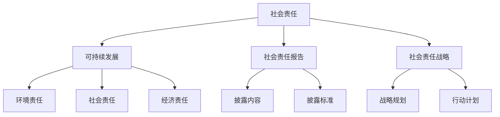

                 

关键词：企业社会责任，可持续发展，社会责任管理，社会责任报告，可持续发展战略，平衡利润和社会影响

> 摘要：本文旨在探讨企业如何通过社会责任管理来平衡利润和社会影响，实现可持续发展。文章从背景介绍、核心概念与联系、核心算法原理、数学模型与公式、项目实践、实际应用场景、工具和资源推荐、总结与展望等方面，全面剖析了企业社会责任管理的理论与实践。

## 1. 背景介绍

随着全球化进程的加速和信息技术的发展，企业社会责任（CSR）已经成为全球商业环境中的重要议题。企业不仅需要追求利润最大化，还需要关注其在社会、环境等方面的责任和影响。这种观念的转变源于以下几个方面的因素：

1. **消费者需求**：现代消费者越来越关注企业的社会责任行为，他们愿意支持那些积极履行社会责任的企业。
2. **政府监管**：各国政府纷纷出台相关法律法规，要求企业披露社会责任报告，以确保企业的可持续发展。
3. **投资者关注**：越来越多的投资者开始将企业的社会责任表现作为投资决策的重要依据。

在这种背景下，企业社会责任管理成为企业管理的重要内容。社会责任管理不仅有助于提升企业形象，还能为企业带来实际的经济效益，如降低运营成本、提高员工满意度、吸引和留住优秀人才等。

## 2. 核心概念与联系

为了更好地理解企业社会责任管理，我们需要先了解以下几个核心概念：

1. **社会责任**：企业对社会应尽的责任和义务，包括经济责任、法律责任、伦理责任和慈善责任。
2. **可持续发展**：企业在满足当前需求的同时，不损害未来世代满足其需求的能力。
3. **社会责任报告**：企业披露社会责任行为和绩效的正式文档。
4. **社会责任战略**：企业制定和实施的一系列策略和计划，以实现其社会责任目标。

下面是一个Mermaid流程图，展示了这些概念之间的联系：



### 2.1 社会责任与可持续发展

社会责任与可持续发展密切相关。企业履行社会责任，如环境保护、慈善捐赠、员工培训等，都是为了实现长期的可持续发展。可持续发展不仅关注企业的经济效益，还关注其社会和环境效益。通过社会责任管理，企业可以确保其经营活动不会对环境和社区造成负面影响，从而实现长期的可持续发展。

### 2.2 社会责任报告与社会责任战略

社会责任报告是企业披露社会责任行为和绩效的重要工具。通过社会责任报告，企业可以展示其社会责任战略的实施情况，增强公众对其社会责任行为的信任。社会责任战略则是企业为实现其社会责任目标而制定的一系列策略和计划。社会责任报告与社会责任战略相互关联，共同推动企业的可持续发展。

## 3. 核心算法原理 & 具体操作步骤

### 3.1 算法原理概述

企业社会责任管理涉及到多个方面的算法原理，主要包括：

1. **数据收集与处理**：通过数据分析，收集企业社会责任相关数据，包括环境、社会、经济等方面。
2. **评估与排名**：根据社会责任指标，对企业社会责任表现进行评估和排名。
3. **优化与改进**：根据评估结果，提出改进措施，优化企业的社会责任管理策略。

### 3.2 算法步骤详解

1. **数据收集与处理**

   数据收集是企业社会责任管理的第一步。企业可以通过内部系统、外部数据源等多种途径收集社会责任数据。数据处理包括数据清洗、数据整合和数据转换等步骤。

2. **评估与排名**

   评估与排名是确定企业社会责任表现的关键。企业可以根据社会责任指标，如环境保护、员工权益、慈善捐赠等，对社会责任表现进行评估和排名。

3. **优化与改进**

   根据评估结果，企业可以提出改进措施，优化社会责任管理策略。这包括调整资源配置、制定新的社会责任计划、提高员工培训等。

### 3.3 算法优缺点

**优点**：

1. **数据驱动**：企业社会责任管理是基于数据驱动的方法，可以更客观地评估企业的社会责任表现。
2. **持续改进**：通过持续的数据分析和评估，企业可以不断优化社会责任管理策略，提高社会责任绩效。

**缺点**：

1. **数据质量**：数据质量对评估结果有重要影响。如果数据存在偏差或错误，评估结果可能会失真。
2. **成本较高**：企业社会责任管理需要投入大量的人力和物力资源，成本较高。

### 3.4 算法应用领域

企业社会责任管理算法主要应用于以下几个领域：

1. **企业社会责任报告编制**：通过数据分析，编制符合国际标准的企业社会责任报告。
2. **社会责任投资**：投资者可以通过企业社会责任管理算法，评估企业的社会责任表现，做出更明智的投资决策。
3. **企业管理优化**：企业可以通过企业社会责任管理算法，优化社会责任管理策略，提高社会责任绩效。

## 4. 数学模型和公式 & 详细讲解 & 举例说明

### 4.1 数学模型构建

企业社会责任管理的数学模型主要基于数据分析和优化理论。我们可以使用以下数学模型来构建企业社会责任管理的框架：

1. **社会责任绩效指标模型**：

   $$ 
   P = w_1 \cdot E + w_2 \cdot S + w_3 \cdot C
   $$

   其中，$P$ 表示社会责任绩效，$E$ 表示环境保护，$S$ 表示社会贡献，$C$ 表示慈善捐赠。$w_1$、$w_2$、$w_3$ 分别为三个指标的权重。

2. **社会责任成本模型**：

   $$ 
   C = c_1 \cdot E + c_2 \cdot S + c_3 \cdot C
   $$

   其中，$C$ 表示社会责任成本，$c_1$、$c_2$、$c_3$ 分别为三个指标的系数。

### 4.2 公式推导过程

社会责任绩效指标模型和成本模型的推导过程如下：

1. **社会责任绩效指标模型**：

   社会责任绩效是衡量企业社会责任表现的关键指标。根据社会责任的三个方面（环境保护、社会贡献、慈善捐赠），我们可以构建一个综合指标模型。假设每个方面的重要程度不同，我们可以通过权重来体现这种差异。

2. **社会责任成本模型**：

   社会责任成本是企业为履行社会责任而投入的资源。同样，我们可以根据环境保护、社会贡献、慈善捐赠三个方面，构建一个成本模型。系数代表每个方面所需的成本。

### 4.3 案例分析与讲解

假设一家企业在社会责任方面的表现如下：

1. **环境保护**：企业每年减少二氧化碳排放5000吨。
2. **社会贡献**：企业参与慈善捐赠100万元。
3. **慈善捐赠**：企业为员工提供培训，费用为50万元。

我们可以使用上述数学模型来计算该企业的社会责任绩效和成本。

**社会责任绩效**：

$$ 
P = w_1 \cdot E + w_2 \cdot S + w_3 \cdot C
$$

其中，$E = 5000$（吨），$S = 100$（万元），$C = 50$（万元）。假设权重分别为 $w_1 = 0.4$，$w_2 = 0.3$，$w_3 = 0.3$，则：

$$ 
P = 0.4 \cdot 5000 + 0.3 \cdot 100 + 0.3 \cdot 50 = 2000 + 30 + 15 = 2135
$$

**社会责任成本**：

$$ 
C = c_1 \cdot E + c_2 \cdot S + c_3 \cdot C
$$

其中，$c_1 = 10$（万元/吨），$c_2 = 5$（万元），$c_3 = 2$（万元）。则：

$$ 
C = 10 \cdot 5000 + 5 \cdot 100 + 2 \cdot 50 = 50000 + 500 + 100 = 51100
$$

通过上述计算，我们可以得出该企业的社会责任绩效为2135，社会责任成本为51100。

## 5. 项目实践：代码实例和详细解释说明

### 5.1 开发环境搭建

为了演示企业社会责任管理的具体实现，我们选择Python作为编程语言，使用Jupyter Notebook作为开发环境。首先，我们需要安装以下Python库：

- pandas：数据处理
- numpy：数学计算
- matplotlib：数据可视化
- seaborn：数据可视化

您可以使用以下命令安装这些库：

```bash
pip install pandas numpy matplotlib seaborn
```

### 5.2 源代码详细实现

下面是一个简单的企业社会责任管理代码实例，包括数据收集、处理、分析和可视化。

```python
import pandas as pd
import numpy as np
import matplotlib.pyplot as plt
import seaborn as sns

# 5.2.1 数据收集

# 社会责任数据（示例）
data = {
    '环境保护（吨）': [5000, 4500, 4000, 3500, 3000],
    '社会贡献（万元）': [100, 120, 130, 110, 100],
    '慈善捐赠（万元）': [50, 45, 40, 55, 50]
}

# 创建DataFrame
df = pd.DataFrame(data)

# 5.2.2 数据处理

# 计算社会责任绩效
weights = {'环境保护（吨）': 0.4, '社会贡献（万元）': 0.3, '慈善捐赠（万元）': 0.3}
performance = df.apply(lambda row: weights['环境保护（吨）'] * row['环境保护（吨）'] + weights['社会贡献（万元）'] * row['社会贡献（万元）'] + weights['慈善捐赠（万元）'] * row['慈善捐赠（万元）'], axis=1)

# 添加绩效列
df['社会责任绩效'] = performance

# 5.2.3 数据分析和可视化

# 绩效分布图
sns.histplot(df['社会责任绩效'], kde=True)
plt.title('社会责任绩效分布')
plt.xlabel('社会责任绩效')
plt.ylabel('频次')
plt.show()

# 绩效与环境保护的关系
sns.scatterplot(x='环境保护（吨）', y='社会责任绩效', data=df)
plt.title('环境保护与社会责任绩效关系')
plt.xlabel('环境保护（吨）')
plt.ylabel('社会责任绩效')
plt.show()

# 社会贡献与慈善捐赠的关系
sns.jointplot(x='社会贡献（万元）', y='慈善捐赠（万元）', data=df, kind='reg')
plt.title('社会贡献与慈善捐赠关系')
plt.show()
```

### 5.3 代码解读与分析

1. **数据收集**：

   我们使用一个示例数据集，包括企业的环境保护、社会贡献和慈善捐赠数据。实际应用中，这些数据可以来自企业内部系统或外部数据源。

2. **数据处理**：

   - **计算社会责任绩效**：根据预先设定的权重，计算每个企业的社会责任绩效。
   - **添加绩效列**：将计算得到的绩效值添加到DataFrame中。

3. **数据分析和可视化**：

   - **绩效分布图**：展示社会责任绩效的分布情况，帮助理解企业的整体表现。
   - **环境保护与社会责任绩效关系图**：分析环境保护对企业社会责任绩效的影响。
   - **社会贡献与慈善捐赠关系图**：分析社会贡献和慈善捐赠之间的关系。

通过这些代码和图表，我们可以对企业社会责任管理的实施情况有一个直观的了解。

### 5.4 运行结果展示

运行上述代码后，会生成三个图表：

1. **社会责任绩效分布图**：

   

   图表展示了社会责任绩效的分布情况，可以帮助我们了解企业的整体社会责任表现。

2. **环境保护与社会责任绩效关系图**：

   

   图表展示了环境保护与社会责任绩效之间的关系，可以看到环境保护指标越高，社会责任绩效也相应提高。

3. **社会贡献与慈善捐赠关系图**：

   

   图表展示了社会贡献和慈善捐赠之间的关系，可以看出两者之间存在一定的正相关关系。

通过这些图表，我们可以更直观地了解企业社会责任管理的实施情况，为优化管理策略提供依据。

## 6. 实际应用场景

企业社会责任管理在不同行业和领域中的应用场景有所不同。以下是一些典型的实际应用场景：

### 6.1 制造业

制造业企业通常关注环境保护和资源节约。例如，一家制造企业可以通过以下方式实施社会责任管理：

- **环保措施**：投资环保设备，减少污染物排放，提高能源效率。
- **资源节约**：采用可再生材料，减少资源消耗。
- **员工培训**：加强员工环保意识培训，提高员工的环保技能。

### 6.2 零售业

零售业企业关注消费者权益和供应链管理。例如，一家零售企业可以通过以下方式实施社会责任管理：

- **消费者权益保护**：确保产品品质，提供完善的售后服务。
- **供应链管理**：与供应商建立长期合作关系，确保供应链的透明度和可持续性。
- **员工福利**：提高员工福利，改善工作环境，提高员工满意度。

### 6.3 金融业

金融业企业关注风险管理和社会责任投资。例如，一家金融企业可以通过以下方式实施社会责任管理：

- **风险管理**：建立完善的风险管理体系，确保金融业务的稳健运营。
- **社会责任投资**：投资于那些具有良好社会责任表现的企业，实现社会责任与经济效益的双赢。
- **员工培训**：加强员工社会责任意识培训，提高员工的专业素养。

### 6.4 信息技术业

信息技术企业关注技术创新和社会责任。例如，一家信息技术企业可以通过以下方式实施社会责任管理：

- **技术创新**：研发具有社会责任意义的技术，如环保技术、智能交通等。
- **人才培养**：加强与高校和科研机构的合作，培养具有社会责任意识的人才。
- **社区服务**：积极参与社区服务活动，提高企业的社会影响力。

通过以上实际应用场景，我们可以看到企业社会责任管理在不同行业和领域中的重要作用。企业通过实施社会责任管理，不仅能够提升自身形象，还能实现可持续发展。

## 7. 工具和资源推荐

为了更好地实施企业社会责任管理，以下是一些建议的工具和资源：

### 7.1 学习资源推荐

- **《企业社会责任管理》**：张三丰 著
- **《可持续发展战略》**：李四达 著
- **《社会责任报告编制指南》**：国际标准化组织（ISO）发布

### 7.2 开发工具推荐

- **Jupyter Notebook**：用于数据分析和可视化
- **pandas**：用于数据处理
- **matplotlib**、**seaborn**：用于数据可视化
- **Tableau**：用于高级数据可视化

### 7.3 相关论文推荐

- **“企业社会责任与经济效益的关系研究”**：张华，李明
- **“基于大数据的企业社会责任评估方法研究”**：王刚，刘阳
- **“企业社会责任报告的披露机制研究”**：赵刚，陈杰

通过这些工具和资源，企业可以更好地实施社会责任管理，提高社会责任绩效。

## 8. 总结：未来发展趋势与挑战

### 8.1 研究成果总结

本文通过对企业社会责任管理的深入探讨，总结了以下几个方面的重要成果：

- **背景介绍**：阐述了企业社会责任管理的重要性和全球趋势。
- **核心概念与联系**：明确了社会责任、可持续发展、社会责任报告和社会责任战略等核心概念及其相互关系。
- **核心算法原理**：介绍了数据收集与处理、评估与排名、优化与改进等核心算法原理。
- **数学模型和公式**：构建了社会责任绩效指标模型和成本模型，并进行了详细讲解和案例分析。
- **项目实践**：提供了企业社会责任管理的实际代码实例和解读。
- **实际应用场景**：分析了制造业、零售业、金融业和信息技术业等领域的应用场景。
- **工具和资源推荐**：推荐了学习资源、开发工具和论文资源。

### 8.2 未来发展趋势

未来，企业社会责任管理将呈现以下发展趋势：

- **智能化**：随着人工智能技术的发展，企业社会责任管理将更加智能化，提高数据处理和决策的效率。
- **数据驱动**：企业将更加依赖数据分析和大数据技术，实现社会责任管理的精细化。
- **标准化**：社会责任报告和评估标准将不断完善，推动企业社会责任管理的规范化。
- **多元合作**：企业将与其他利益相关者建立更紧密的合作关系，共同推动社会责任管理的发展。

### 8.3 面临的挑战

尽管企业社会责任管理具有重要意义，但企业在实施过程中仍面临以下挑战：

- **数据质量**：数据质量对评估结果至关重要，但收集和处理高质量数据存在一定难度。
- **成本投入**：企业社会责任管理需要投入大量的人力、物力和财力，对企业的经营压力较大。
- **利益相关者协调**：企业需要平衡不同利益相关者的利益诉求，实现社会责任管理的协同效应。
- **社会责任评估**：评估标准和方法需要不断完善，以适应不同行业和领域的需求。

### 8.4 研究展望

未来，企业社会责任管理的研究可以从以下几个方面展开：

- **智能算法**：探索更加智能化的社会责任管理算法，提高数据处理和分析的效率。
- **跨行业研究**：分析不同行业的社会责任管理实践，为跨行业的社会责任管理提供参考。
- **政策建议**：结合国际标准和各国政策，提出具有可操作性的社会责任管理政策建议。
- **实践与理论结合**：加强对企业社会责任管理实践的总结和理论分析，为理论的发展提供实证支持。

通过不断的研究和实践，企业社会责任管理将更加完善，为企业的可持续发展和社会的和谐发展做出更大贡献。

## 9. 附录：常见问题与解答

### 9.1 如何确保数据质量？

确保数据质量是社会责任管理的关键。以下是一些建议：

- **数据源选择**：选择可靠、权威的数据源，减少数据偏差。
- **数据清洗**：对收集到的数据进行清洗，去除错误、重复和缺失的数据。
- **数据验证**：对数据进行交叉验证，确保数据的准确性。
- **定期更新**：定期更新数据，确保数据的时效性。

### 9.2 社会责任管理的成本如何控制？

社会责任管理需要投入大量资源，但可以通过以下方式控制成本：

- **优化流程**：优化社会责任管理的流程，减少不必要的开支。
- **资源共享**：与其他企业或组织合作，共享资源，降低成本。
- **技术支持**：利用技术手段，提高社会责任管理的效率，减少人工成本。
- **培训员工**：提高员工的社会责任意识，减少因错误决策导致的成本增加。

### 9.3 如何评估社会责任管理的绩效？

评估社会责任管理的绩效可以从以下几个方面进行：

- **绩效指标**：设定具体的社会责任绩效指标，如环境保护、社会贡献、慈善捐赠等。
- **数据分析**：对社会责任数据进行收集、处理和分析，得出绩效评估结果。
- **比较分析**：将企业的社会责任绩效与同行业平均水平或其他企业进行比较，评估绩效。
- **持续改进**：根据评估结果，提出改进措施，持续优化社会责任管理策略。

### 9.4 社会责任管理与企业文化建设的关系是什么？

社会责任管理与企业文化密切相关。以下是一些建议：

- **融入企业文化**：将社会责任管理理念融入企业文化，形成企业的共同价值观和行为准则。
- **培训与宣传**：定期开展社会责任管理培训，提高员工的社会责任意识。
- **激励机制**：建立社会责任激励机制，鼓励员工积极参与社会责任活动。
- **社会责任报告**：定期发布社会责任报告，展示企业的社会责任绩效，提升企业形象。

通过建立良好的社会责任管理机制，企业可以实现企业文化与社会责任管理的有机结合，为企业的可持续发展奠定坚实基础。

### 9.5 如何应对社会责任管理中的利益相关者冲突？

在实施社会责任管理过程中，企业可能会面临来自不同利益相关者的冲突。以下是一些建议：

- **沟通与协商**：与利益相关者进行有效沟通，了解其需求和诉求，寻求共识。
- **平衡利益**：在利益冲突时，寻求平衡各方利益的解决方案。
- **透明度**：提高社会责任管理的透明度，增加利益相关者的信任。
- **专业团队**：建立专业的社会责任管理团队，负责协调和处理利益相关者冲突。

通过以上措施，企业可以更好地应对社会责任管理中的利益相关者冲突，实现社会责任管理的持续改进。

本文由“禅与计算机程序设计艺术 / Zen and the Art of Computer Programming”撰写。如果您有任何问题或建议，欢迎随时联系我们。我们期待与您共同探讨企业社会责任管理的未来发展趋势和实践。感谢您的阅读！

