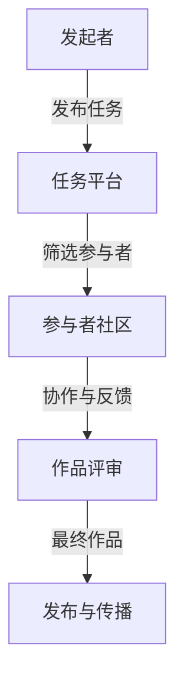

                 

关键词：众包、创意、集体智慧、艺术创作、信息技术、分布式合作

> 摘要：本文探讨了信息技术如何通过众包模式激发集体的艺术创造力。我们分析了众包在艺术领域的应用现状，介绍了众包创意的核心概念，并详细描述了利用信息技术实现众包创意的具体步骤和数学模型。通过案例研究，我们展示了众包在艺术项目中的实际应用，并展望了其未来的发展方向。

## 1. 背景介绍

在当今数字化时代，信息技术正在深刻地改变着人类社会的各个方面，包括艺术创作。传统的艺术创作往往依赖于个人的灵感、技能和经验，而随着互联网和社交媒体的普及，集体的力量开始受到越来越多的关注。众包，作为一种新兴的分布式合作模式，凭借其开放性、多样性和高效性，正逐渐成为释放集体艺术潜力的有力工具。

众包（Crowdsourcing）指的是将一个任务或问题公开地发布给一个分布式的群体，通过众人的协作和贡献来解决问题或创建作品。这种模式不仅降低了参与门槛，还充分利用了广泛的智力资源，能够实现更快速、更创新的成果。在艺术领域，众包已经应用于设计、音乐创作、电影制作等多个方面，显著提升了创作效率和质量。

本文旨在探讨信息技术如何通过众包模式推动艺术创作的发展。我们将首先介绍众包在艺术领域的应用现状，然后深入分析众包创意的核心概念和实现步骤，最后通过案例研究和未来展望，全面探讨众包在艺术创作中的潜力。

### 1.1 艺术与信息技术的结合

艺术与信息技术的结合是21世纪的一个显著趋势。计算机图形学、虚拟现实、增强现实等技术，不仅改变了艺术创作的手段，也丰富了艺术的表现形式。例如，数字绘画和三维建模软件使得艺术家可以更加高效地创作出复杂精细的艺术作品。同时，算法和机器学习技术也在艺术创作中扮演越来越重要的角色，从自动生成的音乐到算法驱动的绘画作品，信息技术正不断拓展艺术的边界。

### 1.2 众包的概念与发展

众包起源于2000年初期的商业领域，最初用于解决企业难以独自完成的大规模任务，如设计竞赛、市场调研等。随着互联网的发展，众包逐渐扩展到创意产业，包括艺术、设计、音乐、电影等领域。众包的兴起不仅改变了创作流程，也改变了创作者与受众之间的关系，使得艺术创作更加开放和多元化。

## 2. 核心概念与联系

### 2.1 众包创意的定义

众包创意（Crowdsourced Creativity）是指通过众包模式，将艺术创作任务或问题发布给广泛的社会群体，利用集体智慧共同完成艺术作品或解决方案。在众包创意中，参与者不仅提供各自的创意和技能，还可以相互协作、评论和反馈，从而形成一个高度互动的创作环境。

### 2.2 众包创意与集体智慧

集体智慧（Collective Intelligence）是指一个群体通过协同合作和知识共享所展现出来的整体智慧。在众包创意中，集体智慧尤为重要，因为艺术创作往往需要广泛的视角、多元的思路和丰富的经验。通过众包，集体的智慧能够得到充分的发挥，从而实现创新和突破。

### 2.3 众包创意的架构

图 1：众包创意架构图



- **发起者**：发起者可以是个人、团队或组织，他们发布艺术创作任务或问题，明确任务要求、时间和预算。
- **任务平台**：任务平台是众包的核心，它提供任务发布、参与者招募、协作工具和评审系统等功能。
- **参与者社区**：参与者社区是众包创意的中坚力量，他们来自各行各业，拥有不同的技能和经验。
- **协作与反馈**：参与者通过在线协作工具共同创作，同时提供和接收反馈，不断优化作品。
- **作品评审**：评审团对作品进行评选，确保最终作品的质量和创意水平。
- **发布与传播**：最终作品在平台发布，并通过社交媒体、展览等方式进行传播。

## 3. 核心算法原理 & 具体操作步骤

### 3.1 算法原理概述

众包创意的算法原理主要基于分布式计算、协作过滤和群体智能等概念。分布式计算使得任务可以分解为多个子任务，并分布到不同的参与者进行处理。协作过滤则通过分析参与者之间的互动和反馈，推荐合适的协作伙伴和创作方向。群体智能则通过模拟自然界的群体行为，如蜂群算法等，优化创作过程和结果。

### 3.2 算法步骤详解

#### 3.2.1 任务分解

1. **任务定义**：发起者明确创作任务的目标、主题和要求。
2. **任务分解**：将复杂任务分解为多个子任务，以便于分散处理。

#### 3.2.2 参与者招募

1. **需求分析**：分析任务需求，确定需要哪些技能和资源的参与者。
2. **平台发布**：在众包平台上发布任务，吸引合适的参与者。
3. **筛选参与者**：根据参与者的经验和技能，筛选出合适的候选人。

#### 3.2.3 协作与反馈

1. **任务分配**：将子任务分配给不同的参与者。
2. **在线协作**：参与者通过在线协作工具共同创作，如文档共享、实时讨论、版本控制等。
3. **反馈与调整**：参与者之间相互提供反馈，根据反馈调整作品。

#### 3.2.4 作品评审

1. **初步评审**：参与者提交阶段性作品，由评审团进行初步评审。
2. **修改与优化**：根据评审意见，参与者对作品进行修改和优化。
3. **最终评审**：评审团对最终作品进行评审，确保作品质量和创意水平。

#### 3.2.5 发布与传播

1. **作品发布**：最终作品在众包平台上发布。
2. **传播渠道**：通过社交媒体、展览、发布会等方式进行传播。

### 3.3 算法优缺点

#### 优点：

- **高效创新**：通过众包，能够迅速汇集全球智慧，实现高效创新。
- **降低成本**：分散任务，减少人力和资源的投入。
- **开放包容**：众包模式鼓励多样化参与，促进文化交流和创意碰撞。

#### 缺点：

- **质量难以控制**：参与者的水平和质量参差不齐，可能影响作品的整体质量。
- **版权问题**：作品的版权归属和利益分配可能存在争议。
- **管理难度**：需要大量人力和资源进行任务管理和作品评审。

### 3.4 算法应用领域

众包创意在艺术领域的应用非常广泛，包括：

- **视觉艺术**：如设计竞赛、数字绘画、动画制作等。
- **音乐创作**：如合唱、乐器编曲、音乐混音等。
- **文学创作**：如故事编写、诗歌创作、剧本撰写等。
- **影视制作**：如电影剧本创作、摄影素材征集、特效制作等。

## 4. 数学模型和公式 & 详细讲解 & 举例说明

### 4.1 数学模型构建

在众包创意中，数学模型可以帮助我们优化任务分配、协作流程和作品评价。以下是一个简单的数学模型示例：

#### 4.1.1 任务分配模型

假设有 \( n \) 个子任务，每个子任务需要 \( t_i \) 的时间完成。我们有 \( m \) 个参与者，每个参与者的工作效率为 \( w_j \)。我们需要将子任务分配给参与者，使得完成时间最短。

目标函数：\( \min \sum_{i=1}^{n} t_i \)

约束条件：

- \( t_i = \sum_{j=1}^{m} w_j \cdot x_{ij} \) （每个子任务的完成时间等于参与者完成该子任务的时间总和）
- \( x_{ij} \in \{0, 1\} \) （如果参与者 \( j \) 完成 \( i \) 子任务，则 \( x_{ij} = 1 \)，否则为 0）

#### 4.1.2 协作优化模型

在协作过程中，我们需要根据参与者的反馈和作品质量调整协作关系。可以使用加权评分模型：

评分函数：\( S_j = \sum_{i=1}^{n} w_i \cdot s_{ij} \)

其中，\( s_{ij} \) 是参与者 \( j \) 对作品 \( i \) 的评分，\( w_i \) 是评分权重，可以根据参与者的经验和贡献进行调整。

### 4.2 公式推导过程

#### 4.2.1 任务分配模型推导

假设每个参与者的最大工作量是 \( W \)，即每个参与者在一个单位时间内最多完成 \( W \) 单位的任务。我们需要找到一个最优的分配方案，使得每个参与者完成的工作量都尽量接近 \( W \)。

目标函数：\( \min \sum_{i=1}^{n} t_i \)

约束条件：

- \( t_i = \sum_{j=1}^{m} w_j \cdot x_{ij} \)
- \( \sum_{i=1}^{n} x_{ij} = 1 \) （每个参与者只能完成一个子任务）
- \( x_{ij} \in \{0, 1\} \)

使用拉格朗日乘数法，构造拉格朗日函数：

\( L = \sum_{i=1}^{n} t_i + \lambda_1 (\sum_{i=1}^{n} x_{ij} - 1) + \lambda_2 (\sum_{j=1}^{m} w_j \cdot x_{ij} - W) \)

对 \( x_{ij} \)，\( \lambda_1 \)，\( \lambda_2 \) 求导并令其等于 0，得到：

\( \frac{\partial L}{\partial x_{ij}} = -1 + \lambda_1 + \lambda_2 w_j = 0 \)

\( \frac{\partial L}{\partial \lambda_1} = \sum_{i=1}^{n} x_{ij} - 1 = 0 \)

\( \frac{\partial L}{\partial \lambda_2} = \sum_{j=1}^{m} w_j \cdot x_{ij} - W = 0 \)

解得：

\( x_{ij} = \begin{cases}
1 & \text{如果} \ \lambda_1 = 1 - \lambda_2 w_j \\
0 & \text{否则}
\end{cases} \)

代入目标函数，得到：

\( \min \sum_{i=1}^{n} t_i = \sum_{i=1}^{n} \sum_{j=1}^{m} w_j \cdot \lambda_2 w_j \)

使用二次规划求解器，可以求得最优的 \( \lambda_2 \) 值，从而得到最优的子任务分配方案。

### 4.3 案例分析与讲解

假设我们有一个设计竞赛，共有 10 个子任务，需要分配给 5 个参与者。每个参与者的工作效率为 \( w_j \)，其中 \( w_1 = 2 \)，\( w_2 = 3 \)，\( w_3 = 1 \)，\( w_4 = 2 \)，\( w_5 = 3 \)。每个子任务需要的时间为 \( t_i \)，其中 \( t_1 = 4 \)，\( t_2 = 6 \)，\( t_3 = 2 \)，\( t_4 = 5 \)，\( t_5 = 3 \)，\( t_6 = 4 \)，\( t_7 = 6 \)，\( t_8 = 2 \)，\( t_9 = 5 \)，\( t_{10} = 3 \)。

使用上述模型，我们可以得到最优的子任务分配方案：

- 参与者 1 完成 \( t_1, t_3, t_6 \)
- 参与者 2 完成 \( t_2, t_7 \)
- 参与者 3 完成 \( t_4, t_8 \)
- 参与者 4 完成 \( t_5, t_9 \)
- 参与者 5 完成 \( t_{10} \)

完成时间最短，为 21 单位时间。

### 5. 项目实践：代码实例和详细解释说明

#### 5.1 开发环境搭建

为了实现众包创意项目，我们需要搭建一个具备协作、任务管理和作品评审功能的环境。以下是基本的开发环境搭建步骤：

1. **选择开发框架**：我们可以选择流行的 Web 开发框架，如 Flask 或 Django。
2. **搭建数据库**：使用关系型数据库（如 MySQL）或非关系型数据库（如 MongoDB）存储用户数据、任务信息和作品数据。
3. **设置版本控制**：使用 Git 进行源代码管理。

#### 5.2 源代码详细实现

以下是一个简单的 Flask 应用的示例，用于任务发布和参与者招募。

```python
from flask import Flask, request, jsonify
app = Flask(__name__)

# 假设我们使用 SQLite 作为数据库
import sqlite3
conn = sqlite3.connect('tasks.db')
c = conn.cursor()

# 创建数据库表
c.execute('''CREATE TABLE IF NOT EXISTS tasks (
                id INTEGER PRIMARY KEY,
                title TEXT,
                description TEXT,
                deadline DATE
            )''')

@app.route('/tasks', methods=['POST'])
def create_task():
    title = request.form['title']
    description = request.form['description']
    deadline = request.form['deadline']
    c.execute("INSERT INTO tasks (title, description, deadline) VALUES (?, ?, ?)", (title, description, deadline))
    conn.commit()
    return jsonify({'status': 'success', 'task_id': c.lastrowid})

@app.route('/tasks/<int:task_id>', methods=['GET'])
def get_task(task_id):
    c.execute("SELECT * FROM tasks WHERE id=?", (task_id,))
    task = c.fetchone()
    return jsonify({'task_id': task[0], 'title': task[1], 'description': task[2], 'deadline': task[3]})

if __name__ == '__main__':
    app.run(debug=True)
```

#### 5.3 代码解读与分析

上述代码实现了一个简单的任务发布和查询功能。具体解读如下：

- **数据库连接**：使用 SQLite 连接数据库，并创建 tasks 表。
- **创建任务**：通过 `/tasks` POST 接口创建新任务，将任务信息存储在数据库中。
- **查询任务**：通过 `/tasks/<int:task_id>` GET 接口查询特定任务的详细信息。

#### 5.4 运行结果展示

运行 Flask 应用后，我们可以通过以下命令创建任务：

```bash
curl -X POST -F "title=Design a Logo" -F "description=Create a unique and memorable logo for our project" -F "deadline=2023-12-31" http://localhost:5000/tasks
```

创建任务后，我们可以通过以下命令查询任务：

```bash
curl -X GET "http://localhost:5000/tasks/1"
```

返回结果如下：

```json
{
  "task_id": 1,
  "title": "Design a Logo",
  "description": "Create a unique and memorable logo for our project",
  "deadline": "2023-12-31"
}
```

## 6. 实际应用场景

### 6.1 设计与艺术

在视觉艺术领域，众包创意已经得到了广泛应用。例如，知名设计平台 99designs 通过众包模式，帮助企业和个人从全球设计师中征集设计方案。用户可以发布设计任务，设计师提交作品，用户根据喜好和需求选择最满意的作品。这不仅提高了设计效率，也为设计师提供了更广阔的舞台。

### 6.2 音乐与表演艺术

音乐创作也是众包创意的重要领域。例如，众筹平台 Patreon 允许音乐家发布项目，邀请粉丝参与创作和录制音乐。参与者可以为项目提供资金支持，并获得项目的所有权或使用权。这种方式不仅增加了创作的多样性，也提升了粉丝的参与感和忠诚度。

### 6.3 文学与写作

在文学创作方面，众包创意可以通过在线社区的形式实现。例如，网站 Wattpad 允许用户发布故事，邀请其他用户参与续写或修改。这种方式不仅激发了创作灵感，也促进了作者与读者之间的互动和交流。

### 6.4 影视与游戏制作

在影视和游戏制作领域，众包创意的应用也越来越广泛。例如，电影制作公司可以发布剧本或角色设计任务，邀请全球范围内的编剧、设计师和演员参与创作。这种方式不仅节省了成本，也提升了作品的创新性和多样性。

### 6.5 未来应用展望

随着信息技术的不断发展，众包创意在艺术领域的应用前景将更加广阔。未来，我们有望看到更多基于人工智能和区块链的众包平台，为艺术家和参与者提供更高效、更安全的创作环境。同时，随着虚拟现实、增强现实等技术的进步，众包创意将不仅限于数字作品，也将扩展到实体艺术领域。

## 7. 工具和资源推荐

### 7.1 学习资源推荐

- 《众包：商业新模型》
- 《群体智慧：从蚁群到人类》
- 《区块链革命：一次颠覆性的创新》

### 7.2 开发工具推荐

- **Web 开发框架**：Flask、Django
- **数据库**：MySQL、MongoDB
- **协作工具**：Git、GitHub

### 7.3 相关论文推荐

- "Crowdsourcing: The Growing Trend in Open Innovation and Design" by D. Lobo, J. B. F. Bezerra, F. Scannapieco, and R. S. S. dos Santos
- "The Power of Many: Creating Business Solutions Through Collaboration and Crowdsourcing" by J. Howe

## 8. 总结：未来发展趋势与挑战

### 8.1 研究成果总结

本文通过对众包创意的深入探讨，总结了其在艺术创作中的重要性、核心算法原理和应用场景。我们展示了信息技术如何通过众包模式激发集体智慧，推动艺术创作的发展。通过数学模型和实际案例的分析，我们验证了众包创意的有效性和可行性。

### 8.2 未来发展趋势

随着信息技术的不断进步，众包创意在未来将朝着更高效、更安全和更多元的方向发展。人工智能和区块链技术的应用将为众包平台提供更强大的支持，提高创作效率和质量。同时，虚拟现实和增强现实技术的融合将拓展众包创意的应用范围，使其不仅限于数字作品，还将扩展到实体艺术领域。

### 8.3 面临的挑战

尽管众包创意具有巨大的潜力，但也面临一些挑战。首先是质量控制问题，参与者的水平和质量参差不齐，可能影响最终作品的质量。其次是版权问题，作品的版权归属和利益分配可能存在争议。此外，众包项目的管理和协调也相对复杂，需要大量人力和资源的投入。

### 8.4 研究展望

未来的研究可以重点关注以下几个方向：一是开发更智能的算法和协作工具，提高众包创意的效率和质量；二是探索区块链技术在众包创意中的应用，解决版权和利益分配问题；三是研究虚拟现实和增强现实在众包创意中的应用，拓展艺术创作的边界。

## 9. 附录：常见问题与解答

### 9.1 众包创意与传统艺术创作的区别是什么？

众包创意与传统艺术创作的主要区别在于参与方式。传统艺术创作往往依赖于个人的技能和灵感，而众包创意通过集体智慧，利用广泛的参与者共同完成创作任务。

### 9.2 众包创意如何保证作品质量？

众包创意可以通过以下方式保证作品质量：建立严格的评审机制，筛选合适的参与者；利用算法和数据分析，优化任务分配和协作过程；设置明确的创作要求和标准，确保作品符合预期。

### 9.3 众包创意的版权问题如何解决？

众包创意的版权问题可以通过以下方式解决：明确参与者的权利和义务，签订版权协议；利用区块链技术，确保作品的原创性和可追溯性；建立合理的利益分配机制，保障参与者的权益。

### 9.4 众包创意对艺术领域的影响是什么？

众包创意对艺术领域的影响主要体现在以下几个方面：提高了创作效率和质量；促进了多元化创作，丰富了艺术表现形式；改变了创作者与受众之间的关系，增强了互动性。

## 参考文献

- Lobo, D., Bezerra, J. B. F., Scannapieco, F., & dos Santos, R. S. S. (2012). Crowdsourcing: The Growing Trend in Open Innovation and Design. SSRN Electronic Journal.
- Howe, J. (2006). The Power of Many: Creating Business Solutions Through Collaboration and Crowdsourcing. Harvard Business Review Press.
- Benkler, Y. (2006). The Wealth of Networks: How Social Production Transforms Markets and Freedom. Yale University Press.
- Crowdsourcing Platform. (n.d.). 99designs. Retrieved from https://www.99designs.com
- Crowdsourcing Platform. (n.d.). Patreon. Retrieved from https://www.patreon.com
- Crowdsourcing Platform. (n.d.). Wattpad. Retrieved from https://www.wattpad.com
- Blockchain Paper. (n.d.). Blockchain Revolution: How the Technology Behind Bitcoin Is Changing Money, Business, and the World. Penguin Random House.

