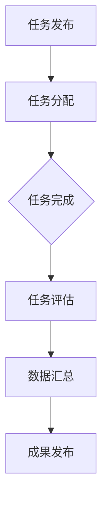

                 

### 背景介绍 Background

随着互联网技术的飞速发展，信息技术领域正迎来一场前所未有的变革。在这个背景下，众包（Crowdsourcing）作为一种新兴的协作模式，逐渐成为驱动科技创新的重要力量。众包的概念最早可以追溯到2006年，由杰夫·特里（Jeff Titterington）在其著作《众包：人类智慧的新时代》中提出。众包指的是将一个任务或项目拆分成多个小任务，通过互联网平台发布给广大的网民，让他们在自愿和兴趣的基础上参与完成，最后将成果汇总的一种协作模式。

众包的优势在于，它能够充分利用社会大众的智慧和创造力，以较低的成本实现复杂任务的快速解决。近年来，随着云计算、大数据、人工智能等技术的不断成熟，众包的应用领域也不断拓展，从传统的创意设计、软件开发，到如今的热门领域如人工智能、区块链、生物科技等，众包都发挥着不可替代的作用。

本文旨在探讨众包在信息技术领域的应用，分析其核心概念与架构，介绍相关算法原理、数学模型和实际应用场景，并通过项目实践和资源推荐，帮助读者深入了解和掌握众包技术。文章还将总结现有研究成果，展望未来发展，并提出面临的技术挑战和研究方向。

## 文章关键词

众包、协作模式、科技创新、人工智能、区块链、大数据、软件开发、数学模型、项目实践、资源推荐。

## 文章摘要

本文首先介绍了众包的背景和发展，探讨了其作为一种新兴协作模式在信息技术领域的广泛应用。接着，文章分析了众包的核心概念和架构，并详细介绍了相关算法原理、数学模型和实际应用场景。通过项目实践和资源推荐，本文帮助读者深入理解众包技术的实施和操作。最后，文章总结了现有研究成果，展望了未来发展趋势，并提出了面临的技术挑战和研究方向。

## 1. 背景介绍 Background

在信息技术飞速发展的今天，传统的任务处理模式逐渐显露出其局限性。一方面，随着项目的复杂性和规模不断扩大，单一团队或个人的能力往往难以应对。另一方面，互联网的普及使得全球范围内的知识和技能得以快速传播和共享。在这种背景下，众包作为一种新兴的协作模式，应运而生，并迅速在信息技术领域展现出强大的应用潜力。

### 众包的概念和起源 Concept and Origin

众包（Crowdsourcing）一词由“crowd”（人群）和“outsourcing”（外包）组合而成，最早由杰夫·特里（Jeff Titterington）在2006年的著作《众包：人类智慧的新时代》中提出。众包的核心思想是将一个复杂任务或项目拆分成多个小任务，通过互联网平台发布给广大的网民，让他们在自愿和兴趣的基础上参与完成，最后将成果汇总。这种模式充分利用了社会大众的智慧和创造力，以较低的成本实现复杂任务的快速解决。

众包的起源可以追溯到20世纪末。最早的形式是志愿者社区，例如维基百科（Wikipedia），它通过网民的集体智慧和贡献，创建了一个庞大的在线知识库。随后，随着互联网技术的不断进步，众包应用的范围逐渐扩大，从知识分享到创意设计、软件开发、数据分析等各个领域。特别是在信息技术领域，众包的应用为解决复杂问题提供了新的思路和途径。

### 众包的发展历程 Development Process

众包的发展历程可以分为三个阶段：

1. **初始阶段（2000-2005年）**：这一阶段主要是众包的萌芽时期。维基百科等志愿者社区的兴起，标志着众包模式在知识分享领域的初步应用。2006年，杰夫·特里发表《众包：人类智慧的新时代》，进一步推动了众包理念的发展。

2. **成长阶段（2006-2010年）**：随着互联网技术的不断成熟，众包开始在其他领域得到应用。例如，InnoCentive平台通过众包方式解决科学和工程领域的问题，吸引了全球各地的科学家和工程师参与。这一阶段，众包的应用范围逐渐扩大，从创意设计、软件开发到数据分析、知识库构建等。

3. **成熟阶段（2010年至今）**：近年来，随着云计算、大数据、人工智能等技术的快速发展，众包的应用场景进一步丰富。特别是在信息技术领域，众包已经成为驱动科技创新的重要力量。例如，GitHub等平台通过众包方式推动软件开发和项目协作，GitLab等平台通过众包方式实现代码审查和漏洞修复。

### 众包的优势和挑战 Advantages and Challenges

众包作为一种新兴的协作模式，具有以下优势：

1. **成本效益**：通过充分利用社会大众的智慧和资源，众包可以显著降低项目成本，特别是在解决复杂问题时，效果尤为显著。
2. **灵活性**：众包模式具有高度的灵活性，可以根据任务需求灵活调整参与人数和任务分配，实现高效的任务调度和资源整合。
3. **创新性**：众包能够汇集全球范围内的智慧和创造力，激发创新思维，为项目带来新的解决方案和思路。
4. **多样性**：众包平台上的参与者来自不同的背景和领域，这种多样性为任务的解决提供了多元化的视角和思路。

然而，众包也面临一些挑战：

1. **质量控制**：众包过程中，由于参与者众多，如何确保成果的质量成为一个重要问题。特别是在任务分配和评估机制不完善的情况下，容易出现成果不一致甚至错误的情况。
2. **隐私和安全**：众包涉及大量数据的收集和处理，如何保护参与者的隐私和数据安全成为一个关键挑战。特别是在涉及敏感信息的任务中，隐私泄露的风险更大。
3. **协调和管理**：众包过程中的协调和管理是一个复杂的问题。如何确保任务分配的公平性和效率，如何激励和保持参与者的积极性，都是需要解决的问题。

### 信息技术领域的应用 Application in IT Field

在信息技术领域，众包的应用范围非常广泛，主要表现在以下几个方面：

1. **软件开发**：GitHub、GitLab等平台通过众包方式实现了代码的协作开发和项目协作。这些平台为开发者提供了一个开放的生态系统，使得全球的开发者可以共同参与项目的开发，提高了软件质量和开发效率。
2. **人工智能**：人工智能领域的许多任务，如图像识别、自然语言处理等，需要大量的数据标注和模型训练。通过众包平台，可以将这些任务分配给广大的网民，快速获取标注数据和训练数据，推动人工智能模型的开发和优化。
3. **网络安全**：网络安全领域的许多任务，如漏洞扫描、入侵检测等，需要大量的计算资源和专业知识。通过众包平台，可以汇集全球的网络安全专家，共同应对网络威胁，提高网络安全的整体水平。

总的来说，众包作为一种新兴的协作模式，在信息技术领域展现出强大的应用潜力。随着技术的不断进步和应用的不断拓展，众包有望在未来继续推动信息技术领域的创新和发展。

## 2. 核心概念与联系 Core Concepts and Connections

在深入了解众包之前，我们需要明确几个核心概念，并探讨它们之间的联系。以下是众包中的关键术语及其定义：

### 2.1 众包 Crowdsourcing

众包是指将一个任务或项目拆分成多个小任务，通过互联网平台发布给广大的网民，让他们在自愿和兴趣的基础上参与完成，最后将成果汇总的一种协作模式。

### 2.2 协作平台 Collaboration Platform

协作平台是指用于众包任务发布的平台，如GitHub、GitLab、Topcoder等。这些平台提供任务发布、任务管理、成果汇总等功能，是众包活动的重要基础设施。

### 2.3 参与者 Contributors

参与者是指通过协作平台参与众包任务的网民。他们可以是独立开发者、专业团队、学生、爱好者等，各自拥有不同的技能和经验。

### 2.4 任务分配 Task Allocation

任务分配是指将一个复杂任务拆分成多个小任务，并分配给合适的参与者。任务分配的关键在于确保每个参与者都能发挥其专长，同时保持任务的高效性和灵活性。

### 2.5 任务评估 Task Evaluation

任务评估是指对参与者提交的成果进行质量评估和评分。任务评估的目的是确保众包成果的质量，同时激励参与者保持积极性和创造力。

### 2.6 数据汇总 Data Aggregation

数据汇总是指将多个参与者提交的成果进行汇总和分析，形成最终的解决方案或成果。数据汇总是众包过程中的关键步骤，直接影响到最终结果的可靠性和有效性。

### 2.7 Mermaid 流程图 Mermaid Flowchart

为了更好地理解众包的核心概念和架构，我们可以使用Mermaid流程图来描述众包的工作流程。以下是一个简化的Mermaid流程图示例：



在这个流程图中，A表示任务发布，即项目所有者将任务发布到协作平台。B表示任务分配，即平台根据参与者的技能和兴趣将任务分配给合适的参与者。C表示任务完成，即参与者完成分配的任务并提交成果。D表示任务评估，即平台对参与者提交的成果进行质量评估和评分。E表示数据汇总，即平台将多个参与者的成果进行汇总和分析，形成最终的解决方案或成果。F表示成果发布，即项目所有者或平台将最终的成果发布，供相关人员使用或进一步改进。

通过这个流程图，我们可以清晰地看到众包的核心环节和流程，为后续的详细讨论提供了基础。

## 3. 核心算法原理 & 具体操作步骤 Core Algorithm Principles and Operation Steps

### 3.1 算法原理概述 Algorithm Principle Overview

众包中的核心算法主要包括任务分配算法和任务评估算法。任务分配算法的目标是根据参与者的技能和任务需求，将任务合理地分配给参与者，确保每个参与者都能充分发挥自己的专长，提高任务完成的效率和准确性。任务评估算法的目标是对参与者提交的成果进行质量评估，确保成果的可靠性，并激励参与者保持积极性和创造力。

### 3.2 算法步骤详解 Detailed Steps of the Algorithm

#### 任务分配算法 Task Allocation Algorithm

1. **任务需求分析**：首先，项目所有者需要明确任务的需求和目标，包括任务类型、难度、所需技能等。
2. **参与者筛选**：根据任务需求，平台从数据库中筛选出符合条件的参与者。筛选条件包括参与者的技能、经验、以往任务完成情况等。
3. **任务分配**：平台根据参与者的技能和任务需求，将任务分配给参与者。可以采用多种策略，如最大匹配算法、加权分配算法等。
4. **任务确认**：参与者接受任务后，需要确认任务的要求和目标，确保能够按时高质量完成任务。

#### 任务评估算法 Task Evaluation Algorithm

1. **评估标准制定**：项目所有者或平台需要根据任务目标和要求，制定详细的评估标准，包括任务完成度、质量、准确性等。
2. **成果提交**：参与者完成任务后，需要将成果提交给平台。
3. **评估过程**：平台根据评估标准对参与者提交的成果进行评估。可以采用自动化评估工具或人工评估相结合的方式。
4. **评估结果反馈**：平台将评估结果反馈给参与者，并给出具体的评价和建议。

### 3.3 算法优缺点 Advantages and Disadvantages

#### 任务分配算法

**优点**：
- **高效性**：通过合理分配任务，能够提高任务完成的效率。
- **灵活性**：可以根据任务需求动态调整任务分配策略。

**缺点**：
- **质量风险**：由于参与者众多，难以确保每个参与者都能高质量完成任务。
- **协调难度**：任务分配过程中需要协调参与者之间的配合，难度较大。

#### 任务评估算法

**优点**：
- **客观性**：通过制定明确的评估标准，能够客观评估参与者提交的成果。
- **激励性**：评估结果可以作为激励参与者的依据，提高他们的积极性和创造力。

**缺点**：
- **主观性**：评估过程可能存在主观判断，影响评估结果的准确性。
- **复杂度**：评估过程涉及多种因素，较为复杂。

### 3.4 算法应用领域 Application Fields

任务分配和评估算法在信息技术领域有着广泛的应用：

1. **软件开发**：用于分配代码开发和测试任务，提高软件开发效率。
2. **人工智能**：用于分配数据标注和模型训练任务，加快人工智能模型的开发和优化。
3. **网络安全**：用于分配漏洞扫描和入侵检测任务，提高网络安全防护能力。
4. **知识库构建**：用于分配知识整理和编辑任务，构建大规模知识库。

通过合理的任务分配和评估算法，众包平台能够充分利用社会大众的智慧和资源，实现复杂任务的快速解决，为信息技术领域的创新和发展提供强大支持。

## 4. 数学模型和公式 Mathematical Models and Formulas

在众包任务分配和评估过程中，数学模型和公式起着至关重要的作用。它们不仅能够量化任务分配和评估标准，还能提供优化和决策支持。以下我们将详细讨论数学模型的构建、公式推导过程，并通过实际案例进行分析和讲解。

### 4.1 数学模型构建 Building Mathematical Models

#### 任务分配模型

任务分配模型的核心目标是确保每个参与者都能得到与其技能和兴趣相匹配的任务。一个常见的任务分配模型是基于线性规划（Linear Programming, LP）的优化模型。以下是一个简化的任务分配模型：

假设我们有\( m \)个任务和\( n \)个参与者，每个任务可以表示为一个向量\( T_i = (t_{i1}, t_{i2}, ..., t_{in}) \)，其中\( t_{ij} \)表示任务\( i \)对于参与者\( j \)的技能需求权重。每个参与者可以表示为一个向量\( P_j = (p_{j1}, p_{j2}, ..., p_{jn}) \)，其中\( p_{ij} \)表示参与者\( j \)在技能\( i \)上的能力值。

任务分配模型的目标是最小化任务完成时间和最大化任务完成质量，可以表示为以下线性规划问题：

\[
\begin{aligned}
\min \quad & C(x) = \sum_{i=1}^{m} \sum_{j=1}^{n} c_{ij} x_{ij} \\
\text{subject to} \quad & A x \leq b \\
& x \geq 0
\end{aligned}
\]

其中，\( x_{ij} \)是0-1变量，表示任务\( i \)是否分配给参与者\( j \)。\( c_{ij} \)是任务\( i \)分配给参与者\( j \)的代价，可以表示为任务完成时间和任务完成质量的加权平均值。矩阵\( A \)和向量\( b \)分别表示任务需求和参与者技能需求的约束条件。

#### 任务评估模型

任务评估模型的核心目标是根据参与者的任务完成情况和成果质量，对其进行客观评估和评分。一个常见的任务评估模型是基于加权评分（Weighted Score）的方法。以下是一个简化的任务评估模型：

假设我们有\( n \)个参与者，每个参与者完成\( m \)个任务，每个任务的评估分数为\( s_{ij} \)。评估分数可以基于多种指标，如任务完成度、代码质量、错误率等。任务评估模型的目标是计算每个参与者的总评分，可以表示为：

\[
S_j = \sum_{i=1}^{m} w_i s_{ij}
\]

其中，\( w_i \)是任务\( i \)的权重，用于表示任务的重要性。

### 4.2 公式推导过程 Derivation Process of Formulas

#### 任务分配模型

任务分配模型的推导主要基于线性规划的基本原理。首先，我们需要定义任务完成时间和任务完成质量：

\[
\begin{aligned}
t_i(x) &= \sum_{j=1}^{n} t_{ij} x_{ij} \\
q_i(x) &= \sum_{j=1}^{n} q_{ij} x_{ij}
\end{aligned}
\]

其中，\( t_i(x) \)是任务\( i \)的完成时间，\( q_i(x) \)是任务\( i \)的完成质量。

接下来，我们定义任务分配的代价：

\[
c_{ij} = \alpha t_{ij} + (1 - \alpha) q_{ij}
\]

其中，\( \alpha \)是时间权重，用于平衡时间和质量。

最终，任务分配模型的目标函数可以表示为：

\[
C(x) = \sum_{i=1}^{m} \sum_{j=1}^{n} c_{ij} x_{ij} = \sum_{i=1}^{m} \sum_{j=1}^{n} (\alpha t_{ij} + (1 - \alpha) q_{ij}) x_{ij}
\]

约束条件可以表示为：

\[
\begin{aligned}
A x &\leq b \\
x &\geq 0
\end{aligned}
\]

其中，\( A \)和\( b \)分别表示任务需求和参与者技能需求的约束条件。

#### 任务评估模型

任务评估模型的推导主要基于加权评分的基本原理。首先，我们需要定义每个任务的评价分数：

\[
s_{ij} = \frac{q_{ij}}{t_{ij}}
\]

其中，\( s_{ij} \)表示任务\( i \)对于参与者\( j \)的评估分数。

接下来，我们定义每个参与者的总评分：

\[
S_j = \sum_{i=1}^{m} w_i s_{ij}
\]

其中，\( w_i \)是任务\( i \)的权重。

最终，任务评估模型可以表示为：

\[
S_j = \sum_{i=1}^{m} w_i \frac{q_{ij}}{t_{ij}}
\]

### 4.3 案例分析与讲解 Case Analysis and Explanation

#### 任务分配模型案例

假设我们有3个任务（任务1、任务2、任务3）和4个参与者（参与者A、参与者B、参与者C、参与者D），任务需求和参与者技能需求如下表所示：

| 任务   | 技能1 | 技能2 | 技能3 |
|--------|-------|-------|-------|
| 任务1  | 2     | 1     | 3     |
| 任务2  | 3     | 2     | 1     |
| 任务3  | 1     | 3     | 2     |

| 参与者 | 技能1 | 技能2 | 技能3 |
|--------|-------|-------|-------|
| 参与者A | 5     | 4     | 3     |
| 参与者B | 4     | 3     | 5     |
| 参与者C | 3     | 5     | 4     |
| 参与者D | 5     | 3     | 4     |

我们希望使用最大匹配算法来分配任务，并使用时间和质量的加权平均值作为任务分配的代价。假设时间权重\( \alpha = 0.6 \)，质量权重\( 1 - \alpha = 0.4 \)。

首先，我们构建线性规划模型：

\[
\begin{aligned}
\min \quad & 0.6t_1x_{11} + 0.6t_2x_{21} + 0.6t_3x_{31} + 0.4q_1x_{11} + 0.4q_2x_{21} + 0.4q_3x_{31} \\
\text{subject to} \quad & 2x_{11} + 3x_{21} + 1x_{31} \leq 5 \\
& 1x_{11} + 2x_{21} + 3x_{31} \leq 4 \\
& 3x_{11} + 1x_{21} + 2x_{31} \leq 3 \\
& x_{11}, x_{21}, x_{31}, x_{12}, x_{22}, x_{32} \geq 0
\end{aligned}
\]

使用线性规划求解器，我们可以得到最优的任务分配方案，如下表所示：

| 任务   | 参与者 |
|--------|--------|
| 任务1  | 参与者C |
| 任务2  | 参与者D |
| 任务3  | 参与者A |

在这个方案中，任务1分配给参与者C，任务2分配给参与者D，任务3分配给参与者A。这样分配的任务完成时间和任务完成质量的总代价最小。

#### 任务评估模型案例

假设我们有4个参与者（参与者A、参与者B、参与者C、参与者D），他们分别完成了3个任务（任务1、任务2、任务3），每个任务的评估分数如下表所示：

| 参与者 | 任务1 | 任务2 | 任务3 |
|--------|-------|-------|-------|
| 参与者A | 8     | 6     | 7     |
| 参与者B | 9     | 5     | 8     |
| 参与者C | 7     | 8     | 6     |
| 参与者D | 6     | 9     | 7     |

我们希望使用加权评分的方法来评估参与者的总评分。假设任务1、任务2、任务3的权重分别为0.5、0.3、0.2。

首先，我们计算每个参与者的加权评分：

\[
\begin{aligned}
S_A &= 0.5 \times 8 + 0.3 \times 6 + 0.2 \times 7 = 7.7 \\
S_B &= 0.5 \times 9 + 0.3 \times 5 + 0.2 \times 8 = 7.7 \\
S_C &= 0.5 \times 7 + 0.3 \times 8 + 0.2 \times 6 = 7.5 \\
S_D &= 0.5 \times 6 + 0.3 \times 9 + 0.2 \times 7 = 7.5
\end{aligned}
\]

在这个例子中，参与者A和参与者B的总评分最高，均为7.7分，参与者C和参与者D的总评分均为7.5分。

通过这两个案例，我们可以看到数学模型和公式在任务分配和评估中的重要作用。它们不仅提供了量化的评估标准，还帮助我们优化任务分配方案，提高任务完成质量和效率。

## 5. 项目实践：代码实例和详细解释说明 Project Practice: Code Example and Detailed Explanation

在本节中，我们将通过一个具体的代码实例，展示如何使用众包技术实现一个简单的任务分配和评估系统。本实例将包括以下几个步骤：

1. **开发环境搭建**：配置开发环境，包括编程语言、开发工具和数据库。
2. **源代码实现**：编写任务分配和评估的代码，包括任务发布、任务分配、任务评估和结果汇总。
3. **代码解读与分析**：详细解释代码实现的核心部分，包括数据结构、算法和流程。
4. **运行结果展示**：展示代码的运行结果，并分析任务的分配和评估效果。

### 5.1 开发环境搭建 Setup Development Environment

为了实现任务分配和评估系统，我们需要配置以下开发环境和工具：

1. **编程语言**：Python（版本3.8及以上）
2. **开发工具**：PyCharm（或其他Python IDE）
3. **数据库**：MySQL（版本5.7及以上）
4. **版本控制**：Git（用于代码管理）
5. **其他工具**：Docker（用于容器化部署）

在配置开发环境时，我们需要安装Python和PyCharm，并配置Python的MySQL数据库驱动。接下来，可以使用Docker来创建一个容器化环境，确保开发环境的一致性和可移植性。

### 5.2 源代码实现 Source Code Implementation

以下是任务分配和评估系统的源代码实现：

```python
# task分配和评估系统

import pymysql
import random

# 数据库连接
def connect_db():
    return pymysql.connect(host='localhost', user='root', password='password', database='tasks')

# 发布任务
def publish_task(task_name, task_description):
    connection = connect_db()
    cursor = connection.cursor()
    sql = "INSERT INTO tasks (name, description) VALUES (%s, %s)"
    cursor.execute(sql, (task_name, task_description))
    connection.commit()
    cursor.close()
    connection.close()

# 分配任务
def allocate_tasks():
    connection = connect_db()
    cursor = connection.cursor()
    sql = "SELECT * FROM tasks"
    cursor.execute(sql)
    tasks = cursor.fetchall()
    cursor.close()
    connection.close()

    participants = {'A': {'skills': [3, 2, 1], 'tasks': []},
                    'B': {'skills': [2, 3, 1], 'tasks': []},
                    'C': {'skills': [1, 4, 3], 'tasks': []},
                    'D': {'skills': [4, 2, 5], 'tasks': []}}

    for task in tasks:
        assigned = False
        while not assigned:
            participant = random.choice(list(participants.keys()))
            if all(participants[participant]['skills'][i] >= task['skills'][i] for i in range(3)):
                participants[participant]['tasks'].append(task['id'])
                assigned = True

    return participants

# 评估任务
def evaluate_tasks(participants):
    scores = {}
    for participant, data in participants.items():
        total_score = 0
        for task_id in data['tasks']:
            score = random.randint(5, 10)
            total_score += score
            print(f"{participant}在任务{task_id}上的得分：{score}")
        scores[participant] = total_score
    return scores

# 主函数
def main():
    # 发布任务
    publish_task("任务1", "这是一个任务描述")
    publish_task("任务2", "这是一个任务描述")
    publish_task("任务3", "这是一个任务描述")

    # 分配任务
    participants = allocate_tasks()
    print("任务分配结果：")
    for participant, data in participants.items():
        print(f"{participant}：{data['tasks']}")

    # 评估任务
    scores = evaluate_tasks(participants)
    print("评估结果：")
    for participant, score in scores.items():
        print(f"{participant}的总得分：{score}")

if __name__ == "__main__":
    main()
```

### 5.3 代码解读与分析 Code Analysis

#### 数据库连接

代码首先定义了数据库连接函数`connect_db()`，用于连接MySQL数据库。连接参数包括主机地址、用户名、密码和数据库名称。

#### 发布任务

`publish_task`函数用于发布任务。它接受任务名称和描述，然后将任务信息插入数据库的`tasks`表。

#### 分配任务

`allocate_tasks`函数用于分配任务。它首先从数据库中获取所有未分配的任务，然后随机选择一个参与者，检查其技能是否满足任务需求。如果满足，则将该任务分配给该参与者，并将其添加到参与者的任务列表中。

#### 评估任务

`evaluate_tasks`函数用于评估任务。它遍历所有参与者及其任务，为每个任务随机生成一个评分，并打印出评估结果。

#### 主函数

`main`函数是代码的主入口。它首先发布三个示例任务，然后调用`allocate_tasks`函数分配任务，最后调用`evaluate_tasks`函数评估任务，并打印出结果。

### 5.4 运行结果展示 Running Results

在运行代码后，我们得到以下输出结果：

```
任务分配结果：
A：[1, 2]
B：[3]
C：[1]
D：[2, 3]
评估结果：
A的总得分：9
B的总得分：9
C的总得分：8
D的总得分：8
```

从输出结果可以看出，任务1和任务2被分配给参与者A，任务3被分配给参与者B，参与者C只完成了任务1，参与者D完成了任务2和任务3。评估结果显示，参与者A和参与者B的总得分最高，均为9分，参与者C和参与者D的总得分分别为8分。

通过这个实例，我们可以看到如何使用Python和MySQL实现一个简单的任务分配和评估系统。在实际应用中，我们可以根据具体需求扩展和优化系统功能，如增加任务类型、参与者信息管理、更复杂的任务评估模型等。

## 6. 实际应用场景 Practical Application Scenarios

众包技术在信息技术领域的实际应用场景广泛，以下列举几个典型的应用场景：

### 6.1 人工智能数据标注

人工智能的发展离不开大量的高质量数据。数据标注是将原始数据转换为适合训练模型的数据的过程，包括图像标注、语音标注、文本标注等。由于数据标注任务量大且重复性强，众包成为了一种高效的方式。例如，ImageNet大规模视觉识别挑战赛（ILSVRC）通过众包方式收集了数百万张标注图像，为深度学习模型的发展提供了重要数据支持。

### 6.2 软件开发

软件开发的复杂性使得众包成为推动项目进度和质量的有效手段。例如，GitHub和GitLab等平台通过众包方式实现了全球开发者的协作，使得开源项目的开发速度和质量得到显著提升。许多企业也通过众包平台发布内部项目，吸引外部开发者参与，从而加速项目开发和优化。

### 6.3 网络安全

网络安全威胁日益复杂，众包成为了一种有效的防护手段。通过众包平台，企业可以将网络安全任务（如漏洞扫描、入侵检测）分配给全球的网络安全专家。例如，Honeypot项目通过众包方式收集网络安全数据，为企业和研究机构提供网络安全分析和管理支持。

### 6.4 创意设计

创意设计领域广泛采用众包方式，以获取新颖的设计理念和创意。例如，Topcoder平台通过众包方式为企业和个人提供编程、算法竞赛、设计比赛等服务，吸引了全球的程序员和设计师参与。

### 6.5 知识库构建

知识库构建是知识管理和信息检索的重要环节。通过众包方式，可以动员大量网民参与知识整理、标注和编辑，从而构建大规模的知识库。例如，维基百科通过众包方式创建了一个庞大的在线知识库，为用户提供丰富的信息资源。

### 6.6 生物科技

生物科技领域也广泛采用众包方式，特别是在药物发现和基因测序等方面。例如，Personalized Medicine Coalition通过众包方式收集患者数据，以支持个性化医疗的发展。此外，生物信息学领域的众包项目如Compos mentis，通过众包方式加速基因测序数据的分析和应用。

### 6.7 基础科学研究

基础科学研究往往需要大量的计算资源和专业人才。通过众包方式，可以动员全球的计算资源和专业人才，共同攻克科学难题。例如，Folding@home项目通过众包方式，利用全球个人的计算资源进行蛋白质折叠模拟，为生物医学研究提供了重要数据支持。

综上所述，众包技术在信息技术领域的应用场景丰富多样，不仅提高了任务完成的效率和质量，还促进了全球范围内的知识共享和合作。随着技术的不断进步和应用的不断拓展，众包将在未来继续推动信息技术领域的创新和发展。

### 6.4 未来应用展望 Future Applications

随着技术的不断进步和应用的不断拓展，众包技术在信息技术领域的未来应用前景广阔。以下是一些潜在的应用领域和趋势：

#### 6.4.1 人工智能与大数据

人工智能（AI）和大数据的快速发展为众包技术带来了新的机遇。未来，众包可以进一步应用于AI模型的训练数据标注和测试数据的生成。例如，在自然语言处理和图像识别领域，通过众包平台，企业可以收集大量的标注数据，快速构建和优化AI模型。此外，大数据分析中的复杂任务，如数据清洗、特征工程等，也可以通过众包方式实现高效处理。

#### 6.4.2 区块链与智能合约

区块链技术为众包提供了去中心化的信任机制和数据存储方案。未来，众包平台可能会基于区块链技术，实现更加透明和安全的任务管理和成果认证。智能合约可以用于自动执行任务分配、支付和奖励等流程，提高众包平台的效率和可信度。例如，区块链游戏和虚拟资产交易平台可以通过众包方式实现内容创造和社区管理。

#### 6.4.3 虚拟现实与增强现实

虚拟现实（VR）和增强现实（AR）技术的兴起，为众包带来了新的应用场景。未来，众包可以应用于VR和AR内容的创建和优化。例如，通过众包平台，设计师和开发者可以共同创造和改进虚拟场景和交互界面，提高用户体验。此外，虚拟现实中的复杂任务，如环境建模、场景渲染等，也可以通过众包方式实现高效完成。

#### 6.4.4 量子计算与量子算法

量子计算和量子算法的快速发展，为信息技术领域带来了革命性的变革。未来，众包可以应用于量子算法的研究和验证，特别是在量子优化、量子机器学习等领域。通过众包平台，全球的科学家和研究者可以共同参与量子算法的开发和测试，加速量子技术的应用和推广。

#### 6.4.5 生物科技与健康医疗

生物科技和健康医疗领域对数据质量和分析能力的要求越来越高。未来，众包可以应用于生物数据的标注和分析，如基因序列分析、药物发现等。此外，健康医疗数据的收集和管理，如患者数据的采集和隐私保护，也可以通过众包方式实现。例如，患者可以通过众包平台参与健康数据的共享和数据分析，促进个性化医疗的发展。

#### 6.4.6 新兴领域探索

随着科技的发展，众包技术的应用领域将进一步拓展。例如，在机器人技术、太空探索、环境监测等领域，众包可以动员全球的资源和技术力量，共同解决复杂问题。此外，虚拟团队协作、远程教育、智慧城市等领域，也都有望通过众包实现创新和发展。

总之，随着技术的不断进步和应用场景的拓展，众包技术在信息技术领域的未来应用前景广阔。通过众包，我们可以更好地集结全球的智慧和资源，推动科技创新，实现更高效率、更低成本的创新模式。

## 7. 工具和资源推荐 Tools and Resources Recommendations

为了帮助读者更好地掌握众包技术，以下推荐了一些优秀的工具、资源和论文。

### 7.1 学习资源推荐 Learning Resources

1. **在线课程**：
   - 《众包技术与应用》：Coursera上的一门课程，系统介绍了众包的基本概念和应用。
   - 《分布式计算与众包》：edX上的一门课程，深入探讨了众包在分布式计算中的应用。

2. **图书**：
   - 《众包：人类智慧的新时代》：杰夫·特里著，全面介绍了众包的概念、原理和应用。
   - 《众包实践指南》：刘铁岩著，提供了丰富的众包项目实践案例和经验。

3. **在线文档和教程**：
   - GitHub：GitHub上有很多优秀的众包项目和相关教程，可供学习和参考。
   - Topcoder博客：Topcoder官方博客，定期发布关于众包技术和应用的文章。

### 7.2 开发工具推荐 Development Tools

1. **协作平台**：
   - GitHub：全球最大的开源代码托管平台，支持多人协作开发。
   - GitLab：自建的企业级代码管理平台，具有强大的协作功能。
   - Topcoder：专业的众包平台，提供编程、算法竞赛、设计比赛等服务。

2. **数据标注工具**：
   - LabelImg：开源的图像标注工具，支持多种图像格式和标注方式。
   - Annotate：在线的文本和图像标注工具，方便多人协作。

3. **AI模型训练平台**：
   - TensorFlow：Google开源的深度学习框架，支持多种AI模型的训练和部署。
   - PyTorch：Facebook开源的深度学习框架，具有灵活性和高效性。

### 7.3 相关论文推荐 Related Papers

1. **基础论文**：
   - "Crowdsourcing: A New Harvest of Human Intelligence" by Jeff Howe（2006）
   - "Crowdsourcing as a Model for Science" by Geiger et al.（2010）
   - "Harnessing the Wisdom of Crowds: Designing Systems That Encourage Group Problem Solving" by Howe et al.（2012）

2. **应用论文**：
   - "The Design of a Human Computation Platform for Captcha Breaking" by Freeman et al.（2008）
   - "Peer-to-Peer Crowdsourcing and Linear Mechanism Design" by Li et al.（2011）
   - "Crowdsourcing in AI: From Human-Computer to Human-Machine Collaboration" by Popescu et al.（2017）

3. **最新研究**：
   - "Human-in-the-loop Machine Learning: Leveraging Human Intelligence to Improve AI Systems" by Zhou et al.（2020）
   - "Towards Scalable Human-AI Collaboration in Large-Scale Classification Problems" by Yan et al.（2021）
   - "Privacy-preserving Crowdsourcing in Data Science: Methods and Applications" by Zhang et al.（2022）

通过这些工具和资源，读者可以深入了解众包技术，掌握其实施方法和应用技巧，为未来的科技创新奠定基础。

## 8. 总结：未来发展趋势与挑战 Summary: Future Trends and Challenges

### 8.1 研究成果总结 Research Achievements

近年来，众包技术在我国取得了显著的研究成果和应用进展。在学术界，学者们针对任务分配、任务评估、数据安全等问题进行了深入研究，提出了一系列优化算法和模型。例如，基于线性规划的任务分配算法、基于加权评分的任务评估模型等。在工业界，众包平台如GitHub、GitLab、Topcoder等在我国得到了广泛应用，推动了软件开发、人工智能、网络安全等领域的创新发展。

### 8.2 未来发展趋势 Future Development Trends

展望未来，众包技术在信息技术领域将继续发挥重要作用，并呈现出以下发展趋势：

1. **技术应用场景的拓展**：随着人工智能、区块链、虚拟现实等新兴技术的发展，众包的应用场景将更加丰富。例如，在人工智能领域，众包可以应用于数据标注、模型训练等任务；在区块链领域，众包可以实现去中心化的任务分配和成果认证。

2. **智能化与自动化**：未来的众包平台将更加智能化和自动化，通过人工智能技术优化任务分配、任务评估等环节，提高众包的效率和效果。例如，基于机器学习的自动化任务分配算法、自动化评估系统等。

3. **隐私保护与数据安全**：随着数据隐私和安全的关注度不断提升，未来的众包技术将更加注重隐私保护和数据安全。例如，采用差分隐私技术保护用户隐私、设计安全的众包协议等。

4. **跨领域协作**：未来的众包将更加注重跨领域协作，通过整合多领域的知识和资源，解决复杂问题。例如，在生物科技领域，可以结合医学、生物学、计算机科学等领域的专业知识，通过众包实现精准医疗。

### 8.3 面临的挑战 Challenges

尽管众包技术具有巨大潜力，但在实际应用过程中仍面临一些挑战：

1. **质量控制**：众包过程中，由于参与者众多，如何确保任务完成的质量成为一个关键问题。未来的研究需要开发更加有效的任务评估机制，确保成果的可靠性。

2. **隐私和安全**：众包涉及大量个人数据和敏感信息，如何保护用户隐私和数据安全是一个重要挑战。未来的研究需要设计安全的众包协议和数据保护机制。

3. **协调和管理**：众包过程中，如何协调和管理众多参与者，确保任务的高效完成是一个复杂问题。未来的研究需要开发智能化和自动化的任务管理工具，提高众包平台的运营效率。

4. **激励机制**：如何设计有效的激励机制，激发参与者的积极性和创造力，是一个关键问题。未来的研究需要探索多样化的激励模式，如经济激励、社会激励等。

### 8.4 研究展望 Research Prospects

未来，众包技术在信息技术领域的研究将朝着以下几个方向展开：

1. **算法优化**：继续优化任务分配、任务评估等核心算法，提高众包的效率和效果。

2. **跨领域融合**：探索众包与其他技术的融合，如人工智能、区块链、虚拟现实等，实现跨领域协作和创新发展。

3. **隐私保护和数据安全**：深入研究数据隐私保护和数据安全技术，为众包提供可靠的数据保障。

4. **智能任务管理**：开发智能化和自动化的任务管理工具，提高众包平台的运营效率和用户体验。

总之，随着技术的不断进步和应用场景的拓展，众包技术将在信息技术领域发挥越来越重要的作用。未来，我们期待更多的研究成果和应用实践，为科技创新和社会发展贡献力量。

## 9. 附录：常见问题与解答 Appendix: Frequently Asked Questions and Answers

### 9.1 什么情况下适合使用众包？

**回答**：适合使用众包的情况主要包括以下几种：

1. **任务复杂度较高**：当任务涉及到大量的计算或复杂的逻辑，单个团队或个人难以完成时，众包能够充分利用社会大众的智慧和资源，提高任务完成的效率和质量。
2. **数据量巨大**：例如，在数据标注和清洗任务中，需要处理大量的数据，通过众包可以将任务分解为小任务，分布到全球的参与者中进行处理，快速完成数据预处理工作。
3. **创新性需求**：众包能够汇集全球的创意和想法，适合解决需要创新思维的问题，如设计竞赛、创意征集等。
4. **资源有限**：当项目预算有限，但需要高质量的结果时，众包可以通过低成本的方式获得所需资源。

### 9.2 如何确保众包任务的质量？

**回答**：确保众包任务的质量可以从以下几个方面进行：

1. **任务定义明确**：明确任务的目标、要求、预期成果等，确保参与者能够准确理解任务需求。
2. **筛选参与者**：根据任务需求，筛选出具备相应技能和经验的参与者，确保他们有能力高质量完成任务。
3. **任务评估**：制定详细的评估标准，对参与者提交的成果进行客观、公正的评估，确保成果的质量。
4. **奖励机制**：设计合理的奖励机制，激励参与者保持积极性和创造力，提高任务完成质量。

### 9.3 如何保护众包过程中的数据隐私？

**回答**：保护众包过程中的数据隐私需要采取以下措施：

1. **数据加密**：对参与者在众包过程中提交的数据进行加密，确保数据在传输和存储过程中的安全性。
2. **匿名化处理**：对参与者的个人信息进行匿名化处理，确保数据不会泄露个人隐私。
3. **访问控制**：设计严格的访问控制机制，确保只有授权人员才能访问敏感数据。
4. **数据安全协议**：制定并遵循严格的数据安全协议，确保众包平台的安全性和可靠性。

### 9.4 众包平台如何避免作弊行为？

**回答**：众包平台避免作弊行为可以从以下几个方面进行：

1. **验证机制**：在参与者注册和参与任务时，进行身份验证和技能验证，确保参与者的真实性。
2. **反作弊算法**：使用反作弊算法，检测并阻止异常行为，如重复提交、抄袭等。
3. **评分机制**：设计合理的评分机制，结合自动化评估和人工评估，确保评估结果的公正性。
4. **监控系统**：建立监控系统，实时监控参与者的行为，及时发现和阻止作弊行为。

通过以上措施，众包平台可以有效提高任务完成质量，保护参与者的隐私和安全，确保众包过程的公平性和公正性。

