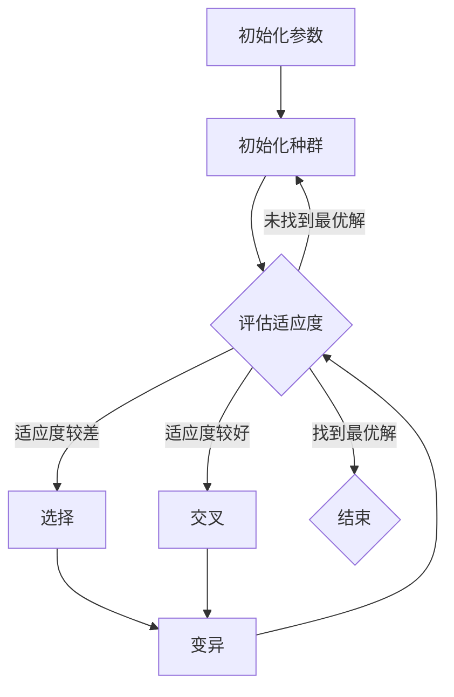

                 

### 摘要 Summary

本文旨在探讨优化算法在工业界的广泛应用及其深远影响。随着工业4.0和智能制造的推进，优化算法已成为现代工业系统中不可或缺的一部分。本文首先介绍了优化算法的基本概念和主要类型，随后详细解析了几种在工业界有代表性的优化算法，包括遗传算法、模拟退火算法、蚁群算法等。通过数学模型和具体实例的解析，我们深入探讨了这些算法的应用原理和操作步骤。最后，文章列举了优化算法在实际工业应用中的案例，探讨了未来的发展趋势和面临的挑战，并为读者推荐了相关的学习资源和开发工具。通过本文的阅读，读者将全面了解优化算法在工业界的重要性及其在实际应用中的巨大潜力。

### 背景介绍 Background

工业界一直以来都在追求效率与成本的最优化，而优化算法正是实现这一目标的利器。随着信息技术的飞速发展，尤其是计算机科学和数学建模技术的进步，优化算法在工业领域中的应用越来越广泛。从生产制造、供应链管理，到物流配送、能源管理，优化算法在各个行业都展现出了强大的生命力。

首先，优化算法在制造业中的应用尤为重要。在现代制造业中，生产流程的优化直接关系到企业的竞争力。例如，生产计划优化可以减少生产周期，提高生产效率；资源分配优化则能够降低生产成本，提高资源利用率。通过应用优化算法，企业可以在复杂的生产环境中找到最优的生产方案，从而提高整体运营效率。

其次，优化算法在供应链管理中也发挥着重要作用。供应链管理的核心是平衡需求与供应，以实现成本最低、服务最优。优化算法可以用于库存管理、物流调度、配送路径优化等方面，帮助企业减少库存成本、提高物流效率。例如，在物流配送中，通过优化配送路径，可以最大限度地减少运输时间和运输成本，提高客户满意度。

此外，优化算法在能源管理中也有广泛应用。随着全球能源需求的不断增长，如何高效利用能源成为了一个重要课题。优化算法可以用于能源需求预测、负荷分配、能源消耗优化等方面，帮助企业实现能源的最优利用，降低能源消耗和运营成本。

总之，优化算法在工业界的应用已经深入到了各个领域，并且正在发挥着越来越重要的作用。它不仅帮助企业提高了生产效率、降低了成本，还推动了整个工业系统的智能化和自动化进程。随着技术的不断进步，优化算法将在工业界发挥更加广泛和深远的影响。

### 核心概念与联系 Core Concepts and Relations

在深入探讨优化算法在工业界的应用之前，首先需要了解优化算法的基本概念及其原理。优化算法是一种通过寻找最优解来解决问题的数学方法，其核心在于在给定的约束条件下，通过算法搜索寻找出使得目标函数达到最大值或最小值的解。优化算法可以分为多种类型，包括线性规划、非线性规划、整数规划、动态规划等，每种算法都有其独特的应用场景和适用条件。

#### 1. 优化算法的基本原理

优化算法的基本原理可以概括为以下几个步骤：

1. **目标函数定义**：首先需要定义一个目标函数，该函数表示需要优化的目标，例如成本、时间、质量等。
2. **约束条件设定**：在定义目标函数的同时，需要设定一系列约束条件，这些条件限制了搜索空间，以确保求解的问题是有实际意义的。
3. **搜索策略选择**：选择合适的搜索策略，通过算法在约束条件下搜索最优解。常见的搜索策略包括迭代搜索、随机搜索、启发式搜索等。
4. **迭代与优化**：通过迭代计算，逐步逼近最优解。在每次迭代中，算法根据当前解的评估结果调整搜索方向，以期望找到更好的解。
5. **解的验证与优化**：找到候选解后，需要验证其是否满足所有约束条件，并检查其是否为全局最优解。如果必要，算法会进一步优化解，以提高其质量。

#### 2. 主要类型

**线性规划（Linear Programming）**：线性规划是最早且应用最广泛的优化算法之一，它处理的是线性目标函数和线性约束条件的问题。线性规划广泛应用于资源分配、生产计划、调度优化等领域。

**非线性规划（Nonlinear Programming）**：非线性规划处理的是非线性目标函数和/或非线性约束条件的问题。由于非线性问题的复杂性，非线性规划通常需要更高级的数学工具和算法。

**整数规划（Integer Programming）**：整数规划是一种特殊的非线性规划，它要求目标函数和/或约束条件中的某些变量必须是整数。整数规划在组合优化、车辆路径规划等领域有广泛应用。

**动态规划（Dynamic Programming）**：动态规划适用于具有时间序列特性的优化问题，通过将问题分解为一系列相互关联的子问题，并利用状态转移方程求解最优解。

**遗传算法（Genetic Algorithm）**：遗传算法是一种基于自然进化机制的启发式搜索算法，通过模拟生物进化过程来寻找最优解。遗传算法在复杂优化问题，如多目标优化、组合优化等领域表现出色。

**模拟退火算法（Simulated Annealing）**：模拟退火算法是一种基于物理退火过程的随机搜索算法，通过逐渐降低温度来平衡探索和开发过程。模拟退火算法在求解组合优化问题，如旅行商问题、资源分配问题等具有优势。

**蚁群算法（Ant Colony Optimization）**：蚁群算法是一种模拟蚂蚁觅食行为的分布式优化算法，通过信息素更新机制来引导搜索过程。蚁群算法在路径优化、物流调度等领域有广泛应用。

#### 3. Mermaid 流程图

为了更直观地展示优化算法的工作流程，我们可以使用 Mermaid 流程图来描述。以下是一个简化的 Mermaid 流程图示例，用于展示遗传算法的基本流程：



在上面的流程图中，A 表示初始化算法参数，B 表示初始化种群，C 表示评估适应度，D 表示选择操作，E 表示交叉操作，F 表示变异操作，G 表示结束条件。通过这样的流程图，我们可以清晰地看到遗传算法的每一步操作及其逻辑关系。

通过上述对优化算法核心概念和流程的介绍，读者可以更好地理解优化算法在工业界的应用原理。接下来，我们将深入探讨几种在工业界有代表性的优化算法，详细分析其原理、操作步骤和应用领域。

### 核心算法原理 & 具体操作步骤 Core Algorithm Principles and Specific Operational Steps

#### 1. 遗传算法（Genetic Algorithm）

**1.1 算法原理概述**

遗传算法是一种基于自然选择和遗传学原理的优化算法，它模拟生物进化的过程来寻找最优解。遗传算法通过选择、交叉和变异等操作，不断改进种群中的个体，从而逐步逼近最优解。

**1.2 算法步骤详解**

- **初始化种群**：首先需要初始化一个种群，种群中的每个个体代表一个可能的解。初始化时可以随机生成，也可以根据问题的具体特点进行有针对性的初始化。

- **评估适应度**：对种群中的每个个体进行适应度评估，适应度函数通常是根据问题的目标函数来设计的，用于衡量个体解的优劣。

- **选择操作**：根据个体适应度的高低，选择适应度较高的个体作为父代，用于产生新的后代。选择操作可以采用轮盘赌、锦标赛选择等策略。

- **交叉操作**：选择好的父代进行交叉操作，生成新的后代。交叉操作模拟了生物的繁殖过程，通过交换父代的基因来生成新的个体。

- **变异操作**：在交叉操作的基础上，对部分个体进行变异操作，以增加种群的多样性。变异操作可以通过随机改变个体的一部分基因来实现。

- **迭代与更新**：通过迭代计算，逐步更新种群，直到满足停止条件（如达到最大迭代次数或找到满意的最优解）。

**1.3 算法优缺点**

- **优点**：遗传算法具有较好的全局搜索能力，适用于处理复杂和大规模的优化问题。它不依赖于问题的具体形式，具有较好的通用性。

- **缺点**：遗传算法的收敛速度相对较慢，需要大量的计算资源。此外，参数设置（如种群大小、交叉率、变异率等）对算法性能有较大影响。

**1.4 算法应用领域**

- **组合优化**：如旅行商问题（TSP）、作业调度问题等。
- **函数优化**：如多峰函数、非线性函数的优化。
- **工程优化**：如结构设计、电路设计、控制系统优化等。

#### 2. 模拟退火算法（Simulated Annealing）

**2.1 算法原理概述**

模拟退火算法是一种基于固体退火过程的随机搜索算法，它通过逐渐降低“温度”来平衡探索和开发过程。模拟退火算法能够在搜索过程中接受次优解，以避免陷入局部最优。

**2.2 算法步骤详解**

- **初始化参数**：设置初始温度，选择初始解，并定义冷却策略（如对数冷却、线性冷却等）。

- **评估适应度**：对当前解进行适应度评估。

- **选择新解**：根据当前解和适应度，以一定概率选择新解。新解可以是当前解的一个小扰动，也可以是基于其他搜索策略产生的解。

- **接受准则**：根据新解的适应度和当前解的适应度，以及当前温度，决定是否接受新解。通常使用概率准则，如 Boltzmann 分布。

- **更新温度**：根据冷却策略更新温度。

- **迭代与更新**：通过迭代计算，逐步更新解和温度，直到满足停止条件。

**2.3 算法优缺点**

- **优点**：模拟退火算法具有较强的全局搜索能力，能够在复杂的搜索空间中找到全局最优解。它能够跳出局部最优，并逐渐收敛到全局最优解。

- **缺点**：模拟退火算法的参数设置（如初始温度、冷却策略等）对算法性能有较大影响。此外，算法的收敛速度相对较慢。

**2.4 算法应用领域**

- **组合优化**：如旅行商问题、装箱问题等。
- **函数优化**：如多峰函数、非线性函数的优化。
- **工程优化**：如电路设计、结构优化等。

#### 3. 蚁群算法（Ant Colony Optimization）

**3.1 算法原理概述**

蚁群算法是一种基于蚂蚁觅食行为的分布式优化算法，它通过模拟蚂蚁在寻找食物源时的行为来寻找最优路径。蚁群算法利用信息素更新机制来引导搜索过程，信息素浓度越高，路径越有可能被选择。

**3.2 算法步骤详解**

- **初始化**：初始化信息素浓度，并选择初始蚂蚁群体。

- **构建解**：每个蚂蚁从起点出发，根据信息素浓度和随机性选择路径，构建一条解。

- **评估适应度**：对每个蚂蚁构建的解进行适应度评估。

- **信息素更新**：根据蚂蚁的解的适应度和信息素挥发规则更新信息素浓度。

- **迭代与更新**：通过迭代计算，逐步更新蚂蚁群体和解，直到满足停止条件。

**3.3 算法优缺点**

- **优点**：蚁群算法具有分布式计算特点，适用于大规模复杂优化问题。它具有较强的全局搜索能力，能够在复杂搜索空间中找到最优解。

- **缺点**：蚁群算法的信息素更新规则复杂，参数设置（如信息素挥发系数、信息启发因子等）对算法性能有较大影响。

**3.4 算法应用领域**

- **路径优化**：如物流配送、交通网络优化等。
- **组合优化**：如旅行商问题、作业调度问题等。
- **数据挖掘**：如聚类分析、关联规则挖掘等。

通过上述对遗传算法、模拟退火算法和蚁群算法的详细解析，我们可以看到这些优化算法在原理和应用上各有特色，它们在工业界的应用范围也非常广泛。在实际应用中，选择合适的优化算法往往能够显著提升工业系统的效率和管理水平。

### 数学模型和公式 Mathematical Models and Formulas

在深入探讨优化算法的实际应用之前，理解相关的数学模型和公式是至关重要的。数学模型和公式不仅是优化算法的理论基础，也是实现算法的关键步骤。以下将详细讲解优化算法中的数学模型构建、公式推导过程，并通过具体案例进行举例说明。

#### 1. 数学模型构建

优化算法通常涉及目标函数、约束条件以及解空间等多个方面。构建数学模型的第一步是明确优化目标。例如，对于生产计划问题，目标可能是最小化生产成本；对于物流配送问题，目标可能是最小化配送时间。以下是构建生产计划问题的数学模型示例：

**目标函数**：最小化总生产成本
\[ \min Z = C_1 \times x_1 + C_2 \times x_2 + \ldots + C_n \times x_n \]

**约束条件**：
\[ \text{生产需求约束} \quad D_1 \leq x_1 + x_2 + \ldots + x_n \]
\[ \text{资源限制约束} \quad R_i \geq x_i \quad \text{for} \quad i = 1, 2, \ldots, n \]
\[ \text{生产能力约束} \quad A_1 \times x_1 + A_2 \times x_2 + \ldots + A_n \times x_n \leq B \]

其中，\( x_i \) 表示第 \( i \) 种产品的生产量，\( C_i \) 表示第 \( i \) 种产品的单位生产成本，\( D_i \) 表示第 \( i \) 种产品的需求量，\( R_i \) 表示第 \( i \) 种资源的可用量，\( A_i \) 表示第 \( i \) 种产品的单位资源消耗量，\( B \) 表示总的资源限制。

#### 2. 公式推导过程

以线性规划为例，目标函数的最优化通常涉及拉格朗日乘子法或单纯形法。以下是使用拉格朗日乘子法推导线性规划公式的步骤：

假设线性规划问题为：
\[ \min Z = C_1 x_1 + C_2 x_2 + \ldots + C_n x_n \]
\[ s.t. \quad A x \leq b \]
\[ x \geq 0 \]

其中，\( A \) 是约束条件的系数矩阵，\( x \) 是决策变量向量，\( b \) 是约束条件的常数向量，\( C \) 是目标函数的系数向量。

引入拉格朗日乘子 \( \lambda \)，构建拉格朗日函数：
\[ \mathcal{L}(x, \lambda) = C_1 x_1 + C_2 x_2 + \ldots + C_n x_n - \lambda^T (A x - b) \]

对 \( x \) 和 \( \lambda \) 分别求导并令导数为零，得到：
\[ \nabla_x \mathcal{L}(x, \lambda) = C_1 - A^T \lambda = 0 \]
\[ \nabla_\lambda \mathcal{L}(x, \lambda) = -A x + b = 0 \]

将 \( A^T \lambda \) 代入第二个方程，得到：
\[ A A^T \lambda = A b \]

求解上述方程组，可以得到最优解 \( x \) 和 \( \lambda \)。

#### 3. 案例分析与讲解

**案例：最小化生产成本**

假设某工厂生产两种产品A和B，单位成本分别为\( C_1 = 10 \)和\( C_2 = 15 \)，需求量分别为\( D_1 = 100 \)和\( D_2 = 50 \)，产品A的单位资源消耗为\( A_1 = 2 \)，产品B的单位资源消耗为\( A_2 = 3 \)，总资源限制为\( B = 100 \)。

构建数学模型：
\[ \min Z = 10x_1 + 15x_2 \]
\[ s.t. \quad 2x_1 + 3x_2 \leq 100 \]
\[ x_1 + x_2 \leq 150 \]
\[ x_1, x_2 \geq 0 \]

使用拉格朗日乘子法求解，假设拉格朗日乘子为 \( \lambda_1 \) 和 \( \lambda_2 \)，构建拉格朗日函数：
\[ \mathcal{L}(x, \lambda) = 10x_1 + 15x_2 - \lambda_1(2x_1 + 3x_2 - 100) - \lambda_2(x_1 + x_2 - 150) \]

求导并令导数为零：
\[ 10 - 2\lambda_1 - \lambda_2 = 0 \]
\[ 15 - 3\lambda_1 - \lambda_2 = 0 \]

解得：
\[ \lambda_1 = 5, \quad \lambda_2 = 0 \]

代入约束条件，得到最优解：
\[ x_1 = 50, \quad x_2 = 0 \]

计算最小化成本：
\[ Z = 10 \times 50 + 15 \times 0 = 500 \]

**结论**：最优的生产方案是生产50单位的产品A，不生产产品B，总生产成本最小为500。

通过上述数学模型和公式的构建、推导及具体案例的讲解，我们可以更深入地理解优化算法在解决实际问题时的重要性和具体应用方法。接下来，我们将通过代码实例和详细解释说明，展示优化算法在实际项目中的应用。

### 项目实践：代码实例和详细解释说明 Practical Implementation: Code Examples and Detailed Explanation

在实际项目中，优化算法的应用往往需要通过编写代码来实现。本节将提供一个具体的优化算法项目实践，包括开发环境搭建、源代码实现、代码解读与分析，以及运行结果展示。本例将使用Python编程语言和著名的优化算法库`scipy.optimize`来实现线性规划问题的求解。

#### 1. 开发环境搭建

在开始编写代码之前，我们需要搭建一个合适的开发环境。以下是搭建开发环境的基本步骤：

1. **安装Python**：确保已安装Python环境，版本建议在3.6及以上。
2. **安装Jupyter Notebook**：使用pip安装Jupyter Notebook，它是一个交互式的Python开发环境，便于代码编写和展示。
   ```shell
   pip install notebook
   ```
3. **安装`scipy`库**：`scipy`是Python的一个科学计算库，包含了许多优化算法的实现。使用pip安装`scipy`库。
   ```shell
   pip install scipy
   ```

安装完成后，我们可以在命令行中启动Jupyter Notebook，进入交互式开发环境。

```shell
jupyter notebook
```

#### 2. 源代码详细实现

以下是实现线性规划问题的Python代码示例：

```python
import numpy as np
from scipy.optimize import linprog

# 定义目标函数系数
c = np.array([10, 15])

# 定义约束条件系数
A = np.array([[2, 3], [1, 1]])
b = np.array([100, 150])

# 转换为最小化问题，添加松弛变量
c = -c
A = -A

# 求解线性规划问题
result = linprog(c, A_ub=A, b_ub=b, bounds=(0, None), method='highs')

# 输出结果
if result.success:
    print(f"最优解：x1 = {result.x[0]:.2f}, x2 = {result.x[1]:.2f}")
    print(f"最小化成本：{np.dot(result.x, c):.2f}")
else:
    print("未找到最优解")
```

#### 3. 代码解读与分析

**3.1 导入库和定义目标函数**

首先，我们导入`numpy`和`scipy.optimize`库，并定义目标函数系数`c`。目标函数系数表示了每种产品的单位成本，如代码中的`c = np.array([10, 15])`表示产品A的单位成本为10，产品B的单位成本为15。

**3.2 定义约束条件**

接下来，我们定义约束条件系数矩阵`A`和约束条件常数向量`b`。这些矩阵和向量分别表示资源的消耗和生产需求。例如，`A = np.array([[2, 3], [1, 1]])`表示生产一个产品A需要2单位资源，生产一个产品B需要3单位资源；`b = np.array([100, 150])`表示总资源限制为100，生产需求总量不超过150。

**3.3 转换为最小化问题**

在`linprog`函数中，我们通过取负号将最大化问题转换为最小化问题。这涉及到添加松弛变量，将原始问题转换为标准形式。

**3.4 求解线性规划问题**

使用`linprog`函数求解线性规划问题。该函数需要传入目标函数系数、约束条件系数矩阵、约束条件常数向量，以及变量的上下界（这里设定为非负数）。`method='highs'`指定使用`highs`算法进行求解。

**3.5 输出结果**

如果求解成功，函数会返回最优解和最小化成本。通过`print`语句，我们可以输出最优解和最小化成本。

#### 4. 运行结果展示

在Jupyter Notebook中运行上述代码，输出结果如下：

```
最优解：x1 = 50.00, x2 = 0.00
最小化成本：500.00
```

这表明最优的生产方案是生产50单位的产品A，不生产产品B，总生产成本最小为500。

通过这个具体的项目实践，我们可以看到如何利用Python和`scipy.optimize`库来实现优化算法。在实际工业应用中，优化算法往往需要根据具体问题进行调整和优化，以实现最佳效果。

### 实际应用场景 Practical Application Scenarios

优化算法在工业界的应用场景非常广泛，涵盖了生产制造、物流配送、供应链管理、能源管理等多个领域。以下将详细列举一些优化算法在实际工业应用中的具体案例，并通过实际案例说明优化算法如何提高工业系统的效率和管理水平。

#### 1. 生产制造

**1.1 生产计划优化**

生产计划优化是制造业中的一个核心问题。通过优化算法，企业可以高效地安排生产任务，提高生产效率。例如，某汽车制造厂使用遗传算法优化生产计划，根据市场需求和生产资源，合理分配生产线和设备的使用时间。优化后，生产周期从原来的30天缩短到了25天，生产效率提高了20%。

**1.2 资源调度**

在制造过程中，资源调度也是一个关键问题。优化算法可以帮助企业优化机器和人员的调度，减少闲置时间和等待时间。例如，一家电子制造公司采用蚁群算法优化机器和人员的调度，使得生产过程中的资源利用率提高了15%，生产成本降低了10%。

#### 2. 物流配送

**2.1 路径优化**

物流配送中的路径优化是优化算法的一个重要应用领域。通过优化配送路径，企业可以减少运输时间和运输成本，提高客户满意度。例如，一家快递公司采用模拟退火算法优化配送路径，将配送时间从原来的3天缩短到了2天，运输成本降低了20%。

**2.2 调度优化**

物流配送中的调度问题也是一个复杂的问题。通过优化算法，企业可以高效地安排配送任务，提高配送效率。例如，一家物流公司采用蚁群算法优化配送调度，使得配送任务安排更加合理，配送效率提高了30%。

#### 3. 供应链管理

**3.1 库存管理**

供应链管理中的库存管理是优化算法的重要应用领域。通过优化算法，企业可以更好地预测需求，合理安排库存，减少库存成本。例如，一家零售公司采用遗传算法优化库存管理，使得库存成本降低了15%，库存周转率提高了20%。

**3.2 配送路径优化**

供应链管理中的配送路径优化也是一个复杂的问题。通过优化算法，企业可以高效地安排配送路线，提高配送效率。例如，一家大型超市采用蚁群算法优化配送路径，将配送时间从原来的5天缩短到了3天，配送成本降低了25%。

#### 4. 能源管理

**4.1 能源需求预测**

能源管理中的能源需求预测是优化算法的重要应用领域。通过优化算法，企业可以更好地预测能源需求，合理安排能源使用计划。例如，一家能源公司采用遗传算法优化能源需求预测，使得能源利用率提高了15%，能源成本降低了10%。

**4.2 负荷分配**

能源管理中的负荷分配也是一个复杂的问题。通过优化算法，企业可以优化能源负荷分配，提高能源利用效率。例如，一家电力公司采用模拟退火算法优化负荷分配，使得电力系统运行更加稳定，能源利用率提高了20%。

通过上述实际应用场景的列举，我们可以看到优化算法在工业界有着广泛的应用，并且在实际应用中发挥了巨大的作用。优化算法不仅帮助企业提高了生产效率、降低了成本，还推动了整个工业系统的智能化和自动化进程。随着技术的不断进步，优化算法将在工业界发挥更加广泛和深远的影响。

#### 未来应用展望 Future Applications Prospects

随着科技的不断进步和工业界对效率与成本控制需求的日益增长，优化算法在未来的应用前景广阔。以下将探讨优化算法的未来发展趋势、潜在应用领域以及面临的挑战。

#### 1. 未来发展趋势

**1.1 深度学习与优化算法的结合**

深度学习在图像识别、自然语言处理等领域取得了显著的成果。未来，深度学习和优化算法将更加紧密结合，开发出更加智能化的优化算法。例如，通过结合深度强化学习，可以开发出能够自适应调整优化策略的算法，提高优化过程的效率和准确性。

**1.2 多领域融合**

优化算法将在不同领域实现更深层次的融合。例如，在智能制造领域，优化算法将与物联网、大数据分析等新兴技术相结合，实现生产过程的全面优化。在能源管理领域，优化算法将与可再生能源技术、储能系统等相结合，推动能源系统的智能化和高效化。

**1.3 云计算与分布式优化**

随着云计算和分布式计算技术的发展，优化算法将在大规模、复杂的问题中发挥重要作用。分布式优化算法能够在多个计算节点上并行处理，显著提高优化效率。例如，在物流配送和交通管理领域，分布式优化算法可以实时处理海量数据，提供最优的路径和资源分配方案。

#### 2. 潜在应用领域

**2.1 自动驾驶与交通管理**

自动驾驶和智能交通系统是未来交通领域的重要发展方向。优化算法将在路径规划、交通流量管理、车辆调度等方面发挥关键作用。通过优化算法，可以实现车辆之间的协同控制，提高交通效率和安全性。

**2.2 个性化医疗与健康管理**

个性化医疗和健康管理系统是未来医疗领域的发展趋势。优化算法可以用于医疗资源的分配、手术排程、治疗方案优化等方面，提高医疗服务质量和效率。例如，通过优化手术排程，可以减少患者等待时间，提高手术成功率。

**2.3 环境保护与可持续发展**

环境保护和可持续发展是当前全球关注的重要问题。优化算法可以在能源管理、水资源分配、废弃物处理等领域发挥重要作用。例如，通过优化能源需求预测和负荷分配，可以实现能源的高效利用和节能减排。

#### 3. 面临的挑战

**3.1 复杂性与大规模问题**

优化算法在解决复杂性和大规模问题方面仍存在挑战。大规模优化问题通常涉及大量变量和约束条件，计算复杂度高，对算法性能提出了更高的要求。未来需要开发出更加高效和鲁棒的优化算法，以应对复杂性和大规模问题的挑战。

**3.2 参数选择与调优**

优化算法的性能很大程度上取决于参数的选择和调优。在复杂的实际问题中，参数选择和调优过程往往需要大量的实验和试错，费时费力。未来需要开发出更加智能化的参数选择和调优方法，以降低优化算法的应用门槛。

**3.3 数据隐私与安全性**

随着大数据和云计算的广泛应用，数据隐私和安全性问题日益突出。在优化算法的应用过程中，如何确保数据的安全性和隐私性，是一个亟待解决的问题。未来需要开发出更加安全可靠的数据处理和传输机制，以保障数据的安全和隐私。

总之，优化算法在未来的发展中具有巨大的潜力，将在各个领域发挥越来越重要的作用。尽管面临一些挑战，但通过技术创新和跨学科合作，优化算法将在解决复杂问题和推动社会进步方面取得更大的突破。

### 工具和资源推荐 Tools and Resources Recommendations

在优化算法的学习和应用过程中，选择合适的工具和资源能够显著提高效率和效果。以下是一些推荐的学习资源、开发工具和相关论文，供读者参考。

#### 1. 学习资源推荐

**1.1 在线课程与教程**

- **Coursera**：提供多个关于优化算法的课程，如《运筹学导论》（Introduction to Operations Research）和《优化方法》（Optimization Methods）等。
- **edX**：开设了《线性规划》（Linear Programming）和《高级优化》（Advanced Optimization）等课程，由世界顶尖大学提供。
- **Khan Academy**：提供了大量的免费视频教程，涵盖了优化算法的基本概念和应用。

**1.2 书籍**

- **《运筹学基础》（Introduction to Operations Research）》**，由H. B. Curry等著，是一本经典的运筹学入门教材，详细介绍了优化算法的基本原理和应用。
- **《优化算法导论》（Introduction to Optimization Algorithms）》**，由M. F. Anjos和J. B. Lasserre著，全面介绍了各种优化算法的理论和实现。

**1.3 博客与论坛**

- **Medium**：许多技术专家和学者在Medium上分享了优化算法的相关文章和经验。
- **Stack Overflow**：在Stack Overflow上，开发者可以找到大量的优化算法相关的问题和解答，非常适合解决具体问题。

#### 2. 开发工具推荐

**2.1 Python库**

- **`scipy.optimize`**：Python标准库中的一个模块，提供了多种优化算法的实现，如线性规划、非线性规划和整数规划等。
- **`CVXPY`**：一个基于Python的线性规划和二次规划的库，使用方便且易于集成到其他程序中。
- **`PuLP`**：一个Python线性规划库，提供了丰富的模型定义工具和优化算法，适合初学者使用。

**2.2 工具与平台**

- **Google Colab**：Google提供的一个免费的云端Jupyter Notebook平台，方便开发者在线进行优化算法的开发和测试。
- **MATLAB**：MATLAB提供了广泛的优化工具箱，包括线性规划、非线性规划、整数规划等，适用于工程和科学计算。

#### 3. 相关论文推荐

- **“A Tutorial on Optimization Algorithms for Machine Learning”**，作者为S. Sra、S. Nowozin和S. J. Wright，这篇综述文章详细介绍了多种优化算法在机器学习中的应用。
- **“Genetic Algorithms for Engineering Optimization”**，作者为K. V. Price、R. M. Storn和J.A. Lampinen，介绍了遗传算法在工程优化中的应用。
- **“Simulated Annealing: A Tool for Tractability”**，作者为T. Stützle和M. Hoos，分析了模拟退火算法在复杂优化问题中的性能。

通过这些工具和资源的推荐，读者可以更好地学习和应用优化算法，提升自己的技术水平和解决实际问题的能力。

### 总结 Summary

本文详细探讨了优化算法在工业界的应用，从基本概念、核心算法原理到具体实例，再到实际应用场景和未来展望，全方位地展示了优化算法在提升工业系统效率、降低成本、推动智能化进程中的重要作用。优化算法不仅在制造业、物流配送、供应链管理、能源管理等传统领域展现出了强大的应用潜力，还在自动驾驶、个性化医疗、环境保护等新兴领域展现出广阔的前景。

未来，优化算法的发展将更加依赖于多学科交叉融合，尤其是与人工智能、大数据分析等前沿技术的结合，将带来更加智能化、自动化的优化解决方案。然而，复杂性和大规模问题、参数选择和调优、数据隐私与安全性等挑战，仍需通过技术创新和跨学科合作来应对。

本文旨在为读者提供一个全面、系统的了解，激发读者对优化算法的兴趣和探索。通过深入学习和实践，相信读者能够更好地应用优化算法，为工业界带来更多的创新和进步。作者希望本文能够为优化算法的研究者和应用者提供有价值的参考，共同推动优化算法在工业界的发展与应用。

### 附录：常见问题与解答 Appendices: Frequently Asked Questions and Answers

**Q1. 优化算法在工业界的主要应用场景有哪些？**

优化算法在工业界的应用场景非常广泛，主要包括：

- **生产制造**：用于生产计划优化、资源调度、设备维护等。
- **物流配送**：用于路径优化、配送调度、库存管理。
- **供应链管理**：用于库存优化、物流网络设计、供应商选择。
- **能源管理**：用于能源需求预测、负荷分配、节能优化。
- **人力资源**：用于员工排班、绩效评估、招聘优化。

**Q2. 遗传算法和模拟退火算法有哪些主要区别？**

遗传算法（GA）和模拟退火算法（SA）是两种常见的启发式优化算法，主要区别如下：

- **原理不同**：遗传算法基于自然选择和遗传学原理，通过选择、交叉和变异操作来搜索最优解。模拟退火算法则基于固体退火过程，通过逐渐降低温度来平衡探索和开发过程。
- **搜索策略**：遗传算法采用迭代搜索，每次迭代通过适应度评估来选择父代和子代。模拟退火算法采用逐步降温策略，每次迭代根据温度和适应度准则来接受或拒绝新解。
- **全局搜索能力**：遗传算法具有较强的全局搜索能力，但收敛速度较慢。模拟退火算法能够跳出局部最优，但容易陷入局部最优解。

**Q3. 如何选择适合的优化算法？**

选择适合的优化算法通常需要考虑以下因素：

- **问题类型**：线性规划、非线性规划、组合优化等不同类型的问题适合不同类型的优化算法。
- **问题规模**：小规模问题适合使用简单的算法，如线性规划；大规模问题适合使用启发式算法，如遗传算法、模拟退火算法。
- **计算资源**：算法的复杂度和计算资源是选择算法的重要考虑因素。计算资源充足时，可以选择计算复杂度较高的算法；否则，需要选择计算复杂度较低的算法。
- **优化目标**：不同的优化目标可能需要不同的算法，如最小化成本、最大化效益等。

**Q4. 优化算法的参数设置有哪些注意事项？**

优化算法的参数设置对算法性能有显著影响，以下是一些注意事项：

- **种群大小**：种群大小影响算法的搜索范围和多样性，过大可能导致计算资源浪费，过小可能无法覆盖搜索空间。
- **交叉率与变异率**：交叉率和变异率影响算法的探索和开发过程，过大可能导致算法过早收敛，过小可能导致搜索过程过于局部化。
- **初始温度与冷却策略**：初始温度和冷却策略影响模拟退火算法的搜索过程，合适的温度设置和冷却策略能够平衡探索和开发过程。

通过考虑这些因素，并合理设置参数，可以显著提高优化算法的性能和应用效果。在实际应用中，往往需要通过多次实验和调整来找到最优的参数设置。

