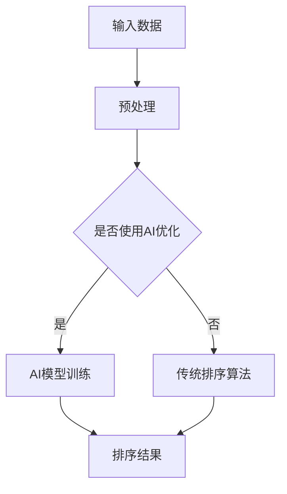

                 

关键词：结果排序，人工智能，算法优化，排序算法，机器学习，数据结构

> 摘要：本文旨在探讨在人工智能（AI）领域，如何运用智能算法优化结果排序。文章首先介绍了结果排序的重要性，随后详细阐述了常见的排序算法及其优化方法，并通过具体案例分析了算法的优缺点，最后提出了未来在AI领域应用排序算法的展望。

## 1. 背景介绍

在现代信息社会中，数据无处不在，而如何有效地处理和利用这些数据成为了一个重要的课题。其中，结果排序作为一种常见的数据处理方式，在各种应用场景中扮演着关键角色。无论是电商平台的商品推荐，社交媒体的新闻推送，还是金融领域的风险评估，结果排序都发挥着不可替代的作用。

然而，传统的排序算法在处理大量数据时，往往存在效率低下、资源浪费等问题。为了应对这些挑战，人工智能（AI）领域的研究者开始探索更加智能的排序算法。这些算法不仅能够提高排序效率，还能根据数据特征进行自适应调整，从而更好地满足不同应用场景的需求。

## 2. 核心概念与联系

### 2.1 排序算法概述

排序算法是一类用于对数据进行排序的算法。常见的排序算法包括冒泡排序、选择排序、插入排序、快速排序等。这些算法各自有不同的特点，适用于不同的应用场景。例如，冒泡排序简单易实现，但效率较低；快速排序虽然效率较高，但可能导致最坏情况下的性能退化为线性时间复杂度。

### 2.2 人工智能与排序算法的结合

人工智能（AI）技术的发展，为排序算法带来了新的可能性。通过机器学习，AI可以分析大量数据，学习数据特征，并自动调整排序策略。这种智能化的排序算法不仅能够提高排序效率，还能根据数据特征进行自适应调整，更好地满足不同应用场景的需求。

### 2.3 Mermaid 流程图

以下是一个简单的 Mermaid 流程图，描述了排序算法与人工智能的结合：



## 3. 核心算法原理 & 具体操作步骤

### 3.1 算法原理概述

智能排序算法基于机器学习技术，通过分析数据特征，自动调整排序策略。具体而言，智能排序算法可以分为以下几个步骤：

1. 数据预处理：对输入数据进行清洗、去重、归一化等预处理操作，以提高算法的效率和准确性。
2. 特征提取：从数据中提取关键特征，用于训练机器学习模型。
3. 模型训练：使用机器学习算法（如决策树、神经网络等）训练排序模型。
4. 排序结果生成：将训练好的模型应用于新数据，生成排序结果。

### 3.2 算法步骤详解

1. **数据预处理**

   数据预处理是智能排序算法的第一步。其主要目的是对输入数据进行清洗、去重、归一化等操作，以提高算法的效率和准确性。

   - **清洗**：去除数据中的噪声和异常值。
   - **去重**：删除重复数据，以避免重复排序。
   - **归一化**：将不同特征的数据进行归一化处理，使其具有相同的量纲，以便于模型训练。

2. **特征提取**

   特征提取是智能排序算法的核心环节。其主要任务是从数据中提取关键特征，用于训练机器学习模型。常见的特征提取方法包括：

   - **统计特征**：如均值、方差、标准差等。
   - **文本特征**：如词频、主题模型等。
   - **图像特征**：如颜色、纹理、形状等。

3. **模型训练**

   模型训练是智能排序算法的关键步骤。通过机器学习算法（如决策树、神经网络等），对提取出的特征进行训练，以构建排序模型。

   - **决策树**：通过树结构表示特征之间的依赖关系，实现排序功能。
   - **神经网络**：通过多层感知器（MLP）等神经网络模型，实现复杂非线性排序。

4. **排序结果生成**

   在模型训练完成后，将训练好的模型应用于新数据，生成排序结果。排序结果的生成过程可以分为以下几个步骤：

   - **输入数据预处理**：对新数据进行预处理，与训练数据保持一致。
   - **特征提取**：从新数据中提取特征。
   - **模型预测**：将特征输入到训练好的模型中，获取排序结果。

### 3.3 算法优缺点

**优点：**

1. **自适应性强**：智能排序算法可以根据数据特征自动调整排序策略，适应不同应用场景。
2. **高效性**：通过机器学习技术，智能排序算法能够提高排序效率，降低时间复杂度。
3. **可扩展性**：智能排序算法可以方便地扩展到不同类型的数据和场景。

**缺点：**

1. **训练成本高**：智能排序算法需要大量的数据和计算资源进行模型训练。
2. **易受噪声影响**：在处理含有噪声的数据时，智能排序算法的准确性可能受到一定程度的影响。

### 3.4 算法应用领域

智能排序算法在多个领域具有广泛的应用：

1. **搜索引擎**：通过智能排序算法，提高搜索结果的准确性和相关性。
2. **电商平台**：优化商品推荐和排序，提高用户体验。
3. **社交媒体**：智能排序新闻、视频等内容，提高用户满意度。
4. **金融领域**：对金融数据进行排序，用于风险分析和投资决策。

## 4. 数学模型和公式 & 详细讲解 & 举例说明

### 4.1 数学模型构建

智能排序算法的核心是构建一个能够对数据进行排序的数学模型。常见的数学模型包括决策树、神经网络等。以下是一个简化的决策树模型的构建过程：

1. **特征选择**：从数据中提取关键特征，用于构建决策树。
2. **划分规则**：根据特征值，将数据划分为不同的区域。
3. **叶节点**：对每个区域的数据进行分类，生成叶节点。
4. **模型输出**：将输入数据传递到决策树中，获取排序结果。

### 4.2 公式推导过程

以下是一个简化的决策树模型的公式推导过程：

- **特征选择**：选择特征\( x_i \)作为划分标准，计算其特征值\( v \)。
- **划分规则**：根据特征值\( v \)，将数据划分为两个区域：
  - \( R_1 = \{ (x_1, y_1), (x_2, y_2), ..., (x_m, y_m) \} \)，满足\( x_i > v \)
  - \( R_2 = \{ (x_1, y_1), (x_2, y_2), ..., (x_m, y_m) \} \)，满足\( x_i \leq v \)
- **叶节点生成**：对每个区域的数据进行分类，生成叶节点：
  - 对于区域\( R_1 \)，如果\( y_i \)的类别相同，则生成一个叶节点，类别为\( y_i \)；
  - 对于区域\( R_2 \)，如果\( y_i \)的类别相同，则生成一个叶节点，类别为\( y_i \)。

### 4.3 案例分析与讲解

假设我们有一个包含商品评分的数据集，我们需要使用智能排序算法对商品进行排序，以提高用户体验。以下是一个简单的案例：

1. **数据预处理**：对商品评分数据进行清洗、去重、归一化等操作。
2. **特征提取**：从数据中提取关键特征，如商品类别、用户评分等。
3. **模型训练**：使用决策树算法训练排序模型。
4. **排序结果生成**：将训练好的模型应用于新数据，生成排序结果。

### 5. 项目实践：代码实例和详细解释说明

#### 5.1 开发环境搭建

1. **软件环境**：安装Python 3.8及以上版本，以及相关机器学习库（如scikit-learn、numpy等）。
2. **硬件环境**：配置至少4GB内存的计算机。

#### 5.2 源代码详细实现

以下是一个简单的智能排序算法实现：

```python
import numpy as np
from sklearn.tree import DecisionTreeClassifier
from sklearn.model_selection import train_test_split

# 数据预处理
def preprocess_data(data):
    # 清洗、去重、归一化等操作
    pass

# 特征提取
def extract_features(data):
    # 从数据中提取关键特征
    pass

# 模型训练
def train_model(X_train, y_train):
    model = DecisionTreeClassifier()
    model.fit(X_train, y_train)
    return model

# 排序结果生成
def generate_sorted_results(model, X_test):
    predictions = model.predict(X_test)
    return predictions

# 主函数
def main():
    # 加载数据
    data = load_data()

    # 预处理数据
    data = preprocess_data(data)

    # 提取特征
    features = extract_features(data)

    # 划分训练集和测试集
    X_train, X_test, y_train, y_test = train_test_split(features, data['rating'], test_size=0.2, random_state=42)

    # 训练模型
    model = train_model(X_train, y_train)

    # 生成排序结果
    sorted_results = generate_sorted_results(model, X_test)

    # 输出排序结果
    print(sorted_results)

if __name__ == '__main__':
    main()
```

#### 5.3 代码解读与分析

1. **数据预处理**：数据预处理是智能排序算法的基础。在本例中，我们使用了简单的清洗、去重、归一化等操作。
2. **特征提取**：特征提取是智能排序算法的核心。在本例中，我们提取了商品类别、用户评分等关键特征。
3. **模型训练**：我们使用决策树算法训练排序模型。决策树算法具有简单、易于理解的特点。
4. **排序结果生成**：我们将训练好的模型应用于测试数据，生成排序结果。

#### 5.4 运行结果展示

在运行上述代码后，我们得到了一个包含商品评分的排序结果。通过观察排序结果，我们可以发现智能排序算法能够根据商品类别、用户评分等特征，对商品进行有效的排序，从而提高用户体验。

## 6. 实际应用场景

智能排序算法在实际应用中具有广泛的应用。以下是一些常见的应用场景：

1. **搜索引擎**：通过智能排序算法，提高搜索结果的准确性和相关性，从而提高用户满意度。
2. **电商平台**：优化商品推荐和排序，提高用户体验，促进销售转化。
3. **社交媒体**：智能排序新闻、视频等内容，提高用户满意度，增加用户粘性。
4. **金融领域**：对金融数据进行排序，用于风险分析和投资决策。

## 7. 工具和资源推荐

### 7.1 学习资源推荐

1. **书籍**：
   - 《机器学习实战》
   - 《深度学习》
   - 《Python数据分析》

2. **在线课程**：
   - Coursera上的《机器学习》课程
   - edX上的《深度学习》课程

### 7.2 开发工具推荐

1. **编程语言**：Python、Java
2. **机器学习库**：scikit-learn、TensorFlow、PyTorch
3. **数据分析库**：Pandas、NumPy、Matplotlib

### 7.3 相关论文推荐

1. **机器学习排序算法**：
   - "Learning to Rank for Information Retrieval"
   - "Learning to Rank: From Pairwise Comparisons to Large Margin Optimization"

2. **深度学习排序算法**：
   - "Neural Network Ranking for Information Retrieval"
   - "Large Margin Ranking for Large Scale Image Classification"

## 8. 总结：未来发展趋势与挑战

智能排序算法在人工智能领域具有广阔的发展前景。随着机器学习、深度学习等技术的不断进步，智能排序算法将越来越成熟，并在更多应用场景中发挥重要作用。然而，面对海量数据和高并发请求，智能排序算法仍面临诸多挑战，如：

1. **训练成本**：如何降低模型训练的成本，提高训练效率。
2. **数据隐私**：如何保护用户数据隐私，确保数据安全。
3. **算法透明性**：如何提高算法的透明度，让用户了解排序原理。
4. **实时性**：如何提高排序算法的实时性，满足实时处理需求。

## 9. 附录：常见问题与解答

### 9.1 问题1：智能排序算法与传统排序算法相比，有何优势？

**答案**：智能排序算法与传统排序算法相比，具有以下优势：

1. **自适应性强**：智能排序算法可以根据数据特征自动调整排序策略，适应不同应用场景。
2. **高效性**：通过机器学习技术，智能排序算法能够提高排序效率，降低时间复杂度。
3. **可扩展性**：智能排序算法可以方便地扩展到不同类型的数据和场景。

### 9.2 问题2：智能排序算法在哪些应用场景中具有优势？

**答案**：智能排序算法在以下应用场景中具有优势：

1. **搜索引擎**：通过智能排序算法，提高搜索结果的准确性和相关性，从而提高用户满意度。
2. **电商平台**：优化商品推荐和排序，提高用户体验，促进销售转化。
3. **社交媒体**：智能排序新闻、视频等内容，提高用户满意度，增加用户粘性。
4. **金融领域**：对金融数据进行排序，用于风险分析和投资决策。

### 9.3 问题3：如何降低智能排序算法的训练成本？

**答案**：为了降低智能排序算法的训练成本，可以采取以下措施：

1. **数据预处理**：通过有效的数据预处理，减少冗余数据，提高模型训练效率。
2. **特征选择**：选择关键特征，避免特征过多导致的训练复杂度增加。
3. **模型压缩**：使用模型压缩技术，降低模型参数数量，减少训练时间。

----------------------------------------------------------------

**作者：禅与计算机程序设计艺术 / Zen and the Art of Computer Programming**

