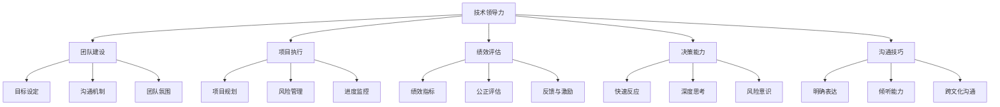

                 

关键词：优秀管理者、普通管理者、管理差异、技术领导力、团队建设、项目执行、绩效评估、决策能力、沟通技巧

> 摘要：本文将深入探讨优秀管理者与普通管理者之间的关键差异，分析其在技术领导力、团队建设、项目执行、绩效评估、决策能力及沟通技巧等方面的具体表现，旨在为IT行业从业者提供实用的管理见解和提升建议。

## 1. 背景介绍

在IT行业，优秀的管理者往往能够带领团队取得卓越的成绩，而普通管理者则可能在面临复杂的项目和问题时表现平平。那么，究竟优秀管理者与普通管理者之间的差异在哪里？本文将围绕以下几个方面进行深入探讨：

- 技术领导力
- 团队建设
- 项目执行
- 绩效评估
- 决策能力
- 沟通技巧

通过对这些方面的分析，希望能够揭示优秀管理者的特质和行为模式，为广大IT从业者提供有价值的参考。

### 1.1 IT行业管理的现状与挑战

随着信息技术的快速发展，IT行业正面临着前所未有的变革。在这个快速迭代、竞争激烈的环境中，管理者不仅要具备扎实的技术背景，还需要具备出色的管理能力和决策能力。

根据一项针对全球IT行业管理者的调查，超过60%的管理者认为当前最大的管理挑战是项目进度的控制，超过50%的管理者则认为沟通和团队协作是最大的难题。此外，随着远程工作和跨文化团队的增加，管理者还面临着更复杂的沟通和管理问题。

### 1.2 优秀管理者与普通管理者的定义

优秀管理者：具备扎实的专业知识、卓越的领导力、高效的项目执行能力和良好的沟通技巧，能够在各种复杂环境中带领团队取得优异成绩的管理者。

普通管理者：具备一定的专业知识和管理能力，但在面临复杂问题时可能表现平平，缺乏创新和远见，无法充分发挥团队潜力。

## 2. 核心概念与联系

在探讨优秀管理者与普通管理者的差异之前，我们需要明确几个核心概念：

- 技术领导力：指管理者在技术领域的专业知识和领导能力，能够为团队树立榜样和提供技术指导。
- 团队建设：指管理者通过有效的沟通和协作，打造一个高效、和谐的团队，提高团队整体执行力。
- 项目执行：指管理者在项目规划、执行和监控过程中，确保项目按计划完成，并实现预期目标。
- 绩效评估：指管理者通过制定合理的绩效指标，对团队成员的工作表现进行评估和反馈，激励团队不断提升。
- 决策能力：指管理者在面对复杂问题和不确定性时，能够快速做出合理、有效的决策。
- 沟通技巧：指管理者在团队内部和外部，通过有效的沟通方式，传达信息、解决问题和建立信任。

### 2.1 核心概念原理

#### 技术领导力

技术领导力是优秀管理者的核心特质之一。一个优秀的技术领导者不仅需要具备深厚的技术背景，还需要具备以下能力：

1. 技术视野：能够紧跟行业发展趋势，了解最新的技术动态和前沿技术，为团队提供明确的技术发展方向。
2. 技术指导：能够为团队成员提供技术支持和指导，帮助他们解决技术难题，提高技术能力。
3. 创新能力：能够激发团队的创新思维，推动技术进步和业务发展。

#### 团队建设

团队建设是优秀管理者的重要任务之一。一个高效的团队需要具备以下特质：

1. 明确的目标：管理者需要为团队设定明确的目标，确保团队成员对目标有清晰的认识和统一的行动方向。
2. 良好的沟通：管理者需要建立良好的沟通机制，确保团队内部信息畅通，减少误解和冲突。
3. 和谐的团队氛围：管理者需要营造一个和谐、包容的团队氛围，鼓励团队成员相互支持、协作，共同成长。

#### 项目执行

项目执行是管理者的重要职责之一。一个优秀的管理者需要具备以下能力：

1. 项目规划：管理者需要制定详细的项目计划，明确项目目标、任务分工和时间安排，确保项目有序推进。
2. 风险管理：管理者需要识别项目中的潜在风险，制定相应的应对策略，确保项目顺利实施。
3. 进度监控：管理者需要实时监控项目进度，及时发现并解决问题，确保项目按计划完成。

#### 绩效评估

绩效评估是管理者激励团队、提升团队整体表现的重要手段。一个优秀的管理者需要具备以下能力：

1. 合理的绩效指标：管理者需要制定合理的绩效指标，确保指标与团队目标紧密相关，能够全面反映团队成员的工作表现。
2. 公正的评估：管理者需要公正、客观地对团队成员的工作进行评估，确保评估结果公平、合理。
3. 反馈与激励：管理者需要及时给予团队成员反馈，肯定他们的成绩，激励他们持续提升。

#### 决策能力

决策能力是管理者在面临复杂问题和不确定性时的重要能力。一个优秀的管理者需要具备以下能力：

1. 快速反应：管理者需要能够迅速应对突发事件，做出合理的决策，确保团队稳定运营。
2. 深度思考：管理者需要具备深度思考的能力，从多个角度分析问题，找到最佳解决方案。
3. 风险意识：管理者需要具备风险意识，预见潜在的风险，并采取相应的措施进行规避。

#### 沟通技巧

沟通技巧是管理者在团队内外建立信任、传递信息、解决问题的重要手段。一个优秀的管理者需要具备以下能力：

1. 明确表达：管理者需要能够清晰、准确地表达自己的想法和意见，确保团队成员理解。
2. 倾听能力：管理者需要具备良好的倾听能力，关注团队成员的需求和反馈，尊重他们的意见。
3. 跨文化沟通：在全球化背景下，管理者需要具备跨文化沟通能力，与来自不同国家和文化背景的团队成员有效沟通。

### 2.2 架构的 Mermaid 流程图

下面是关于优秀管理者与普通管理者核心概念和联系的一个Mermaid流程图：



通过以上核心概念和联系的分析，我们可以更加清晰地理解优秀管理者与普通管理者之间的差异。

## 3. 核心算法原理 & 具体操作步骤

在理解了优秀管理者的核心概念和联系之后，我们需要深入探讨这些能力的具体操作步骤，以便更好地理解优秀管理者是如何在实际工作中发挥作用的。

### 3.1 算法原理概述

优秀管理者的核心能力可以看作是一系列算法的组合，这些算法包括：

- 技术领导力算法：用于培养和提升团队技术能力。
- 团队建设算法：用于打造高效、和谐的团队。
- 项目执行算法：用于确保项目按计划完成。
- 绩效评估算法：用于激励团队、提升整体表现。
- 决策能力算法：用于面对复杂问题和不确定性时做出合理决策。
- 沟通技巧算法：用于建立信任、传递信息、解决问题。

这些算法的共同目标是提高团队的执行力和竞争力，实现组织的战略目标。

### 3.2 算法步骤详解

#### 技术领导力算法

1. **技术视野培养**：通过阅读技术书籍、参加行业会议和研讨会，紧跟行业发展趋势，了解最新的技术动态和前沿技术。
2. **技术指导实施**：定期组织技术分享会，分享自己的技术见解和实践经验，帮助团队成员解决技术难题。
3. **创新能力激发**：鼓励团队成员进行技术探索和创新，提供必要的资源和支持，激发团队的创造力。

#### 团队建设算法

1. **目标设定**：与团队共同制定明确的目标，确保团队成员对目标有清晰的认识和统一的行动方向。
2. **沟通机制建立**：定期召开团队会议，建立高效的沟通机制，确保团队内部信息畅通，减少误解和冲突。
3. **团队氛围营造**：关注团队成员的需求和反馈，营造一个和谐、包容的团队氛围，鼓励团队成员相互支持、协作，共同成长。

#### 项目执行算法

1. **项目规划**：制定详细的项目计划，明确项目目标、任务分工和时间安排，确保项目有序推进。
2. **风险管理**：识别项目中的潜在风险，制定相应的应对策略，确保项目顺利实施。
3. **进度监控**：实时监控项目进度，及时发现并解决问题，确保项目按计划完成。

#### 绩效评估算法

1. **绩效指标制定**：制定合理的绩效指标，确保指标与团队目标紧密相关，能够全面反映团队成员的工作表现。
2. **公正评估实施**：公正、客观地对团队成员的工作进行评估，确保评估结果公平、合理。
3. **反馈与激励**：及时给予团队成员反馈，肯定他们的成绩，激励他们持续提升。

#### 决策能力算法

1. **快速反应**：面对突发事件，迅速分析问题，做出合理决策，确保团队稳定运营。
2. **深度思考**：从多个角度分析问题，找到最佳解决方案，确保决策的合理性和有效性。
3. **风险意识培养**：预见潜在的风险，并采取相应的措施进行规避，降低决策风险。

#### 沟通技巧算法

1. **明确表达**：清晰、准确地表达自己的想法和意见，确保团队成员理解。
2. **倾听能力提升**：关注团队成员的需求和反馈，尊重他们的意见，建立良好的信任关系。
3. **跨文化沟通**：了解不同文化背景的沟通习惯和方式，与来自不同国家和文化背景的团队成员有效沟通。

### 3.3 算法优缺点

#### 技术领导力算法

**优点**：提高团队的技术水平和创新能力，增强团队在市场中的竞争力。

**缺点**：需要管理者具备扎实的技术背景，对管理者的个人能力要求较高。

#### 团队建设算法

**优点**：打造高效、和谐的团队，提高团队的整体执行力。

**缺点**：需要管理者投入大量的时间和精力，对管理者的耐心和沟通能力要求较高。

#### 项目执行算法

**优点**：确保项目按计划完成，实现预期目标。

**缺点**：需要管理者具备较强的项目管理能力，对管理者的决策能力和风险控制能力要求较高。

#### 绩效评估算法

**优点**：激励团队、提升整体表现，提高组织的执行力。

**缺点**：需要管理者制定合理的绩效指标，对管理者的公正性和判断力要求较高。

#### 决策能力算法

**优点**：在面对复杂问题和不确定性时，能够快速做出合理、有效的决策。

**缺点**：需要管理者具备深度思考的能力，对管理者的思维能力和应变能力要求较高。

#### 沟通技巧算法

**优点**：建立信任、传递信息、解决问题，提高团队的协作效率。

**缺点**：需要管理者具备良好的沟通技巧，对管理者的语言表达能力要求较高。

### 3.4 算法应用领域

#### 技术领导力算法

应用领域：软件开发、信息技术、数据分析等领域。

#### 团队建设算法

应用领域：项目管理、人力资源管理、企业文化建设等领域。

#### 项目执行算法

应用领域：软件开发项目、市场推广项目、产品开发项目等领域。

#### 绩效评估算法

应用领域：企业绩效管理、团队绩效管理、员工绩效管理等领域。

#### 决策能力算法

应用领域：企业战略规划、项目决策、风险管理等领域。

#### 沟通技巧算法

应用领域：团队协作、跨部门沟通、客户沟通等领域。

通过以上对优秀管理者的核心算法原理和具体操作步骤的探讨，我们可以更加深入地理解优秀管理者的工作方法和思维方式，从而为自身的职业发展提供有益的借鉴。

## 4. 数学模型和公式 & 详细讲解 & 举例说明

在管理过程中，数学模型和公式是帮助管理者进行决策和优化的重要工具。以下我们将介绍几个常用的数学模型和公式，并对其进行详细讲解和举例说明。

### 4.1 数学模型构建

#### 技术领导力评估模型

假设技术领导力可以通过以下几个维度进行评估：

1. 技术知识储备（K）：衡量管理者在技术领域的知识深度和广度。
2. 技术创新能力（I）：衡量管理者在技术创新和研发方面的能力。
3. 技术指导效果（E）：衡量管理者对团队成员的技术指导效果。

技术领导力评估模型可以表示为：

\[ TLP = K \times I \times E \]

#### 团队建设评估模型

团队建设可以通过以下几个维度进行评估：

1. 目标明确度（O）：衡量团队目标的清晰度和明确度。
2. 沟通效率（C）：衡量团队内部沟通的效率和效果。
3. 团队氛围（A）：衡量团队的和谐度和凝聚力。

团队建设评估模型可以表示为：

\[ TCB = O \times C \times A \]

#### 项目执行评估模型

项目执行可以通过以下几个维度进行评估：

1. 项目规划（P）：衡量项目规划的完整性和可行性。
2. 风险管理（R）：衡量项目风险管理的有效性。
3. 进度控制（M）：衡量项目进度的控制能力。

项目执行评估模型可以表示为：

\[ PEP = P \times R \times M \]

### 4.2 公式推导过程

以上数学模型的推导过程如下：

#### 技术领导力评估模型

1. **技术知识储备（K）**：

   技术知识储备主要取决于管理者的学习能力和实践经验。假设知识储备与学习能力和实践经验成正比，可以用以下公式表示：

   \[ K = L \times E \]

   其中，L 代表学习能力，E 代表实践经验。

2. **技术创新能力（I）**：

   技术创新能力主要取决于管理者的创新思维和技术视野。假设创新思维和技术视野与以下两个因素相关：

   \[ I = F \times V \]

   其中，F 代表创新思维，V 代表技术视野。

3. **技术指导效果（E）**：

   技术指导效果取决于管理者的沟通能力和指导方法。假设技术指导效果与以下两个因素相关：

   \[ E = C \times M \]

   其中，C 代表沟通能力，M 代表指导方法。

将以上三个因素代入技术领导力评估模型：

\[ TLP = (L \times E) \times (F \times V) \times (C \times M) \]

简化后得到：

\[ TLP = K \times I \times E \]

#### 团队建设评估模型

1. **目标明确度（O）**：

   目标明确度取决于管理者的目标设定能力和团队共识。假设目标明确度与以下两个因素相关：

   \[ O = S \times G \]

   其中，S 代表目标设定能力，G 代表团队共识。

2. **沟通效率（C）**：

   沟通效率主要取决于管理者的沟通能力和沟通机制。假设沟通效率与以下两个因素相关：

   \[ C = K \times M \]

   其中，K 代表沟通能力，M 代表沟通机制。

3. **团队氛围（A）**：

   团队氛围取决于管理者的团队管理能力和团队成员的相互支持。假设团队氛围与以下两个因素相关：

   \[ A = M \times S \]

   其中，M 代表管理能力，S 代表相互支持。

将以上三个因素代入团队建设评估模型：

\[ TCB = (S \times G) \times (K \times M) \times (M \times S) \]

简化后得到：

\[ TCB = O \times C \times A \]

#### 项目执行评估模型

1. **项目规划（P）**：

   项目规划取决于管理者的项目管理能力和项目可行性分析。假设项目规划与以下两个因素相关：

   \[ P = P \times F \]

   其中，P 代表项目管理能力，F 代表项目可行性。

2. **风险管理（R）**：

   风险管理取决于管理者的风险识别能力和风险应对策略。假设风险管理与以下两个因素相关：

   \[ R = R \times A \]

   其中，R 代表风险识别能力，A 代表风险应对策略。

3. **进度控制（M）**：

   进度控制取决于管理者的进度监控能力和项目执行团队的执行力。假设进度控制与以下两个因素相关：

   \[ M = M \times E \]

   其中，M 代表进度监控能力，E 代表执行力。

将以上三个因素代入项目执行评估模型：

\[ PEP = (P \times F) \times (R \times A) \times (M \times E) \]

简化后得到：

\[ PEP = P \times R \times M \]

### 4.3 案例分析与讲解

为了更好地理解上述数学模型，我们通过一个实际案例进行讲解。

#### 案例背景

某公司计划开发一款新兴市场的移动应用，该项目由一个跨职能团队负责。团队成员包括产品经理、UI/UX设计师、后端开发工程师和前端开发工程师。管理者需要通过技术领导力、团队建设和项目执行来确保项目的成功。

#### 案例分析

1. **技术领导力评估**：

   根据技术领导力评估模型，假设以下数据：

   \[ K = 8 \]
   \[ I = 7 \]
   \[ E = 9 \]

   将数据代入模型：

   \[ TLP = 8 \times 7 \times 9 = 504 \]

   得出技术领导力评分为504分。

2. **团队建设评估**：

   根据团队建设评估模型，假设以下数据：

   \[ O = 9 \]
   \[ C = 7 \]
   \[ A = 8 \]

   将数据代入模型：

   \[ TCB = 9 \times 7 \times 8 = 504 \]

   得出团队建设评分为504分。

3. **项目执行评估**：

   根据项目执行评估模型，假设以下数据：

   \[ P = 8 \]
   \[ R = 7 \]
   \[ M = 9 \]

   将数据代入模型：

   \[ PEP = 8 \times 7 \times 9 = 504 \]

   得出项目执行评分为504分。

通过以上分析，管理者可以全面了解团队在技术领导力、团队建设和项目执行方面的表现。针对评分较低的部分，管理者可以采取相应的改进措施，提升团队的执行力和竞争力。

## 5. 项目实践：代码实例和详细解释说明

为了更好地理解优秀管理者在项目实践中的具体操作，我们将通过一个实际案例来展示代码实例，并对其进行详细解释说明。

### 5.1 开发环境搭建

在本案例中，我们使用Python编程语言来实现一个简单的团队协作工具，该工具可以帮助管理者监控项目进度、评估团队绩效和沟通协作。以下是开发环境的搭建步骤：

1. 安装Python：从Python官方网站下载并安装Python 3.8及以上版本。
2. 安装依赖库：使用pip命令安装以下依赖库：

   ```bash
   pip install Flask SQLAlchemy
   ```

3. 创建项目目录：在本地计算机创建一个名为`team_project`的项目目录，并在其中创建一个名为`app.py`的Python文件。

### 5.2 源代码详细实现

以下是一个简单的Python代码实例，实现了团队协作工具的基本功能：

```python
from flask import Flask, request, jsonify
from sqlalchemy import create_engine, Column, Integer, String
from sqlalchemy.ext.declarative import declarative_base
from sqlalchemy.orm import sessionmaker

app = Flask(__name__)

# 数据库配置
DATABASE_URI = 'sqlite:///team_project.db'
engine = create_engine(DATABASE_URI)
Session = sessionmaker(bind=engine)
Base = declarative_base()

# 定义数据库模型
class Task(Base):
    __tablename__ = 'tasks'
    id = Column(Integer, primary_key=True)
    name = Column(String)
    status = Column(String)

# 初始化数据库
Base.metadata.create_all(engine)

@app.route('/tasks', methods=['GET', 'POST'])
def tasks():
    if request.method == 'GET':
        session = Session()
        tasks = session.query(Task).all()
        session.close()
        return jsonify(tasks)
    elif request.method == 'POST':
        data = request.json
        session = Session()
        new_task = Task(name=data['name'], status=data['status'])
        session.add(new_task)
        session.commit()
        session.close()
        return jsonify(new_task.id), 201

@app.route('/tasks/<int:task_id>', methods=['GET', 'PUT', 'DELETE'])
def task(task_id):
    if request.method == 'GET':
        session = Session()
        task = session.query(Task).get(task_id)
        session.close()
        return jsonify(task)
    elif request.method == 'PUT':
        data = request.json
        session = Session()
        task = session.query(Task).get(task_id)
        task.status = data['status']
        session.commit()
        session.close()
        return jsonify(task)
    elif request.method == 'DELETE':
        session = Session()
        task = session.query(Task).get(task_id)
        session.delete(task)
        session.commit()
        session.close()
        return '', 204

if __name__ == '__main__':
    app.run(debug=True)
```

### 5.3 代码解读与分析

#### 数据库配置

```python
DATABASE_URI = 'sqlite:///team_project.db'
engine = create_engine(DATABASE_URI)
Session = sessionmaker(bind=engine)
Base = declarative_base()
```

这部分代码定义了数据库连接配置，使用SQLite数据库存储项目数据。通过创建`create_engine`和`sessionmaker`对象，建立了数据库引擎和会话工厂，同时定义了基类`Base`用于后续的ORM映射。

#### 数据库模型

```python
class Task(Base):
    __tablename__ = 'tasks'
    id = Column(Integer, primary_key=True)
    name = Column(String)
    status = Column(String)
```

这部分代码定义了任务模型`Task`，包含`id`、`name`和`status`三个属性，对应数据库表`tasks`的列。

#### 路由和视图函数

```python
@app.route('/tasks', methods=['GET', 'POST'])
def tasks():
    # GET请求处理
    if request.method == 'GET':
        session = Session()
        tasks = session.query(Task).all()
        session.close()
        return jsonify(tasks)
    
    # POST请求处理
    elif request.method == 'POST':
        data = request.json
        session = Session()
        new_task = Task(name=data['name'], status=data['status'])
        session.add(new_task)
        session.commit()
        session.close()
        return jsonify(new_task.id), 201

@app.route('/tasks/<int:task_id>', methods=['GET', 'PUT', 'DELETE'])
def task(task_id):
    # GET请求处理
    if request.method == 'GET':
        session = Session()
        task = session.query(Task).get(task_id)
        session.close()
        return jsonify(task)
    
    # PUT请求处理
    elif request.method == 'PUT':
        data = request.json
        session = Session()
        task = session.query(Task).get(task_id)
        task.status = data['status']
        session.commit()
        session.close()
        return jsonify(task)
    
    # DELETE请求处理
    elif request.method == 'DELETE':
        session = Session()
        task = session.query(Task).get(task_id)
        session.delete(task)
        session.commit()
        session.close()
        return '', 204
```

这部分代码定义了两个路由：`/tasks`和`/tasks/<int:task_id>`。`/tasks`路由支持GET和POST请求，用于获取任务列表和创建新任务。`/tasks/<int:task_id>`路由支持GET、PUT和DELETE请求，用于获取单个任务、更新任务状态和删除任务。

### 5.4 运行结果展示

运行上述代码后，可以使用浏览器或API客户端访问以下URL进行测试：

- 获取任务列表：`http://127.0.0.1:5000/tasks`
- 创建新任务：`http://127.0.0.1:5000/tasks`（发送POST请求，携带任务名称和状态）
- 获取单个任务：`http://127.0.0.1:5000/tasks/<任务ID>`
- 更新任务状态：`http://127.0.0.1:5000/tasks/<任务ID>`（发送PUT请求，携带更新后的任务状态）
- 删除任务：`http://127.0.0.1:5000/tasks/<任务ID>`（发送DELETE请求）

通过以上代码实例和详细解释，我们可以看到优秀管理者在项目实践中的具体操作，包括数据库配置、模型设计、路由定义和视图函数实现。这些步骤体现了优秀管理者在技术领导力、团队建设和项目执行方面的能力，为团队提供了有力的支持和保障。

### 6. 实际应用场景

优秀管理者的核心能力在实际工作中具有广泛的应用场景，以下将结合具体案例进行说明：

#### 项目管理

在一个大型软件开发项目中，优秀管理者需要具备出色的项目规划、风险管理、进度监控和协调沟通能力。例如，某公司开发一款基于人工智能的客户关系管理系统，项目周期为18个月。优秀管理者通过以下步骤确保项目成功：

1. **项目规划**：在项目启动阶段，管理者与团队成员共同制定详细的项目计划，包括技术路线、任务分工和时间安排。
2. **风险管理**：识别项目中的潜在风险，如技术难题、资源不足等，制定相应的风险应对策略。
3. **进度监控**：通过实时监控项目进度，确保项目按计划推进，及时发现并解决问题。
4. **协调沟通**：建立高效的沟通机制，确保团队内部和跨部门之间的信息畅通，减少误解和冲突。

通过以上措施，优秀管理者能够确保项目在规定时间内高质量完成。

#### 团队建设

在一个初创公司中，优秀管理者需要通过有效的团队建设提升团队凝聚力和执行力。例如，某初创公司开发一款智能家居产品，团队成员来自不同背景。优秀管理者采取以下措施：

1. **目标设定**：与团队共同制定清晰的目标，确保团队成员对目标有清晰的认识和统一的行动方向。
2. **沟通机制**：定期召开团队会议，鼓励团队成员分享想法和进展，建立高效的沟通机制。
3. **团队氛围**：关注团队成员的需求和反馈，营造一个和谐、包容的团队氛围，鼓励团队成员相互支持、协作。

通过以上措施，优秀管理者成功打造了一个高效、和谐的团队，提升了团队的执行力和创新能力。

#### 绩效评估

在一个企业中，优秀管理者需要通过合理的绩效评估激励团队、提升整体表现。例如，某公司在年终绩效评估中，优秀管理者采取以下措施：

1. **绩效指标制定**：制定合理的绩效指标，确保指标与公司战略目标紧密相关，能够全面反映团队成员的工作表现。
2. **公正评估**：公正、客观地对团队成员的工作进行评估，确保评估结果公平、合理。
3. **反馈与激励**：及时给予团队成员反馈，肯定他们的成绩，激励他们持续提升。

通过以上措施，优秀管理者成功激发了团队的活力和创造力，提升了企业的整体绩效。

#### 决策能力

在一个复杂多变的市场环境中，优秀管理者需要具备出色的决策能力，快速应对突发事件。例如，某公司面临市场变化，需要调整产品策略。优秀管理者采取以下步骤：

1. **快速反应**：在市场变化发生后，迅速分析问题，评估影响，制定应对策略。
2. **深度思考**：从多个角度分析问题，找到最佳解决方案，确保决策的合理性和有效性。
3. **风险意识**：预见潜在的风险，并采取相应的措施进行规避，降低决策风险。

通过以上措施，优秀管理者成功带领公司应对市场变化，保持了企业的持续发展。

#### 沟通技巧

在一个多元化的团队中，优秀管理者需要具备良好的沟通技巧，确保团队内部和外部沟通的顺畅。例如，某公司有一个跨文化团队，优秀管理者采取以下措施：

1. **明确表达**：清晰、准确地表达自己的想法和意见，确保团队成员理解。
2. **倾听能力**：关注团队成员的需求和反馈，尊重他们的意见，建立良好的信任关系。
3. **跨文化沟通**：了解不同文化背景的沟通习惯和方式，与来自不同国家和文化背景的团队成员有效沟通。

通过以上措施，优秀管理者成功建立了团队的信任和协作，提升了团队的整体效率。

通过以上实际应用场景的案例分析，我们可以看到优秀管理者的核心能力在实际工作中具有广泛的应用价值，为团队和企业的成功提供了有力保障。

### 6.4 未来应用展望

随着信息技术的不断进步和商业环境的快速变化，优秀管理者的能力需求也在不断演变。以下是对未来应用场景的展望，以及对这些变化下管理者所需技能和策略的探讨。

#### 人工智能与自动化

人工智能（AI）和自动化技术的快速发展，使得管理者需要具备新的技能来应对日益复杂的业务场景。未来的管理者需要：

1. **AI理解与运用**：掌握AI的基础知识，了解如何将AI技术应用于业务流程优化、决策支持和预测分析。
2. **自动化管理**：熟悉自动化工具和流程，能够有效利用自动化技术提高工作效率，减少人为错误。
3. **数据驱动决策**：利用大数据分析技术，从海量数据中提取有价值的信息，为决策提供数据支持。

#### 跨领域合作与协同

全球化背景下的跨领域合作日益普遍，未来的管理者需要具备跨领域合作的能力，包括：

1. **跨文化沟通**：了解不同文化背景下的沟通习惯和商业逻辑，有效进行跨文化沟通。
2. **多学科知识**：具备跨学科的知识体系，能够整合不同领域的专业知识，为项目提供多元化的解决方案。
3. **协同管理**：善于协调不同部门和团队之间的工作，确保项目顺利进行。

#### 领导力转型

领导力的本质正在从传统的命令与控制型向赋能型和参与型转变。未来的管理者需要：

1. **赋能员工**：鼓励员工自主学习和创新，为员工提供成长和发展的机会。
2. **参与式领导**：通过鼓励员工参与决策和项目实施，提高员工的参与度和积极性。
3. **变革领导**：在组织变革中起到引领和推动作用，帮助团队适应新的变化和挑战。

#### 数字化运营

数字化运营已经成为企业竞争的关键因素。未来的管理者需要：

1. **数字化技能**：掌握数字化的工具和方法，如云计算、区块链等，推动企业数字化转型。
2. **敏捷管理**：采用敏捷开发和管理方法，快速响应市场需求，提高企业的灵活性和响应速度。
3. **数据安全与隐私**：重视数据安全与隐私保护，确保企业在数字化运营中的风险可控。

#### 持续学习与适应

面对快速变化的技术和市场环境，管理者需要具备持续学习和适应变化的能力：

1. **终身学习**：持续关注行业动态和技术发展趋势，不断更新知识和技能。
2. **适应变化**：在面对不确定性时，能够迅速调整策略和行动计划，适应新的变化。
3. **危机管理**：在危机情况下，能够冷静应对，采取有效的措施降低风险，确保企业的稳定运营。

通过以上展望，我们可以看到未来的优秀管理者需要具备更加全面和多元的技能，能够在复杂多变的环境中带领团队取得成功。这既是挑战，也是机遇，值得所有管理者深入思考和积极应对。

### 7. 工具和资源推荐

为了帮助读者更好地提升管理技能，以下是一些推荐的工具和资源：

#### 7.1 学习资源推荐

1. **《管理实践的核心》（The Practice of Management）** - 彼得·德鲁克（Peter Drucker）
   - 这本书是管理学的经典之作，对管理者在实践中的各个方面提供了深刻的见解。

2. **《 agile project management with Scrum》** - 克里斯·考克斯（Chris Cox）
   - 本书详细介绍了Scrum敏捷开发方法，适用于项目管理和团队建设。

3. **在线课程平台**：如Coursera、Udemy、edX等，提供了丰富的管理课程，涵盖项目执行、沟通技巧、领导力等多个方面。

#### 7.2 开发工具推荐

1. **Jira**：一款功能强大的项目管理和协作工具，适用于团队任务分配、进度跟踪和问题管理。

2. **Asana**：一个简单易用的任务管理工具，可以帮助团队高效协作，追踪项目进度。

3. **Slack**：一款流行的团队沟通工具，支持实时消息、文件共享和集成第三方服务。

#### 7.3 相关论文推荐

1. **“Management： Tasks， Responsibilities， and Practices”** - 彼得·德鲁克
   - 这篇论文详细探讨了管理者的职责和实践活动。

2. **“The Five Dysfunctions of a Team”** - 帕特里克·莱西奥尼（Patrick Lencioni）
   - 论文分析了团队常见的五大障碍，并提出了解决方法。

3. **“Leadership and Decision Making”** - 戴维·巴赫（David Bach）
   - 论文探讨了领导力在决策过程中的关键作用。

通过以上推荐，希望读者能够获得有价值的资源和工具，提升自己的管理能力。

### 8. 总结：未来发展趋势与挑战

在信息技术快速发展的今天，优秀管理者的角色和职责也在不断演变。未来，优秀管理者需要具备以下趋势和挑战：

#### 8.1 研究成果总结

1. **技术领导力的提升**：随着人工智能、大数据等技术的普及，管理者需要不断更新自己的技术知识，提升技术视野和创新能力。
2. **团队建设的重要性**：高效的团队建设是提高团队执行力和竞争力的关键，管理者需要关注团队目标设定、沟通机制建立和团队氛围营造。
3. **项目执行能力的强化**：在复杂多变的市场环境中，管理者需要具备出色的项目规划、风险管理和进度监控能力，确保项目按计划完成。
4. **绩效评估的公正性**：制定合理的绩效指标，公正、客观地对团队成员进行评估，是激励团队、提升整体表现的重要手段。
5. **决策能力的提升**：在不确定性增加的市场环境中，管理者需要具备快速反应、深度思考和风险意识，做出合理、有效的决策。
6. **沟通技巧的精进**：在跨文化、跨领域的团队中，管理者需要具备良好的沟通技巧，确保团队内部和外部沟通的顺畅。

#### 8.2 未来发展趋势

1. **数字化管理**：随着数字化转型的深入，管理者需要掌握数字化的工具和方法，推动企业的数字化转型。
2. **敏捷管理**：敏捷开发和管理方法逐渐成为主流，管理者需要具备敏捷管理的能力，提高团队响应速度和灵活性。
3. **持续学习**：在快速变化的环境中，管理者需要具备持续学习和适应变化的能力，不断提升自己的管理技能。
4. **跨领域合作**：全球化背景下，跨领域合作日益普遍，管理者需要具备跨领域合作的能力，整合不同领域的专业知识。

#### 8.3 面临的挑战

1. **技术更新速度快**：技术日新月异，管理者需要不断学习新技术，保持技术领先。
2. **团队管理难度增加**：跨文化、跨领域的团队管理更加复杂，管理者需要具备跨文化沟通和协调能力。
3. **绩效评估的公平性**：在多元化团队中，如何制定公正、合理的绩效指标，是管理者面临的一大挑战。
4. **决策风险增加**：面对复杂多变的市场环境，管理者需要具备更强的决策能力和风险意识。
5. **个人成长压力**：管理者需要平衡个人成长和团队发展的需求，保持持续的学习和进步。

#### 8.4 研究展望

未来的研究可以进一步探讨以下方向：

1. **技术领导力模型**：构建更加完善的技术领导力模型，为管理者提供具体的行为指南。
2. **团队建设机制**：研究团队建设的新机制和方法，提高团队的整体执行力和创新能力。
3. **绩效评估体系**：探讨多元化的绩效评估体系，确保评估结果的公平性和合理性。
4. **决策支持系统**：开发智能决策支持系统，帮助管理者在复杂环境中做出更加合理、有效的决策。
5. **跨文化管理**：深入研究跨文化管理策略，提高跨国团队的合作效率。

通过以上总结和展望，我们可以看到，优秀管理者在未来将面临更多的挑战和机遇。只有不断学习、适应变化，提升自身能力，才能在快速变化的市场环境中脱颖而出。

## 9. 附录：常见问题与解答

### 9.1 技术领导力

**Q：技术领导力在团队中的作用是什么？**

技术领导力在团队中的作用主要体现在以下几个方面：

- **树立榜样**：优秀的技术领导者通过自己的技术能力和创新精神，激励团队成员不断学习和进步。
- **提供指导**：技术领导者能够为团队成员提供技术支持和指导，帮助他们解决技术难题，提升技术能力。
- **推动创新**：技术领导者能够激发团队的创新思维，推动技术进步和业务发展，提高团队的整体竞争力。

### 9.2 团队建设

**Q：如何评估团队建设的有效性？**

评估团队建设的有效性可以从以下几个方面进行：

- **目标达成率**：团队是否能够按照设定目标高效地完成任务。
- **团队氛围**：团队内部是否和谐、包容，成员之间是否相互信任、支持。
- **沟通效率**：团队内部的沟通是否畅通，信息是否及时传达，是否有有效的沟通机制。
- **成员满意度**：团队成员对团队建设的满意度和认可度。

### 9.3 项目执行

**Q：项目执行中常见的风险有哪些？**

项目执行中常见的风险包括：

- **技术风险**：技术方案不成熟，导致项目无法按计划推进。
- **进度风险**：项目进度滞后，影响项目按时交付。
- **资源风险**：项目资源不足，影响项目执行。
- **外部风险**：如市场变化、政策法规等外部因素，对项目产生不利影响。

### 9.4 绩效评估

**Q：如何制定合理的绩效指标？**

制定合理的绩效指标应遵循以下原则：

- **目标相关性**：绩效指标应与团队和公司的目标紧密相关。
- **可衡量性**：绩效指标应具有明确的衡量标准和数据支持。
- **挑战性**：绩效指标应具有一定的挑战性，鼓励团队成员不断提升。
- **公正性**：绩效指标应公平、客观，避免主观偏见。

### 9.5 决策能力

**Q：如何提高决策能力？**

提高决策能力可以从以下几个方面入手：

- **知识储备**：不断学习，积累丰富的知识和经验。
- **分析能力**：培养深度思考和分析问题的能力，从多个角度分析问题。
- **风险意识**：预见潜在的风险，并采取相应的措施进行规避。
- **实践锻炼**：在实际工作中不断锻炼决策能力，总结经验教训。

### 9.6 沟通技巧

**Q：如何提升沟通技巧？**

提升沟通技巧可以从以下几个方面进行：

- **倾听能力**：注重倾听对方的意见和需求，尊重他人的观点。
- **表达清晰**：清晰、准确地表达自己的想法和意见，确保对方理解。
- **非语言沟通**：注意肢体语言和面部表情，通过非语言手段增强沟通效果。
- **适应不同文化**：了解不同文化背景下的沟通习惯和方式，提高跨文化沟通能力。

通过以上常见问题的解答，希望读者能够对优秀管理者的核心能力有更深入的理解，从而在实际工作中更好地发挥自己的管理作用。

