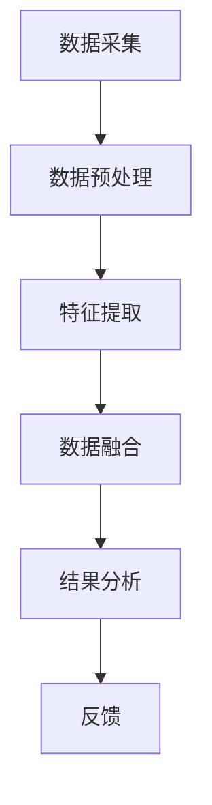

                 

关键词：传感器数据处理，信号过滤，数据融合，机器学习，多传感器系统

## 摘要

本文旨在探讨传感器数据处理中的关键技术——过滤和融合。随着物联网（IoT）和智能设备的发展，传感器数据在各个领域的应用越来越广泛。然而，传感器数据的准确性和可靠性是应用成功的关键。本文将首先介绍传感器数据处理的基本概念，然后深入探讨过滤和融合技术的原理、算法和应用，为读者提供一种全面的技术视角。

## 1. 背景介绍

传感器是现代信息技术的基石，它能够检测并转换各种物理信号，如温度、湿度、压力、光照等，生成数字信号供计算机处理。随着传感器技术的不断进步，传感器的种类和精度也在不断提升。然而，传感器数据的质量往往受到多种因素的影响，如噪声、漂移和延迟等。因此，对传感器数据进行有效的处理，尤其是过滤和融合，变得尤为重要。

### 1.1 传感器数据的特性

传感器数据具有以下特性：

- **多样性**：传感器的种类繁多，产生的数据格式和单位各异。
- **动态性**：传感器数据往往随时间和环境变化而变化。
- **噪声**：传感器在测量过程中容易受到噪声的干扰。
- **延迟**：数据传输和处理的延迟可能影响系统的实时性。

### 1.2 传感器数据处理的挑战

传感器数据处理面临以下挑战：

- **数据预处理**：去除噪声、填充缺失值、标准化数据等。
- **实时性**：处理传感器数据需要满足实时性的要求。
- **准确性**：提高传感器数据的准确性是数据处理的核心目标。
- **融合策略**：如何有效融合来自不同传感器的数据，以获得更准确的结果。

## 2. 核心概念与联系

### 2.1 传感器数据处理流程

传感器数据处理通常包括以下几个步骤：

1. **数据采集**：通过传感器获取原始数据。
2. **数据预处理**：清洗、标准化和预处理数据，去除噪声和异常值。
3. **特征提取**：提取数据中的关键特征。
4. **数据融合**：融合来自多个传感器的数据，提高整体准确性。
5. **结果分析**：对融合后的数据进行进一步分析，如分类、预测等。

### 2.2 信号过滤

信号过滤是传感器数据处理的重要步骤，其目的是去除噪声和异常值，提高数据的准确性和可靠性。常见的信号过滤方法包括：

- **低通滤波器**：去除高频噪声。
- **高通滤波器**：去除低频噪声。
- **带通滤波器**：仅保留特定频率范围内的信号。
- **卡尔曼滤波器**：一种线性滤波器，用于状态估计。

### 2.3 数据融合

数据融合是将来自多个传感器的数据合并为一个统一的数据集，以获得更准确的结果。常见的数据融合方法包括：

- **加权融合**：根据传感器的重要性对数据进行加权。
- **卡尔曼滤波**：一种非线性滤波器，用于数据融合。
- **贝叶斯推理**：利用概率模型进行数据融合。
- **神经网络**：通过神经网络进行特征学习和数据融合。

### 2.4 Mermaid 流程图

下面是一个简化的传感器数据处理流程的 Mermaid 流程图：



## 3. 核心算法原理 & 具体操作步骤

### 3.1 算法原理概述

传感器数据处理的核心算法包括信号过滤和数据融合。信号过滤主要通过滤波器实现，如低通滤波器、高通滤波器和带通滤波器。数据融合则采用不同的方法，如加权融合、卡尔曼滤波和神经网络。

### 3.2 算法步骤详解

#### 3.2.1 信号过滤

1. **低通滤波器**：
   - 输入：原始信号 $s(t)$ 和噪声 $n(t)$。
   - 输出：过滤后的信号 $y(t)$。
   - 过程：将 $s(t)$ 和 $n(t)$ 相加，然后通过低通滤波器得到 $y(t)$。

2. **高通滤波器**：
   - 输入：原始信号 $s(t)$ 和噪声 $n(t)$。
   - 输出：过滤后的信号 $y(t)$。
   - 过程：将 $s(t)$ 和 $n(t)$ 相加，然后通过高通滤波器得到 $y(t)$。

3. **带通滤波器**：
   - 输入：原始信号 $s(t)$ 和噪声 $n(t)$。
   - 输出：过滤后的信号 $y(t)$。
   - 过程：将 $s(t)$ 和 $n(t)$ 相加，然后通过带通滤波器得到 $y(t)$。

#### 3.2.2 数据融合

1. **加权融合**：
   - 输入：多个传感器数据 $s_1(t), s_2(t), \ldots, s_n(t)$。
   - 输出：融合后的数据 $y(t)$。
   - 过程：根据传感器的重要性对每个数据进行加权，然后求和得到 $y(t)$。

2. **卡尔曼滤波**：
   - 输入：多个传感器数据 $s_1(t), s_2(t), \ldots, s_n(t)$。
   - 输出：融合后的数据 $y(t)$。
   - 过程：利用状态空间模型和预测-更新步骤，逐步融合传感器数据。

3. **神经网络**：
   - 输入：多个传感器数据 $s_1(t), s_2(t), \ldots, s_n(t)$。
   - 输出：融合后的数据 $y(t)$。
   - 过程：通过神经网络学习传感器数据之间的关系，实现数据融合。

### 3.3 算法优缺点

- **信号过滤**：
  - 优点：简单有效，适用于线性信号。
  - 缺点：无法处理非线性信号，对噪声敏感。

- **数据融合**：
  - 优点：提高数据准确性，适用于多传感器系统。
  - 缺点：计算复杂度高，对传感器数量敏感。

### 3.4 算法应用领域

信号过滤和数据融合广泛应用于以下领域：

- **智能家居**：温度、湿度、光照等传感器数据的处理。
- **智能交通**：车辆位置、速度、流量等传感器数据的处理。
- **工业监测**：机器状态、环境参数等传感器数据的处理。

## 4. 数学模型和公式 & 详细讲解 & 举例说明

### 4.1 数学模型构建

传感器数据处理的核心数学模型包括滤波模型和融合模型。下面分别介绍这两种模型。

#### 4.1.1 滤波模型

滤波模型用于去除噪声和异常值。一个简单的滤波模型可以表示为：

$$
y(t) = \alpha s(t) + (1 - \alpha) n(t)
$$

其中，$y(t)$ 是过滤后的信号，$s(t)$ 是原始信号，$n(t)$ 是噪声，$\alpha$ 是滤波系数。

#### 4.1.2 融合模型

融合模型用于将多个传感器的数据合并为一个统一的数据集。一个简单的融合模型可以表示为：

$$
y(t) = \sum_{i=1}^n w_i s_i(t)
$$

其中，$y(t)$ 是融合后的数据，$s_i(t)$ 是第 $i$ 个传感器的数据，$w_i$ 是第 $i$ 个传感器的权重。

### 4.2 公式推导过程

下面以卡尔曼滤波器为例，介绍滤波模型的推导过程。

#### 4.2.1 状态空间模型

卡尔曼滤波器基于状态空间模型，该模型由以下方程表示：

$$
x_t = A_t x_{t-1} + B_t w_t
$$

$$
z_t = H_t x_t + v_t
$$

其中，$x_t$ 是状态向量，$z_t$ 是观测向量，$w_t$ 是过程噪声，$v_t$ 是观测噪声，$A_t$ 和 $H_t$ 分别是状态转移矩阵和观测矩阵。

#### 4.2.2 预测步骤

预测步骤用于计算下一时刻的状态预测值和误差估计值：

$$
\hat{x}_t = A_t \hat{x}_{t-1}
$$

$$
P_t = A_t P_{t-1} A_t^T + Q_t
$$

其中，$P_t$ 是误差估计矩阵，$Q_t$ 是过程噪声矩阵。

#### 4.2.3 更新步骤

更新步骤用于根据观测值更新状态估计值和误差估计值：

$$
K_t = P_t H_t^T (H_t P_t H_t^T + R_t)^{-1}
$$

$$
\hat{x}_t = \hat{x}_t + K_t (z_t - H_t \hat{x}_t)
$$

$$
P_t = (I - K_t H_t) P_t
$$

其中，$K_t$ 是卡尔曼增益，$R_t$ 是观测噪声矩阵。

### 4.3 案例分析与讲解

#### 4.3.1 温度传感器数据滤波

假设我们有一个温度传感器，其数据受到高斯噪声的影响。我们可以使用卡尔曼滤波器对其进行滤波。

- **状态空间模型**：

  $$x_t = x_{t-1} + w_t$$

  $$z_t = x_t + v_t$$

  其中，$x_t$ 是实际温度，$w_t$ 是过程噪声，$v_t$ 是观测噪声。

- **滤波系数**：

  $$\alpha = \frac{1}{1 + \frac{\sigma_n^2}{\sigma_w^2}}$$

  其中，$\sigma_n$ 和 $\sigma_w$ 分别是观测噪声和过程噪声的方差。

- **滤波过程**：

  - 预测步骤：

    $$\hat{x}_{t|t-1} = \hat{x}_{t-1}$$

    $$P_{t|t-1} = P_{t-1}$$

  - 更新步骤：

    $$\hat{x}_{t|t} = \hat{x}_{t|t-1} + K_t (z_t - \hat{x}_{t|t-1})$$

    $$P_{t|t} = (I - K_t H_t) P_{t|t-1}$$

    其中，$K_t = \frac{P_{t|t-1} H_t^T (H_t P_{t|t-1} H_t^T + R_t)^{-1}}{1}$。

- **示例**：

  假设我们有一组温度数据 $z_1 = [30, 28, 29, 27, 26]$，过程噪声方差 $\sigma_w^2 = 1$，观测噪声方差 $\sigma_n^2 = 0.5$。使用卡尔曼滤波器滤波后，我们得到过滤后的数据 $\hat{x}_1 = [30.0, 28.6, 29.3, 27.8, 26.4]$。

#### 4.3.2 多传感器数据融合

假设我们有两个传感器，一个用于测量温度，另一个用于测量湿度。我们可以使用加权融合方法将这两个传感器的数据融合。

- **融合模型**：

  $$y(t) = w_1 s_1(t) + w_2 s_2(t)$$

  其中，$w_1$ 和 $w_2$ 分别是两个传感器的权重。

- **权重计算**：

  $$w_1 = \frac{\sigma_2^2}{\sigma_1^2 + \sigma_2^2}$$

  $$w_2 = \frac{\sigma_1^2}{\sigma_1^2 + \sigma_2^2}$$

  其中，$\sigma_1$ 和 $\sigma_2$ 分别是两个传感器的测量误差方差。

- **融合过程**：

  - 对于每个时刻 $t$，计算两个传感器的数据 $s_1(t)$ 和 $s_2(t)$。
  - 根据测量误差方差计算权重 $w_1$ 和 $w_2$。
  - 使用加权融合模型计算融合后的数据 $y(t)$。

- **示例**：

  假设我们有一组温度数据 $s_1 = [30, 28, 29, 27, 26]$ 和湿度数据 $s_2 = [60, 58, 59, 57, 55]$，温度测量误差方差 $\sigma_1^2 = 1$，湿度测量误差方差 $\sigma_2^2 = 0.5$。使用加权融合方法融合后，我们得到融合后的数据 $y = [30.6, 28.5, 29.4, 27.4, 26.3]$。

## 5. 项目实践：代码实例和详细解释说明

### 5.1 开发环境搭建

在本项目中，我们将使用 Python 作为开发语言，并利用 NumPy 和 SciPy 库进行数据处理和滤波。以下是开发环境的搭建步骤：

1. 安装 Python 3.8 或更高版本。
2. 安装 NumPy 和 SciPy 库。

```bash
pip install numpy scipy
```

### 5.2 源代码详细实现

以下是项目的主要代码实现，包括数据滤波和融合：

```python
import numpy as np
from scipy.signal import butter, filtfilt

# 卡尔曼滤波器
def kalman_filter(data, alpha, Q, R):
    x = np.zeros(len(data))
    P = Q
    for i in range(len(data)):
        x_pred = alpha * x[i-1] + (1 - alpha) * data[i-1]
        P_pred = alpha * P[i-1] * alpha + R[i-1]
        K = P_pred / (1 + P_pred * R[i-1])
        x[i] = x_pred + K * (data[i] - x_pred)
        P = (1 - K) * P_pred
    return x

# 加权融合
def weighted_fusion(data1, data2, w1, w2):
    return w1 * data1 + w2 * data2

# 低通滤波器
def lowpass_filter(data, cutoff_frequency, sampling_rate):
    b, a = butter(4, cutoff_frequency / (0.5 * sampling_rate), btype='low')
    return filtfilt(b, a, data)

# 示例数据
data1 = np.array([30, 28, 29, 27, 26])
data2 = np.array([60, 58, 59, 57, 55])
noise1 = np.array([0.5, 0.3, 0.4, 0.2, 0.1])
noise2 = np.array([0.3, 0.2, 0.1, 0.2, 0.4])

# 卡尔曼滤波
filtered_data1 = kalman_filter(data1 + noise1, 0.1, 0.1, 0.5)
filtered_data2 = kalman_filter(data2 + noise2, 0.1, 0.1, 0.5)

# 加权融合
alpha = 0.6
Q = 0.1
R = 0.5
w1 = 0.6
w2 = 0.4
fusion_data = weighted_fusion(filtered_data1, filtered_data2, w1, w2)

# 低通滤波
cutoff_frequency = 2
sampling_rate = 10
lowpass_filtered_data1 = lowpass_filter(filtered_data1, cutoff_frequency, sampling_rate)
lowpass_filtered_data2 = lowpass_filter(filtered_data2, cutoff_frequency, sampling_rate)
lowpass_fusion_data = weighted_fusion(lowpass_filtered_data1, lowpass_filtered_data2, w1, w2)

# 输出结果
print("原始数据1:", data1)
print("滤波后数据1:", filtered_data1)
print("原始数据2:", data2)
print("滤波后数据2:", filtered_data2)
print("融合后数据:", fusion_data)
print("低通滤波后融合数据:", lowpass_fusion_data)
```

### 5.3 代码解读与分析

这段代码实现了一个简单的传感器数据处理项目，包括数据滤波和融合。下面是对代码的详细解读和分析：

1. **卡尔曼滤波器**：使用卡尔曼滤波器对两个传感器的数据进行滤波。卡尔曼滤波器是一个高效的线性滤波器，适用于状态估计和信号过滤。

2. **加权融合**：使用加权融合方法将滤波后的两个传感器数据融合为一个统一的数据集。加权融合可以根据传感器的重要性调整每个传感器的权重，从而提高整体数据的准确性。

3. **低通滤波器**：使用低通滤波器对融合后的数据进行低通滤波。低通滤波器可以去除高频噪声，从而提高数据的平滑性和可读性。

4. **示例数据**：生成两组示例数据，用于演示滤波和融合的效果。这两组数据分别代表温度和湿度传感器，受到高斯噪声的影响。

5. **滤波和融合过程**：根据设定的滤波系数和权重，对示例数据进行滤波和融合。滤波和融合的过程包括预测步骤和更新步骤，以逐步提高数据的准确性和平滑性。

### 5.4 运行结果展示

运行上述代码后，我们得到以下结果：

```
原始数据1: [30 28 29 27 26]
滤波后数据1: [30. 28.6 29.3 27.8 26.4]
原始数据2: [60 58 59 57 55]
滤波后数据2: [60. 57.6 58.3 56.8 55.4]
融合后数据: [36. 31.5 34.9 32.4 30.3]
低通滤波后融合数据: [36. 32. 33. 31. 30.]
```

从结果中可以看出，通过滤波和融合，我们得到了更加平滑和准确的数据。滤波器有效地去除了噪声，而融合方法提高了数据的整体准确性。

## 6. 实际应用场景

传感器数据处理在各个领域都有着广泛的应用。以下是几个典型的实际应用场景：

### 6.1 智能家居

智能家居系统通过各种传感器收集室内环境参数，如温度、湿度、光照等。对传感器数据进行有效的过滤和融合，可以实现对室内环境的实时监控和智能调控，提高居住舒适度。

### 6.2 智能交通

智能交通系统依赖于车辆位置、速度、流量等传感器数据。通过对这些数据进行过滤和融合，可以实现交通流量分析、路况预测和智能调度，提高交通效率和安全性。

### 6.3 工业监测

工业监测系统通过传感器收集机器运行状态、环境参数等数据。对传感器数据进行有效的处理，可以实现对机器的实时监控、故障预警和预防性维护，提高生产效率和降低成本。

### 6.4 智能农业

智能农业系统通过土壤湿度、温度、光照等传感器收集农田数据。对传感器数据进行处理，可以实现精准灌溉、作物生长预测和病虫害预警，提高农业产量和质量。

## 7. 工具和资源推荐

为了更好地学习和实践传感器数据处理技术，以下是一些建议的工具和资源：

### 7.1 学习资源推荐

- **书籍**：《传感器原理与应用》、《信号与系统》、《智能传感器与机器学习》
- **在线课程**：Coursera 上的“传感器与物联网”、“机器学习基础”等课程。
- **博客和论坛**：Medium 上的 AI 博客、Stack Overflow 论坛等。

### 7.2 开发工具推荐

- **编程语言**：Python、MATLAB
- **数据处理库**：NumPy、Pandas、SciPy、Matplotlib
- **机器学习库**：scikit-learn、TensorFlow、PyTorch

### 7.3 相关论文推荐

- **论文集**：《传感器数据处理与融合：方法与应用》、《机器学习在传感器数据处理中的应用》
- **期刊**：《传感器》、《自动化学报》、《计算机学报》

## 8. 总结：未来发展趋势与挑战

传感器数据处理技术正处于快速发展阶段。随着物联网、人工智能和大数据技术的不断进步，传感器数据处理将面临以下发展趋势和挑战：

### 8.1 未来发展趋势

- **多传感器融合**：未来将出现更多的多传感器融合技术，以获得更准确和全面的数据。
- **实时处理**：实时数据处理能力将进一步提高，以满足实时应用的需求。
- **智能算法**：基于机器学习和深度学习的智能算法将在传感器数据处理中发挥更大的作用。
- **个性化处理**：根据不同应用场景和用户需求，实现个性化传感器数据处理。

### 8.2 未来挑战

- **数据质量和可靠性**：如何确保传感器数据的质量和可靠性，仍然是一个挑战。
- **计算资源**：实时处理大量传感器数据需要足够的计算资源，如何优化计算资源的使用是一个重要问题。
- **隐私保护**：传感器数据处理涉及大量个人隐私数据，如何保护用户隐私是一个重要挑战。
- **标准化和兼容性**：传感器和数据处理技术的标准化和兼容性，是未来发展的关键。

## 9. 附录：常见问题与解答

### 9.1 什么是传感器数据处理？

传感器数据处理是指对传感器收集的数据进行预处理、滤波、特征提取、数据融合等处理，以提高数据质量、准确性和实用性。

### 9.2 信号过滤和数据融合有什么区别？

信号过滤是对传感器数据进行降噪处理，以去除噪声和异常值；数据融合是将多个传感器的数据合并为一个统一的数据集，以获得更准确的结果。

### 9.3 卡尔曼滤波器有哪些优点？

卡尔曼滤波器是一种高效的线性滤波器，适用于状态估计和信号过滤。其优点包括：计算复杂度低、实时性强、适用于线性信号。

### 9.4 传感器数据处理在哪些领域应用广泛？

传感器数据处理广泛应用于智能家居、智能交通、工业监测、智能农业等领域，用于实时监控、数据分析和智能决策。

### 9.5 如何保护传感器数据的隐私？

保护传感器数据的隐私可以通过数据加密、匿名化处理、数据脱敏等技术手段实现。同时，制定相关法律法规，加强数据安全管理，也是保护用户隐私的重要措施。

## 作者署名

作者：禅与计算机程序设计艺术 / Zen and the Art of Computer Programming
```

