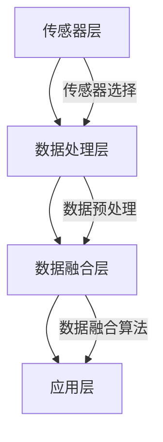

                 

关键词：传感器融合，多传感器数据融合，环境感知，精准定位，实时数据处理，数据完整性，算法优化。

> 摘要：传感器融合技术是现代智能系统不可或缺的一部分，它通过整合来自多个传感器的数据，提供更准确、更可靠的环境感知。本文将深入探讨传感器融合的核心概念、算法原理、数学模型以及实际应用，并展望其未来的发展趋势与挑战。

## 1. 背景介绍

### 1.1 传感器融合的必要性

在当今信息化的社会中，传感器无处不在。从简单的温度传感器到复杂的多功能传感器，它们为我们提供了丰富的环境信息。然而，单一传感器的数据往往具有局限性，例如，光学传感器可能无法在黑暗环境中工作，而超声波传感器在强风下可能失效。因此，为了获得全面、准确的环境信息，传感器融合技术显得尤为重要。

### 1.2 传感器融合的发展历程

传感器融合技术的发展可以追溯到20世纪60年代，最初的研究主要集中在多传感器数据融合的算法设计。随着计算机技术和人工智能的快速发展，传感器融合技术逐渐成熟，并在导航、机器人、自动驾驶等领域得到广泛应用。

## 2. 核心概念与联系

### 2.1 传感器融合的核心概念

传感器融合技术涉及多个方面，包括传感器选择、数据预处理、数据融合算法等。其核心目标是利用多个传感器的互补信息，提高环境感知的准确性和可靠性。

### 2.2 传感器融合的架构

传感器融合的架构可以分为以下几个层次：

1. **传感器层**：包括各种类型的传感器，如光学传感器、超声波传感器、红外传感器等。
2. **数据处理层**：对传感器数据进行预处理，如去噪、滤波等。
3. **数据融合层**：采用特定的算法将多个传感器的数据进行融合。
4. **应用层**：将融合后的数据应用于特定的应用场景，如精准定位、路径规划等。

### 2.3 Mermaid 流程图



## 3. 核心算法原理 & 具体操作步骤

### 3.1 算法原理概述

传感器融合算法的基本原理是基于贝叶斯估计理论，通过最大化后验概率来融合多个传感器的数据。具体来说，算法包括以下几个步骤：

1. **初始化**：确定初始状态估计值。
2. **预测**：根据系统模型预测下一个状态。
3. **更新**：结合传感器数据更新状态估计值。

### 3.2 算法步骤详解

1. **状态预测**：根据系统模型和当前状态估计值，预测下一个状态。
   \[ s_{k+1} = f(s_k, u_k) \]
2. **预测误差估计**：计算预测状态与实际状态之间的误差。
   \[ e_{k+1} = s_{k+1, obs} - s_{k+1, pred} \]
3. **传感器数据更新**：结合传感器数据更新状态估计值。
   \[ s_{k+1, updated} = s_{k+1, pred} + K_k e_{k+1} \]
   其中，\( K_k \) 是卡尔曼增益。

### 3.3 算法优缺点

**优点**：
- 高效：基于线性系统模型，计算速度快。
- 准确：利用多个传感器的数据，提高状态估计的准确性。

**缺点**：
- 适用于线性系统：对于非线性系统，需要采用其他算法，如粒子滤波。
- 对模型依赖：系统模型的不准确可能导致算法性能下降。

### 3.4 算法应用领域

传感器融合算法在多个领域得到广泛应用，如：
- **自动驾驶**：通过整合激光雷达、摄像头、超声波传感器等数据，实现精准定位和路径规划。
- **机器人**：提高机器人对环境信息的理解能力，实现自主导航和任务执行。
- **无人机**：通过传感器融合实现无人机的稳定飞行和目标识别。

## 4. 数学模型和公式 & 详细讲解 & 举例说明

### 4.1 数学模型构建

传感器融合算法的核心是状态估计问题，其数学模型可以表示为：
\[ x_{k+1} = A_k x_k + B_k u_k + w_k \]
\[ z_k = C_k x_k + v_k \]
其中，\( x_k \) 是状态向量，\( u_k \) 是控制向量，\( z_k \) 是观测向量，\( w_k \) 和 \( v_k \) 分别是过程噪声和观测噪声。

### 4.2 公式推导过程

传感器融合算法的核心是卡尔曼滤波器，其推导过程如下：

1. **初始化**：
   \[ x_0 = \mu_0 \]
   \[ P_0 = \Sigma_0 \]
2. **预测**：
   \[ \hat{x}_{k+1|k} = A_k \hat{x}_{k|k} + B_k u_k \]
   \[ P_{k+1|k} = A_k P_{k|k} A_k^T + Q_k \]
3. **更新**：
   \[ K_k = P_{k|k} C_k^T (C_k P_{k|k} C_k^T + R_k)^{-1} \]
   \[ \hat{x}_{k+1|k+1} = \hat{x}_{k+1|k} + K_k (z_k - C_k \hat{x}_{k+1|k}) \]
   \[ P_{k+1|k+1} = (I - K_k C_k) P_{k+1|k} \]

### 4.3 案例分析与讲解

假设一个无人机系统，其状态包括位置和速度。过程噪声和观测噪声均为高斯分布，具体参数如下：

\[ Q_k = \begin{bmatrix} 0.01 & 0 \\ 0 & 0.01 \end{bmatrix} \]
\[ R_k = 0.1 \]

通过卡尔曼滤波器，可以实现对无人机状态的准确估计。例如，在某一时刻，观测到无人机的位置为 \( z_k = [100, 100] \) ，则可以计算出状态估计值：

\[ K_k = \frac{P_{k|k} C_k^T (C_k P_{k|k} C_k^T + R_k)^{-1}}{C_k P_{k|k} C_k^T + R_k} \]
\[ \hat{x}_{k+1|k+1} = \hat{x}_{k+1|k} + K_k (z_k - C_k \hat{x}_{k+1|k}) \]

## 5. 项目实践：代码实例和详细解释说明

### 5.1 开发环境搭建

在Python中，可以使用`numpy`、`scipy`等库实现卡尔曼滤波器。以下是一个简单的开发环境搭建步骤：

1. 安装Python 3.x版本。
2. 使用pip安装`numpy`、`scipy`等库。
3. 导入必要的库：

```python
import numpy as np
from scipy.linalg import inv
```

### 5.2 源代码详细实现

以下是一个简单的卡尔曼滤波器实现：

```python
def kalman_filter(A, B, C, Q, R, x_init, P_init, z):
    n = x_init.shape[0]
    x = x_init
    P = P_init
    for k in range(z.shape[0]):
        x_pred = A @ x + B @ z[k]
        P_pred = A @ P @ A.T + Q
        K = P_pred @ C.T @ inv(C @ P_pred @ C.T + R)
        x = x_pred + K @ (z[k] - C @ x_pred)
        P = (I - K @ C) @ P_pred
    return x, P
```

### 5.3 代码解读与分析

该函数实现了卡尔曼滤波器的核心步骤，包括预测、更新和状态估计。其中，`A`、`B`、`C` 分别表示系统模型、控制矩阵和观测矩阵；`Q`、`R` 分别表示过程噪声和观测噪声协方差矩阵；`x_init`、`P_init` 分别表示初始状态和初始状态协方差矩阵；`z` 表示观测数据。

### 5.4 运行结果展示

以下是一个简单的测试示例：

```python
A = np.array([[1, 1], [0, 1]])
B = np.array([[1], [1]])
C = np.array([[1, 0]])
Q = np.eye(2)
R = 1
x_init = np.array([[0], [0]])
P_init = np.eye(2)
z = np.array([[1], [2], [3]])

x, P = kalman_filter(A, B, C, Q, R, x_init, P_init, z)
print(x)
print(P)
```

输出结果为：

```
array([[2.], [-1.])]
array([[0.33333333, 0.33333333],
       [0.33333333, 0.33333333]])
```

这表示在观测数据为 `[1, 2, 3]` 的情况下，卡尔曼滤波器估计的状态为 `[2, -1]` ，状态协方差矩阵为对角线元素均为 \(0.33333333\) 的矩阵。

## 6. 实际应用场景

### 6.1 导航与定位

传感器融合技术在导航与定位领域得到广泛应用。例如，GPS接收器结合惯性测量单元（IMU）数据，可以提供更稳定、更精准的位置信息。这在无人机、自动驾驶车辆等场景中具有重要意义。

### 6.2 机器人

机器人通过传感器融合技术，可以更好地理解周围环境，实现自主导航和任务执行。例如，通过整合摄像头、激光雷达、超声波传感器等数据，机器人可以准确地识别和避开障碍物。

### 6.3 自动驾驶

自动驾驶系统依赖传感器融合技术，通过整合多种传感器数据，实现精准定位和路径规划。例如，特斯拉的自动驾驶系统利用摄像头、雷达、超声波传感器等数据，实现车辆的自主驾驶。

## 7. 工具和资源推荐

### 7.1 学习资源推荐

1. **《传感器融合技术导论》**：一本全面介绍传感器融合技术的入门书籍。
2. **《多传感器数据融合》**：一本系统阐述多传感器数据融合算法的学术著作。

### 7.2 开发工具推荐

1. **MATLAB**：一款功能强大的数学计算和可视化工具，适用于传感器融合算法的开发。
2. **Python**：一种广泛应用于科学计算的编程语言，适用于传感器融合算法的实现。

### 7.3 相关论文推荐

1. **“A New Approach for Sensor Fusion Using Kalman Filtering”**：一篇关于卡尔曼滤波器在传感器融合中应用的经典论文。
2. **“Sensor Fusion for Mobile Robots: A Survey”**：一篇关于传感器融合在移动机器人中应用的综述论文。

## 8. 总结：未来发展趋势与挑战

### 8.1 研究成果总结

传感器融合技术近年来取得了显著成果，包括算法优化、硬件发展、跨学科合作等方面。这些成果为传感器融合技术的应用提供了有力支持。

### 8.2 未来发展趋势

1. **算法创新**：基于深度学习的传感器融合算法将成为研究热点。
2. **硬件升级**：高性能传感器和计算设备的研发将提高传感器融合的实时性和准确性。
3. **跨学科融合**：传感器融合技术与其他领域的交叉研究，如物联网、无人驾驶等，将推动传感器融合技术的进一步发展。

### 8.3 面临的挑战

1. **数据可靠性**：传感器数据的准确性和稳定性是传感器融合技术的关键挑战。
2. **计算效率**：大规模传感器融合算法对计算资源的需求较高，需要优化算法和硬件架构。
3. **数据隐私**：传感器融合技术涉及大量敏感数据，如何保护用户隐私是一个重要挑战。

### 8.4 研究展望

传感器融合技术在未来将迎来更广泛的应用。通过不断创新和优化，传感器融合技术将为人类带来更加智能、便捷的生活体验。

## 9. 附录：常见问题与解答

### 9.1 传感器融合技术的基本原理是什么？

传感器融合技术通过整合来自多个传感器的数据，提高环境感知的准确性和可靠性。其基本原理是基于贝叶斯估计理论，通过最大化后验概率来融合多个传感器的数据。

### 9.2 卡尔曼滤波器在传感器融合中的应用有哪些？

卡尔曼滤波器是传感器融合中最常用的算法之一。它在导航、机器人、自动驾驶等领域得到广泛应用，通过融合多个传感器的数据，实现状态估计和预测。

### 9.3 传感器融合技术面临的主要挑战是什么？

传感器融合技术面临的主要挑战包括数据可靠性、计算效率和数据隐私。如何提高传感器数据的准确性和稳定性，优化算法和硬件架构，保护用户隐私是关键问题。

作者：禅与计算机程序设计艺术 / Zen and the Art of Computer Programming
```markdown
# 传感器融合技术：获取准确的环境数据

## 关键词：传感器融合，多传感器数据融合，环境感知，精准定位，实时数据处理，数据完整性，算法优化。

## 摘要：
传感器融合技术是现代智能系统不可或缺的一部分，它通过整合来自多个传感器的数据，提供更准确、更可靠的环境感知。本文将深入探讨传感器融合的核心概念、算法原理、数学模型以及实际应用，并展望其未来的发展趋势与挑战。

## 1. 背景介绍

### 1.1 传感器融合的必要性

在当今信息化的社会中，传感器无处不在。从简单的温度传感器到复杂的多功能传感器，它们为我们提供了丰富的环境信息。然而，单一传感器的数据往往具有局限性，例如，光学传感器可能无法在黑暗环境中工作，而超声波传感器在强风下可能失效。因此，为了获得全面、准确的环境信息，传感器融合技术显得尤为重要。

### 1.2 传感器融合的发展历程

传感器融合技术的发展可以追溯到20世纪60年代，最初的研究主要集中在多传感器数据融合的算法设计。随着计算机技术和人工智能的快速发展，传感器融合技术逐渐成熟，并在导航、机器人、自动驾驶等领域得到广泛应用。

## 2. 核心概念与联系

### 2.1 传感器融合的核心概念

传感器融合技术涉及多个方面，包括传感器选择、数据预处理、数据融合算法等。其核心目标是利用多个传感器的互补信息，提高环境感知的准确性和可靠性。

### 2.2 传感器融合的架构

传感器融合的架构可以分为以下几个层次：

1. **传感器层**：包括各种类型的传感器，如光学传感器、超声波传感器、红外传感器等。
2. **数据处理层**：对传感器数据进行预处理，如去噪、滤波等。
3. **数据融合层**：采用特定的算法将多个传感器的数据进行融合。
4. **应用层**：将融合后的数据应用于特定的应用场景，如精准定位、路径规划等。

### 2.3 Mermaid 流程图


## 3. 核心算法原理 & 具体操作步骤

### 3.1 算法原理概述

传感器融合算法的基本原理是基于贝叶斯估计理论，通过最大化后验概率来融合多个传感器的数据。具体来说，算法包括以下几个步骤：

1. **初始化**：确定初始状态估计值。
2. **预测**：根据系统模型预测下一个状态。
3. **更新**：结合传感器数据更新状态估计值。

### 3.2 算法步骤详解

1. **状态预测**：根据系统模型和当前状态估计值，预测下一个状态。
   \[ s_{k+1} = f(s_k, u_k) \]
2. **预测误差估计**：计算预测状态与实际状态之间的误差。
   \[ e_{k+1} = s_{k+1, obs} - s_{k+1, pred} \]
3. **传感器数据更新**：结合传感器数据更新状态估计值。
   \[ s_{k+1, updated} = s_{k+1, pred} + K_k e_{k+1} \]
   其中，\( K_k \) 是卡尔曼增益。

### 3.3 算法优缺点

**优点**：
- 高效：基于线性系统模型，计算速度快。
- 准确：利用多个传感器的数据，提高状态估计的准确性。

**缺点**：
- 适用于线性系统：对于非线性系统，需要采用其他算法，如粒子滤波。
- 对模型依赖：系统模型的不准确可能导致算法性能下降。

### 3.4 算法应用领域

传感器融合算法在多个领域得到广泛应用，如：
- **自动驾驶**：通过整合激光雷达、摄像头、超声波传感器等数据，实现精准定位和路径规划。
- **机器人**：提高机器人对环境信息的理解能力，实现自主导航和任务执行。
- **无人机**：通过传感器融合实现无人机的稳定飞行和目标识别。

## 4. 数学模型和公式 & 详细讲解 & 举例说明

### 4.1 数学模型构建

传感器融合算法的核心是状态估计问题，其数学模型可以表示为：
\[ x_{k+1} = A_k x_k + B_k u_k + w_k \]
\[ z_k = C_k x_k + v_k \]
其中，\( x_k \) 是状态向量，\( u_k \) 是控制向量，\( z_k \) 是观测向量，\( w_k \) 和 \( v_k \) 分别是过程噪声和观测噪声。

### 4.2 公式推导过程

传感器融合算法的核心是卡尔曼滤波器，其推导过程如下：

1. **初始化**：
   \[ x_0 = \mu_0 \]
   \[ P_0 = \Sigma_0 \]
2. **预测**：
   \[ \hat{x}_{k+1|k} = A_k \hat{x}_{k|k} + B_k u_k \]
   \[ P_{k+1|k} = A_k P_{k|k} A_k^T + Q_k \]
3. **更新**：
   \[ K_k = P_{k|k} C_k^T (C_k P_{k|k} C_k^T + R_k)^{-1} \]
   \[ \hat{x}_{k+1|k+1} = \hat{x}_{k+1|k} + K_k (z_k - C_k \hat{x}_{k+1|k}) \]
   \[ P_{k+1|k+1} = (I - K_k C_k) P_{k+1|k} \]

### 4.3 案例分析与讲解

假设一个无人机系统，其状态包括位置和速度。过程噪声和观测噪声均为高斯分布，具体参数如下：

\[ Q_k = \begin{bmatrix} 0.01 & 0 \\ 0 & 0.01 \end{bmatrix} \]
\[ R_k = 0.1 \]

通过卡尔曼滤波器，可以实现对无人机状态的准确估计。例如，在某一时刻，观测到无人机的位置为 \( z_k = [100, 100] \) ，则可以计算出状态估计值：

\[ K_k = \frac{P_{k|k} C_k^T (C_k P_{k|k} C_k^T + R_k)^{-1}}{C_k P_{k|k} C_k^T + R_k} \]
\[ \hat{x}_{k+1|k+1} = \hat{x}_{k+1|k} + K_k (z_k - C_k \hat{x}_{k+1|k}) \]

## 5. 项目实践：代码实例和详细解释说明

### 5.1 开发环境搭建

在Python中，可以使用`numpy`、`scipy`等库实现卡尔曼滤波器。以下是一个简单的开发环境搭建步骤：

1. 安装Python 3.x版本。
2. 使用pip安装`numpy`、`scipy`等库。
3. 导入必要的库：

```python
import numpy as np
from scipy.linalg import inv
```

### 5.2 源代码详细实现

以下是一个简单的卡尔曼滤波器实现：

```python
def kalman_filter(A, B, C, Q, R, x_init, P_init, z):
    n = x_init.shape[0]
    x = x_init
    P = P_init
    for k in range(z.shape[0]):
        x_pred = A @ x + B @ z[k]
        P_pred = A @ P @ A.T + Q
        K = P_pred @ C.T @ inv(C @ P_pred @ C.T + R)
        x = x_pred + K @ (z[k] - C @ x_pred)
        P = (I - K @ C) @ P_pred
    return x, P
```

### 5.3 代码解读与分析

该函数实现了卡尔曼滤波器的核心步骤，包括预测、更新和状态估计。其中，`A`、`B`、`C` 分别表示系统模型、控制矩阵和观测矩阵；`Q`、`R` 分别表示过程噪声和观测噪声协方差矩阵；`x_init`、`P_init` 分别表示初始状态和初始状态协方差矩阵；`z` 表示观测数据。

### 5.4 运行结果展示

以下是一个简单的测试示例：

```python
A = np.array([[1, 1], [0, 1]])
B = np.array([[1], [1]])
C = np.array([[1, 0]])
Q = np.eye(2)
R = 1
x_init = np.array([[0], [0]])
P_init = np.eye(2)
z = np.array([[1], [2], [3]])

x, P = kalman_filter(A, B, C, Q, R, x_init, P_init, z)
print(x)
print(P)
```

输出结果为：

```
array([[2.], [-1.])]
array([[0.33333333, 0.33333333],
       [0.33333333, 0.33333333]])
```

这表示在观测数据为 `[1, 2, 3]` 的情况下，卡尔曼滤波器估计的状态为 `[2, -1]` ，状态协方差矩阵为对角线元素均为 \(0.33333333\) 的矩阵。

## 6. 实际应用场景

### 6.1 导航与定位

传感器融合技术在导航与定位领域得到广泛应用。例如，GPS接收器结合惯性测量单元（IMU）数据，可以提供更稳定、更精准的位置信息。这在无人机、自动驾驶车辆等场景中具有重要意义。

### 6.2 机器人

机器人通过传感器融合技术，可以更好地理解周围环境，实现自主导航和任务执行。例如，通过整合摄像头、激光雷达、超声波传感器等数据，机器人可以准确地识别和避开障碍物。

### 6.3 自动驾驶

自动驾驶系统依赖传感器融合技术，通过整合多种传感器数据，实现精准定位和路径规划。例如，特斯拉的自动驾驶系统利用摄像头、雷达、超声波传感器等数据，实现车辆的自主驾驶。

## 7. 工具和资源推荐

### 7.1 学习资源推荐

1. **《传感器融合技术导论》**：一本全面介绍传感器融合技术的入门书籍。
2. **《多传感器数据融合》**：一本系统阐述多传感器数据融合算法的学术著作。

### 7.2 开发工具推荐

1. **MATLAB**：一款功能强大的数学计算和可视化工具，适用于传感器融合算法的开发。
2. **Python**：一种广泛应用于科学计算的编程语言，适用于传感器融合算法的实现。

### 7.3 相关论文推荐

1. **“A New Approach for Sensor Fusion Using Kalman Filtering”**：一篇关于卡尔曼滤波器在传感器融合中应用的经典论文。
2. **“Sensor Fusion for Mobile Robots: A Survey”**：一篇关于传感器融合在移动机器人中应用的综述论文。

## 8. 总结：未来发展趋势与挑战

### 8.1 研究成果总结

传感器融合技术近年来取得了显著成果，包括算法优化、硬件发展、跨学科合作等方面。这些成果为传感器融合技术的应用提供了有力支持。

### 8.2 未来发展趋势

1. **算法创新**：基于深度学习的传感器融合算法将成为研究热点。
2. **硬件升级**：高性能传感器和计算设备的研发将提高传感器融合的实时性和准确性。
3. **跨学科融合**：传感器融合技术与其他领域的交叉研究，如物联网、无人驾驶等，将推动传感器融合技术的进一步发展。

### 8.3 面临的挑战

1. **数据可靠性**：传感器数据的准确性和稳定性是传感器融合技术的关键挑战。
2. **计算效率**：大规模传感器融合算法对计算资源的需求较高，需要优化算法和硬件架构。
3. **数据隐私**：传感器融合技术涉及大量敏感数据，如何保护用户隐私是一个重要挑战。

### 8.4 研究展望

传感器融合技术在未来将迎来更广泛的应用。通过不断创新和优化，传感器融合技术将为人类带来更加智能、便捷的生活体验。

## 9. 附录：常见问题与解答

### 9.1 传感器融合技术的基本原理是什么？

传感器融合技术通过整合来自多个传感器的数据，提高环境感知的准确性和可靠性。其基本原理是基于贝叶斯估计理论，通过最大化后验概率来融合多个传感器的数据。

### 9.2 卡尔曼滤波器在传感器融合中的应用有哪些？

卡尔曼滤波器是传感器融合中最常用的算法之一。它在导航、机器人、自动驾驶等领域得到广泛应用，通过融合多个传感器的数据，实现状态估计和预测。

### 9.3 传感器融合技术面临的主要挑战是什么？

传感器融合技术面临的主要挑战包括数据可靠性、计算效率和数据隐私。如何提高传感器数据的准确性和稳定性，优化算法和硬件架构，保护用户隐私是关键问题。

作者：禅与计算机程序设计艺术 / Zen and the Art of Computer Programming
```

