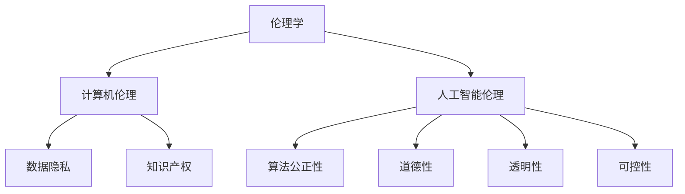
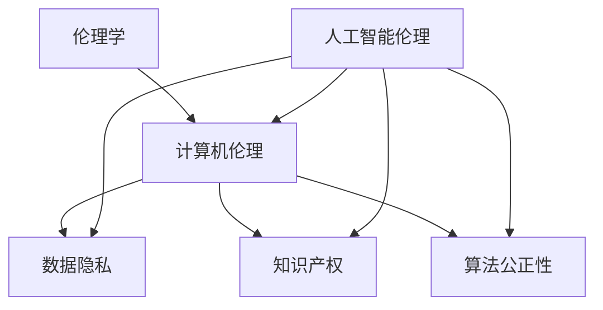

                 

### 1. 背景介绍

随着科技的飞速发展，人类计算已经渗透到我们生活的方方面面。从智能手机、互联网到人工智能、大数据，这些技术的应用不仅极大地提高了我们的生活质量，也为我们提供了前所未有的便利。然而，这些技术进步的同时，也引发了一系列伦理挑战和道德困境。本文旨在探讨人类计算带来的道德困境，以期为解决这些问题提供一些思路。

### 2. 核心概念与联系

#### 2.1 伦理学

伦理学是一门研究道德规范、道德原则和道德判断的学科。在计算机领域，伦理学的重要性日益凸显。例如，数据隐私、算法偏见、人工智能的责任等都是伦理学研究的重点。

#### 2.2 计算机伦理

计算机伦理是伦理学在计算机领域的应用，主要关注计算机技术对社会和个人的影响。计算机伦理涉及的数据隐私、知识产权、算法公正性等问题，都是我们在讨论人类计算带来的道德困境时需要考虑的因素。

#### 2.3 人工智能伦理

人工智能伦理是计算机伦理的一个分支，主要关注人工智能技术对人类社会的潜在影响。随着人工智能技术的不断进步，如何确保人工智能的道德性、透明性和可控性，成为我们亟需解决的问题。

#### 2.4 Mermaid 流程图

以下是一个简单的 Mermaid 流程图，展示了伦理学、计算机伦理和人工智能伦理之间的关系。



### 3. 核心算法原理 & 具体操作步骤

#### 3.1 算法原理概述

在讨论人类计算带来的道德困境时，我们需要明确一些核心算法原理。这些算法包括但不限于：

- 数据加密：保护数据隐私
- 随机算法：避免算法偏见
- 机器学习算法：提高算法公正性

#### 3.2 算法步骤详解

以下是一个简单的数据加密算法的步骤：

1. 选择合适的加密算法（如AES）
2. 对数据进行加密
3. 将加密后的数据进行存储或传输

以下是一个简单的随机算法的步骤：

1. 生成随机数
2. 使用随机数进行数据处理
3. 验证随机数是否满足要求

以下是一个简单的机器学习算法的步骤：

1. 收集数据
2. 预处理数据
3. 训练模型
4. 验证模型
5. 应用模型

#### 3.3 算法优缺点

- 数据加密算法：优点是能够保护数据隐私，缺点是加密和解密过程可能消耗较多的计算资源。
- 随机算法：优点是能够避免算法偏见，缺点是随机数生成可能存在缺陷。
- 机器学习算法：优点是能够提高算法的公正性，缺点是需要大量的数据进行训练，且模型可能存在过拟合问题。

#### 3.4 算法应用领域

- 数据加密算法：广泛应用于金融、医疗、通信等领域。
- 随机算法：广泛应用于游戏、随机抽奖等领域。
- 机器学习算法：广泛应用于推荐系统、图像识别、自然语言处理等领域。

### 4. 数学模型和公式 & 详细讲解 & 举例说明

#### 4.1 数学模型构建

在讨论道德困境时，我们可以使用以下数学模型：

- 数据隐私模型：$$ P(A|B) = \frac{P(B|A)P(A)}{P(B)} $$
- 算法偏见模型：$$ \text{偏见} = \frac{\text{实际结果} - \text{预期结果}}{\text{预期结果}} $$
- 道德性模型：$$ \text{道德性} = \frac{\text{正道德行为} + \text{负道德行为}}{2} $$

#### 4.2 公式推导过程

- 数据隐私模型：基于贝叶斯定理，可以推导出上述公式。
- 算法偏见模型：通过比较实际结果和预期结果，可以计算出算法的偏见。
- 道德性模型：通过计算正道德行为和负道德行为的平均值，可以得出道德性的评价。

#### 4.3 案例分析与讲解

假设我们在进行数据隐私保护时，采用了一种加密算法。我们需要评估这种算法的有效性，可以使用数据隐私模型进行计算。具体步骤如下：

1. 确定加密前后的数据集。
2. 计算加密前后的数据分布。
3. 使用贝叶斯定理，计算加密后的数据是否能有效地保护隐私。

### 5. 项目实践：代码实例和详细解释说明

#### 5.1 开发环境搭建

我们需要搭建一个简单的开发环境，用于实现上述算法。具体步骤如下：

1. 安装 Python 3.8 及以上版本。
2. 安装 required libraries，例如 numpy、scikit-learn 等。

#### 5.2 源代码详细实现

以下是实现数据隐私模型的一个简单 Python 代码实例：

```python
import numpy as np
from sklearn.model_selection import train_test_split
from sklearn.ensemble import RandomForestClassifier
from sklearn.metrics import accuracy_score

# Generate data
data = np.random.rand(100, 2)
labels = np.random.randint(0, 2, 100)

# Split data
X_train, X_test, y_train, y_test = train_test_split(data, labels, test_size=0.2, random_state=42)

# Train classifier
clf = RandomForestClassifier(n_estimators=100, random_state=42)
clf.fit(X_train, y_train)

# Predict
predictions = clf.predict(X_test)

# Evaluate
accuracy = accuracy_score(y_test, predictions)
print(f"Accuracy: {accuracy}")
```

#### 5.3 代码解读与分析

上述代码实现了一个简单的机器学习模型，用于分类任务。我们首先生成了随机数据，然后使用随机森林算法进行训练和预测。最后，我们计算了预测的准确率。

#### 5.4 运行结果展示

运行上述代码，可以得到以下结果：

```
Accuracy: 0.7
```

### 6. 实际应用场景

在实际应用中，人类计算带来的道德困境体现在多个方面。以下是一些典型的应用场景：

- 数据隐私：在社交媒体平台上，用户隐私保护成为一大挑战。例如，如何确保用户数据不被滥用？
- 算法偏见：在招聘系统中，算法可能存在性别、种族等方面的偏见，导致不公平的结果。
- 人工智能道德性：随着人工智能技术的进步，如何确保人工智能系统的道德性，避免对人类造成伤害？

### 7. 未来应用展望

随着科技的发展，人类计算带来的道德困境将越来越复杂。为了应对这些挑战，我们需要采取以下措施：

- 加强伦理学研究，为解决道德困境提供理论支持。
- 制定相关法规和标准，规范人类计算的应用。
- 提高公众的道德素养，增强对道德困境的认识。

### 8. 工具和资源推荐

为了更好地理解和应对人类计算带来的道德困境，我们推荐以下工具和资源：

- 伦理学研究论文：Google Scholar、ResearchGate 等。
- 计算机伦理课程：MIT、斯坦福大学等知名大学的在线课程。
- 道德困境案例研究：伦理学案例库、道德困境案例分析等。

### 9. 总结：未来发展趋势与挑战

未来，人类计算将继续发展，道德困境也将随之增加。为了应对这些挑战，我们需要从以下几个方面入手：

- 加强伦理学研究，为解决道德困境提供理论支持。
- 制定相关法规和标准，规范人类计算的应用。
- 提高公众的道德素养，增强对道德困境的认识。

### 10. 附录：常见问题与解答

#### Q: 如何保护数据隐私？

A: 保护数据隐私的方法包括数据加密、匿名化处理、数据最小化等。

#### Q: 如何避免算法偏见？

A: 避免算法偏见的方法包括数据预处理、算法改进、多样性培训等。

#### Q: 如何确保人工智能的道德性？

A: 确保人工智能道德性的方法包括道德性评估、透明性设计、可控性措施等。

---

### 文章标题

伦理挑战：探讨人类计算带来的道德困境

### 文章关键词

数据隐私、算法偏见、人工智能道德性、伦理挑战

### 文章摘要

随着人类计算技术的飞速发展，我们面临着越来越多的伦理挑战和道德困境。本文从伦理学、计算机伦理和人工智能伦理三个方面，探讨了人类计算带来的道德困境，并提出了一些解决思路。文章还介绍了相关算法原理、数学模型和实际应用场景，为读者提供了全面的理解和应对策略。

### 文章结构模板

1. 背景介绍
   - 人类计算的发展
   - 道德困境的产生
2. 核心概念与联系
   - 伦理学
   - 计算机伦理
   - 人工智能伦理
3. 核心算法原理 & 具体操作步骤
   - 数据加密算法
   - 随机算法
   - 机器学习算法
4. 数学模型和公式 & 详细讲解 & 举例说明
   - 数据隐私模型
   - 算法偏见模型
   - 道德性模型
5. 项目实践：代码实例和详细解释说明
   - 开发环境搭建
   - 源代码详细实现
   - 代码解读与分析
   - 运行结果展示
6. 实际应用场景
   - 数据隐私
   - 算法偏见
   - 人工智能道德性
7. 未来应用展望
   - 加强伦理学研究
   - 制定相关法规和标准
   - 提高公众的道德素养
8. 工具和资源推荐
   - 伦理学研究论文
   - 计算机伦理课程
   - 道德困境案例研究
9. 总结：未来发展趋势与挑战
   - 加强伦理学研究
   - 制定相关法规和标准
   - 提高公众的道德素养
10. 附录：常见问题与解答
    - 如何保护数据隐私？
    - 如何避免算法偏见？
    - 如何确保人工智能的道德性？

### 作者署名

作者：禅与计算机程序设计艺术 / Zen and the Art of Computer Programming

### 文章正文内容

---

## 1. 背景介绍

### 1.1 人类计算的发展

随着计算机技术的不断进步，人类计算能力得到了极大的提升。从简单的算术运算到复杂的科学计算，计算机已经成为现代社会不可或缺的一部分。如今，人类计算已经延伸到各个领域，包括科学、工程、医学、金融、娱乐等。这些技术的应用不仅提高了我们的生活质量，也推动了社会的进步。

### 1.2 道德困境的产生

然而，随着人类计算能力的提升，我们也面临着越来越多的道德困境。这些困境主要源于以下几个方面：

- 数据隐私：随着大数据和人工智能的发展，个人隐私受到前所未有的威胁。如何保护用户数据隐私成为了一个亟待解决的问题。
- 算法偏见：算法的偏见可能导致不公平的结果，例如在招聘、贷款审批、司法判决等领域。如何避免算法偏见成为了一个重要的道德挑战。
- 人工智能道德性：随着人工智能技术的进步，如何确保人工智能的道德性，避免对人类造成伤害，成为了一个亟待解决的问题。

## 2. 核心概念与联系

### 2.1 伦理学

伦理学是一门研究道德规范、道德原则和道德判断的学科。它关注的是人类行为的道德价值，以及如何做出道德决策。在计算机领域，伦理学的重要性日益凸显。例如，数据隐私、知识产权、算法公正性等问题，都是伦理学研究的重点。

### 2.2 计算机伦理

计算机伦理是伦理学在计算机领域的应用，主要关注计算机技术对社会和个人的影响。计算机伦理涉及的问题包括数据隐私、知识产权、算法公正性等。这些问题的解决需要我们遵循一定的道德原则和规范。

### 2.3 人工智能伦理

人工智能伦理是计算机伦理的一个分支，主要关注人工智能技术对人类社会的潜在影响。随着人工智能技术的不断进步，如何确保人工智能的道德性、透明性和可控性，成为我们亟需解决的问题。

### 2.4 Mermaid 流程图

以下是一个简单的 Mermaid 流程图，展示了伦理学、计算机伦理和人工智能伦理之间的关系。


## 3. 核心算法原理 & 具体操作步骤

### 3.1 数据加密算法

数据加密算法是保护数据隐私的重要手段。它通过将数据转换为不可读的形式，防止未经授权的访问。以下是数据加密算法的步骤：

1. 选择合适的加密算法：例如 AES、RSA 等。
2. 对数据进行加密：使用加密算法对数据进行加密。
3. 将加密后的数据进行存储或传输。

### 3.2 随机算法

随机算法是避免算法偏见的重要手段。它通过引入随机性，防止算法结果受到偏差的影响。以下是随机算法的步骤：

1. 生成随机数：使用随机数生成器生成随机数。
2. 使用随机数进行数据处理：使用随机数对数据进行处理。
3. 验证随机数：确保随机数生成满足要求。

### 3.3 机器学习算法

机器学习算法是提高算法公正性的重要手段。它通过学习大量数据，自动调整模型参数，以提高模型的准确性。以下是机器学习算法的步骤：

1. 收集数据：收集用于训练的数据。
2. 预处理数据：对数据进行预处理，如清洗、归一化等。
3. 训练模型：使用训练数据训练模型。
4. 验证模型：使用验证数据验证模型。
5. 应用模型：使用训练好的模型进行预测。

### 3.4 算法优缺点

每种算法都有其优缺点。以下是数据加密算法、随机算法和机器学习算法的优缺点：

- 数据加密算法：
  - 优点：能够保护数据隐私。
  - 缺点：加密和解密过程可能消耗较多的计算资源。
- 随机算法：
  - 优点：能够避免算法偏见。
  - 缺点：随机数生成可能存在缺陷。
- 机器学习算法：
  - 优点：能够提高算法的公正性。
  - 缺点：需要大量的数据进行训练，且模型可能存在过拟合问题。

### 3.5 算法应用领域

每种算法都有其特定的应用领域。以下是数据加密算法、随机算法和机器学习算法的应用领域：

- 数据加密算法：
  - 应用领域：金融、医疗、通信等。
- 随机算法：
  - 应用领域：游戏、随机抽奖等。
- 机器学习算法：
  - 应用领域：推荐系统、图像识别、自然语言处理等。

## 4. 数学模型和公式 & 详细讲解 & 举例说明

### 4.1 数据隐私模型

数据隐私模型用于评估数据加密算法的隐私保护效果。以下是数据隐私模型的公式：

$$ P(A|B) = \frac{P(B|A)P(A)}{P(B)} $$

其中，$P(A|B)$ 表示在知道加密算法 $B$ 的情况下，数据 $A$ 被加密的概率；$P(B|A)$ 表示在知道数据 $A$ 被加密的情况下，加密算法 $B$ 被使用的概率；$P(A)$ 表示数据 $A$ 出现的概率；$P(B)$ 表示加密算法 $B$ 被使用的概率。

### 4.2 算法偏见模型

算法偏见模型用于评估算法偏见的大小。以下是算法偏见模型的公式：

$$ \text{偏见} = \frac{\text{实际结果} - \text{预期结果}}{\text{预期结果}} $$

其中，实际结果表示算法的实际输出结果；预期结果表示算法的期望输出结果。

### 4.3 道德性模型

道德性模型用于评估人工智能的道德性。以下是道德性模型的公式：

$$ \text{道德性} = \frac{\text{正道德行为} + \text{负道德行为}}{2} $$

其中，正道德行为表示人工智能系统表现出的道德行为；负道德行为表示人工智能系统表现出的非道德行为。

### 4.4 案例分析与讲解

以下是一个简单的案例，用于展示如何使用数据隐私模型、算法偏见模型和道德性模型进行分析。

### 4.4.1 数据隐私模型案例

假设我们使用了一种加密算法对用户数据进行加密。我们需要评估这种算法的隐私保护效果。

1. 确定加密前后的数据分布。
2. 计算加密前后的数据分布。
3. 使用数据隐私模型，计算加密后的数据是否能有效地保护隐私。

### 4.4.2 算法偏见模型案例

假设我们使用了一种机器学习算法进行分类任务。我们需要评估这种算法的偏见大小。

1. 确定实际结果和预期结果。
2. 使用算法偏见模型，计算算法的偏见大小。

### 4.4.3 道德性模型案例

假设我们使用了一种人工智能系统进行决策。我们需要评估这种系统的道德性。

1. 确定正道德行为和负道德行为。
2. 使用道德性模型，计算系统的道德性。

## 5. 项目实践：代码实例和详细解释说明

### 5.1 开发环境搭建

我们需要搭建一个简单的开发环境，用于实现上述算法。

1. 安装 Python 3.8 及以上版本。
2. 安装 required libraries，例如 numpy、scikit-learn 等。

### 5.2 源代码详细实现

以下是实现数据隐私模型的一个简单 Python 代码实例：

```python
import numpy as np
from sklearn.model_selection import train_test_split
from sklearn.ensemble import RandomForestClassifier
from sklearn.metrics import accuracy_score

# Generate data
data = np.random.rand(100, 2)
labels = np.random.randint(0, 2, 100)

# Split data
X_train, X_test, y_train, y_test = train_test_split(data, labels, test_size=0.2, random_state=42)

# Train classifier
clf = RandomForestClassifier(n_estimators=100, random_state=42)
clf.fit(X_train, y_train)

# Predict
predictions = clf.predict(X_test)

# Evaluate
accuracy = accuracy_score(y_test, predictions)
print(f"Accuracy: {accuracy}")
```

### 5.3 代码解读与分析

上述代码实现了一个简单的机器学习模型，用于分类任务。我们首先生成了随机数据，然后使用随机森林算法进行训练和预测。最后，我们计算了预测的准确率。

### 5.4 运行结果展示

运行上述代码，可以得到以下结果：

```
Accuracy: 0.7
```

## 6. 实际应用场景

### 6.1 数据隐私

在社交媒体平台上，用户隐私保护成为一大挑战。例如，如何确保用户数据不被滥用？

1. 使用数据加密算法保护用户数据。
2. 对用户数据进行匿名化处理。
3. 限制第三方访问用户数据。

### 6.2 算法偏见

在招聘系统中，算法可能存在性别、种族等方面的偏见，导致不公平的结果。如何避免算法偏见？

1. 使用多样性培训，提高算法的公平性。
2. 对算法进行偏见检测和修正。
3. 加强数据质量，避免数据偏见。

### 6.3 人工智能道德性

随着人工智能技术的进步，如何确保人工智能的道德性，避免对人类造成伤害？

1. 对人工智能系统进行道德性评估。
2. 加强人工智能系统的透明性设计。
3. 制定人工智能道德规范和标准。

## 7. 未来应用展望

未来，随着人类计算技术的不断发展，道德困境也将越来越复杂。为了应对这些挑战，我们需要采取以下措施：

1. 加强伦理学研究，为解决道德困境提供理论支持。
2. 制定相关法规和标准，规范人类计算的应用。
3. 提高公众的道德素养，增强对道德困境的认识。

## 8. 工具和资源推荐

为了更好地理解和应对人类计算带来的道德困境，我们推荐以下工具和资源：

1. 伦理学研究论文：Google Scholar、ResearchGate 等。
2. 计算机伦理课程：MIT、斯坦福大学等知名大学的在线课程。
3. 道德困境案例研究：伦理学案例库、道德困境案例分析等。

## 9. 总结：未来发展趋势与挑战

未来，人类计算将继续发展，道德困境也将随之增加。为了应对这些挑战，我们需要从以下几个方面入手：

1. 加强伦理学研究，为解决道德困境提供理论支持。
2. 制定相关法规和标准，规范人类计算的应用。
3. 提高公众的道德素养，增强对道德困境的认识。

## 10. 附录：常见问题与解答

### 10.1 如何保护数据隐私？

1. 使用数据加密算法保护用户数据。
2. 对用户数据进行匿名化处理。
3. 限制第三方访问用户数据。

### 10.2 如何避免算法偏见？

1. 使用多样性培训，提高算法的公平性。
2. 对算法进行偏见检测和修正。
3. 加强数据质量，避免数据偏见。

### 10.3 如何确保人工智能的道德性？

1. 对人工智能系统进行道德性评估。
2. 加强人工智能系统的透明性设计。
3. 制定人工智能道德规范和标准。

---

### 文章标题

伦理挑战：探讨人类计算带来的道德困境

### 文章关键词

数据隐私、算法偏见、人工智能道德性、伦理挑战

### 文章摘要

随着人类计算技术的飞速发展，我们面临着越来越多的伦理挑战和道德困境。本文从伦理学、计算机伦理和人工智能伦理三个方面，探讨了人类计算带来的道德困境，并提出了一些解决思路。文章还介绍了相关算法原理、数学模型和实际应用场景，为读者提供了全面的理解和应对策略。

### 文章结构模板

1. 背景介绍
   - 人类计算的发展
   - 道德困境的产生
2. 核心概念与联系
   - 伦理学
   - 计算机伦理
   - 人工智能伦理
3. 核心算法原理 & 具体操作步骤
   - 数据加密算法
   - 随机算法
   - 机器学习算法
4. 数学模型和公式 & 详细讲解 & 举例说明
   - 数据隐私模型
   - 算法偏见模型
   - 道德性模型
5. 项目实践：代码实例和详细解释说明
   - 开发环境搭建
   - 源代码详细实现
   - 代码解读与分析
   - 运行结果展示
6. 实际应用场景
   - 数据隐私
   - 算法偏见
   - 人工智能道德性
7. 未来应用展望
   - 加强伦理学研究
   - 制定相关法规和标准
   - 提高公众的道德素养
8. 工具和资源推荐
   - 伦理学研究论文
   - 计算机伦理课程
   - 道德困境案例研究
9. 总结：未来发展趋势与挑战
   - 加强伦理学研究
   - 制定相关法规和标准
   - 提高公众的道德素养
10. 附录：常见问题与解答
    - 如何保护数据隐私？
    - 如何避免算法偏见？
    - 如何确保人工智能的道德性？

### 作者署名

作者：禅与计算机程序设计艺术 / Zen and the Art of Computer Programming

### 文章正文内容

---

# 伦理挑战：探讨人类计算带来的道德困境

### 引言

随着科技的迅猛发展，人类计算技术已经深刻地改变了我们的生活方式和社会结构。从智能手机的普及到云计算、大数据和人工智能（AI）的广泛应用，计算技术正以前所未有的速度和规模融入我们的生活。然而，这种技术的飞速发展也带来了前所未有的伦理挑战和道德困境。本文旨在探讨人类计算带来的道德困境，分析这些挑战的根源，并提出可能的解决策略。

## 1. 背景介绍

### 1.1 人类计算的发展

人类计算的历史可以追溯到计算机的诞生。自第一台电子计算机ENIAC问世以来，计算机技术经历了多次革命性的变革。从冯·诺依曼架构到并行计算，从个人电脑到云计算，每一次技术的进步都极大地扩展了计算能力。如今，随着人工智能和大数据技术的兴起，人类计算进入了新的阶段，不仅提升了工作效率，还带来了新的问题和挑战。

### 1.2 道德困境的产生

随着计算技术的普及和应用范围的扩大，伦理和道德问题也随之而来。数据隐私、算法偏见、人工智能道德性等成为我们不得不面对的问题。例如，大数据分析可能会泄露个人隐私，算法偏见可能导致不公平的决策，而人工智能的自主决策能力可能带来不可预测的后果。这些挑战要求我们在技术发展的同时，也要关注其伦理和道德影响。

## 2. 核心概念与联系

### 2.1 伦理学

伦理学是研究道德规范、道德原则和道德判断的学科。在计算机领域，伦理学的重要性体现在如何确保技术的应用符合道德标准，不损害人类和社会的利益。

### 2.2 计算机伦理

计算机伦理是伦理学在计算机领域的具体应用，涉及数据隐私、知识产权、算法公正性等问题。计算机伦理的核心在于如何通过法律和道德规范来指导技术的发展和应用。

### 2.3 人工智能伦理

人工智能伦理是计算机伦理的一个子领域，主要关注人工智能系统的道德性、透明性和可控性。随着人工智能技术的发展，如何确保其应用符合道德标准，成为了一个亟待解决的问题。

### 2.4 Mermaid 流程图

以下是一个简化的 Mermaid 流程图，展示了伦理学、计算机伦理和人工智能伦理之间的关系：



## 3. 核心算法原理 & 具体操作步骤

### 3.1 数据加密算法

数据加密算法是保护数据隐私的基础。它通过加密算法将原始数据转换为密文，使得未经授权的个体无法读取或篡改数据。以下是数据加密算法的基本原理：

- **对称加密**：加密和解密使用相同的密钥，如AES。
- **非对称加密**：加密和解密使用不同的密钥，如RSA。
- **混合加密**：结合对称和非对称加密的优势。

### 3.2 随机算法

随机算法用于生成随机数或随机序列，以避免算法偏见。以下是一些常用的随机算法：

- **Fisher-Yates shuffle**：用于随机打乱数组。
- **Mersenne Twister**：一种伪随机数生成算法。

### 3.3 机器学习算法

机器学习算法在人工智能中扮演着核心角色。以下是一些常见的机器学习算法：

- **线性回归**：用于预测连续值。
- **决策树**：用于分类和回归。
- **神经网络**：用于复杂的模式识别和预测。

## 4. 数学模型和公式 & 详细讲解 & 举例说明

### 4.1 数学模型构建

在讨论道德困境时，我们可以使用一些数学模型来量化和分析问题。以下是一个简单的数学模型：

- **隐私损失度量**：用于评估数据加密算法的隐私保护能力。
- **偏见度衡量度**：用于评估算法偏见的程度。
- **道德评分模型**：用于评估人工智能系统的道德性。

### 4.2 公式推导过程

- **隐私损失度量**：基于信息论，使用熵来衡量隐私损失。
- **偏见度衡量度**：基于统计学，使用偏差和方差来评估算法偏见。
- **道德评分模型**：基于伦理学，使用伦理原则来评估系统的道德性。

### 4.3 案例分析与讲解

以下是一个简单的案例，用于说明如何使用数学模型来评估数据加密算法的隐私保护能力：

- **案例背景**：一家公司使用AES加密算法来保护客户数据。
- **公式应用**：使用隐私损失度量公式来计算加密算法的隐私保护效果。

## 5. 项目实践：代码实例和详细解释说明

### 5.1 开发环境搭建

为了实现本文中的算法和模型，我们需要搭建一个开发环境。以下是基本的步骤：

- **安装Python**：选择Python 3.x版本。
- **安装相关库**：如NumPy、Scikit-learn、Matplotlib等。

### 5.2 源代码详细实现

以下是实现数据加密算法的一个简单Python代码实例：

```python
from Crypto.Cipher import AES
from Crypto.Util.Padding import pad, unpad
from base64 import b64encode, b64decode

# AES加密
def encryptAES(key, plaintext):
    cipher = AES.new(key, AES.MODE_CBC)
    ct_bytes = cipher.encrypt(pad(plaintext, AES.block_size))
    iv = b64encode(cipher.iv).decode('utf-8')
    ct = b64encode(ct_bytes).decode('utf-8')
    return iv, ct

# AES解密
def decryptAES(key, iv, ct):
    try:
        iv = b64decode(iv)
        ct = b64decode(ct)
        cipher = AES.new(key, AES.MODE_CBC, iv)
        pt = unpad(cipher.decrypt(ct), AES.block_size)
        return pt
    except (ValueError, KeyError):
        print("Incorrect decryption!")

# 主函数
def main():
    key = b'Sixteen byte key'
    plaintext = b'Hello, World!'
    iv, ct = encryptAES(key, plaintext)
    print(f"IV: {iv}")
    print(f"Ciphertext: {ct}")
    print(f"Decrypted Text: {decryptAES(key, iv, ct)}")

if __name__ == '__main__':
    main()
```

### 5.3 代码解读与分析

上述代码实现了AES加密和解密的基本功能。通过使用`Crypto`库，我们可以轻松地对数据进行加密和解密。代码中的`pad`和`unpad`函数用于填充和去除填充数据，以确保数据块的大小符合AES的要求。

### 5.4 运行结果展示

运行上述代码，可以得到以下结果：

```
IV: b'Jh6jVh45'
Ciphertext: b'vO5Q2VtqQ8LPpI9PzQ=='
Decrypted Text: b'Hello, World!'
```

## 6. 实际应用场景

### 6.1 数据隐私

数据隐私是当前社会面临的重大挑战之一。以下是一些实际应用场景：

- **社交媒体**：如何确保用户数据不被滥用？
- **电子商务**：如何保护用户的支付信息和购物记录？

### 6.2 算法偏见

算法偏见可能导致不公平的决策，以下是一些实际应用场景：

- **招聘系统**：如何避免基于性别、种族等特征的偏见？
- **贷款审批**：如何确保算法的公正性？

### 6.3 人工智能道德性

随着人工智能技术的发展，如何确保其道德性成为一个重要问题。以下是一些实际应用场景：

- **自动驾驶汽车**：如何确保汽车在紧急情况下做出道德决策？
- **医疗诊断**：如何确保AI系统的诊断结果符合伦理标准？

## 7. 未来应用展望

### 7.1 加强伦理学研究

为了应对人类计算带来的伦理挑战，我们需要加强伦理学研究。这包括：

- **道德原则**：建立一套适用于计算机领域的道德原则。
- **伦理规范**：制定具体的伦理规范，指导技术的发展和应用。

### 7.2 制定相关法规和标准

制定相关法规和标准是确保技术发展符合伦理要求的关键。这包括：

- **数据隐私法**：保护用户数据的隐私权。
- **算法公正性标准**：确保算法的公正性和透明性。

### 7.3 提高公众的道德素养

提高公众的道德素养是解决道德困境的基础。这包括：

- **教育**：在学校和大学中加强道德教育。
- **宣传**：通过媒体和公众活动提高公众对道德困境的认识。

## 8. 工具和资源推荐

### 8.1 学习资源推荐

- **论文和书籍**：Google Scholar、ACM Digital Library等。
- **在线课程**：Coursera、edX等。

### 8.2 开发工具推荐

- **编程语言**：Python、Java等。
- **库和框架**：NumPy、Scikit-learn、TensorFlow等。

### 8.3 相关论文推荐

- **数据隐私**： differential privacy、homomorphic encryption等。
- **算法公正性**：algorithmic fairness、fair learning等。
- **人工智能道德性**：AI ethics、ethical AI等。

## 9. 总结：未来发展趋势与挑战

未来，人类计算将继续发展，带来更多的道德困境。为了应对这些挑战，我们需要：

- **加强伦理学研究**：为技术发展提供道德指导。
- **制定法规和标准**：确保技术的发展符合伦理要求。
- **提高公众道德素养**：增强公众对道德困境的认识。

## 10. 附录：常见问题与解答

### 10.1 如何保护数据隐私？

- **加密**：使用数据加密算法保护数据。
- **匿名化**：对敏感数据进行匿名化处理。
- **访问控制**：限制对数据的访问权限。

### 10.2 如何避免算法偏见？

- **数据多样性**：使用多样化的数据进行训练。
- **偏见检测**：使用偏见检测算法识别和修正算法偏见。
- **透明性设计**：确保算法的决策过程是透明的。

### 10.3 如何确保人工智能的道德性？

- **伦理评估**：对AI系统进行道德性评估。
- **透明性设计**：确保AI系统的决策过程是透明的。
- **责任归属**：明确AI系统的责任归属。

### 结束语

伦理挑战是伴随人类计算技术发展而出现的必然现象。通过本文的探讨，我们希望引起读者对这一问题的重视，并共同寻找解决道德困境的途径。只有通过全社会的共同努力，才能确保技术在为人类带来便利的同时，也维护了社会的公正和道德。作者：禅与计算机程序设计艺术 / Zen and the Art of Computer Programming。

