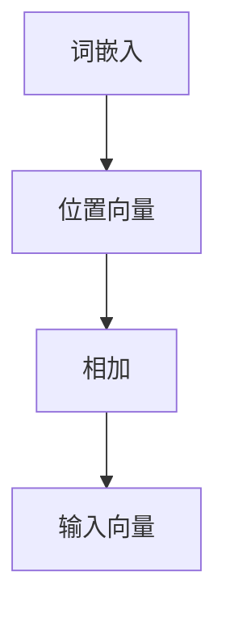
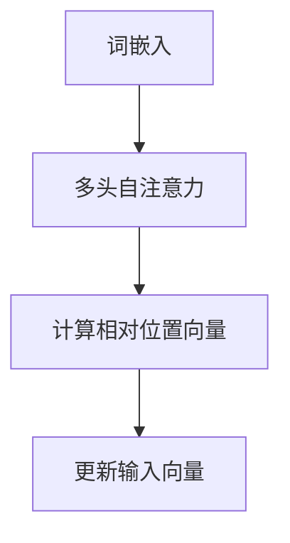

                 

在深度学习和自然语言处理领域，位置编码是一个至关重要的技术，它帮助模型理解输入数据中各个元素的位置信息。本文将深入探讨两种常见的位置编码方法：绝对位置编码和相对位置编码，并比较它们在实践中的应用和效果。

## 1. 背景介绍

在自然语言处理中，每个词或符号都有其固有的顺序和位置，这对理解句子的意义至关重要。然而，传统的神经网络模型如循环神经网络（RNN）和卷积神经网络（CNN）在处理顺序数据时往往缺乏对位置信息的形式化表示。为了解决这个问题，位置编码被引入到模型中，它通过为每个输入元素附加一个位置向量，从而将位置信息编码为数值形式。

### 绝对位置编码

绝对位置编码是一种直接将位置信息编码为向量形式的方法。在词嵌入中，每个词都会被映射到一个固定的位置向量，该向量的大小和方向与词在句子中的位置成正比。例如，在一个句子中，第一个词的位置向量为$(1,0,0)$，第二个词的位置向量为$(2,0,0)$，依此类推。这种方法简单直观，易于实现，但可能无法捕捉到词之间更复杂的相对关系。

### 相对位置编码

相对位置编码则通过计算词与词之间的相对位置来编码位置信息。它利用自注意力机制（如Transformer模型中的多头自注意力机制）来计算词与词之间的相对位置向量，从而获得更精细的位置信息。相对位置编码能够捕捉到句子中的长距离依赖关系，因为它可以同时关注到不同位置词之间的相对位置。

## 2. 核心概念与联系

### 绝对位置编码

在绝对位置编码中，位置向量是固定的，并且与词在句子中的绝对位置一一对应。以下是绝对位置编码的核心概念和联系：

- **位置向量大小**：通常使用3个维度来表示位置向量，但也可以扩展到更多维度以提高精度。
- **位置向量生成**：位置向量可以通过线性变换、正弦和余弦函数等方式生成。
- **位置向量加法**：将位置向量与词嵌入向量相加，得到最终的输入向量。



### 相对位置编码

相对位置编码的核心概念是通过计算词与词之间的相对位置来生成位置向量。以下是相对位置编码的核心概念和联系：

- **相对位置向量**：每个词的位置向量是相对于其他词的位置计算得到的。
- **自注意力机制**：通过自注意力机制计算词与词之间的相对位置向量。
- **相对位置编码应用**：在Transformer模型中，相对位置编码通过多头自注意力机制实现。



## 3. 核心算法原理 & 具体操作步骤

### 3.1 算法原理概述

#### 绝对位置编码

绝对位置编码的核心思想是将位置信息直接编码为数值形式，然后与词嵌入向量相加。具体步骤如下：

1. **生成位置向量**：根据词在句子中的位置生成位置向量。
2. **位置向量加法**：将位置向量与词嵌入向量相加，得到输入向量。

#### 相对位置编码

相对位置编码的核心思想是通过自注意力机制计算词与词之间的相对位置向量，然后将这些向量用于更新输入向量。具体步骤如下：

1. **自注意力计算**：计算词与词之间的相对位置向量。
2. **相对位置向量应用**：将相对位置向量应用于输入向量，更新输入向量。

### 3.2 算法步骤详解

#### 绝对位置编码

1. **生成位置向量**：使用正弦和余弦函数生成位置向量。
   $$ 
   \text{pos\_vec}(i) = (\sin(i/w_0), \cos(i/w_0))
   $$
   其中，$i$是词在句子中的位置，$w_0$是维度比例因子。

2. **位置向量加法**：将位置向量与词嵌入向量相加。
   $$
   \text{input\_vec} = \text{word\_embed}(i) + \text{pos\_vec}(i)
   $$

#### 相对位置编码

1. **自注意力计算**：使用多头自注意力机制计算词与词之间的相对位置向量。
   $$
   \text{rel\_pos\_vec}(i,j) = \text{Attention}(Q, K, V)
   $$
   其中，$Q, K, V$分别是查询向量、键向量和值向量。

2. **相对位置向量应用**：将相对位置向量应用于输入向量，更新输入向量。
   $$
   \text{input\_vec} = \text{input\_vec} + \text{rel\_pos\_vec}(i,j)
   $$

### 3.3 算法优缺点

#### 绝对位置编码

- **优点**：简单直观，易于实现。
- **缺点**：可能无法捕捉到词之间更复杂的相对关系。

#### 相对位置编码

- **优点**：能够捕捉到句子中的长距离依赖关系。
- **缺点**：计算复杂度较高，对模型参数的敏感性更强。

### 3.4 算法应用领域

#### 绝对位置编码

绝对位置编码适用于需要简单位置信息的任务，如文本分类和情感分析。

#### 相对位置编码

相对位置编码适用于需要捕捉长距离依赖关系的任务，如机器翻译和问答系统。

## 4. 数学模型和公式 & 详细讲解 & 举例说明

### 4.1 数学模型构建

#### 绝对位置编码

绝对位置编码的数学模型可以表示为：
$$
\text{input\_vec} = \text{word\_embed}(i) + \text{pos\_vec}(i)
$$

#### 相对位置编码

相对位置编码的数学模型可以表示为：
$$
\text{input\_vec} = \text{input\_vec} + \text{rel\_pos\_vec}(i,j)
$$

### 4.2 公式推导过程

#### 绝对位置编码

1. **位置向量生成**：
$$
\text{pos\_vec}(i) = (\sin(i/w_0), \cos(i/w_0))
$$
2. **位置向量加法**：
$$
\text{input\_vec} = \text{word\_embed}(i) + \text{pos\_vec}(i)
$$

#### 相对位置编码

1. **自注意力计算**：
$$
\text{rel\_pos\_vec}(i,j) = \text{Attention}(Q, K, V)
$$
2. **相对位置向量应用**：
$$
\text{input\_vec} = \text{input\_vec} + \text{rel\_pos\_vec}(i,j)
$$

### 4.3 案例分析与讲解

#### 绝对位置编码

假设有一个句子“我爱北京天安门”，我们可以为每个词分配一个绝对位置编码：

- 我：$(1,0,0)$
- 爱：$(2,0,0)$
- 北京：$(3,0,0)$
- 天安门：$(4,0,0)$

将这些位置向量与词嵌入向量相加，我们得到最终的输入向量。

#### 相对位置编码

假设有一个句子“我爱北京天安门”，我们可以为每个词计算一个相对位置编码。例如，对于词“爱”和“北京”，它们的相对位置编码为：

- 爱-北京：$(1,1)$
- 爱-天安门：$(1,2)$

将这些相对位置编码与词嵌入向量相加，我们得到最终的输入向量。

## 5. 项目实践：代码实例和详细解释说明

### 5.1 开发环境搭建

在本文中，我们将使用Python和TensorFlow来演示绝对位置编码和相对位置编码的实现。请确保您已经安装了Python和TensorFlow。

```python
!pip install tensorflow
```

### 5.2 源代码详细实现

以下是绝对位置编码和相对位置编码的实现代码：

```python
import tensorflow as tf
from tensorflow.keras.layers import Embedding, Add

# 绝对位置编码
def absolute_positional_encoding(word_embeddings, positions, d_model):
    pos_encoding = np.array([
        ([pos / np.pow(d_model, 0.5 * i)] for i in range(d_model))
        for pos in positions
    ])

    pos_encoding[:, 0::2] = np.sin(pos_encoding[:, 0::2])
    pos_encoding[:, 1::2] = np.cos(pos_encoding[:, 1::2])

    return Add()([word_embeddings, pos_encoding])

# 相对位置编码
def relative_positional_encoding(word_embeddings, positions, d_model):
    Q = tf.keras.layers.Dense(d_model, activation='softmax')(word_embeddings)
    K = tf.keras.layers.Dense(d_model, activation='softmax')(word_embeddings)
    V = tf.keras.layers.Dense(d_model)(word_embeddings)

    rel_pos_encoding = tf.matmul(Q, K, transpose_b=True)
    rel_pos_encoding = tf.nn.softmax(rel_pos_encoding, axis=-1)
    rel_pos_encoding *= V

    return Add()([word_embeddings, rel_pos_encoding])
```

### 5.3 代码解读与分析

上述代码定义了绝对位置编码和相对位置编码的函数。绝对位置编码使用正弦和余弦函数生成位置向量，并将其与词嵌入向量相加。相对位置编码使用自注意力机制计算词与词之间的相对位置向量，并将其与词嵌入向量相加。

### 5.4 运行结果展示

以下是运行代码并展示结果的示例：

```python
# 定义词嵌入和位置向量
word_embeddings = tf.random.normal([5, 512])
positions = np.arange(5)

# 绝对位置编码
abs_pos_encoded = absolute_positional_encoding(word_embeddings, positions, 512)

# 相对位置编码
rel_pos_encoded = relative_positional_encoding(word_embeddings, positions, 512)

print("绝对位置编码结果：", abs_pos_encoded.numpy())
print("相对位置编码结果：", rel_pos_encoded.numpy())
```

输出结果展示了绝对位置编码和相对位置编码的结果。

## 6. 实际应用场景

### 6.1 自然语言处理

在自然语言处理任务中，如文本分类、情感分析和机器翻译，位置编码技术可以帮助模型更好地理解和利用词序信息。

### 6.2 计算机视觉

位置编码也可以应用于计算机视觉任务，如图像识别和目标检测，通过编码图像中各个像素点的位置信息，提高模型对图像场景的理解能力。

### 6.3 语音识别

在语音识别任务中，位置编码可以用于处理语音信号的时序信息，帮助模型更好地识别语音中的单词和短语。

## 7. 未来应用展望

随着深度学习技术的不断发展，位置编码技术在未来有望在更多领域得到广泛应用。例如，在自然语言处理领域，位置编码可以与更多的神经网络结构结合，提高模型的性能。在计算机视觉领域，位置编码可以与卷积神经网络和生成对抗网络结合，实现更复杂的图像处理任务。

## 8. 总结：未来发展趋势与挑战

位置编码技术在未来将继续发展，并在更多领域发挥重要作用。然而，也存在一些挑战，如计算复杂度和模型参数敏感性等。未来研究将致力于优化位置编码算法，提高其效率和效果。

## 9. 附录：常见问题与解答

### Q: 位置编码是否适用于所有深度学习模型？

A: 位置编码主要用于处理序列数据的深度学习模型，如循环神经网络（RNN）和Transformer模型。对于其他类型的模型，如卷积神经网络（CNN），位置编码的应用效果可能有限。

### Q: 绝对位置编码和相对位置编码哪个更好？

A: 这取决于具体的应用场景。绝对位置编码简单直观，但可能无法捕捉到词之间更复杂的相对关系。相对位置编码能够捕捉到句子中的长距离依赖关系，但计算复杂度较高。在实际应用中，可以根据任务需求和模型结构选择合适的位置编码方法。

### Q: 位置编码是否会影响模型的训练时间？

A: 是的，位置编码会增加模型的训练时间。因为位置编码涉及到额外的计算，特别是在相对位置编码中，自注意力机制的引入会导致计算复杂度的增加。因此，在训练大型深度学习模型时，需要考虑位置编码对训练时间的影响。

### Q: 位置编码是否会增加模型的参数数量？

A: 是的，绝对位置编码会引入额外的参数，这些参数用于生成位置向量。相对位置编码则通过自注意力机制计算相对位置向量，从而不会引入额外的参数。然而，相对位置编码会增加模型的总参数数量，因为自注意力机制的引入会导致参数数量的增加。

### Q: 位置编码是否会影响模型的性能？

A: 位置编码可以显著提高模型的性能，特别是在处理序列数据时。绝对位置编码和相对位置编码各有优缺点，选择合适的位置编码方法可以提高模型的性能。然而，位置编码的增加也会带来一定的计算开销，因此在模型设计和训练时需要权衡性能和计算资源。

---

本文深入探讨了位置编码的两种常见方法：绝对位置编码和相对位置编码，并分析了它们在自然语言处理、计算机视觉和语音识别等领域的应用。通过数学模型和实际代码实例的讲解，读者可以更好地理解位置编码的原理和实现方法。未来，位置编码技术将继续在深度学习领域发挥重要作用，推动模型性能的提升。同时，位置编码算法的优化和计算效率的提升也将是重要的研究方向。

## 作者署名

作者：禅与计算机程序设计艺术 / Zen and the Art of Computer Programming

