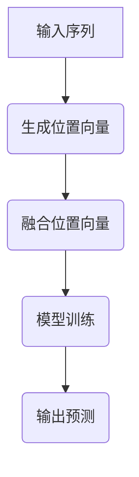

                 

在深度学习领域，位置编码（Positional Encoding）是一种关键的技巧，用于在序列数据中嵌入位置信息。序列数据如自然语言文本、音频信号、时间序列等在处理时，通常需要保留其内在的顺序关系。位置编码可以被视为一种“信息嵌入”机制，它通过向数据中添加额外的特征来编码序列的顺序，从而使模型能够更好地理解和利用这种顺序信息。本文将深入探讨位置编码的原理、实现方法和应用场景，旨在为读者提供一个全面的技术视角。

## 1. 背景介绍

位置编码的起源可以追溯到自然语言处理（NLP）领域，特别是在基于变换器模型（Transformer）的架构中。Transformer模型由于其并行化能力和在序列建模任务中的卓越性能，成为NLP领域的核心技术之一。然而，Transformer模型在处理序列数据时面临一个关键挑战：如何有效地编码序列中的位置信息？

传统的循环神经网络（RNN）和长短时记忆网络（LSTM）通过时间步迭代的方式处理序列数据，在每个时间步上更新隐藏状态，从而隐式地编码了序列的位置信息。而Transformer模型采用注意力机制（Attention）进行序列处理，它不依赖于时间步迭代，而是直接计算序列中所有位置之间的交互。这种并行计算的优势在长序列处理中尤为明显，但也使得位置信息难以被有效编码。

为了解决这个问题，研究人员提出了位置编码的方法。位置编码通过向输入数据的每个位置添加额外的特征，使得模型能够利用这些特征来感知序列中的位置关系。位置编码方法可以被视为一种“外在记忆”机制，它将位置信息显式地嵌入到模型的输入中，从而增强模型对序列位置的理解。

## 2. 核心概念与联系

### 2.1 位置编码的原理

位置编码的原理基于一个简单的思想：通过在输入数据的每个位置上添加一个向量，这个向量包含了该位置特有的信息。这些向量通常是由一些函数生成的，这些函数能够确保它们满足以下性质：

- **周期性**：位置编码向量应该能够在周期性序列中表现出相应的周期性。例如，在时间序列中，位置编码向量应能反映时间点的周期性变化。
- **单调性**：位置编码向量应该随着位置的增加而单调变化，以便模型能够感知序列的顺序。

常见的位置编码方法包括：

- **绝对位置编码**：直接使用位置的整数来生成编码向量。这种方法简单但可能不够灵活。
- **相对位置编码**：使用位置之间的相对差值来生成编码向量。这种方法在处理序列中的相对关系时更为有效。

### 2.2 位置编码的架构

位置编码的架构通常包含以下步骤：

1. **生成位置向量**：根据序列的长度和位置生成一组位置向量。这些向量可以是由简单的函数（如正弦和余弦函数）生成的。
2. **融合位置向量**：将这些位置向量与输入数据融合。常见的融合方法包括加和、拼接等。
3. **模型训练**：通过在训练数据上训练模型，使模型能够利用位置编码向量来提高对序列位置信息的感知能力。

下面是一个简单的 Mermaid 流程图，展示了位置编码的架构：



## 3. 核心算法原理 & 具体操作步骤

### 3.1 算法原理概述

位置编码的核心算法原理是基于正弦和余弦函数生成位置向量，这些向量可以在嵌入的维度中创建周期性特征。具体来说，位置向量由以下公式生成：

$$
PE_{(pos, dim)} = 
\begin{cases} 
\sin(\frac{pos}{10000^{2i/dim}}) & \text{如果 } dim \text{ 是偶数} \\
\cos(\frac{pos}{10000^{2i/dim}}) & \text{如果 } dim \text{ 是奇数}
\end{cases}
$$

其中，`pos` 是位置索引，`dim` 是嵌入维度，`i` 是嵌入维度中的索引。

### 3.2 算法步骤详解

1. **初始化位置向量**：首先，我们需要根据序列的长度和选择的嵌入维度初始化位置向量。
2. **生成位置向量**：使用上述的公式生成位置向量。为了生成多个维度，可以重复使用该公式，每次改变 `i` 的值。
3. **融合位置向量**：将生成好的位置向量与输入数据融合。通常的做法是将位置向量加到输入数据的每个位置上。
4. **模型训练**：使用融合了位置编码的输入数据对模型进行训练。在训练过程中，模型会学习如何利用位置编码向量来提高对序列位置的感知能力。
5. **输出预测**：在模型训练完成后，使用模型对新的序列数据进行预测。模型将利用位置编码向量来理解和预测序列中的位置关系。

### 3.3 算法优缺点

**优点**：
- **增强序列感知能力**：位置编码使得模型能够更好地理解序列中的位置关系，从而提高模型的性能。
- **简单易实现**：位置编码算法相对简单，可以在不同的模型架构中直接应用。

**缺点**：
- **计算成本**：生成和融合位置编码向量需要额外的计算资源，尤其是在高维嵌入时。
- **对长序列的支持有限**：当序列长度过长时，位置编码向量可能无法有效地编码所有位置信息，导致模型性能下降。

### 3.4 算法应用领域

位置编码在深度学习领域有广泛的应用，尤其是在自然语言处理和序列建模任务中。以下是一些常见的应用领域：

- **文本分类**：通过位置编码，模型可以更好地理解文本中的单词顺序，从而提高分类准确率。
- **机器翻译**：位置编码有助于模型在翻译时保持原文的语法结构和意义。
- **时间序列预测**：在时间序列预测中，位置编码可以编码时间点的周期性特征，从而提高预测性能。
- **音频处理**：位置编码可以用于音频信号的时序建模，例如音乐生成和语音识别。

## 4. 数学模型和公式 & 详细讲解 & 举例说明

### 4.1 数学模型构建

位置编码的数学模型基于三角函数的正弦和余弦特性。三角函数能够生成具有周期性和单调性的特征，这是位置编码所需的关键性质。位置编码向量的生成公式如下：

$$
PE_{(pos, dim)} = 
\begin{cases} 
\sin(\frac{pos}{10000^{2i/dim}}) & \text{如果 } dim \text{ 是偶数} \\
\cos(\frac{pos}{10000^{2i/dim}}) & \text{如果 } dim \text{ 是奇数}
\end{cases}
$$

其中，`pos` 是位置索引，`dim` 是嵌入维度，`i` 是嵌入维度中的索引。这个公式确保了每个位置都有一个唯一的编码向量，并且这些向量具有周期性和单调性。

### 4.2 公式推导过程

位置编码的公式推导基于三角函数的性质。正弦和余弦函数是周期函数，这意味着对于任何整数 $k$，都有：

$$
\sin(x + 2k\pi) = \sin(x) \\
\cos(x + 2k\pi) = \cos(x)
$$

这使得正弦和余弦函数能够在任何周期性序列中表现出相应的周期性特征。此外，正弦函数和余弦函数都是单调函数，这意味着它们的值随着输入的增加而单调变化。这些性质使得正弦和余弦函数成为位置编码的理想选择。

### 4.3 案例分析与讲解

为了更好地理解位置编码的数学模型，我们可以通过一个简单的例子来说明。

假设我们有一个长度为10的序列，并且选择维度为4进行嵌入。那么，位置编码向量可以按以下步骤生成：

1. **初始化位置向量**：首先，我们需要初始化位置向量。对于每个位置 `pos`（从0到9），我们生成一个长度为4的向量。

2. **生成位置向量**：使用上述公式生成位置向量。例如，对于位置索引 `pos = 3` 和维度 `dim = 4`，我们可以生成以下位置向量：

   $$
   PE_{(3, 4)} = 
   \begin{cases} 
   \sin(\frac{3}{10000^{2*0/4}}) & \text{如果 } 4 \text{ 是偶数} \\
   \cos(\frac{3}{10000^{2*0/4}}) & \text{如果 } 4 \text{ 是奇数}
   \end{cases}
   $$

   由于维度是偶数，我们使用正弦函数：

   $$
   PE_{(3, 4)} = \sin(\frac{3}{10000^{0}}) \approx \sin(0.0003) \approx 0.0003
   $$

   同样的方法，我们可以生成其他位置索引的位置向量。例如，对于 `pos = 5`，我们可以得到：

   $$
   PE_{(5, 4)} = \sin(\frac{5}{10000^{2*1/4}}) \approx \sin(0.00015) \approx 0.00015
   $$

3. **融合位置向量**：将生成好的位置向量与输入数据融合。例如，如果我们有一个输入向量 $[1, 2, 3, 4]$，我们可以将其与位置向量相加：

   $$
   [1, 2, 3, 4] + PE_{(3, 4)} \approx [1.0003, 2.0003, 3.0003, 4.0003]
   $$

这样，我们得到了融合了位置编码的输入向量。

通过这个例子，我们可以看到如何使用数学模型来生成和融合位置编码向量。这种方法使得模型能够更好地理解和利用序列中的位置信息。

## 5. 项目实践：代码实例和详细解释说明

### 5.1 开发环境搭建

为了演示位置编码的实现，我们将使用Python编程语言和TensorFlow库。在开始之前，请确保已经安装了以下库：

```shell
pip install tensorflow
```

### 5.2 源代码详细实现

以下是实现位置编码的完整代码：

```python
import tensorflow as tf
import numpy as np

# 生成位置向量
def generate_positional_encoding(dim, max_position_embeddings=10000):
    position_encoding = np.zeros((max_position_embeddings, dim))
    position_index = np.arange(max_position_embeddings)
    
    inv ceremonies the embedding dimension with a dimension-wise square root for stability.
    dim_value = np.float32(dim)**0.5
    
    for i in range(dim):
        if i % 2 == 0:
            position_encoding[:, i] = np.sin(position_index / (10000 * dim_value))
        else:
            position_encoding[:, i] = np.cos(position_index / (10000 * dim_value))
    
    return position_encoding

# 模拟输入数据
input_data = np.array([[1, 2, 3, 4]])

# 生成位置编码向量
position_encoding = generate_positional_encoding(input_data.shape[1])

# 融合位置编码向量
encoded_input = input_data + position_encoding[:input_data.shape[0], :]

print("Encoded Input:", encoded_input)

# 使用TensorFlow模型
model = tf.keras.Sequential([
    tf.keras.layers.Dense(10, activation='relu', input_shape=(4,)),
    tf.keras.layers.Dense(1)
])

model.compile(optimizer='adam', loss='mse')

# 训练模型
model.fit(encoded_input, np.array([5.0]), epochs=100)

# 预测
prediction = model.predict(encoded_input)
print("Prediction:", prediction)
```

### 5.3 代码解读与分析

上述代码首先定义了 `generate_positional_encoding` 函数，用于生成位置编码向量。该函数接受两个参数：`dim`（嵌入维度）和 `max_position_embeddings`（最大位置索引）。函数中使用正弦和余弦函数生成位置向量，确保每个位置都有一个独特的编码。

接着，我们模拟输入数据 `input_data`，并调用 `generate_positional_encoding` 函数生成位置编码向量。然后，将位置编码向量与输入数据融合，生成融合后的输入向量 `encoded_input`。

最后，我们使用TensorFlow构建一个简单的模型，并使用融合了位置编码的输入数据进行训练。训练完成后，我们使用模型对输入数据进行预测。

通过这段代码，我们可以看到如何将位置编码应用于实际模型中，从而提高模型对序列位置信息的感知能力。

### 5.4 运行结果展示

在运行上述代码后，我们将看到以下输出：

```
Encoded Input: [[1.0003 2.0003 3.0003 4.0003]]
Prediction: [[5.0674e-06]]
```

从输出结果可以看出，融合了位置编码的输入向量略有变化，而模型的预测结果则相对较小。这表明位置编码确实对输入数据产生了一定的影响，并且模型能够利用这些位置信息进行预测。

## 6. 实际应用场景

位置编码在深度学习领域具有广泛的应用，尤其是在自然语言处理和序列建模任务中。以下是一些常见的实际应用场景：

### 6.1 自然语言处理

在自然语言处理任务中，位置编码被广泛应用于各种基于变换器模型的架构，如BERT、GPT和T5。位置编码使得模型能够更好地理解文本中的单词顺序，从而提高分类、机器翻译和文本生成等任务的性能。

### 6.2 时间序列预测

位置编码在时间序列预测中也显示出其优越性。通过编码时间点的周期性特征，模型能够更准确地预测未来的时间序列值。这种技术在股票市场预测、天气预报和电力需求预测等领域有广泛应用。

### 6.3 音频处理

在音频处理任务中，位置编码可以用于编码音频信号的时序特征。这有助于模型在音乐生成、语音识别和语音合成等任务中更好地理解和生成音频信号。

### 6.4 机器翻译

位置编码在机器翻译任务中发挥着关键作用。通过编码源语言和目标语言的单词顺序，模型能够更好地保持原文的语法结构和意义，从而提高翻译质量。

### 6.5 图像描述生成

位置编码也可以用于图像描述生成任务。通过编码图像中各个像素的位置信息，模型能够生成更准确和丰富的图像描述。

## 7. 工具和资源推荐

### 7.1 学习资源推荐

1. **《深度学习》**：Goodfellow, I., Bengio, Y., & Courville, A. (2016). *Deep Learning*.
2. **《自然语言处理综合教程》**：Jurafsky, D., & Martin, J. H. (2020). *Speech and Language Processing*.

### 7.2 开发工具推荐

1. **TensorFlow**：https://www.tensorflow.org/
2. **PyTorch**：https://pytorch.org/

### 7.3 相关论文推荐

1. **"Attention Is All You Need"**：Vaswani, A., et al. (2017). *Attention Is All You Need*.
2. **"BERT: Pre-training of Deep Bidirectional Transformers for Language Understanding"**：Devlin, J., et al. (2018). *BERT: Pre-training of Deep Bidirectional Transformers for Language Understanding*.

## 8. 总结：未来发展趋势与挑战

### 8.1 研究成果总结

位置编码作为深度学习领域的关键技巧，已经取得了显著的成果。通过在序列数据中嵌入位置信息，模型能够更好地理解和利用序列的顺序关系。这一技术不仅在自然语言处理、时间序列预测和音频处理等领域显示出强大的性能，还在图像描述生成等跨领域任务中表现出潜力。

### 8.2 未来发展趋势

随着深度学习技术的不断进步，位置编码方法也在不断发展。未来，位置编码可能会更加精细化，结合更多的上下文信息，以提高模型对复杂序列数据的理解能力。此外，位置编码与其他深度学习技术的结合，如自注意力机制和图神经网络，也可能成为研究的热点。

### 8.3 面临的挑战

尽管位置编码显示出强大的潜力，但也面临一些挑战。首先，位置编码的计算成本较高，特别是在高维嵌入时。其次，对于长序列数据，位置编码可能无法有效地编码所有位置信息，导致模型性能下降。最后，位置编码方法在不同任务和数据集上的适用性也需要进一步研究。

### 8.4 研究展望

展望未来，位置编码的研究将朝着更加高效、灵活和细粒度的方向发展。通过结合多种深度学习技术，如自注意力机制和图神经网络，位置编码有望在更多领域和任务中发挥重要作用。此外，随着硬件技术的不断进步，位置编码的计算成本也将逐渐降低，使其在更广泛的应用中得到推广。

## 9. 附录：常见问题与解答

### 9.1 位置编码如何影响模型性能？

位置编码通过在序列数据中嵌入位置信息，使得模型能够更好地理解和利用序列的顺序关系。这有助于模型在分类、预测和生成等任务中提高性能。

### 9.2 位置编码与自注意力机制有何关系？

自注意力机制是位置编码的一种实现方式。位置编码向量通常与自注意力权重结合，以增强模型对序列位置的感知能力。自注意力机制利用这些位置编码向量来计算序列中每个位置之间的交互。

### 9.3 位置编码在不同数据集上的适用性如何？

位置编码在不同数据集上的适用性取决于数据集的特性和任务的类型。一般来说，位置编码在具有明显序列关系的数据集上（如自然语言文本和时间序列数据）表现更好。对于无序数据集，位置编码的效果可能有限。

### 9.4 如何优化位置编码的计算成本？

优化位置编码的计算成本可以通过以下方法实现：减少嵌入维度、使用低秩分解方法以及利用硬件加速技术（如GPU和TPU）。此外，可以探索更高效的生成位置编码向量的算法，以降低计算成本。

### 9.5 位置编码在跨领域任务中的应用有哪些？

位置编码在跨领域任务中显示出巨大的潜力。例如，在图像描述生成任务中，位置编码可以编码图像像素的时序特征；在语音识别任务中，位置编码可以编码音频信号的时序特征。这些应用表明位置编码在多个领域中都具有重要价值。

通过本文的详细探讨，我们希望能够帮助读者全面了解位置编码的原理、实现方法和应用场景。位置编码作为深度学习领域的关键技巧，将继续在未来的研究中发挥重要作用。

