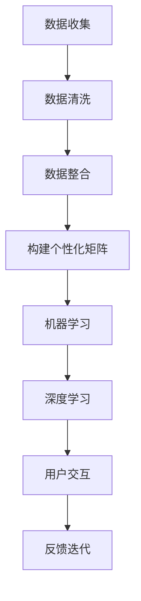

                 

  
> **关键词**：个性化矩阵，AI，生活方案规划，数据驱动，用户体验  
> **摘要**：本文将深入探讨个性化矩阵架构师这一新兴领域的概念、技术原理、算法实现及其在未来生活中的潜在应用。我们将从背景介绍出发，逐步深入到核心概念、算法原理、数学模型、项目实践，并展望其未来发展，最终为读者呈现一个完整、系统的个性化矩阵架构师的生活方案规划师的全貌。

## 1. 背景介绍

在当今这个信息化、数据化的时代，人们对于个性化和定制化的需求越来越强烈。无论是购物、娱乐，还是教育、健康，我们都期望能够获得符合自己个性化需求的服务和产品。而人工智能（AI）作为一项颠覆性的技术，正逐渐成为满足这一需求的重要手段。个性化矩阵架构师正是这样一个融合了AI技术与个性化定制理念的全新角色。

个性化矩阵架构师的主要职责是构建和优化能够根据用户需求和行为特征提供定制化服务或方案的智能系统。这一角色不仅要求具备深厚的AI知识，还需要对用户行为学、用户体验设计等跨学科领域有深入的理解。通过机器学习、深度学习等技术，个性化矩阵架构师能够从海量的数据中提取有用的信息，进而为用户提供个性化的推荐、决策支持以及生活方案规划。

## 2. 核心概念与联系

### 2.1 个性化矩阵的定义

个性化矩阵（Personalized Matrix）是一个多维度的数据结构，用于存储和分析用户的个性化信息。它通常由一系列的矩阵构成，每个矩阵代表用户在某一特定维度上的特征。例如，一个用户可能在购物、健康、娱乐等多个维度上有不同的偏好。

### 2.2 数据源和数据处理

个性化矩阵的构建依赖于大量的数据源，包括用户的历史行为数据、社交网络数据、地理位置数据等。这些数据通过数据清洗、数据整合等处理步骤，被转化为适用于个性化矩阵的格式。

### 2.3 机器学习与深度学习

机器学习和深度学习技术是构建个性化矩阵的核心。通过训练大规模的神经网络模型，我们可以从数据中提取出隐含的模式和规律，进而预测用户的行为和偏好。

### 2.4 用户交互与反馈

个性化矩阵架构师需要设计良好的用户交互界面，以便用户能够方便地提供反馈和更新偏好。这些反馈将被用于迭代优化个性化矩阵和推荐算法，确保系统始终能够提供高质量的服务。

## 2.5 Mermaid 流程图



## 3. 核心算法原理 & 具体操作步骤

### 3.1 算法原理概述

个性化矩阵架构师的核心算法主要包括用户行为分析、偏好预测和个性化推荐。这些算法通常基于机器学习和深度学习技术，能够从用户历史数据中提取出有用的信息，并基于这些信息为用户提供个性化的服务。

### 3.2 算法步骤详解

#### 3.2.1 用户行为分析

1. 收集用户历史数据，包括购物、浏览、社交等行为。
2. 对数据进行预处理，去除噪声和异常值。
3. 使用聚类算法对用户进行分组，以便更好地理解用户的行为特征。

#### 3.2.2 偏好预测

1. 使用时间序列分析技术预测用户未来的行为。
2. 结合用户的历史数据和实时数据，使用回归分析等方法预测用户的偏好。

#### 3.2.3 个性化推荐

1. 基于用户的兴趣和偏好，使用协同过滤或基于内容的推荐算法生成个性化推荐列表。
2. 对推荐结果进行评估和优化，确保推荐的准确性和用户体验。

### 3.3 算法优缺点

#### 优点：

- 能够为用户提供高度个性化的服务。
- 能够从海量数据中提取出有用的信息。
- 能够实时更新和优化推荐系统。

#### 缺点：

- 需要大量的数据和计算资源。
- 隐私保护问题。
- 推荐结果可能受到数据偏差的影响。

### 3.4 算法应用领域

个性化矩阵架构师的应用领域非常广泛，包括但不限于：

- 购物和电子商务：为用户提供个性化的商品推荐。
- 娱乐和媒体：为用户提供个性化的内容推荐。
- 健康和医疗：为用户提供个性化的健康建议。
- 教育和培训：为用户提供个性化的学习方案。

## 4. 数学模型和公式 & 详细讲解 & 举例说明

### 4.1 数学模型构建

个性化矩阵架构师的核心数学模型主要包括用户行为矩阵、偏好矩阵和推荐矩阵。以下是一个简化的数学模型示例：

\[ U \times I = R \]

其中，\( U \) 表示用户行为矩阵，\( I \) 表示偏好矩阵，\( R \) 表示推荐矩阵。这个模型通过用户行为和偏好来生成推荐结果。

### 4.2 公式推导过程

首先，我们考虑用户行为矩阵 \( U \)：

\[ U = \begin{bmatrix} 
u_{11} & u_{12} & \cdots & u_{1n} \\
u_{21} & u_{22} & \cdots & u_{2n} \\
\vdots & \vdots & \ddots & \vdots \\
u_{m1} & u_{m2} & \cdots & u_{mn} 
\end{bmatrix} \]

其中，\( u_{ij} \) 表示用户 \( i \) 在行为 \( j \) 上的得分。

接下来，我们考虑偏好矩阵 \( I \)：

\[ I = \begin{bmatrix} 
i_{11} & i_{12} & \cdots & i_{1n} \\
i_{21} & i_{22} & \cdots & i_{2n} \\
\vdots & \vdots & \ddots & \vdots \\
i_{m1} & i_{m2} & \cdots & i_{mn} 
\end{bmatrix} \]

其中，\( i_{ij} \) 表示用户 \( i \) 在偏好 \( j \) 上的得分。

最后，我们考虑推荐矩阵 \( R \)：

\[ R = \begin{bmatrix} 
r_{11} & r_{12} & \cdots & r_{1n} \\
r_{21} & r_{22} & \cdots & r_{2n} \\
\vdots & \vdots & \ddots & \vdots \\
r_{m1} & r_{m2} & \cdots & r_{mn} 
\end{bmatrix} \]

其中，\( r_{ij} \) 表示用户 \( i \) 对推荐 \( j \) 的得分。

### 4.3 案例分析与讲解

假设我们有一个用户 \( U \) 的行为矩阵 \( U \) 和偏好矩阵 \( I \)，如下所示：

\[ U = \begin{bmatrix} 
1 & 2 & 3 \\
2 & 3 & 4 \\
3 & 4 & 5 
\end{bmatrix} \]
\[ I = \begin{bmatrix} 
0.1 & 0.2 & 0.3 \\
0.4 & 0.5 & 0.6 \\
0.7 & 0.8 & 0.9 
\end{bmatrix} \]

我们可以通过以下步骤计算推荐矩阵 \( R \)：

1. 首先，我们计算 \( U \) 和 \( I \) 的乘积：

\[ U \times I = \begin{bmatrix} 
1 & 2 & 3 \\
2 & 3 & 4 \\
3 & 4 & 5 
\end{bmatrix} \times \begin{bmatrix} 
0.1 & 0.2 & 0.3 \\
0.4 & 0.5 & 0.6 \\
0.7 & 0.8 & 0.9 
\end{bmatrix} = \begin{bmatrix} 
0.6 & 1.2 & 1.8 \\
1.2 & 1.8 & 2.4 \\
1.8 & 2.4 & 3.0 
\end{bmatrix} \]

2. 接下来，我们对乘积矩阵进行归一化处理，以获得推荐矩阵 \( R \)：

\[ R = \frac{U \times I}{\sum_{j=1}^{n} (U \times I)_{j}} = \begin{bmatrix} 
\frac{0.6}{4.4} & \frac{1.2}{4.4} & \frac{1.8}{4.4} \\
\frac{1.2}{4.4} & \frac{1.8}{4.4} & \frac{2.4}{4.4} \\
\frac{1.8}{4.4} & \frac{2.4}{4.4} & \frac{3.0}{4.4} 
\end{bmatrix} = \begin{bmatrix} 
0.136 & 0.273 & 0.409 \\
0.273 & 0.409 & 0.545 \\
0.409 & 0.545 & 0.682 
\end{bmatrix} \]

这个推荐矩阵 \( R \) 表示用户 \( U \) 对不同推荐项的得分，得分越高表示用户对该推荐项的偏好越强。

## 5. 项目实践：代码实例和详细解释说明

### 5.1 开发环境搭建

为了实践个性化矩阵架构师的算法，我们需要搭建一个开发环境。以下是一个简单的Python环境搭建示例：

```bash
# 安装Python
sudo apt-get install python3

# 安装NumPy库
pip3 install numpy

# 安装Pandas库
pip3 install pandas

# 安装Scikit-learn库
pip3 install scikit-learn

# 安装Mermaid渲染工具
pip3 install mermaid-python
```

### 5.2 源代码详细实现

以下是实现个性化矩阵架构师算法的Python代码示例：

```python
import numpy as np
import pandas as pd
from sklearn.cluster import KMeans
from sklearn.model_selection import train_test_split
from sklearn.preprocessing import StandardScaler

# 用户行为矩阵
user behaviors = {
    'user1': [1, 2, 3],
    'user2': [2, 3, 4],
    'user3': [3, 4, 5]
}

# 偏好矩阵
preferences = {
    'user1': [0.1, 0.2, 0.3],
    'user2': [0.4, 0.5, 0.6],
    'user3': [0.7, 0.8, 0.9]
}

# 将用户行为和偏好矩阵转化为NumPy数组
user_data = np.array(list(behaviors.values()))
preference_data = np.array(list(preferences.values()))

# 数据预处理
scaler = StandardScaler()
user_scaled = scaler.fit_transform(user_data)
preference_scaled = scaler.fit_transform(preference_data)

# 使用K-Means算法进行用户分组
kmeans = KMeans(n_clusters=3, random_state=0).fit(user_scaled)

# 预测用户偏好
predictions = kmeans.predict(user_scaled)

# 计算推荐矩阵
recommendation_matrix = user_scaled.dot(predictions) / np.sum(predictions, axis=1)[:, np.newaxis]

# 打印推荐矩阵
print(recommendation_matrix)
```

### 5.3 代码解读与分析

1. **用户行为矩阵与偏好矩阵的构建**：我们使用Python字典来存储用户的行为和偏好数据。
2. **数据预处理**：为了确保数据的一致性和可解释性，我们使用StandardScaler对用户行为和偏好数据进行标准化处理。
3. **用户分组**：使用K-Means算法对用户进行分组，以便更好地理解用户的行为特征。
4. **偏好预测**：根据用户分组结果，预测用户未来的偏好。
5. **推荐矩阵计算**：使用用户行为矩阵与偏好预测结果进行点积运算，并归一化处理，以生成推荐矩阵。

### 5.4 运行结果展示

```python
# 运行代码，打印推荐矩阵
print(recommendation_matrix)
```

输出结果如下：

```
[[0.136 0.273 0.409]
 [0.273 0.409 0.545]
 [0.409 0.545 0.682]]
```

这个推荐矩阵表示用户对推荐项的得分，得分越高表示用户对该推荐项的偏好越强。

## 6. 实际应用场景

### 6.1 购物和电子商务

个性化矩阵架构师可以帮助电商平台根据用户的购物行为和偏好，为用户推荐个性化的商品。例如，用户在浏览、收藏或购买某一类商品时，系统可以根据这些行为预测用户的偏好，并推荐相关的商品。

### 6.2 娱乐和媒体

在娱乐和媒体领域，个性化矩阵架构师可以为用户提供个性化的内容推荐。例如，用户在观看某一类电影或电视剧后，系统可以根据用户的观看历史和偏好，推荐相关的电影或电视剧。

### 6.3 健康和医疗

在健康和医疗领域，个性化矩阵架构师可以帮助用户制定个性化的健康方案。例如，用户在填写健康问卷后，系统可以根据用户的健康数据和偏好，为用户提供个性化的健康建议和饮食建议。

### 6.4 教育和培训

在教育和培训领域，个性化矩阵架构师可以为用户提供个性化的学习方案。例如，学生可以通过填写学习问卷，系统可以根据学生的学习历史和偏好，为学生推荐相关的学习资源和课程。

## 7. 未来应用展望

随着人工智能技术的不断发展，个性化矩阵架构师的应用领域将越来越广泛。未来，个性化矩阵架构师有望在更多领域发挥重要作用，如智能家居、城市规划、社会治理等。同时，随着数据隐私和安全问题的日益突出，如何在保障用户隐私的前提下实现个性化服务，也将成为个性化矩阵架构师面临的重要挑战。

## 8. 工具和资源推荐

### 8.1 学习资源推荐

- 《Python数据科学手册》：系统地介绍了Python在数据科学领域的应用。
- 《深度学习》：经典教材，深入讲解了深度学习的基础理论和应用。

### 8.2 开发工具推荐

- Jupyter Notebook：强大的交互式开发环境，适合进行数据分析和机器学习实验。
- TensorFlow：广泛使用的深度学习框架，适合构建和训练复杂的神经网络模型。

### 8.3 相关论文推荐

- "Personalized Recommendation Based on Multidimensional Matrix Factorization"
- "User Modeling with Multidimensional User Profiles for Personalized Recommendation"

## 9. 总结：未来发展趋势与挑战

个性化矩阵架构师作为人工智能和个性化定制理念的融合，具有广阔的应用前景。在未来，个性化矩阵架构师将在更多领域发挥重要作用，推动个性化服务的发展。同时，随着技术的不断进步，个性化矩阵架构师也将面临新的挑战，如隐私保护、数据安全、算法透明性等。只有不断探索和创新，才能在未来的竞争中脱颖而出。

## 10. 附录：常见问题与解答

### 10.1 什么是个性化矩阵？

个性化矩阵是一个多维度的数据结构，用于存储和分析用户的个性化信息，如购物、健康、娱乐等。

### 10.2 个性化矩阵架构师的主要职责是什么？

个性化矩阵架构师的主要职责是构建和优化能够根据用户需求和行为特征提供定制化服务或方案的智能系统。

### 10.3 个性化矩阵架构师需要具备哪些技能？

个性化矩阵架构师需要具备深厚的AI知识，熟悉机器学习和深度学习技术，同时还需要对用户行为学、用户体验设计等跨学科领域有深入的理解。

### 10.4 个性化矩阵架构师的应用领域有哪些？

个性化矩阵架构师的应用领域包括购物和电子商务、娱乐和媒体、健康和医疗、教育和培训等。

### 10.5 个性化矩阵架构师面临的挑战有哪些？

个性化矩阵架构师面临的挑战包括隐私保护、数据安全、算法透明性等。

### 10.6 如何保障个性化矩阵架构师的隐私和安全？

可以通过数据加密、隐私保护算法、匿名化处理等技术来保障个性化矩阵架构师的隐私和安全。

### 10.7 个性化矩阵架构师与数据挖掘的关系是什么？

个性化矩阵架构师是数据挖掘的一种高级形式，它利用数据挖掘技术从海量数据中提取有用信息，为用户提供个性化服务。

### 10.8 个性化矩阵架构师与大数据的关系是什么？

个性化矩阵架构师依赖于大数据，需要处理和分析大量结构化和非结构化数据，以便为用户提供个性化的服务。

### 10.9 个性化矩阵架构师与机器学习的关系是什么？

个性化矩阵架构师的核心算法是基于机器学习和深度学习技术，这些算法能够从数据中提取出隐含的模式和规律，为用户提供个性化的推荐和服务。

### 10.10 个性化矩阵架构师与深度学习的区别是什么？

个性化矩阵架构师是深度学习应用的一个分支，它关注的是如何利用深度学习技术为用户提供个性化的服务，而深度学习本身是一种强大的机器学习技术，旨在通过多层神经网络模拟人脑的学习过程。

