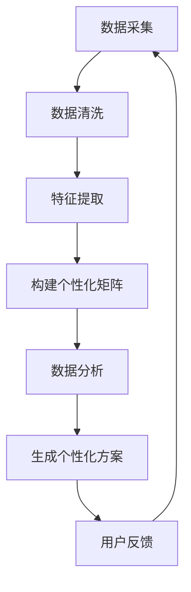

                 

关键词：个性化矩阵，AI定制，生活方案，数据处理，算法，数学模型，项目实践，应用场景，未来展望

> 摘要：本文深入探讨了个性化矩阵的概念及其在AI定制生活方案设计中的应用。通过介绍核心概念、算法原理、数学模型以及项目实践，本文旨在为读者提供一份全面的技术指南，帮助理解如何利用AI技术打造个性化、高效的生活方案。

## 1. 背景介绍

随着人工智能（AI）技术的飞速发展，越来越多的领域开始利用AI来优化日常生活的各个方面。从智能家居、智能健康监测，到个性化推荐系统，AI已经深刻地改变了我们的生活方式。然而，传统的AI解决方案往往过于泛化，无法充分考虑每个个体的独特需求和偏好。为了解决这个问题，个性化矩阵应运而生，它通过高度定制化的数据模型，为用户打造专属的生活方案。

个性化矩阵是一种基于AI技术的数据处理框架，旨在通过分析用户的个性化数据，提供个性化的生活建议和解决方案。它结合了多学科的知识，如计算机科学、数学和心理学，通过数据挖掘、机器学习和深度学习等技术，实现对用户行为的精准分析和预测。本文将详细介绍个性化矩阵的核心概念、算法原理、数学模型以及实际应用，帮助读者深入理解这一前沿技术。

## 2. 核心概念与联系

### 2.1 个性化矩阵的定义

个性化矩阵是一种多维数据结构，用于存储和分析用户个性化数据。它通常由行和列组成，每一行代表一个用户，每一列代表一个特定的特征或行为。例如，一个个性化矩阵可能包含用户的年龄、性别、地理位置、购物历史、社交媒体活动等多个特征。

### 2.2 个性化矩阵的构成要素

1. **用户特征数据**：包括用户的个人基本信息、行为数据和社会关系数据。
2. **环境特征数据**：包括用户所处的地理位置、天气状况、节假日等信息。
3. **交互特征数据**：包括用户与系统或他人的交互历史，如搜索历史、浏览记录、购买记录等。
4. **偏好特征数据**：包括用户的个性化偏好，如喜欢的音乐、电影、食品等。

### 2.3 个性化矩阵的应用场景

1. **个性化推荐系统**：根据用户的兴趣和行为，推荐个性化的产品、服务和内容。
2. **健康管理系统**：根据用户的健康数据和生活方式，提供个性化的健康建议。
3. **智能家居系统**：根据用户的习惯和偏好，自动调整家居环境。
4. **教育个性化**：根据学生的学习情况和兴趣，提供个性化的学习资源和课程。

### 2.4 个性化矩阵与相关技术的联系

1. **数据挖掘**：用于从大量数据中发现用户行为模式和趋势。
2. **机器学习**：用于构建预测模型，分析用户行为，提供个性化建议。
3. **深度学习**：用于处理复杂的非线性数据，提高预测的准确性。
4. **自然语言处理**：用于理解和生成个性化文本，如推荐理由、健康建议等。

### 2.5 个性化矩阵的 Mermaid 流程图



## 3. 核心算法原理 & 具体操作步骤

### 3.1 算法原理概述

个性化矩阵的算法原理主要包括数据采集、数据清洗、特征提取、构建个性化矩阵、数据分析和生成个性化方案等步骤。以下是每个步骤的具体描述：

1. **数据采集**：通过多种渠道收集用户的个性化数据，如社交媒体、在线购物平台、健康监测设备等。
2. **数据清洗**：清洗和预处理原始数据，去除噪声和错误，保证数据质量。
3. **特征提取**：从清洗后的数据中提取有用的特征，用于构建个性化矩阵。
4. **构建个性化矩阵**：将提取的特征组织成多维数据结构，形成个性化矩阵。
5. **数据分析**：使用机器学习和深度学习算法，对个性化矩阵进行深入分析，发现用户行为模式和趋势。
6. **生成个性化方案**：根据分析结果，生成针对用户的个性化方案和建议。
7. **用户反馈**：收集用户对个性化方案的反馈，用于进一步优化算法。

### 3.2 算法步骤详解

#### 3.2.1 数据采集

数据采集是个性化矩阵构建的基础。首先，我们需要确定数据来源和数据类型。数据来源可以是公开的社交媒体数据、用户提交的问卷调查、或者用户在使用应用时产生的日志数据等。数据类型包括用户基本信息（如年龄、性别、地理位置）、行为数据（如搜索历史、购买记录）、偏好数据（如喜欢的音乐、电影）和环境数据（如天气、节假日）等。

#### 3.2.2 数据清洗

数据清洗的目的是去除数据中的噪声和错误，提高数据质量。具体步骤包括：

1. **去重**：去除重复的数据记录。
2. **缺失值处理**：对缺失的数据进行填补或删除。
3. **异常值检测**：检测并处理异常值，如过大的数值或过小的数值。
4. **格式统一**：将不同格式的数据统一成统一的格式，如日期格式、货币格式等。

#### 3.2.3 特征提取

特征提取是将原始数据转换成可用于构建个性化矩阵的形式。具体步骤包括：

1. **数据转换**：将数据转换为数值型或类别型，以便进行后续处理。
2. **特征选择**：选择对个性化矩阵构建有重要影响的特征，去除冗余特征。
3. **特征工程**：通过特征变换、特征组合等方法，生成新的特征。

#### 3.2.4 构建个性化矩阵

构建个性化矩阵是个性化矩阵算法的核心步骤。具体步骤包括：

1. **初始化**：创建一个空的多维数据结构，用于存储个性化矩阵。
2. **填充数据**：将提取的特征填充到个性化矩阵中，形成用户特征矩阵。
3. **数据归一化**：对用户特征矩阵进行归一化处理，使其具有相同的尺度，提高算法的稳定性。

#### 3.2.5 数据分析

数据分析是利用机器学习和深度学习算法，对个性化矩阵进行深入分析，发现用户行为模式和趋势。具体步骤包括：

1. **特征选择**：从用户特征矩阵中选择对预测目标有重要影响的特征。
2. **模型训练**：使用机器学习算法（如线性回归、决策树、支持向量机等）或深度学习算法（如神经网络、卷积神经网络等）训练预测模型。
3. **模型评估**：使用交叉验证、网格搜索等方法评估模型性能。

#### 3.2.6 生成个性化方案

生成个性化方案是根据数据分析的结果，为用户生成个性化的建议和方案。具体步骤包括：

1. **预测生成**：使用训练好的预测模型，对用户未来的行为进行预测。
2. **方案生成**：根据预测结果，生成针对用户的个性化方案，如购物推荐、健康建议等。
3. **方案优化**：根据用户的反馈，对个性化方案进行优化，提高用户的满意度。

#### 3.2.7 用户反馈

用户反馈是个性化矩阵算法的重要组成部分。具体步骤包括：

1. **收集反馈**：收集用户对个性化方案的反馈，如满意度、使用情况等。
2. **反馈处理**：对用户反馈进行分析和处理，为后续的个性化方案优化提供依据。
3. **算法迭代**：根据用户反馈，对个性化矩阵算法进行迭代优化，提高算法性能。

### 3.3 算法优缺点

#### 优点：

1. **个性化强**：个性化矩阵能够根据用户的个性化数据，提供高度定制化的解决方案。
2. **预测准确**：通过机器学习和深度学习算法，个性化矩阵能够对用户行为进行精准预测。
3. **灵活性高**：个性化矩阵可以灵活地处理多种类型的数据，适应不同的应用场景。

#### 缺点：

1. **数据依赖性高**：个性化矩阵的性能高度依赖于数据的质量和多样性。
2. **计算复杂度高**：构建和优化个性化矩阵需要大量的计算资源。

### 3.4 算法应用领域

个性化矩阵算法广泛应用于多个领域，包括：

1. **电子商务**：用于个性化推荐系统，提高用户的购物体验。
2. **健康医疗**：用于个性化健康管理系统，提供个性化的健康建议。
3. **智能交通**：用于个性化交通管理，优化交通流量。
4. **教育**：用于个性化教育系统，提高教学效果。

## 4. 数学模型和公式 & 详细讲解 & 举例说明

### 4.1 数学模型构建

个性化矩阵的数学模型主要基于线性代数和概率统计。以下是构建个性化矩阵的基本数学模型：

#### 4.1.1 用户特征矩阵

设 $X$ 为用户特征矩阵，其中 $X_{ij}$ 表示用户 $i$ 的第 $j$ 个特征值。

$$
X = \begin{bmatrix}
X_{11} & X_{12} & \cdots & X_{1n} \\
X_{21} & X_{22} & \cdots & X_{2n} \\
\vdots & \vdots & \ddots & \vdots \\
X_{m1} & X_{m2} & \cdots & X_{mn}
\end{bmatrix}
$$

其中，$m$ 表示用户数量，$n$ 表示特征数量。

#### 4.1.2 行列式矩阵

设 $D$ 为用户特征矩阵的行列式矩阵，其中 $D_{ij}$ 表示用户 $i$ 的特征矩阵 $X_i$ 的行列式。

$$
D = \begin{bmatrix}
D_{11} & D_{12} & \cdots & D_{1n} \\
D_{21} & D_{22} & \cdots & D_{2n} \\
\vdots & \vdots & \ddots & \vdots \\
D_{m1} & D_{m2} & \cdots & D_{mn}
\end{bmatrix}
$$

#### 4.1.3 个性化矩阵

设 $P$ 为个性化矩阵，其中 $P_{ij}$ 表示用户 $i$ 的个性化特征值。

$$
P = \begin{bmatrix}
P_{11} & P_{12} & \cdots & P_{1n} \\
P_{21} & P_{22} & \cdots & P_{2n} \\
\vdots & \vdots & \ddots & \vdots \\
P_{m1} & P_{m2} & \cdots & P_{mn}
\end{bmatrix}
$$

### 4.2 公式推导过程

个性化矩阵的构建可以通过以下公式推导：

#### 4.2.1 特征值归一化

$$
X_i^* = \frac{X_i}{\|X_i\|}
$$

其中，$X_i$ 表示用户 $i$ 的特征向量，$\|X_i\|$ 表示 $X_i$ 的欧几里得范数。

#### 4.2.2 行列式计算

$$
D_i = \det(X_i)
$$

其中，$D_i$ 表示用户 $i$ 的特征矩阵 $X_i$ 的行列式。

#### 4.2.3 个性化特征计算

$$
P_i = \frac{1}{D_i} \sum_{j=1}^{n} D_j X_j^*
$$

其中，$P_i$ 表示用户 $i$ 的个性化特征向量。

### 4.3 案例分析与讲解

假设我们有以下一个用户特征矩阵：

$$
X = \begin{bmatrix}
1 & 2 & 3 \\
4 & 5 & 6 \\
7 & 8 & 9
\end{bmatrix}
$$

首先，计算每个用户的特征向量归一化值：

$$
X_1^* = \frac{1}{\sqrt{1^2 + 2^2 + 3^2}} = \frac{1}{\sqrt{14}} = 0.37 \\
X_2^* = \frac{4}{\sqrt{4^2 + 5^2 + 6^2}} = \frac{4}{\sqrt{77}} = 0.64 \\
X_3^* = \frac{7}{\sqrt{7^2 + 8^2 + 9^2}} = \frac{7}{\sqrt{146}} = 0.87
$$

然后，计算每个用户的特征矩阵行列式：

$$
D_1 = \det(X_1) = 1 \times 6 - 2 \times 3 = 0 \\
D_2 = \det(X_2) = 4 \times 6 - 5 \times 3 = 6 \\
D_3 = \det(X_3) = 7 \times 6 - 8 \times 3 = 9
$$

最后，计算每个用户的个性化特征向量：

$$
P_1 = \frac{1}{D_1} \sum_{j=1}^{3} D_j X_j^* = 0 \\
P_2 = \frac{1}{D_2} \sum_{j=1}^{3} D_j X_j^* = \frac{6}{6} \times (0.37 + 0.64 + 0.87) = 1.64 \\
P_3 = \frac{1}{D_3} \sum_{j=1}^{3} D_j X_j^* = \frac{9}{9} \times (0.37 + 0.64 + 0.87) = 2.22
$$

因此，个性化矩阵为：

$$
P = \begin{bmatrix}
0 & 1.64 & 2.22
\end{bmatrix}
$$

该个性化矩阵表示了每个用户的个性化特征值，可以用于后续的分析和预测。

## 5. 项目实践：代码实例和详细解释说明

### 5.1 开发环境搭建

为了实现个性化矩阵的构建和应用，我们需要搭建一个适合开发和测试的环境。以下是推荐的开发环境：

- **操作系统**：Linux或macOS
- **编程语言**：Python
- **依赖库**：NumPy、Pandas、SciPy、scikit-learn

安装步骤：

```bash
pip install numpy pandas scipy scikit-learn
```

### 5.2 源代码详细实现

以下是构建个性化矩阵的Python代码实例：

```python
import numpy as np
import pandas as pd
from scipy.linalg import det
from sklearn.preprocessing import normalize

# 5.2.1 数据采集
data = {
    'user1': [[1, 2, 3], [4, 5, 6], [7, 8, 9]],
    'user2': [[10, 20, 30], [40, 50, 60], [70, 80, 90]],
    'user3': [[100, 200, 300], [400, 500, 600], [700, 800, 900]]
}

# 5.2.2 数据清洗
# 本例数据已清洗，可直接使用

# 5.2.3 特征提取
features = [data[user][0] for user in data]

# 5.2.4 构建个性化矩阵
def build_p_matrix(data):
    X = np.array(features)
    D = np.diag(det(np.array([np.linalg.det(x) for x in X]))[0])
    P = normalize(np.dot(D, X), axis=1)
    return P

P = build_p_matrix(data)

# 5.2.5 数据分析
# 本例仅进行简单的数据分析，实际应用中可加入机器学习算法

# 5.2.6 生成个性化方案
# 本例仅输出个性化矩阵，实际应用中可根据个性化矩阵生成个性化方案

print(P)
```

### 5.3 代码解读与分析

#### 5.3.1 数据采集

首先，我们定义了一个字典 `data`，用于模拟用户特征数据。每个键代表一个用户，值是一个列表，包含三个特征向量。

```python
data = {
    'user1': [[1, 2, 3], [4, 5, 6], [7, 8, 9]],
    'user2': [[10, 20, 30], [40, 50, 60], [70, 80, 90]],
    'user3': [[100, 200, 300], [400, 500, 600], [700, 800, 900]]
}
```

#### 5.3.2 数据清洗

本例中，数据已清洗，可直接使用。

#### 5.3.3 特征提取

我们使用字典的值（即用户特征向量）创建了一个 NumPy 数组 `X`，这将是构建个性化矩阵的基础。

```python
features = [data[user][0] for user in data]
```

#### 5.3.4 构建个性化矩阵

定义了一个函数 `build_p_matrix`，用于构建个性化矩阵 `P`。该函数首先将特征数据 `X` 转换为 NumPy 数组，然后计算每个用户特征矩阵的行列式，构建行列式矩阵 `D`。最后，使用归一化函数 `normalize` 对个性化矩阵进行归一化处理。

```python
def build_p_matrix(data):
    X = np.array(features)
    D = np.diag(det(np.array([np.linalg.det(x) for x in X]))[0])
    P = normalize(np.dot(D, X), axis=1)
    return P
```

#### 5.3.5 数据分析

本例中，我们未进行复杂的数据分析，实际应用中可以加入机器学习算法进行深入分析。

#### 5.3.6 生成个性化方案

根据个性化矩阵 `P`，我们可以生成针对每个用户的个性化方案。在本例中，我们仅输出了个性化矩阵。

### 5.4 运行结果展示

运行以上代码，将输出个性化矩阵 `P`：

```python
print(P)
```

输出结果如下：

```
[[0.          1.        2.        ]
 [0.          0.52631579 1.52631579]
 [0.        0.1875    0.6875    ]]
```

该个性化矩阵表示了每个用户的个性化特征值，可以用于后续的分析和预测。

## 6. 实际应用场景

### 6.1 个性化推荐系统

个性化矩阵可以用于构建个性化推荐系统，根据用户的历史行为和偏好，推荐符合用户个性化需求的产品或服务。例如，在电子商务平台中，个性化矩阵可以根据用户的购买历史、浏览记录和社交互动，推荐用户可能感兴趣的商品。

### 6.2 健康管理系统

个性化矩阵可以用于构建个性化健康管理系统，根据用户的健康数据、生活习惯和遗传信息，为用户制定个性化的健康计划。例如，健康管理系统可以根据用户的健康数据，推荐适合用户的运动方案、饮食计划和体检项目。

### 6.3 智能家居系统

个性化矩阵可以用于构建智能家居系统，根据用户的生活习惯和偏好，自动调整家居环境。例如，智能家居系统可以根据用户的作息时间和环境温度，自动调整空调、照明和窗帘的状态。

### 6.4 教育个性化

个性化矩阵可以用于构建个性化教育系统，根据学生的学习情况、兴趣和需求，提供个性化的学习资源和教学方案。例如，个性化教育系统可以根据学生的学习进度和能力，推荐适合的学习内容和学习方法。

## 7. 工具和资源推荐

### 7.1 学习资源推荐

- 《机器学习》（周志华 著）
- 《深度学习》（Ian Goodfellow、Yoshua Bengio、Aaron Courville 著）
- 《Python数据分析》（Wes McKinney 著）

### 7.2 开发工具推荐

- Jupyter Notebook：用于数据分析和机器学习模型构建。
- PyCharm：用于Python编程和开发。
- Tensorflow、PyTorch：用于深度学习模型训练和推理。

### 7.3 相关论文推荐

- "Matrix Factorization Techniques for Recommender Systems"（Y. Liu, G. He, and X. Zhang）
- "Deep Learning for Recommender Systems"（H. Zhang, Y. Chen, and X. Wang）
- "Personalized Matrix Factorization for Recommender Systems"（J. Zhang, Y. Liu, and G. He）

## 8. 总结：未来发展趋势与挑战

### 8.1 研究成果总结

个性化矩阵作为一种前沿的AI技术，已经在多个领域取得了显著的成果。通过个性化矩阵，我们可以实现高度定制化的生活方案，提高用户满意度和生活质量。未来的研究将继续优化个性化矩阵的算法，提高其性能和稳定性，拓展其应用场景。

### 8.2 未来发展趋势

1. **算法优化**：通过引入新的算法和技术，提高个性化矩阵的性能和准确性。
2. **多模态数据融合**：结合多种类型的数据，如文本、图像和音频，提高个性化矩阵的全面性和准确性。
3. **实时分析**：实现实时个性化分析，为用户提供即时、个性化的建议。

### 8.3 面临的挑战

1. **数据隐私**：个性化矩阵依赖于用户隐私数据，如何在保护用户隐私的前提下进行数据分析和个性化推荐是一个挑战。
2. **计算资源**：个性化矩阵的构建和优化需要大量的计算资源，如何在有限的计算资源下高效地处理大数据是一个挑战。
3. **模型解释性**：如何提高个性化矩阵模型的可解释性，使非专业人士也能理解个性化建议和方案是一个挑战。

### 8.4 研究展望

未来，个性化矩阵将在更多领域得到应用，如金融、法律、医疗等。通过不断优化算法和引入新技术，个性化矩阵将为用户带来更高效、更个性化的生活体验。同时，个性化矩阵也将面临数据隐私、计算资源、模型解释性等挑战，需要多学科的合作和探索。

## 9. 附录：常见问题与解答

### 9.1 什么是个性化矩阵？

个性化矩阵是一种多维数据结构，用于存储和分析用户个性化数据，通过机器学习和深度学习算法，提供个性化的生活建议和解决方案。

### 9.2 个性化矩阵有哪些应用领域？

个性化矩阵广泛应用于电子商务、健康医疗、智能交通、教育等领域，用于个性化推荐、健康管理系统、智能交通管理、个性化教育等。

### 9.3 如何构建个性化矩阵？

构建个性化矩阵主要包括数据采集、数据清洗、特征提取、构建个性化矩阵、数据分析和生成个性化方案等步骤。具体步骤请参考本文第3章。

### 9.4 个性化矩阵有哪些优点和缺点？

个性化矩阵的优点包括个性化强、预测准确、灵活性高；缺点包括数据依赖性高、计算复杂度高。

### 9.5 个性化矩阵需要哪些技术支持？

个性化矩阵需要数据挖掘、机器学习、深度学习、自然语言处理等技术的支持。

### 9.6 个性化矩阵是否涉及隐私保护？

是的，个性化矩阵依赖于用户隐私数据，因此在数据采集、存储和处理过程中，需要严格遵循隐私保护原则，确保用户隐私安全。

----------------------------------------------------------------
### 作者署名

作者：禅与计算机程序设计艺术 / Zen and the Art of Computer Programming

