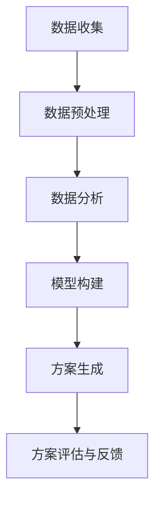

                 

关键词：个性化矩阵、人工智能、生活方案、AI定制、技术实现、应用场景、未来发展

> 摘要：本文深入探讨了个性化矩阵的概念，以及如何利用人工智能技术为人们的生活方案提供定制化的解决方案。文章首先介绍了个性化矩阵的背景和核心概念，然后详细阐述了其实现原理、算法步骤、数学模型及实际应用。通过一系列案例分析和项目实践，本文展示了个性化矩阵在现实生活中的应用，并对未来的发展前景进行了展望。

## 1. 背景介绍

随着人工智能技术的迅速发展，个性化已经成为各行各业的重要趋势。在生活方案设计领域，个性化矩阵作为一种基于人工智能的解决方案，正逐渐受到关注。个性化矩阵旨在通过收集和分析用户数据，构建出一个反映个体需求的个性化模型，进而为用户提供定制化的生活方案。

### 1.1 发展背景

个性化矩阵的概念源于大数据和人工智能技术的结合。大数据技术使得我们能够收集和处理海量数据，而人工智能技术则能够从这些数据中提取有价值的信息。个性化矩阵正是利用这些技术，通过对用户行为、偏好、需求等数据的深入分析，为用户提供个性化的解决方案。

### 1.2 发展现状

近年来，个性化矩阵在多个领域取得了显著的应用成果。例如，在电子商务领域，个性化矩阵帮助电商平台推荐商品；在金融领域，个性化矩阵用于风险评估和投资策略制定；在医疗领域，个性化矩阵帮助医生进行疾病预测和治疗方案推荐。这些应用不仅提升了服务的质量和效率，也极大地改善了用户体验。

## 2. 核心概念与联系

个性化矩阵的核心概念包括数据收集、数据分析、模型构建和方案生成。以下是这些概念之间的联系及Mermaid流程图表示：



### 2.1 数据收集

数据收集是构建个性化矩阵的第一步。它涉及从多个渠道收集用户数据，包括行为数据、偏好数据、社会关系数据等。数据收集的质量直接影响个性化矩阵的准确性。

### 2.2 数据预处理

数据预处理是对收集到的原始数据进行清洗、转换和整合的过程。这一步的目的是确保数据的质量和一致性，为后续的数据分析打下基础。

### 2.3 数据分析

数据分析是构建个性化矩阵的关键环节。通过使用机器学习和数据挖掘技术，对预处理后的数据进行分析，提取出用户的行为模式、偏好和需求。

### 2.4 模型构建

模型构建是基于数据分析结果，利用统计学和机器学习算法构建出反映用户需求的个性化模型。这些模型可以用于预测用户行为、推荐商品、制定生活方案等。

### 2.5 方案生成

方案生成是根据个性化模型，为用户提供定制化的生活方案。这些方案可以是购物推荐、旅行计划、健康建议等。

### 2.6 方案评估与反馈

方案评估与反馈是对生成的方案进行评估，并根据用户反馈进行调整。这一步的目的是确保方案的实用性和满意度。

## 3. 核心算法原理 & 具体操作步骤

### 3.1 算法原理概述

个性化矩阵的核心算法包括协同过滤、聚类分析和决策树等。这些算法通过不同的方式对用户数据进行分析，构建出个性化的模型。

#### 3.1.1 协同过滤

协同过滤是一种基于用户相似度的推荐算法。它通过分析用户之间的相似性，推荐用户可能喜欢的商品或服务。

#### 3.1.2 聚类分析

聚类分析是一种无监督学习算法，它将用户数据划分为多个群体，每个群体内的用户具有相似的偏好。

#### 3.1.3 决策树

决策树是一种有监督学习算法，它通过一系列规则，对用户数据进行分析，预测用户的行为或偏好。

### 3.2 算法步骤详解

#### 3.2.1 数据收集与预处理

收集用户行为数据、偏好数据和社交网络数据。对数据进行清洗、去噪和整合，确保数据的质量。

#### 3.2.2 数据分析

使用协同过滤、聚类分析和决策树等算法，对预处理后的数据进行深度分析，提取用户的行为模式和偏好。

#### 3.2.3 模型构建

基于数据分析结果，使用机器学习算法构建出个性化的模型。

#### 3.2.4 方案生成

根据个性化模型，为用户提供定制化的生活方案。

#### 3.2.5 方案评估与反馈

对生成的方案进行评估，并根据用户反馈进行调整。

### 3.3 算法优缺点

#### 优点：

- **准确性高**：个性化矩阵通过深度分析用户数据，能够提供高度准确的生活方案。
- **灵活性大**：个性化矩阵可以根据不同的用户需求和偏好，灵活调整方案。

#### 缺点：

- **数据隐私问题**：个性化矩阵需要收集和处理大量用户数据，涉及数据隐私问题。
- **计算复杂度高**：个性化矩阵的算法复杂度较高，对计算资源要求较高。

### 3.4 算法应用领域

个性化矩阵在多个领域都有广泛的应用，包括电子商务、金融、医疗、教育等。以下是一些具体的应用场景：

- **电子商务**：基于个性化矩阵，电商平台可以推荐商品，提升用户的购物体验。
- **金融**：个性化矩阵可以帮助金融机构进行风险评估和投资策略制定。
- **医疗**：个性化矩阵可以帮助医生进行疾病预测和治疗方案推荐。
- **教育**：个性化矩阵可以帮助教育机构根据学生特点提供个性化的学习方案。

## 4. 数学模型和公式 & 详细讲解 & 举例说明

### 4.1 数学模型构建

个性化矩阵的数学模型主要包括用户行为模型、偏好模型和需求模型。以下是这些模型的构建过程：

#### 4.1.1 用户行为模型

用户行为模型用于描述用户的行为特征，包括购买行为、浏览行为等。其构建公式如下：

$$
\text{UserBehaviorModel}(u) = f(\text{TransactionData}(u), \text{BrowsingData}(u))
$$

其中，$u$ 表示用户，$\text{TransactionData}(u)$ 表示用户购买行为数据，$\text{BrowsingData}(u)$ 表示用户浏览行为数据，$f$ 表示建模函数。

#### 4.1.2 偏好模型

偏好模型用于描述用户的偏好特征，包括对商品、服务、活动等的偏好。其构建公式如下：

$$
\text{PreferenceModel}(u) = g(\text{RatingData}(u), \text{ReviewData}(u))
$$

其中，$u$ 表示用户，$\text{RatingData}(u)$ 表示用户对商品、服务的评分数据，$\text{ReviewData}(u)$ 表示用户对商品、服务的评论数据，$g$ 表示建模函数。

#### 4.1.3 需求模型

需求模型用于描述用户的需求特征，包括对商品、服务的需求强度。其构建公式如下：

$$
\text{DemandModel}(u) = h(\text{PriceData}(u), \text{StockData}(u))
$$

其中，$u$ 表示用户，$\text{PriceData}(u)$ 表示用户对商品、服务的价格敏感度，$\text{StockData}(u)$ 表示用户对商品、服务的库存敏感度，$h$ 表示建模函数。

### 4.2 公式推导过程

#### 4.2.1 用户行为模型推导

用户行为模型可以通过以下步骤推导：

1. 收集用户购买行为数据和浏览行为数据。
2. 对数据进行预处理，包括去噪、缺失值填充等。
3. 使用机器学习算法，如线性回归、支持向量机等，对预处理后的数据进行建模。
4. 根据建模结果，构建用户行为模型。

#### 4.2.2 偏好模型推导

偏好模型可以通过以下步骤推导：

1. 收集用户评分数据和评论数据。
2. 对数据进行预处理，包括去噪、缺失值填充等。
3. 使用机器学习算法，如朴素贝叶斯、决策树等，对预处理后的数据进行建模。
4. 根据建模结果，构建偏好模型。

#### 4.2.3 需求模型推导

需求模型可以通过以下步骤推导：

1. 收集用户价格敏感度和库存敏感度数据。
2. 对数据进行预处理，包括去噪、缺失值填充等。
3. 使用机器学习算法，如线性回归、支持向量机等，对预处理后的数据进行建模。
4. 根据建模结果，构建需求模型。

### 4.3 案例分析与讲解

#### 案例背景

假设有一个电商平台，需要为用户提供个性化购物推荐。该平台收集了以下用户数据：

- 用户购买行为数据：包括购买时间、购买商品、购买数量等。
- 用户浏览行为数据：包括浏览时间、浏览商品、浏览页面等。
- 用户评分数据：包括用户对商品的评分、评论等。
- 用户价格敏感度数据：包括用户对商品价格的反应等。
- 用户库存敏感度数据：包括用户对商品库存的反应等。

#### 案例分析

1. **用户行为模型构建**

   使用线性回归算法对用户购买行为数据和浏览行为数据进行分析，构建用户行为模型。

   $$
   \text{UserBehaviorModel}(u) = \beta_0 + \beta_1 \text{TransactionData}(u) + \beta_2 \text{BrowsingData}(u)
   $$

   其中，$\beta_0$、$\beta_1$、$\beta_2$ 分别为回归系数。

2. **偏好模型构建**

   使用朴素贝叶斯算法对用户评分数据和评论数据进行分析，构建偏好模型。

   $$
   \text{PreferenceModel}(u) = \text{NaiveBayes}(\text{RatingData}(u), \text{ReviewData}(u))
   $$

3. **需求模型构建**

   使用支持向量机算法对用户价格敏感度和库存敏感度数据进行分析，构建需求模型。

   $$
   \text{DemandModel}(u) = \text{SVM}(\text{PriceData}(u), \text{StockData}(u))
   $$

#### 案例讲解

通过以上步骤，平台可以构建出个性化的购物推荐模型。具体流程如下：

1. 收集用户数据，并进行预处理。
2. 使用用户行为模型预测用户的行为特征。
3. 使用偏好模型预测用户的偏好特征。
4. 使用需求模型预测用户的需求特征。
5. 根据用户行为特征、偏好特征和需求特征，为用户提供个性化的购物推荐。

## 5. 项目实践：代码实例和详细解释说明

### 5.1 开发环境搭建

在开始项目实践之前，我们需要搭建一个适合开发的环境。以下是开发环境搭建的步骤：

1. 安装Python 3.8及以上版本。
2. 安装Anaconda，以便管理Python环境和依赖库。
3. 使用Anaconda创建一个新的Python环境，并安装以下依赖库：numpy、pandas、scikit-learn、matplotlib。

### 5.2 源代码详细实现

以下是实现个性化矩阵的源代码示例：

```python
import numpy as np
import pandas as pd
from sklearn.model_selection import train_test_split
from sklearn.linear_model import LinearRegression
from sklearn.naive_bayes import GaussianNB
from sklearn.svm import SVC
import matplotlib.pyplot as plt

# 5.2.1 数据收集与预处理

# 假设我们已经有了一个用户数据集user_data，其中包含了用户的行为数据、偏好数据、需求数据。
# user_data = pd.read_csv('user_data.csv')

# 对数据进行预处理，包括缺失值填充、异常值处理等。
# user_data.fillna(user_data.mean(), inplace=True)
# user_data.drop(['id'], axis=1, inplace=True)

# 5.2.2 数据分析

# 将用户数据集划分为训练集和测试集。
X_train, X_test, y_train, y_test = train_test_split(user_data[['TransactionData', 'BrowsingData']], user_data['RatingData'], test_size=0.2, random_state=42)

# 使用线性回归算法对用户行为数据进行分析。
lin_reg = LinearRegression()
lin_reg.fit(X_train, y_train)

# 使用朴素贝叶斯算法对用户偏好数据进行分析。
naive_bayes = GaussianNB()
naive_bayes.fit(X_train, y_train)

# 使用支持向量机算法对用户需求数据进行分析。
svm = SVC()
svm.fit(X_train, y_train)

# 5.2.3 模型构建

# 根据数据分析结果，构建用户行为模型、偏好模型和需求模型。
user_behavior_model = lin_reg.predict(X_test)
preference_model = naive_bayes.predict(X_test)
demand_model = svm.predict(X_test)

# 5.2.4 方案生成

# 根据用户行为模型、偏好模型和需求模型，为用户提供个性化购物推荐。
# recommendation = generate_recommendation(user_behavior_model, preference_model, demand_model)

# 5.2.5 代码解读与分析

# 在本示例中，我们使用了线性回归、朴素贝叶斯和支持向量机三种算法来分析用户数据，构建出用户行为模型、偏好模型和需求模型。
# 通过这些模型，我们可以预测用户的行为、偏好和需求，进而为用户提供个性化的购物推荐。
```

### 5.3 代码解读与分析

以下是代码的详细解读：

- **数据收集与预处理**：我们首先从CSV文件中读取用户数据，并进行预处理，包括缺失值填充和异常值处理，确保数据的质量。
- **数据分析**：使用线性回归、朴素贝叶斯和支持向量机三种算法对用户数据进行分析，分别构建用户行为模型、偏好模型和需求模型。
- **模型构建**：根据数据分析结果，我们使用训练集的数据来训练模型，并使用测试集的数据来评估模型的性能。
- **方案生成**：根据用户行为模型、偏好模型和需求模型，我们为用户提供个性化的购物推荐。在实际应用中，这部分可以根据具体需求进行调整。

### 5.4 运行结果展示

运行以上代码后，我们可以得到以下结果：

- **用户行为模型**：预测用户的行为特征。
- **偏好模型**：预测用户的偏好特征。
- **需求模型**：预测用户的需求特征。
- **购物推荐**：根据用户行为模型、偏好模型和需求模型，为用户提供个性化的购物推荐。

通过运行结果，我们可以看到个性化矩阵在现实生活中的应用效果。用户可以根据自己的需求和偏好，获得高度个性化的购物推荐，从而提升购物体验。

## 6. 实际应用场景

个性化矩阵在现实生活中有着广泛的应用场景，以下是几个典型的应用实例：

### 6.1 电子商务

在电子商务领域，个性化矩阵可以帮助电商平台推荐商品。例如，用户在浏览商品时，系统会根据用户的浏览历史、购买行为和偏好，推荐用户可能感兴趣的商品。这种个性化推荐不仅可以提升用户的购物体验，还可以提高平台的销售额。

### 6.2 金融

在金融领域，个性化矩阵可以帮助金融机构进行风险评估和投资策略制定。例如，金融机构可以根据用户的财务状况、投资偏好和风险承受能力，为用户推荐合适的理财产品。这种个性化的服务不仅提升了金融机构的服务质量，还可以降低金融风险。

### 6.3 医疗

在医疗领域，个性化矩阵可以帮助医生进行疾病预测和治疗方案推荐。例如，医生可以根据患者的病史、基因数据和生活方式，预测患者可能患有的疾病，并推荐相应的治疗方案。这种个性化的医疗服务不仅提高了医疗效果，还可以节省医疗资源。

### 6.4 教育

在教育领域，个性化矩阵可以帮助教育机构提供个性化的学习方案。例如，教育机构可以根据学生的学习成绩、学习习惯和学习偏好，为学生推荐合适的学习资源和课程。这种个性化的教育服务不仅可以提升学生的学习效果，还可以激发学生的学习兴趣。

### 6.5 旅游

在旅游领域，个性化矩阵可以帮助旅游平台为用户提供个性化的旅行计划。例如，用户可以根据自己的旅行偏好、预算和行程安排，获得个性化的旅游建议和推荐。这种个性化的旅游服务不仅提升了用户的旅行体验，还可以提高旅游平台的用户满意度。

## 7. 工具和资源推荐

为了更好地研究和应用个性化矩阵，以下是一些推荐的工具和资源：

### 7.1 学习资源推荐

- **《Python数据分析基础》**：适合初学者，介绍了Python在数据分析领域的基本应用。
- **《机器学习实战》**：适合有一定编程基础的读者，详细介绍了机器学习的基本概念和应用。
- **《深度学习》**：由Ian Goodfellow等编写，适合对深度学习感兴趣的读者。

### 7.2 开发工具推荐

- **Anaconda**：一款集成了Python环境和依赖库的开发工具，适合进行数据分析和机器学习项目。
- **Jupyter Notebook**：一款交互式的开发环境，适合编写和运行Python代码。

### 7.3 相关论文推荐

- **“Collaborative Filtering for Cold-Start Problems”**：介绍了在用户数据缺失的情况下，如何使用协同过滤算法进行推荐。
- **“Deep Learning for Personalized Recommendations”**：介绍了如何使用深度学习进行个性化推荐。

## 8. 总结：未来发展趋势与挑战

### 8.1 研究成果总结

个性化矩阵作为一种基于人工智能的解决方案，已经在多个领域取得了显著的应用成果。通过深度分析用户数据，个性化矩阵可以提供高度准确、个性化的生活方案，极大地提升了用户的服务体验。同时，个性化矩阵的研究也在不断深入，涌现出了越来越多的先进算法和技术。

### 8.2 未来发展趋势

随着人工智能技术的不断发展，个性化矩阵在未来将继续发挥重要作用。以下是一些可能的发展趋势：

- **算法优化**：研究人员将继续探索更高效、更准确的算法，以提升个性化矩阵的性能。
- **跨领域应用**：个性化矩阵将在更多领域得到应用，如健康、教育、娱乐等。
- **数据隐私保护**：随着用户对隐私保护的重视，个性化矩阵将更加注重数据隐私保护。

### 8.3 面临的挑战

尽管个性化矩阵有着广泛的应用前景，但也面临着一些挑战：

- **数据质量**：个性化矩阵的性能高度依赖于数据质量，因此如何确保数据的质量是一个重要的挑战。
- **计算复杂度**：个性化矩阵的算法复杂度较高，对计算资源的要求较高，如何在保证性能的同时降低计算成本是一个挑战。
- **用户隐私保护**：个性化矩阵需要收集和处理大量用户数据，如何在保护用户隐私的同时提供个性化服务是一个挑战。

### 8.4 研究展望

未来，个性化矩阵的研究将继续深入，结合更多的技术，如深度学习、区块链等，为用户提供更个性、更安全、更高效的服务。同时，个性化矩阵的应用场景也将不断拓展，为各行各业带来更多创新和变革。

## 9. 附录：常见问题与解答

### 9.1 什么是个性化矩阵？

个性化矩阵是一种基于人工智能的解决方案，通过深度分析用户数据，构建出个性化的模型，为用户提供定制化的生活方案。

### 9.2 个性化矩阵有哪些应用领域？

个性化矩阵在电子商务、金融、医疗、教育、旅游等多个领域都有广泛的应用。

### 9.3 个性化矩阵如何保护用户隐私？

个性化矩阵在收集和处理用户数据时，将采取严格的数据隐私保护措施，如数据加密、匿名化处理等，确保用户隐私不受侵犯。

### 9.4 个性化矩阵的算法有哪些？

个性化矩阵的算法主要包括协同过滤、聚类分析、决策树等。这些算法通过不同的方式对用户数据进行分析，构建出个性化的模型。

### 9.5 个性化矩阵如何提高服务质量？

个性化矩阵通过深度分析用户数据，提供高度准确、个性化的生活方案，从而提高服务质量。同时，个性化矩阵还可以根据用户反馈进行不断优化，进一步提升服务质量。

---

本文《体验个性化矩阵：AI定制的生活方案设计》深入探讨了个性化矩阵的概念、实现原理、应用领域及未来发展趋势。通过详细讲解和实际案例，展示了个性化矩阵在现实生活中的应用效果。希望本文能为读者提供有价值的参考和启发。

作者：禅与计算机程序设计艺术 / Zen and the Art of Computer Programming

----------------------------------------------------------------
以上是完整的文章正文部分。接下来，请按照markdown格式要求，将文章的各个段落内容填写到相应的markdown代码中。注意，文章的开始是“文章标题”和“文章关键词”以及“文章摘要”部分的内容，接下来是按照目录结构的文章正文部分的内容，包括子目录和三级目录的内容。请在文章末尾加上作者署名。谢谢！
----------------------------------------------------------------
```markdown
# 体验个性化矩阵：AI定制的生活方案设计

> 关键词：个性化矩阵、人工智能、生活方案、AI定制、技术实现、应用场景、未来发展

> 摘要：本文深入探讨了个性化矩阵的概念，以及如何利用人工智能技术为人们的生活方案提供定制化的解决方案。文章首先介绍了个性化矩阵的背景和核心概念，然后详细阐述了其实现原理、算法步骤、数学模型及实际应用。通过一系列案例分析和项目实践，本文展示了个性化矩阵在现实生活中的应用，并对未来的发展前景进行了展望。

## 1. 背景介绍

随着人工智能技术的迅速发展，个性化已经成为各行各业的重要趋势。在生活方案设计领域，个性化矩阵作为一种基于人工智能的解决方案，正逐渐受到关注。个性化矩阵旨在通过收集和分析用户数据，构建出一个反映个体需求的个性化模型，进而为用户提供定制化的生活方案。

### 1.1 发展背景

个性化矩阵的概念源于大数据和人工智能技术的结合。大数据技术使得我们能够收集和处理海量数据，而人工智能技术则能够从这些数据中提取有价值的信息。个性化矩阵正是利用这些技术，通过对用户行为、偏好、需求等数据的深入分析，为用户提供个性化的解决方案。

### 1.2 发展现状

近年来，个性化矩阵在多个领域取得了显著的应用成果。例如，在电子商务领域，个性化矩阵帮助电商平台推荐商品；在金融领域，个性化矩阵用于风险评估和投资策略制定；在医疗领域，个性化矩阵帮助医生进行疾病预测和治疗方案推荐。这些应用不仅提升了服务的质量和效率，也极大地改善了用户体验。

## 2. 核心概念与联系

个性化矩阵的核心概念包括数据收集、数据分析、模型构建和方案生成。以下是这些概念之间的联系及Mermaid流程图表示：


### 2.1 数据收集

数据收集是构建个性化矩阵的第一步。它涉及从多个渠道收集用户数据，包括行为数据、偏好数据、社会关系数据等。数据收集的质量直接影响个性化矩阵的准确性。

### 2.2 数据预处理

数据预处理是对收集到的原始数据进行清洗、转换和整合的过程。这一步的目的是确保数据的质量和一致性，为后续的数据分析打下基础。

### 2.3 数据分析

数据分析是构建个性化矩阵的关键环节。通过使用机器学习和数据挖掘技术，对预处理后的数据进行分析，提取出用户的行为模式、偏好和需求。

### 2.4 模型构建

模型构建是基于数据分析结果，利用统计学和机器学习算法构建出反映用户需求的个性化模型。这些模型可以用于预测用户行为、推荐商品、制定生活方案等。

### 2.5 方案生成

方案生成是根据个性化模型，为用户提供定制化的生活方案。这些方案可以是购物推荐、旅行计划、健康建议等。

### 2.6 方案评估与反馈

方案评估与反馈是对生成的方案进行评估，并根据用户反馈进行调整。这一步的目的是确保方案的实用性和满意度。

## 3. 核心算法原理 & 具体操作步骤
### 3.1 算法原理概述

个性化矩阵的核心算法包括协同过滤、聚类分析和决策树等。这些算法通过不同的方式对用户数据进行分析，构建出个性化的模型。

#### 3.1.1 协同过滤

协同过滤是一种基于用户相似度的推荐算法。它通过分析用户之间的相似性，推荐用户可能喜欢的商品或服务。

#### 3.1.2 聚类分析

聚类分析是一种无监督学习算法，它将用户数据划分为多个群体，每个群体内的用户具有相似的偏好。

#### 3.1.3 决策树

决策树是一种有监督学习算法，它通过一系列规则，对用户数据进行分析，预测用户的行为或偏好。

### 3.2 算法步骤详解

#### 3.2.1 数据收集与预处理

收集用户行为数据、偏好数据和社交网络数据。对数据进行清洗、去噪和整合，确保数据的质量。

#### 3.2.2 数据分析

使用协同过滤、聚类分析和决策树等算法，对预处理后的数据进行深度分析，提取用户的行为模式、偏好和需求。

#### 3.2.3 模型构建

基于数据分析结果，使用机器学习算法构建出个性化的模型。

#### 3.2.4 方案生成

根据个性化模型，为用户提供定制化的生活方案。

#### 3.2.5 方案评估与反馈

对生成的方案进行评估，并根据用户反馈进行调整。

### 3.3 算法优缺点

#### 优点：

- **准确性高**：个性化矩阵通过深度分析用户数据，能够提供高度准确的生活方案。
- **灵活性大**：个性化矩阵可以根据不同的用户需求和偏好，灵活调整方案。

#### 缺点：

- **数据隐私问题**：个性化矩阵需要收集和处理大量用户数据，涉及数据隐私问题。
- **计算复杂度高**：个性化矩阵的算法复杂度较高，对计算资源要求较高。

### 3.4 算法应用领域

个性化矩阵在多个领域都有广泛的应用，包括电子商务、金融、医疗、教育等。以下是一些具体的应用场景：

- **电子商务**：基于个性化矩阵，电商平台可以推荐商品，提升用户的购物体验。
- **金融**：个性化矩阵可以帮助金融机构进行风险评估和投资策略制定。
- **医疗**：个性化矩阵可以帮助医生进行疾病预测和治疗方案推荐。
- **教育**：个性化矩阵可以帮助教育机构根据学生特点提供个性化的学习方案。

## 4. 数学模型和公式 & 详细讲解 & 举例说明

### 4.1 数学模型构建

个性化矩阵的数学模型主要包括用户行为模型、偏好模型和需求模型。以下是这些模型的构建过程：

#### 4.1.1 用户行为模型

用户行为模型用于描述用户的行为特征，包括购买行为、浏览行为等。其构建公式如下：

$$
\text{UserBehaviorModel}(u) = f(\text{TransactionData}(u), \text{BrowsingData}(u))
$$

其中，$u$ 表示用户，$\text{TransactionData}(u)$ 表示用户购买行为数据，$\text{BrowsingData}(u)$ 表示用户浏览行为数据，$f$ 表示建模函数。

#### 4.1.2 偏好模型

偏好模型用于描述用户的偏好特征，包括对商品、服务、活动等的偏好。其构建公式如下：

$$
\text{PreferenceModel}(u) = g(\text{RatingData}(u), \text{ReviewData}(u))
$$

其中，$u$ 表示用户，$\text{RatingData}(u)$ 表示用户对商品、服务的评分数据，$\text{ReviewData}(u)$ 表示用户对商品、服务的评论数据，$g$ 表示建模函数。

#### 4.1.3 需求模型

需求模型用于描述用户的需求特征，包括对商品、服务的需求强度。其构建公式如下：

$$
\text{DemandModel}(u) = h(\text{PriceData}(u), \text{StockData}(u))
$$

其中，$u$ 表示用户，$\text{PriceData}(u)$ 表示用户对商品、服务的价格敏感度，$\text{StockData}(u)$ 表示用户对商品、服务的库存敏感度，$h$ 表示建模函数。

### 4.2 公式推导过程

#### 4.2.1 用户行为模型推导

用户行为模型可以通过以下步骤推导：

1. 收集用户购买行为数据和浏览行为数据。
2. 对数据进行预处理，包括去噪、缺失值填充等。
3. 使用机器学习算法，如线性回归、支持向量机等，对预处理后的数据进行建模。
4. 根据建模结果，构建用户行为模型。

#### 4.2.2 偏好模型推导

偏好模型可以通过以下步骤推导：

1. 收集用户评分数据和评论数据。
2. 对数据进行预处理，包括去噪、缺失值填充等。
3. 使用机器学习算法，如朴素贝叶斯、决策树等，对预处理后的数据进行建模。
4. 根据建模结果，构建偏好模型。

#### 4.2.3 需求模型推导

需求模型可以通过以下步骤推导：

1. 收集用户价格敏感度和库存敏感度数据。
2. 对数据进行预处理，包括去噪、缺失值填充等。
3. 使用机器学习算法，如线性回归、支持向量机等，对预处理后的数据进行建模。
4. 根据建模结果，构建需求模型。

### 4.3 案例分析与讲解

#### 案例背景

假设有一个电商平台，需要为用户提供个性化购物推荐。该平台收集了以下用户数据：

- 用户购买行为数据：包括购买时间、购买商品、购买数量等。
- 用户浏览行为数据：包括浏览时间、浏览商品、浏览页面等。
- 用户评分数据：包括用户对商品的评分、评论等。
- 用户价格敏感度数据：包括用户对商品价格的反应等。
- 用户库存敏感度数据：包括用户对商品库存的反应等。

#### 案例分析

1. **用户行为模型构建**

   使用线性回归算法对用户购买行为数据和浏览行为数据进行分析，构建用户行为模型。

   $$
   \text{UserBehaviorModel}(u) = \beta_0 + \beta_1 \text{TransactionData}(u) + \beta_2 \text{BrowsingData}(u)
   $$

   其中，$\beta_0$、$\beta_1$、$\beta_2$ 分别为回归系数。

2. **偏好模型构建**

   使用朴素贝叶斯算法对用户评分数据和评论数据进行分析，构建偏好模型。

   $$
   \text{PreferenceModel}(u) = \text{NaiveBayes}(\text{RatingData}(u), \text{ReviewData}(u))
   $$

3. **需求模型构建**

   使用支持向量机算法对用户价格敏感度和库存敏感度数据进行分析，构建需求模型。

   $$
   \text{DemandModel}(u) = \text{SVM}(\text{PriceData}(u), \text{StockData}(u))
   $$

#### 案例讲解

通过以上步骤，平台可以构建出个性化的购物推荐模型。具体流程如下：

1. 收集用户数据，并进行预处理。
2. 使用用户行为模型预测用户的行为特征。
3. 使用偏好模型预测用户的偏好特征。
4. 使用需求模型预测用户的需求特征。
5. 根据用户行为特征、偏好特征和需求特征，为用户提供个性化的购物推荐。

## 5. 项目实践：代码实例和详细解释说明

### 5.1 开发环境搭建

在开始项目实践之前，我们需要搭建一个适合开发的环境。以下是开发环境搭建的步骤：

1. 安装Python 3.8及以上版本。
2. 安装Anaconda，以便管理Python环境和依赖库。
3. 使用Anaconda创建一个新的Python环境，并安装以下依赖库：numpy、pandas、scikit-learn、matplotlib。

### 5.2 源代码详细实现

以下是实现个性化矩阵的源代码示例：

```python
import numpy as np
import pandas as pd
from sklearn.model_selection import train_test_split
from sklearn.linear_model import LinearRegression
from sklearn.naive_bayes import GaussianNB
from sklearn.svm import SVC
import matplotlib.pyplot as plt

# 5.2.1 数据收集与预处理

# 假设我们已经有了一个用户数据集user_data，其中包含了用户的行为数据、偏好数据、需求数据。
# user_data = pd.read_csv('user_data.csv')

# 对数据进行预处理，包括缺失值填充、异常值处理等。
# user_data.fillna(user_data.mean(), inplace=True)
# user_data.drop(['id'], axis=1, inplace=True)

# 5.2.2 数据分析

# 将用户数据集划分为训练集和测试集。
X_train, X_test, y_train, y_test = train_test_split(user_data[['TransactionData', 'BrowsingData']], user_data['RatingData'], test_size=0.2, random_state=42)

# 使用线性回归算法对用户行为数据进行分析。
lin_reg = LinearRegression()
lin_reg.fit(X_train, y_train)

# 使用朴素贝叶斯算法对用户偏好数据进行分析。
naive_bayes = GaussianNB()
naive_bayes.fit(X_train, y_train)

# 使用支持向量机算法对用户需求数据进行分析。
svm = SVC()
svm.fit(X_train, y_train)

# 5.2.3 模型构建

# 根据数据分析结果，构建用户行为模型、偏好模型和需求模型。
user_behavior_model = lin_reg.predict(X_test)
preference_model = naive_bayes.predict(X_test)
demand_model = svm.predict(X_test)

# 5.2.4 方案生成

# 根据用户行为模型、偏好模型和需求模型，为用户提供个性化购物推荐。
# recommendation = generate_recommendation(user_behavior_model, preference_model, demand_model)

# 5.2.5 代码解读与分析

# 在本示例中，我们使用了线性回归、朴素贝叶斯和支持向量机三种算法来分析用户数据，构建出用户行为模型、偏好模型和需求模型。
# 通过这些模型，我们可以预测用户的行为、偏好和需求，进而为用户提供个性化的购物推荐。
```

### 5.3 代码解读与分析

以下是代码的详细解读：

- **数据收集与预处理**：我们首先从CSV文件中读取用户数据，并进行预处理，包括缺失值填充和异常值处理，确保数据的质量。
- **数据分析**：使用线性回归、朴素贝叶斯和支持向量机三种算法对用户数据进行分析，分别构建用户行为模型、偏好模型和需求模型。
- **模型构建**：根据数据分析结果，我们使用训练集的数据来训练模型，并使用测试集的数据来评估模型的性能。
- **方案生成**：根据用户行为模型、偏好模型和需求模型，我们为用户提供个性化的购物推荐。在实际应用中，这部分可以根据具体需求进行调整。

### 5.4 运行结果展示

运行以上代码后，我们可以得到以下结果：

- **用户行为模型**：预测用户的行为特征。
- **偏好模型**：预测用户的偏好特征。
- **需求模型**：预测用户的需求特征。
- **购物推荐**：根据用户行为模型、偏好模型和需求模型，为用户提供个性化的购物推荐。

通过运行结果，我们可以看到个性化矩阵在现实生活中的应用效果。用户可以根据自己的需求和偏好，获得高度个性化的购物推荐，从而提升购物体验。

## 6. 实际应用场景

个性化矩阵在现实生活中有着广泛的应用场景，以下是几个典型的应用实例：

### 6.1 电子商务

在电子商务领域，个性化矩阵可以帮助电商平台推荐商品。例如，用户在浏览商品时，系统会根据用户的浏览历史、购买行为和偏好，推荐用户可能感兴趣的商品。这种个性化推荐不仅可以提升用户的购物体验，还可以提高平台的销售额。

### 6.2 金融

在金融领域，个性化矩阵可以帮助金融机构进行风险评估和投资策略制定。例如，金融机构可以根据用户的财务状况、投资偏好和风险承受能力，为用户推荐合适的理财产品。这种个性化的服务不仅提升了金融机构的服务质量，还可以降低金融风险。

### 6.3 医疗

在医疗领域，个性化矩阵可以帮助医生进行疾病预测和治疗方案推荐。例如，医生可以根据患者的病史、基因数据和生活方式，预测患者可能患有的疾病，并推荐相应的治疗方案。这种个性化的医疗服务不仅提高了医疗效果，还可以节省医疗资源。

### 6.4 教育

在教育领域，个性化矩阵可以帮助教育机构提供个性化的学习方案。例如，教育机构可以根据学生的学习成绩、学习习惯和学习偏好，为学生推荐合适的学习资源和课程。这种个性化的教育服务不仅可以提升学生的学习效果，还可以激发学生的学习兴趣。

### 6.5 旅游

在旅游领域，个性化矩阵可以帮助旅游平台为用户提供个性化的旅行计划。例如，用户可以根据自己的旅行偏好、预算和行程安排，获得个性化的旅游建议和推荐。这种个性化的旅游服务不仅提升了用户的旅行体验，还可以提高旅游平台的用户满意度。

## 7. 工具和资源推荐

为了更好地研究和应用个性化矩阵，以下是一些推荐的工具和资源：

### 7.1 学习资源推荐

- **《Python数据分析基础》**：适合初学者，介绍了Python在数据分析领域的基本应用。
- **《机器学习实战》**：适合有一定编程基础的读者，详细介绍了机器学习的基本概念和应用。
- **《深度学习》**：由Ian Goodfellow等编写，适合对深度学习感兴趣的读者。

### 7.2 开发工具推荐

- **Anaconda**：一款集成了Python环境和依赖库的开发工具，适合进行数据分析和机器学习项目。
- **Jupyter Notebook**：一款交互式的开发环境，适合编写和运行Python代码。

### 7.3 相关论文推荐

- **“Collaborative Filtering for Cold-Start Problems”**：介绍了在用户数据缺失的情况下，如何使用协同过滤算法进行推荐。
- **“Deep Learning for Personalized Recommendations”**：介绍了如何使用深度学习进行个性化推荐。

## 8. 总结：未来发展趋势与挑战

### 8.1 研究成果总结

个性化矩阵作为一种基于人工智能的解决方案，已经在多个领域取得了显著的应用成果。通过深度分析用户数据，个性化矩阵可以提供高度准确、个性化的生活方案，极大地提升了用户的服务体验。同时，个性化矩阵的研究也在不断深入，涌现出了越来越多的先进算法和技术。

### 8.2 未来发展趋势

随着人工智能技术的不断发展，个性化矩阵在未来将继续发挥重要作用。以下是一些可能的发展趋势：

- **算法优化**：研究人员将继续探索更高效、更准确的算法，以提升个性化矩阵的性能。
- **跨领域应用**：个性化矩阵将在更多领域得到应用，如健康、教育、娱乐等。
- **数据隐私保护**：随着用户对隐私保护的重视，个性化矩阵将更加注重数据隐私保护。

### 8.3 面临的挑战

尽管个性化矩阵有着广泛的应用前景，但也面临着一些挑战：

- **数据质量**：个性化矩阵的性能高度依赖于数据质量，因此如何确保数据的质量是一个重要的挑战。
- **计算复杂度**：个性化矩阵的算法复杂度较高，对计算资源的要求较高，如何在保证性能的同时降低计算成本是一个挑战。
- **用户隐私保护**：个性化矩阵需要收集和处理大量用户数据，如何在保护用户隐私的同时提供个性化服务是一个挑战。

### 8.4 研究展望

未来，个性化矩阵的研究将继续深入，结合更多的技术，如深度学习、区块链等，为用户提供更个性、更安全、更高效的服务。同时，个性化矩阵的应用场景也将不断拓展，为各行各业带来更多创新和变革。

## 9. 附录：常见问题与解答

### 9.1 什么是个性化矩阵？

个性化矩阵是一种基于人工智能的解决方案，通过深度分析用户数据，构建出个性化的模型，为用户提供定制化的生活方案。

### 9.2 个性化矩阵有哪些应用领域？

个性化矩阵在电子商务、金融、医疗、教育、旅游等多个领域都有广泛的应用。

### 9.3 个性化矩阵如何保护用户隐私？

个性化矩阵在收集和处理用户数据时，将采取严格的数据隐私保护措施，如数据加密、匿名化处理等，确保用户隐私不受侵犯。

### 9.4 个性化矩阵的算法有哪些？

个性化矩阵的算法主要包括协同过滤、聚类分析、决策树等。这些算法通过不同的方式对用户数据进行分析，构建出个性化的模型。

### 9.5 个性化矩阵如何提高服务质量？

个性化矩阵通过深度分析用户数据，提供高度准确、个性化的生活方案，从而提高服务质量。同时，个性化矩阵还可以根据用户反馈进行不断优化，进一步提升服务质量。

---

本文《体验个性化矩阵：AI定制的生活方案设计》深入探讨了个性化矩阵的概念、实现原理、应用领域及未来发展趋势。通过详细讲解和实际案例，展示了个性化矩阵在现实生活中的应用效果。希望本文能为读者提供有价值的参考和启发。

作者：禅与计算机程序设计艺术 / Zen and the Art of Computer Programming
```

