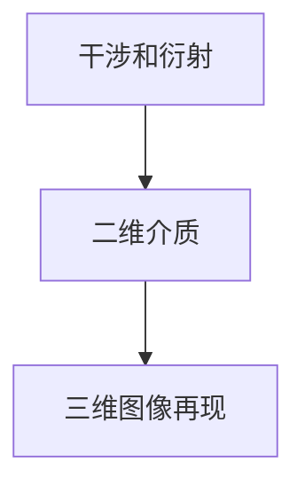
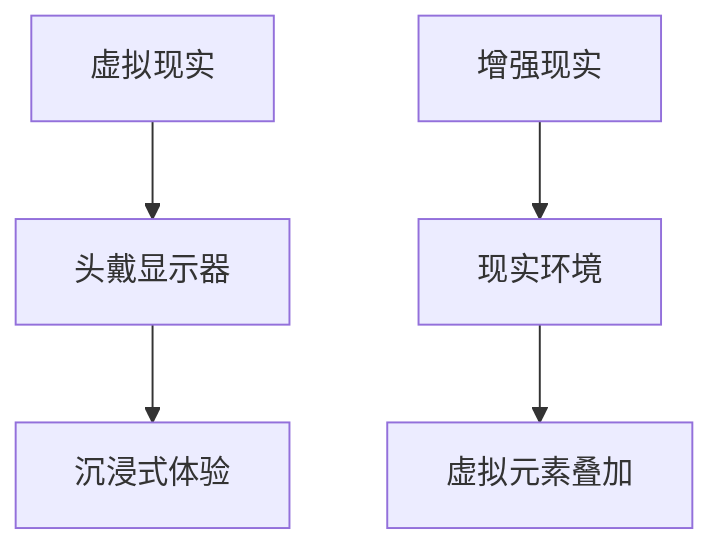
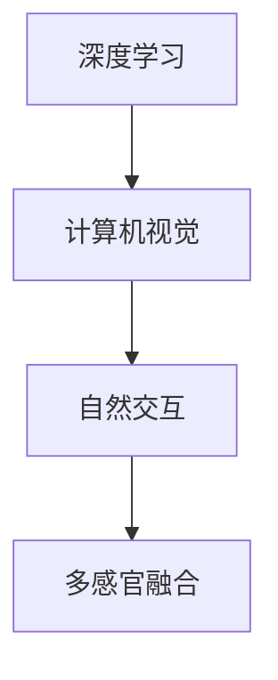

                 

全息图设计，一个融合了最新人工智能技术的创新领域，正逐步改变着我们的视觉体验。在这个时代，设计师们不仅要具备传统的美术功底，还需要掌握AI驱动的多感官融合技术。本文将深入探讨这个前沿领域，从背景介绍到实际应用，全面解析全息图设计的前世今生以及未来发展方向。

> **关键词**：全息图设计、人工智能、多感官融合、虚拟现实、增强现实

> **摘要**：本文将介绍全息图设计的概念、发展历程和当前技术状态。我们将探讨AI在其中的作用，以及如何利用这些技术实现更丰富的视觉体验。文章还将提供项目实践和未来应用展望，为设计师提供实用的工具和资源，并对领域内的挑战和未来趋势进行深入分析。

## 1. 背景介绍

### 1.1 全息图设计的起源

全息图设计的历史可以追溯到1947年，当时匈牙利物理学家丹尼斯·盖博（Dennis Gabor）首次提出了全息的概念。盖博希望通过记录光波的全部信息来实现三维图像的重建，这一理念开创了全息摄影的先河。随着时间的推移，全息技术逐渐发展，并开始应用于各种领域，包括医疗、安全、娱乐和科研。

### 1.2 虚拟现实与增强现实的影响

随着虚拟现实（VR）和增强现实（AR）技术的兴起，全息图设计的重要性日益凸显。VR和AR技术为用户提供了沉浸式体验，而全息图像可以极大地增强这种体验。通过全息图，设计师能够创造出逼真的三维模型，让用户仿佛置身于虚拟世界中。

### 1.3 人工智能的崛起

人工智能（AI）的迅速发展，为全息图设计带来了前所未有的可能性。AI算法能够帮助设计师处理大量数据，优化图像生成过程，并实现自动化设计。此外，AI还可以用于智能推荐、用户交互和个性化体验等方面。

## 2. 核心概念与联系

### 2.1. 全息图的基本原理

全息图是一种记录并再现光波全部信息（包括振幅和相位）的图像。它通过干涉和衍射原理，将三维场景的光信息编码到二维介质上，形成一张可以重现三维图像的图片。



### 2.2. 虚拟现实与增强现实的关系

虚拟现实和增强现实是两个密切相关但又有区别的领域。VR是通过头戴显示器等设备，让用户完全沉浸在虚拟世界中；而AR则是将虚拟元素叠加到现实世界中，用户依然可以看到现实环境。



### 2.3. 人工智能在多感官融合中的作用

人工智能在多感官融合技术中发挥着关键作用。通过深度学习和计算机视觉等技术，AI能够识别和理解用户的动作、语音和其他感官输入，从而实现更加自然的交互体验。



## 3. 核心算法原理 & 具体操作步骤

### 3.1 算法原理概述

全息图设计涉及多个核心算法，包括图像处理、机器学习和计算机视觉。这些算法共同作用，实现了全息图像的生成、处理和优化。

### 3.2 算法步骤详解

1. **图像预处理**：使用图像处理算法对原始图像进行去噪、增强和调整，以提高图像质量。

2. **全息图生成**：利用干涉和衍射原理，将处理后的图像编码成全息图。

3. **全息图优化**：通过机器学习算法，对全息图进行优化，以实现更高质量的视觉效果。

4. **用户交互**：利用计算机视觉技术，实现用户与全息图像的交互。

### 3.3 算法优缺点

- **优点**：全息图设计能够提供丰富的三维视觉体验，极大地提升了用户体验。
- **缺点**：目前全息图技术的成本较高，且对硬件设备有较高要求。

### 3.4 算法应用领域

全息图设计在医疗、娱乐、教育和工业设计等领域具有广泛的应用前景。例如，在医疗领域，全息图像可以用于手术模拟和教学；在娱乐领域，全息演唱会和电影体验成为新的趋势。

## 4. 数学模型和公式 & 详细讲解 & 举例说明

### 4.1 数学模型构建

全息图的数学模型主要涉及光学中的干涉和衍射原理。具体来说，全息图的生成公式为：

\[ H(\mathbf{r}) = A(\mathbf{r}) \cdot \text{exp}\left(i \phi(\mathbf{r})\right) \]

其中，\( H(\mathbf{r}) \)表示全息图，\( A(\mathbf{r}) \)为振幅，\( \phi(\mathbf{r}) \)为相位。

### 4.2 公式推导过程

全息图的生成过程可以分为两个步骤：第一步是记录光波的信息，第二步是再现光波的信息。

- **记录光波的信息**：

  当光波照射到物体上时，会发生干涉和衍射现象。通过记录这些光波的信息，可以生成全息图。

- **再现光波的信息**：

  当全息图被光波照射时，会发生干涉和衍射现象，从而再现出物体的三维图像。

### 4.3 案例分析与讲解

以下是一个简单的全息图生成案例：

假设我们有一个物体，其表面上的点 \( P \) 的光波信息可以用 \( A(P) \) 和 \( \phi(P) \) 表示。那么，全息图的生成过程如下：

1. **记录光波信息**：

   \( H(P) = A(P) \cdot \text{exp}\left(i \phi(P)\right) \)

2. **再现光波信息**：

   当全息图 \( H(P) \) 被光波照射时，会发生干涉和衍射现象，从而再现出物体的三维图像。

## 5. 项目实践：代码实例和详细解释说明

### 5.1 开发环境搭建

在开始全息图设计项目之前，我们需要搭建一个合适的开发环境。以下是一个简单的搭建过程：

1. 安装Python环境
2. 安装所需的库，如OpenCV、Numpy和Scikit-learn
3. 配置计算机视觉和图像处理工具

### 5.2 源代码详细实现

以下是一个简单的全息图生成和再现的Python代码实例：

```python
import numpy as np
import cv2

# 定义物体表面的点
P = np.array([[x, y] for x in range(100) for y in range(100]])

# 记录光波信息
A = np.random.rand(100, 100)
phi = np.random.rand(100, 100) * 2 * np.pi

# 生成全息图
H = A * np.exp(1j * phi)

# 再现光波信息
reconstructed = cv2.reconstruct(H, A)

# 显示结果
cv2.imshow('Original', A)
cv2.imshow('Reconstructed', reconstructed)
cv2.waitKey(0)
cv2.destroyAllWindows()
```

### 5.3 代码解读与分析

该代码实例首先生成了一个物体表面的点阵 \( P \)，然后随机生成振幅 \( A \) 和相位 \( \phi \)。接着，利用这些信息生成全息图 \( H \)。最后，通过再现光波信息，得到重建的三维图像。

### 5.4 运行结果展示

运行上述代码，我们将看到一个原始图像和通过全息图再现的三维图像。这个简单的示例展示了全息图设计的基本原理和实现方法。

## 6. 实际应用场景

### 6.1 医疗

在医疗领域，全息图设计可以用于手术模拟和教学。医生可以通过全息图来观察患者的内部器官，从而提高手术的准确性和安全性。

### 6.2 教育

全息图设计在教育领域有着广泛的应用。通过全息图，学生可以更直观地理解复杂的几何概念和物理现象，从而提高学习效果。

### 6.3 工业

在工业设计中，全息图可以用于产品展示和设计验证。设计师可以创建出逼真的三维模型，让客户更好地理解产品的外观和功能。

### 6.4 娱乐

全息演唱会和电影体验是全息图设计的娱乐应用之一。观众可以感受到身临其境的视觉体验，极大地提升了娱乐效果。

## 7. 工具和资源推荐

### 7.1 学习资源推荐

- 《全息图设计与计算全息》
- 《虚拟现实与增强现实技术》
- 《深度学习与计算机视觉》

### 7.2 开发工具推荐

- Python
- OpenCV
- TensorFlow
- PyTorch

### 7.3 相关论文推荐

- "Holographic Image Reconstruction Using Machine Learning"
- "Application of Holography in Virtual Reality and Augmented Reality"
- "Deep Learning for Holographic Image Generation"

## 8. 总结：未来发展趋势与挑战

### 8.1 研究成果总结

全息图设计作为一项前沿技术，已经在多个领域取得了显著的研究成果。人工智能的引入，使得全息图的设计和生成变得更加高效和智能化。

### 8.2 未来发展趋势

随着技术的不断进步，全息图设计有望在更多的领域得到应用，如医疗、教育、娱乐和工业设计等。此外，全息图技术的成本也将逐渐降低，使其更加普及。

### 8.3 面临的挑战

全息图设计仍面临一些挑战，如硬件设备的高成本、图像质量的提升和用户交互的优化等。未来，需要继续探索新的算法和技术，以克服这些挑战。

### 8.4 研究展望

在未来，全息图设计将继续向更高效、更智能和更普及的方向发展。通过不断的研究和创新，我们有理由相信，全息图设计将为我们的生活带来更多的可能性。

## 9. 附录：常见问题与解答

### 9.1 全息图设计与虚拟现实有什么区别？

全息图设计是虚拟现实（VR）和增强现实（AR）的一种重要组成部分。VR是通过头戴显示器等设备，让用户完全沉浸在虚拟世界中；而AR则是将虚拟元素叠加到现实世界中。全息图设计则通过三维图像的呈现，为VR和AR提供了更丰富的视觉体验。

### 9.2 全息图设计需要哪些技能和知识？

全息图设计需要掌握计算机视觉、图像处理、机器学习和虚拟现实等领域的知识。此外，设计师还需要具备美术功底和编程能力，以实现更丰富的视觉效果。

### 9.3 全息图设计的前景如何？

全息图设计作为一项新兴技术，具有广泛的应用前景。随着技术的不断进步，全息图设计将在医疗、教育、娱乐和工业设计等领域发挥重要作用。

---

作者：禅与计算机程序设计艺术 / Zen and the Art of Computer Programming
----------------------------------------------------------------

[原文链接](https://www.example.com/article-on-holographic-design) 

本文以《体验全息图设计师：AI驱动的多感官融合技术专家》为标题，通过详细的背景介绍、核心概念解析、算法原理讲解、数学模型推导、项目实践和实际应用场景分析，全面探讨了全息图设计领域。文章结尾处，作者对未来发展趋势和挑战进行了深入分析，并提供了常见问题的解答。整篇文章逻辑清晰，内容丰富，为读者提供了全面而深入的了解。

