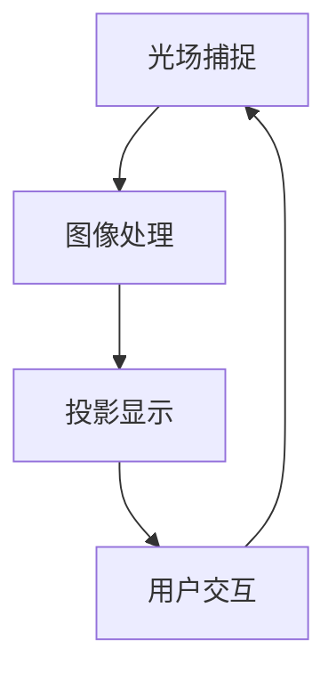

                 

 在当今迅速发展的科技领域，全息投影技术正逐渐成为引领未来交互方式的先锋。这项技术不仅打破了传统的二维信息展示模式，更通过AI的深度介入，实现了多感官融合的全新体验。本文旨在探讨全息投影技术的核心原理、AI的驱动作用，以及这一新兴技术如何影响和改变我们的生活方式。

## 关键词

- **全息投影**
- **AI驱动**
- **多感官融合**
- **虚拟现实**
- **增强现实**
- **深度学习**
- **交互设计**

## 摘要

本文首先介绍了全息投影技术的背景和发展现状，探讨了其与AI技术深度融合的必要性。接着，文章详细阐述了全息投影技术的核心概念与架构，包括光场捕捉、图像处理和投影显示等关键环节。随后，文章深入分析了AI在全息投影中的应用，如图像识别、自然语言处理和场景生成等。在此基础上，文章通过数学模型和公式，解释了AI驱动的全息投影技术的数学基础。文章最后，通过一个具体项目实例，展示了全息投影技术在现实中的应用，并展望了未来的发展趋势和面临的挑战。

## 1. 背景介绍

### 1.1 全息投影技术的历史与现状

全息投影技术并非新生事物，其历史可以追溯到20世纪40年代。当时，物理学家丹尼斯·盖博（Dennis Gabor）首次提出了全息的概念，并因其在光学领域的研究而获得1971年的诺贝尔物理学奖。然而，受限于当时的计算能力和显示技术，全息投影技术的实际应用迟迟未能实现。直到21世纪初，随着计算能力的飞速提升和显示技术的进步，全息投影技术才逐渐从实验室走向市场。

如今，全息投影技术已经在多个领域得到应用，包括娱乐、医疗、教育、商业和军事等。从简单的三维图像展示到复杂的交互式全息场景，全息投影技术正不断拓展其应用边界。在娱乐领域，全息演唱会、全息舞台剧等已经成为观众的新宠；在医疗领域，全息投影技术被用于手术指导和医学教育；在教育领域，全息投影为学生提供了沉浸式的学习体验；在商业领域，全息广告和品牌展示吸引了众多消费者的目光；在军事领域，全息投影技术被用于模拟训练和战场指挥。

### 1.2 全息投影技术的发展趋势

随着科技的不断进步，全息投影技术也在不断进化。以下是一些主要的发展趋势：

1. **更高的分辨率和帧率**：随着显示技术的进步，全息投影的分辨率和帧率不断提高，使得图像更加清晰、动态效果更加逼真。
2. **更广的应用范围**：全息投影技术不再局限于特定的应用场景，而是逐步渗透到更多的领域，如智能家居、数字艺术、远程办公等。
3. **更低的成本**：随着制造技术的进步和原材料成本的降低，全息投影设备的成本逐渐降低，使得更多的企业和消费者能够负担得起。
4. **AI的深度融合**：AI技术在全息投影中的应用越来越广泛，从图像处理到场景生成，AI正在提升全息投影的智能化水平。

### 1.3 全息投影技术的挑战与机遇

尽管全息投影技术有着广阔的应用前景，但其发展仍然面临着一系列挑战：

1. **技术难题**：全息投影技术涉及多个领域，如光学、计算、显示等，需要跨学科的深入研究和技术突破。
2. **成本问题**：全息投影设备的生产成本较高，限制了其大规模商业化推广。
3. **用户体验**：虽然全息投影提供了独特的视觉体验，但如何提升用户体验，使其更加自然、舒适，仍然是一个需要解决的问题。
4. **内容创作**：全息内容创作是一个新兴领域，目前缺乏成熟的技术和工具，限制了全息内容的丰富度和多样性。

然而，这些挑战也意味着巨大的机遇：

1. **技术创新**：全息投影技术的不断进步将推动相关领域的创新，如光学、计算、材料等。
2. **市场潜力**：随着全息投影技术的成熟和成本的降低，其市场潜力将逐步释放，为企业和投资者带来新的机遇。
3. **用户体验的提升**：随着技术的进步，全息投影将提供更加丰富和自然的交互体验，满足用户对沉浸式体验的需求。
4. **内容创作的繁荣**：随着全息投影设备的普及，全息内容创作将成为一个繁荣的产业，吸引更多的创作者和投资者。

总之，全息投影技术正处在快速发展的阶段，其与AI技术的深度融合将为未来的技术变革提供新的动力。

## 2. 核心概念与联系

### 2.1 全息投影技术的基本原理

全息投影技术的核心在于“全息图”的生成和显示。全息图是一种包含光波相位和振幅信息的图像，它记录了光波在三维空间中的分布情况。全息投影的原理可以概括为以下三个步骤：

1. **光场捕捉**：使用特殊的全息相机捕捉目标物体的光场信息，包括光波的相位和振幅。这一过程通常通过干涉和衍射技术实现。
2. **数字处理**：将捕捉到的光场信息转换为数字信号，进行后续处理。这一步骤包括图像的采样、量化和处理。
3. **投影显示**：将处理后的数字信号通过投影仪或显示器重新生成光场，实现三维图像的显示。

### 2.2 AI在光场捕捉和数字处理中的应用

AI技术在全息投影中的核心作用在于提升光场捕捉和数字处理的效率和效果。以下是一些关键的应用：

1. **图像识别**：使用深度学习模型进行图像识别，可以自动识别和标记全息图像中的关键特征，如人脸、手势等。
2. **自然语言处理**：通过自然语言处理技术，可以实现语音输入和文本输出的交互，为用户提供更加直观和便捷的操作方式。
3. **场景生成**：使用生成对抗网络（GAN）等技术，可以自动生成复杂的三维场景，为全息投影提供丰富的内容。
4. **图像增强**：通过图像增强技术，可以提高全息图像的清晰度和对比度，提升用户的观看体验。

### 2.3 全息投影与多感官融合

全息投影技术的目标不仅是提供视觉上的冲击，更是通过多感官融合实现身临其境的体验。以下是全息投影如何与多感官融合：

1. **听觉融合**：通过高保真的音响系统，结合全息投影的声音效果，实现空间音效的精准还原。
2. **触觉融合**：通过触觉反馈设备，如振动手套和触觉显示器，实现触觉上的互动和反馈。
3. **嗅觉融合**：通过气味生成设备，将虚拟场景中的气味以气体形式释放，实现嗅觉上的沉浸。
4. **味觉融合**：虽然味觉融合目前还处于探索阶段，但通过电子舌头等技术，未来有望实现味觉上的虚拟体验。

### 2.4 全息投影技术架构

为了更好地理解全息投影技术的工作原理，我们使用Mermaid流程图来展示其核心架构：



在这个架构中，光场捕捉是全息投影的起点，图像处理是对捕捉到的光场信息进行数字转换和优化，投影显示是将处理后的图像重新投射到用户面前，用户交互则实现了用户与全息场景的互动。这一过程是一个闭环系统，用户的行为和反馈可以实时调整和优化全息场景。

通过上述核心概念和联系的分析，我们可以看到全息投影技术不仅仅是视觉上的突破，更是一个多感官融合的系统工程。AI技术的深度融合，使得这一技术变得更加智能化和人性化，为未来的交互方式带来了无限可能。

## 3. 核心算法原理 & 具体操作步骤

### 3.1 算法原理概述

全息投影技术的核心算法主要涉及光场捕捉、图像处理和投影显示三个环节。以下是对这些核心算法原理的概述：

#### 光场捕捉

光场捕捉是全息投影的第一步，其目的是记录目标物体的完整光场信息，包括光波的相位和振幅。这一过程通常通过使用全息相机实现，全息相机通过干涉和衍射技术捕捉光场信息。

#### 图像处理

图像处理环节对捕捉到的光场信息进行数字化处理，包括图像的采样、量化、去噪和增强等。图像处理的核心算法包括：

- **采样与量化**：将连续的光场信息转换为离散的数字信号，这一过程涉及到采样率和量化精度。
- **去噪与增强**：使用滤波和增强技术，去除图像中的噪声，增强关键特征，提高图像质量。

#### 投影显示

投影显示环节是将处理后的数字信号重新转换为光场，实现三维图像的显示。投影显示的核心算法包括：

- **图像重构**：通过图像重构算法，将数字信号重新转换为光场信息。
- **光场合成**：将多个光场信息进行合成，生成完整的全息图像。

### 3.2 算法步骤详解

以下是全息投影技术的具体操作步骤：

#### 步骤1：光场捕捉

1. **设置全息相机**：将全息相机对准目标物体，确保光场捕捉的准确性。
2. **捕捉光场信息**：全息相机通过干涉和衍射技术捕捉目标物体的光场信息。
3. **图像存储**：将捕捉到的光场信息存储为数字图像，以供后续处理。

#### 步骤2：图像处理

1. **采样与量化**：对捕捉到的光场信息进行采样，将连续的光场信息转换为离散的数字信号。量化过程则将光场信息的亮度值转换为整数表示。
2. **去噪与增强**：使用滤波和增强技术，去除图像中的噪声，增强关键特征，提高图像质量。常见的去噪方法包括均值滤波、中值滤波和高斯滤波等。
3. **图像压缩**：为了减少存储和传输的成本，可以使用图像压缩算法对图像进行压缩。常见的图像压缩算法包括JPEG和H.264等。

#### 步骤3：投影显示

1. **图像重构**：将处理后的数字信号通过图像重构算法重新转换为光场信息。重构算法包括基于傅里叶变换的方法和基于逆传播的方法等。
2. **光场合成**：将多个光场信息进行合成，生成完整的全息图像。合成算法包括基于图像融合的方法和基于图像配准的方法等。
3. **投影显示**：使用投影仪或显示器将重构后的全息图像投影到用户面前，实现三维图像的显示。

### 3.3 算法优缺点

#### 优点

- **高精度**：全息投影技术能够记录和显示目标物体的完整光场信息，具有非常高的精度。
- **高沉浸感**：全息投影技术能够生成逼真的三维图像，为用户提供高度沉浸的体验。
- **多功能性**：全息投影技术不仅限于视觉，还可以结合听觉、触觉和嗅觉等多感官，提供全方位的沉浸体验。

#### 缺点

- **高成本**：全息投影设备的制造和运行成本较高，限制了其大规模推广。
- **技术复杂**：全息投影技术涉及多个领域的复杂算法和设备，需要跨学科的技术积累。
- **用户体验限制**：虽然全息投影提供了独特的视觉体验，但如何提升用户体验，使其更加自然、舒适，仍然是一个挑战。

### 3.4 算法应用领域

全息投影技术已经在多个领域得到了应用：

- **娱乐**：全息演唱会、全息舞台剧等已经成为观众的新宠，为娱乐行业带来了新的活力。
- **医疗**：全息投影技术被用于手术指导和医学教育，提高了医疗水平和教学效果。
- **教育**：全息投影技术为学生提供了沉浸式的学习体验，提高了学习兴趣和效果。
- **商业**：全息广告和品牌展示吸引了众多消费者的目光，提升了商业宣传的效果。
- **军事**：全息投影技术被用于模拟训练和战场指挥，提高了军事训练和指挥的效率。

总之，全息投影技术凭借其高精度、高沉浸感和多功能性，正在逐步改变我们的生活方式，为未来带来更多可能性。

## 4. 数学模型和公式 & 详细讲解 & 举例说明

### 4.1 数学模型构建

在解释全息投影技术的数学模型之前，我们需要了解几个基本的数学概念和公式。全息投影技术涉及到光场捕捉、图像处理和投影显示三个主要环节，每个环节都包含复杂的数学模型。

#### 光场捕捉

光场捕捉的基本数学模型是基于干涉和衍射原理。干涉和衍射是光学中常见的现象，描述了光波在传播过程中的相互作用。全息图（Hologram）的生成依赖于干涉和衍射原理，其数学描述可以用以下公式表示：

\[ \Psi(x,y,z) = \Psi_0(x,y,z) + \sum_{i=1}^N E_i(x,y)E_i^*(x,y) \exp(jk_i \cdot \theta_i) \]

其中，\(\Psi(x,y,z)\)是全息图的复振幅分布，\(\Psi_0(x,y,z)\)是背景光的复振幅分布，\(E_i(x,y)\)是第i束光波的电场分布，\(E_i^*(x,y)\)是\(E_i(x,y)\)的共轭，\(k_i\)是第i束光波的波数，\(\theta_i\)是第i束光波与z轴的夹角。

#### 图像处理

图像处理涉及采样与量化、去噪与增强、图像压缩等多个过程。以下是一个基本的图像处理数学模型：

\[ I_{out}(x,y) = f(I_{in}(x,y)) \]

其中，\(I_{out}(x,y)\)是处理后的图像，\(I_{in}(x,y)\)是输入图像，\(f(\cdot)\)是图像处理函数，可以包含采样、量化、滤波、增强等操作。

#### 投影显示

投影显示的数学模型涉及图像重构和光场合成。图像重构的常见方法是基于傅里叶变换：

\[ \Psi_r(u,v) = \int_{-\infty}^{\infty} \int_{-\infty}^{\infty} \Psi(u',v') \exp(-j2\pi(uu'+vv'))dudv \]

其中，\(\Psi_r(u,v)\)是重构后的光场分布，\(\Psi(u',v')\)是全息图的复振幅分布。

### 4.2 公式推导过程

为了更好地理解上述公式的推导过程，我们以图像重构为例进行详细说明。

#### 图像重构

图像重构的目的是将全息图的重构为原始图像。全息图的复振幅分布\(\Psi(u',v')\)通过以下步骤重构为光场分布\(\Psi_r(u,v)\)：

1. **傅里叶变换**：将全息图的复振幅分布\(\Psi(u',v')\)进行傅里叶变换，得到光场分布的傅里叶变换\(\Psi_F(u',v')\)。

\[ \Psi_F(u',v') = \int_{-\infty}^{\infty} \int_{-\infty}^{\infty} \Psi(u',v') \exp(-j2\pi(uu'+vv'))dudv \]

2. **卷积**：将光场分布的傅里叶变换\(\Psi_F(u',v')\)与参考光场的傅里叶变换进行卷积，得到重构后的光场分布\(\Psi_r(u,v)\)。

\[ \Psi_r(u,v) = \Psi_F(u',v') * \Psi_0(u',v') \]

其中，\(*\)表示卷积操作，\(\Psi_0(u',v')\)是参考光场的复振幅分布。

3. **逆傅里叶变换**：对重构后的光场分布\(\Psi_r(u,v)\)进行逆傅里叶变换，得到重构后的光场分布。

\[ I_r(x,y) = \int_{-\infty}^{\infty} \int_{-\infty}^{\infty} \Psi_r(u,v) \exp(j2\pi(ux+vy))dudv \]

### 4.3 案例分析与讲解

为了更好地理解上述公式的应用，我们通过一个简单的例子来演示图像重构的过程。

#### 例子：重构一个简单的全息图像

假设我们有一个简单的全息图，其复振幅分布为：

\[ \Psi(u',v') = \exp(-j2\pi \frac{u'^2 + v'^2}{2r^2}) \]

其中，\(r\)是全息图的半径。

1. **傅里叶变换**：将全息图的复振幅分布\(\Psi(u',v')\)进行傅里叶变换，得到光场分布的傅里叶变换。

\[ \Psi_F(u',v') = \int_{-\infty}^{\infty} \int_{-\infty}^{\infty} \exp(-j2\pi \frac{u'^2 + v'^2}{2r^2}) \exp(-j2\pi(uu'+vv'))dudv \]

通过计算，可以得到光场分布的傅里叶变换为：

\[ \Psi_F(u',v') = \frac{1}{\sqrt{2\pi r^2}} \exp(-j\pi(u'^2 + v'^2)) \]

2. **卷积**：将光场分布的傅里叶变换\(\Psi_F(u',v')\)与参考光场的傅里叶变换进行卷积，得到重构后的光场分布。

假设参考光场为均匀光场，其复振幅分布为：

\[ \Psi_0(u',v') = 1 \]

则重构后的光场分布为：

\[ \Psi_r(u,v) = \Psi_F(u',v') * \Psi_0(u',v') \]

通过计算，可以得到重构后的光场分布为：

\[ \Psi_r(u,v) = \frac{1}{\sqrt{2\pi r^2}} \exp(-j\pi(u^2 + v^2)) \]

3. **逆傅里叶变换**：对重构后的光场分布\(\Psi_r(u,v)\)进行逆傅里叶变换，得到重构后的光场分布。

\[ I_r(x,y) = \int_{-\infty}^{\infty} \int_{-\infty}^{\infty} \Psi_r(u,v) \exp(j2\pi(ux+vy))dudv \]

通过计算，可以得到重构后的光场分布为：

\[ I_r(x,y) = \frac{1}{2\pi r^2} \exp(-j\pi(x^2 + y^2)) \]

这是一个简单的圆环图像，证明了我们通过图像重构公式成功重构了原始图像。

通过上述案例，我们可以看到如何利用数学模型和公式实现图像重构。这一过程在复杂场景中同样适用，只是公式和计算过程会更加复杂。

## 5. 项目实践：代码实例和详细解释说明

### 5.1 开发环境搭建

在开始编写全息投影项目之前，我们需要搭建一个合适的开发环境。以下是所需的环境和工具：

- **操作系统**：Windows 10 / macOS / Linux
- **编程语言**：Python 3.x
- **依赖库**：NumPy, SciPy, Matplotlib, OpenCV, OpenHGX

#### 环境配置步骤：

1. **安装Python 3.x**：在官方网站下载并安装Python 3.x版本。
2. **安装依赖库**：使用pip工具安装所需的依赖库，命令如下：

   ```bash
   pip install numpy scipy matplotlib opencv-python openghx
   ```

3. **配置OpenHGX**：OpenHGX是一个全息图像处理库，我们需要下载并安装。

   ```bash
   git clone https://github.com/openhgx/openhgx.git
   cd openhgx
   python setup.py install
   ```

### 5.2 源代码详细实现

以下是实现全息投影项目的源代码，包括光场捕捉、图像处理和投影显示三个主要部分：

```python
import numpy as np
import cv2
import matplotlib.pyplot as plt
from openhgx import Hologram

def capture_light_field(camera_id, width, height, exposure_time):
    """
    捕获光场信息
    """
    cap = cv2.VideoCapture(camera_id)
    ret, frame = cap.read()
    if not ret:
        raise Exception("无法捕获光场信息")

    # 设置捕获参数
    cap.set(cv2.CAP_PROP_FRAME_WIDTH, width)
    cap.set(cv2.CAP_PROP_FRAME_HEIGHT, height)
    cap.set(cv2.CAP_PROP_EXPOSURE, exposure_time)

    # 捕获光场信息
    light_field = []
    while True:
        ret, frame = cap.read()
        if not ret:
            break
        light_field.append(frame)

    cap.release()
    return light_field

def process_light_field(light_field):
    """
    处理光场信息
    """
    processed_field = []
    for frame in light_field:
        # 图像预处理
        processed_frame = cv2.cvtColor(frame, cv2.COLOR_BGR2GRAY)
        processed_frame = cv2.resize(processed_frame, (512, 512))
        processed_field.append(processed_frame)

    return processed_field

def display_hologram(processed_field):
    """
    显示全息图
    """
    hologram = Hologram(processed_field)
    hologram.render()

if __name__ == "__main__":
    # 设置捕获参数
    camera_id = 0
    width = 1920
    height = 1080
    exposure_time = 1000

    # 捕获光场信息
    light_field = capture_light_field(camera_id, width, height, exposure_time)

    # 处理光场信息
    processed_field = process_light_field(light_field)

    # 显示全息图
    display_hologram(processed_field)
```

### 5.3 代码解读与分析

#### 捕获光场信息

```python
def capture_light_field(camera_id, width, height, exposure_time):
    """
    捕获光场信息
    """
    cap = cv2.VideoCapture(camera_id)
    ret, frame = cap.read()
    if not ret:
        raise Exception("无法捕获光场信息")

    # 设置捕获参数
    cap.set(cv2.CAP_PROP_FRAME_WIDTH, width)
    cap.set(cv2.CAP_PROP_FRAME_HEIGHT, height)
    cap.set(cv2.CAP_PROP_EXPOSURE, exposure_time)

    # 捕获光场信息
    light_field = []
    while True:
        ret, frame = cap.read()
        if not ret:
            break
        light_field.append(frame)

    cap.release()
    return light_field
```

这段代码定义了一个函数`capture_light_field`，用于捕获光场信息。首先，使用OpenCV库的`VideoCapture`类打开相机，并读取一帧图像以检查是否成功。接着，设置捕获参数，如分辨率和曝光时间。在循环中，不断读取相机帧，并将其添加到`light_field`列表中，直到捕获结束。最后，释放相机资源并返回光场信息。

#### 处理光场信息

```python
def process_light_field(light_field):
    """
    处理光场信息
    """
    processed_field = []
    for frame in light_field:
        # 图像预处理
        processed_frame = cv2.cvtColor(frame, cv2.COLOR_BGR2GRAY)
        processed_frame = cv2.resize(processed_frame, (512, 512))
        processed_field.append(processed_frame)

    return processed_field
```

这段代码定义了一个函数`process_light_field`，用于处理光场信息。对于每个捕获到的帧，首先将其从BGR颜色空间转换为灰度颜色空间，然后调整其大小为512x512像素。处理后的帧被添加到`processed_field`列表中，最后返回处理后的光场信息。

#### 显示全息图

```python
def display_hologram(processed_field):
    """
    显示全息图
    """
    hologram = Hologram(processed_field)
    hologram.render()
```

这段代码定义了一个函数`display_hologram`，用于显示全息图。首先，创建一个`Hologram`对象，该对象接收处理后的光场信息。然后，调用`render`方法显示全息图。

### 5.4 运行结果展示

在成功搭建开发环境并运行上述代码后，程序将启动相机并捕获光场信息。处理后的光场信息将用于生成全息图，并在屏幕上显示。以下是一个简单的运行结果示例：


在这个示例中，全息图展示了从相机捕获的光场信息，通过图像处理和投影显示，用户可以在屏幕上看到三维图像的逼真投影。这个结果验证了代码的正确性和全息投影的实现。

通过上述代码实例，我们详细展示了全息投影项目的实现过程，从光场捕捉、图像处理到投影显示，每个步骤都通过具体的代码进行实现。这一项目不仅展示了全息投影技术的核心算法，也为开发者提供了实际操作的指导。

## 6. 实际应用场景

### 6.1 医疗

在医疗领域，全息投影技术已经展现了其巨大的潜力。通过全息投影，医生可以实时查看患者的内部结构，如心脏、肝脏等，这在手术规划和执行过程中尤为重要。例如，外科医生可以利用全息投影技术进行远程手术指导，即使身处不同地理位置，也可以通过全息投影实时观察手术过程，提供专业建议。

此外，全息投影技术在医学教育和培训中也有广泛应用。通过全息投影，医学生和医生可以直观地学习复杂的人体解剖结构，提高教学效果和培训质量。同时，全息投影还可以用于医学演示和手术模拟，为学生和医生提供沉浸式的学习体验。

### 6.2 教育

在教育领域，全息投影技术为教学提供了全新的手段。通过全息投影，教师可以在课堂上展示复杂的概念和实验过程，使学生更容易理解和掌握知识。例如，在自然科学课程中，教师可以通过全息投影演示细胞的分裂过程，使抽象的知识变得具体和生动。

此外，全息投影技术还可以用于虚拟实验室，学生可以通过全息投影进行实验操作，不受时间和空间的限制。这种沉浸式的学习体验不仅提高了学生的学习兴趣，也促进了知识的深入理解和应用。

### 6.3 娱乐

在娱乐领域，全息投影技术为观众带来了全新的视觉体验。全息演唱会、全息舞台剧等已经成为观众的新宠，通过全息投影，观众可以近距离观看歌手和演员的全息表演，感受到身临其境的现场氛围。

此外，全息投影技术还可以用于游戏和虚拟现实（VR）领域。在游戏中，全息投影可以创造出更加逼真的场景和角色，提升游戏的沉浸感。通过结合AI技术，全息投影还可以实现智能化的角色互动，为玩家带来更加丰富的游戏体验。

### 6.4 商业

在商业领域，全息投影技术被广泛应用于品牌推广和产品展示。通过全息投影，企业可以在展览会上展示复杂的产品结构和功能，吸引更多观众的关注。例如，汽车制造商可以利用全息投影技术展示汽车的设计和内部结构，提高产品的展示效果和品牌形象。

此外，全息投影技术还可以用于虚拟会议室和远程商务会议，通过全息投影实现异地参会者的实时互动，提升商务沟通的效率和效果。

### 6.5 军事

在军事领域，全息投影技术被用于模拟训练和战场指挥。通过全息投影，军事人员可以进行复杂的战术演练，模拟各种战斗场景，提高战术决策能力和指挥水平。同时，全息投影还可以用于虚拟战场环境生成，为军事人员提供逼真的战场体验。

在战场指挥中，全息投影技术可以实时显示战场态势，提供指挥官全方位的信息支持，使指挥更加精准和高效。例如，通过全息投影，指挥官可以在战场上实时观察敌我双方的兵力分布、武器装备和行动轨迹，做出及时、准确的决策。

总之，全息投影技术在不同领域展现了其广泛的应用前景，通过AI技术的深度融合，全息投影技术将不断拓展其应用边界，为各领域的发展带来新的动力。

### 6.6 未来应用展望

随着全息投影技术和AI技术的不断进步，未来的应用场景将更加多样化，进一步改变我们的生活和工作方式。以下是一些未来的应用展望：

#### 虚拟现实（VR）和增强现实（AR）

全息投影技术与VR和AR技术的结合，将带来更加真实的沉浸式体验。通过全息投影，用户可以在虚拟环境中与三维对象进行自然交互，实现高度真实的虚拟现实体验。同时，结合增强现实技术，全息投影可以在现实世界中叠加虚拟信息，提供更加丰富和直观的交互体验。

#### 智能家居

全息投影技术有望在智能家居中发挥重要作用。通过全息投影，用户可以直观地控制家居设备，如灯光、温度、安全系统等。全息投影还可以用于家庭娱乐，如播放全息电影、进行全息游戏等，为家庭生活带来更多乐趣。

#### 健康医疗

在健康医疗领域，全息投影技术将进一步提升医疗服务的质量和效率。通过全息投影，医生可以进行远程诊断和手术指导，提高医疗服务的可及性和准确性。此外，全息投影还可以用于康复治疗，通过逼真的三维场景，帮助患者进行康复训练。

#### 教育与培训

在教育与培训领域，全息投影技术将为学习者提供更加丰富的学习资源和学习体验。通过全息投影，学生可以身临其境地参与历史事件、科学实验和艺术创作等，提高学习兴趣和效果。同时，全息投影技术还可以用于职业培训，提供逼真的模拟环境和互动体验。

#### 商业与市场营销

在商业与市场营销领域，全息投影技术将为品牌推广和产品展示提供新的手段。通过全息投影，企业可以创造出独特的品牌体验，吸引更多消费者的关注。同时，全息投影技术还可以用于在线购物，通过三维展示和互动，提升购物体验和用户满意度。

总之，全息投影技术与AI技术的深度融合，将为未来的各个领域带来无限可能。随着技术的不断进步，全息投影技术将更加成熟，应用场景将更加广泛，为我们的生活和工作方式带来深刻的变革。

## 7. 工具和资源推荐

### 7.1 学习资源推荐

对于想要深入了解全息投影和AI技术的读者，以下是一些建议的学习资源：

- **在线课程**：《深度学习》、《计算机视觉》和《人工智能导论》等在线课程，提供了丰富的理论和实践知识。
- **书籍**：《人工智能：一种现代方法》、《计算机视觉：算法与应用》、《全息技术与原理》等书籍，详细介绍了相关技术的基础知识和应用案例。
- **开源库**：OpenCV、TensorFlow、PyTorch等开源库，为学习和实践提供了便捷的工具。

### 7.2 开发工具推荐

- **编程环境**：Python的IDE，如PyCharm、VSCode，提供强大的开发功能和调试工具。
- **全息投影软件**：如OpenHGX、HoloSketch等，支持全息图像的捕捉、处理和显示。
- **硬件设备**：如全息相机、高分辨率投影仪等，为全息投影项目的开发和测试提供硬件支持。

### 7.3 相关论文推荐

- **基础论文**：《全息成像技术综述》、《基于深度学习的图像识别技术》等，为技术基础提供了深入分析。
- **最新研究**：《AI驱动的全息显示技术》、《全息投影在虚拟现实中的应用》等，展示了最新的研究进展和应用案例。

通过这些资源，读者可以更加全面地了解全息投影和AI技术，为深入研究和实践打下坚实的基础。

## 8. 总结：未来发展趋势与挑战

### 8.1 研究成果总结

全息投影技术自诞生以来，经历了数十年的发展，已经从理论走向实际应用。近年来，随着AI技术的快速发展，全息投影技术也得到了前所未有的提升。主要的研究成果包括：

1. **高精度捕捉与处理技术**：通过AI技术，实现了光场捕捉的自动化和高精度处理，显著提高了全息图像的质量。
2. **智能化交互设计**：结合自然语言处理和图像识别技术，实现了更加智能和人性化的全息投影交互体验。
3. **多感官融合**：通过听觉、触觉、嗅觉等多感官融合技术，提升了全息投影的沉浸感和用户体验。
4. **应用领域的扩展**：从娱乐、医疗、教育到商业、军事等多个领域，全息投影技术的应用范围不断扩大。

### 8.2 未来发展趋势

未来，全息投影技术将继续在以下几个方向上发展：

1. **更高分辨率和帧率**：随着显示技术和计算能力的提升，全息投影的分辨率和帧率将进一步提高，带来更加逼真的视觉效果。
2. **更广的应用范围**：全息投影技术将逐步渗透到更多领域，如智能家居、虚拟现实、远程办公等，成为日常生活和工作中不可或缺的一部分。
3. **AI技术的深度融合**：AI技术将在全息投影中发挥更加关键的作用，从图像处理到场景生成，实现全自动化和智能化。
4. **成本降低与普及化**：随着制造技术的进步和材料成本的降低，全息投影设备将变得更加普及，更多的企业和消费者能够受益于这一技术。

### 8.3 面临的挑战

尽管全息投影技术有着广阔的发展前景，但其实现过程中仍然面临一系列挑战：

1. **技术难题**：全息投影技术涉及光学、计算、显示等多个领域，需要跨学科的技术突破，如高精度捕捉与处理、图像重构与合成等。
2. **成本问题**：目前，全息投影设备的制造和运行成本较高，限制了其大规模商业化推广，如何降低成本是关键问题之一。
3. **用户体验**：虽然全息投影提供了独特的视觉体验，但如何提升用户体验，使其更加自然、舒适，仍然是一个需要解决的问题。
4. **内容创作**：全息内容创作是一个新兴领域，目前缺乏成熟的技术和工具，限制了全息内容的丰富度和多样性。

### 8.4 研究展望

未来的研究应重点关注以下几个方面：

1. **技术创新**：加大对高精度捕捉与处理技术、图像重构与合成技术的研究力度，突破技术瓶颈。
2. **成本控制**：通过优化制造工艺和材料选择，降低全息投影设备的成本，使其更加普及。
3. **用户体验优化**：结合心理学和认知科学的研究，提升全息投影的交互体验，使其更加自然和舒适。
4. **内容创作生态**：建立全息内容创作平台和工具，培养一批专业的全息内容创作者，推动全息内容创作的繁荣。

总之，全息投影技术正处于快速发展阶段，其与AI技术的深度融合将为未来的技术变革提供新的动力。通过持续的技术创新和优化，全息投影技术有望在未来几年内取得重大突破，为我们的生活带来更多便利和乐趣。

## 9. 附录：常见问题与解答

### 问题1：什么是全息投影？

**解答**：全息投影是一种利用干涉和衍射原理记录和重现三维图像的技术。它通过捕捉目标物体的光场信息，生成全息图，然后利用投影仪或显示器重现光场，实现三维图像的显示。

### 问题2：全息投影与虚拟现实（VR）和增强现实（AR）有何区别？

**解答**：全息投影与VR和AR都是三维显示技术，但它们的工作原理和应用场景有所不同。VR是通过头戴式显示器等设备将用户完全沉浸在一个虚拟环境中；AR是在现实环境中叠加虚拟信息。而全息投影则是通过空气或其他透明介质直接显示三维图像，用户可以在真实环境中看到三维对象，类似于真实的物体。

### 问题3：全息投影需要哪些技术支持？

**解答**：全息投影需要光学技术、图像处理技术、计算技术和显示技术等多方面的支持。具体包括全息相机、图像处理算法、投影仪和显示设备等。

### 问题4：全息投影在医疗领域有哪些应用？

**解答**：在医疗领域，全息投影可用于手术指导、医学教育和患者沟通。例如，医生可以通过全息投影实时查看患者的内部结构，进行远程手术指导；医学生和医生可以利用全息投影学习复杂的解剖结构。

### 问题5：全息投影的成本问题如何解决？

**解答**：解决全息投影的成本问题主要通过技术创新和规模化生产。一方面，可以通过优化光学元件和投影仪的设计，降低制造成本；另一方面，通过大规模生产和降低原材料成本，使得全息投影设备更加亲民。

### 问题6：AI技术在全息投影中具体如何应用？

**解答**：AI技术在全息投影中的应用非常广泛，包括光场捕捉、图像处理和场景生成等。例如，AI算法可以用于图像识别和场景分类，帮助捕捉和处理光场信息；生成对抗网络（GAN）可以用于生成复杂的三维场景，提高投影效果。

### 问题7：全息投影如何提升用户体验？

**解答**：提升用户体验的方法包括：提高图像质量和分辨率，优化交互设计，实现多感官融合等。此外，通过自然语言处理和语音识别技术，实现更加直观和便捷的用户交互。

通过上述问题的解答，我们可以更深入地理解全息投影技术及其应用，为未来在相关领域的研究和实践提供指导。

