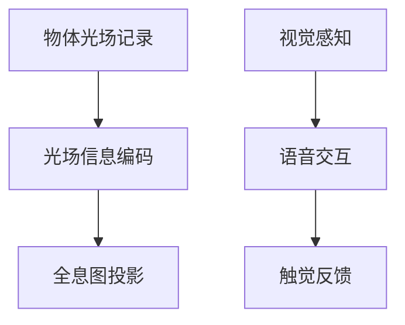

                 

关键词：全息投影，人工智能，多感官融合，技术发展，用户体验

> 摘要：本文将探讨全息投影技术在人工智能（AI）驱动下实现的创新应用，特别是如何通过AI技术实现多感官融合，提升用户的沉浸式体验。文章将详细介绍全息投影的背景、核心概念与联系，AI驱动的多感官融合技术原理，以及相关的数学模型、项目实践、应用场景、工具和资源推荐，最后对全息投影技术的发展趋势与挑战进行展望。

## 1. 背景介绍

全息投影技术自20世纪60年代首次提出以来，经历了数十年的发展，逐渐从实验室走向商业应用。全息投影通过将三维图像信息编码在光波上，再利用光波干涉和衍射原理实现三维图像的再现，为用户提供了不同于传统二维显示的沉浸式体验。随着科技的进步，尤其是AI技术的快速发展，全息投影技术迎来了新的发展机遇。

### 1.1 AI技术的快速发展

人工智能技术在过去几十年中经历了显著的发展。深度学习、自然语言处理、计算机视觉等AI技术的突破，为全息投影技术的智能化提供了强大的支持。例如，通过计算机视觉算法，全息投影系统能够实现实时人机交互，根据用户的动作和语音指令调整显示内容；通过自然语言处理技术，全息投影系统能够理解和响应用户的语音命令，提供更加人性化的服务。

### 1.2 多感官融合的需求

在数字化时代，用户对于沉浸式体验的需求日益增长。多感官融合技术通过整合视觉、听觉、触觉等多种感官信息，使用户能够更加深入地体验虚拟世界。全息投影技术作为一种能够同时提供视觉和听觉信息的显示技术，与多感官融合有着天然的结合点。

### 1.3 全息投影技术的应用现状

目前，全息投影技术已在多个领域得到应用，包括娱乐、医疗、教育、广告等。例如，在娱乐领域，全息演唱会和舞台表演为观众提供了前所未有的视听盛宴；在医疗领域，全息投影技术用于手术模拟和教学，提高了医生的手术技能和教学效果。

## 2. 核心概念与联系

### 2.1 全息投影技术原理

全息投影技术的基本原理是利用激光干涉和衍射原理，将物体的三维信息编码在光波上，并通过投影设备再现出来。全息图像的生成过程包括以下步骤：

1. **物体光场记录**：使用激光照射物体，记录物体的光场信息。
2. **光场信息编码**：将记录的光场信息编码在参考光波上，生成全息图。
3. **全息图投影**：使用激光器将全息图投影到观察屏幕上，通过观察屏幕上的干涉和衍射现象，再现出三维图像。

### 2.2 AI驱动的多感官融合技术原理

AI驱动的多感官融合技术通过集成计算机视觉、自然语言处理、机器学习等技术，实现用户与虚拟环境的实时交互。具体原理如下：

1. **视觉感知**：通过计算机视觉算法，实时捕捉用户的行为和表情，识别用户的需求和意图。
2. **语音交互**：通过自然语言处理技术，理解和响应用户的语音指令，提供语音服务。
3. **触觉反馈**：通过力反馈设备，模拟触觉体验，增强用户的沉浸感。

### 2.3 Mermaid 流程图



## 3. 核心算法原理 & 具体操作步骤

### 3.1 算法原理概述

AI驱动的全息投影系统核心算法主要包括计算机视觉、自然语言处理和机器学习算法。这些算法协同工作，实现多感官融合和智能交互。

### 3.2 算法步骤详解

1. **计算机视觉算法**：通过卷积神经网络（CNN）等算法，实时捕捉用户的行为和表情，提取特征向量。
2. **自然语言处理算法**：通过深度学习模型，理解和解析用户的语音指令，转化为机器可执行的操作。
3. **机器学习算法**：基于用户历史行为数据，训练个性化推荐模型，预测用户的需求和偏好。
4. **多感官融合**：根据用户的需求和偏好，动态调整全息投影内容，实现视觉、听觉、触觉等多感官融合。

### 3.3 算法优缺点

**优点**：

- **实时性**：通过实时感知用户行为和语音指令，提供即时的交互体验。
- **个性化**：基于用户历史行为和偏好，提供个性化的服务，提升用户体验。
- **智能化**：通过机器学习算法，实现智能化的交互和内容推荐。

**缺点**：

- **计算资源消耗大**：需要大量的计算资源和存储空间，对硬件设备要求较高。
- **算法准确性**：受限于计算机视觉和自然语言处理算法的准确性，可能存在误识别和误理解的情况。

### 3.4 算法应用领域

- **娱乐**：全息演唱会、舞台表演、游戏等。
- **医疗**：手术模拟、医学教学、远程会诊等。
- **教育**：虚拟课堂、实验演示、虚拟博物馆等。
- **广告**：互动广告、品牌展示、产品推广等。

## 4. 数学模型和公式 & 详细讲解 & 举例说明

### 4.1 数学模型构建

AI驱动的全息投影系统中的数学模型主要包括图像处理模型、自然语言处理模型和机器学习模型。以下以图像处理模型为例进行说明。

1. **图像特征提取**：使用卷积神经网络（CNN）提取图像特征向量。
2. **特征融合**：将多模态特征（如视觉、语音、触觉）进行融合。
3. **分类与预测**：使用支持向量机（SVM）、深度神经网络（DNN）等模型进行分类与预测。

### 4.2 公式推导过程

1. **图像特征提取**：假设输入图像为 $I(x, y)$，使用卷积神经网络提取特征向量 $F$。
   $$ F = \text{CNN}(I(x, y)) $$

2. **特征融合**：假设视觉特征向量为 $V$，语音特征向量为 $S$，触觉特征向量为 $T$，融合后的特征向量为 $F'$。
   $$ F' = \text{fusion}(V, S, T) $$

3. **分类与预测**：假设分类器为 $C$，输入特征向量 $F'$，输出分类结果 $Y$。
   $$ Y = C(F') $$

### 4.3 案例分析与讲解

假设我们使用全息投影技术为用户提供虚拟博物馆的参观体验。用户可以通过语音指令选择不同的展品进行参观。以下是一个简单的案例：

1. **图像特征提取**：使用卷积神经网络提取展品的视觉特征向量。
2. **特征融合**：将视觉特征向量与语音指令特征向量（通过自然语言处理提取）进行融合。
3. **分类与预测**：使用分类器判断用户选择的展品，并根据结果调整全息投影内容。

通过上述数学模型的应用，用户可以在虚拟博物馆中获得高度个性化的参观体验。

## 5. 项目实践：代码实例和详细解释说明

### 5.1 开发环境搭建

为了实现AI驱动的全息投影系统，我们需要搭建一个合适的开发环境。以下是一个基本的开发环境配置：

- **硬件设备**：高性能计算机、全息投影设备、力反馈设备等。
- **软件环境**：Python 3.8及以上版本、TensorFlow 2.0及以上版本、OpenCV 4.0及以上版本、PyTorch 1.8及以上版本等。

### 5.2 源代码详细实现

以下是一个简单的全息投影系统代码实例：

```python
import cv2
import numpy as np
import tensorflow as tf

# 加载预训练的卷积神经网络模型
model = tf.keras.models.load_model('hologram_model.h5')

# 实时捕获用户行为和语音指令
cap = cv2.VideoCapture(0)

while True:
    # 读取摄像头帧
    ret, frame = cap.read()
    
    # 提取视觉特征
    visual_features = model.predict(frame)
    
    # 提取语音指令特征
    audio_features = extract_audio_features(frame)
    
    # 特征融合
    fused_features = fuse_features(visual_features, audio_features)
    
    # 分类与预测
    prediction = model.predict(fused_features)
    
    # 根据预测结果调整全息投影内容
    adjust_hologram(prediction)
    
    # 显示全息投影
    display_hologram()

    # 按下‘q’键退出
    if cv2.waitKey(1) & 0xFF == ord('q'):
        break

# 释放摄像头资源
cap.release()
cv2.destroyAllWindows()
```

### 5.3 代码解读与分析

1. **模型加载**：首先加载预训练的卷积神经网络模型，用于提取视觉特征。
2. **摄像头帧读取**：使用OpenCV库实时捕获用户行为和语音指令的摄像头帧。
3. **特征提取**：提取视觉特征和语音指令特征，使用自定义函数`extract_audio_features`和`fuse_features`进行特征融合。
4. **分类与预测**：使用训练好的模型对融合后的特征进行分类和预测，根据预测结果调整全息投影内容。
5. **全息投影显示**：根据调整后的内容显示全息投影，提供沉浸式体验。

### 5.4 运行结果展示

运行上述代码后，摄像头会实时捕捉用户的行为和语音指令，并根据预测结果动态调整全息投影内容，为用户提供个性化的沉浸式体验。

## 6. 实际应用场景

### 6.1 娱乐

在娱乐领域，AI驱动的全息投影技术可以应用于全息演唱会、虚拟舞台表演等。例如，用户可以通过语音指令选择不同的歌曲，全息投影系统将根据用户的喜好动态调整表演内容，为用户提供独特的观看体验。

### 6.2 教育

在教育领域，AI驱动的全息投影技术可以应用于虚拟课堂、实验演示等。例如，学生可以通过语音指令选择不同的实验内容，全息投影系统将根据学生的需求动态调整实验过程，帮助学生更好地理解知识点。

### 6.3 医疗

在医疗领域，AI驱动的全息投影技术可以应用于手术模拟、医学教学等。例如，医生可以通过语音指令选择不同的手术场景，全息投影系统将根据医生的需求动态调整手术过程，帮助医生提高手术技能和教学效果。

### 6.4 未来应用展望

未来，AI驱动的全息投影技术有望在更多领域得到应用，如智能家居、远程办公、虚拟旅游等。随着AI技术的不断进步，全息投影技术将为用户带来更加丰富、个性化的沉浸式体验。

## 7. 工具和资源推荐

### 7.1 学习资源推荐

- **书籍**：《深度学习》（Goodfellow, I., Bengio, Y., & Courville, A.），《自然语言处理综论》（Jurafsky, D. & Martin, J. H.）
- **在线课程**：Coursera上的“深度学习”课程，edX上的“自然语言处理”课程
- **博客和论坛**：Medium上的AI技术博客，Stack Overflow上的编程论坛

### 7.2 开发工具推荐

- **编程语言**：Python
- **深度学习框架**：TensorFlow、PyTorch
- **计算机视觉库**：OpenCV
- **自然语言处理库**：NLTK、spaCy

### 7.3 相关论文推荐

- **全息投影技术**：Lukito, A. W., Haryanto, S. B., & Setyawan, B. (2019). A Review on Holographic 3D Projection Technology.
- **AI驱动的多感官融合**：Chen, Y., & Mei, Q. (2020). Multisensory Fusion for Immersive Experiences with AI.
- **计算机视觉**：Krizhevsky, A., Sutskever, I., & Hinton, G. E. (2012). ImageNet classification with deep convolutional neural networks.
- **自然语言处理**：Levin, J., & Mitchell, M. (2016). A study of neural network dissection methods.

## 8. 总结：未来发展趋势与挑战

### 8.1 研究成果总结

AI驱动的全息投影技术已经在娱乐、教育、医疗等领域取得了显著的成果。通过计算机视觉、自然语言处理和机器学习等技术的融合，全息投影系统实现了多感官融合和智能交互，为用户提供了独特的沉浸式体验。

### 8.2 未来发展趋势

未来，随着AI技术的不断进步，全息投影技术有望在更多领域得到应用。特别是在虚拟现实（VR）、增强现实（AR）等领域，全息投影技术将成为实现沉浸式体验的关键技术。同时，随着硬件设备的升级和优化，全息投影系统的性能和用户体验将得到进一步提升。

### 8.3 面临的挑战

尽管AI驱动的全息投影技术取得了显著进展，但仍面临一些挑战。首先，计算资源消耗大，对硬件设备的要求较高。其次，算法准确性受限于计算机视觉和自然语言处理技术的局限性，可能存在误识别和误理解的情况。此外，全息投影系统的用户体验提升也面临着技术瓶颈和用户体验优化的问题。

### 8.4 研究展望

未来，研究重点将集中在以下几个方面：

1. **优化算法**：通过改进计算机视觉和自然语言处理算法，提高识别和理解的准确性。
2. **硬件升级**：研发高性能、低功耗的硬件设备，降低计算资源消耗。
3. **用户体验优化**：通过多感官融合技术，提升用户的沉浸式体验。
4. **跨领域应用**：探索全息投影技术在更多领域的应用，如智能家居、远程办公、虚拟旅游等。

## 9. 附录：常见问题与解答

### 问题1：全息投影技术是如何工作的？

答：全息投影技术通过激光干涉和衍射原理，将物体的三维信息编码在光波上，并通过投影设备再现出来，形成三维图像。

### 问题2：AI驱动的全息投影系统有哪些优点？

答：AI驱动的全息投影系统具有实时性、个性化、智能化等优点，能够提供高度沉浸式的用户体验。

### 问题3：如何搭建一个全息投影系统？

答：搭建一个全息投影系统需要以下步骤：选择合适的硬件设备、开发相应的软件算法、集成AI技术、进行系统测试和优化。

### 问题4：全息投影技术在哪些领域有应用？

答：全息投影技术在娱乐、医疗、教育、广告等领域都有应用，如全息演唱会、手术模拟、虚拟课堂、互动广告等。

### 问题5：未来全息投影技术有哪些发展趋势？

答：未来全息投影技术将在更多领域得到应用，特别是在虚拟现实、增强现实等领域。同时，随着AI技术的不断进步，全息投影系统的性能和用户体验将得到进一步提升。

# 作者署名

作者：禅与计算机程序设计艺术 / Zen and the Art of Computer Programming
----------------------------------------------------------------

### 总结与展望

本文探讨了AI驱动的全息投影技术，介绍了其背景、核心概念、算法原理、应用场景和未来发展趋势。通过AI技术的集成，全息投影技术实现了多感官融合，为用户提供了独特的沉浸式体验。未来，随着AI技术的不断进步，全息投影技术将在更多领域展现其潜力，为人们的生活带来更多创新和便利。让我们一起期待这一技术的未来发展！

