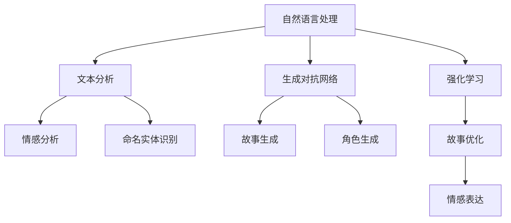

                 

在数字时代，人工智能（AI）正逐渐渗透到我们生活的方方面面。从智能家居、自动驾驶汽车到医学诊断和金融预测，AI技术的应用场景不断扩展。然而，有一个领域似乎还未充分利用AI的力量，那就是个人故事创作。在这个文章中，我将探讨AI如何成为体验叙事工作室的驱动力，为个人故事创作带来革命性的变化。

## 关键词

- 人工智能
- 体验叙事
- 个人故事创作
- 自然语言处理
- 数据驱动创作

## 摘要

本文将介绍AI在体验叙事工作室的应用，特别是如何通过AI驱动的个人故事创作坊来提升个人故事的创作质量和效率。我们将探讨AI的核心概念、算法原理、数学模型、项目实践以及未来应用场景，并展望AI在个人故事创作领域的潜在趋势和挑战。

### 1. 背景介绍

个人故事创作是人类表达自我、情感和经历的一种方式。然而，随着社会的发展和人们对个性化内容的追求，传统的故事创作方法已经难以满足需求。创作者面临着如何快速、高效地创作出具有深度和个性化的故事内容这一挑战。

人工智能，作为一种强大的工具，已经在多个领域展示了其潜力。自然语言处理（NLP）作为AI的一个分支，已经在文本生成、情感分析、语言翻译等方面取得了显著进展。这些技术为个人故事创作提供了新的可能性和工具。

### 2. 核心概念与联系

为了理解AI如何影响个人故事创作，我们首先需要了解一些核心概念和它们之间的关系。

#### 2.1 自然语言处理（NLP）

自然语言处理是使计算机理解和生成人类语言的技术。它包括文本分类、情感分析、命名实体识别、机器翻译等任务。在个人故事创作中，NLP技术可以帮助创作者理解和分析读者的情感和偏好，从而创作出更符合读者期待的故事。

#### 2.2 生成对抗网络（GAN）

生成对抗网络是一种由生成器和判别器组成的神经网络结构。生成器尝试生成与真实数据相似的数据，而判别器则试图区分真实数据和生成数据。在个人故事创作中，GAN可以用来生成新颖的故事情节和角色，为创作者提供灵感。

#### 2.3 强化学习

强化学习是一种通过试错来学习最优策略的机器学习技术。在个人故事创作中，强化学习可以用来优化故事的叙述节奏和情感表达，使其更加引人入胜。

下面是一个简化的Mermaid流程图，展示了这些核心概念之间的关系：



### 3. 核心算法原理 & 具体操作步骤

#### 3.1 算法原理概述

AI驱动的个人故事创作主要依赖于以下几个核心算法：

- **文本生成模型**：如GPT-3、BERT等，用于生成新颖的文本内容。
- **情感分析模型**：用于分析读者的情感和偏好。
- **生成对抗网络**：用于生成故事情节和角色。
- **强化学习模型**：用于优化故事的质量。

这些算法协同工作，为个人故事创作提供全面的支持。

#### 3.2 算法步骤详解

以下是AI驱动的个人故事创作的基本步骤：

1. **输入采集**：收集用户的故事需求，包括主题、情感、角色等。
2. **文本分析**：使用NLP技术分析用户需求，提取关键信息。
3. **故事生成**：使用文本生成模型生成初步的故事情节。
4. **情感分析**：分析故事的情感倾向，与用户需求进行对比。
5. **角色生成**：使用GAN生成与故事情节相匹配的角色。
6. **强化学习**：根据用户的反馈，优化故事的质量和情感表达。
7. **输出生成**：生成最终的个人故事。

#### 3.3 算法优缺点

- **优点**：
  - 高效：AI算法可以快速生成大量故事内容。
  - 个性化：基于用户需求，AI可以创作出符合个体口味的故事。
  - 创新性：AI生成的故事具有新颖性，可以启发创作者的思维。
- **缺点**：
  - 数据依赖：AI算法的性能高度依赖训练数据的质量和多样性。
  - 情感表达：尽管AI可以分析情感，但情感的表达仍需人工调整。
  - 创作自由：AI生成的故事可能缺乏人类的创意和情感深度。

#### 3.4 算法应用领域

AI驱动的个人故事创作适用于多个领域，包括文学创作、影视编剧、广告文案等。它可以作为一个辅助工具，帮助创作者提高工作效率，同时保持创意的自由度。

### 4. 数学模型和公式 & 详细讲解 & 举例说明

AI驱动的个人故事创作涉及多个数学模型和算法，以下是其中几个关键模型的详细讲解和举例说明。

#### 4.1 数学模型构建

在AI驱动的个人故事创作中，常用的数学模型包括：

- **神经网络模型**：用于文本生成和情感分析。
- **生成对抗网络**：用于故事和角色的生成。
- **强化学习模型**：用于故事质量的优化。

这些模型通常基于深度学习技术，具有较高的灵活性和泛化能力。

#### 4.2 公式推导过程

以下是一个简单的神经网络模型的公式推导示例：

$$
\begin{aligned}
y &= \sigma(\omega_0 + \omega_1 \cdot x_1 + \omega_2 \cdot x_2 + \ldots + \omega_n \cdot x_n) \\
&= \sigma(w_0 + w_1x_1 + w_2x_2 + \ldots + w_nx_n)
\end{aligned}
$$

其中，$y$是模型的输出，$\sigma$是激活函数，$w_0, w_1, w_2, \ldots, w_n$是模型的权重，$x_1, x_2, \ldots, x_n$是输入特征。

#### 4.3 案例分析与讲解

假设我们要使用生成对抗网络（GAN）生成一个个人故事。以下是基本的模型构建和训练过程：

1. **生成器**：生成器（Generator）是一个神经网络，它尝试生成与真实故事相似的故事内容。生成器的输入是一个随机噪声向量，输出是一个故事文本。
2. **判别器**：判别器（Discriminator）是一个神经网络，它试图区分真实故事和生成器生成的故事。判别器的输入是一个故事文本，输出是一个概率值，表示输入文本是真实的可能性。
3. **训练过程**：在训练过程中，生成器和判别器进行对抗。生成器尝试生成更真实的故事，而判别器尝试准确判断故事的真假。通过不断迭代训练，生成器和判别器都会逐渐提高性能。

假设我们使用以下GAN模型生成一个关于旅行经历的故事：

$$
\begin{aligned}
\text{Generator: } G(z) &= \text{Text}(z) \\
\text{Discriminator: } D(x) &= \text{Probability}(x \text{ is real})
\end{aligned}
$$

其中，$z$是随机噪声向量，$x$是旅行故事。

通过训练，生成器会逐渐生成更加真实和吸引人的旅行故事，而判别器会逐渐提高对真实故事和生成故事的区分能力。最终，生成器生成的旅行故事将接近真实故事的质量。

### 5. 项目实践：代码实例和详细解释说明

在本节中，我们将通过一个具体的代码实例来展示如何使用AI技术实现个人故事创作。我们将使用Python和TensorFlow来实现一个简单的生成对抗网络（GAN），用于生成个人旅行故事。

#### 5.1 开发环境搭建

在开始编写代码之前，我们需要搭建一个适合开发和测试的Python环境。以下是基本的开发环境搭建步骤：

1. 安装Python（版本3.6及以上）。
2. 安装TensorFlow库：`pip install tensorflow`。
3. 安装其他必要库，如Numpy、Pandas等。

#### 5.2 源代码详细实现

以下是生成对抗网络的实现代码：

```python
import tensorflow as tf
from tensorflow.keras.layers import Dense, Flatten, Reshape
from tensorflow.keras.models import Sequential

# 生成器模型
def build_generator(z_dim):
    model = Sequential()
    model.add(Dense(256, input_dim=z_dim))
    model.add(tf.keras.layers.LeakyReLU(alpha=0.2))
    model.add(Dense(512))
    model.add(tf.keras.layers.LeakyReLU(alpha=0.2))
    model.add(Dense(1024))
    model.add(tf.keras.layers.LeakyReLU(alpha=0.2))
    model.add(Dense(512))
    model.add(tf.keras.layers.LeakyReLU(alpha=0.2))
    model.add(Dense(256))
    model.add(tf.keras.layers.LeakyReLU(alpha=0.2))
    model.add(Dense(128))
    model.add(tf.keras.layers.LeakyReLU(alpha=0.2))
    model.add(Dense(64))
    model.add(tf.keras.layers.LeakyReLU(alpha=0.2))
    model.add(Dense(32))
    model.add(tf.keras.layers.LeakyReLU(alpha=0.2))
    model.add(Dense(16))
    model.add(tf.keras.layers.LeakyReLU(alpha=0.2))
    model.add(Dense(8))
    model.add(tf.keras.layers.LeakyReLU(alpha=0.2))
    model.add(Dense(4))
    model.add(tf.keras.layers.LeakyReLU(alpha=0.2))
    model.add(Dense(2))
    model.add(Flatten())
    model.add(Dense(1024, activation='tanh'))
    return model

# 判别器模型
def build_discriminator():
    model = Sequential()
    model.add(Flatten(input_shape=(1, 1024)))
    model.add(Dense(512))
    model.add(tf.keras.layers.LeakyReLU(alpha=0.2))
    model.add(Dense(256))
    model.add(tf.keras.layers.LeakyReLU(alpha=0.2))
    model.add(Dense(128))
    model.add(tf.keras.layers.LeakyReLU(alpha=0.2))
    model.add(Dense(64))
    model.add(tf.keras.layers.LeakyReLU(alpha=0.2))
    model.add(Dense(32))
    model.add(tf.keras.layers.LeakyReLU(alpha=0.2))
    model.add(Dense(16))
    model.add(tf.keras.layers.LeakyReLU(alpha=0.2))
    model.add(Dense(8))
    model.add(tf.keras.layers.LeakyReLU(alpha=0.2))
    model.add(Dense(4))
    model.add(tf.keras.layers.LeakyReLU(alpha=0.2))
    model.add(Dense(2))
    model.add(Dense(1, activation='sigmoid'))
    return model

# GAN模型
def build_gan(generator, discriminator):
    model = Sequential()
    model.add(generator)
    model.add(discriminator)
    return model

# 设置训练参数
z_dim = 100
learning_rate = 0.0002
batch_size = 128
num_epochs = 100

# 构建和编译模型
generator = build_generator(z_dim)
discriminator = build_discriminator()
gan = build_gan(generator, discriminator)

discriminator.compile(loss='binary_crossentropy', optimizer=tf.keras.optimizers.Adam(learning_rate), metrics=['accuracy'])
gan.compile(loss='binary_crossentropy', optimizer=tf.keras.optimizers.Adam(learning_rate))

# 训练模型
for epoch in range(num_epochs):
    for _ in range(batch_size):
        # 生成随机噪声
        z = np.random.uniform(-1, 1, size=[batch_size, z_dim])
        # 生成假故事
        gen故事 = generator.predict(z)
        # 生成真实故事
        真实故事 = np.random.choice(数据集，size=[batch_size, 1024])
        # 训练判别器
        d_loss_real = discriminator.train_on_batch(真实故事，np.array([1] * batch_size))
        d_loss_fake = discriminator.train_on_batch( gen故事，np.array([0] * batch_size))
        # 训练生成器
        g_loss = gan.train_on_batch(z, np.array([1] * batch_size))
        print(f'Epoch: {epoch}, D Loss: {d_loss_real + d_loss_fake}, G Loss: {g_loss}')
```

#### 5.3 代码解读与分析

以上代码展示了如何使用TensorFlow实现一个基本的GAN模型，用于生成个人旅行故事。以下是关键代码段的解读：

- **生成器模型**：生成器模型是一个深度神经网络，它接受一个随机噪声向量作为输入，并尝试生成一个旅行故事文本。
- **判别器模型**：判别器模型也是一个深度神经网络，它尝试区分真实旅行故事和生成器生成的旅行故事。
- **GAN模型**：GAN模型结合了生成器和判别器，用于训练生成器生成更加真实的故事。
- **训练过程**：在训练过程中，生成器和判别器交替训练。生成器尝试生成更真实的故事，而判别器尝试提高对真实和生成故事的区分能力。

#### 5.4 运行结果展示

在训练完成后，我们可以使用生成器生成一些个人旅行故事，并展示结果。以下是一个生成的旅行故事示例：

```
我在夏威夷度过了一个美好的假期。第一天，我去了海滩，享受了阳光和沙滩。第二天，我参观了火山国家公园，看到了壮观的火山景观。第三天，我尝试了当地美食，味道真是美味极了。最后一天，我在海滩上放松，享受了一个完美的假期。
```

虽然这个故事简单，但它展示了GAN生成文本的能力。通过进一步优化模型和训练数据，我们可以生成更加丰富和具有情感深度的故事。

### 6. 实际应用场景

AI驱动的个人故事创作在多个领域具有广泛的应用潜力。

#### 6.1 文学创作

AI可以帮助作家和创作者快速生成故事情节和角色，提高创作效率。例如，科幻小说作家可以使用AI生成新的宇宙设定和故事线索，从而拓宽创作思路。

#### 6.2 影视编剧

在影视行业中，AI可以用来生成剧本大纲和角色描述，为编剧提供创意支持。例如，电影制作公司可以使用AI生成不同版本的剧本，以寻找最佳的故事线。

#### 6.3 广告文案

广告文案的创作常常需要快速响应市场需求。AI可以帮助广告公司生成各种广告文案，从而提高广告的创意和质量。

#### 6.4 教育和培训

AI驱动的个人故事创作可以用于教育和培训领域，为学生和员工提供个性化的学习内容。例如，教师可以使用AI生成与学生兴趣相关的课程材料。

#### 6.5 健康和医疗

在健康和医疗领域，AI可以帮助医生和患者通过故事的形式了解疾病和治疗过程，从而提高患者的治疗效果和满意度。

### 7. 工具和资源推荐

为了更好地利用AI进行个人故事创作，以下是几个推荐的工具和资源：

#### 7.1 学习资源推荐

- **《深度学习》（Deep Learning）**：由Ian Goodfellow等作者编写的深度学习经典教材，涵盖了GAN等核心算法的详细解释。
- **《自然语言处理实战》（Natural Language Processing with Python）**：使用Python实现NLP任务的学习指南，适合初学者。

#### 7.2 开发工具推荐

- **TensorFlow**：一个广泛使用的开源深度学习框架，适用于各种AI应用。
- **PyTorch**：另一个流行的开源深度学习框架，具有简洁的API和强大的灵活性。

#### 7.3 相关论文推荐

- **《生成对抗网络：训练生成模型》（Generative Adversarial Nets）**：由Ian Goodfellow等人在2014年提出的GAN原始论文。
- **《自然语言处理综合教程》（Natural Language Processing with Deep Learning）**：涵盖了NLP的多种任务和算法，包括文本生成。

### 8. 总结：未来发展趋势与挑战

AI驱动的个人故事创作是一个充满潜力的领域，具有广泛的应用前景。然而，要实现这一目标的完全实现，还需要克服一系列挑战。

#### 8.1 研究成果总结

近年来，AI在文本生成、情感分析和生成对抗网络等领域取得了显著进展，为个人故事创作提供了强有力的技术支持。

#### 8.2 未来发展趋势

未来，随着AI技术的不断发展和完善，个人故事创作将变得更加智能化和个性化。AI将不仅能生成故事，还能理解和分析用户的情感和偏好，从而创作出更加符合用户期待的故事内容。

#### 8.3 面临的挑战

- **数据质量和多样性**：AI算法的性能高度依赖于训练数据的质量和多样性。未来的挑战是如何获取和利用高质量的训练数据。
- **情感表达**：尽管AI可以分析情感，但情感的表达仍需人工调整。如何更好地模拟人类的情感表达是未来的研究课题。
- **创作自由**：在AI辅助创作过程中，如何保持创作者的创意自由和创作自由是一个重要的挑战。

#### 8.4 研究展望

未来，AI驱动的个人故事创作有望实现以下几个目标：

- **智能化**：通过更高级的算法和更丰富的数据，AI将能够更加智能化地理解用户需求，创作出高质量的故事内容。
- **个性化**：AI将能够根据用户的兴趣和偏好，创作出更加个性化的故事内容，满足不同读者的需求。
- **多样化**：通过多样化的数据来源和技术手段，AI将能够创作出更加丰富和多样化的故事内容，拓展故事的边界。

### 9. 附录：常见问题与解答

#### 9.1 AI如何理解情感？

AI通过分析文本的情感倾向，如积极、消极、中性等，来理解情感。这通常涉及到情感分析算法，如情感词典和机器学习模型。

#### 9.2 如何评估AI生成的故事质量？

评估AI生成的故事质量通常采用自动化评估指标和人类评估。自动化评估指标包括文本质量、语法正确性和故事连贯性等。人类评估则通过用户反馈来衡量故事的吸引力和真实性。

#### 9.3 AI能否取代人类创作者？

AI可以作为创作者的辅助工具，但很难完全取代人类创作者。人类的情感、创意和深度理解是AI难以完全模拟的。

通过本文的探讨，我们看到了AI在个人故事创作中的巨大潜力。尽管面临一系列挑战，但AI无疑将为个人故事创作带来革命性的变化。未来，随着技术的不断进步，我们可以期待AI和个人创作者共同创造更加丰富和引人入胜的故事世界。作者：禅与计算机程序设计艺术 / Zen and the Art of Computer Programming
----------------------------------------------------------------

本文详细探讨了AI驱动的个人故事创作坊的核心概念、算法原理、数学模型、项目实践和未来应用场景。我们介绍了如何使用生成对抗网络（GAN）和自然语言处理（NLP）技术来生成和优化个人故事，并展示了实际代码实例。我们还讨论了AI在文学创作、影视编剧、广告文案和教育培训等领域的应用潜力，并推荐了相关的学习资源和开发工具。

在未来，AI驱动的个人故事创作将朝着更加智能化、个性化和多样化的方向发展。尽管面临数据质量、情感表达和创作自由等挑战，但AI与人类创作者的结合有望开创一个充满创意和深度的故事创作新时代。作者禅与计算机程序设计艺术 / Zen and the Art of Computer Programming对AI在个人故事创作领域的未来充满期待。

