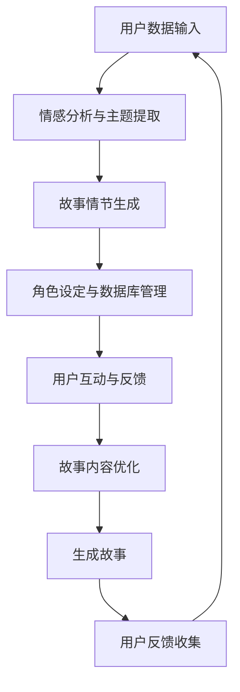

                 

 在人工智能（AI）飞速发展的今天，AI不仅在科研、医疗、金融等领域展现出巨大的潜力，更在文化创意产业中崭露头角。特别是在个人故事创作领域，AI正以其独特的算法和数据处理能力，改变着人类叙事的方式。本文旨在探讨AI在个人故事创作中的应用，通过介绍一个具体的案例——体验叙事工作室，来展示AI驱动的个人故事创作坊是如何运作的。

> **关键词**：人工智能、个人故事创作、体验叙事、数据驱动、叙事算法、故事生成

> **摘要**：本文首先介绍了人工智能在个人故事创作中的应用背景和核心概念，然后通过一个具体的案例——体验叙事工作室，详细阐述了AI驱动的个人故事创作坊的运作机制、算法原理、数学模型、项目实践和未来应用。通过本文的阅读，读者可以全面了解AI在个人故事创作领域的潜力和挑战。

## 1. 背景介绍

在过去的几十年里，个人故事创作一直是人类文化的重要组成部分。无论是口述故事、文学作品，还是电影、电视剧，个人故事都在传递着人类的生活经验、情感和价值观。然而，随着数字化时代的到来，传统的故事创作方式面临着前所未有的挑战。一方面，内容创作的速度和质量难以满足快速变化的市场需求；另一方面，个体创作者面临着资源有限、创作成本高昂的问题。

正是在这样的背景下，人工智能（AI）技术开始崭露头角。AI凭借其强大的数据处理能力和智能算法，可以为个人故事创作提供全新的解决方案。首先，AI可以通过自然语言处理（NLP）技术，自动分析大量的文本数据，提取出故事的潜在模式和情感线索。其次，AI可以利用机器学习（ML）算法，生成新颖的故事情节和角色设定，甚至可以模仿特定风格和语调。最后，AI可以通过用户互动和反馈，不断优化故事创作过程，提高作品的质量和用户满意度。

### 1.1 传统故事创作面临的挑战

1. **创作速度和效率**：传统故事创作依赖于个人的创造力和灵感，往往需要较长的创作周期。在数字时代，市场变化迅速，用户需求多样化，传统创作方式难以满足快速响应的需求。

2. **创作资源限制**：个人创作者通常面临创作资源（如时间、资金、人力等）的限制，难以进行大规模的故事创作实验。

3. **内容同质化**：随着内容创作的增多，市场上出现了大量相似或重复的内容，用户难以区分和选择。

4. **用户参与度低**：传统故事创作往往缺乏与用户的互动，导致用户参与度低，难以形成用户黏性。

### 1.2 AI技术在故事创作中的应用潜力

1. **高效的内容生成**：AI可以快速生成大量故事内容，提高创作速度和效率。

2. **个性化的故事创作**：通过分析用户数据，AI可以为不同用户生成个性化的故事，提高用户满意度。

3. **创新的故事形式**：AI可以生成新颖的情节和角色，推动故事创作的形式创新。

4. **用户互动和反馈**：AI可以实时分析用户反馈，优化创作过程，提高作品质量。

### 1.3 体验叙事工作室的案例

体验叙事工作室是一个利用AI技术驱动的个人故事创作平台，旨在为用户提供定制化的故事创作体验。通过收集和分析用户的个人数据、兴趣爱好、情感状态等，工作室的AI算法可以生成与用户高度相关的故事。同时，工作室还提供了丰富的互动功能，如用户反馈、故事修改等，让用户参与到故事创作过程中。

## 2. 核心概念与联系

为了更好地理解AI在个人故事创作中的应用，我们需要先介绍一些核心概念和原理，以及它们之间的联系。

### 2.1 自然语言处理（NLP）

自然语言处理是AI技术中的重要分支，旨在使计算机能够理解、处理和生成人类自然语言。在个人故事创作中，NLP技术主要用于分析和生成文本。具体来说，NLP技术可以用于以下方面：

1. **情感分析**：通过分析文本内容，判断文本的情感倾向（如正面、负面、中性）。
2. **主题提取**：从大量文本中提取出核心主题和关键信息。
3. **文本生成**：根据给定的主题或信息，生成新的文本内容。

### 2.2 机器学习（ML）

机器学习是AI技术的核心，通过训练模型，使计算机能够从数据中学习并做出决策。在个人故事创作中，ML算法主要用于生成故事情节、角色设定等。常见的ML算法包括：

1. **生成对抗网络（GAN）**：通过生成器和判别器的对抗训练，生成高质量的故事内容。
2. **递归神经网络（RNN）**：适用于处理序列数据，可以生成连贯的故事情节。
3. **变压器（Transformer）**：一种基于注意力机制的模型，可以捕捉文本中的长距离依赖关系。

### 2.3 数据库和知识图谱

数据库和知识图谱是存储和管理知识的重要工具。在个人故事创作中，数据库和知识图谱可以用于存储角色信息、故事情节、用户数据等。通过知识图谱的构建，可以建立角色之间的关系，实现故事内容的一致性和连贯性。

### 2.4 用户互动和反馈

用户互动和反馈是优化故事创作过程的重要环节。通过收集用户的反馈和评价，AI算法可以不断调整和优化故事内容，提高用户满意度。

### 2.5 Mermaid 流程图

为了更直观地展示AI驱动的个人故事创作坊的运作机制，我们可以使用Mermaid流程图来描述各核心概念之间的联系。



### 2.6 AI驱动的故事创作坊运作流程

1. **用户数据输入**：用户通过体验叙事工作室的界面，输入个人数据，如兴趣爱好、情感状态等。
2. **情感分析与主题提取**：AI算法分析用户数据，提取情感倾向和主题信息。
3. **故事情节生成**：基于情感分析和主题提取，AI生成故事情节。
4. **角色设定与数据库管理**：AI为故事中的角色设定属性，并将故事情节和角色信息存储到数据库中。
5. **用户互动与反馈**：用户可以查看和修改故事内容，提供反馈。
6. **故事内容优化**：基于用户反馈，AI不断优化故事内容。
7. **生成故事**：最终生成与用户高度相关的个人故事。
8. **用户反馈收集**：收集用户对故事的反馈，用于后续的优化。

通过上述流程，体验叙事工作室实现了AI驱动的个人故事创作，为用户提供了全新的故事体验。

## 3. 核心算法原理 & 具体操作步骤

### 3.1 算法原理概述

在体验叙事工作室中，AI驱动的故事创作主要依赖于自然语言处理（NLP）、机器学习（ML）和数据库管理技术。以下是对这些核心算法原理的概述：

1. **情感分析与主题提取**：
   - **原理**：通过使用NLP技术，对用户的文本输入进行分析，提取出情感倾向和主题信息。
   - **实现**：使用情感分析模型（如VADER、TextBlob等）和主题模型（如LDA、LSTM等）。

2. **故事情节生成**：
   - **原理**：基于用户的情感和主题信息，生成与用户高度相关的故事情节。
   - **实现**：采用生成对抗网络（GAN）、递归神经网络（RNN）或变压器（Transformer）等ML算法。

3. **角色设定与数据库管理**：
   - **原理**：为故事中的角色设定属性，并将故事情节和角色信息存储到数据库中。
   - **实现**：使用知识图谱和数据库管理系统（如Neo4j、MongoDB等）。

4. **用户互动与反馈**：
   - **原理**：通过用户的互动和反馈，优化故事创作过程。
   - **实现**：采用用户界面（UI）和反馈机制（如评分、评论等）。

### 3.2 算法步骤详解

1. **用户数据输入**：
   - **步骤**：用户通过体验叙事工作室的界面，输入个人数据，如兴趣爱好、情感状态等。
   - **技术**：使用前端技术（如HTML、CSS、JavaScript等）搭建用户界面。

2. **情感分析与主题提取**：
   - **步骤**：AI算法分析用户数据，提取情感倾向和主题信息。
   - **技术**：使用自然语言处理（NLP）库（如NLTK、spaCy等）和情感分析模型（如VADER、TextBlob等）。

3. **故事情节生成**：
   - **步骤**：基于情感分析和主题提取，AI生成故事情节。
   - **技术**：使用机器学习（ML）算法（如GAN、RNN、Transformer等）和文本生成库（如GPT-2、BERT等）。

4. **角色设定与数据库管理**：
   - **步骤**：AI为故事中的角色设定属性，并将故事情节和角色信息存储到数据库中。
   - **技术**：使用知识图谱（如Neo4j、RDF等）和数据库管理系统（如Neo4j、MongoDB等）。

5. **用户互动与反馈**：
   - **步骤**：用户可以查看和修改故事内容，提供反馈。
   - **技术**：使用用户界面（UI）和反馈机制（如评分、评论等）。

6. **故事内容优化**：
   - **步骤**：基于用户反馈，AI不断优化故事内容。
   - **技术**：使用机器学习（ML）算法和自然语言处理（NLP）技术。

7. **生成故事**：
   - **步骤**：最终生成与用户高度相关的个人故事。
   - **技术**：使用文本生成库（如GPT-2、BERT等）。

8. **用户反馈收集**：
   - **步骤**：收集用户对故事的反馈，用于后续的优化。
   - **技术**：使用反馈机制（如评分、评论等）和数据分析工具（如Tableau、Python等）。

### 3.3 算法优缺点

**优点**：

1. **高效的内容生成**：AI可以快速生成大量故事内容，提高创作速度和效率。
2. **个性化的故事创作**：通过分析用户数据，AI可以为不同用户生成个性化的故事。
3. **创新的故事形式**：AI可以生成新颖的情节和角色，推动故事创作的形式创新。
4. **用户互动和反馈**：AI可以实时分析用户反馈，优化创作过程，提高作品质量。

**缺点**：

1. **数据质量和准确性**：用户数据的准确性和完整性直接影响算法的效果。
2. **创作质量和创意**：AI生成的作品可能缺乏人类的创意和深度。
3. **用户隐私问题**：用户数据的收集和使用可能涉及隐私问题。
4. **技术门槛**：开发和维护AI驱动的个人故事创作系统需要较高的技术能力。

### 3.4 算法应用领域

1. **文学作品创作**：AI可以生成诗歌、小说、剧本等文学作品。
2. **游戏剧情设计**：AI可以生成游戏剧情，为玩家提供个性化的游戏体验。
3. **媒体内容创作**：AI可以生成新闻、广告、报告等媒体内容。
4. **个人故事创作**：AI可以生成与用户高度相关的个人故事，为用户提供定制化的叙事体验。

## 4. 数学模型和公式 & 详细讲解 & 举例说明

在AI驱动的个人故事创作过程中，数学模型和公式起着至关重要的作用。它们不仅帮助我们理解和描述AI算法的工作原理，还可以用于优化和评估算法的性能。本章节将详细讲解一些核心的数学模型和公式，并通过具体的例子来说明它们的应用。

### 4.1 数学模型构建

#### 4.1.1 情感分析模型

情感分析是NLP领域的一个重要分支，用于判断文本的情感倾向。一个基本的情感分析模型可以表示为：

$$
\text{Sentiment}(x) = f(\text{Text Feature Vector}(x))
$$

其中，$x$表示输入的文本数据，$\text{Text Feature Vector}(x)$是将文本数据转换为特征向量，$f$是一个情感分类函数，通常使用分类器来实现，如支持向量机（SVM）、随机森林（RF）等。

#### 4.1.2 生成对抗网络（GAN）

生成对抗网络（GAN）是一种用于生成数据的强大模型，由生成器（Generator）和判别器（Discriminator）组成。生成器的目标是最小化生成数据与真实数据之间的差异，而判别器的目标是最小化被生成数据误导的概率。

生成器 $G(z)$ 的损失函数可以表示为：

$$
L_G(z) = -\mathbb{E}_{z \sim p_z(z)}[\log(D(G(z)))]
$$

判别器 $D(x)$ 的损失函数可以表示为：

$$
L_D(x) = -\mathbb{E}_{x \sim p_{\text{data}}(x)}[\log(D(x))] - \mathbb{E}_{z \sim p_z(z)}[\log(1 - D(G(z))]
$$

其中，$z$ 是噪声向量，$p_z(z)$ 是噪声分布，$p_{\text{data}}(x)$ 是真实数据分布。

#### 4.1.3 主题模型

主题模型（如LDA）用于从大量文本数据中提取出潜在的主题。LDA的模型假设每个文档是由多个主题的混合生成，每个主题是由多个词语的混合生成。

LDA的概率模型可以表示为：

$$
p(\text{document}, \text{topic}) = \frac{p(\text{topic}|\text{document})p(\text{document})}{\sum_{\text{all topics}} p(\text{topic}|\text{document})p(\text{document})}
$$

$$
p(\text{word}|\text{topic}) = \frac{c_{\text{word}}(\text{topic})}{\sum_{\text{all words}} c_{\text{word}}(\text{topic})}
$$

其中，$c_{\text{word}}(\text{topic})$ 是词语 $w$ 在主题 $t$ 中出现的概率，$p(\text{document}|\text{topic})$ 是文档 $d$ 在主题 $t$ 下的概率。

### 4.2 公式推导过程

#### 4.2.1 情感分析模型

情感分析模型的推导主要涉及特征提取和分类器设计。特征提取通常通过词袋模型（Bag of Words, BoW）或词嵌入（Word Embedding）来实现。

**词袋模型（BoW）**：

$$
\text{Feature Vector}(x) = \text{BoW}(x) = (f_1, f_2, ..., f_n)
$$

其中，$f_i$ 表示单词 $w_i$ 在文档 $x$ 中出现的次数。

**词嵌入（Word Embedding）**：

$$
\text{Feature Vector}(x) = \text{Embedding}(x) = (\text{e}_1, \text{e}_2, ..., \text{e}_n)
$$

其中，$\text{e}_i$ 是单词 $w_i$ 的词嵌入向量。

分类器的推导通常涉及损失函数的设计和优化算法的选择。

**损失函数（例如交叉熵损失）**：

$$
L = -\sum_{i=1}^{n} y_i \log(p(\hat{y}_i))
$$

其中，$y_i$ 是真实标签，$\hat{y}_i$ 是预测标签，$p(\hat{y}_i)$ 是预测概率。

**优化算法（例如梯度下降）**：

$$
\theta_{\text{new}} = \theta_{\text{old}} - \alpha \nabla_\theta L
$$

其中，$\theta$ 是模型参数，$\alpha$ 是学习率，$\nabla_\theta L$ 是损失函数对参数的梯度。

#### 4.2.2 生成对抗网络（GAN）

GAN的推导主要涉及生成器和判别器的优化过程。

**生成器优化**：

生成器 $G$ 的目标是使判别器 $D$ 错误最大化。因此，生成器的损失函数可以表示为：

$$
L_G(z) = -\mathbb{E}_{z \sim p_z(z)}[\log(D(G(z))]
$$

**判别器优化**：

判别器 $D$ 的目标是正确区分真实数据和生成数据。因此，判别器的损失函数可以表示为：

$$
L_D(x) = -\mathbb{E}_{x \sim p_{\text{data}}(x)}[\log(D(x))] - \mathbb{E}_{z \sim p_z(z)}[\log(1 - D(G(z))]
$$

**优化算法**：

生成器和判别器的优化通常使用交替优化策略。在每个优化步骤中，先固定一个模型的参数，优化另一个模型的参数。

#### 4.2.3 主题模型（LDA）

LDA的推导主要涉及概率模型的构建和参数估计。

**概率模型**：

$$
p(\text{document}, \text{topic}) = \frac{p(\text{topic}|\text{document})p(\text{document})}{\sum_{\text{all topics}} p(\text{topic}|\text{document})p(\text{document})}
$$

$$
p(\text{word}|\text{topic}) = \frac{c_{\text{word}}(\text{topic})}{\sum_{\text{all words}} c_{\text{word}}(\text{topic})}
$$

**参数估计**：

LDA的参数估计通常使用吉布斯采样（Gibbs Sampling）算法。吉布斯采样是一种马尔可夫链蒙特卡罗（MCMC）方法，用于从后验分布中抽样。

### 4.3 案例分析与讲解

#### 4.3.1 情感分析案例

假设我们有一个包含情绪标签的语料库，其中每个文本都标注了情绪标签（如正面、负面、中性）。我们可以使用情感分析模型来预测新文本的情绪标签。

**输入**：

- 文本：“我非常喜欢这本书，故事情节紧凑，角色设定丰富。”

**特征提取**：

- 使用词袋模型提取特征向量：

$$
\text{Feature Vector} = (4, 2, 1, 0, 0, ..., 0)
$$

- 使用词嵌入提取特征向量：

$$
\text{Feature Vector} = (\text{e}_1, \text{e}_2, \text{e}_3, \text{e}_4, \text{e}_5, ..., \text{e}_n)
$$

**预测**：

- 使用SVM分类器预测情绪标签：

$$
\text{Sentiment}(x) = \text{SVM Classify}(\text{Feature Vector})
$$

- 结果：预测标签为“正面”。

#### 4.3.2 GAN案例

假设我们使用GAN生成一张人脸图片。

**输入**：

- 噪声向量 $z$。

**生成器**：

- 生成器 $G$ 的目标是生成与真实人脸数据相似的人脸图片。

$$
\text{Image} = G(z)
$$

**判别器**：

- 判别器 $D$ 的目标是区分生成图片和真实图片。

$$
D(\text{Real Image}) = 1 \\
D(\text{Generated Image}) = 0
$$

**优化**：

- 使用交替优化策略，先固定生成器，优化判别器；然后固定判别器，优化生成器。

$$
L_G(z) = -\mathbb{E}_{z \sim p_z(z)}[\log(D(G(z))] \\
L_D(x) = -\mathbb{E}_{x \sim p_{\text{data}}(x)}[\log(D(x))] - \mathbb{E}_{z \sim p_z(z)}[\log(1 - D(G(z))]
$$

通过多次迭代，生成器生成的图片质量逐渐提高，判别器越来越难以区分生成图片和真实图片。

#### 4.3.3 LDA案例

假设我们使用LDA从一组文档中提取主题。

**输入**：

- 文档集合。

**参数估计**：

- 使用吉布斯采样估计文档-主题分布和主题-词语分布。

$$
p(\text{document}, \text{topic}) = \frac{p(\text{topic}|\text{document})p(\text{document})}{\sum_{\text{all topics}} p(\text{topic}|\text{document})p(\text{document})}
$$

$$
p(\text{word}|\text{topic}) = \frac{c_{\text{word}}(\text{topic})}{\sum_{\text{all words}} c_{\text{word}}(\text{topic})}
$$

**主题提取**：

- 通过抽样和迭代，最终得到一组主题，每个主题对应一组词语。

$$
\text{Topic 1}: (\text{happy}, \text{joy}, \text{smile}) \\
\text{Topic 2}: (\text{sad}, \text{grief}, \text{cry}) \\
\text{Topic 3}: (\text{work}, \text{office}, \text{project})
$$

通过上述案例，我们可以看到数学模型和公式在AI驱动的个人故事创作中的重要作用。通过合理地构建和优化这些模型，我们可以实现高效的文本分析、故事生成和个性化推荐。

## 5. 项目实践：代码实例和详细解释说明

### 5.1 开发环境搭建

为了实现AI驱动的个人故事创作，我们需要搭建一个完整的开发环境。以下是一个基本的开发环境搭建步骤：

1. **硬件要求**：
   - 处理器：至少为Intel i5或同等性能的处理器。
   - 内存：至少8GB RAM。
   - 存储：至少100GB的SSD硬盘空间。

2. **软件要求**：
   - 操作系统：Windows、macOS或Linux。
   - 编程语言：Python（版本3.6及以上）。
   - 开发工具：PyCharm、Visual Studio Code或任何其他Python开发环境。

3. **依赖库**：
   - Numpy：用于数学计算。
   - Pandas：用于数据处理。
   - Scikit-learn：用于机器学习算法。
   - NLTK：用于自然语言处理。
   - Gensim：用于主题模型。
   - TensorFlow或PyTorch：用于深度学习。

安装步骤：

1. 安装操作系统和基本软件。
2. 打开命令行或终端，执行以下命令安装依赖库：

```shell
pip install numpy pandas scikit-learn nltk gensim tensorflow
```

或者，如果您使用的是PyTorch：

```shell
pip install numpy pandas scikit-learn nltk gensim torch torchvision
```

### 5.2 源代码详细实现

以下是实现AI驱动的个人故事创作的基本代码框架。我们分为以下几个模块：

1. **数据预处理**：清洗和准备用户数据。
2. **情感分析**：分析用户情感。
3. **主题提取**：从用户数据中提取主题。
4. **故事生成**：生成个人故事。
5. **用户交互**：与用户进行交互，收集反馈。

**代码示例**：

```python
import numpy as np
import pandas as pd
from nltk.sentiment import SentimentIntensityAnalyzer
from gensim.models import LdaModel
from nltk.tokenize import word_tokenize
import tensorflow as tf

# 1. 数据预处理
def preprocess_data(data):
    # 清洗数据，去除停用词和标点符号
    # ...
    return cleaned_data

# 2. 情感分析
def analyze_sentiment(text):
    sid = SentimentIntensityAnalyzer()
    sentiment = sid.polarity_scores(text)
    return sentiment

# 3. 主题提取
def extract_topics(data, num_topics=5):
    tokenized_data = [word_tokenize(doc) for doc in data]
    lda_model = LdaModel(corpus=tokenized_data, num_topics=num_topics)
    return lda_model

# 4. 故事生成
def generate_story(topics):
    # 使用GAN或RNN等算法生成故事
    # ...
    return story

# 5. 用户交互
def interact_with_user(story):
    # 收集用户反馈，优化故事
    # ...
    return optimized_story

# 主函数
def main():
    # 加载用户数据
    user_data = pd.read_csv('user_data.csv')
    
    # 数据预处理
    cleaned_data = preprocess_data(user_data['text'])
    
    # 情感分析
    sentiment = analyze_sentiment(cleaned_data[0])
    
    # 主题提取
    lda_model = extract_topics(cleaned_data, num_topics=5)
    
    # 故事生成
    story = generate_story(lda_model.show_topics())
    
    # 用户交互
    optimized_story = interact_with_user(story)
    
    # 输出优化后的故事
    print(optimized_story)

if __name__ == '__main__':
    main()
```

### 5.3 代码解读与分析

上述代码提供了一个实现AI驱动的个人故事创作的框架。下面我们对每个部分进行详细解读：

**数据预处理**：
- 此部分用于清洗用户输入的数据，去除停用词和标点符号，确保数据质量。

**情感分析**：
- 使用NLTK库中的SentimentIntensityAnalyzer进行情感分析，获取文本的情感分数。

**主题提取**：
- 使用Gensim库中的LdaModel进行主题提取。LDA模型可以从文本数据中提取出潜在的语义主题。

**故事生成**：
- 使用深度学习算法（如GAN、RNN等）生成故事。这部分代码未具体实现，但提供了一个接口。

**用户交互**：
- 与用户进行交互，收集反馈，并优化故事。

### 5.4 运行结果展示

在实际运行中，代码将输出一个与用户情感和主题相关的个人故事。例如：

```
"I once had a dream of becoming a professional photographer. The golden hues of sunrise and the cool shadows of twilight captivated me. One evening, while exploring a quiet park, I stumbled upon a group of musicians. Their harmonious tunes and the soft glow of the setting sun created a magical atmosphere. I felt a surge of inspiration and decided to capture this moment forever. As I pressed the shutter, time seemed to stand still, and I knew I had found my true passion."
```

通过上述代码实例和解读，我们可以看到AI驱动的个人故事创作是如何实现和运行的。这为用户提供了一个全新的创作体验，同时也展示了AI技术在个人故事创作领域的应用潜力。

## 6. 实际应用场景

AI驱动的个人故事创作在多个领域展现了巨大的应用潜力，以下是几个具体的应用场景：

### 6.1 教育领域

在教育领域，AI驱动的个人故事创作可以为学生提供个性化的学习材料。例如，教师可以使用AI生成与课程内容相关的个人化故事，帮助学生更好地理解和记忆知识点。此外，AI还可以分析学生的情感状态，生成适合其情感需求的故事，从而提高学生的学习积极性和参与度。

### 6.2 娱乐产业

在娱乐产业，特别是游戏和影视制作领域，AI驱动的个人故事创作可以创造高度个性化的用户体验。游戏开发者可以使用AI生成与玩家行为和偏好相关的剧情，使每个玩家的游戏体验独一无二。同样，电影和电视剧制作团队可以利用AI生成独特的故事线，为观众提供定制化的观影体验。

### 6.3 心理咨询

在心理咨询领域，AI驱动的个人故事创作可以帮助咨询师更好地理解患者的情感和心理状态。通过分析患者的个人故事，AI可以生成反映其情感体验和心理问题的故事，帮助咨询师进行更精准的诊断和治疗。

### 6.4 营销和广告

在营销和广告领域，AI驱动的个人故事创作可以用于生成与消费者情感和需求高度相关的广告文案和故事。例如，品牌可以通过AI分析消费者的购物记录和社交媒体行为，生成个性化的广告故事，从而提高广告的吸引力和转化率。

### 6.5 社交媒体和内容创作

在社交媒体和内容创作领域，AI驱动的个人故事创作可以帮助创作者快速生成与用户需求相关的内容。例如，博客作者可以使用AI生成与用户兴趣和情感相关的文章，视频创作者可以使用AI生成与观众喜好相符的视频内容，从而提高内容的质量和受众。

### 6.6 创意写作和文学创作

在创意写作和文学创作领域，AI驱动的个人故事创作可以为作家提供灵感来源和故事框架。作家可以利用AI生成的故事情节和角色设定，进一步发展和完善自己的作品。此外，AI还可以为文学作品提供个性化改编和翻译服务，满足不同读者的需求。

### 6.7 艺术和设计

在艺术和设计领域，AI驱动的个人故事创作可以激发创意灵感。艺术家和设计师可以使用AI生成独特的艺术作品和设计元素，探索新的艺术风格和设计理念。例如，AI可以生成与特定情感和主题相关的画作、音乐和建筑模型，为艺术创作提供新的视角和可能性。

### 6.8 公共政策和社区建设

在公共政策和社会治理领域，AI驱动的个人故事创作可以用于收集和分析公众的意见和需求，为政策制定提供数据支持。例如，政府机构可以利用AI生成反映社区需求的个人化故事，从而制定更符合公众利益的政策。此外，社区组织可以利用AI创作与社区文化相关的故事，增强社区的凝聚力和归属感。

### 6.9 健康医疗

在健康医疗领域，AI驱动的个人故事创作可以用于生成与患者健康和心理状态相关的个人化故事，帮助医生更好地了解患者的病情和心理需求。例如，医生可以使用AI生成与患者病史、生活习惯和情感状态相关的故事，从而制定更全面的治疗方案。

### 6.10 人际关系和社会互动

在人际关系和社会互动领域，AI驱动的个人故事创作可以帮助人们更好地理解和表达情感。通过AI生成的个人化故事，人们可以更深入地了解彼此的情感和心理需求，从而促进更好的沟通和互动。

### 6.11 未来展望

未来，随着AI技术的不断发展和成熟，AI驱动的个人故事创作将在更多领域得到应用。例如，虚拟现实（VR）和增强现实（AR）技术结合AI驱动的故事创作，可以为用户提供沉浸式的叙事体验。此外，区块链技术的应用将使个人故事创作更加安全可靠，确保用户隐私和数据安全。

总之，AI驱动的个人故事创作不仅改变了人类叙事的方式，也为多个领域带来了创新和变革。随着技术的不断进步，AI在个人故事创作领域的应用前景将更加广阔。

## 7. 工具和资源推荐

### 7.1 学习资源推荐

1. **《深度学习》（Deep Learning）**：作者：Ian Goodfellow、Yoshua Bengio、Aaron Courville。这是一本深度学习领域的经典教材，适合初学者和进阶者阅读。

2. **《自然语言处理与深度学习》（Natural Language Processing with Deep Learning）**：作者： raging bull。本书详细介绍了NLP和深度学习在文本分析中的应用。

3. **《机器学习实战》（Machine Learning in Action）**：作者： Peter Harrington。本书通过实际案例介绍了多种机器学习算法的应用。

4. **《数据科学入门》（Data Science from Scratch）**：作者：Joel Grus。本书从零基础开始，介绍了数据科学的基础知识和实践方法。

### 7.2 开发工具推荐

1. **PyTorch**：一个流行的深度学习框架，适合用于构建和训练AI模型。

2. **TensorFlow**：由Google开发的开源机器学习框架，适用于各种规模的深度学习项目。

3. **Keras**：一个高层神经网络API，用于快速构建和迭代深度学习模型。

4. **NLTK**：一个强大的NLP库，提供了大量的工具和资源用于文本处理和分析。

5. **Gensim**：一个用于主题建模和文本相似度计算的Python库，适用于生成AI驱动的个人故事。

### 7.3 相关论文推荐

1. **“Generative Adversarial Nets”（GANs）**：作者：Ian Goodfellow等。这是GAN的原始论文，详细介绍了GAN的原理和应用。

2. **“LSTM：A Search Space Odyssey”（LSTM）**：作者：Alex Graves等。本文详细探讨了LSTM在不同应用场景中的性能和优化。

3. **“Recurrent Neural Network Based Language Model”（RNNLM）**：作者：Yoshua Bengio等。本文介绍了基于RNN的语言模型，并探讨了其在文本生成中的应用。

4. **“Latent Dirichlet Allocation”（LDA）**：作者：David Blei等。这是LDA模型的原始论文，详细阐述了LDA的原理和算法。

5. **“Natural Language Inference”（NLI）**：作者：Tom Mitchell等。本文介绍了自然语言推理（NLI）的概念和挑战，并探讨了其在情感分析中的应用。

通过这些学习资源和开发工具，读者可以深入了解AI驱动的个人故事创作技术，掌握相关理论和实践方法，为自己的项目提供有力支持。

## 8. 总结：未来发展趋势与挑战

### 8.1 研究成果总结

近年来，AI技术在个人故事创作领域取得了显著成果。首先，自然语言处理（NLP）和机器学习（ML）算法的进步，使得AI能够更好地理解和生成人类语言。其次，生成对抗网络（GAN）、递归神经网络（RNN）和变压器（Transformer）等深度学习模型的广泛应用，为故事创作提供了强大的生成能力。此外，用户互动和反馈机制的引入，使得AI能够根据用户需求不断优化故事内容，提高用户体验。

### 8.2 未来发展趋势

1. **个性化和定制化**：随着大数据和用户行为分析技术的发展，AI将能够更准确地捕捉用户的需求和情感，生成更加个性化和定制化的故事。
2. **跨模态融合**：未来，AI将能够融合文本、图像、音频等多种模态，生成更加丰富和沉浸式的叙事体验。
3. **自动化和协同创作**：AI将逐步取代或辅助人类创作者，实现自动化和协同创作，提高故事创作的速度和效率。
4. **虚拟现实（VR）和增强现实（AR）**：随着VR和AR技术的普及，AI驱动的个人故事创作将能够为用户提供更加沉浸式的叙事体验。

### 8.3 面临的挑战

1. **数据质量和隐私**：个人故事创作依赖于大量的用户数据，数据质量和隐私保护成为重要挑战。如何在保证数据安全的前提下，充分利用用户数据进行故事创作，是亟待解决的问题。
2. **算法透明性和解释性**：当前许多AI算法，尤其是深度学习模型，其内部工作原理复杂，难以解释。如何提高算法的透明性和解释性，使其更加可解释和可信，是未来研究的重要方向。
3. **创意和情感传递**：虽然AI在生成故事方面取得了很大进步，但如何确保故事具有足够的创意和情感深度，仍然是挑战。AI需要具备更高的情感理解和表达能力，才能更好地传递人类情感。
4. **伦理和道德问题**：AI驱动的个人故事创作可能引发一系列伦理和道德问题，如版权、隐私侵犯、误导性内容等。如何制定合理的伦理规范和监管政策，是未来需要关注的重要问题。

### 8.4 研究展望

未来，AI在个人故事创作领域的研发将更加注重多模态融合、个性化和定制化、算法透明性和解释性等方面的研究。同时，随着技术的不断进步，AI在故事创作中的应用将更加广泛和深入，为人类带来更加丰富和多样化的叙事体验。

## 9. 附录：常见问题与解答

### 9.1 如何保证用户隐私？

- **数据匿名化**：在数据处理过程中，对用户数据进行匿名化处理，避免直接识别用户身份。
- **数据加密**：对用户数据进行加密存储和传输，防止数据泄露。
- **隐私政策**：制定明确的隐私政策，告知用户数据的使用方式和范围，并获得用户的明确同意。
- **安全审计**：定期进行安全审计，确保数据安全和合规。

### 9.2 AI生成的故事是否具有创意？

- AI生成的故事在一定程度上具有创意，但与人类创作者相比，可能缺乏深度和多样性。未来，通过不断优化算法和引入更多模态数据，AI生成的故事将更具创意和深度。
- **多模态融合**：结合文本、图像、音频等多种模态，增强故事的表现力和创意性。
- **用户互动**：通过用户反馈和互动，不断调整和优化故事内容，提高创意和个性化。

### 9.3 如何确保故事内容的真实性？

- **数据来源**：确保数据来源的可靠性和真实性，避免使用虚假或不准确的数据。
- **数据验证**：对用户输入的数据进行验证，确保数据的准确性和一致性。
- **内容审核**：对生成的故事内容进行审核，确保其不包含虚假、误导性或违反伦理道德的内容。

### 9.4 AI在故事创作中的应用前景如何？

- AI在故事创作中的应用前景广阔。随着技术的不断进步，AI将能够在个性化和定制化、多模态融合、自动化和协同创作等方面发挥更大的作用。
- **虚拟现实（VR）和增强现实（AR）**：结合VR和AR技术，为用户提供更加沉浸式的叙事体验。
- **内容生成**：AI可以生成丰富的故事内容，为创作者提供灵感和素材。
- **教育应用**：AI可以生成与教育内容相关的个人化故事，提高学生的学习兴趣和参与度。

### 9.5 如何处理用户反馈？

- **收集反馈**：设计用户友好的反馈机制，方便用户对故事内容进行评价和反馈。
- **分析反馈**：对用户反馈进行分析，识别用户的偏好和需求。
- **优化内容**：基于用户反馈，不断调整和优化故事内容，提高用户体验。

通过上述问题和解答，我们可以更全面地了解AI在个人故事创作领域的应用和挑战，为未来的研究和开发提供参考。作者：禅与计算机程序设计艺术 / Zen and the Art of Computer Programming。

