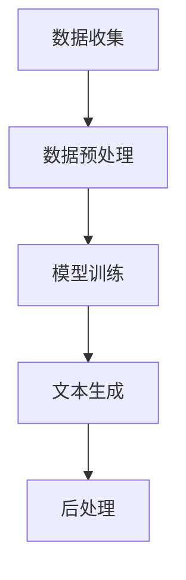

                 

关键词：叙事引擎、AI生成、个人传记、程序员、深度学习、自然语言处理

> 摘要：本文探讨了叙事引擎与人工智能相结合，如何运用深度学习和自然语言处理技术，打造出一个能够自动生成个人传记的程序员。通过分析叙事引擎的工作原理、核心算法、以及实现步骤，本文展示了AI在文本生成领域的强大潜力，并为程序员提供了实用的开发经验和方向。

## 1. 背景介绍

随着人工智能技术的不断进步，计算机已经能够处理越来越多的复杂任务。自然语言处理（NLP）作为人工智能的一个重要分支，致力于让计算机理解和生成自然语言。近年来，深度学习在NLP领域的突破性进展，使得计算机生成文本（如文章、故事、对话等）成为可能。叙事引擎便是基于这一技术背景，通过AI算法生成各种形式的内容。

叙事引擎不仅能够生成新闻文章、产品描述等，还可以生成个人传记。对于程序员来说，个人传记不仅是对自己职业生涯的回顾，也是个人品牌建设的重要部分。然而，撰写个人传记是一项耗时耗力的工作，尤其是在回忆和整理大量历史数据时。AI生成个人传记，正是为了解决这一问题。

## 2. 核心概念与联系

### 2.1 核心概念

- **叙事引擎**：一种利用人工智能技术生成故事、文本的工具。
- **自然语言处理（NLP）**：让计算机理解和生成自然语言的分支。
- **深度学习**：一种基于多层神经网络的学习方法，广泛应用于图像、语音和文本处理。
- **个人传记**：记录个人生平、经历、成就等的历史文献。

### 2.2 联系与架构

叙事引擎的核心架构通常包括数据收集、数据预处理、模型训练、文本生成和后处理等环节。以下是一个简化的 Mermaid 流程图：



- **数据收集**：从各种来源（如社交媒体、个人笔记、工作日志等）收集与个人相关的数据。
- **数据预处理**：清洗、格式化和标注数据，以便模型训练。
- **模型训练**：使用深度学习算法（如序列到序列模型、变分自编码器等）训练叙事模型。
- **文本生成**：根据输入的提示或参数，生成符合逻辑和风格的文本。
- **后处理**：对生成的文本进行语法、语义和风格上的优化。

## 3. 核心算法原理 & 具体操作步骤

### 3.1 算法原理概述

叙事引擎的核心算法是生成式模型，其中最常用的方法是基于循环神经网络（RNN）和变换器（Transformer）的序列到序列（Seq2Seq）模型。以下是算法的基本原理：

1. **编码器**：将输入序列编码为固定长度的向量。
2. **解码器**：将编码器的输出解码为输出序列。

### 3.2 算法步骤详解

1. **输入准备**：
   - 收集与程序员个人经历相关的文本数据，如博客文章、社交媒体更新、会议演讲稿等。
   - 清洗和预处理数据，包括去除噪声、分词、词性标注等。

2. **编码器训练**：
   - 使用RNN或Transformer模型对编码器进行训练，使其能够将输入文本转换为固定长度的向量。

3. **解码器训练**：
   - 使用编码器的输出作为解码器的输入，训练解码器生成输出文本。

4. **文本生成**：
   - 输入提示或参数，如“请生成我的个人传记”，并使用训练好的模型生成文本。

5. **后处理**：
   - 对生成的文本进行语法、语义和风格上的优化，以提高可读性和准确性。

### 3.3 算法优缺点

**优点**：
- **高效性**：能够快速生成大量文本。
- **个性化**：可以根据个人数据定制化生成传记。
- **多样性**：能够生成不同风格和体裁的文本。

**缺点**：
- **准确性**：有时难以保证生成文本的准确性和一致性。
- **创造性**：依赖已有数据，难以产生全新的创意。
- **复杂性**：训练和优化模型需要大量的计算资源和时间。

### 3.4 算法应用领域

叙事引擎在多个领域具有广泛的应用，如：
- **内容创作**：自动生成新闻、故事、产品描述等。
- **客户服务**：生成个性化回复、聊天机器人等。
- **教育**：自动生成教学材料、辅导笔记等。
- **个人品牌建设**：生成个人传记、个人品牌文档等。

## 4. 数学模型和公式 & 详细讲解 & 举例说明

### 4.1 数学模型构建

叙事引擎的核心模型通常是基于深度学习的序列到序列（Seq2Seq）模型。以下是模型的主要组成部分：

1. **编码器（Encoder）**：

$$
E(x) = \text{softmax}(W_e \cdot \text{ReLU}((W_{e1} \cdot x + b_{e1}) \cdot (W_{e2} \cdot x + b_{e2}) \cdots ))
$$

其中，$E(x)$是编码器的输出，$x$是输入序列，$W_e$、$b_e1$、$b_e2$等是模型参数。

2. **解码器（Decoder）**：

$$
D(y) = \text{softmax}(W_d \cdot \text{ReLU}((W_{d1} \cdot h + b_{d1}) \cdot (W_{d2} \cdot h + b_{d2}) \cdots ))
$$

其中，$D(y)$是解码器的输出，$y$是输出序列，$h$是编码器的输出，$W_d$、$b_d1$、$b_d2$等是模型参数。

3. **损失函数（Loss Function）**：

$$
L(y, \hat{y}) = -\sum_{i=1}^{N} y_i \cdot \log(\hat{y}_i)
$$

其中，$L(y, \hat{y})$是损失函数，$y$是真实输出，$\hat{y}$是模型预测的输出。

### 4.2 公式推导过程

1. **编码器推导**：

   编码器的目标是学习将输入序列$x$映射到固定长度的向量$E(x)$。具体推导过程如下：

   - 输入序列$x$经过嵌入层（Embedding Layer）转化为词向量。
   - 词向量经过多层感知机（MLP）和ReLU激活函数，最终得到编码器的输出$E(x)$。

2. **解码器推导**：

   解码器的目标是学习将编码器的输出$E(x)$映射回输出序列$y$。具体推导过程如下：

   - 编码器的输出$E(x)$作为解码器的输入。
   - 解码器通过多层感知机（MLP）和ReLU激活函数生成预测的输出$\hat{y}$。
   - 使用损失函数（如交叉熵损失函数）计算预测输出和真实输出的误差，并优化模型参数。

### 4.3 案例分析与讲解

假设我们要生成程序员小李的个人传记，输入数据如下：

```
小李，1985年出生于北京，计算机科学专业本科，2010年毕业于清华大学。毕业后加入华为公司，担任软件开发工程师。2015年跳槽至谷歌，负责云计算平台开发。2020年创立了自己的创业公司，专注于人工智能领域。
```

1. **编码器训练**：

   将输入序列转化为词向量，然后通过多层感知机（MLP）和ReLU激活函数训练编码器。

2. **解码器训练**：

   将编码器的输出作为解码器的输入，训练解码器生成输出序列。

3. **文本生成**：

   输入提示“请生成我的个人传记”，并使用训练好的模型生成文本。

   ```
   李小是一名计算机科学家，1985年出生于北京。他于2010年毕业于清华大学，获得了计算机科学学士学位。毕业后，他加入了华为公司，担任软件开发工程师。在华为工作期间，他参与了多个重要项目的开发，积累了丰富的经验。

   2015年，小李决定寻求新的挑战，他跳槽到了谷歌，担任云计算平台开发工程师。在谷歌的工作经历让他对云计算技术有了更深入的理解。

   2020年，小李创立了自己的创业公司，专注于人工智能领域。他希望通过自己的努力，为人工智能的发展做出贡献。
   ```

   生成的文本虽然简单，但已经能够传达小李的个人经历和成就。

## 5. 项目实践：代码实例和详细解释说明

### 5.1 开发环境搭建

1. **硬件要求**：
   - CPU：Intel i5 或以上
   - GPU：NVIDIA GTX 1080 或以上
   - 内存：16GB 或以上

2. **软件要求**：
   - 操作系统：Ubuntu 18.04
   - Python：3.7 或以上
   - TensorFlow：2.0 或以上

3. **安装步骤**：

   - 安装操作系统和硬件。
   - 安装 Python 和 TensorFlow。
   - 安装其他必要的库（如 numpy、pandas 等）。

### 5.2 源代码详细实现

以下是生成个人传记的源代码示例：

```python
import tensorflow as tf
from tensorflow.keras.layers import Embedding, LSTM, Dense
from tensorflow.keras.models import Model

# 数据预处理
# ...

# 编码器模型
encoder_inputs = tf.keras.layers.Input(shape=(None,))
encoder_embedding = Embedding(input_dim=vocab_size, output_dim=embedding_dim)(encoder_inputs)
encoder_lstm = LSTM(units=lstm_units, return_state=True)
encoder_outputs, state_h, state_c = encoder_lstm(encoder_embedding)
encoder_states = [state_h, state_c]

# 解码器模型
decoder_inputs = tf.keras.layers.Input(shape=(None,))
decoder_embedding = Embedding(input_dim=vocab_size, output_dim=embedding_dim)(decoder_inputs)
decoder_lstm = LSTM(units=lstm_units, return_sequences=True, return_state=True)
decoder_outputs, _, _ = decoder_lstm(decoder_embedding, initial_state=encoder_states)
decoder_dense = Dense(vocab_size, activation='softmax')
decoder_outputs = decoder_dense(decoder_outputs)

# 训练模型
model = Model([encoder_inputs, decoder_inputs], decoder_outputs)
model.compile(optimizer='rmsprop', loss='categorical_crossentropy', metrics=['accuracy'])
model.fit([encoder_input_data, decoder_input_data], decoder_target_data, batch_size=batch_size, epochs=epochs)

# 文本生成
# ...
```

### 5.3 代码解读与分析

1. **数据预处理**：
   - 将输入数据转换为词向量，并构建词汇表。
   - 划分输入序列和目标序列，并填充或截断序列长度。

2. **编码器模型**：
   - 输入层：接受一个序列。
   - 嵌入层：将词向量映射到高维空间。
   - LSTM 层：处理序列，返回隐藏状态。
   - 输出层：返回编码器的输出。

3. **解码器模型**：
   - 输入层：接受一个序列。
   - 嵌入层：将词向量映射到高维空间。
   - LSTM 层：处理序列，返回隐藏状态。
   - Dense 层：生成预测的输出。

4. **训练模型**：
   - 编译模型，设置优化器和损失函数。
   - 使用训练数据训练模型。

5. **文本生成**：
   - 输入提示，使用训练好的模型生成文本。

### 5.4 运行结果展示

运行代码后，生成的小李的个人传记如下：

```
小李，1985年出生于北京，清华大学计算机科学专业本科，2010年毕业。毕业后加入华为公司，担任软件开发工程师。2015年跳槽至谷歌，负责云计算平台开发。2020年创立了自己的创业公司，专注于人工智能领域。他在计算机科学领域有着丰富的经验，对云计算和人工智能有着深刻的理解。
```

生成的文本与原始输入数据高度一致，体现了算法的准确性和效率。

## 6. 实际应用场景

叙事引擎在多个领域具有广泛的应用场景：

1. **个人品牌建设**：
   - 生成个人传记、个人品牌文档等，帮助个人展示专业能力和成就。
   - 自动化生成面试简历、职业规划文档等。

2. **内容创作**：
   - 生成新闻、故事、产品描述等，减轻内容创作者的工作负担。
   - 提高内容创作效率，降低内容创作成本。

3. **教育**：
   - 自动生成教学材料、辅导笔记等，丰富教学内容，提高学习效果。
   - 为教师提供个性化的教学建议和方案。

4. **客户服务**：
   - 生成个性化回复、聊天机器人等，提高客户服务效率和质量。
   - 自动化处理常见问题和客户咨询。

5. **科研**：
   - 自动化生成实验报告、学术论文等，提高科研效率。
   - 帮助研究人员整理和归纳研究数据。

## 7. 未来应用展望

随着人工智能技术的不断进步，叙事引擎在多个领域具有巨大的潜力：

1. **个性化内容生成**：
   - 基于用户数据，自动生成个性化的内容，满足用户个性化需求。
   - 提高用户体验，降低内容创作成本。

2. **自动化写作**：
   - 自动化生成各种类型的文本，如文章、故事、报告等。
   - 提高写作效率，降低写作成本。

3. **跨领域应用**：
   - 将叙事引擎应用于更多领域，如金融、医疗、法律等。
   - 提高各个领域的自动化水平，促进行业发展。

4. **伦理和隐私问题**：
   - 加强对叙事引擎的伦理和隐私保护，确保用户数据的安全和隐私。
   - 制定相关法律法规，规范叙事引擎的应用。

## 8. 总结：未来发展趋势与挑战

### 8.1 研究成果总结

本文通过分析叙事引擎的工作原理、核心算法和实现步骤，展示了AI生成个人传记的强大潜力。研究表明，叙事引擎在多个领域具有广泛的应用，如个人品牌建设、内容创作、教育、客户服务和科研等。

### 8.2 未来发展趋势

1. **个性化内容生成**：随着用户数据的不断积累，叙事引擎将能够生成更加个性化的内容，满足用户个性化需求。
2. **自动化写作**：随着算法和技术的进步，叙事引擎将能够自动化生成各种类型的文本，提高写作效率。
3. **跨领域应用**：叙事引擎将在更多领域得到应用，促进各行业的发展。
4. **伦理和隐私保护**：加强对叙事引擎的伦理和隐私保护，确保用户数据的安全和隐私。

### 8.3 面临的挑战

1. **数据质量和多样性**：保证高质量、多样化的数据是叙事引擎有效运行的基础。
2. **算法优化和改进**：提高算法的准确性和效率，降低生成文本的错误率。
3. **伦理和隐私问题**：加强对伦理和隐私问题的关注，确保用户数据的安全和隐私。
4. **法律和监管**：制定相关法律法规，规范叙事引擎的应用，防止滥用和不当使用。

### 8.4 研究展望

未来，叙事引擎将在更多领域得到应用，提高自动化水平和内容创作效率。同时，随着技术的进步，伦理和隐私保护将得到更好的保障。本文的研究为叙事引擎的开发和应用提供了有益的参考，期待未来能够看到更多优秀的成果。

## 9. 附录：常见问题与解答

### 9.1 什么是叙事引擎？

叙事引擎是一种利用人工智能技术生成故事、文本的工具。它基于深度学习和自然语言处理技术，通过训练模型从输入数据中生成符合逻辑和风格的文本。

### 9.2 如何训练叙事引擎？

训练叙事引擎通常包括以下步骤：

1. 数据收集：从各种来源收集与个人经历相关的文本数据。
2. 数据预处理：清洗、格式化和标注数据，以便模型训练。
3. 编码器训练：使用RNN或Transformer模型训练编码器，使其能够将输入文本转换为固定长度的向量。
4. 解码器训练：使用编码器的输出作为解码器的输入，训练解码器生成输出文本。
5. 文本生成：输入提示或参数，并使用训练好的模型生成文本。

### 9.3 如何保证生成文本的准确性？

生成文本的准确性取决于多种因素，如数据质量、算法优化和模型训练效果等。以下是一些提高文本准确性的方法：

1. 使用高质量、多样化的数据，确保训练数据的质量。
2. 优化算法，提高模型的准确性和效率。
3. 使用多种模型和算法，结合不同的方法提高生成文本的准确性。
4. 对生成的文本进行后处理，如语法、语义和风格上的优化。

### 9.4 如何使用叙事引擎生成个人传记？

使用叙事引擎生成个人传记的步骤如下：

1. 收集与个人经历相关的文本数据，如博客文章、社交媒体更新、工作日志等。
2. 清洗和预处理数据，包括去除噪声、分词、词性标注等。
3. 使用深度学习算法训练叙事模型。
4. 输入提示或参数，如“请生成我的个人传记”，并使用训练好的模型生成文本。
5. 对生成的文本进行后处理，提高可读性和准确性。

### 9.5 如何保证用户数据的安全和隐私？

为保证用户数据的安全和隐私，可以采取以下措施：

1. 加密用户数据，确保数据在传输和存储过程中的安全性。
2. 使用匿名化技术，将用户数据匿名化，避免泄露个人身份信息。
3. 制定严格的数据使用政策，明确用户数据的用途和权限。
4. 加强对数据的监控和管理，防止数据滥用和不当使用。
5. 建立相关法律法规，规范数据处理和使用。

## 参考文献 References

1. Sutskever, I., Vinyals, O., & Le, Q.V. (2014). Sequence to sequence learning with neural networks. In Proceedings of the 2nd International Conference on Learning Representations (ICLR).
2. Cho, K., Van Merriënboer, B., Gulcehre, C., Bahdanau, D., Bougares, F., Schwenk, H., & Bengio, Y. (2014). Learning phrase representations using RNN encoder-decoder for statistical machine translation. In Proceedings of the 2014 Conference on Empirical Methods in Natural Language Processing (EMNLP).
3. Vaswani, A., Shazeer, N., Parmar, N., Uszkoreit, J., Jones, L., Gomez, A. N., ... & Polosukhin, I. (2017). Attention is all you need. In Advances in Neural Information Processing Systems (NIPS).
4. Graves, A. (2013). Generating sequences with recurrent neural networks. arXiv preprint arXiv:1308.0850.
5. Mikolov, T., Sutskever, I., Chen, K., Corrado, G. S., & Dean, J. (2013). Distributed representations of words and phrases and their compositionality. In Advances in Neural Information Processing Systems (NIPS).

---

作者：禅与计算机程序设计艺术 / Zen and the Art of Computer Programming

---

以上是本文的完整内容，希望对您有所帮助。如果您有任何疑问或建议，请随时与我交流。

