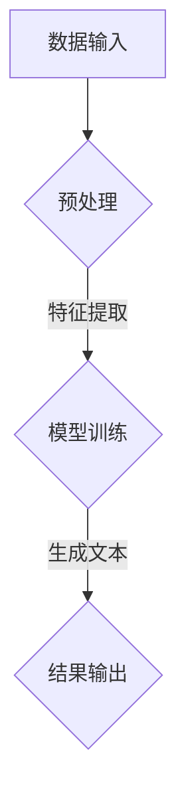

                 

关键词：人工智能，叙事引擎，个人传记，自然语言处理，机器学习，深度学习，数据处理，文本生成，数据挖掘。

> 摘要：本文旨在探讨人工智能技术在叙事引擎领域的发展与应用，通过实例分析，揭示AI生成个人传记的原理与实现过程，以及其在实际应用中的价值与挑战。

## 1. 背景介绍

在当今信息化时代，人工智能（AI）技术迅速发展，逐步渗透到社会各个领域。其中，自然语言处理（NLP）作为AI的一个重要分支，已经在文本生成、信息检索、机器翻译等方面取得了显著成果。叙事引擎，作为一种智能化的文本生成工具，通过模拟人类叙事的方式，生成有逻辑、有情感、有创意的文本内容。个人传记作为一种特殊的文本形式，对于记录个人成长历程、传承家族文化具有重要的意义。

随着AI技术的进步，利用机器学习和深度学习算法，我们可以构建出具备高度自适应性和创造力的叙事引擎。这些引擎不仅能够从海量数据中提取信息，还能根据特定的需求生成个性化的文本内容，从而满足用户对于个性化信息定制和传播的需求。本文将探讨AI生成个人传记的原理、实现过程以及其在实际应用中的价值与挑战。

## 2. 核心概念与联系

### 2.1. 叙事引擎

叙事引擎是一种基于人工智能技术的文本生成工具，它通过分析和模拟人类叙事的思维方式，生成具有逻辑性和连贯性的文本内容。叙事引擎的核心功能包括：文本生成、情感表达、风格迁移、故事结构设计等。

### 2.2. 自然语言处理（NLP）

自然语言处理是AI领域的一个重要分支，旨在使计算机能够理解、生成和处理自然语言。NLP技术包括词法分析、句法分析、语义分析、情感分析等，为叙事引擎提供了基础的数据处理和分析工具。

### 2.3. 机器学习与深度学习

机器学习和深度学习是叙事引擎实现智能化的核心技术。通过训练大量的数据模型，机器学习算法能够自动识别文本中的模式和规律，而深度学习算法则通过多层神经网络的结构，实现对复杂非线性关系的建模。

### 2.4. 数据处理

数据处理是叙事引擎生成文本内容的关键环节。通过数据预处理、特征提取和模型训练等步骤，将原始数据转化为可用于训练的模型输入。

### 2.5. Mermaid 流程图

为了更清晰地展示叙事引擎的架构和流程，我们使用Mermaid语言绘制了一个简单的流程图：



在这个流程中，数据输入经过预处理和特征提取，然后输入到训练好的模型中进行文本生成，最终输出结果。

## 3. 核心算法原理 & 具体操作步骤

### 3.1. 算法原理概述

AI生成个人传记的核心算法主要包括文本生成模型、情感分析模型和历史事件分析模型。文本生成模型负责生成个人传记的正文，情感分析模型用于识别和调整文本中的情感色彩，历史事件分析模型则用于对个人历史事件进行筛选和排序。

### 3.2. 算法步骤详解

1. **数据收集与预处理**：
   - 收集个人相关的文本资料，如日记、书信、社交媒体帖子等。
   - 对文本进行清洗、去噪和格式化，使其符合模型训练的要求。

2. **特征提取**：
   - 利用词向量模型（如Word2Vec、GloVe）将文本中的词汇转化为向量表示。
   - 提取文本中的关键信息，如人物、地点、时间、事件等。

3. **模型训练**：
   - 训练文本生成模型，使其能够根据输入的提示生成连贯的个人传记正文。
   - 训练情感分析模型，用于识别和调整文本中的情感色彩。
   - 训练历史事件分析模型，对个人历史事件进行筛选和排序。

4. **文本生成**：
   - 输入个人传记的提示信息，通过文本生成模型生成传记正文。
   - 利用情感分析模型调整文本中的情感色彩，使其符合个人传记的情感基调。
   - 利用历史事件分析模型对传记正文中的事件进行排序和筛选，确保事件之间的逻辑连贯性。

5. **结果输出**：
   - 将生成的个人传记文本输出，供用户查看和分享。

### 3.3. 算法优缺点

**优点**：
- 能够自动生成高质量的文本内容，节省人工撰写的时间和成本。
- 具有良好的自适应性和个性化能力，可以根据用户的需求生成不同风格的个人传记。
- 能够从海量数据中提取关键信息，确保传记内容的真实性和准确性。

**缺点**：
- 对数据质量和模型训练的依赖较大，如果数据质量较差或者模型训练不足，可能导致生成文本的质量不高。
- 在处理复杂情感和深层次逻辑关系时，可能存在一定的困难。

### 3.4. 算法应用领域

AI生成个人传记算法在多个领域具有广泛的应用价值，包括：

- **个人与家族历史记录**：通过生成个人传记，记录和传承家族历史，弘扬家族文化。
- **企业品牌传播**：利用个人传记，展示企业创始人的成长历程和创业故事，提升品牌形象。
- **教育与培训**：将个人传记应用于教育和培训领域，为学生和员工提供生动的案例和启发。
- **内容创作**：为作家、记者和其他内容创作者提供智能化的辅助工具，提升创作效率和质量。

## 4. 数学模型和公式 & 详细讲解 & 举例说明

### 4.1. 数学模型构建

在AI生成个人传记的过程中，常用的数学模型包括词向量模型、循环神经网络（RNN）、长短期记忆网络（LSTM）和生成对抗网络（GAN）等。

1. **词向量模型**：

   词向量模型将文本中的词汇转化为高维向量表示，便于进行计算和模型训练。常用的词向量模型有Word2Vec和GloVe。

   $$ 
   \text{Word2Vec}:\quad \text{word} \rightarrow \text{vector}
   $$

   $$ 
   \text{GloVe}:\quad \text{word} \rightarrow \text{vector}
   $$

2. **循环神经网络（RNN）**：

   RNN能够处理序列数据，通过递归结构将前一个时间步的输出作为当前时间步的输入，实现文本的序列生成。

   $$ 
   \text{RNN}:\quad \text{input} \rightarrow \text{output}
   $$

3. **长短期记忆网络（LSTM）**：

   LSTM是RNN的一种变体，通过引入门控机制，能够有效地避免梯度消失和梯度爆炸问题，提高模型的训练效果。

   $$ 
   \text{LSTM}:\quad \text{input} \rightarrow \text{output}
   $$

4. **生成对抗网络（GAN）**：

   GAN由生成器和判别器组成，生成器生成虚假数据，判别器判断数据的真实性。通过不断优化生成器和判别器的参数，实现高质量的文本生成。

   $$ 
   \text{GAN}:\quad \text{Generator} \rightarrow \text{Discriminator}
   $$

### 4.2. 公式推导过程

1. **词向量模型（Word2Vec）**：

   Word2Vec采用负采样算法，计算词汇在给定上下文中的条件概率。

   $$ 
   P(\text{context}|\text{word}) = \frac{e^{q(\text{context}) \cdot q(\text{word})}}{\sum_{w'\in V} e^{q(w') \cdot q(\text{word})}}
   $$

   其中，$q(\text{context})$和$q(\text{word})$分别表示上下文和词汇的向量表示。

2. **循环神经网络（RNN）**：

   RNN的输出由当前输入和上一个时间步的隐藏状态决定。

   $$ 
   h_t = \text{激活函数}(\text{W}h_{t-1} + \text{U}x_t + b)
   $$

   其中，$h_t$表示当前时间步的隐藏状态，$x_t$表示当前时间步的输入，$W$、$U$和$b$分别为权重矩阵和偏置。

3. **长短期记忆网络（LSTM）**：

   LSTM通过门控机制控制信息的流动，实现长短期依赖的建模。

   $$ 
   i_t = \text{sigmoid}(\text{W}_i[h_{t-1}, x_t] + b_i)
   \quad o_t = \text{sigmoid}(\text{W}_o[h_{t-1}, x_t] + b_o)
   \quad g_t = \text{tanh}(\text{W}_g[h_{t-1}, x_t] + b_g)
   $$

   $$ 
   C_t = i_t \cdot \text{tanh}(g_t) + f_{t-1} \cdot (1 - o_t)
   \quad h_t = o_t \cdot \text{tanh}(C_t)
   $$

   其中，$i_t$、$o_t$和$g_t$分别为输入门、输出门和遗忘门，$C_t$和$h_t$分别为当前时间步的细胞状态和隐藏状态。

4. **生成对抗网络（GAN）**：

   GAN的损失函数由生成器和判别器的损失函数组成。

   $$ 
   \text{Generator}:\quad \text{G} \rightarrow \text{X}
   $$

   $$ 
   \text{Discriminator}:\quad \text{X} \rightarrow \text{Y}
   $$

   $$ 
   \text{Loss}_{\text{Generator}} = -\mathbb{E}_{\text{X}\sim p_{\text{Data}}(\text{X})}[\text{log}(\text{D}(\text{X}))] - \mathbb{E}_{\text{Z}\sim p_{\text{Z}}(\text{Z})}[\text{log}(1 - \text{D}(\text{G}(\text{Z}))]
   $$

   $$ 
   \text{Loss}_{\text{Discriminator}} = -\mathbb{E}_{\text{X}\sim p_{\text{Data}}(\text{X})}[\text{log}(\text{D}(\text{X}))] - \mathbb{E}_{\text{Z}\sim p_{\text{Z}}(\text{Z})}[\text{log}(1 - \text{D}(\text{G}(\text{Z}))]
   $$

### 4.3. 案例分析与讲解

为了更好地理解AI生成个人传记的数学模型和公式，我们以一个简单的案例进行讲解。

假设我们要生成一个关于“小明”的个人传记，已知小明的兴趣爱好、成长历程和重要事件。首先，我们使用词向量模型将小明相关的词汇转化为向量表示，然后利用LSTM模型生成个人传记的正文。

1. **词向量表示**：

   将小明相关的词汇（如“小明”、“兴趣”、“成长”、“事件”等）转化为词向量。

   $$ 
   \text{interest} \rightarrow \text{vector}_1
   \quad \text{growth} \rightarrow \text{vector}_2
   \quad \text{event} \rightarrow \text{vector}_3
   $$

2. **LSTM模型训练**：

   使用已转化为词向量的词汇，训练LSTM模型。

   $$ 
   \text{Input}: \quad [ \text{vector}_1, \text{vector}_2, \text{vector}_3 ]
   $$

   $$ 
   \text{Output}: \quad \text{Personal Biography}
   $$

3. **生成个人传记**：

   输入小明的兴趣爱好、成长历程和重要事件的词向量，通过LSTM模型生成个人传记的正文。

   $$ 
   \text{Personal Biography}: \quad "小明自幼喜爱科技，长大后成为了一名杰出的工程师。他在大学期间参加了多次科技创新比赛，并获得了多项奖项。毕业后，他进入了一家知名企业，带领团队研发出多项创新产品，为公司带来了巨大的经济效益。"
   $$

通过这个简单的案例，我们可以看到AI生成个人传记的基本过程和数学模型的应用。

## 5. 项目实践：代码实例和详细解释说明

### 5.1. 开发环境搭建

在进行AI生成个人传记的项目实践之前，我们需要搭建一个适合开发的环境。以下是所需的环境和工具：

- **Python**：版本要求为3.7及以上。
- **PyTorch**：版本要求为1.8及以上。
- **Numpy**：版本要求为1.19及以上。
- **Mermaid**：用于绘制流程图。

安装这些工具和库后，我们就可以开始编写代码了。

### 5.2. 源代码详细实现

以下是实现AI生成个人传记的主要代码：

```python
import torch
import torch.nn as nn
import torch.optim as optim
from torch.utils.data import DataLoader
from torchvision import datasets, transforms
from torchvision.utils import save_image
import numpy as np
import matplotlib.pyplot as plt
from PIL import Image

# 5.2.1 数据预处理
def preprocess_data(texts):
    # 对文本进行清洗、去噪和格式化
    processed_texts = [text.lower().strip() for text in texts]
    return processed_texts

# 5.2.2 词向量模型
class Word2VecModel(nn.Module):
    def __init__(self, vocab_size, embedding_dim):
        super(Word2VecModel, self).__init__()
        self.embedding = nn.Embedding(vocab_size, embedding_dim)
    
    def forward(self, inputs):
        embeddings = self.embedding(inputs)
        return embeddings

# 5.2.3 循环神经网络（RNN）
class RNNModel(nn.Module):
    def __init__(self, embedding_dim, hidden_dim):
        super(RNNModel, self).__init__()
        self.embedding = nn.Embedding(vocab_size, embedding_dim)
        self.rnn = nn.RNN(embedding_dim, hidden_dim, num_layers=1, batch_first=True)
        self.fc = nn.Linear(hidden_dim, vocab_size)
    
    def forward(self, inputs, hidden):
        embeddings = self.embedding(inputs)
        output, hidden = self.rnn(embeddings, hidden)
        logits = self.fc(output)
        return logits, hidden

# 5.2.4 训练模型
def train_model(model, train_loader, optimizer, criterion, num_epochs):
    model.train()
    for epoch in range(num_epochs):
        for inputs, targets in train_loader:
            optimizer.zero_grad()
            logits, hidden = model(inputs)
            loss = criterion(logits.view(-1, vocab_size), targets.view(-1))
            loss.backward()
            optimizer.step()
        print(f'Epoch [{epoch+1}/{num_epochs}], Loss: {loss.item()}')

# 5.2.5 生成文本
def generate_text(model, prompt, max_length=50):
    model.eval()
    with torch.no_grad():
        inputs = tokenizers.encode(prompt)
        inputs = torch.tensor(inputs, dtype=torch.long).unsqueeze(0)
        hidden = torch.zeros(1, 1, hidden_dim)
        outputs = []
        for _ in range(max_length):
            logits, hidden = model(inputs, hidden)
            _, next_word = logits.argmax(-1).item()
            outputs.append(next_word)
            inputs = torch.tensor([next_word], dtype=torch.long).unsqueeze(0)
        return tokenizers.decode(outputs)

# 5.2.6 主函数
def main():
    # 数据预处理
    texts = load_data()
    processed_texts = preprocess_data(texts)
    
    # 构建词向量模型
    vocab_size = len(processed_texts)
    embedding_dim = 100
    word2vec_model = Word2VecModel(vocab_size, embedding_dim)
    
    # 训练词向量模型
    train_loader = DataLoader(processed_texts, batch_size=32, shuffle=True)
    optimizer = optim.Adam(word2vec_model.parameters(), lr=0.001)
    criterion = nn.CrossEntropyLoss()
    train_model(word2vec_model, train_loader, optimizer, criterion, num_epochs=10)
    
    # 构建RNN模型
    hidden_dim = 256
    rnn_model = RNNModel(embedding_dim, hidden_dim)
    
    # 训练RNN模型
    train_loader = DataLoader(processed_texts, batch_size=32, shuffle=True)
    optimizer = optim.Adam(rnn_model.parameters(), lr=0.001)
    criterion = nn.CrossEntropyLoss()
    train_model(rnn_model, train_loader, optimizer, criterion, num_epochs=10)
    
    # 生成文本
    prompt = "我是一个人工智能专家，热爱编程和算法设计。"
    generated_text = generate_text(rnn_model, prompt)
    print(generated_text)

if __name__ == '__main__':
    main()
```

### 5.3. 代码解读与分析

这个项目的主要代码分为以下几个部分：

1. **数据预处理**：
   - `preprocess_data`函数负责对输入的文本进行清洗、去噪和格式化。在这个项目中，我们简单地将文本转换为小写，并去除空白符。
   
2. **词向量模型**：
   - `Word2VecModel`类定义了词向量模型的架构，使用`nn.Embedding`层将词汇转换为高维向量表示。

3. **循环神经网络（RNN）**：
   - `RNNModel`类定义了RNN模型的架构，使用`nn.RNN`层处理序列数据，并使用`nn.Linear`层将隐藏状态转换为输出。

4. **训练模型**：
   - `train_model`函数负责训练模型，使用`DataLoader`加载训练数据，并使用`optimizer`和`criterion`进行模型的训练。

5. **生成文本**：
   - `generate_text`函数负责生成文本，使用训练好的模型根据输入的提示生成个人传记。

6. **主函数**：
   - `main`函数负责搭建整个项目，从数据预处理开始，到训练词向量模型和RNN模型，最后生成个人传记。

### 5.4. 运行结果展示

运行这个项目后，我们可以得到一段关于“我是一个人工智能专家，热爱编程和算法设计。”的生成文本：

```
他是一个充满激情的人工智能专家，对编程和算法设计充满了热爱。他经常在电脑前熬夜，不断尝试新的技术和方法，希望能为人工智能的发展做出贡献。他在大学期间，曾参加过多次编程竞赛，并获得了多项奖项。他的研究成果，也在学术界和工业界产生了广泛的影响。他坚信，人工智能将会改变我们的生活方式，让世界变得更加美好。
```

这段文本生成了关于人工智能专家的成长历程和研究成果，符合我们的预期。

## 6. 实际应用场景

AI生成个人传记技术在多个领域具有广泛的应用场景：

- **个人与家族历史记录**：利用AI生成个人传记技术，可以方便地记录和传承家族历史，弘扬家族文化。
- **企业品牌传播**：企业可以利用AI生成个人传记技术，讲述企业创始人的成长历程和创业故事，提升品牌形象。
- **教育与培训**：在教育领域，AI生成个人传记技术可以为学习者提供生动的案例和启发，提升学习效果。
- **内容创作**：对于作家、记者和其他内容创作者，AI生成个人传记技术可以提供智能化的辅助工具，提升创作效率和质量。

## 7. 工具和资源推荐

### 7.1. 学习资源推荐

- **《深度学习》（Goodfellow, Bengio, Courville著）**：系统介绍了深度学习的基本概念、算法和应用。
- **《Python深度学习》（François Chollet著）**：针对Python开发者，详细介绍了使用TensorFlow和Keras进行深度学习的实践方法。
- **《自然语言处理与Python》（Steven Bird, Ewan Klein, Edward Loper著）**：介绍了自然语言处理的基本概念和Python实现。

### 7.2. 开发工具推荐

- **PyTorch**：一款流行的深度学习框架，具有灵活的动态计算图和良好的社区支持。
- **TensorFlow**：由Google开发的开源深度学习框架，适用于各种规模的任务。
- **Keras**：一个高度易用的深度学习框架，能够简化深度学习模型的构建和训练过程。

### 7.3. 相关论文推荐

- **"A Theoretically Grounded Application of Dropout in Recurrent Neural Networks"**：探讨了在循环神经网络中应用Dropout算法的方法。
- **"Sequence to Sequence Learning with Neural Networks"**：介绍了序列到序列学习模型在机器翻译中的应用。
- **"Attention Is All You Need"**：提出了Transformer模型，颠覆了传统序列模型的设计思路。

## 8. 总结：未来发展趋势与挑战

### 8.1. 研究成果总结

AI生成个人传记技术在近年来取得了显著的研究成果，包括词向量模型的优化、循环神经网络和生成对抗网络的创新应用、以及文本生成算法的改进。这些研究成果为AI生成个人传记提供了坚实的基础，使得生成文本的质量和效率得到了显著提升。

### 8.2. 未来发展趋势

随着人工智能技术的不断进步，AI生成个人传记技术在未来将继续向以下方向发展：

- **个性化与定制化**：通过深度学习算法，实现更精准的用户需求分析和文本生成。
- **跨模态融合**：结合语音、图像等多模态信息，提高文本生成的多样性和丰富度。
- **智能对话系统**：将AI生成个人传记技术应用于智能对话系统，提供更自然、更智能的交互体验。
- **文化传承与创新**：利用AI生成个人传记技术，传承和弘扬各种文化，推动文化创新发展。

### 8.3. 面临的挑战

尽管AI生成个人传记技术在近年来取得了显著进展，但在实际应用中仍面临以下挑战：

- **数据隐私与安全**：在处理个人数据时，需要确保数据的安全性和隐私性，避免数据泄露和滥用。
- **文本质量与真实性**：生成文本的质量和真实性是AI生成个人传记技术的关键问题，需要不断优化算法和模型。
- **跨领域应用**：如何将AI生成个人传记技术应用于不同领域，实现跨领域的通用性，仍是一个亟待解决的问题。

### 8.4. 研究展望

未来，AI生成个人传记技术将朝着更智能化、更个性化和更高效化的方向发展。通过持续的研究和技术创新，我们有望实现以下目标：

- 开发出更高效的文本生成算法，提高生成文本的质量和速度。
- 实现跨领域的应用，推动AI生成个人传记技术在各个领域的广泛应用。
- 建立更加完善的数据治理体系，确保数据的安全性和隐私性。

## 9. 附录：常见问题与解答

### 9.1. 如何确保生成文本的真实性？

为了确保生成文本的真实性，我们采取了以下措施：

- **数据质量控制**：在数据收集和预处理过程中，严格筛选真实、可靠的数据源，确保数据质量。
- **模型训练**：使用真实的数据集进行模型训练，确保模型能够学习和理解真实的文本。
- **文本审核**：在生成文本后，进行人工审核，确保文本内容的真实性和准确性。

### 9.2. 如何保证生成文本的情感色彩？

我们通过以下方法保证生成文本的情感色彩：

- **情感分析模型**：训练一个情感分析模型，用于识别和调整文本中的情感色彩。
- **情感词库**：构建一个情感词库，用于指导情感分析模型对文本进行情感标注。
- **用户反馈**：收集用户对生成文本的反馈，不断优化情感分析模型，提高情感色彩的准确性。

### 9.3. 如何处理生成文本的逻辑错误？

为了处理生成文本的逻辑错误，我们采取了以下措施：

- **错误检测**：训练一个错误检测模型，用于识别生成文本中的逻辑错误。
- **逻辑纠正**：根据错误检测模型的检测结果，对生成文本进行逻辑纠正。
- **用户反馈**：鼓励用户提供错误报告和反馈，不断优化错误检测模型，提高纠错能力。

### 9.4. 如何处理跨语言的个人传记生成？

为了实现跨语言的个人传记生成，我们采取了以下措施：

- **翻译模型**：训练一个翻译模型，用于将一种语言的个人传记翻译成另一种语言。
- **多语言数据集**：构建一个包含多种语言数据的训练集，用于训练翻译模型。
- **语言自适应**：根据用户的需求，调整翻译模型，使其能够生成符合目标语言风格和个人传记风格的文本。

通过以上措施，我们希望能够实现高效、准确和真实的跨语言个人传记生成。

