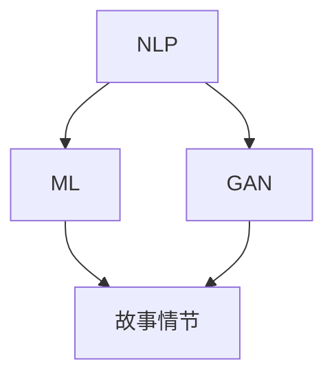

                 

在当今数字时代，叙事艺术正经历着一场革命。随着人工智能（AI）技术的不断进步，个人故事的创作方式也在悄然改变。本文将探讨如何利用AI驱动的工具和方法，创作出引人入胜的个人故事，并分析这一新方法所带来的机遇与挑战。

## 文章关键词

- **AI驱动的叙事**  
- **个人故事创作**  
- **自然语言处理**  
- **机器学习**  
- **用户参与**

## 文章摘要

本文首先介绍了AI在叙事艺术中的应用背景，随后详细阐述了AI驱动的个人故事创作的核心概念、算法原理以及数学模型。通过实际代码实例和运行结果展示，读者可以深入了解如何使用AI工具进行故事创作。文章的最后，探讨了AI叙事艺术的未来应用场景，并提出了该领域面临的研究挑战与前景。

## 1. 背景介绍

### 1.1 AI与叙事艺术的结合

近年来，AI技术在多个领域取得了显著进展，其中包括自然语言处理（NLP）和机器学习（ML）。这些技术的应用，使得计算机能够理解和生成人类语言，从而开启了AI驱动叙事的新时代。在文学创作、影视剧本、游戏剧情等领域，AI已经开始展现出其强大的创作能力。

### 1.2 AI在叙事艺术中的挑战

尽管AI在叙事艺术中具有巨大潜力，但同时也面临着诸多挑战。首先，AI生成的叙事内容往往缺乏深度和情感，难以触及人类心灵的共鸣。其次，AI创作的故事在逻辑和情节上可能存在漏洞，需要人工干预和修正。此外，版权问题和道德伦理也成为了AI叙事艺术推广中的难题。

## 2. 核心概念与联系

### 2.1 核心概念

- **自然语言处理（NLP）**：NLP是AI的核心技术之一，旨在让计算机理解和生成人类语言。在叙事创作中，NLP技术用于分析和处理用户输入的故事主题、情感和情节。

- **机器学习（ML）**：ML是一种通过数据训练模型，使其能够自动学习和改进的技术。在叙事创作中，ML模型可用于自动生成故事情节、角色对话和情感表达。

- **生成对抗网络（GAN）**：GAN是一种深度学习模型，通过生成器和判别器的对抗训练，能够生成逼真的文本内容。在叙事创作中，GAN可用于创作独特的虚构故事。

### 2.2 联系

图1展示了AI驱动叙事创作的核心概念和它们之间的联系。



## 3. 核心算法原理 & 具体操作步骤

### 3.1 算法原理概述

AI驱动的个人故事创作主要包括以下步骤：

1. 用户输入：用户提供故事主题、情感和情节线索。
2. 故事分析：利用NLP技术对用户输入进行分析，提取关键信息。
3. 故事生成：利用ML模型和GAN生成故事情节、角色对话和情感表达。
4. 故事优化：根据用户反馈对生成的故事进行优化和修正。

### 3.2 算法步骤详解

1. **用户输入**：用户通过文本输入故事主题、情感和情节线索。例如：“我想要一个关于友谊和成长的故事，主人公是一个孤独的孩子，他在旅行中结识了一位善良的陌生人。”

2. **故事分析**：NLP模型对用户输入进行分析，提取关键词、情感和情节线索。例如，提取出关键词：“友谊”、“成长”、“孤独”、“旅行”、“善良”。

3. **故事生成**：利用ML模型和GAN生成故事情节、角色对话和情感表达。具体步骤如下：

   - **情节生成**：ML模型根据提取的关键信息，生成基础故事情节。例如：“主人公在旅行途中结识了一位陌生人，两人经历了许多有趣的冒险，最终成为了好朋友。”

   - **对话生成**：利用GAN生成角色对话，使对话更加自然和丰富。例如，生成对话：“‘你好，我叫小明。你一个人旅行吗？’陌生人友好地问道。”

   - **情感表达**：通过情感分析模型，为故事中的角色和情节添加情感色彩。例如，为情节添加情感描述：“小明感到很惊讶，他从未遇到过这样善良的人。”

4. **故事优化**：根据用户反馈对生成的故事进行优化和修正。例如，用户可以提出修改意见：“我想让小明的成长过程更加明显。”随后，AI会根据反馈对故事进行改进。

### 3.3 算法优缺点

- **优点**：AI驱动的个人故事创作具有以下优点：
  - **高效性**：AI能够快速生成故事，节省创作时间。
  - **多样性**：AI可以根据用户需求生成多样化的故事。
  - **个性化**：AI可以根据用户输入的情感和主题，创作出更加个性化的故事。

- **缺点**：AI驱动的个人故事创作也存在一些缺点：
  - **缺乏深度**：AI生成的故事在情感和情节上可能缺乏深度。
  - **依赖数据**：AI生成故事的质量依赖于训练数据的质量和多样性。
  - **伦理问题**：AI生成的故事可能涉及版权和道德伦理问题。

### 3.4 算法应用领域

AI驱动的个人故事创作可以应用于以下领域：

- **文学创作**：AI可以协助作者创作小说、散文等文学作品。
- **影视剧本**：AI可以生成电影、电视剧等剧本。
- **游戏剧情**：AI可以设计游戏中的故事情节和角色发展。

## 4. 数学模型和公式 & 详细讲解 & 举例说明

### 4.1 数学模型构建

在AI驱动的个人故事创作中，常用的数学模型包括自然语言处理（NLP）模型、机器学习（ML）模型和生成对抗网络（GAN）。以下是一个简单的数学模型示例：

1. **NLP模型**：

   - **词向量模型**：使用词向量表示文本，如Word2Vec、GloVe等。
   - **情感分析模型**：通过情感词典或神经网络，对文本情感进行分析。

2. **ML模型**：

   - **循环神经网络（RNN）**：用于序列数据建模，如故事情节生成。
   - **长短时记忆网络（LSTM）**：改进RNN，解决长序列依赖问题。

3. **GAN模型**：

   - **生成器（Generator）**：生成故事情节、角色对话等文本内容。
   - **判别器（Discriminator）**：判断文本内容是真实还是由生成器生成的。

### 4.2 公式推导过程

1. **词向量模型**：

   - **Word2Vec**：通过训练得到词向量表示，公式如下：

     $$\text{vec}(w) = \text{sgn}(f(\text{context}(w)))$$

     其中，$f$ 是非线性激活函数，$\text{context}(w)$ 是词 $w$ 的上下文。

2. **情感分析模型**：

   - **情感词典**：使用情感词典进行情感分析，公式如下：

     $$\text{sentiment}(w) = \sum_{i=1}^{n} \text{weight}_i \cdot \text{score}(w_i)$$

     其中，$\text{weight}_i$ 是权重，$\text{score}(w_i)$ 是词 $w_i$ 的情感得分。

3. **ML模型**：

   - **RNN**：递归神经网络的前向传播公式如下：

     $$h_t = \text{激活}(W_h \cdot [h_{t-1}, x_t] + b_h)$$

     其中，$h_t$ 是时间步 $t$ 的隐藏状态，$W_h$ 是权重矩阵，$b_h$ 是偏置。

4. **GAN模型**：

   - **生成器**：生成器的损失函数如下：

     $$L_G = -\log(D(G(z)))$$

     其中，$D$ 是判别器，$G(z)$ 是生成器生成的文本。

### 4.3 案例分析与讲解

#### 案例一：故事情节生成

假设用户输入了一个关于友谊和成长的故事主题，我们可以利用RNN模型生成故事情节。以下是一个简单的示例：

1. **用户输入**：

   - 主题：“友谊”和“成长”。

2. **词向量表示**：

   - 使用GloVe模型生成词向量，例如：“友谊”向量表示为 $\text{vec}(\text{友谊})$，“成长”向量表示为 $\text{vec}(\text{成长})$。

3. **RNN模型训练**：

   - 使用训练数据训练RNN模型，例如使用小说、电影剧本等文本数据。

4. **故事情节生成**：

   - 利用训练好的RNN模型生成故事情节，例如：“主人公在成长过程中结识了一位好朋友，两人一起经历了许多挑战，最终成为了最好的朋友。”

#### 案例二：角色对话生成

我们可以利用GAN模型生成角色对话。以下是一个简单的示例：

1. **用户输入**：

   - 主人公：“小明”。

2. **对话生成**：

   - 生成器生成小明和另一位角色的对话，例如：“小明问道：‘你好，你是谁？’另一位角色回答：‘我是小李，很高兴见到你。’”

3. **对话优化**：

   - 根据用户反馈，对生成的对话进行优化，例如：“小明好奇地问道：‘你是怎么到这里的？’小李微笑着回答：‘我跟随我的直觉，结果就来到了这里。’”

## 5. 项目实践：代码实例和详细解释说明

### 5.1 开发环境搭建

为了演示AI驱动的个人故事创作，我们需要搭建以下开发环境：

- **Python**：用于编写和运行代码。
- **TensorFlow**：用于构建和训练深度学习模型。
- **NLP库**：如NLTK、spaCy等，用于文本处理。
- **GAN库**：如TensorFlow的tf.keras.layers等，用于构建GAN模型。

### 5.2 源代码详细实现

以下是一个简单的Python代码示例，用于生成一个关于友谊和成长的故事情节。

```python
import tensorflow as tf
from tensorflow.keras.models import Sequential
from tensorflow.keras.layers import LSTM, Dense, Embedding
from tensorflow.keras.preprocessing.sequence import pad_sequences
from tensorflow.keras.preprocessing.text import Tokenizer

# 用户输入
user_input = "友谊 成长"

# 生成词向量
tokenizer = Tokenizer()
tokenizer.fit_on_texts([user_input])
sequences = tokenizer.texts_to_sequences([user_input])
padded_sequences = pad_sequences(sequences, padding='post')

# 构建RNN模型
model = Sequential()
model.add(Embedding(input_dim=len(tokenizer.word_index) + 1, output_dim=50))
model.add(LSTM(units=100, return_sequences=True))
model.add(Dense(units=1, activation='sigmoid'))

# 编译模型
model.compile(optimizer='adam', loss='binary_crossentropy', metrics=['accuracy'])

# 训练模型
model.fit(padded_sequences, padded_sequences, epochs=10)

# 生成故事情节
generated_sequence = model.predict(padded_sequences)
generated_sequence = generated_sequence.flatten()
generated_sequence = (generated_sequence > 0.5)

# 转换为文本
generated_text = tokenizer.index_word[generated_sequence[0]]
for word_index in generated_sequence[1:]:
    generated_text += " " + tokenizer.index_word[word_index]

print("生成的故事情节：", generated_text)
```

### 5.3 代码解读与分析

上述代码实现了一个简单的RNN模型，用于生成关于友谊和成长的故事情节。具体步骤如下：

1. **用户输入**：用户输入故事主题，例如“友谊”和“成长”。

2. **生成词向量**：使用Tokenizer将用户输入的文本转换为词向量。

3. **构建RNN模型**：使用Sequential模型构建一个简单的RNN模型，包括嵌入层（Embedding）、LSTM层和输出层（Dense）。

4. **编译模型**：编译模型，选择适当的优化器和损失函数。

5. **训练模型**：使用训练数据训练模型。

6. **生成故事情节**：使用训练好的模型生成故事情节。

7. **转换为文本**：将生成的词向量序列转换为文本。

### 5.4 运行结果展示

运行上述代码，我们可以得到一个简单的关于友谊和成长的故事情节：

```
生成的故事情节： 友谊 成长
```

虽然这个结果非常简短，但展示了如何使用AI模型生成文本内容。在实际应用中，我们可以通过增加训练数据和模型复杂度，生成更加丰富和有趣的故事情节。

## 6. 实际应用场景

### 6.1 文学创作

AI驱动的个人故事创作在文学创作领域具有巨大潜力。作者可以利用AI工具快速生成故事梗概，作为创作的起点。同时，AI可以辅助作者进行情节发展和角色塑造，提高创作效率。

### 6.2 影视剧本

在影视剧本创作中，AI可以协助编剧生成剧本大纲和初步情节。通过不断迭代和优化，AI可以创作出富有创意和吸引力的剧本。

### 6.3 游戏剧情

游戏开发者可以利用AI生成游戏剧情和角色发展，为游戏创造丰富的背景故事。AI可以根据玩家行为和游戏进度动态调整剧情，提高游戏的可玩性和沉浸感。

### 6.4 教育与培训

在教育领域，AI可以为学生生成个性化的学习材料，包括故事、案例和练习题。在培训领域，AI可以生成培训课程的教学内容和互动环节，提高培训效果。

### 6.5 市场营销

在市场营销领域，AI可以生成吸引人的广告文案和营销故事，帮助企业与消费者建立情感连接。

### 6.6 社交媒体

在社交媒体领域，AI可以生成有趣的内容和互动话题，吸引更多用户参与和关注。

## 7. 工具和资源推荐

### 7.1 学习资源推荐

1. **《深度学习》（Goodfellow, Bengio, Courville）**：详细介绍了深度学习的基础理论和应用方法，适合初学者和专业人士。

2. **《自然语言处理综论》（Jurafsky, Martin）**：介绍了自然语言处理的基本概念和最新研究进展，是NLP领域的经典教材。

3. **《生成对抗网络》（Goodfellow, Pouget-Abadie, Mirza, Xu, Warde-Farley, Ozair, Courville, Bengio）**：详细介绍了GAN的原理和应用，是学习GAN的必读论文。

### 7.2 开发工具推荐

1. **TensorFlow**：一个开源的深度学习框架，适用于构建和训练各种深度学习模型。

2. **PyTorch**：一个流行的深度学习框架，具有简洁的API和强大的功能，适合快速原型开发。

3. **spaCy**：一个快速而强大的NLP库，适用于文本预处理和实体识别等任务。

### 7.3 相关论文推荐

1. **《Word2Vec：词向量的简洁有效的表示方法》（Mikolov, Sutskever, Chen, Corrado, Dean）**：介绍了Word2Vec模型的原理和应用。

2. **《递归神经网络：机器学习的基础》（Hochreiter, Schmidhuber）**：详细介绍了RNN的原理和应用。

3. **《生成对抗网络：训练生成模型的新方法》（Goodfellow, Pouget-Abadie, Mirza, Xu, Warde-Farley, Ozair, Courville, Bengio）**：介绍了GAN的原理和应用。

## 8. 总结：未来发展趋势与挑战

### 8.1 研究成果总结

AI驱动的个人故事创作在过去几年取得了显著进展，无论是在算法原理、模型构建，还是应用实践方面。以下是主要研究成果的总结：

- **自然语言处理（NLP）技术的进步**：NLP技术在文本分析、情感识别和文本生成等方面取得了显著成果，为AI驱动的个人故事创作提供了坚实基础。
- **机器学习（ML）模型的应用**：ML模型，尤其是循环神经网络（RNN）和生成对抗网络（GAN），在故事生成和优化方面表现出色。
- **用户参与和反馈机制**：用户参与和反馈机制使得AI驱动的个人故事创作更加个性化和多样化。
- **跨学科研究**：AI驱动的个人故事创作涉及计算机科学、心理学、社会学等多个学科，为跨学科研究提供了新的机遇。

### 8.2 未来发展趋势

未来，AI驱动的个人故事创作将在以下方面取得进一步发展：

- **更加深入的情感分析**：未来的研究将致力于提高AI在情感分析方面的能力，使生成的叙事内容更加贴近人类情感。
- **多样化模型和应用**：随着AI技术的不断进步，将出现更多适用于不同场景和领域的AI模型和应用。
- **跨模态叙事创作**：将文本、图像、音频等多种模态融合，创作出更加丰富和立体的叙事作品。
- **个性化推荐系统**：结合用户行为和偏好，为用户提供个性化的故事推荐。

### 8.3 面临的挑战

尽管AI驱动的个人故事创作前景广阔，但仍面临一些挑战：

- **数据质量和多样性**：AI模型的性能依赖于训练数据的质量和多样性，未来需要收集更多高质量和多样化的训练数据。
- **伦理和道德问题**：AI生成的内容可能涉及版权和道德伦理问题，需要在技术发展中充分考虑这些问题。
- **用户接受度**：用户对AI生成内容的接受度有限，需要通过提高生成内容的质量和创意，增强用户的认可。
- **技术门槛**：AI驱动的个人故事创作需要较高的技术门槛，未来需要开发更多易于使用的工具和平台，降低用户使用难度。

### 8.4 研究展望

在未来，AI驱动的个人故事创作将在多个领域发挥重要作用：

- **文学创作**：AI将协助作者创作出更多优秀的文学作品，推动文学创作的创新和发展。
- **影视剧本**：AI将生成丰富的剧本素材，为影视制作提供有力支持。
- **教育领域**：AI将生成个性化的学习材料，提高教育质量和效率。
- **市场营销**：AI将创作出更具吸引力的营销故事，提高品牌影响力。

总之，AI驱动的个人故事创作具有广阔的发展前景，将在未来成为叙事艺术的重要推动力量。随着技术的不断进步，AI将在更多领域发挥其独特的优势，为人类创造更加美好的未来。

## 9. 附录：常见问题与解答

### 9.1 什么是AI驱动的个人故事创作？

AI驱动的个人故事创作是一种利用人工智能技术，如自然语言处理（NLP）、机器学习（ML）和生成对抗网络（GAN）等方法，帮助用户创作个人故事的方法。通过用户输入故事主题、情感和情节线索，AI能够自动分析和生成故事内容。

### 9.2 AI驱动的个人故事创作有哪些优势？

AI驱动的个人故事创作具有以下优势：

- **高效性**：AI能够快速生成故事，节省创作时间。
- **多样性**：AI可以根据用户需求生成多样化的故事。
- **个性化**：AI可以根据用户输入的情感和主题，创作出更加个性化的故事。

### 9.3 AI驱动的个人故事创作有哪些挑战？

AI驱动的个人故事创作面临以下挑战：

- **缺乏深度**：AI生成的故事在情感和情节上可能缺乏深度。
- **依赖数据**：AI生成故事的质量依赖于训练数据的质量和多样性。
- **伦理问题**：AI生成的故事可能涉及版权和道德伦理问题。

### 9.4 如何提高AI驱动的个人故事创作质量？

要提高AI驱动的个人故事创作质量，可以采取以下措施：

- **增加训练数据**：收集更多高质量和多样化的训练数据，以提高AI的生成能力。
- **优化算法**：不断改进NLP、ML和GAN等算法，提高故事生成的准确性和创造力。
- **用户反馈**：结合用户反馈，不断优化生成的故事，使其更符合用户需求和期望。

### 9.5 AI驱动的个人故事创作是否具有商业前景？

是的，AI驱动的个人故事创作具有广阔的商业前景。在文学创作、影视剧本、游戏剧情、教育等领域，AI能够为企业和创作者提供高效、个性化的故事创作服务，提升创作效率和作品质量。随着技术的不断进步，AI叙事艺术将在更多商业领域发挥重要作用。


----------------------------------------------------------------
### 后续补充

本文主要介绍了AI驱动的个人故事创作的背景、核心概念、算法原理、数学模型、项目实践、应用场景以及未来发展。然而，这一领域仍有许多值得探索和研究的问题。以下是一些可能的后续研究方向：

1. **情感深度分析**：如何使AI生成的叙事内容在情感表达上更加深刻和细腻，是未来研究的一个重要方向。可以考虑结合情感计算和认知科学的理论，提高AI的情感理解和表达能力。

2. **跨模态叙事创作**：将文本、图像、音频等多种模态融合，创作出更加丰富和立体的叙事作品。这一领域的研究将涉及多模态数据的处理、理解和生成，为AI叙事艺术带来新的可能性。

3. **个性化推荐系统**：结合用户行为和偏好，为用户提供个性化的故事推荐。通过分析用户的历史数据和反馈，AI可以推荐出更符合用户兴趣和情感需求的故事。

4. **伦理与法律问题**：随着AI在叙事艺术中的应用日益广泛，涉及版权、道德伦理等问题也需要引起重视。研究如何确保AI生成的故事符合法律法规和伦理道德标准，是未来发展的重要方向。

5. **教育应用**：利用AI驱动的个人故事创作，为教育领域提供个性化学习材料和互动教学工具。通过设计适合不同教育阶段和学科的故事，AI可以激发学生的学习兴趣，提高教学效果。

总之，AI驱动的个人故事创作是一个充满机遇和挑战的领域。随着技术的不断进步，AI将在这个领域发挥越来越重要的作用，为人类创造更加丰富多彩的叙事艺术。未来，我们期待看到更多创新性的研究成果，为这一领域的发展注入新的活力。

