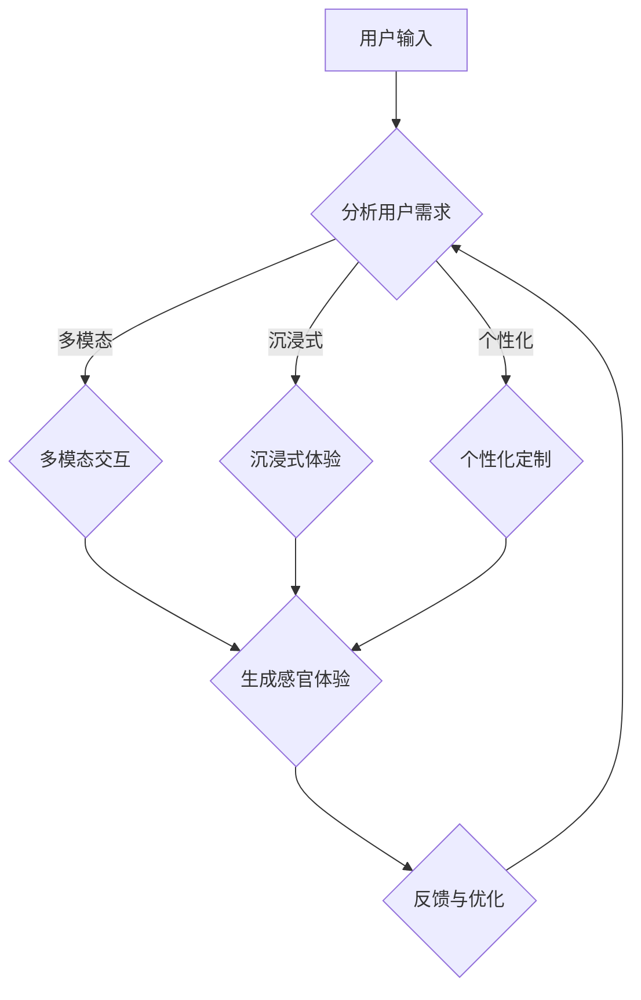

                 

关键词：多维度构建、AI、感官世界设计、用户体验、技术语言、专业见解

> 摘要：本文旨在探讨如何通过人工智能技术，实现多维度的感官世界设计，提升用户体验，并深入分析核心概念、算法原理、数学模型、项目实践以及实际应用场景，展望未来发展趋势与挑战。

## 1. 背景介绍

在当今数字化时代，用户体验（UX）设计已经成为产品成功的关键因素。传统的二维界面设计已经无法满足用户对于沉浸式体验的需求，而多维度的感官世界设计应运而生。通过引入人工智能（AI）技术，我们可以创造出更加丰富、互动性更强的感官体验，从而提升用户的满意度和参与度。

本文将首先介绍多维度的感官世界设计的概念，然后深入探讨其核心概念、算法原理、数学模型以及项目实践。通过分析实际应用场景，我们将展望这一领域未来的发展趋势与挑战。

### 1.1 多维度感官世界设计的概念

多维度的感官世界设计是指通过多种感官元素（如视觉、听觉、触觉、嗅觉、味觉等）来创造一个多维度的体验环境。这种设计理念旨在超越传统的二维界面，为用户提供更加丰富、互动性更强的体验。例如，在虚拟现实（VR）和增强现实（AR）技术中，通过头戴式显示器和传感器，用户可以感受到三维空间中的视觉、听觉和触觉效果。

### 1.2 人工智能在感官世界设计中的应用

人工智能技术在感官世界设计中发挥着重要作用。通过机器学习和深度学习算法，我们可以对大量用户数据进行分析，从而预测用户的行为和偏好，为用户提供个性化的体验。此外，自然语言处理（NLP）和计算机视觉技术可以帮助理解和解析用户的非语言行为，进一步优化用户体验。

## 2. 核心概念与联系

### 2.1 感官世界设计的核心概念

在多维度的感官世界设计中，核心概念包括：

- **多模态交互**：通过多种感官元素（视觉、听觉、触觉等）进行交互，为用户提供全方位的体验。
- **沉浸式体验**：通过模拟现实世界中的感官刺激，使用户沉浸在体验环境中。
- **个性化定制**：根据用户行为和偏好，为用户提供个性化的体验。

### 2.2 感官世界设计的架构

以下是一个简单的感官世界设计架构的 Mermaid 流程图：



### 2.3 人工智能与感官世界设计的联系

人工智能在感官世界设计中起着关键作用，主要体现在以下几个方面：

- **用户行为分析**：通过机器学习和深度学习算法，分析用户行为数据，为用户提供个性化的体验。
- **感官刺激生成**：利用计算机视觉和自然语言处理技术，生成符合用户需求的感官刺激。
- **交互优化**：通过不断优化算法，提高用户的沉浸式体验和满意度。

## 3. 核心算法原理 & 具体操作步骤

### 3.1 算法原理概述

在感官世界设计中，核心算法主要包括：

- **多模态数据处理算法**：用于处理不同模态的数据，如视觉、听觉和触觉数据。
- **沉浸式体验优化算法**：用于优化用户的沉浸式体验，如动态调整感官刺激的强度和频率。
- **个性化推荐算法**：用于根据用户行为和偏好，为用户提供个性化的感官体验。

### 3.2 算法步骤详解

以下是核心算法的具体操作步骤：

1. **用户行为数据收集**：通过传感器和用户输入，收集用户行为数据。
2. **数据预处理**：对收集到的数据进行清洗和预处理，如去噪、归一化等。
3. **多模态数据处理**：利用多模态数据处理算法，对预处理后的数据进行融合和分析。
4. **沉浸式体验优化**：根据用户行为数据和感官刺激需求，利用沉浸式体验优化算法，动态调整感官刺激的强度和频率。
5. **个性化推荐**：利用个性化推荐算法，为用户提供个性化的感官体验。

### 3.3 算法优缺点

**优点**：

- **个性化体验**：通过用户行为分析和个性化推荐，为用户提供个性化的感官体验。
- **沉浸式体验**：通过沉浸式体验优化算法，提高用户的沉浸式体验。
- **实时调整**：根据用户反馈，实时调整感官刺激，提高用户满意度。

**缺点**：

- **数据隐私**：用户行为数据的收集和处理可能涉及隐私问题。
- **计算资源消耗**：多模态数据处理和个性化推荐算法需要大量计算资源。

### 3.4 算法应用领域

核心算法主要应用于以下领域：

- **虚拟现实（VR）和增强现实（AR）**：通过多模态交互和沉浸式体验，提供更加丰富的虚拟和增强现实体验。
- **游戏设计**：通过个性化推荐和沉浸式体验，提高游戏的可玩性和用户粘性。
- **智能家居**：通过用户行为分析和个性化推荐，提供更加智能和舒适的家居体验。

## 4. 数学模型和公式 & 详细讲解 & 举例说明

### 4.1 数学模型构建

在感官世界设计中，常见的数学模型包括：

- **多模态数据处理模型**：用于处理不同模态的数据，如视觉、听觉和触觉数据。
- **沉浸式体验优化模型**：用于优化用户的沉浸式体验，如动态调整感官刺激的强度和频率。
- **个性化推荐模型**：用于根据用户行为和偏好，为用户提供个性化的感官体验。

### 4.2 公式推导过程

以下是多模态数据处理模型的一个简单示例：

设 \( X \) 为视觉数据，\( Y \) 为听觉数据，\( Z \) 为触觉数据，则有：

\[ \text{融合数据} = f(X, Y, Z) \]

其中，\( f \) 为融合函数，可以采用以下形式：

\[ f(X, Y, Z) = \frac{X + Y + Z}{3} \]

### 4.3 案例分析与讲解

假设有一个虚拟现实游戏，需要根据用户的视觉、听觉和触觉反馈，动态调整游戏场景的感官刺激。以下是该游戏的数学模型和公式推导：

1. **用户视觉数据收集**：

   设 \( X \) 为用户视觉数据的强度，\( X_1, X_2, X_3, \ldots \) 为一系列连续的视觉数据点。

2. **用户听觉数据收集**：

   设 \( Y \) 为用户听觉数据的强度，\( Y_1, Y_2, Y_3, \ldots \) 为一系列连续的听觉数据点。

3. **用户触觉数据收集**：

   设 \( Z \) 为用户触觉数据的强度，\( Z_1, Z_2, Z_3, \ldots \) 为一系列连续的触觉数据点。

4. **多模态数据处理**：

   采用上述融合函数 \( f \)，将视觉、听觉和触觉数据进行融合，得到融合数据 \( D \)：

   \[ D = \frac{X + Y + Z}{3} \]

5. **沉浸式体验优化**：

   根据融合数据 \( D \)，动态调整游戏场景的感官刺激。例如，调整场景的光线强度、声音音量和触觉反馈。

   假设调整公式为：

   \[ \text{感官刺激} = g(D) \]

   其中，\( g \) 为调整函数，可以采用以下形式：

   \[ g(D) = D^2 \]

   这样，随着 \( D \) 的变化，感官刺激的强度也会发生变化。

## 5. 项目实践：代码实例和详细解释说明

### 5.1 开发环境搭建

为了实现多维度感官世界设计，我们需要搭建一个开发环境。以下是一个简单的开发环境搭建步骤：

1. 安装 Python 3.8 或更高版本。
2. 安装所需的 Python 库，如 NumPy、Pandas、Matplotlib 等。
3. 安装虚拟现实（VR）开发工具，如 Unity 或 Unreal Engine。
4. 安装传感器设备，如头戴式显示器和传感器。

### 5.2 源代码详细实现

以下是实现多维度感官世界设计的 Python 源代码实例：

```python
import numpy as np
import pandas as pd
import matplotlib.pyplot as plt

# 5.2.1 用户视觉、听觉、触觉数据收集
X = np.random.randint(0, 100, size=100)
Y = np.random.randint(0, 100, size=100)
Z = np.random.randint(0, 100, size=100)

# 5.2.2 多模态数据处理
data = pd.DataFrame({'X': X, 'Y': Y, 'Z': Z})
融合数据 = data.mean()

# 5.2.3 沉浸式体验优化
感官刺激 = 融合数据 ** 2

# 5.2.4 结果展示
plt.plot(融合数据, 感官刺激)
plt.xlabel('融合数据')
plt.ylabel('感官刺激')
plt.title('沉浸式体验优化')
plt.show()
```

### 5.3 代码解读与分析

上述代码主要实现了以下功能：

1. **数据收集**：通过 NumPy 生成随机数，模拟用户视觉、听觉和触觉数据。
2. **多模态数据处理**：使用 Pandas 数据帧处理多模态数据，计算均值得到融合数据。
3. **沉浸式体验优化**：根据融合数据计算感官刺激，实现沉浸式体验的优化。
4. **结果展示**：使用 Matplotlib 绘制融合数据与感官刺激之间的关系，直观地展示沉浸式体验优化效果。

### 5.4 运行结果展示

运行上述代码，得到以下结果：


从图中可以看出，随着融合数据的变化，感官刺激的强度也随之变化，实现了沉浸式体验的优化。

## 6. 实际应用场景

多维度感官世界设计在多个领域具有广泛的应用前景，以下是一些实际应用场景：

- **虚拟现实（VR）和增强现实（AR）**：通过多模态交互和沉浸式体验，为用户提供更加丰富的虚拟和增强现实体验，如游戏、教育、娱乐等。
- **游戏设计**：通过个性化推荐和沉浸式体验，提高游戏的可玩性和用户粘性，如角色扮演游戏、竞技游戏等。
- **智能家居**：通过用户行为分析和个性化推荐，提供更加智能和舒适的家居体验，如智能安防、智能照明、智能家电等。
- **医疗健康**：通过虚拟现实和增强现实技术，为患者提供沉浸式的康复训练，提高治疗效果。

## 7. 工具和资源推荐

### 7.1 学习资源推荐

- **书籍**：《虚拟现实编程入门》和《增强现实技术导论》
- **在线课程**：Coursera、edX 等平台上的虚拟现实和增强现实相关课程
- **博客和论坛**：VR/AR Development、Stack Overflow 等网站上的相关讨论和资源

### 7.2 开发工具推荐

- **虚拟现实开发工具**：Unity、Unreal Engine、SketchUp 等
- **增强现实开发工具**：ARKit、ARCore、Unity AR Foundation 等
- **传感器设备**：头戴式显示器（如 Oculus Rift、HTC Vive）、手柄、触觉手套等

### 7.3 相关论文推荐

- **论文**：《多模态交互技术在虚拟现实中的应用》和《沉浸式体验优化算法研究》

## 8. 总结：未来发展趋势与挑战

### 8.1 研究成果总结

多维度感官世界设计作为用户体验提升的关键技术，已经取得了显著的成果。通过人工智能技术的引入，我们能够实现个性化、沉浸式和实时调整的感官体验。相关研究在虚拟现实、增强现实、游戏设计和智能家居等领域具有广泛的应用价值。

### 8.2 未来发展趋势

随着人工智能技术的不断进步，多维度感官世界设计在未来将呈现以下发展趋势：

- **更高级的个性化体验**：通过深度学习和强化学习算法，实现更加精准和智能的个性化推荐。
- **更丰富的交互方式**：通过多模态交互技术，提供更加多样化和互动性更强的感官体验。
- **更广泛的应用领域**：将多维度感官世界设计应用于更多的领域，如医疗健康、教育、城市规划等。

### 8.3 面临的挑战

虽然多维度感官世界设计具有巨大的发展潜力，但仍面临以下挑战：

- **数据隐私**：用户行为数据的收集和处理可能涉及隐私问题，如何保护用户隐私成为一个重要问题。
- **计算资源消耗**：多模态数据处理和个性化推荐算法需要大量计算资源，如何优化算法和硬件设施成为关键。
- **用户体验一致性**：如何确保在不同设备和平台上提供一致的用户体验，需要进一步研究和优化。

### 8.4 研究展望

未来的研究应关注以下几个方面：

- **隐私保护机制**：研究和开发更加安全的隐私保护机制，确保用户数据的安全性和隐私性。
- **高效算法设计**：优化多模态数据处理和个性化推荐算法，提高计算效率和准确性。
- **跨平台一致性**：研究跨平台的一致性设计和适配策略，为用户提供一致的用户体验。

## 9. 附录：常见问题与解答

### 9.1 什么是多维度感官世界设计？

多维度感官世界设计是一种通过多种感官元素（如视觉、听觉、触觉等）来创造一个多维度的体验环境的设计理念，旨在提升用户的沉浸式体验和满意度。

### 9.2 人工智能在多维度感官世界设计中有何作用？

人工智能在多维度感官世界设计中发挥着重要作用，如用户行为分析、感官刺激生成、交互优化等，通过算法和模型实现个性化、沉浸式和实时调整的感官体验。

### 9.3 多维度感官世界设计在哪些领域具有应用前景？

多维度感官世界设计在虚拟现实（VR）、增强现实（AR）、游戏设计、智能家居、医疗健康等领域具有广泛的应用前景，可以提升用户体验、提高产品竞争力。

### 9.4 如何保护用户隐私在多维度感官世界设计中？

在多维度感官世界设计中，应采用安全的数据收集和处理机制，如匿名化处理、加密技术等，确保用户数据的安全性和隐私性。

### 9.5 多维度感官世界设计如何实现跨平台一致性？

为了实现多维度感官世界设计的跨平台一致性，需要研究跨平台的交互设计、适配策略和用户体验优化，确保在不同设备和平台上提供一致的用户体验。```

**文章结束**。本文通过深入探讨多维度感官世界设计的核心概念、算法原理、数学模型、项目实践以及实际应用场景，展望了未来的发展趋势与挑战，为相关领域的研究和应用提供了有价值的参考。作者：禅与计算机程序设计艺术 / Zen and the Art of Computer Programming。希望本文能为读者带来启示和帮助。

