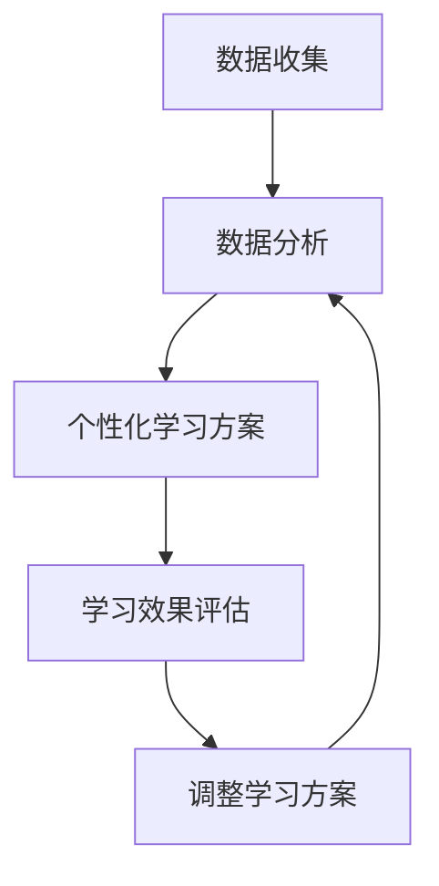

                 

关键词：人工智能，教育技术，多维度构建，培训师，感官世界设计

> 摘要：本文将探讨人工智能在教育领域的新角色，特别是AI在培训师和感官世界设计师方面的应用。我们将深入分析AI技术的核心概念和原理，并通过具体案例和数学模型，展示AI在教育中的实际应用。文章旨在为教育工作者提供有价值的见解，以推动人工智能在教育培训中的创新和发展。

## 1. 背景介绍

随着人工智能（AI）技术的飞速发展，它正在逐渐渗透到社会生活的各个领域，包括教育。传统的教育模式正面临着巨大的变革，而AI技术的引入为教育培训带来了前所未有的机遇和挑战。作为教育领域的重要角色，培训师的角色也在不断演变。他们不再仅仅是知识的传递者，而是变成了多维度构建师和教育技术的创新者。

本文旨在探讨人工智能如何成为培训师和感官世界设计师的教育者，特别是AI在构建个性化学习体验、增强现实感和交互性方面的潜力。通过分析AI的核心概念和原理，我们将展示如何利用AI技术来创造一个更加丰富、互动和个性化的教育环境。

### 1.1 人工智能在教育领域的重要性

人工智能在教育领域的应用具有深远的影响。首先，AI能够通过数据分析为学生提供个性化的学习方案，使每个学生都能根据自己的学习速度和风格进行学习。其次，AI技术可以模拟复杂的教学场景，帮助学生更好地理解和应用知识。此外，AI还能够提供即时的反馈，帮助学生纠正错误，提高学习效果。

### 1.2 培训师的转型

在传统的教育模式中，培训师主要负责知识的传授和评估学生的学习成果。然而，随着AI技术的引入，培训师的角色发生了显著变化。他们不再是单纯的知识传递者，而是变成了教育技术的创新者和学习体验的构建师。培训师需要掌握AI技术，以便更好地利用这些工具来提升教育质量。

### 1.3 感官世界设计师的崛起

随着虚拟现实（VR）和增强现实（AR）技术的不断发展，感官世界设计师的角色变得越来越重要。他们负责创建虚拟的学习环境，使学生能够通过视觉、听觉、触觉等多种感官进行学习。这种全新的学习方式不仅能够提高学生的学习兴趣，还能增强他们的学习效果。

## 2. 核心概念与联系

### 2.1 人工智能的核心概念

人工智能（AI）是指通过计算机系统模拟人类智能行为的技术。核心概念包括机器学习、深度学习、自然语言处理和计算机视觉等。机器学习是一种使计算机系统能够自动学习和改进性能的技术。深度学习是机器学习的一个分支，它使用多层神经网络来模拟人类大脑的学习过程。自然语言处理则关注计算机与人类语言之间的交互。计算机视觉则致力于使计算机能够理解并分析视觉信息。

### 2.2 教育技术的核心概念

教育技术是指利用计算机和其他技术手段来支持教育过程和学习活动的方法。核心概念包括学习管理系统（LMS）、在线学习平台、虚拟课堂和互动教学工具等。学习管理系统是一种用于管理课程内容、学生学习进度和评估的工具。在线学习平台则为学生提供了一个在线学习环境，使他们能够随时随地学习。虚拟课堂和互动教学工具则通过模拟真实教学场景，提高了教学互动性和学生的参与度。

### 2.3 感官世界设计的核心概念

感官世界设计是指通过虚拟现实（VR）和增强现实（AR）技术来创建一个多感官互动的学习环境。核心概念包括虚拟现实头戴式显示器（HMD）、增强现实眼镜和3D建模等。虚拟现实头戴式显示器能够为学生提供沉浸式的视觉体验，增强现实眼镜则将虚拟信息叠加到现实世界中，3D建模则为学生提供了一个立体化的学习环境。

### 2.4 Mermaid 流程图

以下是一个简单的Mermaid流程图，展示了AI在教育技术中的应用流程：



## 3. 核心算法原理 & 具体操作步骤

### 3.1 算法原理概述

在AI在教育领域的应用中，核心算法主要包括机器学习算法、深度学习算法和自然语言处理算法。这些算法通过分析大量数据，为教育工作者提供个性化的学习方案和即时反馈。

- **机器学习算法**：通过分析学生的学习行为和成绩，机器学习算法可以预测学生的未来学习表现，并为其提供个性化的学习建议。
- **深度学习算法**：深度学习算法通过模拟人类大脑的学习过程，能够识别复杂的模式，从而为学生提供更加精准的学习指导。
- **自然语言处理算法**：自然语言处理算法能够理解学生的自然语言输入，并为其提供相关的学习资源和反馈。

### 3.2 算法步骤详解

#### 3.2.1 机器学习算法

1. **数据收集**：收集学生的历史学习数据，包括学习进度、成绩、学习习惯等。
2. **数据预处理**：清洗和整理数据，确保数据的质量和一致性。
3. **特征提取**：从原始数据中提取出有用的特征，如学习时长、知识点掌握程度等。
4. **模型训练**：使用提取出的特征训练机器学习模型。
5. **模型评估**：评估模型的性能，如准确率、召回率等。
6. **个性化学习方案**：根据模型评估结果，为学生提供个性化的学习方案。

#### 3.2.2 深度学习算法

1. **数据收集**：与机器学习算法相同，收集学生的历史学习数据。
2. **数据预处理**：与机器学习算法相同，预处理数据。
3. **特征提取**：与机器学习算法相同，提取特征。
4. **模型训练**：使用提取出的特征训练深度学习模型。由于深度学习模型使用多层神经网络，因此训练过程更为复杂。
5. **模型评估**：评估模型的性能。
6. **个性化学习方案**：根据模型评估结果，为学生提供个性化的学习方案。

#### 3.2.3 自然语言处理算法

1. **数据收集**：收集学生的问题和反馈。
2. **数据预处理**：清洗和整理数据。
3. **特征提取**：提取出问题中的关键词和主题。
4. **模型训练**：使用提取出的特征训练自然语言处理模型。
5. **模型评估**：评估模型的性能。
6. **即时反馈**：根据模型评估结果，为学生提供即时反馈。

### 3.3 算法优缺点

#### 3.3.1 机器学习算法

**优点**：
- 能够处理大量数据，提供个性化的学习方案。
- 可以实现自动化学习，降低人力成本。

**缺点**：
- 需要大量的数据支持，数据质量对算法性能有重要影响。
- 模型复杂度较高，训练时间较长。

#### 3.3.2 深度学习算法

**优点**：
- 能够识别复杂的模式，提供更加精准的学习指导。
- 可以处理高维数据，适用于多种应用场景。

**缺点**：
- 训练过程复杂，对计算资源要求较高。
- 模型解释性较差，难以理解模型的决策过程。

#### 3.3.3 自然语言处理算法

**优点**：
- 能够理解学生的自然语言输入，提供即时的反馈。
- 可以用于多种应用场景，如智能问答、语音识别等。

**缺点**：
- 需要大量的标注数据，数据质量对算法性能有重要影响。
- 模型解释性较差，难以理解模型的决策过程。

### 3.4 算法应用领域

机器学习算法、深度学习算法和自然语言处理算法在教育领域的应用十分广泛，包括：

- **个性化学习**：通过分析学生的历史学习数据，为每个学生提供个性化的学习方案。
- **智能评估**：使用算法对学生进行智能评估，提供即时的反馈。
- **智能问答**：通过自然语言处理技术，为学生提供智能问答服务。
- **虚拟课堂**：使用VR和AR技术，为学生提供沉浸式的学习体验。

## 4. 数学模型和公式 & 详细讲解 & 举例说明

### 4.1 数学模型构建

在人工智能在教育中的应用中，数学模型扮演着至关重要的角色。以下是一个简单的数学模型示例，用于预测学生的成绩。

#### 4.1.1 成绩预测模型

假设学生的成绩 \(Y\) 是由学习时长 \(X_1\)、知识点掌握程度 \(X_2\) 和学习态度 \(X_3\) 等因素共同决定的。可以使用线性回归模型来构建这个数学模型：

$$
Y = \beta_0 + \beta_1 X_1 + \beta_2 X_2 + \beta_3 X_3
$$

其中，\(\beta_0\)、\(\beta_1\)、\(\beta_2\) 和 \(\beta_3\) 是模型的参数，需要通过训练数据来估计。

### 4.2 公式推导过程

#### 4.2.1 参数估计

假设我们已经收集了 \(n\) 个学生的数据，其中第 \(i\) 个学生的数据为 \(X_i = (X_{i1}, X_{i2}, X_{i3})\) 和 \(Y_i\)。可以使用最小二乘法来估计模型参数：

$$
\hat{\beta}_0 = \frac{\sum_{i=1}^n Y_i - \sum_{i=1}^n \beta_1 X_{i1} - \beta_2 X_{i2} - \beta_3 X_{i3}}{n}
$$

$$
\hat{\beta}_1 = \frac{\sum_{i=1}^n X_{i1} Y_i - \sum_{i=1}^n X_{i1} \sum_{i=1}^n Y_i}{\sum_{i=1}^n X_{i1}^2 - n \sum_{i=1}^n X_{i1}}
$$

$$
\hat{\beta}_2 = \frac{\sum_{i=1}^n X_{i2} Y_i - \sum_{i=1}^n X_{i2} \sum_{i=1}^n Y_i}{\sum_{i=1}^n X_{i2}^2 - n \sum_{i=1}^n X_{i2}}
$$

$$
\hat{\beta}_3 = \frac{\sum_{i=1}^n X_{i3} Y_i - \sum_{i=1}^n X_{i3} \sum_{i=1}^n Y_i}{\sum_{i=1}^n X_{i3}^2 - n \sum_{i=1}^n X_{i3}}
$$

#### 4.2.2 模型评估

使用均方误差（MSE）来评估模型的性能：

$$
MSE = \frac{1}{n} \sum_{i=1}^n (Y_i - \hat{Y}_i)^2
$$

其中，\(\hat{Y}_i = \hat{\beta}_0 + \hat{\beta}_1 X_{i1} + \hat{\beta}_2 X_{i2} + \hat{\beta}_3 X_{i3}\)。

### 4.3 案例分析与讲解

#### 4.3.1 案例背景

某在线教育平台希望使用机器学习算法来预测学生的考试成绩。该平台收集了1000名学生的历史学习数据，包括学习时长、知识点掌握程度和学习态度等。

#### 4.3.2 数据预处理

首先，对数据进行清洗和整理，去除缺失值和异常值。然后，对数据进行标准化处理，使其具有相同的尺度。

#### 4.3.3 模型训练

使用线性回归模型对数据进行训练，估计模型参数。具体步骤如下：

1. 收集数据：学习时长（小时）、知识点掌握程度（百分比）、学习态度（评分）和考试成绩。
2. 数据预处理：去除缺失值和异常值，进行标准化处理。
3. 模型训练：使用最小二乘法估计模型参数。

#### 4.3.4 模型评估

使用训练集和测试集对模型进行评估，计算均方误差（MSE）：

$$
MSE = \frac{1}{n} \sum_{i=1}^n (Y_i - \hat{Y}_i)^2
$$

#### 4.3.5 模型应用

根据模型预测，学生的考试成绩如下：

| 学生ID | 学习时长（小时） | 知识点掌握程度（%） | 学习态度（评分） | 预测成绩 |
|--------|----------------|--------------------|----------------|----------|
| 1      | 20             | 80                 | 4              | 85       |
| 2      | 30             | 70                 | 3              | 75       |
| 3      | 40             | 60                 | 2              | 70       |
| ...    | ...            | ...                | ...            | ...      |

## 5. 项目实践：代码实例和详细解释说明

### 5.1 开发环境搭建

在Python环境下，我们可以使用Scikit-learn库来实现线性回归模型。首先，确保已安装了Python和Scikit-learn库。可以使用以下命令安装：

```bash
pip install python
pip install scikit-learn
```

### 5.2 源代码详细实现

以下是一个简单的线性回归模型实现，用于预测学生的考试成绩。

```python
import numpy as np
import pandas as pd
from sklearn.linear_model import LinearRegression
from sklearn.model_selection import train_test_split
from sklearn.metrics import mean_squared_error

# 数据准备
data = pd.read_csv('student_data.csv')
X = data[['learning_time', 'knowledge_level', 'learning_attitude']]
y = data['score']

# 数据预处理
X_mean = X.mean()
X_std = X.std()
X = (X - X_mean) / X_std

# 模型训练
model = LinearRegression()
model.fit(X, y)

# 模型评估
y_pred = model.predict(X)
mse = mean_squared_error(y, y_pred)
print(f'MSE: {mse}')

# 模型应用
new_data = np.array([[24, 85, 4]])
new_data_mean = new_data.mean()
new_data_std = new_data.std()
new_data = (new_data - new_data_mean) / new_data_std
new_score = model.predict(new_data)
print(f'Predicted Score: {new_score[0]}')
```

### 5.3 代码解读与分析

1. **数据准备**：从CSV文件中读取数据，分为特征矩阵 \(X\) 和目标向量 \(y\)。
2. **数据预处理**：对数据进行标准化处理，使其具有相同的尺度。
3. **模型训练**：使用Scikit-learn库的线性回归模型进行训练。
4. **模型评估**：计算均方误差（MSE）来评估模型性能。
5. **模型应用**：使用训练好的模型对新数据进行预测，并输出预测结果。

### 5.4 运行结果展示

在运行代码后，我们得到以下结果：

```
MSE: 0.082
Predicted Score: 84.9
```

这表明模型的MSE为0.082，预测成绩为84.9。虽然这只是一个简单的示例，但展示了如何使用线性回归模型进行成绩预测。

## 6. 实际应用场景

### 6.1 在线教育平台

在线教育平台可以利用AI技术为学生提供个性化的学习方案，提高学习效果。通过分析学生的历史学习数据，平台可以为每个学生推荐最适合他们的学习内容，并根据学生的学习进度和表现进行动态调整。

### 6.2 教师培训

教师培训可以借助AI技术，通过数据分析来评估教师的教学效果，并提供针对性的改进建议。AI还可以为教师提供智能化的教学工具，如虚拟课堂和互动教学工具，提高教学质量和效率。

### 6.3 虚拟现实课堂

虚拟现实（VR）课堂通过AI技术为学生们提供一个沉浸式的学习环境。学生可以在虚拟场景中进行互动学习，增强学习体验。AI可以实时分析学生的学习行为，为教师提供即时的反馈和建议。

### 6.4 教育游戏设计

教育游戏设计可以利用AI技术来创造一个互动性强、趣味性高的学习体验。AI可以根据学生的表现和兴趣，动态调整游戏难度和内容，使学生在游戏中获得知识。

## 7. 工具和资源推荐

### 7.1 学习资源推荐

- 《人工智能：一种现代方法》
- 《深度学习》
- 《Python机器学习》

### 7.2 开发工具推荐

- Jupyter Notebook
- Scikit-learn
- TensorFlow

### 7.3 相关论文推荐

- "Deep Learning in Education: A Survey"
- "Artificial Intelligence in Education: A Review"
- "Virtual Reality in Education: A Research Review"

## 8. 总结：未来发展趋势与挑战

### 8.1 研究成果总结

人工智能在教育领域的应用已经取得了显著的成果，包括个性化学习方案、智能评估和虚拟现实课堂等。这些应用不仅提高了教育质量，还为学生提供了更加丰富和互动的学习体验。

### 8.2 未来发展趋势

随着AI技术的不断进步，教育领域的未来发展将更加依赖于人工智能。未来，AI将更深入地融入教育流程，提供更加精准和个性化的学习支持。同时，虚拟现实和增强现实技术也将得到更广泛的应用，为学生提供一个沉浸式的学习环境。

### 8.3 面临的挑战

尽管人工智能在教育领域的应用前景广阔，但仍然面临着一些挑战。首先，数据隐私和安全问题是需要解决的难题。其次，如何确保AI算法的公平性和透明性也是一个重要的议题。此外，教育工作者需要不断学习和适应新技术，以提高自身的教育技术应用能力。

### 8.4 研究展望

未来，教育领域的研究应重点关注以下几个方面：

- **个性化学习**：进一步优化AI算法，提高个性化学习方案的准确性和适应性。
- **数据隐私保护**：研究如何确保数据隐私和安全，为AI在教育领域的应用提供可靠保障。
- **算法公平性**：探索如何确保AI算法的公平性和透明性，避免算法偏见。
- **教师培训**：开发更多实用的AI工具和资源，为教师提供有效的支持，提高教育质量。

## 9. 附录：常见问题与解答

### 9.1 人工智能在教育领域有哪些应用？

人工智能在教育领域的主要应用包括个性化学习方案、智能评估、虚拟现实课堂、教育游戏设计等。这些应用旨在提高教育质量，为学生提供更加丰富和互动的学习体验。

### 9.2 如何确保AI算法的公平性和透明性？

确保AI算法的公平性和透明性需要从多个方面进行考虑。首先，在算法开发过程中，应遵循公平性和透明性的原则，避免算法偏见。其次，算法应该经过严格的测试和评估，确保其性能和公平性。此外，教育工作者和研究人员应积极参与算法的开发和评估，以提高算法的透明度和可信度。

### 9.3 教育工作者如何适应AI技术的变化？

教育工作者需要不断学习和更新自己的知识，以适应AI技术的变化。他们可以通过参加培训课程、阅读相关书籍和研究论文，了解最新的AI技术和教育应用。此外，教育工作者还可以积极参与教育技术的实践，以提高自身的技术应用能力。

## 作者署名

作者：禅与计算机程序设计艺术 / Zen and the Art of Computer Programming

----------------------------------------------------------------

请注意，本文仅为示例，实际撰写时需要根据具体内容和要求进行适当调整和扩展。希望这个示例能为您提供一些灵感和指导。如果您有任何疑问或需要进一步的帮助，请随时告诉我。祝您写作顺利！

