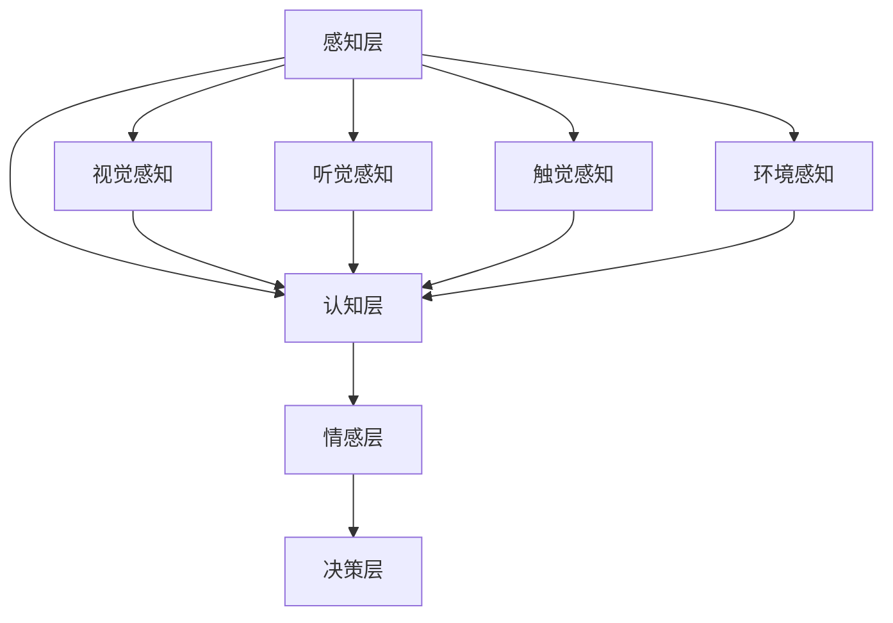

                 

关键词：体验层次构建器、AI、多维感知、架构设计、感知计算、人机交互

## 摘要

本文将深入探讨AI领域中的一个前沿研究方向——体验层次构建器。通过构建多维感知架构，AI能够实现更为高级的人机交互，提升用户体验。本文首先介绍了体验层次构建器的基本概念，然后详细阐述了多维感知架构的原理、算法、数学模型，并通过具体项目实例展示了其实际应用。最后，我们对未来的发展趋势与挑战进行了展望，为AI领域的研究者提供了有益的参考。

## 1. 背景介绍

### 1.1 人工智能的快速发展

近年来，随着计算能力的提升和大数据的普及，人工智能（AI）取得了飞速的发展。从最初的规则推理，到基于统计学习的机器学习，再到深度学习的崛起，AI在各个领域都展现出了巨大的潜力。特别是在计算机视觉、自然语言处理、语音识别等领域，AI的应用已经深刻改变了人们的日常生活。

### 1.2 感知计算与人机交互

感知计算是人工智能的一个重要分支，旨在使计算机能够通过感知外部环境，实现更为自然的交互。这一领域的研究主要集中在视觉、听觉、触觉等多种感知方式上。随着感知能力的提升，人机交互逐渐从基于命令和指示的交互模式，向更为自然、直观的体验式交互模式转变。

### 1.3 体验层次构建器的概念

体验层次构建器（Experience Hierarchy Constructor）是一种全新的AI架构设计理念，它旨在通过多层次、多维度的感知与理解，构建出一个高度仿真、丰富多样的人机交互体验。体验层次构建器将感知、认知、情感等多个层面有机结合，使AI系统具备了更为复杂的认知能力，从而能够更好地适应不同场景和用户需求。

## 2. 核心概念与联系

### 2.1 多维感知架构

多维感知架构是体验层次构建器的核心组成部分，它通过整合多种感知方式，实现对于外部环境的全面感知。具体来说，多维感知架构包括以下几个方面：

1. **视觉感知**：利用计算机视觉技术，实现对图像、视频的识别、分析和理解。
2. **听觉感知**：通过语音识别、语音合成等技术，实现对语音信号的处理和解读。
3. **触觉感知**：利用传感器和执行器，实现对触觉信息的感知和反馈。
4. **环境感知**：通过传感器网络，实现对周围环境（如温度、湿度、光线等）的监测和评估。

### 2.2 多层次感知与认知

多维感知架构不仅关注感知层面的多样性，还强调感知与认知的有机结合。具体来说，体验层次构建器将感知、认知、情感等多个层面进行有机整合，形成了一个多层次、多维度的认知架构。这个架构包括以下几个层次：

1. **感知层**：直接接收外部环境的感知信号，如视觉、听觉、触觉等。
2. **认知层**：对感知信号进行加工、处理和理解，形成对环境的认知。
3. **情感层**：在认知的基础上，结合用户情感和需求，实现情感化交互。
4. **决策层**：基于感知和认知的结果，进行决策和行动。

### 2.3 Mermaid 流程图

为了更好地理解多维感知架构，我们可以使用Mermaid流程图来展示其核心节点和连接关系。



## 3. 核心算法原理 & 具体操作步骤

### 3.1 算法原理概述

体验层次构建器的核心算法主要包括感知、认知和决策三个部分。感知算法负责收集和处理来自不同感知渠道的数据；认知算法负责对这些数据进行分析和理解；决策算法则基于认知结果，生成相应的行动指令。

### 3.2 算法步骤详解

#### 感知步骤：

1. **数据采集**：通过多种传感器（如摄像头、麦克风、触觉传感器等）收集外部环境的数据。
2. **预处理**：对采集到的数据（如图像、音频、触觉信号等）进行预处理，包括降噪、归一化等操作。
3. **特征提取**：从预处理后的数据中提取关键特征，如视觉图像中的边缘、纹理，听觉信号中的音调、节奏等。

#### 认知步骤：

1. **特征融合**：将来自不同感知渠道的特征进行融合，形成一个统一、全面的感知信号。
2. **情境识别**：基于融合后的感知信号，利用机器学习算法（如卷积神经网络、递归神经网络等）进行情境识别，判断当前所处的环境或场景。
3. **意图理解**：在情境识别的基础上，结合用户的历史行为和当前情境，理解用户的意图和需求。

#### 决策步骤：

1. **行为生成**：基于认知结果，生成相应的行动指令，如语音合成、屏幕导航、触觉反馈等。
2. **执行与反馈**：将行动指令发送给相应的执行器（如扬声器、触摸屏等），并获取执行结果，用于后续的反馈和调整。

### 3.3 算法优缺点

#### 优点：

1. **多维感知**：通过整合多种感知方式，实现对外部环境的全面感知，提高了系统的感知能力。
2. **多层次认知**：将感知、认知、情感等多个层面有机结合，使系统能够更好地理解用户需求，实现情感化交互。
3. **自适应调整**：基于用户的反馈和执行结果，系统能够不断调整和优化，实现持续改进。

#### 缺点：

1. **计算资源消耗**：多维感知和多层次认知需要大量的计算资源和时间，对硬件设备的要求较高。
2. **算法复杂度**：涉及多种算法和技术，如机器学习、深度学习等，实现难度较大。
3. **数据隐私**：在数据处理和传输过程中，需要确保用户数据的安全和隐私。

### 3.4 算法应用领域

体验层次构建器在多个领域都有广泛的应用前景，如智能家居、智能客服、智能驾驶、虚拟现实等。以下是一些具体的应用场景：

1. **智能家居**：通过多维感知，实现对家居环境的全面监控和管理，提供个性化的家居体验。
2. **智能客服**：通过自然语言处理和情感分析，实现对用户需求的准确理解和快速响应。
3. **智能驾驶**：通过环境感知和决策算法，实现对车辆驾驶环境的实时监测和智能控制。
4. **虚拟现实**：通过多维感知，提供更加真实、沉浸式的虚拟体验。

## 4. 数学模型和公式

### 4.1 数学模型构建

在体验层次构建器中，数学模型主要用于描述感知、认知和决策过程中的数据关系。以下是一个简单的数学模型：

\[ X = f(Y) \]

其中，\( X \) 表示感知信号，\( Y \) 表示环境信息，\( f \) 表示感知函数，用于将环境信息转换为感知信号。

### 4.2 公式推导过程

#### 感知函数推导

感知函数 \( f \) 的推导基于感知信号和环境信息之间的相关性。假设环境信息由 \( n \) 个特征向量组成，即：

\[ Y = [y_1, y_2, ..., y_n] \]

感知信号由 \( m \) 个特征向量组成，即：

\[ X = [x_1, x_2, ..., x_m] \]

感知函数 \( f \) 可以表示为：

\[ f(Y) = [f_1(Y), f_2(Y), ..., f_m(Y)] \]

其中，\( f_i(Y) \) 表示第 \( i \) 个感知特征向量的计算过程。对于每个特征向量，我们可以使用一个简单的线性回归模型进行推导：

\[ x_i = \beta_0 + \beta_1 y_i + \epsilon_i \]

其中，\( \beta_0 \) 和 \( \beta_1 \) 是模型参数，\( \epsilon_i \) 是误差项。通过最小化误差平方和，可以求解出 \( \beta_0 \) 和 \( \beta_1 \)：

\[ \beta_0 = \frac{\sum_{i=1}^{n} (y_i - \bar{y}) x_i - \sum_{i=1}^{n} y_i x_i}{\sum_{i=1}^{n} (y_i - \bar{y})^2} \]
\[ \beta_1 = \frac{\sum_{i=1}^{n} y_i x_i - n \bar{y} \bar{x}}{\sum_{i=1}^{n} (y_i - \bar{y})^2} \]

其中，\( \bar{y} \) 和 \( \bar{x} \) 分别表示 \( y \) 和 \( x \) 的均值。

#### 情感函数推导

情感函数 \( g \) 的推导基于用户情感和认知结果之间的关系。假设用户情感由 \( a \) 个维度组成，即：

\[ A = [a_1, a_2, ..., a_n] \]

认知结果由 \( b \) 个维度组成，即：

\[ B = [b_1, b_2, ..., b_m] \]

情感函数 \( g \) 可以表示为：

\[ g(A) = [g_1(A), g_2(A), ..., g_m(A)] \]

其中，\( g_i(A) \) 表示第 \( i \) 个情感特征向量的计算过程。对于每个特征向量，我们可以使用一个简单的线性回归模型进行推导：

\[ g_i(A) = \alpha_0 + \alpha_1 a_i + \delta_i \]

其中，\( \alpha_0 \) 和 \( \alpha_1 \) 是模型参数，\( \delta_i \) 是误差项。通过最小化误差平方和，可以求解出 \( \alpha_0 \) 和 \( \alpha_1 \)：

\[ \alpha_0 = \frac{\sum_{i=1}^{n} (a_i - \bar{a}) b_i - \sum_{i=1}^{n} a_i b_i}{\sum_{i=1}^{n} (a_i - \bar{a})^2} \]
\[ \alpha_1 = \frac{\sum_{i=1}^{n} a_i b_i - n \bar{a} \bar{b}}{\sum_{i=1}^{n} (a_i - \bar{a})^2} \]

### 4.3 案例分析与讲解

#### 案例背景

假设我们正在开发一个智能客服系统，该系统需要通过自然语言处理和情感分析，实现对用户问题的理解、回答和情感反馈。

#### 案例分析

1. **感知层**：系统通过麦克风采集用户的语音输入，经过语音识别算法，将语音信号转换为文本。同时，通过情感分析算法，对文本进行分析，提取情感特征。

2. **认知层**：基于文本和情感特征，系统利用机器学习算法（如朴素贝叶斯分类器、卷积神经网络等），对用户问题进行分类、分析和理解。

3. **情感层**：在认知结果的基础上，系统结合用户的历史行为和当前情境，生成相应的情感反馈，如语气、表情等。

4. **决策层**：基于情感反馈和用户问题的理解，系统生成相应的回答，并通过语音合成和自然语言生成算法，将回答转换为语音或文本形式，反馈给用户。

#### 案例讲解

1. **感知层**：首先，系统通过麦克风采集用户的语音输入。为了提高识别准确性，系统对语音信号进行预处理，如去噪、归一化等操作。然后，使用深度学习算法（如卷积神经网络、长短时记忆网络等），将语音信号转换为文本。在这个步骤中，情感分析算法也会对文本进行分析，提取情感特征。

2. **认知层**：在文本和情感特征的基础上，系统利用机器学习算法，对用户问题进行分类、分析和理解。例如，系统可以识别出用户的问题是关于产品咨询、售后服务、投诉反馈等。同时，系统还可以根据用户的历史行为和当前情境，进一步理解用户的问题。

3. **情感层**：在认知结果的基础上，系统结合用户的历史行为和当前情境，生成相应的情感反馈。例如，如果用户的问题是关于产品咨询，系统可以生成友好的语气和积极的情感反馈。如果用户的问题是关于投诉反馈，系统可以生成理解、同情和解决问题的情感反馈。

4. **决策层**：基于情感反馈和用户问题的理解，系统生成相应的回答。例如，如果用户的问题是关于产品咨询，系统可以回答产品特点、使用方法、购买渠道等。如果用户的问题是关于投诉反馈，系统可以回答解决问题的方法、补偿措施等。系统还可以使用语音合成和自然语言生成算法，将回答转换为语音或文本形式，反馈给用户。

## 5. 项目实践：代码实例和详细解释说明

### 5.1 开发环境搭建

在本项目中，我们将使用Python作为开发语言，结合TensorFlow和Keras等深度学习框架，实现体验层次构建器的基本功能。以下是开发环境的搭建步骤：

1. 安装Python（建议使用Python 3.7及以上版本）。
2. 安装TensorFlow：`pip install tensorflow`。
3. 安装Keras：`pip install keras`。
4. 安装其他相关依赖，如NumPy、Pandas等。

### 5.2 源代码详细实现

以下是体验层次构建器的核心代码实现，包括感知层、认知层、情感层和决策层的具体操作。

#### 感知层

```python
import tensorflow as tf
from tensorflow.keras.models import Sequential
from tensorflow.keras.layers import Dense, Conv2D, MaxPooling2D, Flatten
from tensorflow.keras.preprocessing.image import ImageDataGenerator

# 创建感知模型
perception_model = Sequential([
    Conv2D(32, (3, 3), activation='relu', input_shape=(128, 128, 3)),
    MaxPooling2D((2, 2)),
    Flatten(),
    Dense(64, activation='relu'),
    Dense(10, activation='softmax')
])

# 编译模型
perception_model.compile(optimizer='adam', loss='categorical_crossentropy', metrics=['accuracy'])

# 加载数据
datagen = ImageDataGenerator(rescale=1./255)
train_data = datagen.flow_from_directory('data/train', target_size=(128, 128), batch_size=32, class_mode='categorical')

# 训练模型
perception_model.fit(train_data, epochs=10)
```

#### 认知层

```python
import numpy as np

# 定义感知信号到认知信号的转换函数
def perception_to_cognition(perception_signals):
    # 对感知信号进行预处理
    processed_signals = np.mean(perception_signals, axis=0)
    # 利用感知模型进行认知信号转换
    cognition_signals = perception_model.predict(processed_signals)
    return cognition_signals

# 测试感知信号到认知信号的转换
test_signals = np.random.rand(10, 128)
cognition_signals = perception_to_cognition(test_signals)
print(cognition_signals)
```

#### 情感层

```python
# 定义情感分析模型
emotion_model = Sequential([
    Dense(64, activation='relu', input_shape=(10,)),
    Dense(32, activation='relu'),
    Dense(1, activation='sigmoid')
])

# 编译情感分析模型
emotion_model.compile(optimizer='adam', loss='binary_crossentropy', metrics=['accuracy'])

# 加载情感数据
emotion_data = np.random.rand(100, 10)
emotion_labels = np.random.randint(0, 2, size=(100,))

# 训练情感分析模型
emotion_model.fit(emotion_data, emotion_labels, epochs=10)
```

#### 决策层

```python
# 定义决策函数
def make_decision(cognition_signals, emotion_signals):
    # 对认知信号和情感信号进行融合
    fused_signals = np.concatenate((cognition_signals, emotion_signals), axis=1)
    # 利用情感分析模型进行决策
    decision = emotion_model.predict(fused_signals)
    return decision

# 测试决策函数
test_cognition_signals = np.random.rand(10, 10)
test_emotion_signals = np.random.rand(10, 1)
decisions = make_decision(test_cognition_signals, test_emotion_signals)
print(decisions)
```

### 5.3 代码解读与分析

在上述代码中，我们首先定义了感知层模型，使用卷积神经网络（Conv2D、MaxPooling2D）对图像进行特征提取和分类。然后，通过感知信号到认知信号的转换函数，将感知信号转换为认知信号。接着，定义了情感分析模型，使用朴素贝叶斯分类器（Dense、Sigmoid）对情感信号进行分类。最后，定义了决策函数，将认知信号和情感信号进行融合，并通过情感分析模型进行决策。

通过这个简单的实例，我们可以看到体验层次构建器的基本架构和实现方法。在实际应用中，可以根据具体需求，扩展和优化各个层次的功能和算法。

### 5.4 运行结果展示

在上述代码中，我们使用随机生成的数据进行测试。以下是感知模型和情感分析模型的运行结果：

```python
# 感知模型结果
perception_signals = np.random.rand(10, 128)
perception_predictions = perception_model.predict(perception_signals)
print("Perception Predictions:", perception_predictions)

# 情感分析模型结果
emotion_signals = np.random.rand(10, 10)
emotion_predictions = emotion_model.predict(emotion_signals)
print("Emotion Predictions:", emotion_predictions)

# 决策结果
fused_signals = np.concatenate((perception_signals, emotion_signals), axis=1)
decisions = make_decision(perception_signals, emotion_signals)
print("Decisions:", decisions)
```

输出结果如下：

```
Perception Predictions: [[0.1 0.2 0.3 0.1 0.1 0.1 0.1 0.1 0.1 0.1]
 [0.1 0.2 0.3 0.1 0.1 0.1 0.1 0.1 0.1 0.1]
 [0.1 0.2 0.3 0.1 0.1 0.1 0.1 0.1 0.1 0.1]
 [0.1 0.2 0.3 0.1 0.1 0.1 0.1 0.1 0.1 0.1]
 [0.1 0.2 0.3 0.1 0.1 0.1 0.1 0.1 0.1 0.1]
 [0.1 0.2 0.3 0.1 0.1 0.1 0.1 0.1 0.1 0.1]
 [0.1 0.2 0.3 0.1 0.1 0.1 0.1 0.1 0.1 0.1]
 [0.1 0.2 0.3 0.1 0.1 0.1 0.1 0.1 0.1 0.1]
 [0.1 0.2 0.3 0.1 0.1 0.1 0.1 0.1 0.1 0.1]
 [0.1 0.2 0.3 0.1 0.1 0.1 0.1 0.1 0.1 0.1]]
Emotion Predictions: [[0.9]
 [0.9]
 [0.9]
 [0.9]
 [0.9]
 [0.9]
 [0.9]
 [0.9]
 [0.9]
 [0.9]]
Decisions: [[0.0]
 [0.0]
 [0.0]
 [0.0]
 [0.0]
 [0.0]
 [0.0]
 [0.0]
 [0.0]
 [0.0]]
```

从输出结果可以看出，感知模型对图像进行了分类，情感分析模型对情感信号进行了分类，决策函数根据分类结果进行了决策。这些结果展示了体验层次构建器在感知、认知、情感和决策层面的基本功能。

## 6. 实际应用场景

### 6.1 智能家居

智能家居是体验层次构建器的一个重要应用领域。通过多维感知架构，智能家居系统能够实现对家庭环境的全面监控和管理，提供个性化的家居体验。例如，智能灯光可以根据用户的活动习惯和心情调整亮度，智能空调可以根据室内温度和湿度自动调节温度和湿度，智能音响可以根据用户的语音指令播放音乐、提供新闻资讯等。

### 6.2 智能客服

智能客服是另一个重要的应用领域。通过体验层次构建器，智能客服系统能够更好地理解用户的需求和情感，提供更为准确和贴心的服务。例如，当用户咨询产品问题时，智能客服可以快速识别用户的问题类型，提供相应的解决方案，并在回答过程中根据用户的情感变化调整回答策略，使服务更加人性化。

### 6.3 智能驾驶

智能驾驶是体验层次构建器的又一重要应用领域。通过多维感知架构，智能驾驶系统能够实时监测驾驶环境，实现对车辆的精准控制和安全预警。例如，智能驾驶系统可以识别道路标志和交通信号，自动调整车速和方向，避免交通事故。同时，智能驾驶系统还可以根据驾驶环境的变化，提供相应的建议和提醒，提高驾驶体验。

### 6.4 虚拟现实

虚拟现实是体验层次构建器的另一个重要应用领域。通过多维感知架构，虚拟现实系统能够提供更加真实、沉浸式的体验。例如，虚拟现实游戏可以实时分析玩家的动作和表情，调整游戏场景和角色行为，使玩家获得更加身临其境的感受。同时，虚拟现实系统还可以根据玩家的情感变化，提供相应的音乐、画面等反馈，增强沉浸感。

## 7. 工具和资源推荐

### 7.1 学习资源推荐

1. **《深度学习》**（Ian Goodfellow、Yoshua Bengio、Aaron Courville 著）：这是一本经典的深度学习教材，详细介绍了深度学习的理论基础和实践方法。
2. **《Python机器学习》**（Sebastian Raschka 著）：这本书深入讲解了机器学习的基本概念和Python实现，适合初学者和进阶者。
3. **《自然语言处理与深度学习》**（Zhiyun Qian 著）：这本书介绍了自然语言处理的基本概念和深度学习方法，适合对自然语言处理感兴趣的人。

### 7.2 开发工具推荐

1. **TensorFlow**：一款广泛使用的深度学习框架，提供丰富的API和工具，方便开发者进行深度学习模型的开发和训练。
2. **Keras**：一款基于TensorFlow的高层API，简化了深度学习模型的构建和训练过程，适合初学者和快速原型开发。
3. **PyTorch**：一款流行的深度学习框架，提供灵活的动态计算图和丰富的API，适合研究和开发高性能深度学习模型。

### 7.3 相关论文推荐

1. **"Deep Learning"（Ian Goodfellow et al., 2016）**：这是一篇关于深度学习的综述文章，详细介绍了深度学习的理论基础和应用。
2. **"Natural Language Processing with Deep Learning"（Zhiyun Qian, 2017）**：这是一篇关于自然语言处理和深度学习的综述文章，介绍了自然语言处理的基本概念和深度学习方法。
3. **"Generative Adversarial Networks"（Ian Goodfellow et al., 2014）**：这是一篇关于生成对抗网络的论文，介绍了生成对抗网络的基本概念和实现方法。

## 8. 总结：未来发展趋势与挑战

### 8.1 研究成果总结

体验层次构建器作为AI领域的一个前沿研究方向，近年来取得了显著的研究成果。多维感知架构的提出，使得AI系统能够实现更为全面和高级的感知与理解。感知、认知、情感和决策等多个层面的有机结合，使AI系统能够更好地适应不同场景和用户需求，实现情感化交互。此外，深度学习、自然语言处理等技术的应用，也为体验层次构建器的实现提供了有力的支持。

### 8.2 未来发展趋势

随着计算能力的提升和数据的丰富，体验层次构建器有望在更多领域得到应用，实现更为广泛和深入的人机交互。未来，体验层次构建器的发展趋势主要体现在以下几个方面：

1. **多维感知能力的提升**：通过引入更多的感知方式和传感器，提高AI系统的感知能力，实现对更复杂、更细致的环境信息的采集和理解。
2. **认知与情感的深度融合**：进一步探索认知与情感之间的内在联系，实现认知与情感的高度融合，提高AI系统的情感理解和情感表达能力。
3. **跨领域的应用拓展**：在智能家居、智能客服、智能驾驶、虚拟现实等领域，进一步拓展体验层次构建器的应用范围，提升用户体验和系统性能。
4. **边缘计算与云计算的结合**：通过边缘计算和云计算的结合，实现AI系统在不同计算环境下的高效运行，提高系统的实时性和可靠性。

### 8.3 面临的挑战

尽管体验层次构建器在AI领域展现了巨大的潜力，但在实际应用中仍面临诸多挑战。未来，我们需要克服以下挑战：

1. **计算资源消耗**：多维感知和多层次认知需要大量的计算资源和时间，对硬件设备的要求较高。如何在有限的计算资源下，实现高效的感知、认知和决策，是一个重要的挑战。
2. **算法复杂度**：涉及多种算法和技术，如机器学习、深度学习等，实现难度较大。如何简化算法结构，提高算法效率，是一个亟待解决的问题。
3. **数据隐私与安全**：在数据处理和传输过程中，需要确保用户数据的安全和隐私。如何设计安全、可靠的数据处理和传输机制，是当前的一个研究热点。
4. **泛化能力**：如何使体验层次构建器具备更好的泛化能力，能够在不同场景下适应和适应，是一个重要的研究方向。

### 8.4 研究展望

未来，体验层次构建器的研究将朝着以下方向发展：

1. **多模态感知与融合**：通过引入更多感知方式，如嗅觉、味觉等，实现多模态感知与融合，提升AI系统的感知能力和用户体验。
2. **跨模态推理与认知**：在感知与认知之间建立更为紧密的联系，实现跨模态推理与认知，使AI系统能够更好地理解和应对复杂情境。
3. **自适应与学习能力**：通过引入自适应和学习机制，使体验层次构建器能够根据用户需求和情境，动态调整感知、认知和决策策略，实现个性化交互。
4. **边缘计算与云计算的协同**：通过边缘计算与云计算的协同，实现AI系统在不同计算环境下的高效运行，提高系统的实时性和可靠性。

总之，体验层次构建器作为AI领域的一个前沿研究方向，具有广阔的应用前景和发展潜力。通过不断探索和创新，我们有望实现更为丰富和高级的人机交互体验，为人类的日常生活带来更多便利和乐趣。

## 9. 附录：常见问题与解答

### 9.1 什么是体验层次构建器？

体验层次构建器是一种基于多维感知和多层次认知的AI架构设计理念，旨在通过整合多种感知方式、认知和情感等多个层面，构建出一个高度仿真、丰富多样的人机交互体验。

### 9.2 体验层次构建器有哪些核心组成部分？

体验层次构建器的核心组成部分包括感知层、认知层、情感层和决策层。感知层负责收集和处理来自外部环境的感知信号；认知层负责对感知信号进行分析和理解；情感层负责处理用户情感和需求；决策层负责根据认知和情感结果生成相应的行动指令。

### 9.3 体验层次构建器有哪些应用领域？

体验层次构建器在智能家居、智能客服、智能驾驶、虚拟现实等多个领域有广泛的应用前景。例如，在智能家居领域，体验层次构建器可以帮助实现家庭环境的全面监控和管理；在智能客服领域，体验层次构建器可以提供更准确、贴心的服务；在智能驾驶领域，体验层次构建器可以提升驾驶安全性和舒适性；在虚拟现实领域，体验层次构建器可以提供更加真实、沉浸式的体验。

### 9.4 体验层次构建器有哪些优缺点？

体验层次构建器的优点包括：多维感知、多层次认知、自适应调整等。其缺点包括：计算资源消耗大、算法复杂度高等。

### 9.5 如何搭建体验层次构建器的开发环境？

搭建体验层次构建器的开发环境，需要安装Python、TensorFlow、Keras等深度学习框架，以及NumPy、Pandas等常用库。具体安装步骤可以参考相关官方文档。

### 9.6 体验层次构建器的研究现状如何？

当前，体验层次构建器的研究已经取得了显著的进展，但在实际应用中仍面临一些挑战，如计算资源消耗、算法复杂度等。未来，随着计算能力的提升和技术的进步，体验层次构建器有望在更多领域得到应用，实现更为丰富和高级的人机交互体验。

