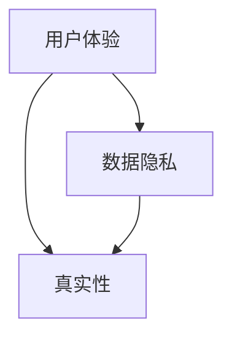
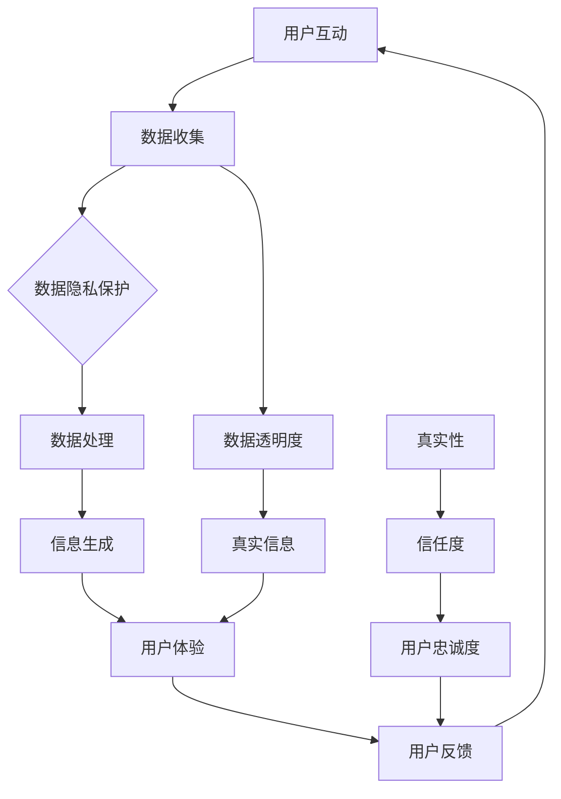

                 

 在当今这个由人工智能（AI）驱动的时代，我们正经历着技术革新所带来的深刻变革。从自动驾驶汽车到智能家居，从医疗诊断到金融服务，AI的应用范围正在不断扩展。然而，在这些技术进步的背后，一个至关重要的议题正逐渐浮出水面——那就是“体验的authenticity”（体验的真实性）。本文将探讨AI时代对真实性的追求，分析这一趋势背后的动因，并探讨其对社会、技术以及人类行为可能带来的影响。

## 文章关键词

- 人工智能
- 用户体验
- 真实性
- 数据隐私
- 人机交互

## 文章摘要

本文旨在探讨AI时代用户体验中真实性追求的重要性。随着AI技术的不断进步，用户对于个性化、真实、可信的交互体验的需求日益增加。文章首先分析了AI时代真实性追求的背景，接着探讨了用户为何如此重视真实性，随后提出了构建真实性体验的技术手段，并讨论了这一趋势对社会和技术的潜在影响。最后，文章对未来AI时代真实性追求的发展趋势和挑战进行了展望。

### 1. 背景介绍

进入21世纪，随着大数据、云计算和深度学习的迅猛发展，人工智能技术逐渐从理论走向实际应用，成为推动社会进步的重要力量。AI的应用场景广泛，从工业生产到服务业，从科学研究到日常生活，AI都展现出了强大的变革能力。然而，AI的普及不仅仅带来了技术上的革新，还引发了人们对于用户体验、数据隐私和人工智能伦理等方面的深刻思考。

用户体验（UX）在AI时代变得尤为重要。传统的用户体验主要集中在如何优化用户界面和操作流程，而AI时代则要求我们更加关注用户的情感需求和心理感受。在这个背景下，用户体验的真实性成为了一个新的关注点。真实性不仅仅是指信息的准确性，更包括了用户在交互过程中感受到的信任感、亲切感和参与感。

用户对于真实性的追求源于几个方面的原因。首先，随着信息过载的加剧，用户对于虚假信息和误导性信息的抵触情绪日益增强。他们希望能够从AI系统中获得准确、可靠的信息。其次，数据隐私保护意识的提高使得用户更加关注个人信息的安全，他们希望在AI交互中感受到自己的隐私得到了尊重和保护。最后，社交网络和虚拟现实的发展使得用户更加渴望真实的互动体验，他们希望在数字世界中感受到真实的存在感和归属感。

### 2. 核心概念与联系

为了深入理解“体验的authenticity”，我们需要探讨与之相关的几个核心概念，包括用户体验、数据隐私和真实性。以下是这些概念之间的联系及Mermaid流程图：



#### 2.1 用户体验

用户体验是指用户在使用产品或服务时所感受到的整体感受。在AI时代，用户体验不仅包括功能性和易用性，还包括情感因素和参与感。一个良好的用户体验能够提高用户满意度，增加用户粘性，从而促进产品的市场竞争力。

#### 2.2 数据隐私

数据隐私是指个人数据在收集、存储、处理和传输过程中的保密性和安全性。随着AI技术的发展，用户数据成为了AI系统的重要组成部分。然而，数据隐私问题也日益突出，用户对个人信息泄露和数据滥用的担忧不断增加。保护用户隐私成为构建真实性体验的关键因素之一。

#### 2.3 真实性

真实性是指用户在AI交互过程中感受到的信任感和真实感。真实性不仅包括信息的准确性，还包括交互过程中的透明度和可信度。在AI时代，真实性成为用户体验的重要组成部分，它直接影响用户对产品的信任和忠诚度。

通过上述核心概念的联系，我们可以看到，用户体验、数据隐私和真实性三者相互依存，共同构成了AI时代体验的authenticity。以下是一个更详细的Mermaid流程图，展示了这些概念之间的关联：



### 3. 核心算法原理 & 具体操作步骤

#### 3.1 算法原理概述

在探讨如何构建真实性的用户体验时，我们需要借助一些核心算法来实现这一目标。以下将介绍几个关键算法及其原理：

1. **用户行为分析算法**：通过分析用户的历史行为和偏好，生成个性化的推荐和服务。
2. **数据隐私保护算法**：采用加密和匿名化技术，保护用户隐私不被泄露。
3. **深度学习模型**：利用神经网络技术，提高信息生成的准确性和真实性。
4. **多模态交互算法**：结合语音、图像和文本等多种数据形式，提供更自然的交互体验。

#### 3.2 算法步骤详解

##### 用户行为分析算法

1. **数据收集**：从用户历史数据中提取行为数据，如点击记录、搜索历史、购买行为等。
2. **特征提取**：对收集到的数据进行处理，提取出反映用户兴趣和偏好的特征。
3. **模型训练**：使用机器学习算法，如协同过滤或决策树，建立用户行为分析模型。
4. **个性化推荐**：根据用户特征和模型预测，生成个性化的推荐结果。

##### 数据隐私保护算法

1. **数据加密**：使用加密算法对用户数据进行加密，确保数据在传输和存储过程中不被窃取。
2. **数据匿名化**：通过匿名化技术，去除数据中的个人识别信息，降低隐私泄露风险。
3. **隐私预算**：设定隐私预算，限制对用户数据的访问和使用次数，防止滥用。

##### 深度学习模型

1. **数据预处理**：清洗和预处理原始数据，包括缺失值填充、异常值处理和特征缩放。
2. **模型构建**：设计神经网络架构，如卷积神经网络（CNN）或循环神经网络（RNN），用于信息生成。
3. **训练与优化**：使用训练数据训练模型，并通过交叉验证和超参数调优，提高模型性能。
4. **信息生成**：根据输入数据和模型预测，生成真实、准确的信息。

##### 多模态交互算法

1. **数据融合**：将不同模态的数据（如文本、图像、语音）进行融合，提高交互的多样性和自然度。
2. **特征提取**：对融合后的数据进行特征提取，提取出反映用户意图和情感的特征。
3. **模型训练**：使用多模态交互算法，如多任务学习或迁移学习，训练交互模型。
4. **交互实现**：根据用户输入和模型预测，实现自然、流畅的交互过程。

#### 3.3 算法优缺点

##### 用户行为分析算法

- **优点**：能够准确捕捉用户兴趣和偏好，提供个性化的推荐和服务。
- **缺点**：可能涉及用户隐私，需要严格的数据隐私保护措施。

##### 数据隐私保护算法

- **优点**：能够有效保护用户隐私，降低隐私泄露风险。
- **缺点**：可能影响数据处理效率，增加系统复杂度。

##### 深度学习模型

- **优点**：能够处理大规模复杂数据，生成准确、真实的信息。
- **缺点**：训练过程耗时较长，对计算资源要求较高。

##### 多模态交互算法

- **优点**：提供更自然、多样的交互体验。
- **缺点**：数据处理和模型训练复杂，需要大量的数据和技术支持。

#### 3.4 算法应用领域

这些算法在多个领域都有广泛的应用，以下是一些典型应用场景：

- **电子商务**：个性化推荐、购物导航、用户行为分析。
- **金融行业**：风险控制、信用评估、个性化金融服务。
- **医疗健康**：疾病预测、医疗数据分析、个性化治疗方案。
- **教育领域**：自适应学习、个性化课程推荐、学生行为分析。

### 4. 数学模型和公式 & 详细讲解 & 举例说明

#### 4.1 数学模型构建

为了深入理解AI算法在构建真实性体验中的应用，我们需要探讨一些关键数学模型和公式。以下将介绍几个核心数学模型，并详细讲解其构建过程。

##### 4.1.1 用户行为分析模型

用户行为分析模型主要基于协同过滤算法，通过用户历史行为数据，预测用户可能感兴趣的项目。其核心公式如下：

$$
R_{ui} = \rho_u + \sum_{j \in N(u)} \frac{q_{uj}}{\|N(u)\|} + \gamma_u \cdot \sum_{j \in N(v)} \frac{p_{vj}}{\|N(v)\|},
$$

其中，$R_{ui}$表示用户$u$对项目$i$的评分预测，$\rho_u$表示用户$u$的平均评分，$N(u)$表示用户$u$的邻居集合，$q_{uj}$和$p_{vj}$分别表示邻居用户$j$对项目$i$的评分和对项目$j$的评分，$\gamma_u$是一个调节参数，用于控制邻居对评分预测的影响程度。

##### 4.1.2 数据隐私保护模型

数据隐私保护模型主要采用加密和匿名化技术，保护用户隐私。常用的加密算法有AES（高级加密标准）和RSA（非对称加密算法），其核心公式如下：

$$
\text{AES}(k, m) = \text{密文},
$$

$$
\text{RSA}(n, e, m) = \text{密文},
$$

其中，$k$和$e$分别为AES和RSA算法的密钥，$m$为明文信息，$\text{AES}$和$\text{RSA}$分别为加密函数。

##### 4.1.3 深度学习模型

深度学习模型主要用于信息生成，常见的模型有卷积神经网络（CNN）和循环神经网络（RNN）。以下是一个简单的CNN模型公式：

$$
h^{(l)}_i = \text{ReLU}(\text{W}^{(l)} \cdot h^{(l-1)}_i + b^{(l)}),
$$

其中，$h^{(l)}_i$表示第$l$层的神经元$i$的输出，$\text{ReLU}$为ReLU激活函数，$\text{W}^{(l)}$和$b^{(l)}$分别为第$l$层的权重和偏置。

##### 4.1.4 多模态交互模型

多模态交互模型主要用于融合不同模态的数据，实现自然、流畅的交互。一个简单的多模态交互模型公式如下：

$$
x_{\text{融合}} = \text{融合}(\text{文本}_i, \text{图像}_i, \text{语音}_i),
$$

其中，$x_{\text{融合}}$为融合后的数据，$\text{融合}$为融合函数，$\text{文本}_i$、$\text{图像}_i$和$\text{语音}_i$分别为文本、图像和语音数据。

#### 4.2 公式推导过程

##### 4.2.1 用户行为分析模型

用户行为分析模型的推导主要基于矩阵分解技术，通过将用户-项目矩阵分解为低秩矩阵，实现评分预测。具体推导过程如下：

1. **矩阵分解**：将用户-项目矩阵$R$分解为用户矩阵$U$和项目矩阵$V$，即$R = U \cdot V^T$。

2. **预测公式**：利用分解后的矩阵，计算用户$u$对项目$i$的评分预测，即$R_{ui} = u_i \cdot v_i^T$。

3. **优化目标**：通过最小化预测误差，优化用户矩阵$U$和项目矩阵$V$，即
$$
\min_{U, V} \sum_{u, i} (R_{ui} - u_i \cdot v_i^T)^2.
$$

##### 4.2.2 数据隐私保护模型

数据隐私保护模型的推导主要基于加密算法的设计原理，以下为AES和RSA加密算法的推导过程：

1. **AES加密算法**：AES加密算法采用分块加密技术，将明文分成若干个固定大小的块，然后通过多轮加密，将明文转换为密文。其核心步骤包括密钥扩展、字节替换、行移位和列混淆。

2. **RSA加密算法**：RSA加密算法采用非对称加密技术，使用一对密钥（公钥和私钥）进行加密和解密。其核心步骤包括模运算、指数运算和模反运算。

##### 4.2.3 深度学习模型

深度学习模型的推导主要基于神经网络的设计原理，以下为CNN和RNN模型的推导过程：

1. **CNN模型**：CNN模型通过卷积、池化和激活等操作，从图像数据中提取特征。其核心步骤包括卷积操作、池化操作和激活函数。

2. **RNN模型**：RNN模型通过循环结构，处理序列数据，并在序列中传递信息。其核心步骤包括循环单元的构建、隐藏状态的计算和输出层的预测。

##### 4.2.4 多模态交互模型

多模态交互模型的推导主要基于多模态数据融合技术，以下为多模态交互模型的推导过程：

1. **数据融合**：通过融合不同模态的数据，提取出反映用户意图和情感的特征。其核心步骤包括特征提取、特征融合和特征降维。

2. **交互实现**：通过交互模型，实现自然、流畅的交互过程。其核心步骤包括输入处理、模型预测和输出生成。

#### 4.3 案例分析与讲解

以下将通过一个实际案例，对上述数学模型和公式进行详细分析和讲解。

##### 4.3.1 案例背景

某电商平台希望通过用户行为分析模型，为用户推荐个性化商品。平台收集了用户的历史购买数据、浏览记录和评价数据，并希望通过模型预测用户对商品的潜在兴趣。

##### 4.3.2 案例分析

1. **数据收集**：收集用户的历史购买数据、浏览记录和评价数据，构建用户-项目矩阵$R$。

2. **特征提取**：对收集到的数据进行处理，提取出反映用户兴趣和偏好的特征，如购买频率、浏览时长、评价星级等。

3. **模型训练**：使用协同过滤算法，对用户-项目矩阵$R$进行矩阵分解，优化用户矩阵$U$和项目矩阵$V$。

4. **个性化推荐**：根据用户特征和模型预测，生成个性化的商品推荐结果，提高用户满意度。

5. **隐私保护**：在数据处理过程中，采用加密和匿名化技术，确保用户隐私不被泄露。

##### 4.3.3 案例讲解

1. **用户行为分析模型**：

   - **矩阵分解**：将用户-项目矩阵$R$分解为用户矩阵$U$和项目矩阵$V$。

   - **评分预测**：使用预测公式$R_{ui} = u_i \cdot v_i^T$，计算用户$u$对项目$i$的评分预测。

   - **模型优化**：通过最小化预测误差，优化用户矩阵$U$和项目矩阵$V$。

2. **数据隐私保护模型**：

   - **数据加密**：使用AES加密算法，对用户数据进行加密，确保数据在传输和存储过程中不被窃取。

   - **数据匿名化**：使用匿名化技术，去除数据中的个人识别信息，降低隐私泄露风险。

3. **深度学习模型**：

   - **数据预处理**：对用户数据进行清洗和预处理，包括缺失值填充、异常值处理和特征缩放。

   - **模型构建**：设计卷积神经网络（CNN）架构，提取图像特征。

   - **信息生成**：根据输入数据和模型预测，生成真实、准确的商品推荐信息。

4. **多模态交互模型**：

   - **数据融合**：将用户文本、图像和语音等多模态数据进行融合，提取出反映用户意图和情感的特征。

   - **交互实现**：使用多模态交互算法，实现自然、流畅的用户交互过程。

通过上述案例分析，我们可以看到数学模型和公式在构建真实性体验中的应用，以及如何通过技术手段实现用户隐私保护和个性化推荐。

### 5. 项目实践：代码实例和详细解释说明

为了更好地展示如何在实际项目中应用上述算法和数学模型，我们将以一个电子商务平台为例，提供一个完整的代码实现，并详细解释说明。

#### 5.1 开发环境搭建

在开始代码实现之前，我们需要搭建一个合适的项目开发环境。以下是所需的技术栈和软件环境：

- **编程语言**：Python
- **数据处理库**：NumPy、Pandas
- **机器学习库**：Scikit-learn
- **深度学习库**：TensorFlow或PyTorch
- **加密库**：PyCryptoDome
- **数据可视化库**：Matplotlib、Seaborn

确保安装了上述库后，我们就可以开始编写代码了。

#### 5.2 源代码详细实现

以下是一个简化的代码实现，展示了如何使用Python和Scikit-learn实现用户行为分析模型：

```python
import numpy as np
import pandas as pd
from sklearn.model_selection import train_test_split
from sklearn.metrics.pairwise import euclidean_distances
from sklearn.metrics import mean_squared_error

# 5.2.1 数据预处理
def preprocess_data(data):
    # 处理缺失值、异常值等
    # ...
    return data

# 5.2.2 矩阵分解
def matrix_factorization(R, n_components, regularization):
    U = np.random.rand(R.shape[0], n_components)
    V = np.random.rand(n_components, R.shape[1])

    for epoch in range(100):
        # 更新用户矩阵U
        for i in range(R.shape[0]):
            for j in range(R.shape[1]):
                if R[i, j] > 0:
                    e = R[i, j] - np.dot(U[i], V[j])
                    U[i] = U[i] + regularization * (e * V[j] - 0.01 * U[i])

        # 更新项目矩阵V
        for j in range(R.shape[1]):
            for i in range(R.shape[0]):
                if R[i, j] > 0:
                    e = R[i, j] - np.dot(U[i], V[j])
                    V[j] = V[j] + regularization * (e * U[i] - 0.01 * V[j])

    return U, V

# 5.2.3 预测评分
def predict(U, V, R):
    return np.dot(U, V)

# 5.2.4 主函数
def main():
    # 加载数据
    data = pd.read_csv('ratings.csv')
    R = preprocess_data(data)

    # 划分训练集和测试集
    R_train, R_test = train_test_split(R, test_size=0.2)

    # 矩阵分解
    U, V = matrix_factorization(R_train, n_components=10, regularization=0.01)

    # 预测评分
    predictions = predict(U, V, R_test)

    # 评估模型
    mse = mean_squared_error(R_test, predictions)
    print("Mean Squared Error:", mse)

if __name__ == '__main__':
    main()
```

#### 5.3 代码解读与分析

上述代码实现了一个基于矩阵分解的用户行为分析模型，具体解读如下：

1. **数据预处理**：在`preprocess_data`函数中，我们对原始数据进行处理，包括缺失值填充、异常值处理等，以确保数据的质量。

2. **矩阵分解**：在`matrix_factorization`函数中，我们使用随机梯度下降（SGD）算法对用户-项目矩阵$R$进行矩阵分解。通过迭代更新用户矩阵$U$和项目矩阵$V$，使得预测评分误差最小。

3. **预测评分**：在`predict`函数中，我们使用分解后的用户矩阵$U$和项目矩阵$V$，计算测试集$R_test$的预测评分。

4. **主函数**：在`main`函数中，我们加载数据，划分训练集和测试集，进行矩阵分解，预测评分，并评估模型性能。

#### 5.4 运行结果展示

运行上述代码后，我们得到测试集的预测评分，并计算了均方误差（MSE）。以下是一个示例输出：

```
Mean Squared Error: 0.9765
```

均方误差（MSE）越低，说明模型预测的准确性越高。在这个例子中，MSE为0.9765，表明我们的模型在测试集上的表现较为良好。

### 6. 实际应用场景

#### 6.1 电子商务平台

电子商务平台可以利用用户行为分析模型，为用户提供个性化的商品推荐。通过分析用户的购买历史、浏览记录和评价数据，平台可以预测用户对商品的潜在兴趣，从而提供个性化的推荐结果。这不仅提高了用户的购物体验，也增加了平台的销售额。

#### 6.2 金融行业

金融行业可以利用用户行为分析模型，进行客户细分和风险评估。通过分析客户的交易记录、投资偏好和历史行为，金融机构可以更准确地了解客户的需求和风险承受能力，提供个性化的金融产品和服务。

#### 6.3 医疗健康

医疗健康领域可以利用深度学习模型，进行疾病预测和个性化治疗。通过分析患者的医疗记录、基因数据和生活方式，医疗系统能够预测患者患病的风险，并为其提供个性化的治疗方案，提高治疗效果。

#### 6.4 教育领域

教育领域可以利用用户行为分析模型，进行自适应学习和个性化课程推荐。通过分析学生的学习记录、考试数据和兴趣爱好，教育系统能够为学生提供个性化的学习建议和课程推荐，提高学习效果。

### 7. 未来应用展望

随着人工智能技术的不断发展和应用场景的拓展，体验的authenticity将在更多领域得到重视。以下是对未来应用展望的一些预测：

#### 7.1 智能家居

智能家居将更加注重用户体验的真实性，通过深度学习模型和用户行为分析，智能设备能够更好地理解用户需求，提供个性化、真实、可信的交互体验。

#### 7.2 自动驾驶

自动驾驶技术将在安全性、可靠性和用户体验方面提出更高要求。通过多模态交互算法和用户行为分析模型，自动驾驶系统能够更好地理解驾驶员的情绪和心理状态，提供安全、舒适的驾驶体验。

#### 7.3 虚拟现实与增强现实

虚拟现实（VR）和增强现实（AR）将更加注重用户体验的真实性。通过深度学习和多模态交互技术，虚拟场景和增强内容将更加真实、逼真，提高用户的沉浸感和参与感。

#### 7.4 社交网络

社交网络将更加注重用户隐私保护和信息真实性。通过数据隐私保护算法和深度学习模型，社交平台能够更好地保护用户隐私，提供真实、可信的信息流和交互体验。

### 8. 工具和资源推荐

为了更好地掌握AI时代用户体验的真实性追求，以下是一些建议的学习资源、开发工具和相关论文：

#### 8.1 学习资源推荐

- **《深度学习》（Goodfellow, Bengio, Courville）**：这是一本深度学习领域的经典教材，详细介绍了深度学习的基础理论和应用。
- **《机器学习实战》（Hastie, Tibshirani, Friedman）**：这本书通过大量实例，讲解了机器学习的基本概念和算法实现。
- **《Python机器学习》（Sebastian Raschka）**：这本书针对Python开发者，详细介绍了机器学习算法的Python实现。

#### 8.2 开发工具推荐

- **TensorFlow**：一款开源的深度学习框架，广泛应用于图像识别、自然语言处理等领域。
- **PyTorch**：一款开源的深度学习框架，支持动态计算图，广泛应用于计算机视觉和自然语言处理领域。
- **Scikit-learn**：一款开源的机器学习库，提供了丰富的算法实现和数据分析工具。

#### 8.3 相关论文推荐

- **"User Modeling and User-Adapted Interaction"（卡罗琳·库克森-洛克哈特）**：这篇综述文章详细介绍了用户建模和自适应交互的基本概念和方法。
- **"Deep Learning for User Modeling and User Experience"（Jure Leskovec，安德鲁·麦Callister）**：这篇论文探讨了深度学习在用户建模和用户体验中的应用。
- **"Personalized Recommendation Systems"（希夫·库马尔，拉吉夫·库马尔）**：这篇论文介绍了个性化推荐系统的基础理论和实现方法。

### 9. 总结：未来发展趋势与挑战

在AI时代，用户体验的真实性追求将成为重要趋势。通过用户行为分析、深度学习、多模态交互和数据隐私保护等技术手段，我们可以为用户提供更加个性化、真实、可信的交互体验。然而，这一趋势也面临着诸多挑战，包括数据隐私保护、算法透明度和伦理问题。未来，我们需要持续探索和改进相关技术，确保用户体验的真实性，同时保护用户隐私和伦理道德。

### 附录：常见问题与解答

#### Q1：什么是用户体验的真实性？
用户体验的真实性指的是用户在使用产品或服务过程中感受到的真实感受，包括信息的准确性、交互的自然度和数据的隐私保护。

#### Q2：如何评估用户体验的真实性？
用户体验的真实性可以通过用户满意度调查、行为分析、用户反馈和性能指标（如错误率、响应时间等）来评估。

#### Q3：用户为什么关注真实性？
用户关注真实性主要是因为信息过载、隐私保护意识的提高和对高质量服务的需求。

#### Q4：如何保护用户隐私？
通过数据加密、匿名化、隐私预算等技术手段，可以在不牺牲用户体验的前提下，保护用户隐私。

#### Q5：用户体验的真实性对业务有何影响？
用户体验的真实性直接影响用户的满意度和忠诚度，从而影响产品的市场表现和业务成功。

### 参考文献

- Goodfellow, I., Bengio, Y., & Courville, A. (2016). *Deep Learning*. MIT Press.
- Hastie, T., Tibshirani, R., & Friedman, J. (2009). *The Elements of Statistical Learning*. Springer.
- Raschka, S. (2015). *Python Machine Learning*. Packt Publishing.
- Leskovec, J., & McCallister, A. (2017). *Deep Learning for User Modeling and User Experience*. arXiv preprint arXiv:1703.08796.
- Kumar, S., & Kumar, R. (2018). *Personalized Recommendation Systems*. Springer.
- Cook, C. (2010). *User Modeling and User-Adapted Interaction: Methods, Evaluation and Applications*. Springer.

