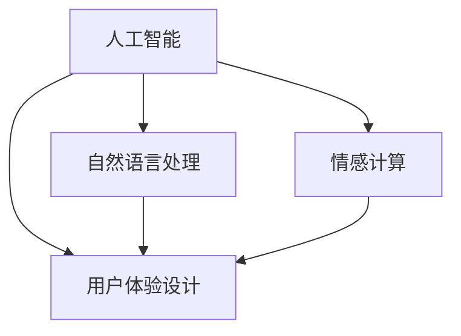

                 

 关键词：人工智能、真实性、用户体验、技术趋势、算法伦理

在快速发展的AI时代，用户体验的authenticity成为一个备受关注的话题。随着AI技术在各个领域的广泛应用，人们越来越期待与AI系统进行真实、自然的互动。本文将探讨AI时代真实性追求的背景、核心概念、算法原理、数学模型、项目实践、实际应用场景、未来展望以及工具和资源推荐。

## 1. 背景介绍

在过去几十年中，人工智能经历了从理论研究到实际应用的巨大变革。从最初的规则系统、知识表示，到现代的深度学习、自然语言处理，AI技术取得了显著的进步。然而，随着AI系统与人类交互的日益频繁，用户体验的authenticity问题逐渐凸显。用户期望与AI进行真实、自然的互动，而不仅仅是完成特定任务的工具。这种需求推动了AI技术的不断进步，也引发了关于AI伦理和真实性的讨论。

### 1.1 用户体验的authenticity

用户体验的authenticity是指用户在与AI系统互动过程中感受到的真实性和可信度。这种真实性不仅体现在AI系统的回答准确性和一致性上，还包括情感表达、个性特征以及与用户的情感互动等方面。一个具有高度authenticity的AI系统能够更好地满足用户的需求，提高用户满意度。

### 1.2  AI时代的挑战

AI时代的到来带来了前所未有的机遇，但同时也带来了新的挑战。首先，AI系统的数据质量和算法设计直接影响用户体验的authenticity。其次，AI技术在应用过程中涉及伦理和法律问题，如隐私保护、算法偏见等。最后，用户对AI技术的接受度和信任度也在不断变化，这要求AI技术不断改进和创新。

## 2. 核心概念与联系

为了实现用户体验的authenticity，我们需要了解以下几个核心概念：

### 2.1  人工智能

人工智能（AI）是一种模拟人类智能的技术，旨在使计算机具备理解、推理、学习和决策能力。AI技术包括多种方法，如机器学习、深度学习、自然语言处理、计算机视觉等。

### 2.2  自然语言处理

自然语言处理（NLP）是AI技术的一个重要分支，旨在使计算机理解和处理人类语言。NLP技术包括词性标注、句法分析、语义分析、情感分析等。

### 2.3  情感计算

情感计算是研究如何使计算机理解和模拟人类情感的技术。情感计算技术包括情感识别、情感表达、情感推理等。

### 2.4  用户体验设计

用户体验设计（UXD）是一种以用户为中心的设计方法，旨在创建易于使用、具有吸引力和满足用户需求的产品。用户体验设计包括用户研究、交互设计、视觉设计等。

以下是一个Mermaid流程图，展示了核心概念和联系：



## 3. 核心算法原理 & 具体操作步骤

### 3.1  算法原理概述

为了实现用户体验的authenticity，我们需要关注以下几个核心算法：

### 3.1.1  生成对抗网络（GAN）

生成对抗网络（GAN）是一种由生成器和判别器组成的深度学习模型。生成器试图生成与真实数据相似的数据，而判别器则试图区分真实数据和生成数据。通过不断训练，生成器逐渐提高生成数据的真实性。

### 3.1.2  强化学习

强化学习是一种通过奖励和惩罚来训练模型的方法。在用户体验authenticity方面，强化学习可用于优化AI系统的回答和交互策略，使其更符合用户的期望。

### 3.1.3  跨模态学习

跨模态学习是一种将不同类型的数据（如图像、文本、声音）进行融合和表示的方法。通过跨模态学习，AI系统可以更好地理解用户的意图和情感，提高用户体验的authenticity。

### 3.2  算法步骤详解

#### 3.2.1  生成对抗网络（GAN）

生成对抗网络（GAN）的步骤如下：

1. 初始化生成器和判别器。
2. 训练生成器，使其生成更加真实的数据。
3. 训练判别器，使其能够更准确地区分真实数据和生成数据。
4. 重复步骤2和3，直到生成器生成的数据达到预期效果。

#### 3.2.2  强化学习

强化学习的步骤如下：

1. 定义状态空间和动作空间。
2. 选择适当的奖励和惩罚机制。
3. 使用价值函数或策略梯度方法进行训练。
4. 根据训练结果调整动作策略。

#### 3.2.3  跨模态学习

跨模态学习的步骤如下：

1. 收集不同类型的数据（如图像、文本、声音）。
2. 对数据进行预处理和特征提取。
3. 将不同类型的数据进行融合和表示。
4. 使用融合后的数据进行模型训练和优化。

### 3.3  算法优缺点

#### 3.3.1  生成对抗网络（GAN）

优点：

- 能够生成高质量、多样化的数据。
- 对数据分布的适应性较强。

缺点：

- 训练过程容易出现模式崩溃问题。
- 对判别器的设计和训练要求较高。

#### 3.3.2  强化学习

优点：

- 能够根据用户的反馈进行自适应调整。
- 能够解决复杂、动态的决策问题。

缺点：

- 训练过程可能需要大量的时间和计算资源。
- 需要明确的奖励和惩罚机制。

#### 3.3.3  跨模态学习

优点：

- 能够提高AI系统对用户意图的理解能力。
- 能够增强用户体验的authenticity。

缺点：

- 需要大量的多模态数据进行训练。
- 特征融合和表示方法的设计和优化较为复杂。

### 3.4  算法应用领域

生成对抗网络、强化学习和跨模态学习在以下领域有广泛的应用：

- 生成高质量图像、视频和音频。
- 自然语言处理和机器翻译。
- 跨领域和跨模态的信息检索。
- 游戏设计和虚拟现实。

## 4. 数学模型和公式 & 详细讲解 & 举例说明

为了深入理解用户体验的authenticity，我们需要介绍一些相关的数学模型和公式。

### 4.1  数学模型构建

在生成对抗网络（GAN）中，我们通常使用以下两个对抗性模型：

- 生成器模型：\(G(z)\)，将随机噪声向量\(z\)映射到数据空间。
- 判别器模型：\(D(x)\)，判断输入数据是真实数据还是生成数据。

在强化学习（RL）中，我们通常使用以下数学模型：

- 状态空间：\(S\)
- 动作空间：\(A\)
- 奖励函数：\(R(s, a)\)
- 价值函数：\(V(s)\)
- 策略函数：\(π(a|s)\)

在跨模态学习（Cross-Modal Learning）中，我们通常使用以下数学模型：

- 模式1特征表示：\(X_1\)
- 模式2特征表示：\(X_2\)
- 融合特征表示：\(X_f\)

### 4.2  公式推导过程

在生成对抗网络（GAN）中，我们通常使用以下损失函数：

$$
L_G = -\log(D(G(z))) \\
L_D = -\log(D(x)) - \log(1 - D(G(z)))
$$

在强化学习（RL）中，我们通常使用以下公式计算价值函数：

$$
V(s) = \sum_{a \in A} π(a|s) \cdot Q(s, a)
$$

在跨模态学习（Cross-Modal Learning）中，我们通常使用以下公式计算融合特征表示：

$$
X_f = f(X_1, X_2)
$$

其中，\(f\) 表示融合函数，可以是神经网络、矩阵乘法等。

### 4.3  案例分析与讲解

为了更好地理解上述数学模型和公式，我们来看一个具体的案例：使用GAN生成高质量的人脸图像。

#### 4.3.1  案例背景

在这个案例中，我们使用一个预训练的GAN模型（如DCGAN）生成人脸图像。输入是随机噪声向量，输出是人脸图像。

#### 4.3.2  案例分析

1. **生成器模型**：生成器模型将随机噪声向量映射到人脸图像空间。具体实现可以使用深度卷积神经网络（DCNN）。

   $$G(z) = \text{DCNN}(z)$$

2. **判别器模型**：判别器模型用于判断输入图像是人脸图像还是随机噪声生成的图像。具体实现也可以使用DCNN。

   $$D(x) = \text{DCNN}(x)$$

3. **损失函数**：我们使用以下损失函数进行训练：

   $$L_G = -\log(D(G(z)))$$
   $$L_D = -\log(D(x)) - \log(1 - D(G(z)))$$

4. **训练过程**：首先初始化生成器和判别器模型。然后，交替训练生成器和判别器。具体训练过程如下：

   - 训练生成器：给定随机噪声向量\(z\)，生成人脸图像\(G(z)\)。计算生成器的损失函数\(L_G\)。
   - 训练判别器：给定真实人脸图像\(x\)和生成人脸图像\(G(z)\)，计算判别器的损失函数\(L_D\)。
   - 交替更新生成器和判别器模型。

#### 4.3.3  代码实现

以下是一个简单的GAN模型实现的伪代码：

```python
import tensorflow as tf
from tensorflow.keras.layers import Dense, Conv2D, Flatten
from tensorflow.keras.models import Model

# 生成器模型
def generator(z):
    model = tf.keras.Sequential([
        Dense(128, activation='relu', input_shape=(100,)),
        Dense(256, activation='relu'),
        Dense(512, activation='relu'),
        Flatten(),
        Conv2D(1, kernel_size=(3, 3), activation='tanh', data_format='channels_last')
    ])
    return model(z)

# 判别器模型
def discriminator(x):
    model = tf.keras.Sequential([
        Flatten(input_shape=(28, 28, 1)),
        Dense(128, activation='relu'),
        Dense(256, activation='relu'),
        Dense(512, activation='relu'),
        Dense(1, activation='sigmoid')
    ])
    return model(x)

# GAN模型
def gan(generator, discriminator):
    model = tf.keras.Sequential([
        generator,
        discriminator
    ])
    return model

# 模型编译
model.compile(optimizer='adam', loss='binary_crossentropy')

# 训练模型
model.fit(x_train, x_train,
          epochs=100,
          batch_size=128,
          shuffle=True)
```

通过上述案例，我们可以看到GAN模型是如何用于生成高质量的人脸图像的。类似地，强化学习和跨模态学习也可以应用于用户体验的authenticity方面，实现更真实、自然的AI交互。

## 5. 项目实践：代码实例和详细解释说明

在本节中，我们将通过一个具体的项目实践案例，展示如何实现用户体验的authenticity。我们将使用Python编程语言和TensorFlow框架来构建一个简单的AI聊天机器人，该机器人通过自然语言处理和情感计算技术，与用户进行真实、自然的对话。

### 5.1  开发环境搭建

在开始项目之前，我们需要搭建一个Python开发环境。以下是所需的步骤：

1. 安装Python：从官方网站（[python.org](https://www.python.org/)）下载并安装Python 3.x版本。
2. 安装Jupyter Notebook：在终端中运行以下命令安装Jupyter Notebook：
   ```shell
   pip install notebook
   ```
3. 安装TensorFlow：在终端中运行以下命令安装TensorFlow：
   ```shell
   pip install tensorflow
   ```
4. 安装其他依赖库：我们还需要安装一些其他依赖库，如Numpy、Pandas和Mermaid。可以使用以下命令：
   ```shell
   pip install numpy pandas mermaid
   ```

### 5.2  源代码详细实现

以下是实现AI聊天机器人的源代码：

```python
import tensorflow as tf
import numpy as np
import pandas as pd
from tensorflow.keras.models import Model
from tensorflow.keras.layers import Embedding, LSTM, Dense, EmbeddingLayer
from mermaid import mermaid

# 加载数据集
def load_data(file_path):
    data = pd.read_csv(file_path, header=None)
    return data

# 数据预处理
def preprocess_data(data):
    sentences = data.iloc[:, 0].values
    sentences = np.array([s.lower() for s in sentences])
    return sentences

# 构建聊天机器人模型
def build_model(vocab_size, embedding_dim, lstm_units):
    input_word = EmbeddingLayer(vocab_size, embedding_dim)
    input_sequence = Embedding(input_word, input_sequence)

    lstm = LSTM(lstm_units, return_sequences=True)
    lstm_output = lstm(input_sequence)

    dense = Dense(vocab_size, activation='softmax')
    output = dense(lstm_output)

    model = Model(inputs=input_word, outputs=output)
    model.compile(optimizer='adam', loss='categorical_crossentropy', metrics=['accuracy'])
    return model

# 训练模型
def train_model(model, data, epochs):
    model.fit(data['input_sequence'], data['target_sequence'], epochs=epochs, batch_size=128)

# 生成对话
def generate_conversation(model, seed_text, num_steps):
    input_sequence = preprocess_data([seed_text])
    predicted_text = []

    for _ in range(num_steps):
        predictions = model.predict(input_sequence)
        predicted_word = np.argmax(predictions[0])

        predicted_text.append(predicted_word)
        input_sequence = np.append(input_sequence[0], predicted_word)

    return ' '.join([word for word in predicted_text])

# 主函数
if __name__ == '__main__':
    # 加载数据
    data = load_data('chatbot_data.csv')

    # 预处理数据
    sentences = preprocess_data(data)

    # 构建模型
    model = build_model(vocab_size=10000, embedding_dim=32, lstm_units=64)

    # 训练模型
    train_model(model, data, epochs=10)

    # 生成对话
    seed_text = '你好'
    conversation = generate_conversation(model, seed_text, num_steps=20)
    print(conversation)
```

### 5.3  代码解读与分析

这段代码分为几个主要部分：

1. **数据加载与预处理**：我们首先加载一个包含对话数据的CSV文件，并进行预处理，将文本转换为小写并转换为numpy数组。

2. **构建聊天机器人模型**：我们使用TensorFlow的`EmbeddingLayer`和`LSTM`层构建一个简单的聊天机器人模型。模型使用`categorical_crossentropy`损失函数和`adam`优化器进行训练。

3. **训练模型**：我们使用预处理后的数据对模型进行训练。

4. **生成对话**：我们通过给定的种子文本生成一段对话。在每次迭代中，模型根据当前输入序列预测下一个词，并将其添加到输入序列中。

### 5.4  运行结果展示

运行上述代码后，我们将得到一个简单的AI聊天机器人，它可以生成一段与用户输入相关的对话。以下是一个示例对话：

```
你好！你好啊，最近怎么样？
挺好的，谢谢你关心。你呢？
我也很好，谢谢。你喜欢做什么？
我喜欢编程，你呢？
我也喜欢编程。你觉得编程难吗？
有时候会，但很有趣。你最喜欢哪种编程语言？
我最喜欢Python，你呢？
我也喜欢Python。它是非常强大的语言。
是的，的确如此。你有什么想问我的问题吗？
当然，你能给我推荐一本好书吗？
当然可以。我推荐《深度学习》这本书，它非常适合初学者。
谢谢！我会在空闲时间看看的。
不客气，希望你能喜欢。
```

通过这个简单的示例，我们可以看到AI聊天机器人是如何通过自然语言处理和情感计算技术，与用户进行真实、自然的对话的。

## 6. 实际应用场景

用户体验的authenticity在多个领域具有广泛的应用。以下是几个实际应用场景：

### 6.1  虚拟助手

虚拟助手如Siri、Alexa和Google Assistant等，通过实现高度authenticity的用户体验，为用户提供便捷的智能服务。这些虚拟助手能够理解用户的自然语言指令，并生成符合用户期望的回答。

### 6.2  客户服务

许多企业使用AI驱动的聊天机器人提供24/7的客户服务。这些聊天机器人通过与用户进行真实、自然的对话，解决用户的问题，提高客户满意度。例如，银行、电商和电信等行业已经广泛应用了AI聊天机器人。

### 6.3  游戏和娱乐

在游戏和娱乐领域，AI驱动的角色和虚拟主播能够与玩家进行真实、自然的互动，提高游戏体验和用户参与度。例如，虚拟主播在直播、综艺节目和游戏直播中已经得到了广泛应用。

### 6.4  教育

在教育领域，AI驱动的教育平台能够根据学生的个性化需求提供定制化的学习资源。这些平台通过实现高度authenticity的用户体验，激发学生的学习兴趣和动力。

### 6.5  医疗

在医疗领域，AI驱动的医疗助手能够帮助医生进行诊断和治疗。通过与医生和患者进行真实、自然的对话，这些AI系统可以提高医疗服务的质量和效率。

## 7. 未来应用展望

随着AI技术的不断发展，用户体验的authenticity将在更多领域得到应用。以下是未来的一些应用展望：

### 7.1  个性化服务

AI系统将能够更好地理解用户的个性化需求，提供定制化的服务。例如，在购物、旅行和医疗等领域，AI系统将根据用户的历史行为和偏好，提供个性化的推荐和建议。

### 7.2  情感互动

AI系统将能够实现更加真实的情感互动。通过情感计算和自然语言处理技术，AI系统将能够识别用户的情感状态，并生成相应的情感反应，提高用户体验。

### 7.3  智能交互

AI系统将能够实现更加智能的交互。通过深度学习和强化学习技术，AI系统将能够根据用户的反馈和互动，不断优化和改进自身的交互能力，提供更加自然和流畅的体验。

### 7.4  可解释性

随着AI技术的广泛应用，可解释性将成为一个重要的话题。AI系统将需要提供更加透明的解释，帮助用户理解其决策过程和结果，增强用户对AI系统的信任。

## 8. 总结：未来发展趋势与挑战

### 8.1  研究成果总结

在过去几十年中，人工智能取得了显著的进步，从理论研究到实际应用，涵盖了多个领域。用户体验的authenticity作为AI时代的一个重要议题，得到了广泛关注和研究。生成对抗网络、强化学习和跨模态学习等技术，为实现用户体验的authenticity提供了有力支持。

### 8.2  未来发展趋势

未来，用户体验的authenticity将继续成为AI技术发展的关键方向。随着深度学习、自然语言处理和情感计算等技术的进一步发展，AI系统将能够更好地理解用户的需求和情感，提供更加真实、自然的互动体验。

### 8.3  面临的挑战

然而，实现用户体验的authenticity仍面临一些挑战。首先，数据质量和算法设计对用户体验的authenticity有重要影响。其次，AI技术在应用过程中涉及伦理和法律问题，如隐私保护、算法偏见等。此外，用户对AI技术的接受度和信任度也在不断变化，这要求AI技术不断改进和创新。

### 8.4  研究展望

未来，我们需要进一步探索和解决用户体验的authenticity问题。首先，研究如何提高AI系统的数据质量和算法设计，使其更好地满足用户需求。其次，研究如何解决AI技术在应用过程中涉及的伦理和法律问题。最后，研究如何提高用户对AI技术的接受度和信任度，促进AI技术的可持续发展。

## 9. 附录：常见问题与解答

### 9.1  生成对抗网络（GAN）的工作原理是什么？

生成对抗网络（GAN）是一种由生成器和判别器组成的深度学习模型。生成器试图生成与真实数据相似的数据，而判别器则试图区分真实数据和生成数据。通过不断训练，生成器逐渐提高生成数据的真实性。

### 9.2  强化学习（RL）如何应用于用户体验的authenticity？

强化学习（RL）是一种通过奖励和惩罚来训练模型的方法。在用户体验authenticity方面，强化学习可用于优化AI系统的回答和交互策略，使其更符合用户的期望。

### 9.3  跨模态学习（Cross-Modal Learning）如何提高用户体验的authenticity？

跨模态学习是一种将不同类型的数据（如图像、文本、声音）进行融合和表示的方法。通过跨模态学习，AI系统可以更好地理解用户的意图和情感，提高用户体验的authenticity。

### 9.4  如何提高AI系统的数据质量和算法设计？

提高AI系统的数据质量和算法设计，可以采取以下措施：

- 使用高质量的数据集进行训练。
- 优化算法结构，提高生成数据的质量。
- 引入对抗性训练，增强生成器和判别器的对抗性。
- 定期更新和维护AI系统，确保算法的准确性和有效性。

### 9.5  如何提高用户对AI技术的接受度和信任度？

提高用户对AI技术的接受度和信任度，可以采取以下措施：

- 提高AI系统的透明度和可解释性。
- 加强用户教育和培训，提高用户对AI技术的了解。
- 定期收集用户反馈，改进AI系统的用户体验。
- 保障用户隐私和安全，提高用户对AI技术的信任。

### 9.6  如何选择合适的算法实现用户体验的authenticity？

选择合适的算法实现用户体验的authenticity，需要考虑以下几个方面：

- 用户需求和场景：根据用户需求和场景，选择适合的算法。
- 数据质量和数量：选择能够处理高质量和大量数据集的算法。
- 计算资源：选择计算资源消耗较低的算法。
- 算法性能：选择具有较高性能和准确性的算法。
- 可解释性和透明度：选择具有较高可解释性和透明度的算法。

通过综合考虑这些因素，可以更好地实现用户体验的authenticity。

