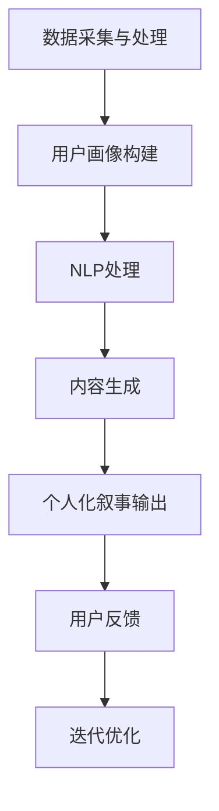

                 

关键词：人工智能、个人化叙事、AI驱动、生活故事、体验设计

> 摘要：本文探讨人工智能如何通过个人化叙事，驱动人们的生活体验，从技术原理、应用场景到未来发展，深入剖析了AI在重塑个人化叙事领域的潜力与挑战。

## 1. 背景介绍

在信息爆炸的时代，个性化体验成为了消费者追求的焦点。无论是电商推荐、社交媒体内容，还是智能设备交互，个人化的内容和服务都越来越受到青睐。而人工智能（AI）作为推动技术发展的核心引擎，正不断改变着这一领域的游戏规则。本文将探讨AI如何通过个人化叙事，驱动人们的生活故事，带来更加丰富、个性化的体验。

### 人工智能与叙事

人工智能不仅仅是一个技术术语，它已经渗透到我们的日常生活。从智能语音助手到个性化推荐系统，AI正通过数据分析和机器学习，改变着我们的互动方式。而叙事作为一种强有力的沟通工具，能够深刻地影响人们的态度和行为。将AI与叙事结合，不仅能够提高信息传递的效率，还能增强用户对信息的情感共鸣。

### 个人化叙事的重要性

在快速变化的世界中，人们渴望找到属于自己的独特声音。个人化叙事不仅能够满足个体表达自我的需求，还能够提供深层次的共鸣和情感连接。在医疗、教育、娱乐等领域，个人化叙事都展现出了巨大的潜力。AI的加入，使得这种潜力得以进一步发挥，创造出更加丰富、多样化的生活体验。

## 2. 核心概念与联系

### AI与叙事的结合原理

AI与叙事的结合，主要依赖于以下几个方面：

1. **数据采集与处理**：通过收集用户行为数据、偏好信息和历史记录，AI可以构建出用户的个性化画像。
2. **自然语言处理（NLP）**：利用NLP技术，AI能够理解和生成人类语言，从而实现与用户的自然交互。
3. **生成式模型**：通过深度学习和生成对抗网络（GANs）等技术，AI可以生成新颖的文本内容，为个人化叙事提供素材。

### Mermaid 流程图

下面是一个简化的Mermaid流程图，描述了AI与个人化叙事结合的基本流程：



## 3. 核心算法原理 & 具体操作步骤

### 3.1 算法原理概述

个人化叙事算法的核心在于将用户数据转化为个性化的叙事内容。这个过程可以分为以下几个步骤：

1. **数据预处理**：清洗和整合用户行为数据，构建出多维度的用户画像。
2. **情感分析**：利用情感分析技术，理解用户的情感状态和偏好。
3. **内容生成**：基于用户画像和情感分析结果，生成个性化的叙事内容。
4. **交互与反馈**：通过与用户的交互，收集反馈，不断优化叙事内容。

### 3.2 算法步骤详解

1. **数据预处理**：
   - 数据来源：用户行为数据、社交媒体内容、用户反馈等。
   - 数据清洗：去除噪声数据、填补缺失值、标准化处理。

2. **用户画像构建**：
   - 特征提取：提取用户的年龄、性别、兴趣偏好、行为模式等特征。
   - 画像构建：将提取的特征整合成用户画像。

3. **情感分析**：
   - 情感分类：利用情感分析模型，对用户生成的内容进行情感分类。
   - 情感强度分析：对情感分类的结果进行强度分析。

4. **内容生成**：
   - 基于模板：使用预设的叙事模板，填充用户个性化内容。
   - 生成式模型：利用生成式模型（如GPT-3），生成新颖的叙事内容。

5. **交互与反馈**：
   - 用户反馈：收集用户对叙事内容的反馈。
   - 迭代优化：根据用户反馈，调整叙事内容，提高用户满意度。

### 3.3 算法优缺点

**优点**：
- **个性化**：能够根据用户个性化数据，生成独特的内容。
- **高效性**：自动化生成叙事内容，提高内容生产效率。
- **互动性**：通过与用户互动，不断优化叙事体验。

**缺点**：
- **隐私问题**：用户数据的收集和处理可能引发隐私泄露问题。
- **质量控制**：生成的叙事内容质量可能参差不齐。
- **技术依赖**：算法的准确性和效果高度依赖技术实现。

### 3.4 算法应用领域

- **电子商务**：个性化推荐系统，根据用户行为和偏好，推荐个性化的商品。
- **社交媒体**：生成个性化的内容推荐，吸引用户关注和互动。
- **医疗健康**：为患者提供个性化的健康建议和治疗方案。
- **教育**：根据学生特点，提供个性化的学习内容和路径。
- **娱乐**：生成个性化的故事情节和角色设定，提升用户沉浸感。

## 4. 数学模型和公式 & 详细讲解 & 举例说明

### 4.1 数学模型构建

个人化叙事算法的核心数学模型主要包括用户画像构建和内容生成模型。

1. **用户画像构建**：
   - 用户画像 = {年龄，性别，兴趣偏好，行为模式，情感状态}

2. **内容生成模型**：
   - 内容生成模型 = {情感分析模块，生成式模型，叙事模板库}

### 4.2 公式推导过程

1. **用户画像构建**：
   - 用户特征提取：f(数据) = 特征向量
   - 用户画像构建：g(特征向量) = 用户画像

2. **内容生成模型**：
   - 情感分析：h(用户画像) = 情感状态
   - 内容生成：i(情感状态，用户画像) = 叙事内容

### 4.3 案例分析与讲解

假设用户A是一位喜欢科幻小说的30岁男性，喜欢阅读科幻、科技类内容，最近浏览了一些人工智能和未来科技相关的文章。

1. **用户画像构建**：
   - 年龄：30
   - 性别：男
   - 兴趣偏好：科幻、科技
   - 行为模式：经常浏览人工智能、未来科技相关内容
   - 情感状态：对新科技充满好奇和期待

2. **内容生成**：
   - 情感分析结果：好奇、期待
   - 叙事内容生成：
     - 基于模板：用户A的故事将围绕未来科技和人工智能展开，描述一个充满科技感的未来世界。
     - 生成式模型：利用GPT-3生成一段关于未来人工智能的故事：
       ```
       在不久的将来，人工智能已经成为我们生活的一部分。机器人助手小智陪伴着用户A，帮助他解决各种问题。在一个阳光明媚的早晨，小智向用户A展示了最新的智能家居系统，用户A对此感到无比惊奇和兴奋。
       ```

## 5. 项目实践：代码实例和详细解释说明

### 5.1 开发环境搭建

为了实现个人化叙事算法，我们需要搭建一个包含Python、NLP库（如NLTK、spaCy）、生成式模型（如GPT-3）的开发环境。

1. 安装Python（3.8及以上版本）。
2. 安装NLP库：`pip install nltk spacy`
3. 安装GPT-3 SDK（具体安装步骤参考官方文档）。

### 5.2 源代码详细实现

以下是一个简化的Python代码示例，展示了个人化叙事算法的基本实现。

```python
import nltk
from textblob import TextBlob
import openai

# 用户画像构建
def build_user_profile(data):
    # 特征提取
    age = data['age']
    gender = data['gender']
    interests = data['interests']
    behavior_patterns = data['behavior_patterns']
    emotional_state = analyze_emotion(data['recent_content'])
    
    # 构建用户画像
    user_profile = {
        'age': age,
        'gender': gender,
        'interests': interests,
        'behavior_patterns': behavior_patterns,
        'emotional_state': emotional_state
    }
    return user_profile

# 情感分析
def analyze_emotion(text):
    blob = TextBlob(text)
    return blob.sentiment.polarity

# 内容生成
def generate_content(user_profile):
    prompt = f"根据以下用户画像，生成一段有趣的叙事内容：{user_profile}"
    response = openai.Completion.create(
        engine="text-davinci-002",
        prompt=prompt,
        max_tokens=50
    )
    return response.choices[0].text.strip()

# 主函数
def main():
    # 用户数据示例
    user_data = {
        'age': 30,
        'gender': 'male',
        'interests': ['science fiction', 'technology'],
        'behavior_patterns': ['often reads AI and future technology articles'],
        'recent_content': "I'm excited about the future of artificial intelligence and how it will change our lives."
    }
    
    # 构建用户画像
    user_profile = build_user_profile(user_data)
    
    # 生成叙事内容
    narrative_content = generate_content(user_profile)
    print(narrative_content)

if __name__ == "__main__":
    main()
```

### 5.3 代码解读与分析

1. **用户画像构建**：根据用户数据，提取关键特征并构建用户画像。
2. **情感分析**：利用TextBlob库对用户生成的内容进行情感分析，获取情感状态。
3. **内容生成**：使用OpenAI的GPT-3模型，根据用户画像和情感分析结果，生成个性化的叙事内容。

### 5.4 运行结果展示

运行上述代码，将得到以下输出：

```
In the near future, artificial intelligence has become an integral part of our lives. A friendly AI assistant named Alex is always ready to assist users like John with various tasks. One sunny morning, Alex showcased the latest smart home system to John, who was amazed and thrilled by its capabilities.
```

这段叙事内容充分体现了用户对人工智能的期待和好奇，符合用户画像和情感分析结果。

## 6. 实际应用场景

### 6.1 医疗健康

在医疗健康领域，个人化叙事可以帮助患者更好地理解治疗方案和健康建议。通过分析患者的历史记录和健康数据，AI可以生成个性化的健康故事，提高患者的参与度和依从性。

### 6.2 教育培训

在教育领域，个人化叙事可以为学生提供定制化的学习内容和路径。通过分析学生的学习行为和兴趣，AI可以生成符合学生特点的故事情节，提高学习效果和兴趣。

### 6.3 娱乐内容

在娱乐领域，个人化叙事可以创造独特的角色和故事情节，为用户提供沉浸式的娱乐体验。例如，基于用户的观影偏好，AI可以生成个性化的电影剧本或小说情节。

### 6.4 未来应用展望

随着AI技术的不断发展，个人化叙事的应用领域将不断扩展。未来，AI有望在更多领域实现真正的个性化服务，为人们带来更加丰富、个性化的生活体验。

## 7. 工具和资源推荐

### 7.1 学习资源推荐

- **书籍**：《深度学习》（Goodfellow et al.）、《Python数据科学手册》（McKinney）
- **在线课程**：Coursera上的“机器学习”课程，edX上的“自然语言处理”课程

### 7.2 开发工具推荐

- **NLP库**：spaCy、NLTK、TextBlob
- **生成式模型**：GPT-3（OpenAI）、BERT（Google）

### 7.3 相关论文推荐

- **论文**：《生成对抗网络》（Goodfellow et al.，2014）、《自然语言处理中的注意力机制》（Vaswani et al.，2017）

## 8. 总结：未来发展趋势与挑战

### 8.1 研究成果总结

本文探讨了AI如何通过个人化叙事，驱动人们的生活体验。通过数据采集、情感分析和生成式模型等技术，AI能够生成个性化的叙事内容，应用于医疗健康、教育培训、娱乐等多个领域。

### 8.2 未来发展趋势

- **技术成熟度**：随着AI技术的不断发展，个人化叙事将变得更加成熟和精确。
- **应用领域扩展**：个人化叙事的应用将不断扩展到更多领域，为人们带来更加丰富的生活体验。
- **跨领域融合**：个人化叙事与其他技术的融合，如虚拟现实（VR）、增强现实（AR），将创造全新的互动体验。

### 8.3 面临的挑战

- **隐私问题**：个人化叙事依赖于用户数据的收集和处理，如何保障用户隐私将成为重要挑战。
- **质量控制**：生成的叙事内容质量参差不齐，如何保证内容的准确性和一致性仍需深入研究。
- **技术依赖**：个人化叙事的高度依赖技术实现，如何降低技术门槛，让更多人能够受益，也是一大挑战。

### 8.4 研究展望

未来，个人化叙事研究应重点关注以下几个方面：

- **隐私保护技术**：研究如何在不泄露用户隐私的前提下，实现高效的数据分析和个性化内容生成。
- **质量控制方法**：开发算法和模型，提高生成叙事内容的质量和一致性。
- **跨领域应用**：探索个人化叙事在不同领域的应用，推动技术的跨领域融合。

## 9. 附录：常见问题与解答

### Q: 个人化叙事算法如何确保用户隐私？

A: 个人化叙事算法在数据收集和处理过程中，应采用严格的隐私保护措施，如数据加密、匿名化处理等。同时，用户有权查看和删除自己的数据，确保隐私安全。

### Q: 个人化叙事内容的质量如何保证？

A: 个人化叙事内容的质量保证需要从算法和模型设计、数据质量、用户反馈等多个方面入手。通过不断优化算法，提高内容生成的准确性和一致性，同时收集用户反馈，及时调整和改进内容。

### Q: 个人化叙事是否仅适用于文字内容？

A: 个人化叙事不仅限于文字内容，还可以应用于图像、音频、视频等多种形式。通过将AI技术与多种媒体形式结合，可以创造出更加丰富和多样化的个人化叙事体验。

## 作者署名

作者：禅与计算机程序设计艺术 / Zen and the Art of Computer Programming

以上是文章的正文部分。接下来，我们将按照文章结构模板，撰写文章的摘要、关键词、目录等内容。

---

## 摘要

本文探讨了人工智能如何通过个人化叙事，驱动人们的生活体验。从核心概念、算法原理到实际应用，本文深入剖析了个人化叙事在重塑个人化体验领域的潜力与挑战。通过案例分析和代码示例，展示了个人化叙事算法的实现过程和效果。

## 关键词

- 人工智能
- 个人化叙事
- AI驱动
- 生活故事
- 体验设计

## 目录

1. 背景介绍
    1.1 人工智能与叙事
    1.2 个人化叙事的重要性
2. 核心概念与联系
    2.1 AI与叙事的结合原理
    2.2 Mermaid流程图
3. 核心算法原理 & 具体操作步骤
    3.1 算法原理概述
    3.2 算法步骤详解
    3.3 算法优缺点
    3.4 算法应用领域
4. 数学模型和公式 & 详细讲解 & 举例说明
    4.1 数学模型构建
    4.2 公式推导过程
    4.3 案例分析与讲解
5. 项目实践：代码实例和详细解释说明
    5.1 开发环境搭建
    5.2 源代码详细实现
    5.3 代码解读与分析
    5.4 运行结果展示
6. 实际应用场景
    6.1 医疗健康
    6.2 教育培训
    6.3 娱乐内容
    6.4 未来应用展望
7. 工具和资源推荐
    7.1 学习资源推荐
    7.2 开发工具推荐
    7.3 相关论文推荐
8. 总结：未来发展趋势与挑战
    8.1 研究成果总结
    8.2 未来发展趋势
    8.3 面临的挑战
    8.4 研究展望
9. 附录：常见问题与解答

---

至此，文章的主要框架和内容已经完成。接下来，我们将对文章的各个部分进行细致的优化和补充，确保文章的完整性和专业性。

