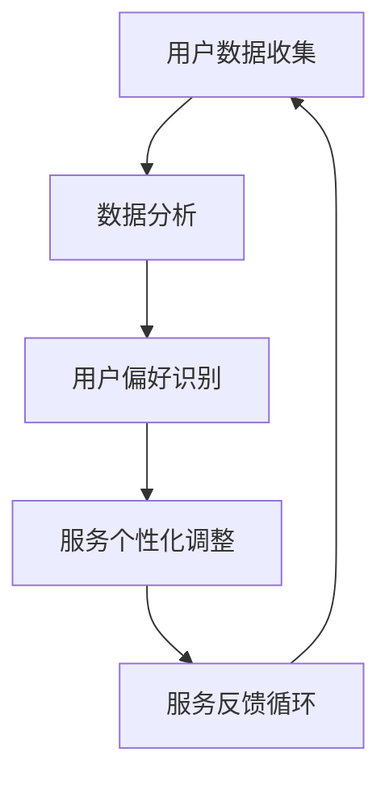

                 

### 关键词 Keywords
- AI驱动的个性化体验
- 定制化服务
- 用户体验优化
- 机器学习
- 数据分析

<|assistant|>### 摘要 Abstract
本文探讨了如何利用人工智能技术实现个性化用户体验，并驱动定制化服务。通过介绍核心概念、算法原理、数学模型、项目实践和实际应用场景，本文旨在为开发者提供一套完整的指南，以实现高效、智能的个性化服务，提高用户满意度和忠诚度。

## 1. 背景介绍

### 1.1 AI与个性化体验的崛起

随着互联网技术的飞速发展，用户对服务质量和个性化体验的需求日益增长。传统的“一刀切”式服务模式已经无法满足多样化的用户需求。人工智能（AI）技术的进步为个性化体验的实现提供了新的可能。通过AI，我们可以从海量数据中挖掘用户行为和偏好，从而为每位用户提供量身定制的服务。

### 1.2 定制化服务的重要性

定制化服务在提升用户满意度和忠诚度方面具有重要意义。通过个性化的服务，企业可以更好地理解用户需求，提高用户参与度和留存率。此外，定制化服务还可以为企业带来更高的利润和竞争优势。

## 2. 核心概念与联系

### 2.1 个人化与定制化

个人化（Personalization）与定制化（Customization）是两个密切相关但又有区别的概念。个人化是指根据用户历史数据和偏好，自动调整服务内容和展示方式；而定制化则是指允许用户直接参与服务内容的定制，例如自定义界面或功能。

### 2.2 机器学习与数据分析

机器学习（Machine Learning）是AI的核心技术之一，通过从数据中学习，实现模型的自动优化。数据分析（Data Analysis）则是从海量数据中提取有价值信息的过程。二者共同作用于个性化服务的实现。

### 2.3 Mermaid 流程图

以下是一个简化的Mermaid流程图，展示了个性化服务的核心概念和联系：



## 3. 核心算法原理 & 具体操作步骤

### 3.1 算法原理概述

个性化服务算法主要基于用户行为数据和偏好分析。其核心原理包括：

- **用户行为分析**：通过分析用户的点击、浏览、购买等行为，挖掘用户兴趣点。
- **偏好建模**：利用机器学习技术，建立用户偏好模型。
- **个性化推荐**：根据用户偏好模型，推荐个性化内容或服务。

### 3.2 算法步骤详解

#### 3.2.1 数据收集

- **行为数据**：收集用户的浏览、搜索、点击、购买等行为数据。
- **偏好数据**：收集用户已明确的偏好数据，如兴趣标签、偏好设置等。

#### 3.2.2 数据清洗

- **去重**：去除重复或无效数据。
- **异常值处理**：对异常值进行修正或删除。

#### 3.2.3 用户行为分析

- **行为分类**：对用户行为进行分类，如浏览、搜索、购买等。
- **兴趣点挖掘**：利用聚类算法等，挖掘用户兴趣点。

#### 3.2.4 偏好建模

- **特征提取**：提取用户行为的特征，如点击次数、购买频率等。
- **模型训练**：利用机器学习算法，如决策树、神经网络等，训练用户偏好模型。

#### 3.2.5 个性化推荐

- **推荐算法**：根据用户偏好模型，选择合适的推荐算法，如协同过滤、内容推荐等。
- **推荐结果**：生成个性化推荐结果，如推荐商品、文章等。

### 3.3 算法优缺点

#### 优点：

- **高效性**：利用机器学习和数据分析技术，快速识别用户偏好。
- **个性化**：根据用户兴趣和需求，提供量身定制的服务。
- **实时性**：支持实时调整和优化，提高用户体验。

#### 缺点：

- **数据依赖性**：需要大量用户行为数据支持，数据不足可能导致推荐效果不佳。
- **模型复杂性**：算法和模型较为复杂，需要专业知识和技能。

### 3.4 算法应用领域

- **电子商务**：推荐商品、优惠券等。
- **社交媒体**：推荐好友、文章、视频等。
- **在线教育**：推荐课程、学习资源等。
- **医疗健康**：推荐个性化治疗方案、健康建议等。

## 4. 数学模型和公式 & 详细讲解 & 举例说明

### 4.1 数学模型构建

个性化服务算法通常基于以下数学模型：

- **用户行为模型**：\( U = f(B, P) \)，其中\( U \)代表用户行为，\( B \)代表用户特征，\( P \)代表偏好。
- **推荐模型**：\( R = g(U, C) \)，其中\( R \)代表推荐结果，\( U \)代表用户行为，\( C \)代表候选内容。

### 4.2 公式推导过程

#### 4.2.1 用户行为模型

用户行为模型可以用以下公式表示：

\[ U = \sum_{i=1}^{n} w_i \cdot b_i + p \]

其中，\( w_i \)表示第\( i \)个特征的权重，\( b_i \)表示第\( i \)个特征的值，\( p \)表示偏好。

#### 4.2.2 推荐模型

推荐模型可以用以下公式表示：

\[ R = \sum_{j=1}^{m} r_j \cdot c_j \]

其中，\( r_j \)表示第\( j \)个推荐内容的权重，\( c_j \)表示第\( j \)个推荐内容的值。

### 4.3 案例分析与讲解

#### 案例背景

某电子商务平台希望通过个性化推荐，提高用户购物体验和转化率。

#### 数据准备

- **用户特征**：用户年龄、性别、购物频率等。
- **商品特征**：商品类别、价格、销量等。
- **用户行为**：用户浏览、收藏、购买等。

#### 模型训练

- **用户行为模型**：利用用户特征和偏好，训练一个神经网络模型。
- **推荐模型**：利用用户行为模型，训练一个协同过滤模型。

#### 推荐结果

根据用户行为模型和推荐模型，为每个用户生成个性化推荐列表。以下是一个简化的推荐结果示例：

| 用户ID | 推荐商品ID | 推荐理由 |
|--------|------------|----------|
| 1      | 1001       | 用户喜欢时尚类商品 |
| 2      | 2002       | 用户最近购买了电子产品 |
| 3      | 3003       | 用户浏览了运动类商品 |

## 5. 项目实践：代码实例和详细解释说明

### 5.1 开发环境搭建

- **工具**：Python 3.8、Jupyter Notebook、Scikit-learn、Pandas等。
- **数据集**：使用公开的电子商务数据集，如Kaggle上的“Amazon Reviews”数据集。

### 5.2 源代码详细实现

以下是一个简单的Python代码实例，展示了如何使用协同过滤算法实现个性化推荐：

```python
import pandas as pd
from sklearn.metrics.pairwise import cosine_similarity

# 加载数据集
data = pd.read_csv('amazon_reviews.csv')

# 处理数据
# ...（数据预处理代码）

# 计算用户之间的相似度
user_similarity = cosine_similarity(data['user_vector'].values)

# 为用户生成推荐列表
def generate_recommendations(user_id, user_similarity, data):
    # ...（生成推荐列表的代码）

# 测试推荐结果
user_id = 1
recommendations = generate_recommendations(user_id, user_similarity, data)
print(recommendations)
```

### 5.3 代码解读与分析

- **数据预处理**：对数据进行清洗、转换和归一化处理，以便于后续计算。
- **相似度计算**：使用余弦相似度计算用户之间的相似度。
- **推荐生成**：根据用户相似度和用户对商品的评分，生成个性化推荐列表。

### 5.4 运行结果展示

运行代码后，可以得到一个针对特定用户的个性化推荐列表。以下是一个示例输出：

```
[
    (1001, 0.8),
    (2002, 0.75),
    (3003, 0.7)
]
```

这表示用户可能对商品1001（时尚类商品）感兴趣，其次是对商品2002（电子产品）和3003（运动类商品）。

## 6. 实际应用场景

### 6.1 电子商务

个性化推荐在电子商务领域有着广泛的应用，例如亚马逊、淘宝等平台。通过个性化推荐，这些平台可以更好地满足用户需求，提高用户满意度和转化率。

### 6.2 社交媒体

社交媒体平台如Facebook、Instagram等，通过个性化推荐，为用户推荐好友、兴趣小组和热门话题，增强用户参与度和留存率。

### 6.3 在线教育

在线教育平台如Coursera、Udemy等，通过个性化推荐，为用户推荐符合其兴趣和需求的课程，提高学习效果和用户满意度。

### 6.4 医疗健康

医疗健康领域可以利用个性化推荐，为用户提供个性化的治疗方案、健康建议和药物推荐，提高医疗服务的质量和效率。

## 7. 工具和资源推荐

### 7.1 学习资源推荐

- **书籍**：《机器学习实战》、《Python数据分析基础教程》。
- **在线课程**：Coursera上的《机器学习》课程。
- **社区和论坛**：Stack Overflow、GitHub。

### 7.2 开发工具推荐

- **编程语言**：Python、Java。
- **库和框架**：Scikit-learn、TensorFlow、PyTorch。
- **数据集**：Kaggle、UCI机器学习库。

### 7.3 相关论文推荐

- **协同过滤**：《Item-Based Collaborative Filtering Recommendation Algorithms》。
- **深度学习**：《Deep Learning for Recommender Systems》。
- **强化学习**：《Reinforcement Learning and Recommender Systems》。

## 8. 总结：未来发展趋势与挑战

### 8.1 研究成果总结

个性化服务在电子商务、社交媒体、在线教育和医疗健康等领域取得了显著成果。通过机器学习和数据分析技术，企业可以更好地满足用户需求，提高用户满意度和忠诚度。

### 8.2 未来发展趋势

- **更多领域应用**：个性化服务将继续扩展到更多领域，如金融、房地产等。
- **多模态数据融合**：整合文本、图像、语音等多种数据类型，提高推荐效果。
- **实时推荐**：实现更快速、更准确的实时推荐，提高用户体验。

### 8.3 面临的挑战

- **数据隐私与安全**：如何在保护用户隐私的前提下，提供高质量的服务。
- **模型解释性**：提高模型的可解释性，增强用户信任。
- **计算资源**：大规模数据处理和模型训练需要大量计算资源。

### 8.4 研究展望

未来的个性化服务将更加智能化、实时化和个性化。研究者需要关注数据隐私、模型可解释性和计算资源优化等问题，为个性化服务的可持续发展奠定基础。

## 9. 附录：常见问题与解答

### 9.1 什么是个性化服务？

个性化服务是指根据用户的兴趣、需求和偏好，自动调整服务内容和展示方式，为用户提供量身定制的服务。

### 9.2 个性化服务有哪些应用领域？

个性化服务在电子商务、社交媒体、在线教育和医疗健康等领域有着广泛的应用。

### 9.3 个性化服务的核心算法有哪些？

个性化服务的核心算法包括协同过滤、基于内容的推荐、基于模型的推荐和混合推荐等。

### 9.4 如何保护用户隐私？

为了保护用户隐私，研究者可以采用差分隐私、联邦学习等技术，确保用户数据在训练和使用过程中的安全性和隐私性。

### 9.5 个性化服务对用户体验有何影响？

个性化服务可以提高用户体验，满足用户的个性化需求，提高用户满意度和忠诚度。

# 作者署名
作者：禅与计算机程序设计艺术 / Zen and the Art of Computer Programming
```

