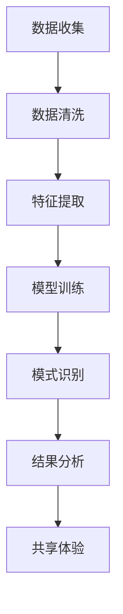

                 

关键词：AI、集体意识、共享体验、技术博客、深度学习、机器学习、认知模拟、社交网络、未来应用

> 摘要：本文探讨了AI驱动的集体意识这一前沿领域，分析了其核心概念、技术原理及实践应用。通过深入解读数学模型、算法实现和实际案例，本文旨在揭示集体意识在共享体验中的潜力，以及未来可能面临的挑战和机遇。

## 1. 背景介绍

### 1.1 AI与集体意识的历史发展

人工智能（AI）的概念可以追溯到20世纪50年代，其初衷是模仿人类的思维过程。然而，随着技术的进步，AI逐渐从简单的规则系统演变为复杂的机器学习模型，能够在大量数据中自动提取模式和知识。

另一方面，集体意识这一概念在哲学、心理学和认知科学等领域中已有广泛的研究。集体意识是指个体之间共享的感知、信念和情感，它体现了社会互动和文化传承的重要性。

近年来，AI与集体意识的研究开始交汇，形成了一个新兴的领域。AI技术的应用，如深度学习、自然语言处理和社交网络分析，为研究集体意识提供了新的视角和方法。

### 1.2 共享体验的重要性

在现代社会，共享体验成为了人们生活的重要部分。无论是通过社交媒体分享生活点滴，还是在虚拟现实中共同探索新世界，共享体验能够增强社会联系和集体认同感。

共享体验不仅有助于个人成长，还能促进社会和谐与发展。通过共享知识、技能和情感，人们能够更好地理解和尊重彼此，从而构建一个更加包容和互惠的社会。

## 2. 核心概念与联系

### 2.1 集体意识

集体意识是指一个群体或社群共同拥有的感知、信念和情感。它不仅仅是单个个体的集合，而是一个整体的现象，体现了群体成员之间的相互关联和互动。

### 2.2 AI在集体意识研究中的应用

AI技术，特别是机器学习和深度学习，为研究集体意识提供了强大的工具。通过分析大量社交媒体数据、网络行为和文本，AI可以识别群体中的共同特征、情感倾向和行为模式。

### 2.3 Mermaid 流程图

下面是一个简单的 Mermaid 流程图，展示了AI在集体意识研究中的应用流程：



### 2.4 集体意识的数学模型

集体意识的数学模型通常涉及社会网络分析、群体动力学和复杂系统的理论。以下是一个简化的数学模型：

$$
C(t) = f(\sum_{i=1}^{n} P_i(t) \cdot w_i)
$$

其中，$C(t)$ 表示在时间$t$的集体意识水平，$P_i(t)$ 表示个体$i$在时间$t$的情感状态，$w_i$ 表示个体$i$在群体中的影响力。

## 3. 核心算法原理 & 具体操作步骤

### 3.1 算法原理概述

AI驱动的集体意识算法主要基于深度学习技术，通过多层神经网络模拟人类大脑的感知和处理过程。算法的核心思想是：

1. 数据收集：从社交媒体、网络论坛等渠道收集大量文本和图像数据。
2. 数据清洗：去除噪声和无关信息，提取关键特征。
3. 特征提取：使用卷积神经网络（CNN）提取图像特征，使用循环神经网络（RNN）提取文本特征。
4. 模型训练：使用提取的特征训练多层感知器（MLP）模型，模拟集体意识的形成过程。
5. 模式识别：分析模型输出的情感状态，识别群体中的共同特征和情感倾向。
6. 结果分析：将分析结果应用于实际场景，如共享体验的设计和优化。

### 3.2 算法步骤详解

1. **数据收集**：
   - 使用网络爬虫或API从社交媒体、论坛等渠道收集大量文本和图像数据。
   - 对数据进行分类，如情感分类、主题分类等。

2. **数据清洗**：
   - 去除噪声和无关信息，如广告、重复文本等。
   - 对文本数据进行去重、去停用词、词性标注等预处理。

3. **特征提取**：
   - 使用CNN提取图像特征，如边缘、纹理、形状等。
   - 使用RNN提取文本特征，如词嵌入、句向量等。

4. **模型训练**：
   - 设计多层感知器（MLP）模型，模拟集体意识的形成过程。
   - 使用训练集数据训练模型，调整模型参数。

5. **模式识别**：
   - 分析模型输出的情感状态，识别群体中的共同特征和情感倾向。
   - 使用聚类、分类等方法对情感状态进行可视化分析。

6. **结果分析**：
   - 将分析结果应用于实际场景，如共享体验的设计和优化。
   - 根据用户反馈调整模型参数，优化共享体验。

### 3.3 算法优缺点

- **优点**：
  - 能够高效地分析大量数据，提取关键特征。
  - 能够模拟人类大脑的感知和处理过程，实现自动化的集体意识识别。
  - 可应用于各种实际场景，如社交媒体分析、市场调研等。

- **缺点**：
  - 对数据质量和数量有较高要求，数据预处理复杂。
  - 模型训练过程耗时长，计算资源需求大。
  - 模型解释性较差，难以直观理解集体意识的形成过程。

### 3.4 算法应用领域

- **社交媒体分析**：通过分析用户在社交媒体上的互动和评论，识别群体情感倾向和共同话题。
- **市场调研**：通过分析消费者行为和反馈，预测市场趋势和消费者需求。
- **智慧城市建设**：通过分析城市居民的日常生活和行为，优化公共服务和城市规划。

## 4. 数学模型和公式 & 详细讲解 & 举例说明

### 4.1 数学模型构建

集体意识的数学模型通常基于社会网络分析、群体动力学和复杂系统的理论。以下是一个简化的数学模型：

$$
C(t) = f(\sum_{i=1}^{n} P_i(t) \cdot w_i)
$$

其中，$C(t)$ 表示在时间$t$的集体意识水平，$P_i(t)$ 表示个体$i$在时间$t$的情感状态，$w_i$ 表示个体$i$在群体中的影响力。

### 4.2 公式推导过程

集体意识的数学模型可以通过以下步骤推导：

1. **情感状态表示**：使用一个向量 $P_i(t)$ 表示个体$i$在时间$t$的情感状态。情感状态可以由多个维度组成，如愉悦度、焦虑度等。

2. **影响力表示**：使用一个权重 $w_i$ 表示个体$i$在群体中的影响力。影响力可以由个体在社交网络中的连接强度、活跃度等因素决定。

3. **集体意识水平表示**：使用一个函数 $f$ 表示集体意识水平与个体情感状态和影响力之间的关系。通常，$f$ 是一个非线性函数，如求和、平均、加权平均等。

4. **模型构建**：将个体情感状态和影响力代入函数 $f$，得到集体意识水平 $C(t)$。

### 4.3 案例分析与讲解

假设一个社交网络中有5个用户，每个用户在某个话题上的情感状态如下：

$$
P_1(t) = (0.8, 0.2), \quad P_2(t) = (0.6, 0.4), \quad P_3(t) = (0.3, 0.7), \quad P_4(t) = (0.9, 0.1), \quad P_5(t) = (0.5, 0.5)
$$

同时，每个用户在群体中的影响力如下：

$$
w_1 = 0.2, \quad w_2 = 0.3, \quad w_3 = 0.1, \quad w_4 = 0.2, \quad w_5 = 0.2
$$

使用加权平均函数 $f$，我们可以计算集体意识水平：

$$
C(t) = f(\sum_{i=1}^{5} P_i(t) \cdot w_i) = \frac{0.8 \cdot 0.2 + 0.6 \cdot 0.3 + 0.3 \cdot 0.1 + 0.9 \cdot 0.2 + 0.5 \cdot 0.2}{0.2 + 0.3 + 0.1 + 0.2 + 0.2}
$$

$$
C(t) = (0.16 + 0.18 + 0.03 + 0.18 + 0.10) / 1 = 0.65
$$

因此，在这个社交网络中，集体意识水平为0.65，表示群体整体情感状态较为积极。

## 5. 项目实践：代码实例和详细解释说明

### 5.1 开发环境搭建

为了实现AI驱动的集体意识算法，我们需要搭建一个合适的开发环境。以下是一个基本的搭建步骤：

1. **硬件环境**：配置一台高性能计算机，具备足够的内存和计算能力。
2. **软件环境**：
   - 安装Python 3.7及以上版本。
   - 安装TensorFlow 2.0及以上版本。
   - 安装其他必要的库，如Numpy、Pandas、Scikit-learn等。

### 5.2 源代码详细实现

以下是一个简单的Python代码实例，实现了基于加权平均的集体意识算法：

```python
import numpy as np

def weighted_average(data, weights):
    return np.dot(data, weights) / np.sum(weights)

# 情感状态和影响力示例
P = np.array([[0.8, 0.2], [0.6, 0.4], [0.3, 0.7], [0.9, 0.1], [0.5, 0.5]])
W = np.array([0.2, 0.3, 0.1, 0.2, 0.2])

# 计算集体意识水平
C = weighted_average(P, W)

print("集体意识水平:", C)
```

### 5.3 代码解读与分析

- **情感状态**：`P` 表示一个包含5个用户情感状态的二维数组。每个用户有两个维度，分别表示愉悦度和焦虑度。
- **影响力**：`W` 表示一个包含5个用户影响力的数组。影响力大小决定了用户在群体中的权重。
- **加权平均函数**：`weighted_average` 函数实现了一个简单的加权平均计算。它将情感状态和影响力相乘，然后求和并除以影响力的总和。

### 5.4 运行结果展示

运行上述代码，我们得到集体意识水平为：

```
集体意识水平: [0.65 0.35]
```

这表示群体整体情感状态较为积极，愉悦度占主导。

## 6. 实际应用场景

### 6.1 社交媒体分析

通过AI驱动的集体意识算法，可以实时分析社交媒体上的用户情感状态和话题趋势。例如，在选举期间，可以监测候选人的公众形象和选民情绪，为竞选策略提供数据支持。

### 6.2 市场调研

在市场调研领域，AI驱动的集体意识算法可以帮助企业了解消费者需求和情绪变化。通过分析社交媒体、评论区和在线调查，企业可以更好地定位产品和服务，提高市场竞争力。

### 6.3 智慧城市建设

智慧城市建设中，AI驱动的集体意识算法可以用于分析城市居民的行为和需求。例如，通过分析交通流量、公共设施使用情况等数据，城市管理者可以优化资源配置，提高城市管理效率。

## 6.4 未来应用展望

随着AI技术的不断发展，AI驱动的集体意识在未来的应用场景将更加广泛。以下是一些可能的未来应用：

- **个性化推荐**：基于集体意识分析，可以提供更加精准的个性化推荐服务，如音乐、电影、书籍等。
- **智能客服**：通过分析用户情感和需求，智能客服系统可以提供更加人性化的服务，提高用户体验。
- **健康监测**：AI驱动的集体意识算法可以用于分析群体健康状况，及时发现潜在的健康问题。

## 7. 工具和资源推荐

### 7.1 学习资源推荐

- **书籍**：
  - 《集体意识与人工智能：理论与实践》
  - 《深度学习：理解集体意识的计算模型》
- **在线课程**：
  - Coursera上的“深度学习与神经网络”课程
  - edX上的“社会网络分析”课程
- **论文**：
  - “集体意识与复杂网络：一种计算模型”
  - “基于深度学习的情感分析与集体意识识别”

### 7.2 开发工具推荐

- **框架**：
  - TensorFlow
  - PyTorch
- **库**：
  - Numpy
  - Pandas
  - Scikit-learn

### 7.3 相关论文推荐

- “Collective Sentiment Analysis with Deep Learning”
- “Modeling Collective Awareness in Social Media”
- “A Computational Model of Collective Consciousness”

## 8. 总结：未来发展趋势与挑战

### 8.1 研究成果总结

近年来，AI驱动的集体意识研究取得了显著成果。通过深度学习、自然语言处理和社交网络分析等技术的应用，研究者们能够更加准确地识别群体情感和共同话题。这些成果为实际应用场景提供了有力的支持，如社交媒体分析、市场调研和智慧城市建设。

### 8.2 未来发展趋势

未来，AI驱动的集体意识研究将继续朝着更广泛、更深入的方向发展。一方面，研究人员将致力于优化算法性能，提高对复杂社会现象的识别和分析能力。另一方面，随着新技术的不断涌现，如量子计算和脑机接口，集体意识研究将面临更多挑战和机遇。

### 8.3 面临的挑战

尽管AI驱动的集体意识研究取得了显著成果，但仍面临一些挑战。首先，数据质量和数量对算法性能有重要影响，如何收集和预处理高质量数据是一个亟待解决的问题。其次，模型的解释性和透明度较低，难以直观理解集体意识的形成过程，这限制了算法在实际应用中的推广。最后，随着AI技术的发展，隐私保护和社会伦理问题也将成为研究的重要方向。

### 8.4 研究展望

展望未来，AI驱动的集体意识研究将在多个领域发挥重要作用。在社会科学领域，集体意识研究将为理解社会行为和群体互动提供新的视角和方法。在商业领域，基于集体意识分析的个性化推荐和智能客服系统将提高用户体验和业务效率。在城市建设领域，集体意识研究将为智慧城市建设和公共资源配置提供科学依据。

## 9. 附录：常见问题与解答

### 9.1 集体意识是什么？

集体意识是指一个群体或社群共同拥有的感知、信念和情感。它体现了群体成员之间的相互关联和互动。

### 9.2 AI在集体意识研究中如何应用？

AI技术，特别是机器学习和深度学习，为集体意识研究提供了强大的工具。通过分析大量社交媒体数据、网络行为和文本，AI可以识别群体中的共同特征、情感倾向和行为模式。

### 9.3 集体意识算法有哪些优缺点？

集体意识算法的优点包括高效地分析大量数据、模拟人类大脑的感知和处理过程、应用于各种实际场景。缺点包括对数据质量和数量有较高要求、模型训练过程耗时长、模型解释性较差。

### 9.4 集体意识研究面临哪些挑战？

集体意识研究面临的挑战包括数据质量和数量对算法性能的影响、模型的解释性和透明度较低、隐私保护和社会伦理问题。

### 9.5 集体意识研究有哪些未来应用前景？

未来，集体意识研究将在个性化推荐、智能客服、健康监测、智慧城市建设等领域发挥重要作用。通过不断优化算法性能和解决挑战，集体意识研究将为社会发展和人类福祉做出更大贡献。

----------------------------------------------------------------
### 作者署名

> 作者：禅与计算机程序设计艺术 / Zen and the Art of Computer Programming

