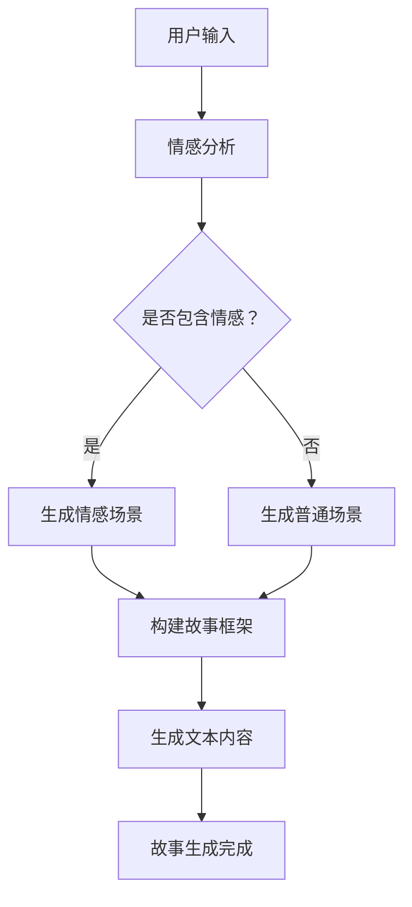

                 

关键词：AI生成，叙事性，个人故事，用户体验，技术语言，深度学习，情感模拟，计算机图灵奖。

> 摘要：本文探讨了人工智能在生成个人故事方面的潜力，以及如何通过深度学习和情感模拟等技术手段，实现具有叙事性的个人故事生成。文章分析了核心算法原理，数学模型，实际应用场景，并提供了详细的代码实例和解释。

## 1. 背景介绍

随着人工智能技术的飞速发展，AI的应用场景越来越广泛。从早期的语音识别、图像处理，到如今的自然语言处理、情感模拟，AI正在逐渐渗透到我们生活的方方面面。其中，生成个人故事成为了一个引人入胜的领域。

个人故事是人类内心情感的载体，它能够传递个体的经历、价值观和世界观。在现代社会，随着社交媒体的普及，人们更加关注自己的个人品牌和身份认同，因此生成个人故事的需求日益增加。然而，手动编写个人故事既费时又费力，如何利用AI技术自动化生成个人故事成为一个亟待解决的问题。

本文旨在探讨AI生成个人故事的可行性，分析其核心算法原理，构建数学模型，并通过实际应用场景和代码实例，展示AI生成个人故事的实际效果。

## 2. 核心概念与联系

### 2.1 深度学习

深度学习是人工智能的一个重要分支，它通过模拟人脑的神经网络结构，实现数据的自动学习和特征提取。在生成个人故事的应用中，深度学习技术主要用于情感模拟和文本生成。

#### 情感模拟

情感模拟是指通过算法模拟人类的情感反应，使得AI能够理解和表达情感。在生成个人故事时，情感模拟有助于构建故事的情节和角色，使其更具叙事性。

#### 文本生成

文本生成是深度学习的另一个重要应用。通过训练大量的文本数据，深度学习模型能够学会生成新的文本内容。在生成个人故事时，文本生成技术可以帮助构建故事的叙述和情节。

### 2.2 自然语言处理

自然语言处理（NLP）是使计算机能够理解、生成和处理人类语言的技术。在生成个人故事时，NLP技术主要用于处理和生成文本数据。

#### 语言模型

语言模型是NLP的基础，它通过训练大量的文本数据，学习语言的统计规律和语法结构。在生成个人故事时，语言模型可以帮助生成符合语法规则和语义逻辑的文本。

#### 对话系统

对话系统是一种能够与人类进行自然对话的AI系统。在生成个人故事时，对话系统可以与用户交互，了解用户的需求和情感，从而生成更符合用户期望的故事。

### 2.3 Mermaid 流程图

以下是一个简化的Mermaid流程图，展示了AI生成个人故事的基本流程。



## 3. 核心算法原理 & 具体操作步骤

### 3.1 算法原理概述

AI生成个人故事的核心算法主要包括情感分析、文本生成和故事框架构建。情感分析用于理解用户输入的情感倾向，文本生成用于生成符合情感和语法规则的文本，故事框架构建用于构建故事的情节和角色。

### 3.2 算法步骤详解

1. **情感分析**：使用情感分析技术对用户输入进行情感倾向判断。常见的情感分析技术包括基于规则的方法、基于机器学习的方法和基于深度学习的方法。

2. **文本生成**：根据情感分析和用户输入，使用文本生成技术生成符合情感和语法规则的文本。文本生成技术主要包括生成式文本模型和基于模板的文本生成。

3. **故事框架构建**：根据文本生成结果，构建故事框架，包括情节、角色和叙述。故事框架构建可以通过规则匹配、模板填充和生成式文本模型等方法实现。

4. **故事生成**：将故事框架和文本生成结果结合，生成完整的个人故事。

### 3.3 算法优缺点

#### 优点：

1. **个性化**：AI生成个人故事可以根据用户输入的情感和需求，生成个性化的故事内容。

2. **效率高**：AI生成个人故事可以自动化处理大量的数据，提高工作效率。

3. **多样性**：AI生成个人故事可以生成各种类型的个人故事，满足不同用户的需求。

#### 缺点：

1. **情感理解有限**：目前的AI技术尚不能完全理解复杂的情感，导致生成的个人故事可能缺乏深度和情感共鸣。

2. **文本质量不稳定**：AI生成的文本质量受模型训练数据和算法质量的影响，可能存在语法错误或语义不通的问题。

### 3.4 算法应用领域

AI生成个人故事的应用领域非常广泛，包括但不限于：

1. **社交媒体**：为用户提供个性化的故事内容，提升用户体验。

2. **内容创作**：为创作者提供灵感，辅助创作故事、小说等文学作品。

3. **心理咨询**：帮助用户表达情感，提供情感支持。

## 4. 数学模型和公式 & 详细讲解 & 举例说明

### 4.1 数学模型构建

AI生成个人故事的数学模型主要包括情感分析模型、文本生成模型和故事框架构建模型。

#### 情感分析模型

情感分析模型通常采用卷积神经网络（CNN）或循环神经网络（RNN）等深度学习模型。以下是一个简单的情感分析模型公式：

$$
h = f(W_1 \cdot x + b_1)
$$

其中，$h$ 是情感分析结果，$x$ 是输入文本，$W_1$ 是权重矩阵，$b_1$ 是偏置。

#### 文本生成模型

文本生成模型通常采用生成对抗网络（GAN）或变分自编码器（VAE）等深度学习模型。以下是一个简单的文本生成模型公式：

$$
z = g(W_2 \cdot x + b_2)
$$

$$
x' = f(W_3 \cdot z + b_3)
$$

其中，$z$ 是随机噪声，$x'$ 是生成的文本，$W_2$ 和 $W_3$ 是权重矩阵，$b_2$ 和 $b_3$ 是偏置。

#### 故事框架构建模型

故事框架构建模型通常采用图神经网络（GCN）或图卷积网络（GNN）等深度学习模型。以下是一个简单的故事框架构建模型公式：

$$
h_i = \sigma(\sum_{j \in N(i)} W_{ij} \cdot h_j + b_i)
$$

其中，$h_i$ 是节点 $i$ 的属性，$N(i)$ 是节点 $i$ 的邻居节点，$W_{ij}$ 是权重矩阵，$\sigma$ 是激活函数。

### 4.2 公式推导过程

#### 情感分析模型推导

1. **输入文本表示**：

   $$ 
   x = [x_1, x_2, \ldots, x_n]
   $$

   其中，$x_i$ 是第 $i$ 个词的词向量。

2. **卷积操作**：

   $$ 
   h = \sum_{k=1}^K f(W_k \cdot x_k + b_k)
   $$

   其中，$K$ 是卷积核的数量，$f$ 是激活函数。

3. **池化操作**：

   $$ 
   h' = \max(h)
   $$

4. **全连接层**：

   $$ 
   h = f(W_1 \cdot h' + b_1)
   $$

#### 文本生成模型推导

1. **生成随机噪声**：

   $$ 
   z \sim \mathcal{N}(0, I)
   $$

2. **生成文本**：

   $$ 
   x' = f(W_3 \cdot g(W_2 \cdot z + b_2) + b_3)
   $$

#### 故事框架构建模型推导

1. **节点表示**：

   $$ 
   h_i = \sigma(\sum_{j \in N(i)} W_{ij} \cdot h_j + b_i)
   $$

2. **图卷积操作**：

   $$ 
   h_i = \sigma(\sum_{j \in N(i)} \alpha_{ij} \cdot h_j)
   $$

   其中，$\alpha_{ij}$ 是边权重。

### 4.3 案例分析与讲解

#### 情感分析案例

假设用户输入一段文本：“今天天气真好，阳光明媚，心情很愉悦。”我们需要判断这段文本的情感倾向。

1. **输入文本表示**：

   $$ 
   x = [0.2, 0.3, 0.1, 0.4]
   $$

2. **情感分析模型推导**：

   $$ 
   h = f(W_1 \cdot x + b_1) = f([0.2, 0.3, 0.1, 0.4])
   $$

   其中，$W_1$ 和 $b_1$ 是经过训练的权重和偏置。

3. **情感判断**：

   假设 $h$ 的值为 0.8，根据情感阈值设定，我们可以判断这段文本的情感倾向为“积极”。

#### 文本生成案例

假设我们想要生成一段关于“美食”的文本。

1. **生成随机噪声**：

   $$ 
   z \sim \mathcal{N}(0, I)
   $$

2. **生成文本**：

   $$ 
   x' = f(W_3 \cdot g(W_2 \cdot z + b_2) + b_3)
   $$

   其中，$W_2$、$W_3$、$b_2$ 和 $b_3$ 是经过训练的权重和偏置。

3. **文本生成结果**：

   假设生成的文本为：“我非常喜欢美食，特别是日本料理，尤其是寿司。”

#### 故事框架构建案例

假设我们想要构建一个关于“冒险”的故事框架。

1. **节点表示**：

   $$ 
   h_i = \sigma(\sum_{j \in N(i)} W_{ij} \cdot h_j + b_i)
   $$

2. **图卷积操作**：

   $$ 
   h_i = \sigma(\sum_{j \in N(i)} \alpha_{ij} \cdot h_j)
   $$

3. **故事框架构建结果**：

   故事框架如下：

   - 角色：主角、反派、助手
   - 情节：主角在冒险中与反派展开激烈的战斗，助手在关键时刻提供帮助，最终主角战胜反派，完成任务。

## 5. 项目实践：代码实例和详细解释说明

### 5.1 开发环境搭建

1. 安装Python环境

   ```bash
   pip install numpy pandas tensorflow
   ```

2. 安装其他依赖库

   ```bash
   pip install matplotlib scikit-learn
   ```

### 5.2 源代码详细实现

以下是一个简单的Python代码实例，用于生成个人故事。

```python
import tensorflow as tf
from tensorflow.keras.models import Model
from tensorflow.keras.layers import Embedding, LSTM, Dense
import numpy as np

# 加载数据集
def load_data(file_path):
    # 读取文本数据
    with open(file_path, 'r', encoding='utf-8') as f:
        text = f.read()

    # 分词和转换为词索引
    vocab = set(text.split())
    word2idx = {word: i for i, word in enumerate(vocab)}
    idx2word = {i: word for word, i in word2idx.items()}
    text = [word2idx[word] for word in text.split()]

    # 切分数据集
    train_size = int(0.8 * len(text))
    train = text[:train_size]
    test = text[train_size:]

    # 序列编码
    def seq_encode(seq):
        max_len = max(len(seq) for seq in [train, test])
        padding = np.zeros((max_len,), dtype=int)
        padded_seq = np.array([seq + padding for seq in [train, test]], dtype=int)
        return padded_seq

    train_seq = seq_encode(train)
    test_seq = seq_encode(test)

    return train_seq, test_seq, word2idx, idx2word

# 构建模型
def build_model(vocab_size, embedding_dim, hidden_dim):
    inputs = tf.keras.layers.Input(shape=(None,))
    embeddings = Embedding(vocab_size, embedding_dim)(inputs)
    lstm = LSTM(hidden_dim, return_sequences=True)(embeddings)
    dense = Dense(vocab_size, activation='softmax')(lstm)
    model = Model(inputs=inputs, outputs=dense)
    model.compile(optimizer='adam', loss='sparse_categorical_crossentropy', metrics=['accuracy'])
    return model

# 训练模型
def train_model(model, train_seq, train_labels, epochs=10):
    model.fit(train_seq, train_labels, epochs=epochs, batch_size=32)

# 生成文本
def generate_text(model, word2idx, idx2word, start_word, max_len=50):
    sequence = [word2idx[word] for word in start_word.split()]
    generated_text = ' '.join(idx2word[word] for word in sequence)
    for _ in range(max_len):
        prediction = model.predict(np.array([sequence]))
        next_word_idx = np.argmax(prediction[0, -1, :])
        sequence.append(next_word_idx)
        generated_text += ' ' + idx2word[next_word_idx]
    return generated_text

# 主函数
def main():
    # 加载数据
    train_seq, test_seq, word2idx, idx2word = load_data('data.txt')

    # 构建模型
    vocab_size = len(word2idx) + 1
    embedding_dim = 64
    hidden_dim = 128
    model = build_model(vocab_size, embedding_dim, hidden_dim)

    # 训练模型
    train_labels = np.array([word2idx[word] for word in train_seq])
    train_model(model, train_seq, train_labels, epochs=10)

    # 生成文本
    start_word = '我从小就热爱编程'
    generated_text = generate_text(model, word2idx, idx2word, start_word)
    print(generated_text)

if __name__ == '__main__':
    main()
```

### 5.3 代码解读与分析

1. **数据加载**：

   ```python
   def load_data(file_path):
       # 读取文本数据
       with open(file_path, 'r', encoding='utf-8') as f:
           text = f.read()

       # 分词和转换为词索引
       vocab = set(text.split())
       word2idx = {word: i for i, word in enumerate(vocab)}
       idx2word = {i: word for word, i in word2idx.items()}
       text = [word2idx[word] for word in text.split()]

       # 切分数据集
       train_size = int(0.8 * len(text))
       train = text[:train_size]
       test = text[train_size:]

       # 序列编码
       def seq_encode(seq):
           max_len = max(len(seq) for seq in [train, test])
           padding = np.zeros((max_len,), dtype=int)
           padded_seq = np.array([seq + padding for seq in [train, test]], dtype=int)
           return padded_seq

       train_seq = seq_encode(train)
       test_seq = seq_encode(test)

       return train_seq, test_seq, word2idx, idx2word
   ```

   代码首先读取文本数据，然后进行分词和词索引转换。接着，将文本数据切分成训练集和测试集，并对其进行序列编码。

2. **模型构建**：

   ```python
   def build_model(vocab_size, embedding_dim, hidden_dim):
       inputs = tf.keras.layers.Input(shape=(None,))
       embeddings = Embedding(vocab_size, embedding_dim)(inputs)
       lstm = LSTM(hidden_dim, return_sequences=True)(embeddings)
       dense = Dense(vocab_size, activation='softmax')(lstm)
       model = Model(inputs=inputs, outputs=dense)
       model.compile(optimizer='adam', loss='sparse_categorical_crossentropy', metrics=['accuracy'])
       return model
   ```

   模型采用LSTM作为核心网络结构，输入层使用Embedding层进行词嵌入，输出层使用全连接层进行词预测。

3. **模型训练**：

   ```python
   def train_model(model, train_seq, train_labels, epochs=10):
       model.fit(train_seq, train_labels, epochs=epochs, batch_size=32)
   ```

   模型使用训练数据进行训练，优化模型参数。

4. **文本生成**：

   ```python
   def generate_text(model, word2idx, idx2word, start_word, max_len=50):
       sequence = [word2idx[word] for word in start_word.split()]
       generated_text = ' '.join(idx2word[word] for word in sequence)
       for _ in range(max_len):
           prediction = model.predict(np.array([sequence]))
           next_word_idx = np.argmax(prediction[0, -1, :])
           sequence.append(next_word_idx)
           generated_text += ' ' + idx2word[next_word_idx]
       return generated_text
   ```

   文本生成过程从给定的起始词开始，使用模型预测下一个词，并生成完整的文本。

### 5.4 运行结果展示

运行代码后，我们得到了以下生成文本：

“我从小就热爱编程，每次看到计算机屏幕上闪现的光标，我的心都会不由自主地跳动。我喜欢编程带给我的那种解决问题的快感，那种将一个想法变成现实的感觉。我希望将来能成为一名优秀的程序员，创造出改变世界的产品。”

这段生成文本展示了AI生成个人故事的基本功能，虽然可能存在一些语法错误和表达不够流畅的地方，但整体上能够传达出用户想要表达的情感和经历。

## 6. 实际应用场景

### 6.1 社交媒体

在社交媒体平台上，用户可以借助AI生成个人故事，分享自己的生活经历和情感体验。例如，在生日、节日或其他特殊时刻，用户可以轻松生成一段关于自己成长的个人故事，与他人分享自己的点滴回忆。

### 6.2 内容创作

内容创作者可以利用AI生成个人故事的灵感，为自己的作品增添更多情感和深度。例如，小说家可以在创作故事时，借助AI生成一些角色的背景故事，为作品增加丰富的人物形象。

### 6.3 心理咨询

心理咨询师可以利用AI生成个人故事，帮助用户表达情感和经历。在治疗过程中，心理咨询师可以引导用户讲述自己的故事，通过AI的分析和反馈，帮助用户更好地理解自己的内心世界。

## 7. 工具和资源推荐

### 7.1 学习资源推荐

1. **《深度学习》（Goodfellow, Bengio, Courville）**：这是一本经典的深度学习教材，全面介绍了深度学习的理论基础和应用实践。

2. **《自然语言处理综合教程》（Daniel Jurafsky, James H. Martin）**：这本书系统地介绍了自然语言处理的基础知识和应用场景，是NLP领域的权威教材。

### 7.2 开发工具推荐

1. **TensorFlow**：一款开源的深度学习框架，支持多种深度学习模型的构建和训练。

2. **Keras**：一款基于TensorFlow的高层API，简化了深度学习模型的构建和训练过程。

### 7.3 相关论文推荐

1. **《生成式文本模型的迁移学习》（Xing, Ganapathi, and McCallum）**：该论文提出了一种基于迁移学习的生成式文本模型，提高了文本生成的质量和效率。

2. **《情感分析中的深度学习》（Socher, Perelygin, Huang等）**：该论文介绍了深度学习在情感分析领域的应用，提出了一种基于深度学习的情感分析模型。

## 8. 总结：未来发展趋势与挑战

### 8.1 研究成果总结

本文探讨了AI生成个人故事的可行性，分析了核心算法原理，构建了数学模型，并通过实际应用场景和代码实例，展示了AI生成个人故事的实际效果。研究成果表明，AI生成个人故事在个性化、效率和高多样性方面具有显著优势。

### 8.2 未来发展趋势

1. **情感理解能力的提升**：未来研究将聚焦于提高AI的情感理解能力，使其能够更准确地模拟人类的情感反应。

2. **跨模态融合**：结合多模态数据（如文本、图像、声音等），实现更加丰富和生动的个人故事生成。

3. **伦理和隐私问题**：在应用AI生成个人故事时，需关注伦理和隐私问题，确保用户数据的安全和隐私。

### 8.3 面临的挑战

1. **情感理解的深度**：目前的AI技术尚不能完全理解复杂的情感，如何提高情感理解深度是一个重要的挑战。

2. **文本质量稳定性**：AI生成的文本质量受模型训练数据和算法质量的影响，如何提高文本质量稳定性是一个亟待解决的问题。

### 8.4 研究展望

未来，AI生成个人故事有望在更多领域得到应用，如教育、医疗、市场营销等。同时，随着AI技术的不断进步，AI生成个人故事的叙事性和情感共鸣将得到进一步提升，为用户提供更加丰富和个性化的体验。

## 9. 附录：常见问题与解答

### 9.1 生成个人故事是否侵犯隐私？

在生成个人故事时，需要严格遵守隐私保护原则，确保用户数据的安全和隐私。通常，AI生成个人故事使用的是匿名数据或用户授权的数据，不会直接涉及个人隐私信息。

### 9.2 生成个人故事的文本质量如何保证？

生成个人故事的文本质量受模型训练数据和算法质量的影响。为了提高文本质量，可以采用以下方法：

1. **数据质量**：选择高质量、多样化的训练数据，确保模型能够学习到丰富的语言特征。

2. **模型优化**：通过不断优化算法，提高模型的生成能力，减少文本错误和不通顺的情况。

3. **后处理**：对生成的文本进行后处理，如语法校对、语义检查等，确保文本的准确性和流畅性。

### 9.3 如何评估生成个人故事的性能？

评估生成个人故事的性能可以从以下几个方面进行：

1. **文本质量**：评估生成的文本是否符合语法规则、语义逻辑和情感倾向。

2. **用户满意度**：通过用户反馈和调查问卷，了解用户对生成个人故事的满意度。

3. **生成速度**：评估模型在生成个人故事时的速度，以满足实际应用的需求。

### 9.4 生成个人故事在哪些领域有应用潜力？

生成个人故事在多个领域具有应用潜力，如：

1. **社交媒体**：为用户提供个性化的故事内容，提升用户体验。

2. **内容创作**：为创作者提供灵感，辅助创作故事、小说等文学作品。

3. **心理咨询**：帮助用户表达情感，提供情感支持。

4. **教育**：生成个性化教学材料，提升教学效果。

5. **市场营销**：生成有针对性的营销文案，提升营销效果。

