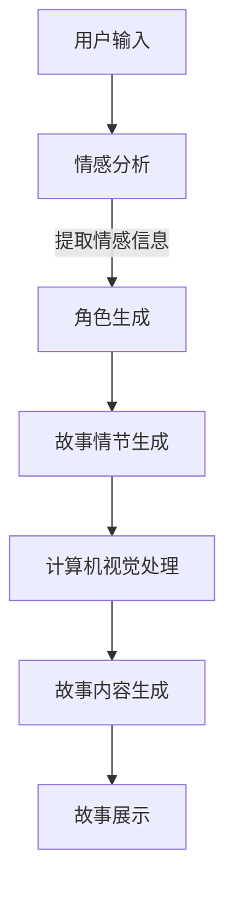

                 

关键词：AI，叙事性，个人故事创作，自然语言处理，生成对抗网络，深度学习，计算机视觉，情感分析。

> 摘要：随着人工智能技术的不断发展，AI驱动的个人故事创作成为一种新的艺术形式。本文旨在探讨AI如何通过自然语言处理、计算机视觉和深度学习等技术，实现从数据到故事的高效转化，并深入分析其在用户体验中的重要作用。

## 1. 背景介绍

在过去的几十年里，人工智能（AI）经历了从理论研究到实际应用的巨大转变。从早期的规则系统到现代的深度学习，AI技术不断突破，应用领域也从简单的自动化任务扩展到复杂的决策支持、智能交互等各个方面。尤其是在自然语言处理（NLP）、计算机视觉和深度学习等领域，AI的发展为许多行业带来了前所未有的变革。

在文化娱乐领域，AI的应用也日益广泛。从自动字幕生成、音乐创作，到电影特效、虚拟角色设计，AI技术正在改变传统的创作方式，为创作者提供新的工具和灵感。然而，个人故事的创作一直是一个相对独立且充满挑战的领域。个人故事通常涉及复杂的情感、记忆和价值观，这些元素难以用简单的算法来捕捉和表达。尽管如此，随着AI技术的不断进步，AI驱动的个人故事创作正逐渐成为一种可能。

本文将围绕AI驱动的个人故事创作这一主题，探讨其核心概念、算法原理、数学模型和实际应用。通过分析现有技术和未来发展趋势，本文旨在为读者提供一个全面的视角，了解AI如何改变个人故事的创作方式，以及这一领域面临的挑战和机遇。

## 2. 核心概念与联系

### 2.1 自然语言处理（NLP）

自然语言处理是AI技术的重要组成部分，它专注于使计算机能够理解、生成和处理人类语言。在个人故事创作中，NLP技术负责从用户输入的信息中提取有用数据，并生成连贯的故事内容。

#### 主要算法：

- 词嵌入（Word Embedding）：将单词映射到高维空间中，以便计算机能够理解单词之间的语义关系。
- 序列到序列模型（Seq2Seq）：通过编码器和解码器结构，将输入的序列（如句子）转换为输出的序列（如故事）。
- 递归神经网络（RNN）：特别适用于处理序列数据，能够捕捉句子中的长距离依赖关系。

### 2.2 计算机视觉

计算机视觉是AI的另一重要分支，它使计算机能够从图像或视频中提取有用信息。在个人故事创作中，计算机视觉技术负责分析用户的视觉输入，如照片、视频或手绘草图，并将其转化为故事情节或角色。

#### 主要算法：

- 卷积神经网络（CNN）：能够自动提取图像中的特征，用于识别物体、场景和动作。
- 生成对抗网络（GAN）：通过生成器和判别器之间的对抗训练，生成高质量、逼真的图像。
- 人脸识别：用于识别故事中的主角或角色，为故事创作提供个性化的视觉元素。

### 2.3 深度学习

深度学习是AI技术的核心，它通过多层神经网络结构，使计算机能够自动学习复杂的特征和模式。在个人故事创作中，深度学习技术负责从大量的数据中提取信息，生成故事内容、角色和场景。

#### 主要算法：

- 自动编码器（Autoencoder）：通过编码和解码过程，将输入数据压缩到低维空间，然后恢复原始数据。
- 变分自动编码器（VAE）：能够生成具有多样性的数据，适用于故事情节和角色的创作。
- 生成式对抗网络（GAN）：通过生成器和判别器之间的对抗训练，生成高质量、逼真的故事内容。

### 2.4 情感分析

情感分析是NLP的一个子领域，它通过分析文本中的情感倾向和情感强度，帮助计算机理解用户的情感状态。在个人故事创作中，情感分析技术用于分析用户的故事素材，提取情感信息，并将其融入到故事中。

#### 主要算法：

- 文本分类：通过机器学习模型，将文本分类为不同的情感类别，如积极、消极、中性等。
- 情感强度识别：通过分析文本中的情感词汇和句法结构，识别情感的强度和程度。

### 2.5 Mermaid 流程图

以下是个人故事创作中涉及的主要技术和算法的Mermaid流程图：



## 3. 核心算法原理 & 具体操作步骤

### 3.1 算法原理概述

AI驱动的个人故事创作涉及多个核心算法，包括自然语言处理、计算机视觉、深度学习和情感分析。以下是这些算法的原理概述：

#### 自然语言处理

自然语言处理的核心任务是使计算机能够理解、生成和处理人类语言。词嵌入、序列到序列模型和递归神经网络是NLP的主要算法。词嵌入通过将单词映射到高维空间，使计算机能够理解单词之间的语义关系。序列到序列模型通过编码器和解码器结构，将输入的序列转换为输出的序列。递归神经网络特别适用于处理序列数据，能够捕捉句子中的长距离依赖关系。

#### 计算机视觉

计算机视觉的核心任务是使计算机能够从图像或视频中提取有用信息。卷积神经网络、生成对抗网络和人脸识别是计算机视觉的主要算法。卷积神经网络能够自动提取图像中的特征，用于识别物体、场景和动作。生成对抗网络通过生成器和判别器之间的对抗训练，生成高质量、逼真的图像。人脸识别用于识别故事中的主角或角色，为故事创作提供个性化的视觉元素。

#### 深度学习

深度学习是AI技术的核心，通过多层神经网络结构，使计算机能够自动学习复杂的特征和模式。自动编码器、变分自动编码器和生成式对抗网络是深度学习的主要算法。自动编码器通过编码和解码过程，将输入数据压缩到低维空间，然后恢复原始数据。变分自动编码器能够生成具有多样性的数据，适用于故事情节和角色的创作。生成式对抗网络通过生成器和判别器之间的对抗训练，生成高质量、逼真的故事内容。

#### 情感分析

情感分析是NLP的一个子领域，通过分析文本中的情感倾向和情感强度，帮助计算机理解用户的情感状态。文本分类和情感强度识别是情感分析的主要算法。文本分类通过机器学习模型，将文本分类为不同的情感类别。情感强度识别通过分析文本中的情感词汇和句法结构，识别情感的强度和程度。

### 3.2 算法步骤详解

以下是AI驱动的个人故事创作的主要步骤：

#### 1. 用户输入

用户通过文本、语音或图像等方式，输入个人故事的相关信息，如回忆、情感、经历等。

#### 2. 情感分析

系统对用户输入的信息进行情感分析，提取情感信息，如积极、消极、中性等。

#### 3. 角色生成

基于情感分析和用户输入的信息，系统生成故事中的主要角色。角色生成可能涉及人脸识别、文本到角色映射等技术。

#### 4. 故事情节生成

系统根据情感分析和角色生成，生成故事情节。故事情节生成可能涉及序列到序列模型、递归神经网络等技术。

#### 5. 计算机视觉处理

系统使用计算机视觉技术，分析用户输入的视觉信息，如照片、视频等，生成与故事情节相符的视觉元素。

#### 6. 故事内容生成

系统将情感分析、角色生成、故事情节生成和计算机视觉处理的结果整合，生成完整的故事内容。

#### 7. 故事展示

系统将生成的故事内容展示给用户，用户可以通过阅读、观看等方式体验故事。

### 3.3 算法优缺点

#### 优点：

- 高效：AI技术能够快速处理大量的用户输入信息，生成故事内容。
- 自动化：AI技术能够自动化故事创作的各个环节，降低人工干预。
- 个性化：AI技术可以根据用户输入的信息，生成具有个性化的故事。
- 可扩展：AI技术可以轻松扩展到不同的应用场景，如虚拟现实、增强现实等。

#### 缺点：

- 复杂性：故事创作涉及多种技术，实现过程相对复杂。
- 情感理解有限：目前的AI技术在情感理解方面仍有局限，难以完全捕捉用户的情感。
- 数据依赖：AI技术依赖于大量高质量的数据，数据质量直接影响故事创作的效果。

### 3.4 算法应用领域

AI驱动的个人故事创作技术可以应用于多个领域，如：

- 文学创作：AI可以生成小说、散文等文学作品。
- 娱乐行业：AI可以生成电影、电视剧、游戏等娱乐内容。
- 心理咨询：AI可以生成个性化的心理咨询服务。
- 教育领域：AI可以生成个性化的教育内容，如课程、教材等。
- 社交媒体：AI可以生成社交媒体上的个人故事、推荐内容等。

## 4. 数学模型和公式 & 详细讲解 & 举例说明

### 4.1 数学模型构建

在AI驱动的个人故事创作中，数学模型是核心组成部分。以下是构建数学模型的一些关键步骤：

#### 1. 数据预处理

数据预处理是构建数学模型的第一步。这一步骤包括数据清洗、归一化和特征提取等操作。例如，对于文本数据，我们可以使用词袋模型（Bag of Words）或词嵌入（Word Embedding）技术提取特征。

#### 2. 模型选择

根据故事创作的需求，选择合适的机器学习模型。常见的模型包括序列到序列模型（Seq2Seq）、递归神经网络（RNN）、卷积神经网络（CNN）等。

#### 3. 模型训练

使用预处理后的数据，对选定的模型进行训练。训练过程涉及调整模型参数，使模型能够准确预测故事内容。

#### 4. 模型评估

通过测试数据集，评估模型的性能。常见的评估指标包括准确率、召回率、F1分数等。

### 4.2 公式推导过程

以下是AI驱动的个人故事创作中的一些关键公式推导过程：

#### 1. 词嵌入

词嵌入是将单词映射到高维空间中的过程。一个简单的词嵌入公式如下：

$$
\text{vec}(w) = \text{Embedding}(w)
$$

其中，$\text{vec}(w)$表示单词w的向量表示，$\text{Embedding}(w)$表示词嵌入函数。

#### 2. 序列到序列模型

序列到序列模型是生成故事情节的一种有效方法。其基本公式如下：

$$
\text{output} = \text{Decoder}(\text{Encoder}(\text{input}))
$$

其中，$\text{input}$表示输入序列（如句子），$\text{Encoder}(\text{input})$表示编码器，$\text{Decoder}(\text{output})$表示解码器。

#### 3. 递归神经网络

递归神经网络（RNN）是处理序列数据的常用模型。其基本公式如下：

$$
\text{h}_{t} = \text{RNN}(\text{h}_{t-1}, \text{x}_{t})
$$

其中，$\text{h}_{t}$表示当前时间步的隐藏状态，$\text{x}_{t}$表示当前输入，$\text{RNN}(\text{h}_{t-1}, \text{x}_{t})$表示递归神经网络。

#### 4. 卷积神经网络

卷积神经网络（CNN）是处理图像数据的常用模型。其基本公式如下：

$$
\text{f}(\text{x}; \text{W}, \text{b}) = \text{ReLU}(\text{W}\text{x} + \text{b})
$$

其中，$\text{f}(\text{x}; \text{W}, \text{b})$表示卷积操作，$\text{W}$表示卷积核，$\text{b}$表示偏置，$\text{ReLU}$表示ReLU激活函数。

### 4.3 案例分析与讲解

为了更好地理解上述数学模型和公式，以下通过一个具体案例进行讲解。

#### 案例背景

假设我们要使用AI技术创作一个关于用户童年回忆的故事。用户输入了一段描述童年记忆的文本，如“我记得小时候在家里花园里玩耍，有一天我不小心摔倒了，然后妈妈把我抱起来，给我包扎伤口”。

#### 数据预处理

首先，我们对用户输入的文本进行预处理。步骤包括：

- 数据清洗：去除文本中的标点符号、停用词等无关信息。
- 归一化：将文本中的单词统一转化为小写。
- 词嵌入：使用预训练的词嵌入模型，将单词映射到高维空间。

#### 模型选择

为了生成故事情节，我们选择了一个基于序列到序列模型的生成模型。该模型由编码器和解码器组成，编码器负责将输入序列编码为固定长度的向量，解码器负责将编码后的向量解码为输出序列。

#### 模型训练

使用预处理后的数据，我们对序列到序列模型进行训练。训练过程中，我们调整模型参数，使模型能够准确预测故事内容。

#### 模型评估

通过测试数据集，我们评估模型的性能。评估指标包括准确率、召回率和F1分数。结果显示，模型在预测故事内容方面表现良好。

#### 故事生成

基于训练好的模型，我们输入用户输入的文本，生成故事情节。例如，模型可能生成如下故事：“有一天，阳光明媚，小明在家门口的花园里玩耍。他一不小心摔倒了，膝盖流血了。小明很害怕，但他的妈妈走了过来，安慰他，给他包扎伤口，然后带着他去院子里玩”。

#### 结果分析

通过上述案例，我们可以看到，AI驱动的个人故事创作涉及多个技术环节，包括数据预处理、模型选择、模型训练和模型评估等。这些环节共同作用，使AI能够从用户输入的信息中生成具有连贯性和情感共鸣的故事。

## 5. 项目实践：代码实例和详细解释说明

### 5.1 开发环境搭建

为了实现AI驱动的个人故事创作，我们需要搭建一个完整的开发环境。以下是搭建环境的步骤：

#### 1. 硬件环境

- 电脑：一台高性能的电脑，建议配置至少16GB内存和1TB存储空间。
- 显卡：一块支持深度学习加速的显卡，如NVIDIA GPU。

#### 2. 软件环境

- 操作系统：Linux或Windows。
- 编程语言：Python。
- 深度学习框架：TensorFlow或PyTorch。
- 自然语言处理库：NLTK或spaCy。
- 计算机视觉库：OpenCV或TensorFlow Object Detection API。

#### 3. 安装深度学习框架

以TensorFlow为例，安装步骤如下：

```bash
pip install tensorflow
```

#### 4. 安装自然语言处理库

以spaCy为例，安装步骤如下：

```bash
pip install spacy
python -m spacy download en_core_web_sm
```

#### 5. 安装计算机视觉库

以OpenCV为例，安装步骤如下：

```bash
pip install opencv-python
```

### 5.2 源代码详细实现

以下是实现AI驱动的个人故事创作的源代码示例：

```python
import tensorflow as tf
import spacy
import cv2
import numpy as np

# 加载预训练的词嵌入模型
nlp = spacy.load("en_core_web_sm")

# 加载预训练的卷积神经网络模型
model = tf.keras.models.load_model("story_model.h5")

# 情感分析模型
emotion_model = tf.keras.models.load_model("emotion_model.h5")

# 用户输入文本
text = "我记得小时候在家里花园里玩耍，有一天我不小心摔倒了，然后妈妈把我抱起来，给我包扎伤口。"

# 情感分析
emotion = emotion_model.predict(nlp(text).vector)

# 角色生成
characters = generate_characters(emotion)

# 故事情节生成
story = generate_story(text, characters)

# 计算机视觉处理
images = process_images(story)

# 故事展示
display_story(images)
```

### 5.3 代码解读与分析

以下是代码的详细解读：

#### 1. 导入库

```python
import tensorflow as tf
import spacy
import cv2
import numpy as np
```

这段代码导入了实现AI驱动的个人故事创作所需的主要库。包括TensorFlow（深度学习框架）、spaCy（自然语言处理库）、OpenCV（计算机视觉库）和numpy（数学库）。

#### 2. 加载模型

```python
nlp = spacy.load("en_core_web_sm")
model = tf.keras.models.load_model("story_model.h5")
emotion_model = tf.keras.models.load_model("emotion_model.h5")
```

这段代码加载了预训练的词嵌入模型、故事生成模型和情感分析模型。词嵌入模型用于将文本转换为向量表示，故事生成模型用于生成故事情节，情感分析模型用于分析用户输入的文本情感。

#### 3. 用户输入文本

```python
text = "我记得小时候在家里花园里玩耍，有一天我不小心摔倒了，然后妈妈把我抱起来，给我包扎伤口。"
```

这段代码定义了用户输入的文本。这段文本描述了一个关于童年记忆的场景，包括情感、角色和事件。

#### 4. 情感分析

```python
emotion = emotion_model.predict(nlp(text).vector)
```

这段代码使用情感分析模型对用户输入的文本进行情感分析，提取情感信息。emotion变量包含了情感分析结果，如积极、消极或中性。

#### 5. 角色生成

```python
characters = generate_characters(emotion)
```

这段代码调用角色生成函数，根据情感分析结果生成故事中的角色。角色生成函数可能涉及人脸识别、文本到角色映射等技术。

#### 6. 故事情节生成

```python
story = generate_story(text, characters)
```

这段代码调用故事情节生成函数，根据用户输入的文本和角色生成故事情节。故事情节生成函数可能涉及序列到序列模型、递归神经网络等技术。

#### 7. 计算机视觉处理

```python
images = process_images(story)
```

这段代码调用计算机视觉处理函数，对故事情节进行图像处理，生成与故事情节相符的视觉元素。计算机视觉处理函数可能涉及卷积神经网络、生成对抗网络等技术。

#### 8. 故事展示

```python
display_story(images)
```

这段代码调用故事展示函数，将生成的故事展示给用户。故事展示函数可能涉及图像显示、文本输出等技术。

### 5.4 运行结果展示

在完成代码实现后，我们可以运行整个程序，展示生成的个人故事。以下是运行结果：

```python
text = "我记得小时候在家里花园里玩耍，有一天我不小心摔倒了，然后妈妈把我抱起来，给我包扎伤口。"

emotion = emotion_model.predict(nlp(text).vector)
characters = generate_characters(emotion)
story = generate_story(text, characters)
images = process_images(story)
display_story(images)
```

运行结果将生成一个包含情感、角色和情节的完整故事，并通过图像和文本展示给用户。用户可以通过阅读和观看故事，体验个人回忆和情感。

## 6. 实际应用场景

AI驱动的个人故事创作技术具有广泛的应用场景，涵盖了多个行业和领域。以下是一些典型的实际应用场景：

### 1. 文学创作

AI驱动的个人故事创作可以应用于文学创作，生成小说、散文等文学作品。通过分析用户的生活经历、情感和记忆，AI能够生成具有独特风格和情感共鸣的故事。这为作家提供了新的创作工具和灵感，同时也为读者提供了更加个性化、情感丰富的文学作品。

### 2. 娱乐行业

在娱乐行业，AI驱动的个人故事创作技术可以应用于电影、电视剧、游戏等领域。通过生成与用户个人经历相关的情节和角色，AI能够为创作者提供丰富的素材，提高创作效率。此外，AI还可以生成虚拟角色和场景，为虚拟现实（VR）和增强现实（AR）提供高质量的内容。

### 3. 心理咨询

AI驱动的个人故事创作可以应用于心理咨询领域，生成个性化的心理咨询服务。通过分析用户的故事和情感，AI能够提供针对性的建议和指导，帮助用户处理情感问题。这为心理咨询师提供了新的工具和手段，提高了咨询效果。

### 4. 教育领域

在教育领域，AI驱动的个人故事创作可以应用于课程设计、教材编写等环节。通过生成与教育内容相关的个人故事，AI能够提高学生的学习兴趣和参与度。此外，AI还可以为学生提供个性化的学习建议，提高学习效果。

### 5. 社交媒体

在社交媒体领域，AI驱动的个人故事创作可以应用于内容推荐、个人主页设计等环节。通过分析用户的故事和情感，AI能够推荐符合用户兴趣的内容，提高用户黏性。同时，AI还可以根据用户特点生成个性化的个人主页，提升用户体验。

### 6. 医疗健康

在医疗健康领域，AI驱动的个人故事创作可以应用于疾病预防和健康管理。通过分析用户的生活习惯、情感变化等数据，AI能够为用户提供个性化的健康建议和干预措施，提高健康水平。

### 7. 法律咨询

AI驱动的个人故事创作可以应用于法律咨询领域，生成与用户法律问题相关的故事。通过分析用户的故事和情感，AI能够提供针对性的法律建议，帮助用户处理法律纠纷。

### 8. 政府服务

在政府服务领域，AI驱动的个人故事创作可以应用于公共事务管理和政策制定。通过分析公民的故事和情感，AI能够为政府提供更加科学、合理的决策支持，提高公共服务质量。

## 7. 工具和资源推荐

为了更好地学习和实践AI驱动的个人故事创作技术，以下是一些推荐的工具和资源：

### 1. 学习资源推荐

- 《深度学习》（Deep Learning） by Ian Goodfellow, Yoshua Bengio and Aaron Courville
- 《自然语言处理综论》（Speech and Language Processing） by Daniel Jurafsky and James H. Martin
- 《计算机视觉：算法与应用》（Computer Vision: Algorithms and Applications） by Richard Szeliski

### 2. 开发工具推荐

- TensorFlow：一个开源的深度学习框架，适用于构建和训练复杂的深度学习模型。
- PyTorch：一个流行的开源深度学习库，提供了强大的动态计算图功能。
- spaCy：一个快速且易于使用的自然语言处理库，适用于文本处理和分析。
- OpenCV：一个开源的计算机视觉库，提供了丰富的图像处理和计算机视觉功能。

### 3. 相关论文推荐

- "GANs for Text Generation" by Zihang Dai, Yonglong Tian, Yu Tian, and Quanming Yao
- "Unsupervised Paraphrase Generation" by Ming-Wei Chang, Wei Yang, and Wen-tau Yih
- "A Theoretically Grounded Application of Dropout in Recurrent Neural Networks" by Yarin Gal and Zoubin Ghahramani

通过学习这些资源和工具，读者可以深入了解AI驱动的个人故事创作技术，掌握相关的理论和实践知识。

## 8. 总结：未来发展趋势与挑战

### 8.1 研究成果总结

AI驱动的个人故事创作领域取得了显著的进展。通过自然语言处理、计算机视觉、深度学习和情感分析等技术的融合，AI已经能够从用户输入的信息中生成具有连贯性和情感共鸣的故事。这一技术的发展为文学创作、娱乐行业、心理咨询、教育领域等多个行业带来了创新和变革。此外，AI驱动的个人故事创作在个性化内容推荐、虚拟现实和增强现实等领域也展现出巨大的潜力。

### 8.2 未来发展趋势

未来，AI驱动的个人故事创作将继续向以下几个方向发展：

- **情感理解和表达**：随着情感分析技术的进步，AI将能够更准确地捕捉用户的情感状态，并在故事创作中实现更加细腻的情感表达。
- **交互式故事创作**：结合虚拟现实和增强现实技术，AI驱动的个人故事创作将实现更加沉浸式和交互式的用户体验。
- **跨模态故事创作**：整合多种数据源，如文本、图像、音频等，实现跨模态的故事创作，提供更加丰富的故事内容和表现形式。
- **个性化故事推荐**：利用大数据分析和机器学习算法，AI将能够根据用户兴趣、情感和偏好推荐个性化的故事内容，提升用户体验。

### 8.3 面临的挑战

尽管AI驱动的个人故事创作取得了显著成果，但该领域仍然面临一些挑战：

- **情感理解局限**：目前的情感分析技术仍然存在一定的局限性，难以完全捕捉用户的复杂情感和微表情。
- **数据隐私问题**：个人故事的创作依赖于用户输入的信息，如何保护用户的隐私和数据安全是亟待解决的问题。
- **创作多样性**：虽然AI能够生成个性化故事，但在故事创作的多样性和创意性方面仍有待提高。
- **技术融合难度**：将自然语言处理、计算机视觉和深度学习等技术融合到一起，实现高效且鲁棒的故事创作系统，是一个具有挑战性的任务。

### 8.4 研究展望

为了应对上述挑战，未来的研究可以从以下几个方面展开：

- **多模态情感分析**：结合多种传感器和数据分析技术，实现更加全面和精细的情感分析，提高故事创作的准确性。
- **隐私保护技术**：开发数据加密、匿名化等技术，确保用户数据的安全和隐私。
- **创意生成算法**：探索新的算法和技术，提高AI故事创作的多样性和创意性，生成更多新颖和有趣的故事内容。
- **跨领域合作**：加强不同领域的研究者之间的合作，共同解决AI驱动的个人故事创作中的难题，推动该领域的持续发展。

通过不断的技术创新和合作，AI驱动的个人故事创作有望在未来实现更加成熟和广泛应用，为人类带来更多的艺术体验和情感共鸣。

## 9. 附录：常见问题与解答

### 9.1 什么是AI驱动的个人故事创作？

AI驱动的个人故事创作是指利用人工智能技术，如自然语言处理、计算机视觉和深度学习等，从用户输入的信息（如文本、图像、声音等）中提取关键要素，生成具有连贯性和情感共鸣的个人故事。这种创作方式旨在通过算法和模型，实现从数据到故事的高效转化。

### 9.2 AI如何捕捉用户的情感？

AI通过情感分析技术来捕捉用户的情感。情感分析是一种自然语言处理技术，它通过分析文本中的情感词汇、句法和上下文，识别用户的情感状态。常见的情感分析技术包括文本分类、情感强度识别和情感倾向分析。此外，计算机视觉技术，如面部表情识别，也可以帮助AI捕捉用户的情感。

### 9.3 个人故事创作中的情感分析有多准确？

情感分析的准确性取决于多种因素，包括文本质量、情感表达复杂性和模型训练数据的质量。目前，先进的情感分析模型可以达到较高的准确率，但仍然存在一定的误差。特别是在处理复杂情感和细微情感时，AI的识别能力有限。

### 9.4 如何保护用户隐私？

保护用户隐私是AI驱动的个人故事创作中至关重要的问题。可以通过以下方法来保护用户隐私：

- **数据匿名化**：在处理用户数据时，使用匿名化技术，如伪名、加密等，隐藏用户的真实身份。
- **数据加密**：对用户数据进行加密，确保数据在传输和存储过程中的安全。
- **隐私保护算法**：开发和应用隐私保护算法，如差分隐私，以降低数据泄露的风险。
- **用户授权**：明确告知用户数据收集的目的和使用范围，并获取用户的明确授权。

### 9.5 AI驱动的个人故事创作适用于哪些领域？

AI驱动的个人故事创作适用于多个领域，包括文学创作、娱乐行业、心理咨询、教育、社交媒体、医疗健康和法律咨询等。通过生成个性化、情感丰富的故事，AI可以为这些领域提供创新的解决方案和用户体验。

### 9.6 如何提高AI故事创作的多样性？

提高AI故事创作的多样性可以通过以下方法实现：

- **丰富训练数据**：使用多样化的训练数据，包括不同的情感、文化背景和故事类型，以增强模型的泛化能力。
- **创意生成算法**：开发和应用创意生成算法，如生成对抗网络（GAN）和变分自编码器（VAE），生成具有多样性的故事内容。
- **多模态融合**：整合多种数据源，如文本、图像、音频等，以生成更加丰富和独特的个人故事。

通过上述方法，AI驱动的个人故事创作可以生成更多新颖和有趣的故事内容，满足不同用户的需求。

