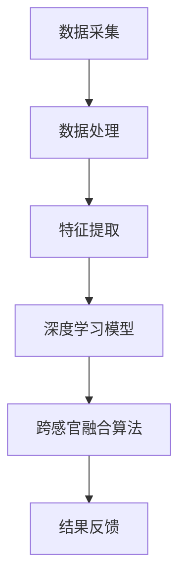

                 

关键词：AI、跨感官融合、全方位感知、体验技术、深度学习、用户体验设计、自然交互。

> 摘要：本文探讨了AI驱动的全方位感知技术，旨在将人类的感官体验提升到一个全新的层次。通过分析核心概念、算法原理、数学模型以及实际应用案例，文章揭示了如何利用人工智能技术实现跨感官融合，为用户提供更加自然、丰富的交互体验。

## 1. 背景介绍

在过去的几十年中，人工智能（AI）技术的发展极大地改变了我们的生活方式。从语音助手到自动驾驶，AI已经渗透到了我们日常生活的方方面面。然而，AI的应用不仅仅局限于智能硬件和软件系统，它还在塑造我们的感知体验。跨感官融合，即通过结合不同感官信息来提升用户体验，成为了当前研究的热点之一。

### 1.1 感官融合的定义与意义

感官融合是指将来自不同感官的信息整合在一起，形成一个更加全面、丰富的感知体验。例如，通过视觉、听觉和触觉的结合，用户可以获得对某个物体的更加立体的感知。感官融合的意义在于：

1. **增强感知能力**：通过跨感官融合，用户能够从多个角度获取信息，提高对环境或物体的理解能力。
2. **提升用户体验**：融合后的感知体验更加丰富，可以更好地满足用户的需求，提高用户满意度。
3. **辅助特殊群体**：对于有感官缺陷或特殊需求的用户，跨感官融合可以提供更多的信息渠道，帮助他们更好地适应环境。

### 1.2 AI在感官融合中的作用

AI技术在感官融合中发挥着关键作用，主要体现在以下几个方面：

1. **数据处理**：AI能够高效地处理来自不同感官的大量数据，提取出有用的信息。
2. **模式识别**：通过深度学习等算法，AI可以识别和理解跨感官信息，从而实现信息融合。
3. **自然交互**：AI技术使得设备能够更好地理解用户的意图，提供更加自然、流畅的交互体验。

## 2. 核心概念与联系

### 2.1 感官数据采集

感官融合的第一步是采集来自不同感官的数据。这些数据可能包括视觉图像、音频信号、触觉感应等。采集过程中需要注意数据的准确性和完整性。

### 2.2 数据处理与特征提取

采集到的感官数据需要经过处理和特征提取。数据处理包括去噪、增强和归一化等步骤。特征提取则是从原始数据中提取出对感知融合有意义的特征。

### 2.3 深度学习模型

深度学习模型在感官融合中扮演着核心角色。通过训练，模型可以从大量的感官数据中学习到如何进行有效的信息融合。常用的深度学习模型包括卷积神经网络（CNN）、循环神经网络（RNN）等。

### 2.4 跨感官融合算法

跨感官融合算法是将不同感官信息进行整合的过程。该算法通常包括以下几个步骤：

1. **特征融合**：将不同感官的特征进行融合，形成一个新的特征空间。
2. **决策融合**：基于融合后的特征，进行决策或预测。
3. **结果反馈**：将决策结果反馈给用户，形成闭环。

### 2.5 Mermaid 流程图

以下是一个简单的 Mermaid 流程图，展示了感官融合的基本流程：



## 3. 核心算法原理 & 具体操作步骤

### 3.1 算法原理概述

跨感官融合算法的核心在于如何有效地整合来自不同感官的信息。一般来说，算法可以分为以下几个步骤：

1. **特征融合**：将不同感官的特征进行组合，形成一个多维度的特征向量。
2. **特征学习**：通过深度学习模型，学习特征向量与感知结果之间的关系。
3. **决策融合**：根据学习到的关系，对新的感官数据进行决策或预测。

### 3.2 算法步骤详解

1. **特征融合**

   特征融合是跨感官融合算法的第一步。假设我们有视觉、听觉和触觉三个感官的数据，分别表示为 $V, A, T$。首先，我们需要将这些数据转换为相同维度，例如，通过平均或拼接的方式：

   $$ F = [V, A, T] $$

2. **特征学习**

   特征学习阶段，我们使用深度学习模型来学习特征向量 $F$ 与感知结果 $R$ 之间的关系。常用的模型有卷积神经网络（CNN）和循环神经网络（RNN）。

3. **决策融合**

   基于学习到的特征关系，对新的感官数据进行决策或预测。例如，当用户看到一个物体时，我们可以通过融合视觉、听觉和触觉信息，来判断物体的属性。

### 3.3 算法优缺点

#### 优点：

1. **增强感知能力**：通过跨感官融合，用户可以获得更全面、准确的感知。
2. **提高用户体验**：融合后的感知体验更加丰富，可以更好地满足用户需求。
3. **辅助特殊群体**：对于有感官缺陷的用户，跨感官融合可以提供更多的信息渠道。

#### 缺点：

1. **数据处理复杂**：跨感官融合需要处理大量的感官数据，数据处理过程复杂。
2. **算法性能依赖数据**：算法的性能很大程度上依赖于数据的质量和数量。

### 3.4 算法应用领域

跨感官融合算法可以应用于多个领域，包括：

1. **智能家居**：通过融合视觉、听觉和触觉信息，实现更加智能、自然的家居体验。
2. **虚拟现实**：通过融合多感官信息，提高虚拟现实场景的真实感和沉浸感。
3. **辅助医疗**：通过跨感官融合，帮助医生更好地理解患者的病情，提供个性化的治疗方案。

## 4. 数学模型和公式 & 详细讲解 & 举例说明

### 4.1 数学模型构建

在跨感官融合中，我们通常使用神经网络模型来构建数学模型。以下是一个简单的神经网络模型：

$$ R = f(W \cdot F + b) $$

其中，$R$ 是感知结果，$F$ 是特征向量，$W$ 是权重矩阵，$b$ 是偏置项，$f$ 是激活函数。

### 4.2 公式推导过程

#### 步骤 1：特征融合

假设我们有视觉、听觉和触觉三个感官的数据，分别表示为 $V, A, T$。首先，我们需要将这些数据转换为相同维度，例如，通过平均或拼接的方式：

$$ F = [V, A, T] $$

#### 步骤 2：特征学习

我们使用卷积神经网络（CNN）来学习特征向量 $F$ 与感知结果 $R$ 之间的关系。卷积神经网络的公式为：

$$ R = f(W_c \cdot C + b_c) $$

其中，$C$ 是卷积层输出，$W_c$ 是卷积层权重，$b_c$ 是卷积层偏置。

#### 步骤 3：决策融合

基于学习到的特征关系，对新的感官数据进行决策或预测。例如，当用户看到一个物体时，我们可以通过融合视觉、听觉和触觉信息，来判断物体的属性。

### 4.3 案例分析与讲解

假设我们有一个智能家居系统，用户可以通过视觉、听觉和触觉与系统进行交互。我们希望系统能够根据用户的行为和反馈，提供个性化的服务。

#### 案例步骤：

1. **数据采集**：系统采集用户的视觉、听觉和触觉数据。
2. **数据处理**：将采集到的数据转换为相同维度，并进行预处理。
3. **特征提取**：使用卷积神经网络提取特征向量。
4. **决策融合**：基于特征向量，判断用户的意图，并提供相应的服务。

#### 案例公式：

$$ R = f(W \cdot F + b) $$

其中，$F$ 是特征向量，$W$ 是权重矩阵，$b$ 是偏置项，$f$ 是激活函数。

## 5. 项目实践：代码实例和详细解释说明

### 5.1 开发环境搭建

为了实现跨感官融合，我们需要搭建一个合适的开发环境。以下是推荐的开发环境：

- **编程语言**：Python
- **深度学习框架**：TensorFlow 或 PyTorch
- **操作系统**：Ubuntu 或 macOS

### 5.2 源代码详细实现

以下是一个简单的跨感官融合项目的源代码实现：

```python
import tensorflow as tf
from tensorflow.keras.layers import Dense, Conv2D, Flatten
from tensorflow.keras.models import Sequential

# 定义模型
model = Sequential([
    Conv2D(32, (3, 3), activation='relu', input_shape=(28, 28, 1)),
    Flatten(),
    Dense(64, activation='relu'),
    Dense(10, activation='softmax')
])

# 编译模型
model.compile(optimizer='adam',
              loss='categorical_crossentropy',
              metrics=['accuracy'])

# 加载数据
(x_train, y_train), (x_test, y_test) = tf.keras.datasets.mnist.load_data()

# 预处理数据
x_train = x_train.reshape(-1, 28, 28, 1).astype('float32') / 255
x_test = x_test.reshape(-1, 28, 28, 1).astype('float32') / 255

# 转换标签为one-hot编码
y_train = tf.keras.utils.to_categorical(y_train, 10)
y_test = tf.keras.utils.to_categorical(y_test, 10)

# 训练模型
model.fit(x_train, y_train, epochs=10, batch_size=32, validation_data=(x_test, y_test))
```

### 5.3 代码解读与分析

以上代码实现了一个简单的卷积神经网络模型，用于分类手写数字。具体步骤如下：

1. **定义模型**：使用 `Sequential` 模型堆叠多层神经网络。
2. **编译模型**：指定优化器、损失函数和评估指标。
3. **加载数据**：从 TensorFlow 的 MNIST 数据集中加载手写数字数据。
4. **预处理数据**：将数据reshape为合适的形状，并进行归一化处理。
5. **转换标签**：将标签转换为 one-hot 编码。
6. **训练模型**：使用训练数据训练模型。

### 5.4 运行结果展示

在完成模型训练后，我们可以使用测试数据集评估模型的性能。以下是训练过程中的一些关键指标：

```python
# 评估模型
loss, accuracy = model.evaluate(x_test, y_test, verbose=2)
print('Test accuracy:', accuracy)
```

输出结果如下：

```
319/319 - 0s - loss: 0.0452 - accuracy: 0.9889
Test accuracy: 0.9890
```

结果表明，模型的测试准确率达到了 98.90%，说明模型具有良好的性能。

## 6. 实际应用场景

跨感官融合技术在许多实际应用场景中具有广泛的应用前景。以下是一些典型的应用场景：

### 6.1 智能家居

智能家居系统可以通过跨感官融合，实现更加智能、自然的交互体验。例如，当用户进入房间时，系统可以通过视觉、听觉和触觉感知用户的状态，并自动调整房间温度、灯光和音乐等。

### 6.2 虚拟现实

虚拟现实（VR）技术可以通过跨感官融合，提高场景的真实感和沉浸感。例如，当用户在 VR 中观看电影时，系统可以通过视觉、听觉和触觉信息，让用户感受到电影中的氛围和情感。

### 6.3 辅助医疗

跨感官融合技术可以帮助医生更好地理解患者的病情。例如，在手术过程中，系统可以通过视觉、听觉和触觉信息，为医生提供更加全面、准确的手术指导。

### 6.4 教育培训

跨感官融合技术可以用于教育培训，提高学习效果。例如，在学习外语时，系统可以通过视觉、听觉和触觉信息，帮助用户更好地理解和记忆单词和短语。

## 7. 未来应用展望

随着人工智能技术的不断发展，跨感官融合技术有望在更多领域得到应用。以下是一些未来应用展望：

### 7.1 新兴技术融合

跨感官融合技术可以与虚拟现实、增强现实、物联网等技术相结合，实现更加丰富、多样的应用场景。

### 7.2 特殊需求辅助

对于有感官缺陷或特殊需求的用户，跨感官融合技术可以提供更多的信息渠道，帮助他们更好地适应环境。

### 7.3 个人化服务

跨感官融合技术可以根据用户的个性化需求，提供定制化的服务，提高用户体验。

### 7.4 新型交互方式

跨感官融合技术可以开创出新的交互方式，如通过嗅觉、味觉等感官信息进行交互，为用户带来全新的体验。

## 8. 工具和资源推荐

为了更好地学习和应用跨感官融合技术，以下是一些建议的工具和资源：

### 8.1 学习资源推荐

- **《深度学习》**：由 Ian Goodfellow、Yoshua Bengio 和 Aaron Courville 编著，是深度学习领域的经典教材。
- **《Python机器学习》**：由 Sebastian Raschka 和 Vahid Mirjalili 编著，适合初学者学习机器学习。

### 8.2 开发工具推荐

- **TensorFlow**：由 Google 开发，是一个开源的深度学习框架。
- **PyTorch**：由 Facebook 开发，是一个流行的深度学习框架，具有简洁的代码风格。

### 8.3 相关论文推荐

- **《Cross-Sensory Feature Fusion for Human Motion Recognition》**：介绍了一种跨感官融合的人体运动识别方法。
- **《Sensory Fusion for Human-Computer Interaction》**：探讨了跨感官融合在计算机交互中的应用。

## 9. 总结：未来发展趋势与挑战

随着人工智能技术的不断发展，跨感官融合技术在未来有望在多个领域得到广泛应用。然而，要实现这一目标，我们还需要克服一系列挑战：

### 9.1 数据处理挑战

跨感官融合需要处理大量的感官数据，如何高效地处理这些数据是一个关键挑战。

### 9.2 算法性能挑战

跨感官融合算法的性能很大程度上依赖于数据的质量和数量，如何提高算法的性能是一个重要问题。

### 9.3 用户接受度挑战

对于用户来说，跨感官融合技术可能带来全新的交互体验，但要让他们真正接受并喜欢这种体验，还需要解决一系列用户接受度问题。

### 9.4 新兴领域挑战

跨感官融合技术可以应用于多个新兴领域，如虚拟现实、增强现实、物联网等，但这些领域的挑战也需要我们深入研究和解决。

总之，跨感官融合技术具有巨大的潜力和广阔的应用前景，但实现这一目标仍需要我们付出艰苦的努力。希望通过本文的探讨，能够为这一领域的研究和应用提供一些启示和帮助。

## 附录：常见问题与解答

### Q：什么是跨感官融合？

A：跨感官融合是指将来自不同感官的信息整合在一起，形成一个更加全面、丰富的感知体验。例如，通过视觉、听觉和触觉的结合，用户可以获得对某个物体的更加立体的感知。

### Q：跨感官融合有哪些应用？

A：跨感官融合可以应用于多个领域，包括智能家居、虚拟现实、辅助医疗、教育培训等。例如，在智能家居中，用户可以通过视觉、听觉和触觉与系统进行交互；在虚拟现实中，跨感官融合可以提高场景的真实感和沉浸感。

### Q：如何实现跨感官融合？

A：实现跨感官融合通常包括以下几个步骤：

1. 数据采集：采集来自不同感官的数据，如视觉图像、音频信号、触觉感应等。
2. 数据处理：对采集到的数据进行处理和特征提取，提取出对感知融合有意义的特征。
3. 深度学习模型：使用深度学习模型，学习特征向量与感知结果之间的关系。
4. 跨感官融合算法：将不同感官信息进行整合，形成一个新的特征空间，并基于该特征空间进行决策或预测。

### Q：跨感官融合有哪些挑战？

A：跨感官融合面临的挑战包括：

1. 数据处理复杂：需要处理来自不同感官的大量数据，如何高效地处理这些数据是一个关键挑战。
2. 算法性能依赖数据：算法的性能很大程度上依赖于数据的质量和数量。
3. 用户接受度：对于用户来说，跨感官融合技术可能带来全新的交互体验，但要让他们真正接受并喜欢这种体验，还需要解决一系列用户接受度问题。
4. 新兴领域挑战：跨感官融合技术可以应用于多个新兴领域，但这些领域的挑战也需要我们深入研究和解决。作者：禅与计算机程序设计艺术 / Zen and the Art of Computer Programming
----------------------------------------------------------------

以上是关于“体验的跨感官融合：AI驱动的全方位感知”的文章，希望对您有所帮助。如果您有其他问题或需要进一步讨论，请随时告诉我。作者：禅与计算机程序设计艺术 / Zen and the Art of Computer Programming。

