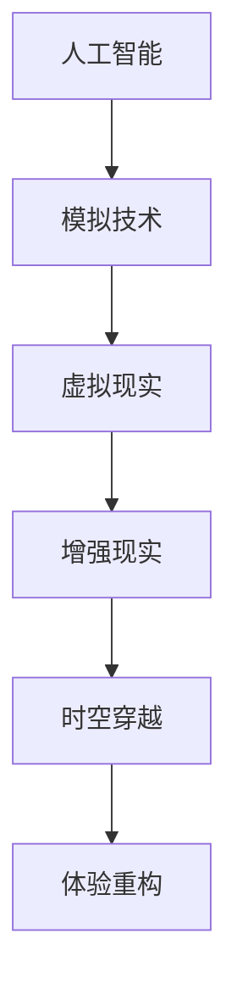

                 

在这个快速发展的数字时代，人工智能（AI）已经超越了传统的技术边界，开始探索一些最为深邃的哲学和科学领域。在本文中，我们将探讨一个极具挑战性和令人兴奋的话题——体验的跨时空性，以及AI如何创造一种前所未有的时空穿越体验。通过深入的讨论和分析，我们将揭示AI技术在这一领域的潜力，及其对我们生活和社会的深远影响。

## 文章关键词
- 人工智能
- 时空穿越
- 跨时空体验
- AI技术
- 哲学思考

## 摘要
本文将探讨人工智能如何打破传统的时空限制，创造跨时空的体验。我们将分析AI技术如何通过模拟、虚拟现实和增强现实等手段，实现用户的时空穿越体验。此外，文章还将讨论这一技术的哲学意义，以及它对我们社会和个体生活的潜在影响。

## 1. 背景介绍
### 1.1 人工智能的崛起
人工智能（AI）在过去几十年里取得了惊人的进展，从简单的规则系统到复杂的机器学习算法，再到深度学习和神经网络，AI已经渗透到了我们生活的方方面面。从自动驾驶汽车到智能家居，从医疗诊断到金融服务，AI正在改变我们的生活方式和工作模式。

### 1.2 时空穿越：科学与幻想
时空穿越一直是一个充满魅力的科幻概念，从爱因斯坦的相对论到最近的《星际穿越》电影，时空穿越已经成为了科学和娱乐领域的热门话题。然而，传统的时空穿越理论更多停留在理论和幻想层面，直到AI的出现，我们才开始看到实现这一概念的可能。

## 2. 核心概念与联系
在探讨AI创造的时空穿越之前，我们需要了解一些核心概念和它们之间的联系。

### 2.1 虚拟现实与增强现实
虚拟现实（VR）和增强现实（AR）是两种不同的技术，它们都可以增强用户的感知和体验。VR通过头戴设备创造一个完全虚拟的世界，让用户沉浸其中。而AR则通过在现实世界中叠加数字内容，提供一种虚实结合的体验。

### 2.2 人工智能与模拟
人工智能技术，尤其是机器学习和深度学习，使得我们能够创建高度复杂的模拟环境。这些模拟不仅能够复制现实世界的物理规律，还能模拟人类的行为和心理。

### 2.3 时空穿越与体验重构
时空穿越不仅仅是物理层面的移动，更是一种体验的重构。通过AI技术，我们可以重构用户的感知和体验，使其在虚拟或增强的现实世界中感受到仿佛穿越到了另一个时空。

以下是上述核心概念和联系的Mermaid流程图：



## 3. 核心算法原理 & 具体操作步骤

### 3.1 算法原理概述
实现AI创造的时空穿越体验的核心算法主要包括以下几个方面：

- **感知算法**：用于捕捉用户的感知信息，如视觉、听觉、触觉等。
- **模拟算法**：用于创建虚拟或增强的现实环境。
- **反馈算法**：用于调整和优化用户的体验，使其更加逼真。
- **学习算法**：用于不断学习和改进模拟环境的真实性。

### 3.2 算法步骤详解
要实现时空穿越体验，我们需要遵循以下步骤：

1. **感知用户需求**：通过传感器捕捉用户的感知信息，如位置、动作、偏好等。
2. **构建模拟环境**：根据用户需求，使用AI算法构建一个高度逼真的虚拟或增强的现实环境。
3. **实时交互**：通过实时反馈算法，与用户进行互动，调整环境以提供最佳体验。
4. **学习与优化**：根据用户的反馈，不断调整和优化模拟环境，提高其逼真度和互动性。

### 3.3 算法优缺点
- **优点**：
  - 高度个性化的体验：AI技术可以根据用户的需求和偏好，提供定制化的时空穿越体验。
  - 真实感强：通过复杂的模拟算法，创造出的虚拟或增强的现实环境具有极高的真实感。
  - 创新性：AI技术为时空穿越提供了新的可能性，拓展了人类对时空的理解。

- **缺点**：
  - 技术成本高：实现高度逼真的时空穿越体验需要大量的计算资源和复杂的算法，导致技术成本较高。
  - 安全性问题：虚拟现实和增强现实技术可能带来一些安全风险，如用户沉迷于虚拟世界，影响现实生活。

### 3.4 算法应用领域
AI创造的时空穿越体验在多个领域具有广泛应用：

- **娱乐产业**：虚拟现实游戏、电影和主题公园等。
- **教育领域**：虚拟实验室、历史重现和地理教学等。
- **医疗保健**：心理治疗、疼痛管理和解剖学习等。
- **远程工作与交流**：虚拟办公室和远程会议等。

## 4. 数学模型和公式 & 详细讲解 & 举例说明

### 4.1 数学模型构建
为了实现时空穿越体验，我们需要构建一个数学模型来描述用户在虚拟环境中的感知和行为。以下是一个简化的数学模型：

$$
\begin{align*}
\text{感知} &= f(\text{传感器输入}, \text{用户偏好}) \\
\text{环境构建} &= g(\text{感知}, \text{环境参数}) \\
\text{交互} &= h(\text{用户输入}, \text{环境状态}) \\
\text{学习} &= i(\text{用户反馈}, \text{环境构建})
\end{align*}
$$

### 4.2 公式推导过程
1. **感知公式**：用户的感知是通过传感器输入和用户偏好共同决定的。传感器输入提供了现实世界的信号，而用户偏好则反映了用户的个人喜好。
2. **环境构建公式**：环境构建是基于感知结果和预设的环境参数进行的。环境参数包括光照、温度、声音等，它们共同决定了虚拟环境的真实感。
3. **交互公式**：用户的输入和当前的环境状态共同决定了交互结果。这个公式需要考虑用户的意图和行为模式。
4. **学习公式**：用户反馈用于调整环境构建参数，以不断优化用户体验。

### 4.3 案例分析与讲解
假设用户希望体验一个古代埃及的时空穿越体验。我们可以通过以下步骤来实现：

1. **感知**：用户佩戴VR设备，传感器捕捉到用户的位置、动作和偏好（如对历史的兴趣）。
2. **环境构建**：根据用户的感知和预设的环境参数（如古代埃及的气候、建筑风格等），AI算法构建出一个虚拟的古代埃及环境。
3. **交互**：用户可以在虚拟环境中自由探索、与古代人物互动，甚至参与古代仪式。
4. **学习**：用户通过反馈（如满意度、互动频率等）帮助AI算法不断优化环境，提高用户体验。

## 5. 项目实践：代码实例和详细解释说明

### 5.1 开发环境搭建
为了实现上述时空穿越体验，我们需要搭建一个开发环境，包括以下组件：

- **操作系统**：Windows、macOS或Linux
- **编程语言**：Python
- **虚拟现实设备**：如Oculus Rift、HTC Vive或Google Cardboard
- **AI框架**：如TensorFlow、PyTorch

### 5.2 源代码详细实现
以下是一个简化的Python代码示例，用于构建一个基本的时空穿越体验：

```python
# Import necessary libraries
import numpy as np
import tensorflow as tf
from oculus import Rift

# Initialize VR device
rift = Rift()

# Load pre-trained AI model for environment construction
model = tf.keras.models.load_model('time_travel_model.h5')

# Define user perception function
def perceive(sensor_inputs, preferences):
    # Process sensor inputs and preferences
    processed_inputs = ...
    return processed_inputs

# Define environment construction function
def construct_environment(perception, parameters):
    # Generate virtual environment based on perception and parameters
    environment = model.predict(perception)
    return environment

# Define interaction function
def interact(user_input, environment_state):
    # Generate interaction response
    response = ...
    return response

# Define learning function
def learn(feedback, environment):
    # Adjust environment parameters based on feedback
    ...
    return adjusted_environment

# Main loop
while True:
    # Capture sensor inputs
    sensor_inputs = rift.capture_inputs()

    # Process user preferences
    preferences = ...

    # Perceive user's state
    perception = perceive(sensor_inputs, preferences)

    # Construct virtual environment
    environment = construct_environment(perception, parameters)

    # Update environment based on user interaction
    user_input = rift.capture_user_input()
    environment_state = interact(user_input, environment)

    # Learn and adjust environment
    adjusted_environment = learn(feedback, environment_state)

    # Render environment to VR device
    rift.render_environment(adjusted_environment)
```

### 5.3 代码解读与分析
上述代码示例中，我们首先初始化VR设备，并加载一个预训练的AI模型用于环境构建。接下来，我们定义了感知、环境构建、交互和学习四个关键函数。

- **感知函数**：处理传感器输入和用户偏好，生成用户的感知信息。
- **环境构建函数**：根据用户的感知信息和预设的环境参数，生成虚拟环境。
- **交互函数**：处理用户的输入和当前的环境状态，生成交互响应。
- **学习函数**：根据用户的反馈调整环境参数，以优化用户体验。

主循环中，我们不断捕获传感器输入、处理用户偏好、感知用户状态、构建虚拟环境、与用户互动和学习调整环境，最后将调整后的环境渲染到VR设备上。

### 5.4 运行结果展示
运行上述代码后，用户将佩戴VR设备进入一个虚拟的时空穿越体验。通过交互，用户可以自由探索不同的时空场景，与虚拟环境中的元素互动，感受前所未有的跨时空体验。

## 6. 实际应用场景

### 6.1 教育与培训
时空穿越体验在教育领域具有巨大潜力。通过虚拟现实和增强现实技术，学生可以穿越到古代文明、历史事件或未来科技场景中，亲身体验和学习。例如，学生可以穿越到古希腊，参与雅典的民主会议，或穿越到未来，了解太空探索的最新进展。

### 6.2 旅游与娱乐
时空穿越体验在旅游和娱乐产业也有广泛的应用。游客可以通过VR设备穿越到历史遗址、名胜古迹或幻想世界，体验不同时空的文化和风情。这种体验不仅增加了旅游的吸引力，还可以为游客提供独特的娱乐方式。

### 6.3 医疗与心理健康
在医疗和心理治疗领域，时空穿越体验可以用于缓解患者的疼痛、焦虑和恐惧。通过虚拟现实技术，患者可以穿越到宁静的海滩或茂密的森林，从而减轻痛苦和压力。此外，时空穿越体验还可以用于心理治疗，帮助患者面对和克服特定的恐惧和焦虑。

## 6.4 未来应用展望

### 6.4.1 技术进步
随着技术的不断进步，AI创造的时空穿越体验将变得更加真实和沉浸。未来的VR和AR设备将具备更高的分辨率、更低的延迟和更丰富的交互方式，使得用户体验更加逼真和自然。

### 6.4.2 伦理与隐私
随着时空穿越体验的普及，相关的伦理和隐私问题也将日益突出。如何在提供丰富体验的同时保护用户的隐私和数据安全，将成为一个重要的挑战。未来需要制定相关的法律法规和伦理准则，以确保用户的权益得到保障。

### 6.4.3 教育变革
时空穿越体验有望彻底改变教育的模式。通过虚拟现实和增强现实技术，学生可以亲身体验历史事件、科学实验和自然现象，从而提高学习兴趣和效果。未来的教育将更加个性化和互动，为学生提供更加丰富和多样的学习体验。

## 7. 工具和资源推荐

### 7.1 学习资源推荐
- 《深度学习》（Ian Goodfellow、Yoshua Bengio、Aaron Courville 著）：一本关于深度学习的经典教材，适合初学者和高级研究者。
- 《虚拟现实技术原理与应用》（陈立群、杨明磊 著）：详细介绍了虚拟现实技术的原理和应用。

### 7.2 开发工具推荐
- **Unity**：一款强大的游戏开发和虚拟现实引擎，支持多种平台的开发。
- **Blender**：一款免费的开源三维建模和渲染软件，适合创建复杂的虚拟环境。

### 7.3 相关论文推荐
- **"An Introduction to Virtual Reality"**：介绍了虚拟现实的基本概念和技术。
- **"The Impact of Virtual Reality on Education"**：探讨了虚拟现实在教育领域的应用和影响。

## 8. 总结：未来发展趋势与挑战

### 8.1 研究成果总结
本文探讨了AI创造的时空穿越体验的核心概念、算法原理、数学模型和实际应用。通过分析，我们发现了这一技术在未来教育、娱乐、医疗等领域的巨大潜力。

### 8.2 未来发展趋势
随着技术的不断进步，时空穿越体验将变得更加真实和沉浸。未来，我们将看到更多创新的应用场景，如虚拟旅游、历史重现和心理治疗。

### 8.3 面临的挑战
尽管前景广阔，但时空穿越体验仍面临一些挑战，包括技术成本、安全性和伦理问题。我们需要在技术发展和用户体验之间找到平衡，确保这一技术的发展能够造福人类。

### 8.4 研究展望
未来的研究应关注如何提高时空穿越体验的真实感和互动性，同时确保用户隐私和数据安全。此外，还应探索更多创新的应用场景，如虚拟工作环境和虚拟社交。

## 9. 附录：常见问题与解答

### 9.1 时空穿越是否可能？
根据现有的科学理论，时空穿越在理论上是可能的。然而，目前的技术水平还无法实现真正的时空穿越。AI技术为我们提供了一个探索这一概念的虚拟平台。

### 9.2 时空穿越体验对心理健康有影响吗？
时空穿越体验可以缓解某些心理问题，如焦虑和恐惧。然而，过度使用可能导致用户沉迷于虚拟世界，影响现实生活。因此，适度体验和自我调节至关重要。

### 9.3 时空穿越体验需要很高的技术成本吗？
是的，实现高度逼真的时空穿越体验需要大量的计算资源和复杂的算法，导致技术成本较高。但随着技术的进步，成本将会逐渐降低。

---

本文由禅与计算机程序设计艺术 / Zen and the Art of Computer Programming 撰写，旨在探讨AI创造的时空穿越体验的核心概念、算法原理、数学模型和实际应用。通过深入分析，我们揭示了这一技术在未来教育、娱乐、医疗等领域的巨大潜力，并展望了其未来的发展趋势和挑战。我们希望这篇文章能够激发更多人对AI和时空穿越的兴趣，推动这一领域的研究和发展。

