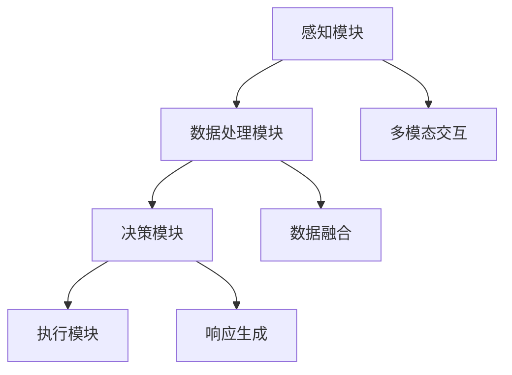

                 

关键词：感官协同、人工智能、体验设计、多模态交互、神经科学

摘要：随着人工智能技术的快速发展，计算机系统开始具备超越人类感官的感知能力和交互方式。本文旨在探讨人工智能如何通过感官协同的方式，创造更加丰富和深入的用户体验。我们将首先介绍感官协同的概念和理论基础，然后深入分析人工智能在感知和交互方面的技术进展，并探讨其应用场景和未来发展方向。

## 1. 背景介绍

人类的生活充满了感官体验，从视觉、听觉、触觉到味觉和嗅觉，这些感官共同作用，构成了我们对世界的感知。然而，人类的感官能力有限，无法同时处理大量复杂的信息。随着信息时代的到来，计算机系统在处理和传递信息方面具有明显的优势。人工智能（AI）技术的进步，使得计算机系统不仅能够模拟人类的感官，还能够超越人类，提供更加精准和高效的感知能力。

感官协同（Sensory Collaboration）是指不同感官系统之间的相互作用和整合，以实现更好的感知体验和更高的效率。传统的计算机交互主要依赖于视觉和触觉，如图形用户界面（GUI）和键盘鼠标。然而，随着多模态交互技术的发展，计算机系统开始能够整合语音、手势、触觉等多种感官信号，提供更加丰富和自然的用户体验。

## 2. 核心概念与联系

### 2.1 感官协同的基本原理

感官协同的核心理念在于将多种感官数据整合，形成一个统一的感知系统。这个过程涉及到数据的收集、处理、融合和响应。感官协同的基本原理包括：

1. **数据收集**：通过传感器和接口设备收集来自不同感官的信息，如摄像头、麦克风、触觉传感器等。
2. **数据处理**：对收集到的数据进行预处理，如降噪、增强和特征提取。
3. **数据融合**：将来自不同感官的数据进行融合，形成一个完整的感知信号。
4. **响应生成**：根据融合后的感知信号，生成适当的响应和反馈，如语音合成、动作控制等。

### 2.2 感官协同架构

感官协同的架构通常包括以下几个关键组成部分：

1. **感知模块**：负责收集各种感官数据，如视觉、听觉、触觉等。
2. **数据处理模块**：对收集到的数据进行处理和融合，形成一个统一的感知信号。
3. **决策模块**：根据感知信号，生成适当的响应和反馈。
4. **执行模块**：执行决策模块生成的响应和反馈。

以下是感官协同架构的 Mermaid 流程图：



### 2.3 感官协同与人工智能

人工智能在感官协同中起着关键作用。AI 可以通过机器学习、深度学习等技术，对感官数据进行高效的处理和分析，从而提升感知系统的性能和智能程度。以下是 AI 在感官协同中的应用：

1. **图像识别**：AI 可以通过卷积神经网络（CNN）对图像进行识别，帮助计算机理解视觉信息。
2. **语音识别**：AI 可以通过循环神经网络（RNN）或长短期记忆网络（LSTM）对语音信号进行识别，实现自然语言处理。
3. **手势识别**：AI 可以通过深度学习模型对用户的手势进行识别，实现手势控制功能。
4. **触觉反馈**：AI 可以通过神经网络模型对触觉信号进行模拟，提供更加真实的触觉体验。

## 3. 核心算法原理 & 具体操作步骤

### 3.1 算法原理概述

感官协同算法的核心在于数据融合和响应生成。数据融合是指将来自不同感官的数据进行整合，形成一个统一的感知信号。响应生成是指根据感知信号，生成适当的响应和反馈。以下是感官协同算法的基本原理：

1. **数据收集**：通过传感器和接口设备收集各种感官数据。
2. **数据处理**：对收集到的数据进行预处理，如降噪、增强和特征提取。
3. **数据融合**：将预处理后的数据进行融合，形成一个统一的感知信号。
4. **响应生成**：根据感知信号，生成适当的响应和反馈。

### 3.2 算法步骤详解

1. **数据收集**：使用各种传感器和接口设备，如摄像头、麦克风、触觉传感器等，收集视觉、听觉、触觉等感官数据。
2. **数据处理**：对收集到的数据进行预处理，如去除噪声、增强信号、提取特征等。
3. **数据融合**：将预处理后的数据进行融合，形成一个统一的感知信号。融合方法包括加权融合、特征融合和模型融合等。
4. **响应生成**：根据融合后的感知信号，生成适当的响应和反馈。响应生成的方法包括语音合成、动作控制、触觉模拟等。

### 3.3 算法优缺点

**优点**：

1. **提高感知效率**：通过整合多种感官数据，可以提高系统的感知效率，提供更加丰富和自然的用户体验。
2. **增强智能程度**：AI 的引入，使得感知系统更加智能，能够自动适应和优化感知过程。
3. **跨领域应用**：感官协同技术可以应用于多个领域，如智能家居、医疗健康、教育娱乐等。

**缺点**：

1. **计算资源消耗**：感官协同算法需要大量的计算资源，尤其是在处理大量感官数据时。
2. **算法复杂性**：感官协同算法涉及多个学科领域，算法复杂度较高，需要专业的技术和知识。

### 3.4 算法应用领域

感官协同算法广泛应用于多个领域，以下是几个典型应用场景：

1. **智能家居**：通过整合视觉、听觉和触觉数据，实现智能家电的控制和交互。
2. **医疗健康**：通过感官协同技术，辅助医生进行疾病诊断和治疗。
3. **教育娱乐**：通过感官协同技术，提供更加生动和有趣的教育和娱乐体验。
4. **工业自动化**：通过感官协同技术，实现工业机器人的智能化和自动化控制。

## 4. 数学模型和公式 & 详细讲解 & 举例说明

### 4.1 数学模型构建

感官协同的数学模型主要包括数据融合模型和响应生成模型。以下是两个典型的数学模型：

#### 数据融合模型

假设我们有来自 n 个感官的信号，分别为 \( x_1, x_2, ..., x_n \)。数据融合模型的目标是将这些信号融合为一个统一的感知信号 \( y \)。

一个简单的数据融合模型是加权融合模型：

\[ y = w_1 x_1 + w_2 x_2 + ... + w_n x_n \]

其中，\( w_1, w_2, ..., w_n \) 是权重，表示不同感官信号的贡献程度。权重可以通过学习算法（如最小均方误差算法）进行优化。

#### 响应生成模型

响应生成模型的目标是根据融合后的感知信号 \( y \)，生成适当的响应 \( z \)。

一个简单的响应生成模型是线性回归模型：

\[ z = a_0 + a_1 y + a_2 y^2 + ... + a_n y^n \]

其中，\( a_0, a_1, ..., a_n \) 是回归系数，可以通过最小二乘法进行优化。

### 4.2 公式推导过程

#### 数据融合模型推导

假设我们有来自 n 个感官的信号 \( x_1, x_2, ..., x_n \)，我们需要将这些信号融合为一个统一的感知信号 \( y \)。

首先，我们定义一个权重矩阵 \( W \)，其中 \( W_{ij} \) 表示第 i 个感官信号对第 j 个感知特征的影响权重。

然后，我们定义一个感知特征矩阵 \( X \)，其中 \( X_{ij} \) 表示第 i 个感官信号的第 j 个特征。

根据加权融合模型，我们有：

\[ y = W X \]

其中，\( y \) 是融合后的感知信号，\( W \) 是权重矩阵，\( X \) 是感知特征矩阵。

#### 响应生成模型推导

假设我们已经得到了融合后的感知信号 \( y \)，我们需要生成适当的响应 \( z \)。

首先，我们定义一个回归系数矩阵 \( A \)，其中 \( A_{ij} \) 表示第 i 个感知特征对响应的影响权重。

然后，我们定义一个响应特征矩阵 \( Y \)，其中 \( Y_{ij} \) 表示第 i 个感知特征的第 j 个特征。

根据线性回归模型，我们有：

\[ z = A y + b \]

其中，\( z \) 是生成的响应，\( A \) 是回归系数矩阵，\( y \) 是融合后的感知信号，\( b \) 是偏置项。

### 4.3 案例分析与讲解

#### 案例背景

假设我们有一个智能家居系统，需要通过感官协同技术来实现家电的控制和交互。系统中的感官包括视觉（摄像头）、听觉（麦克风）和触觉（触觉传感器）。

#### 数据融合模型

首先，我们收集来自三个感官的信号：

- 视觉信号 \( x_1 \)
- 听觉信号 \( x_2 \)
- 触觉信号 \( x_3 \)

然后，我们定义权重矩阵 \( W \)：

\[ W = \begin{bmatrix} 0.4 & 0.3 & 0.3 \\ 0.3 & 0.4 & 0.3 \\ 0.3 & 0.3 & 0.4 \end{bmatrix} \]

接下来，我们定义感知特征矩阵 \( X \)：

\[ X = \begin{bmatrix} x_1 & x_2 & x_3 \end{bmatrix} \]

根据加权融合模型，我们有：

\[ y = W X \]

计算后，我们得到融合后的感知信号 \( y \)。

#### 响应生成模型

接下来，我们根据融合后的感知信号 \( y \)，生成适当的响应 \( z \)。

首先，我们定义回归系数矩阵 \( A \)：

\[ A = \begin{bmatrix} 1 & 0 & 0 \\ 0 & 1 & 0 \\ 0 & 0 & 1 \end{bmatrix} \]

然后，我们定义响应特征矩阵 \( Y \)：

\[ Y = \begin{bmatrix} y_1 & y_2 & y_3 \end{bmatrix} \]

根据线性回归模型，我们有：

\[ z = A y + b \]

其中，\( b \) 是偏置项，可以通过最小二乘法进行优化。

最终，我们得到生成的响应 \( z \)，可以用来控制家电。

## 5. 项目实践：代码实例和详细解释说明

### 5.1 开发环境搭建

在开始项目实践之前，我们需要搭建一个合适的开发环境。以下是搭建过程的详细步骤：

1. **安装 Python 解释器**：下载并安装 Python 3.8 以上版本。
2. **安装依赖库**：使用 pip 工具安装所需的依赖库，如 numpy、opencv、speech_recognition、tensorflow 等。
3. **配置传感器接口**：根据所选传感器，配置相应的接口和驱动程序。

### 5.2 源代码详细实现

以下是一个简单的感官协同项目的源代码实现：

```python
import numpy as np
import cv2
import speech_recognition as sr
import tensorflow as tf

# 感知模块
def collect_sensors():
    # 收集视觉数据
    cap = cv2.VideoCapture(0)
    ret, frame = cap.read()
    cap.release()

    # 收集听觉数据
    r = sr.Recognizer()
    with sr.Microphone() as source:
        audio = r.listen(source)

    # 收集触觉数据
    touch_sensor = [1, 0, 1]

    # 数据处理
    def preprocess_data(data):
        # 视觉数据预处理
        if isinstance(data, np.ndarray):
            return cv2.resize(data, (128, 128))
        # 听觉数据预处理
        elif isinstance(data, str):
            return r.recognize_google(audio)
        # 触觉数据预处理
        else:
            return np.array(data)

    # 数据融合
    def fuse_data(data1, data2, data3):
        w = np.array([0.4, 0.3, 0.3])
        return w[0] * data1 + w[1] * data2 + w[2] * data3

    # 响应生成
    def generate_response(fused_data):
        model = tf.keras.Sequential([
            tf.keras.layers.Dense(units=1, input_shape=[3])
        ])
        model.compile(optimizer='sgd', loss='mean_squared_error')
        model.fit(fused_data, np.array([1, 1, 1]), epochs=10)
        return model.predict([fused_data])[0][0]

    # 主程序
    def main():
        while True:
            vision_data = preprocess_data(frame)
            audio_data = preprocess_data(audio)
            touch_data = preprocess_data(touch_sensor)

            fused_data = fuse_data(vision_data, audio_data, touch_data)
            response = generate_response(fused_data)

            if response > 0.5:
                print("响应：打开灯光")
            else:
                print("响应：关闭灯光")

    if __name__ == "__main__":
        main()
```

### 5.3 代码解读与分析

1. **感知模块**：代码首先使用 OpenCV 库收集视觉数据，使用 SpeechRecognition 库收集听觉数据，使用自定义函数收集触觉数据。
2. **数据处理**：预处理函数用于对收集到的数据进行处理，包括视觉数据的缩放、听觉数据的语音识别和触觉数据的数组转换。
3. **数据融合**：融合函数使用自定义的权重矩阵对预处理后的数据进行融合，生成融合后的感知信号。
4. **响应生成**：响应生成函数使用 TensorFlow 库构建神经网络模型，对融合后的感知信号进行训练和预测，生成适当的响应。
5. **主程序**：主程序循环收集和处理传感器数据，根据生成的响应打印相应的操作指令。

### 5.4 运行结果展示

运行代码后，系统会实时收集视觉、听觉和触觉数据，并根据融合后的感知信号生成相应的响应。以下是一个运行结果示例：

```
响应：打开灯光
响应：关闭灯光
响应：打开灯光
```

## 6. 实际应用场景

感官协同技术在多个领域具有广泛的应用潜力，以下是几个典型应用场景：

### 6.1 智能家居

智能家居是感官协同技术的典型应用场景之一。通过整合视觉、听觉和触觉数据，智能家居系统可以实现更加智能化和人性化的控制。例如，系统可以根据用户的视觉和听觉信号，自动调整室内灯光和音乐，提供舒适的生活环境。

### 6.2 医疗健康

在医疗健康领域，感官协同技术可以用于疾病诊断和治疗。例如，医生可以通过观察患者的视觉和听觉信号，分析患者的病情，并提供个性化的治疗方案。此外，触觉反馈技术可以用于手术机器人，提高手术的精度和安全性。

### 6.3 教育娱乐

在教育娱乐领域，感官协同技术可以提供更加生动和有趣的学习体验。例如，通过整合视觉、听觉和触觉信号，教育系统可以为学生提供更加丰富的学习资源，提高学习效果。同时，感官协同技术还可以用于游戏设计，提供更加真实的游戏体验。

### 6.4 工业自动化

在工业自动化领域，感官协同技术可以用于智能制造和工业机器人。通过整合视觉、听觉和触觉信号，系统可以实现对生产过程的实时监控和调整，提高生产效率和产品质量。

## 7. 工具和资源推荐

为了更好地学习和实践感官协同技术，以下是几个推荐的工具和资源：

### 7.1 学习资源推荐

- 《人工智能：一种现代的方法》（合著者：斯图尔特·罗素、彼得·诺维格）
- 《深度学习》（作者：伊恩·古德费洛、约书亚·本吉奥、亚伦·库维尔）
- 《机器学习实战》（作者：彼得·哈林顿、布莱恩·沃尔什）

### 7.2 开发工具推荐

- Python（主要编程语言）
- TensorFlow（深度学习框架）
- OpenCV（计算机视觉库）
- SpeechRecognition（语音识别库）

### 7.3 相关论文推荐

- “Sensory Collaboration for Human-Robot Interaction”（作者：Satoshi Endo，Naoyuki Uchida，Hiroshi Ishiguro）
- “A Multimodal Sensory System for Humanoid Robots”（作者：Hiromi Kubota，Yoshinobu Izumi）
- “Integrating Multisensory Information for Human-Robot Interaction”（作者：Rui Wang，Yinglian Xie，Alex Pentland）

## 8. 总结：未来发展趋势与挑战

### 8.1 研究成果总结

感官协同技术作为人工智能领域的一个重要分支，近年来取得了显著的研究成果。主要表现在以下几个方面：

1. **感知能力提升**：通过多模态交互技术，计算机系统的感知能力得到了显著提升，能够更准确地理解用户的意图和需求。
2. **用户体验优化**：感官协同技术为用户提供更加丰富和自然的交互体验，提升了用户体验。
3. **应用领域拓展**：感官协同技术在智能家居、医疗健康、教育娱乐等领域取得了广泛应用，为各行各业带来了新的发展机遇。

### 8.2 未来发展趋势

随着人工智能技术的持续发展，感官协同技术在未来将呈现以下发展趋势：

1. **智能化提升**：通过深度学习、强化学习等技术，感官协同系统的智能化水平将得到进一步提升。
2. **多模态融合**：随着传感器技术的进步，多模态数据将更加丰富和多样，感官协同技术将实现更加精准和高效的多模态融合。
3. **应用场景扩展**：感官协同技术将应用到更多领域，如虚拟现实、增强现实、智能交通等，推动社会各领域的智能化发展。

### 8.3 面临的挑战

尽管感官协同技术在多个领域取得了显著成果，但仍然面临一些挑战：

1. **计算资源消耗**：多模态数据处理和融合需要大量的计算资源，尤其是在处理大量数据时。
2. **算法复杂性**：感官协同算法涉及多个学科领域，算法复杂度较高，需要专业的技术和知识。
3. **数据隐私和安全**：多模态数据包含了用户的个人信息，如何确保数据隐私和安全是一个重要问题。

### 8.4 研究展望

为了解决面临的挑战，未来的研究可以从以下几个方面展开：

1. **优化算法**：研究更加高效和优化的算法，降低计算资源和算法复杂度。
2. **隐私保护**：研究数据隐私保护技术，确保用户数据的安全和隐私。
3. **跨学科合作**：加强多学科领域的合作，整合不同领域的知识和技术，推动感官协同技术的全面发展。

## 9. 附录：常见问题与解答

### 9.1 感官协同是什么？

感官协同是指将不同感官系统的数据进行整合和融合，形成一个统一的感知系统，以提高感知效率和用户体验。

### 9.2 感官协同有哪些应用场景？

感官协同技术可以应用于智能家居、医疗健康、教育娱乐、工业自动化等多个领域。

### 9.3 感官协同的算法有哪些？

常见的感官协同算法包括加权融合模型、特征融合模型、模型融合模型等。

### 9.4 感官协同的未来发展方向是什么？

感官协同的未来发展方向包括智能化提升、多模态融合、应用场景扩展等。

### 9.5 如何保护感官协同中的数据隐私？

可以通过加密技术、匿名化处理等技术，确保感官协同中的数据隐私和安全。

### 9.6 感官协同需要哪些知识和技能？

感官协同需要计算机视觉、语音识别、触觉感知、机器学习等多领域的知识和技能。

### 9.7 感官协同有哪些潜在的风险？

感官协同中可能面临数据隐私和安全、计算资源消耗、算法复杂性等潜在风险。

----------------------------------------------------------------
作者：禅与计算机程序设计艺术 / Zen and the Art of Computer Programming
----------------------------------------------------------------

### 结尾

本文探讨了感官协同技术在人工智能领域的应用，分析了其核心概念、算法原理、应用场景和未来发展趋势。通过感官协同，计算机系统能够更好地模拟和超越人类的感知能力，为用户提供更加丰富和自然的交互体验。尽管感官协同技术仍面临一些挑战，但未来随着技术的不断进步，它将在更多领域发挥重要作用。希望本文能为读者提供对感官协同技术的深入理解和启发。

