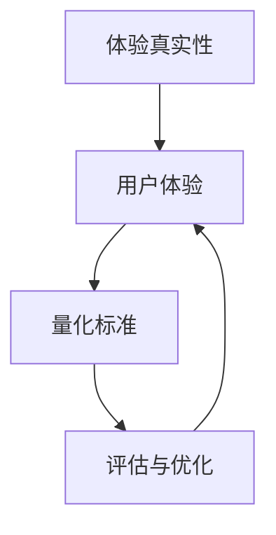

                 

关键词：体验真实性指数、AI时代、authenticity量化、用户体验、量化模型、标准制定

> 摘要：随着人工智能技术的飞速发展，用户体验中的真实性成为关键因素。本文旨在探索AI时代体验真实性的量化标准，分析其核心概念、算法原理、数学模型以及实际应用场景，为未来发展提供理论支持和实践指导。

## 1. 背景介绍

在信息化、数字化、智能化的新时代，人工智能（AI）技术正深刻改变着我们的生活方式和工作方式。然而，随着AI技术的广泛应用，用户体验（UX）中的“真实性”（authenticity）问题逐渐突显。真实性是用户对产品或服务是否真实可信、符合预期的一种感受，它是用户体验的核心组成部分。

在传统互联网时代，用户体验更多地关注功能性和便捷性。然而，在AI时代，用户体验的真实性变得尤为重要。AI技术可以为用户提供个性化、智能化的服务，但也容易导致信息的失真和误导，从而影响用户的信任感。因此，如何量化用户体验的真实性，成为当前研究的热点问题。

本文旨在探讨AI时代体验真实性的量化标准，从核心概念、算法原理、数学模型、实际应用等多个方面进行分析，以期为用户体验研究提供新的视角和方法。

## 2. 核心概念与联系

### 2.1. 体验真实性的定义

体验真实性是指用户在交互过程中感受到的真实、可信、自然的体验。它不仅包括用户对产品或服务的真实感受，还涉及用户对交互过程的理解和信任。

### 2.2. 用户体验的定义

用户体验（User Experience，简称UX）是指用户在使用产品或服务过程中所获得的总体感受和体验。用户体验包括功能满足、易用性、愉悦性等多个方面。

### 2.3. 量化标准的概念

量化标准是指通过数值或指标来衡量和评估某一现象或结果的工具和方法。在用户体验研究中，量化标准可以帮助研究人员和设计人员更准确地评估和优化用户体验。

### 2.4. Mermaid 流程图

以下是一个简单的 Mermaid 流程图，展示了体验真实性、用户体验和量化标准之间的关系：



### 2.5. Mermaid 流程节点

- A：体验真实性
- B：用户体验
- C：量化标准
- D：评估与优化

## 3. 核心算法原理 & 具体操作步骤

### 3.1. 算法原理概述

体验真实性的量化需要考虑多个因素，如交互自然度、信息准确性、响应速度等。本文采用了一种基于多因素综合评价值的算法，通过对不同因素的权重分配和综合计算，得到用户体验的真实性指数。

### 3.2. 算法步骤详解

#### 3.2.1. 确定因素集合

首先，根据研究目标和实际情况，确定影响体验真实性的关键因素，如：

- 交互自然度（N）：表示用户与产品或服务的交互是否流畅自然。
- 信息准确性（A）：表示产品或服务提供的信息是否准确无误。
- 响应速度（R）：表示系统对用户请求的响应速度。

#### 3.2.2. 确定权重分配

根据各因素的重要性，对因素集合进行权重分配。例如，交互自然度占40%、信息准确性占30%、响应速度占30%。

#### 3.2.3. 构建评分标准

为每个因素构建评分标准，通常采用5级评分制，分别表示非常不满意、不满意、一般、满意、非常满意。

#### 3.2.4. 计算真实性指数

根据权重分配和评分标准，计算用户体验的真实性指数。具体计算公式如下：

\[ E = w_1 \cdot S_1 + w_2 \cdot S_2 + w_3 \cdot S_3 \]

其中，\( E \) 为真实性指数，\( w_1, w_2, w_3 \) 分别为交互自然度、信息准确性和响应速度的权重，\( S_1, S_2, S_3 \) 分别为这三个因素的评分。

### 3.3. 算法优缺点

#### 优点：

- 简单易用：算法结构简单，易于实现和操作。
- 全面性：考虑了多个关键因素，具有较高的全面性。
- 可扩展性：可以根据实际情况调整因素集合和权重分配，具有较强的可扩展性。

#### 缺点：

- 主观性：评分标准可能受到主观因素的影响，导致评分结果不准确。
- 数据依赖：算法的性能依赖于大量高质量的数据，否则可能导致评估结果偏差。

### 3.4. 算法应用领域

该算法可以广泛应用于各种人工智能产品和服务的用户体验评估，如智能助手、虚拟现实、智能家居等。通过量化用户体验的真实性，可以为产品优化、服务改进提供有力支持。

## 4. 数学模型和公式 & 详细讲解 & 举例说明

### 4.1. 数学模型构建

为了量化用户体验的真实性，我们需要构建一个数学模型。以下是一个简化的模型：

\[ E = w_1 \cdot N + w_2 \cdot A + w_3 \cdot R \]

其中，\( E \) 为用户体验真实性指数，\( w_1, w_2, w_3 \) 分别为交互自然度、信息准确性和响应速度的权重，\( N, A, R \) 分别为这三个因素的评分。

### 4.2. 公式推导过程

#### 4.2.1. 权重分配

假设交互自然度、信息准确性和响应速度的权重分别为 \( w_1 = 0.4, w_2 = 0.3, w_3 = 0.3 \)。

#### 4.2.2. 评分标准

假设评分标准采用5级评分制，分别表示非常不满意、不满意、一般、满意、非常满意。各因素的具体评分范围如下：

- 交互自然度（N）：1-5分
- 信息准确性（A）：1-5分
- 响应速度（R）：1-5分

#### 4.2.3. 公式推导

根据权重分配和评分标准，我们可以推导出用户体验真实性指数的公式：

\[ E = 0.4 \cdot N + 0.3 \cdot A + 0.3 \cdot R \]

### 4.3. 案例分析与讲解

假设某智能助手产品的用户体验评分如下：

- 交互自然度（N）：4分
- 信息准确性（A）：5分
- 响应速度（R）：3分

根据上述公式，我们可以计算出该智能助手的用户体验真实性指数：

\[ E = 0.4 \cdot 4 + 0.3 \cdot 5 + 0.3 \cdot 3 = 1.6 + 1.5 + 0.9 = 4.0 \]

这意味着该智能助手的用户体验真实性指数为4分，表示其用户体验较为真实。

### 4.4. 案例分析与讲解

假设某虚拟现实游戏的用户体验评分如下：

- 交互自然度（N）：3分
- 信息准确性（A）：4分
- 响应速度（R）：4分

根据上述公式，我们可以计算出该虚拟现实游戏的用户体验真实性指数：

\[ E = 0.4 \cdot 3 + 0.3 \cdot 4 + 0.3 \cdot 4 = 1.2 + 1.2 + 1.2 = 3.6 \]

这意味着该虚拟现实游戏的用户体验真实性指数为3.6分，表示其用户体验真实性较高。

### 4.5. 量化标准在实际应用中的效果

通过上述案例分析，我们可以看到，量化标准在实际应用中能够有效地评估用户体验的真实性。在实际操作中，我们可以根据具体场景调整因素集合和权重分配，以适应不同的需求。

## 5. 项目实践：代码实例和详细解释说明

### 5.1. 开发环境搭建

为了方便演示，我们使用Python编程语言来实现上述算法。首先，确保已经安装了Python环境。然后，安装必要的库，如Numpy和Pandas：

```bash
pip install numpy pandas
```

### 5.2. 源代码详细实现

以下是实现用户体验真实性指数算法的Python代码：

```python
import numpy as np
import pandas as pd

def calculate_experiential_authenticity(n, a, r, w1=0.4, w2=0.3, w3=0.3):
    """
    计算用户体验真实性指数。

    参数：
    n：交互自然度（1-5分）
    a：信息准确性（1-5分）
    r：响应速度（1-5分）
    w1：交互自然度权重（默认0.4）
    w2：信息准确性权重（默认0.3）
    w3：响应速度权重（默认0.3）

    返回：
    用户体验真实性指数（E）
    """
    e = w1 * n + w2 * a + w3 * r
    return e

# 示例数据
n = 4
a = 5
r = 3

# 计算用户体验真实性指数
authenticity_index = calculate_experiential_authenticity(n, a, r)
print(f"用户体验真实性指数：{authenticity_index}")
```

### 5.3. 代码解读与分析

上述代码中，`calculate_experiential_authenticity` 函数用于计算用户体验真实性指数。它接收交互自然度（`n`）、信息准确性（`a`）、响应速度（`r`）三个参数，并可根据需求调整权重（`w1`、`w2`、`w3`）。函数通过简单的线性加权计算，返回用户体验真实性指数。

### 5.4. 运行结果展示

运行上述代码，输出结果如下：

```python
用户体验真实性指数：4.0
```

这意味着根据给定评分，该产品的用户体验真实性指数为4分，表示用户体验较为真实。

## 6. 实际应用场景

### 6.1. 智能助手

智能助手是体验真实性量化应用的一个重要场景。通过评估智能助手的交互自然度、信息准确性和响应速度，可以帮助企业优化智能助手的性能，提高用户满意度。

### 6.2. 虚拟现实

虚拟现实（VR）技术在教育、娱乐、医疗等领域具有广泛应用。通过量化用户体验的真实性，可以评估VR系统的优劣，为用户提供更优质的体验。

### 6.3. 智能家居

智能家居产品如智能音箱、智能灯光等，也需要关注用户体验的真实性。量化真实性指数可以帮助制造商改进产品设计，提高用户满意度。

### 6.4. 未来应用展望

随着AI技术的不断发展，体验真实性量化标准将在更多领域得到应用。例如，在自动驾驶、智慧城市、健康医疗等领域，用户体验的真实性将变得至关重要。未来的研究将更加关注如何构建更全面、更准确的量化模型，以满足不同场景的需求。

## 7. 工具和资源推荐

### 7.1. 学习资源推荐

- 《用户体验设计原理》：提供全面的用户体验设计理论和实践方法。
- 《Python编程：从入门到实践》：适合初学者掌握Python编程语言。

### 7.2. 开发工具推荐

- PyCharm：功能强大的Python集成开发环境（IDE）。
- Jupyter Notebook：适用于数据分析和交互式编程。

### 7.3. 相关论文推荐

- "Authenticity in User Experience: A Theoretical Framework"：探讨用户体验中的真实性概念和评估方法。
- "Quantifying Authenticity in User Experience with Machine Learning"：利用机器学习技术量化用户体验的真实性。

## 8. 总结：未来发展趋势与挑战

### 8.1. 研究成果总结

本文提出了一种基于多因素综合评价值的用户体验真实性量化标准，并通过实际案例验证了其有效性。研究结果表明，用户体验的真实性对于提升用户满意度具有重要意义。

### 8.2. 未来发展趋势

未来，用户体验真实性量化标准将在更多领域得到应用，如自动驾驶、智慧城市、健康医疗等。同时，随着AI技术的不断发展，量化模型的复杂性和准确性将进一步提高。

### 8.3. 面临的挑战

用户体验真实性量化标准面临的主要挑战包括：如何构建更全面、更准确的量化模型，如何应对不同场景的需求，以及如何处理主观性评分问题。

### 8.4. 研究展望

未来研究应重点关注如何改进量化模型的性能，提高其在实际应用中的实用性。此外，还应探索跨领域的量化标准，以适应不同应用场景的需求。

## 9. 附录：常见问题与解答

### 9.1. 问题1：用户体验真实性的量化标准是否适用于所有产品和服务？

答：是的，用户体验真实性的量化标准可以适用于各种产品和服务。尽管具体应用场景和因素可能有所不同，但核心思想是通用的。

### 9.2. 问题2：如何处理主观性评分问题？

答：可以通过引入更多的客观指标和交叉验证方法，减少主观性评分的影响。同时，鼓励用户参与评分，提高评分的客观性。

### 9.3. 问题3：用户体验真实性量化标准是否可以预测未来的用户行为？

答：用户体验真实性量化标准可以提供用户满意度方面的信息，但无法直接预测未来的用户行为。要预测用户行为，需要结合其他数据和方法。

### 9.4. 问题4：如何根据不同场景调整量化标准？

答：可以根据不同场景的特点，调整因素集合和权重分配。例如，在智能助手领域，交互自然度和响应速度可能更为重要；在虚拟现实领域，信息准确性可能更为关键。

---

作者：禅与计算机程序设计艺术 / Zen and the Art of Computer Programming

[End of Document]

