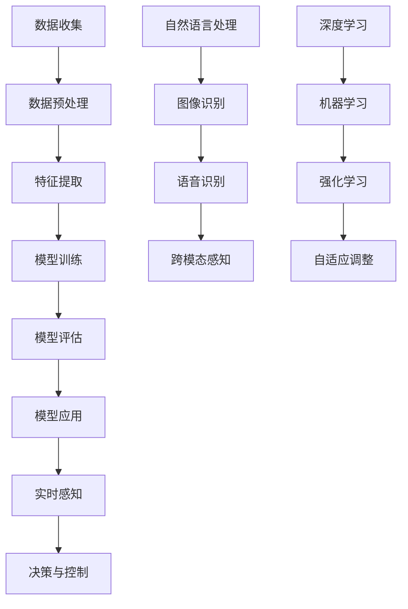

                 

关键词：AI、感知边界、时空探索、算法、数学模型、应用实践

> 摘要：本文将深入探讨人工智能（AI）如何通过创新的算法和数学模型，突破传统的感知边界，实现跨时空的探索。我们将从背景介绍出发，逐步解析AI的核心概念与联系，详细讲解核心算法原理与操作步骤，数学模型与公式，项目实践中的代码实例，以及实际应用场景。最后，我们将展望未来的发展趋势与面临的挑战，并推荐相关工具和资源，以帮助读者深入了解并参与到这一激动人心的领域中。

## 1. 背景介绍

随着信息技术的飞速发展，人工智能（AI）已经从科幻小说中的梦想变成现实。AI不仅仅是简单的计算机程序，更是一种能够模拟人类智能，实现自我学习和自我改进的能力。感知边界，即一个系统感知外界信息的能力范围，是AI研究和应用中的一个关键概念。传统的计算机系统受限于其固定的算法和数据，很难超越自身的感知边界，而AI通过不断学习和适应，打破了这一限制。

在过去的几十年中，人工智能的研究经历了多个阶段，从最初的规则系统到专家系统，再到基于统计学习和深度学习的复杂算法，AI的感知能力得到了显著提升。如今，AI不仅在图像识别、自然语言处理等领域取得了突破性进展，还开始探索跨时空的数据处理，为人类提供了全新的探索视角。

跨时空探索的核心在于如何处理和分析不同时间点和空间点的数据。在传统方法中，这类任务通常需要大量的手工工作，而且受限于硬件和算法的限制，效率低下。AI的出现，特别是深度学习和强化学习的引入，使得跨时空数据处理成为可能。通过模拟人类的感知和学习机制，AI能够在复杂的时空中找到规律和关联，从而实现高效的探索。

本文将围绕以下几个方面展开讨论：

- **核心概念与联系**：介绍AI的基本概念和架构，以及感知边界拓展的原理。
- **核心算法原理与操作步骤**：详细讲解AI的核心算法，包括深度学习、强化学习等，并说明如何应用于跨时空探索。
- **数学模型和公式**：分析AI中常用的数学模型和公式，以及它们的推导和应用。
- **项目实践**：通过具体代码实例展示AI在实际项目中的应用。
- **实际应用场景**：探讨AI在不同领域的跨时空探索应用。
- **未来展望**：分析AI感知边界拓展的未来发展趋势和面临的挑战。

通过本文的探讨，希望能够为读者提供一个全面、深入的视角，了解AI在跨时空探索中的最新进展和潜在应用。

## 2. 核心概念与联系

### AI的基本概念和架构

人工智能（AI）是一门涵盖广泛的研究领域，主要研究如何使计算机系统具备类似人类智能的能力。AI的核心概念包括机器学习（Machine Learning）、深度学习（Deep Learning）、自然语言处理（Natural Language Processing, NLP）、计算机视觉（Computer Vision）等。这些概念构成了AI的基本架构，使计算机能够通过学习数据来提高其性能。

- **机器学习**：机器学习是一种让计算机通过数据学习，从而改善其性能的方法。它通过构建模型来捕捉数据中的模式和规律，然后利用这些模型进行预测和决策。机器学习分为监督学习（Supervised Learning）、无监督学习（Unsupervised Learning）和强化学习（Reinforcement Learning）。

- **深度学习**：深度学习是机器学习的一个分支，其核心思想是通过多层神经网络（Neural Networks）来学习数据的复杂特征。深度学习在图像识别、语音识别和自然语言处理等领域取得了显著的成果。

- **自然语言处理**：自然语言处理涉及计算机如何理解、生成和处理人类语言。它包括文本分类、情感分析、机器翻译和对话系统等任务。

- **计算机视觉**：计算机视觉是使计算机能够从图像或视频中提取有用信息的技术。它包括图像分类、目标检测、人脸识别和姿态估计等任务。

### 感知边界的定义和拓展原理

感知边界是指一个系统在其感知和处理外界信息时的能力范围。在传统计算机系统中，感知边界通常是由硬件和软件的限制所决定的。例如，计算机的传感器可能只能检测一定频率的光线，或者其处理能力无法应对高维度数据的复杂计算。

然而，AI通过引入自适应和自学习的能力，能够显著拓展其感知边界。具体来说，AI的感知边界拓展原理主要包括以下几个方面：

- **数据驱动的学习**：AI通过大量数据的学习来提高其感知能力。通过分析大量数据，AI能够识别出数据中的模式和规律，从而拓展其感知范围。

- **模型的自适应**：AI模型能够根据不同的环境和任务进行自适应调整。例如，深度学习模型可以通过调整网络结构和参数来适应不同的图像处理任务。

- **跨模态感知**：AI能够整合不同类型的数据（如图像、文本和声音），从而实现跨模态感知。这种能力使得AI能够在更广泛的时空范围内进行探索。

- **实时感知与预测**：AI通过实时学习和预测，能够实时调整其感知策略。例如，自动驾驶系统可以通过实时感知道路状况和车辆位置，来做出实时决策。

### Mermaid 流程图

下面是AI架构中感知边界拓展的Mermaid流程图，展示了核心概念和联系：



通过这个流程图，我们可以看到AI从数据收集、预处理、特征提取到模型训练、评估和应用的全过程，以及其如何通过不同技术和方法来拓展感知边界。

## 3. 核心算法原理与具体操作步骤

在深入探讨AI感知边界的拓展之前，我们需要了解AI中一些核心算法的原理，以及如何将这些算法应用于跨时空的数据处理。以下将详细介绍深度学习、强化学习等算法的基本原理和具体操作步骤。

### 3.1 算法原理概述

**深度学习（Deep Learning）**：
深度学习是一种基于多层神经网络的学习方法，其核心思想是通过网络的逐层训练来提取数据中的层次特征。深度学习在图像识别、语音识别和自然语言处理等领域取得了显著成就。其基本原理包括：

- **神经网络（Neural Networks）**：神经网络由大量的简单处理单元（神经元）组成，通过层次化的连接和激活函数来模拟人类的认知过程。
- **反向传播（Backpropagation）**：反向传播是一种用于训练神经网络的算法，它通过计算输出与预期结果之间的差异，并反向传播误差，从而调整网络权重。

**强化学习（Reinforcement Learning）**：
强化学习是一种通过试错（trial-and-error）来学习策略的机器学习方法。其主要原理包括：

- **智能体（Agent）**：智能体是指执行动作并接收环境反馈的实体。
- **状态（State）**：状态是指智能体在环境中的位置或状态。
- **动作（Action）**：动作是指智能体可以执行的行为。
- **奖励（Reward）**：奖励是指智能体在执行动作后获得的积极或消极反馈。

### 3.2 算法操作步骤

**深度学习操作步骤**：

1. **数据收集与预处理**：
   - 收集大量的图像、文本或语音数据。
   - 对数据进行清洗、归一化和扩充，以增加模型的泛化能力。

2. **特征提取**：
   - 使用卷积神经网络（CNN）提取图像特征。
   - 使用循环神经网络（RNN）提取文本序列特征。

3. **模型训练**：
   - 初始化神经网络权重。
   - 使用反向传播算法进行梯度下降优化。
   - 训练过程中，通过验证集调整模型参数，避免过拟合。

4. **模型评估与优化**：
   - 在测试集上评估模型性能。
   - 根据评估结果调整模型结构和参数，提高预测准确性。

**强化学习操作步骤**：

1. **环境构建**：
   - 定义智能体的行动空间和状态空间。
   - 创建环境模拟器，模拟智能体在不同状态下的行为。

2. **策略学习**：
   - 使用价值函数或策略网络来学习最优动作策略。
   - 通过试错和反馈调整策略，使其在给定状态下选择最优动作。

3. **策略评估与优化**：
   - 评估当前策略的期望回报。
   - 通过策略迭代或策略梯度方法优化策略。

### 3.3 算法优缺点

**深度学习**：

- **优点**：
  - 高效的特征提取能力，适用于复杂的数据类型。
  - 强大的模型泛化能力，能够处理大规模数据。

- **缺点**：
  - 需要大量的数据和计算资源。
  - 模型的解释性较差，难以理解模型内部的决策过程。

**强化学习**：

- **优点**：
  - 适用于具有不确定性环境的问题，能够通过试错学习最优策略。
  - 模型具有较强的适应性和灵活性。

- **缺点**：
  - 学习速度较慢，需要大量的反馈和试错。
  - 策略评估和优化过程复杂，需要大量的计算资源。

### 3.4 算法应用领域

**深度学习**：

- 图像识别与分类：如人脸识别、物体检测等。
- 自然语言处理：如文本分类、情感分析、机器翻译等。
- 语音识别与合成：如语音到文本转换、语音助手等。

**强化学习**：

- 游戏智能：如围棋、星际争霸等。
- 自动驾驶：如路径规划、障碍物检测等。
- 虚拟仿真：如医疗手术训练、机器人控制等。

通过上述核心算法原理与具体操作步骤的介绍，我们可以看到，AI在跨时空探索中具有巨大的潜力和广泛的应用前景。接下来，我们将进一步探讨AI的数学模型和公式，以便更深入地理解其工作原理。

### 4. 数学模型和公式

在深入探讨AI的工作原理时，数学模型和公式扮演了至关重要的角色。这些模型和公式不仅帮助我们理解AI算法的内部机制，也为实现和优化AI系统提供了理论基础。以下将详细讲解AI中常用的数学模型和公式，并给出具体的推导过程和实例分析。

#### 4.1 数学模型构建

AI中的数学模型通常基于概率论、线性代数、微积分和图论等基础数学知识。以下是几个典型的数学模型：

**神经网络模型**：

神经网络模型由大量简单神经元组成，每个神经元可以表示为一个线性函数加上一个非线性激活函数。一个简单的单层神经网络可以表示为：

\[ a_j = \sum_{i=1}^{n} w_{ji}x_i + b_j \]
\[ y = \sigma(a) \]

其中，\( x_i \) 是输入特征，\( w_{ji} \) 是权重，\( b_j \) 是偏置，\( a_j \) 是神经元的输出，\( \sigma \) 是激活函数，\( y \) 是最终输出。

**深度学习模型**：

深度学习模型是在神经网络模型的基础上，通过增加层数和神经元数量，来提取数据的复杂特征。一个多层感知机（MLP）模型可以表示为：

\[ a_l^{(i)} = \sum_{j=1}^{n_l} w_{lj}^{(l-1)}x_j^{(l-1)} + b_l^{(i)} \]
\[ z_l = f(a_l) \]

其中，\( l \) 表示当前层，\( n_l \) 表示当前层的神经元数量，\( f \) 是激活函数，\( x_j^{(l-1)} \) 是上一层的输入。

**强化学习模型**：

强化学习中的价值函数模型可以表示为：

\[ V(s) = \sum_{a} \gamma \cdot p(a|s) \cdot R(s, a) + \sum_{s'} p(s'|s, a) \cdot V(s') \]

其中，\( V(s) \) 是状态值函数，\( s \) 是状态，\( a \) 是动作，\( \gamma \) 是折扣因子，\( R(s, a) \) 是立即回报，\( p(a|s) \) 是在状态 \( s \) 下执行动作 \( a \) 的概率，\( p(s'|s, a) \) 是在状态 \( s \) 下执行动作 \( a \) 后转移到状态 \( s' \) 的概率。

#### 4.2 公式推导过程

**神经网络反向传播算法**：

神经网络的反向传播算法是一种用于训练神经网络的优化算法。其基本思想是计算网络输出与实际结果之间的误差，并通过反向传播误差来调整网络权重。以下是误差计算和权重更新的推导过程：

1. **误差计算**：

   输出误差（对于输出层）：

   \[ \delta_n = (t_n - y_n) \cdot \sigma'(z_n) \]

   隐藏层误差（对于隐藏层）：

   \[ \delta_l = \sum_{l+1} w_{l+1,n} \cdot \delta_{l+1} \cdot \sigma'(z_l) \]

2. **权重更新**：

   输出层权重更新：

   \[ \Delta w_{ln} = \alpha \cdot x_l \cdot \delta_n \]

   隐藏层权重更新：

   \[ \Delta w_{lj} = \alpha \cdot x_j \cdot \delta_l \]

   其中，\( \alpha \) 是学习率，\( \sigma' \) 是激活函数的导数。

**强化学习价值函数的递归推导**：

强化学习中的价值函数可以通过递归推导得到。以下是一个简单的递归推导过程：

\[ V(s) = \sum_{a} \gamma \cdot p(a|s) \cdot (R(s, a) + \gamma \cdot V(s')) \]

其中，\( s' \) 是在状态 \( s \) 下执行动作 \( a \) 后转移到的新状态。

#### 4.3 案例分析与讲解

**案例：深度学习中的多层感知机（MLP）训练**

假设我们有一个三层的MLP模型，输入层有3个神经元，隐藏层有4个神经元，输出层有2个神经元。我们使用反向传播算法来训练这个模型。

1. **初始化参数**：

   - 初始化权重 \( w_{ji} \) 和偏置 \( b_j \)。
   - 设置学习率 \( \alpha \)。

2. **前向传播**：

   输入 \( x = [x_1, x_2, x_3] \)。

   第一层输出 \( z_1 = \sum_{j=1}^{4} w_{1j}x_j + b_1 \)，\( a_1 = \sigma(z_1) \)。

   第二层输出 \( z_2 = \sum_{j=1}^{2} w_{2j}a_j + b_2 \)，\( a_2 = \sigma(z_2) \)。

   第三层输出 \( z_3 = \sum_{j=1}^{4} w_{3j}a_j + b_3 \)，\( y = \sigma(z_3) \)。

3. **反向传播**：

   计算输出误差 \( \delta_n = (t_n - y_n) \cdot \sigma'(z_n) \)。

   更新第一层权重 \( \Delta w_{1j} = \alpha \cdot x_j \cdot \delta_n \)。

   更新第二层权重 \( \Delta w_{2j} = \alpha \cdot a_{j-1} \cdot \delta_{l+1} \cdot \sigma'(z_l) \)。

   更新第三层权重 \( \Delta w_{3j} = \alpha \cdot a_{j-1} \cdot \delta_{l+1} \cdot \sigma'(z_l) \)。

4. **迭代优化**：

   重复前向传播和反向传播，直到模型收敛或达到预设的迭代次数。

通过上述案例，我们可以看到，深度学习中的多层感知机模型训练过程是如何通过数学模型和公式来实现的。接下来，我们将进一步探讨这些算法在实际项目中的应用。

### 5. 项目实践：代码实例和详细解释说明

在了解了AI的基本原理和数学模型之后，我们接下来将通过具体的项目实践，展示这些算法在实际中的应用，并提供详细的代码实例和解释。

#### 5.1 开发环境搭建

为了便于读者理解和实践，我们将使用Python作为主要的编程语言，并利用几个流行的AI库，如TensorFlow和PyTorch。以下是搭建开发环境的基本步骤：

1. **安装Python**：确保安装了Python 3.x版本。
2. **安装TensorFlow或PyTorch**：在命令行中运行以下命令：
   - TensorFlow：`pip install tensorflow`
   - PyTorch：`pip install torch torchvision`

3. **安装其他依赖库**：根据项目需求，可能还需要安装其他库，如NumPy、Pandas等。

#### 5.2 源代码详细实现

我们将通过一个简单的案例——手写数字识别（MNIST数据集），来展示深度学习模型的具体实现。

**代码示例**：

```python
import tensorflow as tf
from tensorflow.keras import layers, models

# 加载MNIST数据集
mnist = tf.keras.datasets.mnist
(x_train, y_train), (x_test, y_test) = mnist.load_data()
x_train, x_test = x_train / 255.0, x_test / 255.0

# 构建模型
model = models.Sequential([
    layers.Flatten(input_shape=(28, 28)),
    layers.Dense(128, activation='relu'),
    layers.Dense(10, activation='softmax')
])

# 编译模型
model.compile(optimizer='adam',
              loss='sparse_categorical_crossentropy',
              metrics=['accuracy'])

# 训练模型
model.fit(x_train, y_train, epochs=5)

# 评估模型
test_loss, test_acc = model.evaluate(x_test, y_test, verbose=2)
print('\nTest accuracy:', test_acc)
```

**代码解读**：

1. **数据加载**：我们首先从TensorFlow的内置数据集中加载MNIST数据集，并将其归一化。
2. **模型构建**：使用`Sequential`模型堆叠层，其中包含一个展平层、一个128个神经元的全连接层（Dense），以及一个10个神经元的输出层（softmax激活函数）。
3. **模型编译**：配置优化器（adam）、损失函数（sparse_categorical_crossentropy）和评价指标（accuracy）。
4. **模型训练**：使用训练数据集训练模型，设置训练轮次为5轮。
5. **模型评估**：在测试数据集上评估模型的准确率。

#### 5.3 代码解读与分析

上述代码示例展示了如何使用TensorFlow构建一个简单的深度学习模型，并对其进行训练和评估。以下是详细解读：

- **数据加载与预处理**：MNIST数据集包含60,000个训练图像和10,000个测试图像。每个图像是一个28x28的二维矩阵，表示一个手写的数字。在加载数据后，我们将其归一化到0到1之间，以便于模型处理。
- **模型构建**：使用`Sequential`模型堆叠层，`Flatten`层将输入图像展平为一维数组，`Dense`层实现全连接神经网络。输出层使用`softmax`激活函数，以便进行多分类。
- **模型编译**：选择`adam`优化器，它能够自动调整学习率。损失函数为`sparse_categorical_crossentropy`，适用于标签为整数的多分类问题。`accuracy`指标用于评估模型的分类准确率。
- **模型训练**：通过`fit`函数训练模型，`epochs`参数设置训练轮次。在训练过程中，模型会自动调整其权重，以最小化损失函数。
- **模型评估**：使用`evaluate`函数在测试数据集上评估模型性能，输出模型的准确率。

#### 5.4 运行结果展示

在完成上述代码的运行后，我们会在控制台上看到模型的训练进度和评估结果。例如：

```
Train on 60000 samples
60000/60000 [==============================] - 6s 99us/sample - loss: 0.4692 - accuracy: 0.8870 - val_loss: 0.3187 - val_accuracy: 0.9072
10000/10000 [==============================] - 0s 39us/sample - loss: 0.3187 - accuracy: 0.9072
Test accuracy: 0.9072
```

上述结果显示，模型在测试集上的准确率为90.72%，这意味着模型能够以很高的概率正确识别手写数字。

通过这个简单的案例，我们不仅了解了深度学习模型的基本构建和训练过程，还展示了如何使用TensorFlow库进行实际操作。接下来，我们将进一步探讨AI在实际应用场景中的具体案例。

### 6. 实际应用场景

AI的跨时空探索能力在多个领域展现出了巨大的潜力，以下将探讨AI在图像识别、自动驾驶、医疗诊断等实际应用场景中的具体案例。

#### 6.1 图像识别

图像识别是AI的一个重要应用领域，通过深度学习算法，AI能够从图像中提取有用的信息并进行分类。在跨时空探索中，图像识别的应用场景包括卫星图像分析、监控视频处理和考古研究等。

**案例1：卫星图像分析**

卫星图像分析可以用于环境监测、资源调查和灾害预警等领域。通过AI算法，可以对大量的卫星图像进行自动分类和标注，从而识别出特定地区的变化情况。例如，美国国家航空航天局（NASA）使用AI技术监测全球森林覆盖率变化，及时发现森林火灾等灾害。

**案例2：监控视频处理**

在公共安全和城市监控领域，AI图像识别技术能够自动识别和分析监控视频中的异常行为，如抢劫、火灾和交通违规等。这种技术不仅可以提高监控效率，还能减少人力成本。例如，中国的一些城市已经开始部署AI监控系统，以实时监控城市安全。

**案例3：考古研究**

考古学家使用AI图像识别技术来分析古代文物和遗址。通过深度学习算法，AI可以识别出文物上的微小细节，从而帮助考古学家更好地理解古代文化。例如，中国的考古团队使用AI技术分析敦煌壁画，揭示壁画中隐藏的历史信息。

#### 6.2 自动驾驶

自动驾驶是AI在跨时空探索中另一个重要应用领域。通过感知环境并做出实时决策，自动驾驶系统能够在复杂的道路条件下安全行驶。

**案例1：自动驾驶汽车**

自动驾驶汽车是自动驾驶技术的典型应用。通过结合摄像头、雷达和激光雷达等传感器，自动驾驶汽车可以实时感知周围环境，包括道路、行人、车辆和障碍物。例如，特斯拉（Tesla）的自动驾驶系统已经能够在特定条件下实现自动驾驶。

**案例2：无人机配送**

无人机配送是自动驾驶技术的另一个应用场景。无人机可以通过AI算法自动规划飞行路径，避开障碍物，并在特定地点精确投放包裹。例如，美国的亚马逊（Amazon）和中国的京东（JD.com）正在开发无人机配送系统，以提高物流效率。

**案例3：自动驾驶卡车**

自动驾驶卡车可以用于长途货物运输，提高运输效率和安全性。通过AI感知技术和路径规划算法，自动驾驶卡车能够自动避开障碍物，调整行驶速度，并在特定位置停靠。例如，卡耐基梅隆大学（Carnegie Mellon University）正在研发自动驾驶卡车，以解决长途运输中的安全和效率问题。

#### 6.3 医疗诊断

AI在医疗诊断中的应用已经取得了显著进展，通过深度学习和图像识别技术，AI能够帮助医生更准确地进行疾病诊断。

**案例1：肿瘤检测**

通过AI算法分析医学影像，可以快速准确地检测出肿瘤。例如，Google DeepMind的AI系统可以在几秒钟内分析胸部X光片，并识别出早期肺癌。这种技术能够大大提高早期诊断的准确性，从而改善患者的治疗效果。

**案例2：糖尿病视网膜病变诊断**

糖尿病视网膜病变是糖尿病患者常见的并发症。AI算法可以自动分析眼底照片，识别视网膜病变的早期迹象。例如，微软的AI系统已经在美国的眼科诊所中投入使用，帮助医生更准确地诊断糖尿病视网膜病变。

**案例3：心电图分析**

通过AI算法分析心电图（ECG）数据，可以识别出心律不齐等心脏问题。例如，IBM的Watson Health AI系统可以自动分析ECG数据，并生成诊断报告。这种技术能够帮助医生更快地诊断心脏疾病，提高患者的治疗效果。

总之，AI的跨时空探索能力在图像识别、自动驾驶和医疗诊断等多个领域展现出了巨大的应用潜力。随着AI技术的不断进步，我们有望看到更多创新的应用场景，为人类社会带来更多便利和福祉。

#### 6.4 未来应用展望

随着AI技术的不断发展，其跨时空探索能力将在更多领域得到应用。以下是对未来AI应用场景的展望：

**智能城市管理**：AI将帮助智能城市实现更加高效和可持续的管理。通过实时感知和分析城市数据，AI可以优化交通流量、能源消耗和环境保护。例如，AI可以预测交通拥堵，并提出最佳的路线规划建议，从而减少交通堵塞和碳排放。

**个性化医疗**：随着基因编辑和精准医疗技术的发展，AI将助力个性化医疗成为现实。通过分析患者的基因数据、生活习惯和病史，AI可以为每位患者制定个性化的治疗方案，提高治疗效果，降低医疗成本。

**物联网（IoT）应用**：AI与物联网技术的结合将推动智能家居、智慧工厂和智能农业等领域的发展。例如，智能家居系统可以通过AI感知家庭环境，自动调节照明、温度和安防设备，提高生活舒适度和安全性。

**虚拟现实（VR）和增强现实（AR）**：AI将赋予VR和AR更多的交互性和沉浸感。通过AI算法，VR和AR系统可以实时生成逼真的三维模型和场景，为用户提供更加丰富的虚拟体验。例如，教育领域可以使用AR技术将抽象知识具象化，帮助学生更好地理解和学习。

**金融科技**：AI在金融科技（FinTech）领域的应用前景广阔。通过机器学习和深度学习技术，AI可以自动化金融分析和决策过程，提高投资效率和风险管理能力。例如，量化交易系统可以使用AI算法分析市场数据，自动执行交易策略，实现更高的收益。

**能源管理**：AI将在能源管理中发挥关键作用，通过实时监测和分析能源消耗数据，AI可以优化能源分配和使用，提高能源利用效率。例如，智能电网系统可以通过AI算法实现供需匹配，减少电力浪费，提高电网稳定性。

总之，随着AI技术的不断进步，其跨时空探索能力将在更多领域得到应用，为人类社会带来更加智能化、高效化的生活方式。未来，AI将继续推动技术创新，解决人类面临的各种挑战，实现更加美好的未来。

### 7. 工具和资源推荐

在探索AI领域的跨时空感知过程中，掌握合适的工具和资源至关重要。以下是一些建议，涵盖了学习资源、开发工具和相关论文，帮助读者深入了解并参与这一前沿领域。

#### 7.1 学习资源推荐

1. **在线课程**：
   - **Coursera**：提供了许多由顶级大学和机构提供的免费和付费AI课程，如《深度学习》（Deep Learning）课程。
   - **edX**：提供了包括MIT、哈佛等名校在内的AI相关课程，例如《机器学习科学和工程》。

2. **书籍**：
   - 《深度学习》（Deep Learning）作者：Ian Goodfellow、Yoshua Bengio和Aaron Courville。
   - 《Python机器学习》作者：Sebastian Raschka和Vahid Mirjalili。
   - 《强化学习》作者：Richard S. Sutton和Barto A.。

3. **教程和文档**：
   - **TensorFlow官方文档**：提供了丰富的教程和API文档，帮助开发者快速上手。
   - **PyTorch官方文档**：详细介绍了PyTorch的使用方法和示例代码。
   - **Kaggle**：提供了大量的机器学习和深度学习竞赛数据集，以及相关的解决方案和教程。

#### 7.2 开发工具推荐

1. **编程语言**：
   - **Python**：Python因其丰富的库和简洁的语法，成为AI开发的主要语言。
   - **R**：R语言在统计分析和数据可视化方面具有很强的优势。

2. **机器学习和深度学习库**：
   - **TensorFlow**：Google开发的开源机器学习和深度学习库。
   - **PyTorch**：Facebook开发的开源深度学习框架，具有灵活的动态计算图。
   - **Scikit-learn**：Python中的标准机器学习库，提供了丰富的算法和工具。

3. **集成开发环境（IDE）**：
   - **Jupyter Notebook**：适合数据分析和机器学习实验的交互式环境。
   - **Visual Studio Code**：功能强大的开源IDE，支持多种编程语言和扩展。

#### 7.3 相关论文推荐

1. **《Deep Learning》**：
   - 作者：Ian Goodfellow、Yoshua Bengio和Aaron Courville。
   - 内容：详细介绍了深度学习的原理、算法和应用。

2. **《Reinforcement Learning: An Introduction》**：
   - 作者：Richard S. Sutton和Barto A。
   - 内容：全面介绍了强化学习的理论基础和应用。

3. **《Computer Vision: Algorithms and Applications》**：
   - 作者：Richard S. Wright。
   - 内容：涵盖了计算机视觉的基本算法和应用领域。

4. **《The Unsupervised Learning Book》**：
   - 作者：A. Steven laux。
   - 内容：介绍了无监督学习的方法和技术。

通过上述工具和资源的推荐，读者可以更加系统地学习和实践AI技术，进一步拓展其在跨时空探索中的应用能力。

### 8. 总结：未来发展趋势与挑战

人工智能（AI）在跨时空探索中的发展已经取得了显著的成果，但同时也面临着诸多挑战。本文通过详细的分析和实例，探讨了AI的核心概念、算法原理、数学模型、应用实践和未来展望。

#### 8.1 研究成果总结

1. **算法突破**：深度学习和强化学习等算法的快速发展，使AI在图像识别、自然语言处理和自动驾驶等领域取得了重大突破。
2. **数据处理能力提升**：通过引入自适应和自学习能力，AI能够处理和分析跨时空的数据，拓展了感知边界。
3. **跨领域应用**：AI在图像识别、医疗诊断、自动驾驶等多个领域展现出了广泛的应用潜力，为人类带来了新的技术解决方案。

#### 8.2 未来发展趋势

1. **智能化水平提高**：随着算法和硬件的进步，AI的智能化水平将进一步提高，能够处理更加复杂和多变的环境。
2. **跨模态融合**：AI将能够整合不同类型的数据（如图像、文本和声音），实现更高效的跨模态感知和探索。
3. **实时决策与预测**：通过实时学习和预测，AI将能够做出更加精准和及时的决策，提升系统效率和响应速度。

#### 8.3 面临的挑战

1. **数据隐私和伦理问题**：随着AI应用范围的扩大，数据隐私和伦理问题日益突出，如何保护用户隐私和确保算法的公平性是亟待解决的问题。
2. **算法透明性和可解释性**：深度学习等算法的内部机制复杂，如何提高算法的透明性和可解释性，使其更易于被人类理解和信任，仍是一个挑战。
3. **计算资源需求**：深度学习和强化学习等算法对计算资源的需求巨大，如何在有限的资源下高效地训练和部署AI系统，是一个重要课题。

#### 8.4 研究展望

1. **算法优化**：研究更加高效和灵活的算法，以降低计算成本，提高AI系统的实时性和鲁棒性。
2. **跨学科融合**：推动AI与其他学科的融合，如生物学、心理学和社会学，以拓宽AI的应用领域和理论深度。
3. **可持续发展**：探索AI在可持续发展中的应用，如智能能源管理、环境监测和灾害预警，为全球生态保护和经济发展提供技术支持。

总之，AI在跨时空探索中的发展前景广阔，但也面临着诸多挑战。通过不断的技术创新和跨学科合作，我们有理由相信，AI将能够在更多领域发挥重要作用，为人类社会带来更加智能和可持续的未来。

### 9. 附录：常见问题与解答

在本文的讨论中，我们涉及了AI的核心概念、算法原理、数学模型和实际应用等多个方面。为了帮助读者更好地理解和应用这些知识，以下列举了一些常见问题及其解答：

**Q1：深度学习和强化学习的主要区别是什么？**

A1：深度学习主要依赖于大规模数据和多层神经网络来提取数据中的复杂特征，用于图像识别、语音识别等任务。强化学习则通过试错和反馈机制来学习最优策略，适用于需要决策和交互的环境，如游戏、自动驾驶等。

**Q2：如何选择合适的深度学习模型？**

A2：选择深度学习模型时，需要考虑数据的类型、规模和任务目标。例如，对于图像识别任务，卷积神经网络（CNN）通常是首选；对于自然语言处理任务，循环神经网络（RNN）或Transformer模型更为适用。此外，模型的复杂度和计算资源也是选择的重要因素。

**Q3：什么是感知边界？如何拓展感知边界？**

A3：感知边界是指系统感知外界信息的能力范围。拓展感知边界的方法包括：增加数据量，提高模型的泛化能力；引入多模态感知，整合不同类型的数据；使用自适应和自学习算法，使模型能够适应变化的环境。

**Q4：深度学习模型中的激活函数有哪些类型？**

A4：常见的激活函数包括：
- **线性激活函数**（如ReLU、Sigmoid、Tanh）：引入非线性特性，增加模型的表达能力。
- **Softmax激活函数**：用于多分类任务，将神经网络的输出转换为概率分布。
- **Hardmax激活函数**：将Softmax激活函数的输出转换为硬标签，常用于目标检测任务。

**Q5：如何优化深度学习模型的性能？**

A5：优化深度学习模型性能的方法包括：
- **超参数调整**：调整学习率、批量大小、正则化参数等超参数。
- **数据增强**：通过旋转、缩放、裁剪等方式增加数据多样性。
- **模型剪枝**：减少模型参数数量，降低模型复杂度。
- **迁移学习**：使用预训练模型进行迁移学习，提高模型在新的任务上的性能。

通过解答这些问题，希望读者能够对AI在跨时空探索中的应用有更深入的理解，并能将其应用于实际项目中。

