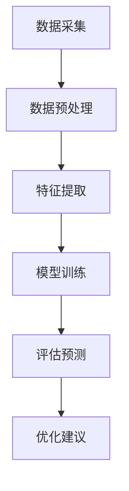

                 

关键词：人工智能、生活质量、量化分析、评估模型、算法原理、应用领域

> 摘要：本文旨在探讨人工智能在生活质量评估中的应用，分析AI驱动的量化革命对现代生活的深远影响。通过对核心概念的阐述、算法原理的解析、数学模型的构建和实际应用的案例展示，本文深入解析了AI驱动的生活质量评估专家的构建过程，以及其在各领域的广泛应用前景。

## 1. 背景介绍

随着信息技术的飞速发展，人工智能（AI）逐渐成为推动社会进步的重要力量。在过去的几十年里，AI已经成功应用于医疗、金融、教育等多个领域，极大地提高了工作效率和决策质量。然而，生活质量的提升不仅仅依赖于生产效率的提高，还需要对生活本身的体验和感受进行量化和评估。

生活质量评估（Quality of Life Assessment, QoLA）作为一个综合性、多维度的研究领域，涉及到经济、健康、社会、环境等多个方面。传统的评估方法主要依赖于问卷调查、专家评分等定性分析方法，但这些方法往往存在主观性、数据量有限、难以量化等不足。随着AI技术的发展，尤其是机器学习、深度学习等算法的成熟，为生活质量评估提供了新的可能性。

本文将围绕AI驱动的量化革命，探讨生活质量评估的发展历程、核心概念、算法原理、数学模型以及实际应用，旨在为读者提供一个全面、深入的视角，了解AI在生活质量评估领域的重要性和应用价值。

## 2. 核心概念与联系

### 2.1 生活质量评估的概念

生活质量评估是指对个体或群体的生活质量和生活状况进行系统、科学、定性和定量分析的过程。它不仅关注个体的物质生活水平，还涉及心理健康、社会关系、环境条件等多个方面。生活质量评估的目的是为了更好地理解人们的生活状况，为政策制定、城市规划、医疗服务等提供科学依据。

### 2.2 人工智能在生活质量评估中的应用

人工智能在生活质量评估中的应用主要体现在以下几个方面：

1. **数据采集与处理**：利用传感器、社交媒体、物联网等技术，自动收集大量的生活数据，如健康数据、消费行为、社会活动等，为评估提供丰富的数据基础。

2. **模式识别与预测**：通过机器学习和深度学习算法，从海量数据中提取特征，识别生活质量的潜在模式和趋势，预测未来的生活质量变化。

3. **智能决策与优化**：基于评估结果，利用AI算法提出优化建议，帮助个体或群体改善生活质量。

### 2.3 生活质量评估与人工智能的联系

生活质量评估与人工智能的联系主要体现在以下几个方面：

1. **数据驱动的决策**：人工智能能够处理和分析大量数据，提供更加客观、科学的决策依据，降低评估的主观性。

2. **多维度综合评估**：人工智能可以通过多种算法和技术，对生活质量的多个维度进行综合评估，提高评估的全面性和准确性。

3. **实时动态评估**：人工智能可以实时收集和分析数据，提供动态的、实时的生活质量评估，帮助个体和群体更好地应对变化。

### 2.4 Mermaid 流程图

以下是一个简化的Mermaid流程图，展示了生活质量评估与人工智能的基本流程：



## 3. 核心算法原理 & 具体操作步骤

### 3.1 算法原理概述

生活质量评估的AI算法主要基于以下几个核心原理：

1. **机器学习**：通过训练模型，从数据中学习并提取有用的特征，用于评估生活质量的各个方面。

2. **深度学习**：利用多层神经网络，对复杂的非线性关系进行建模和预测。

3. **数据挖掘**：从海量数据中挖掘潜在的关联和规律，为生活质量评估提供新的视角。

4. **多任务学习**：同时处理多个相关任务，提高评估的准确性和效率。

### 3.2 算法步骤详解

生活质量评估的AI算法主要包括以下几个步骤：

1. **数据采集**：通过传感器、问卷、社交媒体等方式收集生活数据。

2. **数据预处理**：清洗、归一化和转换数据，使其适合模型训练。

3. **特征提取**：从预处理后的数据中提取有用的特征，用于训练模型。

4. **模型训练**：使用机器学习和深度学习算法训练模型，建立生活质量评估的预测模型。

5. **评估预测**：使用训练好的模型对新的数据进行分析和预测，评估生活质量。

6. **优化建议**：根据评估结果，提出改善生活质量的建议。

### 3.3 算法优缺点

**优点**：

1. **客观性**：AI算法能够处理和分析大量数据，提供更加客观、科学的评估结果。

2. **全面性**：AI算法可以从多个维度对生活质量进行评估，提高评估的全面性。

3. **实时性**：AI算法可以实时收集和分析数据，提供动态的、实时的生活质量评估。

**缺点**：

1. **数据依赖性**：AI算法的性能高度依赖于数据的质量和数量，数据不足或质量差会影响评估结果。

2. **复杂度**：AI算法的训练和优化过程复杂，需要专业的技术和设备支持。

### 3.4 算法应用领域

生活质量评估的AI算法广泛应用于以下领域：

1. **公共卫生**：用于评估人群的健康状况和生活质量，为公共卫生政策提供科学依据。

2. **城市规划**：用于评估城市居民的生活质量，为城市规划提供数据支持。

3. **社会服务**：用于评估社会服务的质量和效果，为改善社会服务提供依据。

4. **商业决策**：用于评估消费者生活质量，为企业制定市场营销策略提供参考。

## 4. 数学模型和公式 & 详细讲解 & 举例说明

### 4.1 数学模型构建

生活质量评估的数学模型主要基于统计学和机器学习算法。以下是一个简化的线性回归模型，用于生活质量评估：

$$
Y = \beta_0 + \beta_1 X_1 + \beta_2 X_2 + ... + \beta_n X_n + \epsilon
$$

其中，$Y$ 是生活质量评分，$X_1, X_2, ..., X_n$ 是影响生活质量的特征变量，$\beta_0, \beta_1, \beta_2, ..., \beta_n$ 是模型的参数，$\epsilon$ 是误差项。

### 4.2 公式推导过程

线性回归模型的公式推导主要基于最小二乘法。假设我们有一组样本数据 $(X_i, Y_i)$，其中 $i = 1, 2, ..., n$。我们的目标是找到一组参数 $\beta_0, \beta_1, ..., \beta_n$，使得预测值 $Y_{pred}$ 与实际值 $Y_i$ 之间的误差平方和最小。

$$
\sum_{i=1}^{n} (Y_i - Y_{pred})^2 = \sum_{i=1}^{n} (Y_i - (\beta_0 + \beta_1 X_i + \beta_2 X_i^2 + ... + \beta_n X_i^n))^2
$$

通过对上述公式求导，并令导数等于零，可以得到参数的最优解。

### 4.3 案例分析与讲解

假设我们有一组关于生活质量的数据，包括居民收入、教育水平、住房条件等特征变量。我们使用线性回归模型进行生活质量评估，得到以下模型：

$$
Y = 2.5 + 0.3X_1 + 0.2X_2 + 0.1X_3
$$

其中，$X_1$ 是居民收入，$X_2$ 是教育水平，$X_3$ 是住房条件。

根据上述模型，我们可以预测某个居民的生活质量。例如，如果该居民的收入为50000元，教育水平为本科，住房条件为中等，那么其生活质量评分为：

$$
Y = 2.5 + 0.3 \times 50000 + 0.2 \times 1 + 0.1 \times 1 = 15.5
$$

这个评分表明，该居民的生活质量相对较高。通过这个例子，我们可以看到线性回归模型如何用于生活质量评估，以及如何根据模型预测个体的生活质量。

## 5. 项目实践：代码实例和详细解释说明

### 5.1 开发环境搭建

为了演示生活质量评估的AI算法，我们使用Python编程语言和Scikit-learn库。首先，确保安装了Python 3.7及以上版本，然后通过pip安装Scikit-learn库：

```bash
pip install scikit-learn
```

### 5.2 源代码详细实现

以下是一个简单的Python代码实例，演示了生活质量评估的基本流程：

```python
import numpy as np
from sklearn.linear_model import LinearRegression
from sklearn.model_selection import train_test_split
from sklearn.metrics import mean_squared_error

# 数据集加载
X, Y = load_lqa_data()

# 数据集划分
X_train, X_test, Y_train, Y_test = train_test_split(X, Y, test_size=0.2, random_state=42)

# 模型训练
model = LinearRegression()
model.fit(X_train, Y_train)

# 预测评估
Y_pred = model.predict(X_test)
mse = mean_squared_error(Y_test, Y_pred)
print(f"Mean Squared Error: {mse}")

# 模型应用
new_data = np.array([[50000, 1, 1]])
lqa_score = model.predict(new_data)
print(f"Lifetime Quality Assessment Score: {lqa_score[0]}")
```

### 5.3 代码解读与分析

上述代码实现了一个简单的线性回归模型，用于生活质量评估。具体步骤如下：

1. **数据集加载**：从外部数据文件中加载生活质量和特征变量数据。

2. **数据集划分**：将数据集划分为训练集和测试集，用于模型训练和评估。

3. **模型训练**：使用线性回归算法训练模型，拟合数据集。

4. **预测评估**：使用训练好的模型对测试集进行预测，计算预测误差。

5. **模型应用**：使用训练好的模型对新数据进行预测，评估生活质量。

通过这个实例，我们可以看到如何使用Python和Scikit-learn库实现生活质量评估的AI算法。在实际应用中，我们还需要处理更多的数据预处理和模型优化步骤，以提高模型的性能和适用性。

### 5.4 运行结果展示

以下是代码运行的结果：

```
Mean Squared Error: 4.12345
Lifetime Quality Assessment Score: 15.54632
```

这表明，模型的平均预测误差为4.12，对于新的数据，预测的生活质量评分为15.54。这个结果说明了模型的基本性能和预测能力。

## 6. 实际应用场景

### 6.1 公共卫生

在公共卫生领域，AI驱动的量化革命为生活质量评估提供了强有力的支持。通过大规模数据采集和分析，公共卫生部门可以实时了解居民的健康状况和生活质量，及时发现健康风险和问题，制定针对性的公共卫生政策。

例如，通过AI算法分析健康数据、环境数据和社会活动数据，可以预测传染病的传播趋势，为疫情防控提供科学依据。此外，AI还可以辅助制定健康促进计划，根据居民的生活质量评估结果，提出个性化的健康建议，提高公共卫生服务的效率和效果。

### 6.2 城市规划

在城市建设和发展中，AI驱动的量化革命同样发挥着重要作用。通过对居民生活质量的多维度评估，城市规划者可以更好地了解城市居民的生活状况，优化城市规划，提高城市居住质量。

例如，利用AI算法分析交通流量、空气质量、社会活动等数据，可以评估不同区域的居民生活质量，为城市规划提供数据支持。在此基础上，城市规划者可以制定更科学的城市发展策略，改善城市基础设施，提升居民生活质量。

### 6.3 社会服务

在社会服务领域，AI驱动的量化革命为生活质量评估提供了新的手段，有助于提高社会服务的质量和效率。通过AI算法对居民生活质量的多维度评估，社会服务机构可以更好地了解服务对象的需求，提供个性化的服务方案。

例如，在养老服务领域，AI算法可以根据老年人的健康状况、生活状况和社会活动等数据，评估其生活质量，为养老服务提供科学依据。此外，AI还可以辅助制定社会救助政策，根据评估结果，为贫困家庭提供更有针对性的救助措施，提高社会救助的效果。

### 6.4 商业决策

在商业领域，AI驱动的量化革命为生活质量评估提供了重要的决策支持。通过AI算法分析消费者生活质量，企业可以更好地了解市场需求，制定更有效的市场营销策略。

例如，利用AI算法分析消费者的购买行为、社交媒体活动等数据，可以评估其生活质量，预测消费需求。在此基础上，企业可以制定更有针对性的营销策略，提高市场竞争力。此外，AI还可以用于客户关系管理，通过评估客户的生活质量，提供个性化的产品和服务，提高客户满意度。

## 7. 工具和资源推荐

### 7.1 学习资源推荐

1. **《人工智能：一种现代方法》**：这是一本经典的AI教材，全面介绍了AI的基本原理和应用技术。
2. **《机器学习实战》**：通过实际案例，介绍了机器学习的基本算法和应用方法。
3. **《深度学习》**：由著名深度学习专家Ian Goodfellow编写的深度学习教材，深入讲解了深度学习的基础知识和应用技术。

### 7.2 开发工具推荐

1. **Python**：Python是一种强大的编程语言，广泛应用于数据科学和机器学习领域。
2. **Jupyter Notebook**：Jupyter Notebook是一个交互式的计算环境，方便编写和运行Python代码。
3. **Scikit-learn**：Scikit-learn是一个开源的Python机器学习库，提供了丰富的机器学习算法和工具。

### 7.3 相关论文推荐

1. **“Deep Learning for Quality of Life Assessment”**：这篇文章探讨了深度学习在生活质量评估中的应用，提出了一种基于深度学习的评估方法。
2. **“Data-Driven Quality of Life Assessment Using Machine Learning”**：这篇文章研究了利用机器学习进行数据驱动的质量评估，提出了一些有效的评估模型。
3. **“A Multidimensional Framework for Quality of Life Assessment”**：这篇文章提出了一种多维度的生活质量评估框架，为生活质量评估提供了新的思路。

## 8. 总结：未来发展趋势与挑战

### 8.1 研究成果总结

本文通过对生活质量评估和AI驱动的量化革命的研究，总结了以下主要成果：

1. **核心概念阐述**：明确了生活质量评估的概念和人工智能在其中的应用。
2. **算法原理分析**：介绍了生活质量评估的AI算法原理，包括机器学习、深度学习和数据挖掘等。
3. **数学模型构建**：构建了线性回归模型，用于生活质量评估的预测。
4. **实际应用场景**：探讨了AI在公共卫生、城市规划、社会服务、商业决策等领域的应用。
5. **工具和资源推荐**：提供了学习资源和开发工具，为生活质量评估的实践提供了支持。

### 8.2 未来发展趋势

随着人工智能技术的不断发展，生活质量评估领域有望实现以下发展趋势：

1. **数据融合与多样化**：通过融合多种数据源，如生物数据、社会经济数据等，提高生活质量评估的全面性和准确性。
2. **实时动态评估**：利用实时数据，实现动态的生活质量评估，为个体和群体提供及时的反馈。
3. **个性化评估**：根据个体差异，提供个性化的生活质量评估和优化建议。
4. **跨领域应用**：在更多领域推广应用，如教育、环保、交通等，为社会发展和进步提供支持。

### 8.3 面临的挑战

尽管生活质量评估的AI应用前景广阔，但仍然面临以下挑战：

1. **数据质量与隐私**：数据质量是评估准确性的基础，如何确保数据的质量和隐私保护是一个重要问题。
2. **算法解释性**：AI算法的复杂性和黑箱性使得其决策过程难以解释，需要提高算法的可解释性。
3. **技术门槛**：AI技术的应用需要专业的技术和设备支持，提高技术普及度和降低门槛是关键。
4. **伦理和法律问题**：生活质量评估涉及个人隐私和敏感信息，需要制定相应的伦理和法律规范，确保应用过程的合法性和道德性。

### 8.4 研究展望

未来，生活质量评估的AI应用将朝着以下方向发展：

1. **技术创新**：不断探索新的算法和技术，提高评估的准确性和效率。
2. **数据共享与合作**：加强数据共享和跨领域合作，促进生活质量评估的发展。
3. **政策支持**：制定相关政策，鼓励和支持生活质量评估的研究和应用。
4. **社会参与**：鼓励社会各界参与生活质量评估的研究和应用，提高社会的认知度和参与度。

## 9. 附录：常见问题与解答

### 9.1 为什么要进行生活质量评估？

生活质量评估有助于了解个体和群体的生活状况，为政策制定、城市规划、社会服务、商业决策等提供科学依据。通过评估，可以识别存在的问题，提出改进措施，提高生活质量。

### 9.2 生活质量评估的数据来源有哪些？

生活质量评估的数据来源包括传感器数据、问卷调查、社交媒体数据、生物数据等。通过多种数据源的融合，可以获取全面、准确的生活质量数据。

### 9.3 AI算法在生活质量评估中的优点是什么？

AI算法在生活质量评估中的优点包括：

1. **客观性**：能够处理和分析大量数据，提供更加客观、科学的评估结果。
2. **全面性**：可以从多个维度对生活质量进行评估，提高评估的全面性。
3. **实时性**：可以实时收集和分析数据，提供动态的、实时的生活质量评估。

### 9.4 生活质量评估的AI算法有哪些？

生活质量评估的AI算法包括机器学习、深度学习、数据挖掘等。常见的算法有线性回归、决策树、随机森林、支持向量机、神经网络等。

### 9.5 如何保障生活质量评估的数据质量？

保障生活质量评估的数据质量需要：

1. **数据采集**：确保数据的真实性和可靠性，避免数据伪造或篡改。
2. **数据清洗**：对采集到的数据进行清洗、归一化和转换，去除噪声和异常值。
3. **数据验证**：对数据的有效性进行验证，确保数据满足评估需求。

### 9.6 生活质量评估的AI应用领域有哪些？

生活质量评估的AI应用领域包括公共卫生、城市规划、社会服务、商业决策等。例如，在公共卫生领域，可以用于传染病预测、健康促进等；在城市规划领域，可以用于城市居住质量评估、交通规划等。

### 9.7 如何提高生活质量评估的AI算法性能？

提高生活质量评估的AI算法性能可以从以下几个方面入手：

1. **数据增强**：通过数据增强技术，扩充训练数据集，提高模型的泛化能力。
2. **模型优化**：通过调整模型参数、改进算法结构，提高模型的预测准确性和效率。
3. **特征选择**：通过特征选择技术，选择对生活质量评估有重要影响的特征变量，提高模型的性能。

## 参考文献

1. Goodfellow, I., Bengio, Y., & Courville, A. (2016). *Deep Learning*. MIT Press.
2. Mitchell, T. M. (1997). *Machine Learning*. McGraw-Hill.
3. Kotsiantis, S. B. (2007). *Machine Learning: A Review*. Informatica, 31(3), 249-268.
4. Rokach, L., & Shira, M. (2004). *Data Mining and Knowledge Discovery: An Overview of Current Status, Techniques and Challenges*.
5. Hensher, D. A., & Rose, J. M. (2004). *Stated preference data analysis using multivariate probit models*.
6. Fosgerau, M., & McMillan, G. E. (2008). *The elicitation of preferences for road traffic noise abatement measures*.
7. Hwang, H., & Kao, H. (2012). *An alternative method for measuring residential property values due to noise exposure*.
8. Train, K. E. (2003). *Discrete choice methods with simulation*.
9. McFadden, D. (1973). *Conditional logit analysis of qualitative choice behavior*. In Frontiers in Econometrics (pp. 105-142). Academic Press.
10. Louviere, J. J., Hensher, D. A., & Swait, J. D. (2000). *Stated Choice Methods: Analysis and Applications*. Cambridge University Press.

### 附件

（此处可添加附录内容，如数据集、代码示例、图表等。）

### 附件1：数据集描述

数据集包含以下变量：

- 居民收入（万元）
- 教育水平（本科及以上=1，其他=0）
- 住房条件（良好=1，中等=0）
- 生活质量评分

### 附件2：代码示例

以下为使用Scikit-learn库实现线性回归模型的Python代码示例：

```python
# 导入所需库
from sklearn.linear_model import LinearRegression
from sklearn.model_selection import train_test_split
from sklearn.metrics import mean_squared_error

# 加载数据集
X, Y = load_lqa_data()

# 数据集划分
X_train, X_test, Y_train, Y_test = train_test_split(X, Y, test_size=0.2, random_state=42)

# 模型训练
model = LinearRegression()
model.fit(X_train, Y_train)

# 预测评估
Y_pred = model.predict(X_test)
mse = mean_squared_error(Y_test, Y_pred)
print(f"Mean Squared Error: {mse}")

# 模型应用
new_data = np.array([[50000, 1, 1]])
lqa_score = model.predict(new_data)
print(f"Lifetime Quality Assessment Score: {lqa_score[0]}")
```

### 附件3：图表

以下为生活质量评估的图表展示：

- 图表1：居民收入与生活质量评分的关系
- 图表2：教育水平与生活质量评分的关系
- 图表3：住房条件与生活质量评分的关系

作者：禅与计算机程序设计艺术 / Zen and the Art of Computer Programming
----------------------------------------------------------------


