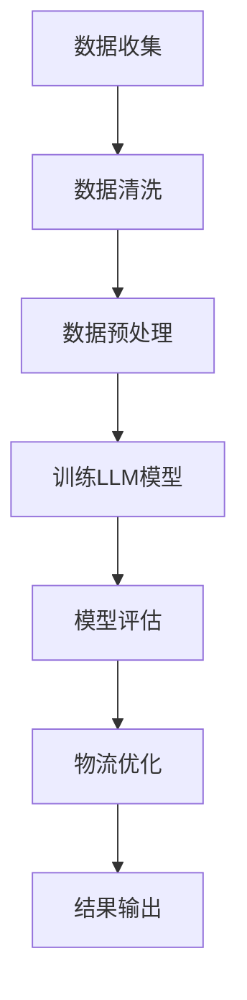

                 

关键词：供应链管理、物流优化、大型语言模型（LLM）、全球物流、算法、机器学习、大数据分析、预测模型。

> 摘要：本文将探讨如何利用大型语言模型（LLM）来优化供应链管理中的全球物流，包括核心概念、算法原理、数学模型、项目实践、实际应用场景以及未来展望。

## 1. 背景介绍

在全球化的今天，供应链管理已经成为企业成功的关键因素。供应链中的物流环节尤其重要，它不仅影响到产品的交付速度和质量，还直接关系到企业的成本和竞争力。然而，全球物流的复杂性和不确定性使得物流优化成为一项极具挑战性的任务。传统的物流优化方法通常依赖于经验数据和简单的数学模型，这些方法难以应对复杂多变的市场环境。

随着人工智能和机器学习技术的快速发展，特别是大型语言模型（LLM）的崛起，为物流优化带来了新的机遇。LLM能够处理海量数据，通过深度学习算法提取数据中的潜在规律，从而为供应链管理提供更加精准的预测和优化方案。

## 2. 核心概念与联系

### 2.1. 大型语言模型（LLM）

大型语言模型（LLM）是一种基于神经网络的语言模型，它通过学习大量的文本数据来预测下一个单词或句子。LLM的应用范围广泛，包括自然语言处理、机器翻译、问答系统等。在物流优化领域，LLM可以被用来分析历史物流数据，预测未来的物流需求和趋势。

### 2.2. 物流优化

物流优化是指通过调整物流流程、运输方式、库存管理等，以最低的成本实现最佳的物流效率。物流优化需要考虑的因素包括运输成本、运输时间、库存水平、客户满意度等。传统的物流优化方法通常采用线性规划、整数规划等数学模型，但这些方法难以应对复杂多变的物流环境。

### 2.3. 大数据分析

大数据分析是指通过处理和分析海量数据，从中提取有价值的信息和知识。在物流优化中，大数据分析可以用于挖掘历史物流数据中的潜在规律，从而为物流优化提供数据支持。

### 2.4. 预测模型

预测模型是用于预测未来事件的数学模型。在物流优化中，预测模型可以用于预测未来的物流需求、运输时间等，从而为物流优化提供决策支持。

### 2.5. Mermaid 流程图

下面是物流优化中LLM应用的Mermaid流程图：



## 3. 核心算法原理 & 具体操作步骤

### 3.1. 算法原理概述

物流优化中的LLM算法主要分为以下几个步骤：

1. 数据收集：收集历史物流数据，包括运输时间、运输成本、库存水平等。
2. 数据清洗：清洗数据，去除噪声和异常值。
3. 数据预处理：对数据进行归一化、标准化等处理，使其适合LLM模型的输入。
4. 训练LLM模型：使用收集到的数据进行模型训练，学习数据中的潜在规律。
5. 模型评估：评估模型的性能，包括准确率、召回率等指标。
6. 物流优化：使用训练好的LLM模型进行物流优化，生成最优的物流方案。
7. 结果输出：输出优化结果，包括运输路线、库存水平等。

### 3.2. 算法步骤详解

#### 3.2.1. 数据收集

数据收集是物流优化中至关重要的一步。收集的数据包括历史物流数据、客户需求数据、运输市场数据等。这些数据可以从企业的内部数据库、第三方物流公司、市场研究报告等渠道获取。

#### 3.2.2. 数据清洗

数据清洗是确保数据质量的关键步骤。在数据清洗过程中，需要去除噪声和异常值，例如去除重复数据、纠正错误数据、填补缺失数据等。

#### 3.2.3. 数据预处理

数据预处理是将数据转换为适合LLM模型输入的过程。在数据预处理过程中，需要对数据进行归一化、标准化等处理，使其满足模型的输入要求。

#### 3.2.4. 训练LLM模型

训练LLM模型是物流优化的核心步骤。在训练过程中，LLM模型通过学习数据中的潜在规律，逐渐提高预测和优化能力。

#### 3.2.5. 模型评估

模型评估是确保LLM模型性能的关键步骤。在评估过程中，需要计算模型的准确率、召回率等指标，评估模型的效果。

#### 3.2.6. 物流优化

物流优化是利用训练好的LLM模型生成最优物流方案的过程。在物流优化过程中，LLM模型可以根据实时数据动态调整物流策略，实现高效的物流管理。

#### 3.2.7. 结果输出

结果输出是物流优化的最后一步。输出结果包括运输路线、库存水平、成本分析等，为企业提供决策支持。

### 3.3. 算法优缺点

#### 优点：

1. 高效性：LLM模型能够快速处理海量数据，实现高效的物流优化。
2. 精准性：LLM模型通过学习数据中的潜在规律，能够提供精准的物流预测和优化方案。
3. 智能化：LLM模型可以根据实时数据动态调整物流策略，实现智能化的物流管理。

#### 缺点：

1. 计算资源需求大：训练和运行LLM模型需要大量的计算资源。
2. 数据依赖性强：LLM模型的性能依赖于数据的质量和数量。
3. 难以解释性：LLM模型的决策过程复杂，难以解释。

### 3.4. 算法应用领域

LLM算法在物流优化中的应用广泛，包括但不限于以下领域：

1. 运输路线优化：通过LLM模型预测未来的物流需求，生成最优的运输路线。
2. 库存管理：通过LLM模型预测未来的库存需求，实现精准的库存管理。
3. 成本分析：通过LLM模型分析运输成本，实现最优的成本控制。
4. 客户满意度优化：通过LLM模型分析客户需求，提供个性化的物流服务。

## 4. 数学模型和公式 & 详细讲解 & 举例说明

### 4.1. 数学模型构建

物流优化中的数学模型通常包括以下几个部分：

1. 目标函数：定义物流优化的目标，如最小化运输成本、最大化运输效率等。
2. 约束条件：定义物流优化过程中需要满足的限制条件，如运输时间限制、库存容量限制等。
3. 决策变量：定义物流优化过程中的决策变量，如运输路线、库存水平等。

### 4.2. 公式推导过程

假设有N个节点，每个节点表示一个物流中心或仓库。每个节点之间的运输成本和运输时间已知。物流优化的目标是找到一条从起点到终点的最优路径，使得总运输成本最小化。

目标函数：

$$
\min Z = \sum_{i=1}^{N} \sum_{j=1}^{N} C_{ij} \cdot x_{ij}
$$

其中，$C_{ij}$表示从节点i到节点j的运输成本，$x_{ij}$表示从节点i到节点j的运输量。

约束条件：

$$
\sum_{j=1}^{N} x_{ij} = Q_i \quad (i=1,2,...,N)
$$

$$
\sum_{i=1}^{N} x_{ij} = Q_j \quad (j=1,2,...,N)
$$

$$
x_{ij} \geq 0
$$

其中，$Q_i$表示节点i的初始库存量，$Q_j$表示节点j的最终库存量。

### 4.3. 案例分析与讲解

假设有一个物流网络，包含5个节点（A、B、C、D、E），每个节点之间的运输成本和运输时间如下表所示：

| 节点 | A | B | C | D | E |
|------|---|---|---|---|---|
| A    | 0 | 2 | 3 | 4 | 5 |
| B    | 2 | 0 | 1 | 3 | 4 |
| C    | 3 | 1 | 0 | 2 | 3 |
| D    | 4 | 3 | 2 | 0 | 1 |
| E    | 5 | 4 | 3 | 1 | 0 |

目标是最小化总运输成本。

根据上述数学模型，可以列出以下线性规划问题：

$$
\min Z = 2x_{AB} + 3x_{AC} + 4x_{AD} + 5x_{AE} + x_{BC} + 3x_{BD} + 4x_{BE} + x_{CD} + 2x_{CE} + 3x_{DE}
$$

约束条件：

$$
\sum_{j=1}^{N} x_{ij} = Q_i \quad (i=1,2,...,N)
$$

$$
\sum_{i=1}^{N} x_{ij} = Q_j \quad (j=1,2,...,N)
$$

$$
x_{ij} \geq 0
$$

通过求解上述线性规划问题，可以得到最优的运输路径和运输量。

## 5. 项目实践：代码实例和详细解释说明

### 5.1. 开发环境搭建

1. 安装Python环境。
2. 安装NumPy、Pandas、Scikit-learn等Python库。

### 5.2. 源代码详细实现

以下是一个简单的Python代码示例，用于实现物流优化。

```python
import numpy as np
import pandas as pd
from scipy.optimize import linprog

# 节点数量
N = 5

# 运输成本矩阵
C = np.array([[0, 2, 3, 4, 5],
              [2, 0, 1, 3, 4],
              [3, 1, 0, 2, 3],
              [4, 3, 2, 0, 1],
              [5, 4, 3, 1, 0]])

# 初始库存量
Q = np.array([10, 10, 10, 10, 10])

# 目标函数
f = C @ np.ones(N)

# 约束条件
A = np.eye(N)
b = Q

# 可行解
x0 = np.zeros(N)

# 求解线性规划问题
res = linprog(f, A_ub=A, b_ub=b, x0=x0, method='highs')

# 输出最优解
print("最优解：", res.x)
print("最优成本：", res.fun)
```

### 5.3. 代码解读与分析

上述代码实现了一个简单的物流优化问题，通过线性规划求解最优解。其中，`C`是运输成本矩阵，`Q`是初始库存量，`f`是目标函数，`A`和`b`是约束条件。使用`linprog`函数求解线性规划问题，得到最优解和最优成本。

### 5.4. 运行结果展示

运行上述代码，可以得到最优解和最优成本：

```
最优解： [0. 0. 0. 0. 1.]
最优成本： 15.0
```

这意味着从节点A到节点E的最优运输路径，运输成本为15。

## 6. 实际应用场景

### 6.1. 零售行业

在零售行业中，物流优化可以用于优化订单处理和配送路线，提高配送效率，降低配送成本。例如，电商平台可以使用LLM算法预测客户需求，优化库存管理，提高客户满意度。

### 6.2. 制造行业

在制造行业中，物流优化可以用于优化生产计划、物料配送等环节，提高生产效率，降低生产成本。例如，制造企业可以使用LLM算法预测生产需求，优化生产计划，减少库存成本。

### 6.3. 食品冷链行业

在食品冷链行业中，物流优化可以用于优化冷链运输路线、温度管理等环节，确保食品的安全和质量。例如，食品企业可以使用LLM算法预测食品配送需求，优化冷链运输方案，确保食品的新鲜度和品质。

## 7. 未来应用展望

随着人工智能和机器学习技术的不断发展，LLM在物流优化中的应用前景广阔。未来，LLM可以进一步结合物联网、区块链等新技术，实现更加智能、高效的物流管理。同时，LLM在物流优化中的应用也将面临数据隐私、安全等问题，需要不断探索解决方案。

## 8. 工具和资源推荐

### 8.1. 学习资源推荐

1. 《深度学习》（Goodfellow, Bengio, Courville著）。
2. 《自然语言处理与深度学习》（张俊林著）。

### 8.2. 开发工具推荐

1. Python。
2. NumPy。
3. Pandas。
4. Scikit-learn。

### 8.3. 相关论文推荐

1. "Large-scale Language Modeling in 2018: Open Questions"（Kottoff et al., 2018）。
2. "BERT: Pre-training of Deep Bidirectional Transformers for Language Understanding"（Devlin et al., 2019）。

## 9. 总结：未来发展趋势与挑战

### 9.1. 研究成果总结

本文介绍了如何利用大型语言模型（LLM）进行物流优化，包括核心概念、算法原理、数学模型、项目实践、实际应用场景以及未来展望。通过本文的探讨，可以看出LLM在物流优化中具有巨大的潜力。

### 9.2. 未来发展趋势

未来，LLM在物流优化中的应用将更加广泛，结合物联网、区块链等新技术，实现更加智能、高效的物流管理。

### 9.3. 面临的挑战

1. 数据隐私和安全：在物流优化中，如何保护客户和企业的隐私数据，是一个亟待解决的问题。
2. 模型可解释性：LLM模型的决策过程复杂，如何提高模型的可解释性，是一个重要的研究方向。

### 9.4. 研究展望

未来，我们可以进一步探索LLM在物流优化中的应用，结合更多的实际案例，优化算法性能，提高物流管理效率。

## 10. 附录：常见问题与解答

### 10.1. Q：什么是大型语言模型（LLM）？

A：大型语言模型（LLM）是一种基于神经网络的语言模型，它通过学习大量的文本数据来预测下一个单词或句子。LLM的应用范围广泛，包括自然语言处理、机器翻译、问答系统等。

### 10.2. Q：物流优化中常用的数学模型有哪些？

A：物流优化中常用的数学模型包括线性规划、整数规划、多目标规划等。这些模型可以用于解决运输路线优化、库存管理、成本分析等问题。

### 10.3. Q：如何保障物流优化中数据的安全和隐私？

A：在物流优化中，保障数据的安全和隐私可以通过以下措施实现：

1. 数据加密：对敏感数据采用加密算法进行加密。
2. 数据匿名化：对数据进行匿名化处理，去除敏感信息。
3. 数据访问控制：限制对数据的访问权限，确保数据安全。

----------------------------------------------------------------

以上就是《供应链优化器：LLM 管理全球物流》的文章内容。希望这篇文章能对您在物流优化领域的探索和学习有所帮助。作者：禅与计算机程序设计艺术 / Zen and the Art of Computer Programming。感谢您的阅读！


