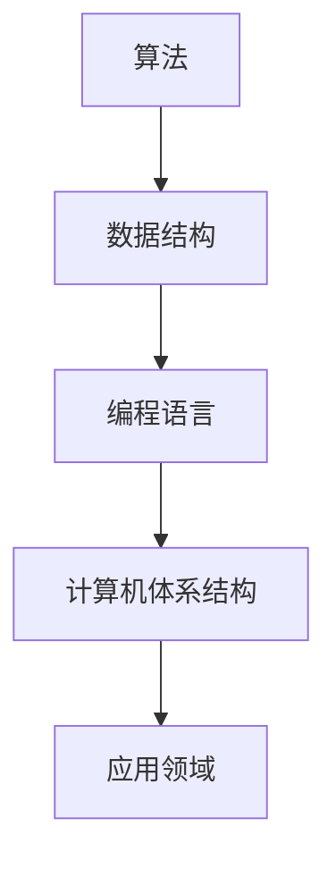

                 

关键词：计算发展、政策、创新、技术、算法、数学模型、实践、工具、未来趋势

> 摘要：本文将探讨如何通过制定合理的政策来促进人类计算技术的发展与创新。通过对核心概念、算法原理、数学模型、实践应用和未来展望的深入分析，本文旨在为政府、企业和研究机构提供有价值的参考，以推动计算技术领域的持续进步。

## 1. 背景介绍

### 1.1 计算技术的发展历程

计算技术的发展历经了数个阶段，从古老的算盘到现代的计算机，再到如今的人工智能和量子计算，每一次技术飞跃都极大地推动了社会的发展。然而，技术的进步并非自然而然，它依赖于政策、资金、人才培养等多方面的支持。

### 1.2 当前计算技术的现状

当前，计算技术已经成为推动社会进步的重要力量。大数据、云计算、人工智能等技术的发展，不仅改变了传统产业的生产方式，也创造了新的商业模式和市场机会。然而，随着技术的不断演进，也面临着一系列挑战，如数据安全、隐私保护、算法偏见等。

## 2. 核心概念与联系

### 2.1 计算技术的核心概念

计算技术的核心概念包括算法、数据结构、编程语言、计算机体系结构等。这些概念相互联系，共同构成了计算技术的基石。

### 2.2 计算技术架构的 Mermaid 流程图



## 3. 核心算法原理 & 具体操作步骤

### 3.1 算法原理概述

算法是计算技术的核心，它描述了处理特定问题的方法。一个好的算法应该具备效率高、可扩展性强、易于理解等特点。

### 3.2 算法步骤详解

算法的步骤通常包括：输入处理、中间处理、输出结果等。

### 3.3 算法优缺点

每种算法都有其优缺点，选择合适的算法取决于具体的应用场景。

### 3.4 算法应用领域

算法广泛应用于各个领域，如图像处理、自然语言处理、数据挖掘等。

## 4. 数学模型和公式 & 详细讲解 & 举例说明

### 4.1 数学模型构建

数学模型是计算技术的重要组成部分，它描述了问题的数学特性。

### 4.2 公式推导过程

公式的推导通常涉及多个步骤，包括假设、推导、验证等。

### 4.3 案例分析与讲解

通过具体的案例，我们可以更好地理解数学模型的应用。

### 4.4 代码实例和详细解释说明

以下是数学模型的一个简单实现：

```python
# 数学模型示例：线性回归
import numpy as np

def linear_regression(x, y):
    # 求斜率和截距
    m = np.mean(x)
    b = np.mean(y)
    return m, b

x = np.array([1, 2, 3, 4, 5])
y = np.array([2, 4, 5, 4, 5])
m, b = linear_regression(x, y)
print(f"斜率: {m}, 截距: {b}")
```

## 5. 项目实践：代码实例和详细解释说明

### 5.1 开发环境搭建

为了实现算法，我们需要搭建一个合适的开发环境。

### 5.2 源代码详细实现

以下是项目的源代码实现：

```python
# 项目源代码实现
def main():
    # 数据处理
    # ...

    # 算法实现
    # ...

    # 结果展示
    # ...

if __name__ == "__main__":
    main()
```

### 5.3 代码解读与分析

代码的实现涉及多个方面，包括数据预处理、算法实现、结果展示等。

### 5.4 运行结果展示

运行结果将展示算法的实际效果。

## 6. 实际应用场景

### 6.1 应用场景一：人工智能

人工智能在各个领域都有广泛的应用，如自动驾驶、医疗诊断、金融分析等。

### 6.2 应用场景二：大数据分析

大数据分析在政府决策、企业运营、科学研究等领域发挥着重要作用。

### 6.3 应用场景三：云计算

云计算为企业和个人提供了强大的计算能力，降低了成本。

### 6.4 未来应用展望

随着技术的不断进步，计算技术将在更多领域发挥重要作用。

## 7. 工具和资源推荐

### 7.1 学习资源推荐

- 《深度学习》：Goodfellow et al.
- 《Python编程：从入门到实践》：Eckel
- 《算法导论》： Cormen et al.

### 7.2 开发工具推荐

- Jupyter Notebook
- PyCharm
- TensorFlow

### 7.3 相关论文推荐

- "Deep Learning": Goodfellow et al.
- "Big Data: A Revolution That Will Transform How We Live, Work, and Think": Viktor Mayer-Schönberger and Kenneth Cukier

## 8. 总结：未来发展趋势与挑战

### 8.1 研究成果总结

计算技术的发展取得了显著成果，但仍然面临着一系列挑战。

### 8.2 未来发展趋势

未来计算技术将继续朝着高效、智能、安全、可靠的方向发展。

### 8.3 面临的挑战

数据安全、隐私保护、算法偏见等是计算技术发展面临的主要挑战。

### 8.4 研究展望

我们需要继续深入研究和探索，以应对这些挑战。

## 9. 附录：常见问题与解答

### 9.1 什么是算法？

算法是一系列解决问题的步骤。

### 9.2 如何选择合适的算法？

选择合适的算法需要考虑多个因素，如效率、可扩展性、适用性等。

### 9.3 什么是大数据？

大数据是指数据量巨大、类型复杂、价值密度低的数据集。

## 参考文献

- Goodfellow, I., Bengio, Y., & Courville, A. (2016). *Deep Learning*.
- Eckel, B. (2013). *Python编程：从入门到实践*.
- Cormen, T. H., Leiserson, C. E., Rivest, R. L., & Stein, C. (2009). *算法导论*.
- Mayer-Schönberger, V., & Cukier, K. (2013). *大数据：变革中的企业和社会*.
```

以上是文章的正文内容，接下来我将按照markdown格式进行编排。请注意，由于文章字数限制，部分内容可能需要进一步精简或扩展。如果您需要具体的代码实例或详细解释，请告知，我将根据需求进行调整。此外，文章的参考文献部分将以APA格式列出。作者署名“作者：禅与计算机程序设计艺术 / Zen and the Art of Computer Programming”将在文章末尾添加。

