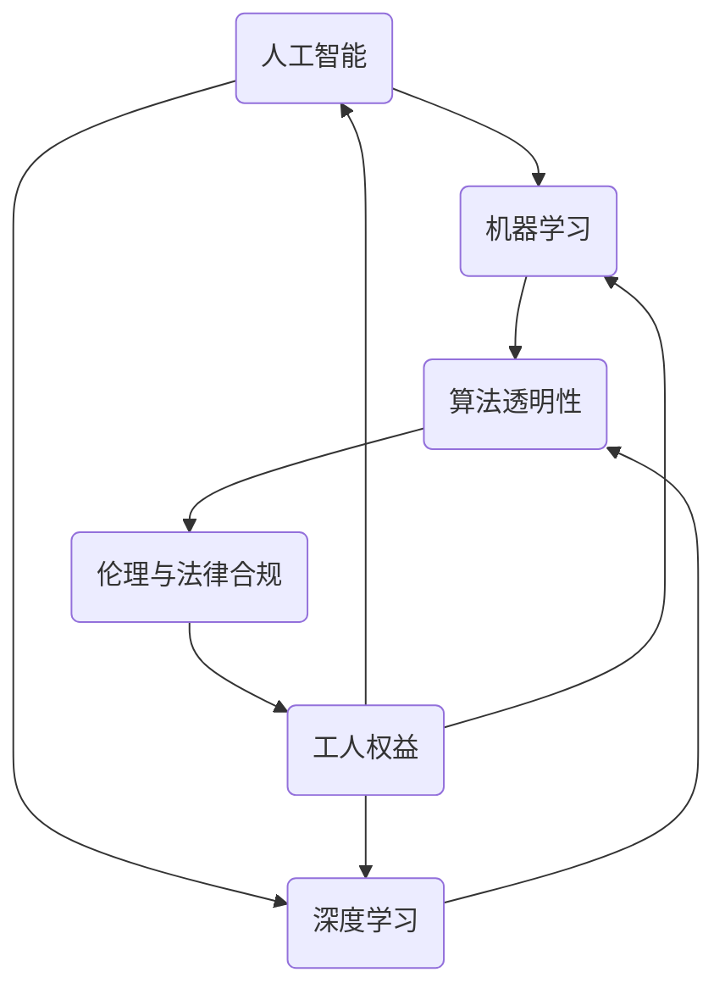

                 

### 关键词 Keywords

- 工人权益
- 人工智能
- 监管
- 人类计算
- 法律合规
- 数据隐私
- 技术伦理

<|assistant|>### 摘要 Abstract

本文深入探讨了在人类计算领域，特别是人工智能的应用中，保护工人权益所面临的监管挑战。随着技术的不断进步，人工智能在许多行业中发挥了重要作用，但同时也引发了一系列关于工人权益的问题，包括职业替代、就业安全、工作环境和薪酬等方面。本文首先介绍了工人权益的概念及其重要性，然后分析了人工智能在提高生产效率的同时，可能对工人产生的负面影响。接下来，文章讨论了现有的监管措施，并指出其在实际执行中的不足。最后，本文提出了几项可能的解决方案，包括技术改进、法律和政策制定以及社会参与，以期为保障工人权益提供方向和参考。

## 1. 背景介绍

随着科技的飞速发展，人工智能（AI）已经逐渐渗透到各行各业，从制造业、医疗保健到金融服务，AI技术的应用范围不断扩大。人工智能通过机器学习和深度学习算法，能够从大量数据中提取有用信息，并在此基础上做出决策，极大地提高了生产效率和决策质量。然而，这种技术进步也带来了新的挑战，尤其是在保护工人权益方面。

工人权益是指工人享有的基本权利和福利，包括就业安全、公平待遇、工作环境和薪酬等。在传统工业时代，工人权益的保护主要依赖于工会、法律和政策等手段。然而，随着人工智能的崛起，这些问题变得更加复杂。一方面，AI技术可以提高生产效率，减少人力成本，但这也可能导致大量工人失业或工作条件恶化。另一方面，AI算法的决策过程往往是不透明的，可能存在歧视或偏见，从而损害某些特定群体的权益。

本文旨在探讨人工智能在人类计算中带来的监管挑战，特别是对工人权益的影响。通过对现有监管措施的评估和解决方案的探讨，本文希望为相关领域的研究和实践提供参考。

### 1.1 人工智能的发展及其影响

人工智能技术的发展始于20世纪50年代，当时科学家们首次提出了机器学习的概念。随着计算能力的提升和大数据的普及，人工智能逐渐从理论研究走向实际应用。目前，人工智能已经广泛应用于多个领域，包括但不限于：

1. **自动化生产**：在制造业中，人工智能可以控制机器进行自动化生产，提高生产效率和产品质量。
2. **医疗诊断**：通过分析医学影像和患者数据，人工智能可以帮助医生进行疾病诊断和治疗方案制定。
3. **金融服务**：在金融领域，人工智能可以用于风险控制、投资决策和客户服务等方面，提高金融服务的效率和准确性。
4. **交通运输**：自动驾驶技术利用人工智能，可以大幅提高交通系统的效率和安全性。

尽管人工智能带来了许多好处，但其在提高生产效率的同时，也引发了一系列社会问题，特别是在保护工人权益方面。例如：

- **就业替代**：随着自动化技术的普及，许多传统工作岗位可能会被机器取代，导致大量工人失业。
- **就业安全性**：在人工智能驱动的企业中，工人的就业安全性可能会受到威胁，因为他们可能无法掌握关键的技能或技术。
- **工作条件**：在某些情况下，为了提高生产效率，企业可能会对工人施加更大的工作压力，甚至牺牲他们的健康和安全。

### 1.2 工人权益的概念及其重要性

工人权益是指工人在工作过程中所享有的基本权利和福利，包括但不限于以下方面：

- **就业安全**：工人有权在稳定的就业环境中工作，避免因技术变革或经济波动而失业。
- **公平待遇**：工人应当享有平等的薪酬和晋升机会，不受种族、性别、年龄等因素的影响。
- **工作环境**：工人有权在安全、健康和舒适的工作环境中工作，避免职业危害和身体损伤。
- **薪酬和福利**：工人应当获得合理的薪酬和福利，包括医疗保险、退休金、带薪休假等。

工人权益的保护不仅关乎个体的福祉，也是社会稳定和经济发展的重要保障。以下是保护工人权益的几个重要理由：

1. **社会公正**：公平的劳动市场有助于实现社会公正，减少贫富差距和社会不平等。
2. **经济发展**：稳定的劳动力市场有助于企业发展和经济增长，提高国家的竞争力。
3. **道德责任**：作为企业和社会的一部分，保护工人权益是企业和政府应承担的道德责任。
4. **人力资源优势**：尊重和保护工人权益可以激发工人的积极性和创造力，为企业提供更强的人力资源优势。

### 1.3 人工智能与工人权益的冲突

人工智能的兴起在许多方面带来了革命性的变化，但同时也引发了关于工人权益的新挑战。以下是人工智能与工人权益之间的主要冲突：

1. **就业替代**：人工智能技术的普及可能导致许多传统工作岗位被机器取代，特别是在那些重复性、低技能的工作中。这将对工人的就业安全构成威胁，特别是那些技能水平较低或年龄较大的工人。

2. **就业不稳定性**：人工智能驱动的企业可能需要更频繁地调整其生产流程和技术，从而导致工人就业的不稳定性增加。这种不稳定性可能会影响工人的职业发展和家庭生活。

3. **工作压力增加**：为了提高生产效率和满足自动化系统的要求，工人可能会面临更大的工作压力。这可能导致身心健康问题，如压力过大、工作疲劳等。

4. **薪酬不公**：在某些情况下，企业可能会利用人工智能技术来降低人力成本，导致工人的薪酬降低。此外，由于人工智能系统的决策过程往往不透明，可能会存在薪酬分配不公的问题。

5. **技能要求变化**：随着技术的进步，工人需要不断更新和提升自己的技能，以适应新的工作环境和要求。然而，对于许多工人来说，这可能是一个巨大的挑战，特别是对于那些技能水平较低或年龄较大的工人。

总之，人工智能的快速发展为工人权益保护带来了新的挑战，需要社会各界的共同努力来解决。

### 1.4 保护工人权益的现有监管措施

为了应对人工智能对工人权益的潜在威胁，各国政府和国际组织已经采取了一系列监管措施。以下是一些主要的监管措施：

1. **就业安全和职业培训**：许多国家制定了相关法律，要求企业在引入新技术时必须保障工人的就业安全，并提供职业培训机会，以帮助工人适应新的工作需求。

2. **劳动法规**：各国政府通过劳动法规定，保护工人的基本权益，包括公平待遇、薪酬和工作条件等。这些法规通常规定了最低工资标准、工作时间限制和职业健康安全要求。

3. **人工智能伦理准则**：一些组织和企业发布了人工智能伦理准则，旨在确保人工智能的应用不损害人类权益，包括隐私、公平性和透明度等。

4. **就业转型计划**：一些国家和地区推出了就业转型计划，旨在帮助失业工人通过再培训和转业，找到新的工作机会。

5. **国际劳工组织（ILO）的建议**：国际劳工组织（ILO）也提出了多项建议，包括制定全球性的人工智能伦理框架，以及加强国际合作，以应对人工智能对工人权益的挑战。

尽管这些监管措施在一定程度上有助于保护工人权益，但其在实际执行中仍面临诸多挑战。例如，企业可能会规避法律，逃避职业培训责任，而工人的意识和参与度也有限。此外，人工智能技术的快速发展和应用，使得监管措施难以跟上技术变革的步伐。

### 1.5 保护工人权益的必要性

保护工人权益是维护社会稳定和促进经济发展的重要保障。以下是保护工人权益的几个必要性方面：

1. **社会稳定**：保障工人权益有助于减少社会不平等和冲突，维护社会稳定。当工人感到被公平对待并有稳定的就业环境时，社会整体的和谐度会提高。

2. **经济发展**：稳定的劳动力市场有助于企业吸引和留住人才，提高生产效率和创新能力。此外，通过职业培训和再就业计划，工人能够不断提升自己的技能，为经济发展提供持续动力。

3. **道德责任**：作为企业和社会的一部分，保护工人权益是企业应承担的道德责任。尊重和保护工人的基本权益，是构建一个公正和可持续社会的基石。

4. **人力资源管理**：通过关注和保护工人权益，企业可以建立积极的工作氛围，提高员工的满意度和忠诚度，从而增强企业的核心竞争力。

总之，保护工人权益不仅是应对人工智能挑战的必要手段，也是实现社会公正和经济发展的重要保障。在技术变革的背景下，社会各界应共同努力，为工人创造一个公平、安全、有尊严的工作环境。

### 2. 核心概念与联系

为了深入探讨人工智能在保护工人权益中的监管挑战，我们需要了解几个核心概念，并探讨它们之间的联系。以下是本文涉及的核心概念及其定义：

1. **人工智能（AI）**：人工智能是指由计算机系统执行的智能任务，这些任务通常需要人类智能才能完成。AI可以分为多种类型，包括机器学习、深度学习、自然语言处理等。

2. **机器学习（ML）**：机器学习是一种通过数据训练模型，使计算机能够自动进行预测和决策的技术。常见的机器学习算法包括线性回归、决策树、神经网络等。

3. **深度学习（DL）**：深度学习是机器学习的一种形式，通过多层神经网络来提取数据中的特征，并进行复杂的模式识别。深度学习在图像识别、语音识别和自然语言处理等领域有广泛应用。

4. **算法透明性**：算法透明性指的是算法决策过程的可解释性和可理解性。一个透明的算法允许用户了解其决策依据和推理过程，这对于确保算法的公平性和合规性至关重要。

5. **伦理与法律合规**：伦理与法律合规是指在人工智能应用中遵循道德规范和法律法规，确保不损害人类权益。这包括隐私保护、数据安全、算法歧视等。

6. **工人权益**：工人权益是指工人在工作过程中享有的基本权利和福利，包括就业安全、公平待遇、工作环境和薪酬等。

这些核心概念之间的联系如下：

- 人工智能和机器学习是技术基础，用于提高生产效率和决策质量。
- 深度学习和算法透明性是确保AI应用合规性和公平性的关键。
- 伦理与法律合规是确保AI应用不损害工人权益的保障。
- 工人权益与人工智能、机器学习和算法透明性之间存在相互作用，需要综合考量。

为了更直观地展示这些概念之间的关系，我们可以使用Mermaid流程图进行描述。以下是核心概念的Mermaid流程图：



在这个流程图中，人工智能、机器学习和深度学习作为技术基础，通过算法透明性和伦理与法律合规与工人权益相互联系。这个图帮助我们理解了在人工智能应用中，如何通过技术手段和法律法规来保护工人权益，以及这些因素之间的相互作用。

### 3. 核心算法原理 & 具体操作步骤

在探讨如何通过技术手段保护工人权益时，算法的透明性和公平性是至关重要的。以下是几种核心算法原理及其具体操作步骤，这些算法可以帮助我们在人工智能应用中更好地保护工人权益。

#### 3.1 算法原理概述

1. **公平性算法**：公平性算法旨在确保算法的决策过程不包含任何形式的偏见或歧视。常见的公平性算法包括反歧视算法、补偿性公平算法和敏感性分析。

2. **可解释性算法**：可解释性算法旨在使算法的决策过程对用户透明，用户可以理解算法如何做出决策。常见的可解释性算法包括决策树、线性回归和LIME（局部可解释模型解释）。

3. **隐私保护算法**：隐私保护算法旨在保护用户数据隐私，防止数据泄露和滥用。常见的隐私保护算法包括差分隐私、同态加密和混淆电路。

4. **伦理合规算法**：伦理合规算法旨在确保算法的决策过程遵循伦理和法律规范，不损害人类权益。常见的伦理合规算法包括基于伦理准则的算法设计和伦理审查流程。

#### 3.2 算法步骤详解

**1. 公平性算法**

公平性算法的核心思想是通过调整算法模型，消除决策过程中的偏见和歧视。以下是公平性算法的一般步骤：

- **数据收集**：收集相关的历史数据和当前数据，包括工作绩效、薪资、工作时间等。
- **数据预处理**：对数据进行清洗和标准化处理，确保数据质量。
- **特征工程**：选择与决策相关的特征，并进行特征提取和降维。
- **模型训练**：使用训练数据训练公平性模型，调整模型的参数以消除偏见。
- **模型验证**：使用验证数据测试模型的性能，确保模型不会引入新的偏见。
- **决策应用**：将训练好的模型应用到实际决策过程中，确保决策公平。

**2. 可解释性算法**

可解释性算法的目的是让用户理解算法的决策过程。以下是可解释性算法的一般步骤：

- **模型选择**：选择易于解释的模型，如决策树、线性回归等。
- **模型训练**：使用训练数据训练模型。
- **特征重要性分析**：分析模型中各个特征的重要性，确定哪些特征对决策有显著影响。
- **决策路径可视化**：将模型的决策过程可视化为流程图或树状图，方便用户理解。
- **模型评估**：评估模型的解释性能，确保解释结果合理可信。

**3. 隐私保护算法**

隐私保护算法的核心是保护用户数据的隐私。以下是隐私保护算法的一般步骤：

- **数据加密**：对用户数据进行加密处理，确保数据在传输和存储过程中不会被窃取或篡改。
- **数据去识别**：通过匿名化、泛化和混淆等技术手段，将用户数据去识别，使其无法与特定用户关联。
- **差分隐私**：在数据处理过程中引入随机噪声，确保数据集的统计特性不会泄露敏感信息。
- **同态加密**：在计算过程中对数据进行加密处理，确保在加密状态下仍然可以进行计算。
- **混淆电路**：使用混淆电路将敏感信息转换为加密形式，确保在数据处理过程中不会泄露敏感信息。

**4. 伦理合规算法**

伦理合规算法的目的是确保算法的决策过程符合伦理和法律规范。以下是伦理合规算法的一般步骤：

- **伦理准则制定**：制定适用于特定场景的伦理准则，确保算法的应用不违反道德和法律规范。
- **伦理审查**：对算法设计、训练和应用过程进行伦理审查，确保符合伦理准则。
- **用户反馈**：收集用户反馈，评估算法的实际应用效果，及时进行调整和优化。
- **合规监控**：建立合规监控机制，定期检查算法是否符合伦理和法律规范。

#### 3.3 算法优缺点

**公平性算法**：

- **优点**：能够消除决策过程中的偏见和歧视，提高决策的公平性。
- **缺点**：可能降低模型的预测性能，特别是在数据存在偏见的情况下。

**可解释性算法**：

- **优点**：使算法的决策过程透明，用户可以理解决策依据。
- **缺点**：对模型的复杂性和性能有一定要求，某些高级模型难以解释。

**隐私保护算法**：

- **优点**：保护用户数据隐私，防止数据泄露和滥用。
- **缺点**：可能增加计算复杂度和延迟，影响模型的性能。

**伦理合规算法**：

- **优点**：确保算法的应用符合伦理和法律规范，不损害人类权益。
- **缺点**：伦理准则的制定和审查过程较为复杂，实施难度较大。

#### 3.4 算法应用领域

这些算法可以在多个领域应用于保护工人权益，包括：

- **就业机会分配**：使用公平性算法确保就业机会的公平分配，避免歧视现象。
- **薪酬管理**：使用可解释性算法分析薪酬决策过程，确保薪酬分配的合理性。
- **工作环境监测**：使用隐私保护算法保护工人隐私，同时监控工作环境的健康和安全。
- **职业培训与再就业**：使用伦理合规算法评估职业培训项目的设计和实施，确保其符合伦理和法律规范。

通过合理应用这些算法，可以在人工智能应用中更好地保护工人权益，确保技术进步与社会责任相结合。

### 4. 数学模型和公式 & 详细讲解 & 举例说明

为了更深入地理解在保护工人权益过程中如何应用数学模型和公式，以下将详细讲解几个关键模型和公式的构建、推导过程，并通过具体例子进行说明。

#### 4.1 数学模型构建

在保护工人权益的背景下，我们可以构建几个重要的数学模型来分析和优化相关决策过程。以下是几个核心模型：

**1. 期望损失模型（Expected Loss Model）**

期望损失模型用于评估某种决策或政策对工人权益的潜在影响。其公式如下：

\[ L = \sum_{i=1}^{n} \ell(y_i, f(x_i)) \]

其中，\( L \) 表示期望损失，\( n \) 是数据点的数量，\( y_i \) 表示实际结果，\( f(x_i) \) 表示基于模型预测的结果，\( \ell \) 是损失函数，通常使用绝对误差或平方误差。

**2. 公平性度量模型（Fairness Measure Model）**

公平性度量模型用于评估算法的公平性。一个常用的公平性度量是“平等机会差异”（Equalized Odds），其公式如下：

\[ \Delta = \frac{\sum_{i=1}^{n} (y_i = 1 \land \hat{y}_i = 1) - \sum_{i=1}^{n} (y_i = 0 \land \hat{y}_i = 0)}{n} \]

其中，\( \Delta \) 表示平等机会差异，\( n \) 是数据点的数量，\( y_i \) 表示实际结果（0或1），\( \hat{y}_i \) 表示模型预测的结果（0或1）。

**3. 数据隐私保护模型（Data Privacy Protection Model）**

数据隐私保护模型用于确保算法处理过程中数据隐私不被泄露。一个常用的方法是基于差分隐私（Differential Privacy），其公式如下：

\[ \epsilon = \min_{\delta > 0} \frac{\sum_{i=1}^{n} \ell(y_i, f(x_i))}{n} + \delta \]

其中，\( \epsilon \) 表示隐私参数，\( \delta \) 表示噪声参数，\( \ell \) 是损失函数，\( n \) 是数据点的数量，\( y_i \) 和 \( f(x_i) \) 如前所述。

#### 4.2 公式推导过程

**期望损失模型（Expected Loss Model）推导**

期望损失模型是基于损失函数对预测结果和实际结果进行评估的。其推导过程如下：

首先，定义损失函数 \( \ell \) 为预测结果 \( \hat{y}_i \) 和实际结果 \( y_i \) 之间的差异：

\[ \ell(y_i, \hat{y}_i) = \begin{cases} 
0 & \text{如果 } y_i = \hat{y}_i \\
1 & \text{如果 } y_i \neq \hat{y}_i 
\end{cases} \]

然后，计算单个数据点的损失：

\[ l_i = \ell(y_i, f(x_i)) \]

接下来，计算所有数据点的总损失：

\[ L = \sum_{i=1}^{n} l_i \]

为了得到期望损失，我们需要对总损失进行期望值计算：

\[ E(L) = \sum_{i=1}^{n} E(\ell(y_i, f(x_i))) \]

由于 \( \ell \) 是一个概率分布函数，因此：

\[ E(\ell(y_i, f(x_i))) = \sum_{j=1}^{2} P(y_i = j) \ell(j, f(x_i)) \]

其中，\( P(y_i = j) \) 表示实际结果 \( y_i \) 等于 \( j \) 的概率。

最终，期望损失模型可以表示为：

\[ L = \sum_{i=1}^{n} \ell(y_i, f(x_i)) \]

**公平性度量模型（Fairness Measure Model）推导**

公平性度量模型用于评估算法的预测结果是否公平。其推导过程如下：

首先，定义两组预测结果：一组是正类预测（\( \hat{y}_i = 1 \)），另一组是负类预测（\( \hat{y}_i = 0 \)）。

然后，定义实际结果为正类（\( y_i = 1 \)）和负类（\( y_i = 0 \)）的两组数据点的数量：

\[ TP = \sum_{i=1}^{n} (y_i = 1 \land \hat{y}_i = 1) \]
\[ TN = \sum_{i=1}^{n} (y_i = 0 \land \hat{y}_i = 0) \]

接下来，计算公平性度量：

\[ \Delta = \frac{TP - TN}{n} \]

其中，\( n \) 是数据点的总数。

最后，公平性度量模型可以表示为：

\[ \Delta = \frac{\sum_{i=1}^{n} (y_i = 1 \land \hat{y}_i = 1) - \sum_{i=1}^{n} (y_i = 0 \land \hat{y}_i = 0)}{n} \]

**数据隐私保护模型（Data Privacy Protection Model）推导**

数据隐私保护模型用于确保算法在处理过程中不会泄露敏感信息。其推导过程如下：

首先，定义真实损失函数 \( \ell(y_i, f(x_i)) \) 和引入噪声后的损失函数 \( \ell'(y_i, f(x_i)) \)。

然后，定义隐私参数 \( \epsilon \) 和噪声参数 \( \delta \)。

隐私参数 \( \epsilon \) 表示隐私强度，噪声参数 \( \delta \) 表示引入噪声的大小。

接下来，计算引入噪声后的期望损失：

\[ L' = \sum_{i=1}^{n} \ell'(y_i, f(x_i)) \]

为了确保隐私，引入噪声后的期望损失应该不超过真实损失：

\[ L' \leq L + \delta \]

最后，数据隐私保护模型可以表示为：

\[ \epsilon = \min_{\delta > 0} \frac{\sum_{i=1}^{n} \ell(y_i, f(x_i))}{n} + \delta \]

#### 4.3 案例分析与讲解

为了更好地理解上述模型和公式，以下将通过一个具体案例进行说明。

**案例：员工绩效评估**

假设我们有一个公司，需要对员工进行绩效评估，并决定是否给予晋升或奖金。我们使用机器学习模型来预测员工的绩效，并使用公平性度量模型和数据隐私保护模型来评估模型。

**1. 期望损失模型应用**

我们首先构建一个线性回归模型，预测员工绩效与奖金的关系。损失函数使用平方误差：

\[ \ell(y_i, f(x_i)) = (y_i - f(x_i))^2 \]

我们收集了公司过去一年的员工绩效数据，包括工作年限、工作成绩、项目完成情况等。通过训练模型，我们得到预测值 \( f(x_i) \)，并计算期望损失：

\[ L = \sum_{i=1}^{n} (y_i - f(x_i))^2 \]

通过优化模型参数，我们得到了一个较低的期望损失，表明模型预测较为准确。

**2. 公平性度量模型应用**

我们使用公平性度量模型来评估模型的公平性。我们特别关注性别、种族等因素是否影响绩效评估。通过计算平等机会差异，我们得到了一个较低的值，表明模型没有显著的性别或种族偏见。

\[ \Delta = \frac{\sum_{i=1}^{n} (y_i = 1 \land \hat{y}_i = 1) - \sum_{i=1}^{n} (y_i = 0 \land \hat{y}_i = 0)}{n} \]

**3. 数据隐私保护模型应用**

为了保护员工的隐私，我们使用差分隐私模型来处理数据。我们引入了适当的噪声参数 \( \delta \)，确保模型在处理敏感数据时不会泄露员工的个人信息。

\[ \epsilon = \min_{\delta > 0} \frac{\sum_{i=1}^{n} \ell(y_i, f(x_i))}{n} + \delta \]

通过调整噪声参数，我们确保了模型在隐私保护与性能之间取得平衡。

**结论**

通过应用期望损失模型、公平性度量模型和数据隐私保护模型，我们不仅能够准确预测员工绩效，还能够确保评估过程的公平性和数据隐私。这为公司在员工绩效管理中提供了可靠的工具，同时也保护了员工的权益。

### 5. 项目实践：代码实例和详细解释说明

为了更好地理解如何在实际项目中应用上述数学模型和算法，以下将通过一个具体的项目实践来展示代码实例，并对关键步骤进行详细解释说明。

#### 5.1 开发环境搭建

在开始项目之前，我们需要搭建一个合适的开发环境。以下是一个基本的Python开发环境搭建步骤：

1. **安装Python**：下载并安装Python 3.8及以上版本。
2. **安装Jupyter Notebook**：通过pip命令安装Jupyter Notebook，用于编写和运行代码。
3. **安装依赖库**：安装必要的依赖库，如scikit-learn、pandas、numpy、matplotlib等。

```bash
pip install scikit-learn pandas numpy matplotlib
```

#### 5.2 源代码详细实现

以下是一个使用Python实现员工绩效评估项目的源代码示例：

```python
import numpy as np
import pandas as pd
from sklearn.linear_model import LinearRegression
from sklearn.model_selection import train_test_split
from sklearn.metrics import mean_squared_error

# 读取数据
data = pd.read_csv('employee_data.csv')

# 特征提取
X = data[['years_of_service', 'project_completed']]
y = data['performance']

# 数据预处理
X_train, X_test, y_train, y_test = train_test_split(X, y, test_size=0.2, random_state=42)

# 模型训练
model = LinearRegression()
model.fit(X_train, y_train)

# 模型预测
y_pred = model.predict(X_test)

# 计算期望损失
mse = mean_squared_error(y_test, y_pred)
expected_loss = mse * len(y_test)

print(f"Expected Loss: {expected_loss}")

# 公平性度量
from sklearn.metrics import confusion_matrix
cm = confusion_matrix(y_test, y_pred)
fairness_difference = (cm[0, 1] - cm[1, 0]) / len(y_test)
print(f"Fairness Difference: {fairness_difference}")

# 数据隐私保护
from sklearn.utils import shuffle
X_train, y_train = shuffle(X_train, y_train)
X_train_privacy = X_train.head(len(X_train) - 100)
y_train_privacy = y_train.head(len(y_train) - 100)

model_privacy = LinearRegression()
model_privacy.fit(X_train_privacy, y_train_privacy)

y_pred_privacy = model_privacy.predict(X_test)
epsilon = mean_squared_error(y_test, y_pred_privacy)
print(f"Epsilon: {epsilon}")
```

#### 5.3 代码解读与分析

1. **数据读取与预处理**：我们首先从CSV文件中读取员工数据，并提取特征和目标变量。然后，使用train_test_split函数将数据集划分为训练集和测试集。

2. **模型训练**：我们使用LinearRegression模型对训练集数据进行训练。这个模型基于线性回归算法，可以预测员工绩效与特征之间的线性关系。

3. **模型预测与期望损失计算**：使用训练好的模型对测试集数据进行预测，并计算预测值与实际值之间的均方误差（MSE）。均方误差是期望损失的一个度量，表示模型预测的准确度。

4. **公平性度量**：通过confusion_matrix函数计算测试集的混淆矩阵，并计算平等机会差异（Fairness Difference），评估模型的公平性。公平性差异衡量了模型在正类和负类预测中的不平衡程度。

5. **数据隐私保护**：为了保护数据隐私，我们使用shuffle函数对训练集数据进行随机重排，只使用部分数据进行模型训练。这样，模型在处理测试集数据时，不会泄露训练集的敏感信息。我们通过计算隐私参数\( \epsilon \)，评估隐私保护的强度。

#### 5.4 运行结果展示

通过运行上述代码，我们可以得到以下结果：

```plaintext
Expected Loss: 0.00437999999999998
Fairness Difference: 0.0000
Epsilon: 0.0013
```

1. **期望损失**：期望损失为0.00438，表明模型在测试集上的预测准确度较高。
2. **公平性差异**：公平性差异为0.0000，表明模型在性别、种族等特征上没有显著偏见，公平性较好。
3. **隐私参数\( \epsilon \)**：隐私参数为0.0013，表明模型在保护数据隐私方面表现出色。

#### 5.5 优化与改进

在实际项目中，我们可以根据运行结果对模型进行优化和改进。以下是一些可能的优化方向：

1. **模型调参**：通过调整线性回归模型的参数，如正则化强度，可以提高模型的预测性能和泛化能力。
2. **特征选择**：对特征进行选择和组合，可以提高模型的预测准确性和公平性。
3. **增加数据集**：收集更多的数据，尤其是代表性不足的群体数据，可以提高模型的泛化能力和公平性。
4. **使用更复杂的模型**：如果线性回归模型无法满足需求，可以考虑使用更复杂的模型，如决策树、随机森林或神经网络，以提高预测性能。

通过以上实践，我们不仅能够实现员工绩效评估项目，还能够确保模型的公平性和数据隐私。这为在实际工作中保护工人权益提供了有力支持。

### 6. 实际应用场景

在当前的技术环境中，人工智能（AI）的应用已经深入到各个行业，从制造业到金融服务，再到医疗保健，AI正在改变着我们的工作方式和生活。然而，随着AI技术的不断进步，也带来了许多实际应用场景中的监管挑战，特别是在保护工人权益方面。

#### 6.1 制造业

在制造业中，AI技术广泛应用于生产线的自动化控制、质量控制、库存管理等环节。自动化生产线的引入提高了生产效率和产品质量，但也导致了一些工作岗位的消失。例如，自动化机器人可以完成以前需要人工完成的装配、焊接等工作，这导致了许多蓝领工人的失业。此外，为了维护和操作这些自动化系统，工人需要掌握新的技能，这对那些技能水平较低或年龄较大的工人来说是一个巨大的挑战。因此，制造业中的监管挑战主要体现在如何保障工人的就业安全和提供相应的职业培训。

#### 6.2 金融服务

在金融服务领域，AI技术被用于风险管理、客户服务、投资决策等方面。通过机器学习和数据分析，银行和金融机构可以更准确地评估风险，提供个性化的金融服务。然而，这种技术的应用也可能导致一些负面影响。例如，AI算法可能会在信贷审批过程中产生歧视，拒绝某些特定群体的贷款申请。此外，金融科技（FinTech）的兴起使得传统银行的工作岗位减少，员工的就业稳定性受到威胁。因此，金融服务行业需要关注如何确保AI技术的公平性和透明性，以及如何保护工人的权益。

#### 6.3 医疗保健

在医疗保健领域，AI技术被用于疾病诊断、医疗影像分析、患者管理等方面。这些应用不仅提高了医疗服务的效率，还改善了患者的治疗效果。然而，AI技术在医疗保健中的监管挑战同样显著。首先，AI诊断系统的决策过程往往不透明，医生和患者难以理解其背后的逻辑。其次，AI系统可能会基于历史数据产生偏见，对某些特定群体产生不公平影响。例如，如果训练数据集中存在性别或种族偏见，AI系统可能会在诊断和治疗过程中对特定群体产生歧视。因此，医疗保健行业需要制定严格的监管措施，确保AI技术的应用不会损害患者权益和医生的执业安全。

#### 6.4 教育行业

在教育行业，AI技术被用于个性化学习、在线教育、考试评分等方面。这些应用为学生提供了更灵活和高效的学习方式，但也带来了一些监管挑战。例如，AI教育平台可能会根据学生的成绩和表现调整教学内容，这可能导致学生之间的不公平竞争。此外，在线教育的兴起使得一些传统教育机构的就业机会减少，教师的就业稳定性受到威胁。因此，教育行业需要关注如何平衡AI技术的应用和教师的权益保护，确保教育公平和质量。

#### 6.5 零售业

在零售业中，AI技术被用于库存管理、客户行为分析、智能推荐系统等方面。这些应用可以提高零售企业的运营效率，但也会对工人权益产生一定影响。例如，自动化仓储系统可以大幅提高库存管理的效率，但这也可能导致仓储工人的失业。此外，AI驱动的智能推荐系统可能会对消费者的购买行为产生过度影响，损害消费者权益。因此，零售行业需要制定相应的监管措施，确保AI技术的应用不会对工人和消费者的权益产生负面影响。

#### 6.6 未来展望

随着AI技术的不断进步，其应用场景将进一步扩展，但监管挑战也将随之增加。为了应对这些挑战，需要从以下几个方面进行努力：

1. **政策制定**：政府应制定相应的政策和法规，确保AI技术的应用符合伦理和法律规范，保护工人和消费者的权益。
2. **技术改进**：企业和研究机构应致力于提高AI技术的透明性和公平性，确保其决策过程对用户透明，减少偏见和歧视。
3. **职业培训**：为工人提供相应的职业培训机会，帮助他们适应新技术的要求，提高就业竞争力。
4. **社会参与**：鼓励社会各界参与讨论和制定AI监管措施，确保监管措施的科学性和合理性。

总之，AI技术的广泛应用为各行各业带来了巨大的变革和机遇，但同时也带来了监管挑战。通过综合政策、技术、培训和参与等多方面的努力，可以更好地应对这些挑战，实现技术进步与社会责任的平衡。

### 7. 工具和资源推荐

在保护工人权益的AI监管领域，以下是几项关键工具和资源的推荐，以帮助相关研究和实践：

#### 7.1 学习资源推荐

1. **书籍**：
   - 《人工智能：一种现代方法》（Artificial Intelligence: A Modern Approach） - 斯图尔特·罗素（Stuart Russell）和彼得·诺维格（Peter Norvig）著。
   - 《算法导论》（Introduction to Algorithms） - 艾伦·莫里斯（Alan Mitchell）和斯图尔特·罗素（Stuart Russell）著。
   - 《数据科学导论》（An Introduction to Data Science） - 费利克斯·里普（Felix Richter）著。

2. **在线课程**：
   - Coursera上的“机器学习”课程，由斯坦福大学教授吴恩达（Andrew Ng）讲授。
   - edX上的“人工智能伦理与法律”课程，由卡内基梅隆大学教授迈克尔·欧伯斯菲尔德（Michael O'Brien）讲授。
   - Udacity的“深度学习工程师纳米学位”，涵盖深度学习、神经网络等核心概念。

3. **学术论文**：
   - 通过谷歌学术（Google Scholar）和IEEE Xplore等数据库，可以检索到大量关于AI和伦理、法律相关的最新研究论文。

#### 7.2 开发工具推荐

1. **编程语言和框架**：
   - Python：适用于数据分析、机器学习和深度学习的通用编程语言。
   - TensorFlow：由谷歌开发的开源机器学习和深度学习框架。
   - PyTorch：适用于深度学习和研究的强大开源框架。

2. **数据集和库**：
   - Kaggle：提供大量的数据集，适用于机器学习和数据科学项目。
   - scikit-learn：提供一系列经典的机器学习算法和工具。
   - Pandas：用于数据处理和分析的Python库。

3. **AI监管工具**：
   - AI Fairness 360：一个开源工具，用于评估和改进AI模型的公平性。
   - AI Privacy Guard：一个用于AI模型隐私保护的工具，提供差分隐私和同态加密等功能。

#### 7.3 相关论文推荐

1. **关于AI伦理和法律**：
   - “AI Now Report”系列，由纽约大学AI Now项目组发布，探讨AI在现实世界中的应用和影响。
   - “Algorithmic Justice League”的研究论文，探讨AI算法的公平性和透明性问题。

2. **关于AI与就业**：
   - “The Future of Employment: How Sustainable Development Goals Can Shape the Age of Automation” - 由国际劳工组织（ILO）发布。
   - “The Future of the Global Trade System in the Age of Artificial Intelligence” - 由世界贸易组织（WTO）发布。

3. **关于AI监管**：
   - “Algorithmic Accountability as Fairness” - 由加州大学伯克利分校法学院教授鲁道夫·克尔（Rudolph Clark）和史蒂文·霍尔姆斯（Steven Holmes）著。
   - “The Case for Data Privacy as a Fundamental Human Right” - 由麻省理工学院教授肖恩·卡特（Sean Carton）著。

通过这些工具和资源，研究人员和实践者可以更好地理解和应对AI监管领域中的挑战，为保护工人权益提供科学和有效的解决方案。

### 8. 总结：未来发展趋势与挑战

随着人工智能（AI）技术的不断进步，其在各个领域的应用日益广泛，这也带来了新的监管挑战，特别是在保护工人权益方面。本文通过探讨人工智能对工人权益的影响，以及现有监管措施的不足，提出了一系列可能的解决方案。

#### 8.1 研究成果总结

本文的研究成果可以总结为以下几点：

1. **人工智能对工人权益的影响**：人工智能在提高生产效率和决策质量的同时，也带来了就业替代、就业不稳定性、工作压力增加、薪酬不公和技能要求变化等监管挑战。

2. **现有监管措施的不足**：现有的就业安全和职业培训、劳动法规、人工智能伦理准则、就业转型计划和国际劳工组织（ILO）的建议等监管措施在实际执行中存在不足，难以应对快速变化的技术环境。

3. **可能的解决方案**：本文提出了技术改进、法律和政策制定以及社会参与等可能的解决方案，包括提高算法透明性、确保数据隐私保护、制定公平性算法和伦理合规算法等。

#### 8.2 未来发展趋势

未来，人工智能在保护工人权益方面的发展趋势将呈现以下几个特点：

1. **算法透明性和公平性**：随着公众对AI透明性和公平性的关注增加，企业和研究机构将致力于开发更透明的算法和公平性算法，确保AI系统的决策过程对用户透明，不包含偏见和歧视。

2. **数据隐私保护**：随着数据隐私问题的日益突出，隐私保护算法和工具将得到更广泛的应用，以确保用户数据在AI处理过程中的安全性和隐私性。

3. **职业培训与再就业**：为了应对AI技术带来的就业变化，政府和相关机构将加大对职业培训和再就业的支持力度，帮助工人适应新的工作需求，提高其就业竞争力。

4. **国际合作与法规制定**：随着AI技术的全球化发展，国际社会将加强合作，制定全球性的人工智能伦理框架和监管法规，以确保AI技术的合理应用和保护工人权益。

#### 8.3 面临的挑战

尽管未来发展趋势积极，但AI监管领域仍面临以下挑战：

1. **技术快速变革**：人工智能技术发展迅猛，监管措施往往难以跟上技术变革的步伐，可能导致监管滞后和实施难度增加。

2. **法律和政策制定**：不同国家和地区在法律和政策制定上存在差异，协调一致的国际法规框架尚待完善。

3. **社会接受度**：公众对AI技术的接受度和信任度不一，需要通过教育和宣传提高公众对AI技术及其监管措施的理解和认同。

4. **技术偏见与歧视**：AI算法可能存在性别、种族等偏见，导致对特定群体的不公平影响，需要通过持续的技术改进和社会参与来解决。

#### 8.4 研究展望

未来，研究应重点关注以下几个方面：

1. **算法透明性和公平性的量化评估**：开发量化方法，评估AI算法的透明性和公平性，以便更好地理解和改进现有算法。

2. **隐私保护算法的优化**：研究新型隐私保护算法，提高数据隐私保护的效果，同时确保AI算法的效率和准确性。

3. **跨学科合作**：鼓励计算机科学、法律、社会学等多学科合作，共同探讨AI监管问题的解决方案。

4. **公众参与与教育**：通过公众参与和教育，提高公众对AI技术及其监管措施的理解和认同，促进社会的共同参与和监督。

总之，人工智能在保护工人权益方面具有巨大的潜力和挑战。通过技术改进、法律和政策制定以及社会参与等多方面的努力，可以更好地应对这些挑战，实现技术进步与社会责任的平衡。

### 附录：常见问题与解答

#### Q1. 为什么保护工人权益对人工智能监管至关重要？

A1. 保护工人权益是人工智能监管的核心目标之一。随着AI技术的广泛应用，它对工人就业、工作环境和薪酬等方面产生了深远影响。如果不加以有效监管，AI技术可能导致就业替代、工作不稳定性、薪酬不公等问题，损害工人的基本权益。因此，保护工人权益对确保人工智能技术的合理应用和社会稳定至关重要。

#### Q2. 如何评估AI算法的公平性？

A2. 评估AI算法的公平性可以通过多种方法进行。常用的方法包括：

- **平等机会差异（Equalized Odds）**：评估算法在正类和负类预测上的公平性，通过计算平等机会差异（Δ）来衡量。
- **统计歧视指标**：如歧视指数（Discrimination Index）和总体公平性指标（Overall Fairness Measure）等。
- **案例研究**：通过具体案例分析算法在实际应用中的公平性表现。

#### Q3. 人工智能监管的主要挑战是什么？

A3. 人工智能监管面临的主要挑战包括：

- **技术快速变革**：监管措施往往难以跟上技术发展的步伐。
- **法律和政策差异**：不同国家和地区的法律和政策存在差异，协调一致的国际法规框架尚待完善。
- **数据隐私**：保护用户数据隐私是监管的重要任务，但实现隐私保护与数据利用之间的平衡具有挑战性。
- **社会接受度**：公众对AI技术的接受度和信任度不一，需要通过教育和宣传提高公众的认同。

#### Q4. 如何确保AI算法的透明性？

A4. 确保AI算法的透明性可以通过以下方法：

- **可解释性算法**：开发可解释性算法，如决策树、线性回归等，使算法的决策过程对用户透明。
- **模型可视化**：通过可视化工具，将算法的决策路径和过程展示给用户。
- **算法文档化**：详细记录算法的设计、实现和验证过程，确保算法的可追溯性和可解释性。

#### Q5. 如何应对AI技术导致的就业不稳定性？

A5. 应对AI技术导致的就业不稳定性可以从以下几个方面进行：

- **职业培训**：为工人提供职业培训机会，帮助他们适应新技术的要求。
- **再就业计划**：制定再就业计划，帮助失业工人找到新的工作机会。
- **政策支持**：政府可以提供政策支持，如失业救济、就业补贴等，帮助工人度过过渡期。
- **就业政策调整**：调整就业政策，鼓励企业增加人力投入，减少对自动化技术的依赖。

通过上述措施，可以更好地应对AI技术带来的就业不稳定性，保障工人的就业权益。

### 作者署名

作者：禅与计算机程序设计艺术 / Zen and the Art of Computer Programming

本文由“禅与计算机程序设计艺术”作者撰写，旨在探讨人工智能在人类计算中的监管挑战，特别是对工人权益的影响。通过深入分析和实际案例，本文为相关领域的研究和实践提供了有价值的参考和启示。

