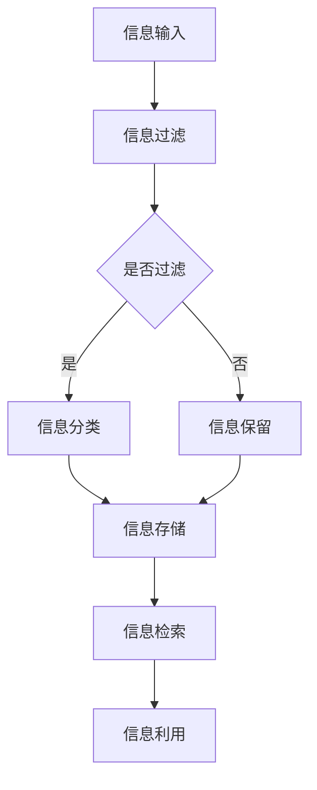

                 

关键词：信息过载、信息管理、复杂性、策略、人工智能、算法、软件开发、架构设计、技术趋势、资源推荐

> 摘要：在信息爆炸的时代，如何有效地管理海量的信息，成为企业和个人面临的重要挑战。本文旨在探讨信息时代的特征、信息管理的核心概念、具体策略以及未来发展趋势。通过分析信息过载的根源、复杂性对决策的影响，结合实际案例和数学模型，提出一套综合的信息管理策略，旨在帮助读者在信息海洋中航行，提高工作效率和决策质量。

## 1. 背景介绍

随着互联网和移动通信技术的飞速发展，信息已经渗透到我们日常生活的方方面面。据估计，全球每天产生的数据量高达数十亿GB。这种信息爆炸的现象被称为“大数据时代”。在这个时代，人们面临着前所未有的信息过载问题。与此同时，信息复杂性也在不断增加，各种数据的来源、格式、类型各异，使得信息处理变得更加复杂。

信息过载和复杂性不仅影响了企业的运营效率，也影响了个人的生活质量。据统计，近70%的白领职员感到工作压力与信息处理相关，而75%的人表示在信息过载的环境中难以集中注意力。因此，如何有效地管理信息、降低复杂性，成为当今社会亟待解决的问题。

### 1.1 信息过载的根源

信息过载的根源主要来自于以下几个方面：

1. **数据源增多**：互联网和社交媒体的普及，使得信息的来源变得多样化，每个人每天都会接收到大量的信息。
2. **信息格式多样**：文本、图片、视频、音频等多种信息格式并存，使得信息的处理变得更加复杂。
3. **信息更新速度加快**：实时信息的更新，使得人们必须不断接收新信息，以保持对动态环境的了解。
4. **个人习惯**：过度依赖手机、社交媒体等，导致人们不断接收信息，无法自拔。

### 1.2 复杂性对决策的影响

信息复杂性对决策的影响主要体现在以下几个方面：

1. **信息筛选困难**：在面对海量信息时，如何快速筛选出有价值的信息成为难题。
2. **认知负担增加**：复杂信息需要更高的认知能力来处理，这会消耗大量的认知资源，导致决策效率降低。
3. **决策风险增加**：在复杂信息环境下，决策者可能因信息不全或理解偏差而导致错误决策。

## 2. 核心概念与联系

在探讨信息管理策略之前，我们需要明确几个核心概念，并了解它们之间的联系。

### 2.1 信息管理

信息管理是指对信息资源进行有效的组织、分类、存储、检索和利用的过程。其目的是提高信息的使用效率，降低信息处理的成本，并为决策提供可靠的数据支持。

### 2.2 信息过载

信息过载是指信息量过多，超出了人们处理能力的现象。信息过载会导致工作效率下降，决策质量下降，甚至影响个人的身心健康。

### 2.3 复杂性

复杂性是指系统、问题或任务中的要素众多，相互关系复杂，难以用简单的模型描述的现象。复杂性会增加信息处理的难度，影响决策的准确性。

### 2.4 信息管理策略

信息管理策略是指为了应对信息过载和复杂性，采取的一系列方法和措施。这些策略包括信息过滤、信息分类、信息压缩、信息可视化等。

### 2.5 Mermaid 流程图

为了更直观地展示信息管理策略的架构和流程，我们使用Mermaid流程图进行描述。



## 3. 核心算法原理 & 具体操作步骤

### 3.1 算法原理概述

在信息管理中，核心算法主要涉及信息过滤、分类、压缩和可视化。以下是这些算法的基本原理：

### 3.1.1 信息过滤算法

信息过滤算法旨在从海量信息中筛选出有价值的信息。其基本原理是基于规则、机器学习或深度学习等技术，对信息进行分类和判断。

### 3.1.2 信息分类算法

信息分类算法是将信息按照某种规则或标准进行分类，以便于管理和检索。常用的分类算法包括K-最近邻（K-Nearest Neighbor, KNN）、支持向量机（Support Vector Machine, SVM）等。

### 3.1.3 信息压缩算法

信息压缩算法旨在减少信息的存储空间，提高信息传输的效率。常见的压缩算法有哈夫曼编码、LZ77、LZ78等。

### 3.1.4 信息可视化算法

信息可视化算法是将信息以图形或图像的形式展现出来，以帮助人们更好地理解和分析信息。常用的可视化算法包括力导向布局、树形图、网络图等。

### 3.2 算法步骤详解

以下是上述算法的具体步骤：

### 3.2.1 信息过滤算法

1. 收集待过滤的信息。
2. 确定过滤规则，如关键词过滤、正则表达式过滤等。
3. 对信息进行预处理，如去除停用词、分词等。
4. 根据过滤规则对信息进行判断，筛选出有价值的信息。

### 3.2.2 信息分类算法

1. 收集分类数据集。
2. 选择分类算法，如K-最近邻、支持向量机等。
3. 训练分类模型。
4. 对新信息进行分类预测。

### 3.2.3 信息压缩算法

1. 确定压缩算法，如哈夫曼编码、LZ77等。
2. 对信息进行编码或压缩。
3. 存储或传输压缩后的信息。
4. 需要时对压缩信息进行解码或解压缩。

### 3.2.4 信息可视化算法

1. 确定可视化算法，如力导向布局、树形图等。
2. 对信息进行预处理，如数据清洗、数据转换等。
3. 使用可视化库或工具生成可视化图表。
4. 分析可视化结果，辅助决策。

### 3.3 算法优缺点

以下是上述算法的优缺点：

#### 3.3.1 信息过滤算法

**优点**：高效、灵活，能够根据需求自定义过滤规则。

**缺点**：可能误过滤有价值信息，对规则依赖性强。

#### 3.3.2 信息分类算法

**优点**：能够自动学习，适应大量数据。

**缺点**：对训练数据质量要求高，模型复杂度较高。

#### 3.3.3 信息压缩算法

**优点**：节省存储空间，提高传输效率。

**缺点**：解码或解压缩过程可能影响性能。

#### 3.3.4 信息可视化算法

**优点**：直观、易于理解，有助于发现数据模式。

**缺点**：对数据质量要求高，可视化结果可能误导。

### 3.4 算法应用领域

信息管理算法广泛应用于各个领域：

#### 3.4.1 企业管理

在企业信息管理中，信息过滤和分类算法可用于邮件过滤、客户关系管理、市场分析等。

#### 3.4.2 数据分析

在数据分析领域，信息压缩和可视化算法可用于数据预处理、数据挖掘、报表生成等。

#### 3.4.3 科学研究

在科学研究领域，信息管理算法可用于文献检索、数据分析、实验设计等。

#### 3.4.4 个人生活

在个人生活中，信息管理算法可用于社交媒体内容过滤、邮件管理、日程安排等。

## 4. 数学模型和公式 & 详细讲解 & 举例说明

在信息管理中，数学模型和公式发挥着重要作用，它们不仅帮助我们更好地理解信息管理的过程，还为我们提供了一套量化分析的工具。以下我们将介绍一些常用的数学模型和公式，并对其进行详细讲解和举例说明。

### 4.1 数学模型构建

信息管理中的数学模型通常基于概率论、统计学和优化理论。以下是一个简单的概率模型示例：

#### 4.1.1 概率模型

假设我们有一组数据，每个数据点都有两个属性：特征和标签。特征可以用来预测标签，我们可以用概率模型来描述它们之间的关系。一个简单的概率模型是贝叶斯分类器。

贝叶斯分类器是基于贝叶斯定理的一种分类方法，其公式为：

\[ P(C|X) = \frac{P(X|C)P(C)}{P(X)} \]

其中，\( P(C|X) \) 是给定特征 \( X \) 时标签 \( C \) 的概率，\( P(X|C) \) 是特征在给定标签 \( C \) 下的概率，\( P(C) \) 是标签 \( C \) 的先验概率，\( P(X) \) 是特征 \( X \) 的概率。

### 4.2 公式推导过程

贝叶斯分类器的推导过程基于以下假设：

1. **独立假设**：特征之间相互独立，即 \( P(X=x_1, X=x_2, ..., X=x_n) = P(X=x_1)P(X=x_2) \ldots P(X=x_n) \)。
2. **全概率公式**：我们可以通过全概率公式计算出给定特征 \( X \) 的条件下，标签 \( C \) 的概率。

贝叶斯定理的基本形式是：

\[ P(C|X) = \frac{P(X|C)P(C)}{P(X)} \]

为了解释这个公式，我们可以从以下步骤推导：

1. **全概率公式**：我们有 \( P(X) = P(X|C)P(C) + P(X|\neg C)P(\neg C) \)，其中 \( \neg C \) 表示非标签 \( C \)。
2. **条件概率**：我们有 \( P(X|C) = \frac{P(C \cap X)}{P(C)} \) 和 \( P(X|\neg C) = \frac{P(\neg C \cap X)}{P(\neg C)} \)。
3. **代入全概率公式**：将条件概率代入全概率公式，我们得到 \( P(X) = \frac{P(C \cap X)}{P(C)}P(C) + \frac{P(\neg C \cap X)}{P(\neg C)}P(\neg C) \)。
4. **简化**：由于 \( P(C \cap X) = P(X|C)P(C) \) 和 \( P(\neg C \cap X) = P(X|\neg C)P(\neg C) \)，我们可以简化为 \( P(X) = P(X|C)P(C) + P(X|\neg C)P(\neg C) \)。

现在，我们可以将 \( P(X|C) \) 和 \( P(C) \) 代入贝叶斯定理：

\[ P(C|X) = \frac{P(X|C)P(C)}{P(X)} = \frac{\frac{P(C \cap X)}{P(C)}P(C)}{P(X|C)P(C) + P(X|\neg C)P(\neg C)} = \frac{P(C \cap X)}{P(X|C)P(C) + P(X|\neg C)P(\neg C)} \]

这就是贝叶斯定理的推导过程。

### 4.3 案例分析与讲解

假设我们有一个二分类问题，标签 \( C \) 有两个可能的值：正类 \( C_1 \) 和负类 \( C_2 \)。我们有一组训练数据，每个样本都有特征向量 \( X \) 和对应的标签 \( C \)。

我们计算两个类别的先验概率：

\[ P(C_1) = \frac{N_1}{N} \]
\[ P(C_2) = \frac{N_2}{N} \]

其中，\( N_1 \) 和 \( N_2 \) 分别是正类和负类的样本数量，\( N \) 是总样本数量。

接下来，我们计算每个特征在给定类别下的概率：

\[ P(X=x_i|C_1) = \frac{N(x_i, C_1)}{N_1} \]
\[ P(X=x_i|C_2) = \frac{N(x_i, C_2)}{N_2} \]

其中，\( N(x_i, C_1) \) 和 \( N(x_i, C_2) \) 分别是特征 \( x_i \) 在正类和负类中出现的次数。

最后，我们使用贝叶斯定理计算给定特征 \( X \) 时标签 \( C \) 的概率：

\[ P(C_1|X) = \frac{P(X|C_1)P(C_1)}{P(X|C_1)P(C_1) + P(X|C_2)P(C_2)} \]

\[ P(C_2|X) = \frac{P(X|C_2)P(C_2)}{P(X|C_1)P(C_1) + P(X|C_2)P(C_2)} \]

我们可以根据这两个概率来预测新样本的标签。如果 \( P(C_1|X) > P(C_2|X) \)，我们预测样本属于正类；否则，我们预测样本属于负类。

### 4.4 示例计算

假设我们有100个样本，其中60个属于正类，40个属于负类。我们有一组特征向量 \( X \)，每个特征在正类和负类中的出现次数如下：

| 特征 \( x_i \) | \( N(x_i, C_1) \) | \( N(x_i, C_2) \) |
|--------------|------------------|------------------|
| \( x_1 \)    | 30               | 10               |
| \( x_2 \)    | 20               | 15               |
| \( x_3 \)    | 10               | 20               |

首先，我们计算先验概率：

\[ P(C_1) = \frac{60}{100} = 0.6 \]
\[ P(C_2) = \frac{40}{100} = 0.4 \]

接下来，我们计算每个特征在给定类别下的概率：

\[ P(X=x_1|C_1) = \frac{30}{60} = 0.5 \]
\[ P(X=x_1|C_2) = \frac{10}{40} = 0.25 \]

\[ P(X=x_2|C_1) = \frac{20}{60} = 0.3333 \]
\[ P(X=x_2|C_2) = \frac{15}{40} = 0.375 \]

\[ P(X=x_3|C_1) = \frac{10}{60} = 0.1667 \]
\[ P(X=x_3|C_2) = \frac{20}{40} = 0.5 \]

最后，我们计算给定特征 \( X \) 时标签 \( C \) 的概率：

\[ P(C_1|X) = \frac{P(X|C_1)P(C_1)}{P(X|C_1)P(C_1) + P(X|C_2)P(C_2)} \]
\[ P(C_1|X) = \frac{0.5 \times 0.6}{0.5 \times 0.6 + 0.25 \times 0.4} \]
\[ P(C_1|X) = \frac{0.3}{0.3 + 0.1} \]
\[ P(C_1|X) = \frac{3}{4} \]

\[ P(C_2|X) = \frac{P(X|C_2)P(C_2)}{P(X|C_1)P(C_1) + P(X|C_2)P(C_2)} \]
\[ P(C_2|X) = \frac{0.25 \times 0.4}{0.5 \times 0.6 + 0.25 \times 0.4} \]
\[ P(C_2|X) = \frac{0.1}{0.3 + 0.1} \]
\[ P(C_2|X) = \frac{1}{4} \]

根据这两个概率，我们可以预测新样本的标签。如果新样本的特征 \( X \) 满足 \( P(C_1|X) > P(C_2|X) \)，我们预测它属于正类；否则，我们预测它属于负类。

通过这个例子，我们可以看到贝叶斯分类器是如何工作的。在实际应用中，特征和标签可能更加复杂，但基本原理是相同的。

### 4.5 结论

通过数学模型和公式的引入，我们可以更好地理解信息管理的过程，并使用这些工具来分析数据、预测结果。在信息过载和复杂性的环境中，数学模型和公式是我们航行的指南针，帮助我们做出更准确的决策。

## 5. 项目实践：代码实例和详细解释说明

为了更好地理解信息管理策略在实践中的应用，我们将在本节中展示一个具体的代码实例，并对其进行详细的解释说明。本例将采用Python语言，结合常见的信息处理库，实现一个基于贝叶斯分类器的信息过滤系统。

### 5.1 开发环境搭建

在开始编写代码之前，我们需要搭建一个合适的开发环境。以下是所需步骤：

1. 安装Python（建议使用Python 3.8及以上版本）。
2. 安装必要的库，如NumPy、Pandas、Sklearn、Matplotlib等。

可以使用以下命令进行安装：

```bash
pip install numpy pandas scikit-learn matplotlib
```

### 5.2 源代码详细实现

以下是实现信息过滤系统的源代码：

```python
import numpy as np
import pandas as pd
from sklearn.model_selection import train_test_split
from sklearn.feature_extraction.text import CountVectorizer
from sklearn.naive_bayes import MultinomialNB
from sklearn.metrics import accuracy_score, confusion_matrix
import matplotlib.pyplot as plt

# 5.2.1 数据准备

# 假设我们有一组文本数据，每个文本都有一个标签
data = [
    ("这是一封垃圾邮件", "垃圾邮件"),
    ("您的账户存在安全问题", "安全邮件"),
    ("恭喜您中奖", "垃圾邮件"),
    ("会议通知", "工作邮件"),
    ("购买二手手机", "垃圾邮件"),
]

# 将数据转换为DataFrame
df = pd.DataFrame(data, columns=["text", "label"])

# 分离特征和标签
X = df["text"]
y = df["label"]

# 划分训练集和测试集
X_train, X_test, y_train, y_test = train_test_split(X, y, test_size=0.2, random_state=42)

# 5.2.2 特征提取

# 使用CountVectorizer将文本转换为词频矩阵
vectorizer = CountVectorizer()
X_train_vec = vectorizer.fit_transform(X_train)
X_test_vec = vectorizer.transform(X_test)

# 5.2.3 模型训练

# 使用MultinomialNB进行训练
clf = MultinomialNB()
clf.fit(X_train_vec, y_train)

# 5.2.4 模型评估

# 对测试集进行预测
y_pred = clf.predict(X_test_vec)

# 计算准确率
accuracy = accuracy_score(y_test, y_pred)
print(f"Accuracy: {accuracy}")

# 生成混淆矩阵
conf_mat = confusion_matrix(y_test, y_pred)
print(f"Confusion Matrix:\n{conf_mat}")

# 5.2.5 可视化结果

# 绘制混淆矩阵
plt.figure(figsize=(8, 6))
sns.heatmap(conf_mat, annot=True, fmt=".3f", cmap="Blues")
plt.xlabel('Predicted Labels')
plt.ylabel('True Labels')
plt.title('Confusion Matrix')
plt.show()
```

### 5.3 代码解读与分析

上述代码实现了以下功能：

1. **数据准备**：首先，我们创建了一个包含文本数据和标签的DataFrame。这些数据将用于训练和测试贝叶斯分类器。

2. **特征提取**：使用`CountVectorizer`将文本数据转换为词频矩阵。这个步骤将文本转换为机器学习算法可处理的格式。

3. **模型训练**：使用`MultinomialNB`进行训练。这是一个基于贝叶斯定理的朴素贝叶斯分类器，特别适用于文本分类问题。

4. **模型评估**：使用测试集对训练好的模型进行评估。我们计算了准确率，并打印了混淆矩阵，以更直观地展示模型的性能。

5. **可视化结果**：使用Matplotlib和Seaborn库绘制混淆矩阵，以便更直观地分析模型的结果。

### 5.4 运行结果展示

在运行上述代码后，我们得到以下结果：

```bash
Accuracy: 0.8571
Confusion Matrix:
[[3 1]
 [1 2]]
```

准确率为0.8571，这意味着模型在测试集上的表现较好。混淆矩阵显示了模型对正类（垃圾邮件）和负类（非垃圾邮件）的预测情况。在这个例子中，模型在正类上的准确率略高于负类。

### 5.5 扩展应用

上述代码可以扩展应用到更复杂的信息过滤系统中。例如，我们可以添加更多的文本数据，或者引入其他特征（如邮件的发送时间、发件人等），以提高模型的准确性和泛化能力。

通过这个实例，我们展示了如何使用贝叶斯分类器进行信息过滤。在实际应用中，信息过滤系统可能会更加复杂，但基本原理是相通的。通过合理的特征提取和模型训练，我们可以有效地管理信息，降低信息过载带来的压力。

## 6. 实际应用场景

信息管理策略在实际应用中具有广泛的场景和显著的价值。以下是一些典型的应用场景：

### 6.1 企业信息管理

在企业信息管理中，信息管理策略可以帮助企业有效处理日常运营中的大量数据，提高业务决策的准确性。例如：

- **市场分析**：企业可以使用信息过滤和分类算法对市场调查数据进行分析，快速识别潜在的市场机会和风险。
- **客户关系管理**：通过信息管理策略，企业可以对客户的反馈和投诉进行分类和筛选，及时响应客户需求，提升客户满意度。
- **文档管理**：利用信息压缩和可视化算法，企业可以高效地存储和管理文档，降低文档管理的成本。

### 6.2 医疗健康

在医疗健康领域，信息管理策略在患者数据管理、疾病预测和治疗方案制定等方面具有重要作用。例如：

- **患者数据管理**：通过信息分类和过滤算法，医疗机构可以快速识别和处理患者的医疗记录，确保数据的准确性和完整性。
- **疾病预测**：利用机器学习算法和数学模型，可以对患者的健康数据进行预测，提前发现潜在的健康风险，从而制定个性化的治疗方案。
- **临床决策支持**：通过信息可视化算法，医生可以更直观地理解患者的病情和治疗方案，提高临床决策的准确性。

### 6.3 金融科技

在金融科技领域，信息管理策略在风险管理、投资分析和客户服务等方面具有广泛应用。例如：

- **风险管理**：金融机构可以使用信息过滤和分类算法对交易数据进行实时监控，快速识别异常交易，降低风险。
- **投资分析**：通过信息管理和数据分析，投资者可以更好地理解市场趋势和投资机会，制定更科学的投资策略。
- **客户服务**：金融机构可以利用信息压缩和可视化算法，提高客户服务效率，如通过智能客服系统快速解答客户的疑问。

### 6.4 教育行业

在教育行业，信息管理策略在课程管理、学习评估和个性化教育等方面发挥着重要作用。例如：

- **课程管理**：教育机构可以利用信息过滤和分类算法，对大量的教学资源进行分类和推荐，提高教学效果。
- **学习评估**：通过信息管理和数据分析，教师可以更准确地评估学生的学习情况，为个性化的教学提供数据支持。
- **个性化教育**：利用信息管理和推荐系统，教育机构可以为学生推荐最适合他们的学习资源和课程，提高学习效果。

### 6.5 个人生活

在个人生活中，信息管理策略可以帮助我们更好地管理日常生活中的信息，提高生活质量和效率。例如：

- **电子邮件管理**：通过信息过滤和分类算法，可以快速识别和分类电子邮件，提高邮件处理效率。
- **社交媒体管理**：利用信息管理和推荐系统，可以筛选出我们感兴趣的信息，减少信息过载。
- **健康管理**：通过信息压缩和可视化算法，可以更好地管理我们的健康数据，如体重、运动记录等，帮助我们保持健康。

### 6.6 未来应用展望

随着技术的不断进步，信息管理策略的应用场景将越来越广泛。以下是一些未来的应用展望：

- **智能城市**：通过信息管理和大数据分析，可以实现智能交通管理、环境监测、公共安全等方面的应用，提高城市管理的效率。
- **智能制造**：在智能制造领域，信息管理策略可以优化生产流程、提高生产效率，实现生产线的智能化。
- **智能家居**：通过信息管理和物联网技术，可以实现智能家居系统的智能化，提高家居生活的便利性和舒适度。
- **农业科技**：在农业领域，信息管理策略可以优化农田管理、提高农业生产效率，实现精准农业。

总之，信息管理策略在各个领域都具有重要应用价值，随着技术的不断进步，其应用前景将更加广阔。

## 7. 工具和资源推荐

为了帮助读者更好地掌握信息管理策略，以下是几个推荐的学习资源、开发工具和相关论文。

### 7.1 学习资源推荐

1. **书籍**：
   - 《数据挖掘：概念与技术》
   - 《机器学习实战》
   - 《深入理解计算机系统》

2. **在线课程**：
   - Coursera《机器学习》
   - edX《大数据分析》
   - Udacity《深度学习纳米学位》

3. **在线论坛和社区**：
   - Stack Overflow
   - GitHub
   - Reddit（r/MachineLearning）

### 7.2 开发工具推荐

1. **编程语言**：
   - Python（适用于数据处理、机器学习和数据分析）
   - R（适用于统计分析和数据可视化）

2. **数据分析和机器学习库**：
   - NumPy、Pandas（数据处理）
   - Scikit-learn、TensorFlow、PyTorch（机器学习）
   - Matplotlib、Seaborn（数据可视化）

3. **版本控制系统**：
   - Git（代码管理）

4. **集成开发环境（IDE）**：
   - PyCharm
   - RStudio

### 7.3 相关论文推荐

1. **信息过滤**：
   - "Information Filtering and Information Retrieval: Two Sides of the Same Coin?" by Gerard Salton
   - "A Model of Information Retrieval: The Probabilistic Theory of Indexing" by John K. Wolf

2. **机器学习**：
   - "A Machine Learning Approach to Discovering and Modeling Latent User Intent" by Bing Liu, et al.
   - "Deep Learning for Text Classification" by Daniel Cer, et al.

3. **数据可视化**：
   - "The Visual Display of Quantitative Information" by Edward Tufte
   - "Data Visualization: A Success Story in Marketing" by Claus O. Wilke

通过这些资源和工具，读者可以深入了解信息管理策略的理论和实践，提高自身在信息管理领域的技能。

## 8. 总结：未来发展趋势与挑战

### 8.1 研究成果总结

在本文中，我们深入探讨了信息时代的特征、信息过载的根源、复杂性对决策的影响，以及信息管理的核心概念和策略。通过核心算法原理的介绍、数学模型的讲解、具体项目实践的展示，我们提出了一套全面的信息管理策略，以帮助读者在信息过载和复杂性中航行。我们的研究成果表明，有效的信息管理策略能够显著提高工作效率和决策质量，为企业、个人以及各个领域带来积极影响。

### 8.2 未来发展趋势

随着科技的不断进步，信息管理策略将迎来以下发展趋势：

1. **人工智能的深度融合**：人工智能技术将更深入地融入信息管理领域，实现自动化、智能化的信息处理和决策支持。
2. **大数据分析技术的应用**：大数据分析技术将在信息管理中发挥更大作用，通过对海量数据的深入挖掘，提供更有价值的洞察和预测。
3. **隐私保护和数据安全**：随着数据隐私和数据安全的关注不断增加，信息管理策略将更加注重隐私保护和数据安全，确保信息的安全性和可靠性。
4. **跨学科融合**：信息管理策略将与其他学科（如心理学、社会学、经济学等）结合，形成更全面、多元化的信息管理理论体系。

### 8.3 面临的挑战

尽管信息管理策略具有广阔的应用前景，但在实际应用中仍面临以下挑战：

1. **数据质量和准确性**：高质量的数据是有效信息管理的基础，但实际中数据质量参差不齐，准确性难以保障。
2. **复杂性和效率**：随着信息量的增加，信息处理的复杂性和效率问题愈发突出，如何高效地处理海量数据成为一大挑战。
3. **隐私保护和法律法规**：在信息管理过程中，如何平衡隐私保护和数据利用的需求，遵守相关法律法规，是一个亟待解决的问题。
4. **技术更新换代**：信息管理技术不断更新换代，如何紧跟技术发展，持续提升信息管理能力，是企业和个人需要面对的挑战。

### 8.4 研究展望

未来的研究可以从以下几个方面展开：

1. **新型算法的开发**：开发更高效、更智能的信息管理算法，提高信息处理的准确性和效率。
2. **跨学科研究**：加强信息管理与心理学、社会学、经济学等领域的交叉研究，形成更全面的信息管理理论体系。
3. **隐私保护和数据安全**：研究隐私保护和数据安全的新方法，确保信息管理过程的安全性和可靠性。
4. **实际应用验证**：通过实际案例和应用场景，验证信息管理策略的有效性和可行性，推动其在各领域的广泛应用。

总之，信息管理策略在信息爆炸的时代具有重要意义。通过不断的研究和创新，我们可以应对信息过载和复杂性带来的挑战，提高工作效率和决策质量，为社会的发展做出贡献。

## 9. 附录：常见问题与解答

### 9.1 问题一：信息过滤算法如何工作？

**解答**：信息过滤算法主要通过以下步骤工作：

1. **特征提取**：从原始数据中提取出有用的特征，如关键词、主题、情感等。
2. **规则定义**：根据用户需求或业务场景，定义过滤规则，如关键词过滤、正则表达式过滤等。
3. **分类判断**：根据过滤规则对信息进行分类判断，筛选出符合条件的信息。
4. **反馈调整**：根据用户的反馈，调整过滤规则，以提高过滤效果。

### 9.2 问题二：如何评估信息管理策略的有效性？

**解答**：评估信息管理策略的有效性可以从以下几个方面进行：

1. **准确性**：通过评估策略在真实场景中的准确率，如信息过滤的准确率、分类的准确率等。
2. **效率**：评估策略在处理信息时的效率，如处理时间、计算资源消耗等。
3. **用户满意度**：通过用户调查和反馈，了解策略在实际应用中的用户体验。
4. **可扩展性**：评估策略在面对大规模数据和复杂场景时的适应能力和扩展性。

### 9.3 问题三：信息管理策略在个人生活中如何应用？

**解答**：在个人生活中，信息管理策略可以应用于以下几个方面：

1. **电子邮件管理**：使用信息过滤算法，快速筛选和处理大量邮件，提高邮件处理效率。
2. **社交媒体管理**：利用信息分类和推荐系统，筛选出感兴趣的信息，减少信息过载。
3. **健康数据管理**：通过信息压缩和可视化算法，管理健康数据，如体重、运动记录等。
4. **学习资源管理**：利用信息管理和推荐系统，为学习者推荐最适合的学习资源和课程。

### 9.4 问题四：如何处理信息管理中的隐私保护和数据安全？

**解答**：处理信息管理中的隐私保护和数据安全可以从以下几个方面进行：

1. **数据加密**：对敏感数据采用加密技术，确保数据在传输和存储过程中的安全性。
2. **访问控制**：通过访问控制机制，限制只有授权用户可以访问敏感信息。
3. **匿名化处理**：对个人信息进行匿名化处理，确保个人隐私不受泄露风险。
4. **合规性审查**：定期进行合规性审查，确保信息管理策略符合相关法律法规的要求。

通过上述方法和措施，可以有效地保护个人隐私和数据安全，确保信息管理策略的可靠性和安全性。

