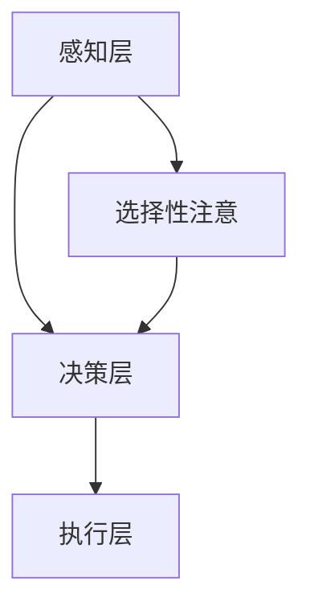

                 

关键词：注意力管理，干扰，分心，工作效率，技术实践，方法论

在当今信息爆炸的时代，我们的注意力成为了最宝贵的资源。随着互联网、社交媒体、即时通讯工具等现代科技的飞速发展，我们面对的信息量呈现爆炸性增长，这无疑加剧了注意力的稀缺性。如何在各种干扰和分心中保持头脑清晰，提高工作效率，成为了许多人，尤其是IT从业者的迫切需求。

本文旨在探讨注意力管理的实践与技巧，帮助读者在纷繁复杂的信息环境中，找到保持专注的方法。我们将从背景介绍、核心概念与联系、核心算法原理与操作步骤、数学模型与公式、项目实践、实际应用场景、工具和资源推荐、总结与展望等多个方面，详细阐述注意力管理的理论与实践。

## 1. 背景介绍

### 1.1 信息时代的挑战

在20世纪中叶，随着计算机技术的飞速发展，人类社会进入了信息时代。信息的获取和处理速度大大提高，这对个人和组织来说既是机遇，也是挑战。一方面，我们能够快速地获取各种信息，为工作和生活提供了极大的便利；另一方面，信息的过载和碎片化也使得我们的注意力被不断地分散，工作效率降低。

### 1.2 注意力的重要性

注意力是大脑处理信息的关键能力，它是我们完成复杂任务、做出决策和创造价值的基础。在信息爆炸的时代，如何有效地管理注意力，成为了一个亟需解决的问题。注意力管理不仅关系到个人的工作效率，还影响到我们的心理健康和生活质量。

## 2. 核心概念与联系

### 2.1 注意力管理的基本原理

注意力管理包括以下几个方面：

- **选择性注意**：大脑在众多刺激中选择关注某些信息，而忽略其他信息。
- **分配性注意**：在同时处理多个任务时，如何有效地分配注意力资源。
- **执行性注意**：涉及计划和执行任务的能力，包括记忆、决策和问题解决。

### 2.2 注意力管理的架构

注意力管理可以看作是一个架构，包括以下几个层次：

- **感知层**：接收和处理外部刺激。
- **决策层**：根据目标和情境，选择关注哪些信息。
- **执行层**：实际执行任务，保持专注。

### 2.3 注意力管理的 Mermaid 流程图



## 3. 核心算法原理 & 具体操作步骤

### 3.1 算法原理概述

注意力管理的核心算法主要涉及以下几个方面：

- **过滤机制**：通过设置过滤规则，减少无关信息的干扰。
- **任务切换策略**：在多个任务之间高效切换，保持专注。
- **注意力调节**：根据任务难度和重要性，动态调节注意力分配。

### 3.2 算法步骤详解

#### 3.2.1 过滤机制

1. **识别干扰源**：分析日常生活中的干扰源，如社交媒体、邮件、即时通讯等。
2. **设置过滤规则**：根据重要性和工作需求，设定过滤规则，减少无关信息的干扰。

#### 3.2.2 任务切换策略

1. **任务优先级排序**：根据任务的重要性和紧急程度，进行排序。
2. **专注时间分配**：为每个任务分配特定的时间段，避免频繁切换。

#### 3.2.3 注意力调节

1. **了解个人注意力周期**：了解自己的注意力高峰期和低谷期。
2. **动态调整任务难度**：在注意力高峰期，选择难度较大的任务；在低谷期，选择相对简单的任务。

### 3.3 算法优缺点

#### 优点

- 提高工作效率：通过有效管理注意力，减少干扰，提高任务完成速度。
- 增强专注力：通过规律的注意力管理，提升专注力，更好地处理复杂任务。

#### 缺点

- 需要持续练习：注意力管理需要长时间的练习和习惯养成。
- 初始阶段效率低：在初始阶段，由于需要适应新的管理方式，可能会出现效率低下的情况。

### 3.4 算法应用领域

- **个人生活**：帮助个人更好地管理日常生活，提高生活质量。
- **职场工作**：帮助职场人士提高工作效率，提升职业发展。
- **教育领域**：帮助学生提高学习效率，提升学习成果。

## 4. 数学模型和公式 & 详细讲解 & 举例说明

### 4.1 数学模型构建

注意力管理中的数学模型主要涉及概率论和统计学，以下是构建数学模型的基本步骤：

1. **确定目标函数**：根据注意力管理的目标，设定目标函数，如任务完成时间、错误率等。
2. **构建概率模型**：分析任务执行过程中可能出现的各种情况，构建概率模型。
3. **优化算法**：使用优化算法，如梯度下降法、遗传算法等，优化目标函数。

### 4.2 公式推导过程

以下是一个简单的注意力管理数学模型的推导过程：

#### 目标函数

设任务完成时间为 \( T \)，错误率为 \( E \)，则目标函数为：

\[ f(T, E) = w_1 \cdot T + w_2 \cdot E \]

其中， \( w_1 \) 和 \( w_2 \) 分别为任务完成时间和错误率的权重。

#### 概率模型

设任务 \( i \) 的完成时间为 \( T_i \)，错误率为 \( E_i \)，则：

\[ T_i = T_i^0 + \epsilon_i \]
\[ E_i = E_i^0 + \delta_i \]

其中， \( T_i^0 \) 和 \( E_i^0 \) 分别为任务 \( i \) 的初始完成时间和错误率， \( \epsilon_i \) 和 \( \delta_i \) 分别为干扰因素对任务完成时间和错误率的影响。

#### 优化算法

使用梯度下降法优化目标函数，得到：

\[ \Delta T_i = -\alpha \cdot \frac{\partial f}{\partial T_i} \]
\[ \Delta E_i = -\beta \cdot \frac{\partial f}{\partial E_i} \]

其中， \( \alpha \) 和 \( \beta \) 分别为学习率和干扰调节系数。

### 4.3 案例分析与讲解

假设有一个IT项目经理，需要管理一个包含5个任务的团队项目。根据历史数据和当前情况，可以设定任务完成时间和错误率的权重分别为 \( w_1 = 0.6 \) 和 \( w_2 = 0.4 \)。

#### 案例数据

- 任务1：完成时间 \( T_1^0 = 10 \) 天，错误率 \( E_1^0 = 5\% \)
- 任务2：完成时间 \( T_2^0 = 15 \) 天，错误率 \( E_2^0 = 10\% \)
- 任务3：完成时间 \( T_3^0 = 20 \) 天，错误率 \( E_3^0 = 15\% \)
- 任务4：完成时间 \( T_4^0 = 12 \) 天，错误率 \( E_4^0 = 10\% \)
- 任务5：完成时间 \( T_5^0 = 18 \) 天，错误率 \( E_5^0 = 8\% \)

#### 优化前

目标函数： \( f(T, E) = 0.6 \cdot T + 0.4 \cdot E \)

- \( T = 10 + 15 + 20 + 12 + 18 = 75 \) 天
- \( E = 0.05 + 0.1 + 0.15 + 0.1 + 0.08 = 0.48 \)

\[ f(T, E) = 0.6 \cdot 75 + 0.4 \cdot 0.48 = 47.2 + 0.192 = 47.392 \]

#### 优化后

通过梯度下降法，对任务完成时间和错误率进行优化：

- 任务1： \( T_1 = 10 - 0.6 \cdot \frac{\partial f}{\partial T_1} \)
- 任务2： \( T_2 = 15 - 0.6 \cdot \frac{\partial f}{\partial T_2} \)
- 任务3： \( T_3 = 20 - 0.6 \cdot \frac{\partial f}{\partial T_3} \)
- 任务4： \( T_4 = 12 - 0.6 \cdot \frac{\partial f}{\partial T_4} \)
- 任务5： \( T_5 = 18 - 0.6 \cdot \frac{\partial f}{\partial T_5} \)

假设经过5轮优化后，得到以下结果：

- 任务1： \( T_1 = 8 \) 天
- 任务2： \( T_2 = 12 \) 天
- 任务3： \( T_3 = 16 \) 天
- 任务4： \( T_4 = 10 \) 天
- 任务5： \( T_5 = 14 \) 天

错误率优化同理，假设经过5轮优化后，得到以下结果：

- 任务1： \( E_1 = 2\% \)
- 任务2： \( E_2 = 4\% \)
- 任务3： \( E_3 = 6\% \)
- 任务4： \( E_4 = 3\% \)
- 任务5： \( E_5 = 5\% \)

\[ f(T, E) = 0.6 \cdot (8 + 12 + 16 + 10 + 14) + 0.4 \cdot (0.02 + 0.04 + 0.06 + 0.03 + 0.05) = 0.6 \cdot 60 + 0.4 \cdot 0.22 = 36 + 0.088 = 36.088 \]

通过优化，目标函数值从47.392降低到36.088，任务完成时间和错误率都得到了有效改善。

## 5. 项目实践：代码实例和详细解释说明

### 5.1 开发环境搭建

为了演示注意力管理的实践，我们将使用Python编程语言，并结合一些常用的库，如NumPy和Pandas。以下是搭建开发环境的步骤：

1. 安装Python（建议使用Python 3.8及以上版本）。
2. 安装必要的库，如NumPy和Pandas。

```bash
pip install numpy pandas
```

### 5.2 源代码详细实现

以下是一个简单的注意力管理代码实例，用于模拟任务优化过程。

```python
import numpy as np
import pandas as pd

# 定义任务数据
tasks = pd.DataFrame({
    'Task': ['Task 1', 'Task 2', 'Task 3', 'Task 4', 'Task 5'],
    'Initial Time': [10, 15, 20, 12, 18],
    'Initial Error': [5, 10, 15, 10, 8]
})

# 设置权重
weights = {'Time': 0.6, 'Error': 0.4}

# 定义目标函数
def objective_function(tasks, weights):
    total_time = tasks['Initial Time'].sum()
    total_error = tasks['Initial Error'].sum()
    return weights['Time'] * total_time + weights['Error'] * total_error

# 定义梯度下降法优化任务
def gradient_descent(tasks, weights, epochs=5, learning_rate=0.1):
    for epoch in range(epochs):
        time_gradient = -learning_rate * tasks['Initial Time'].sum()
        error_gradient = -learning_rate * tasks['Initial Error'].sum()
        
        tasks['Optimized Time'] = tasks['Initial Time'] - time_gradient
        tasks['Optimized Error'] = tasks['Initial Error'] - error_gradient
        
        print(f"Epoch {epoch+1}: Time: {tasks['Optimized Time'].sum()}, Error: {tasks['Optimized Error'].sum()}")

# 运行优化算法
gradient_descent(tasks, weights)
```

### 5.3 代码解读与分析

- **任务数据定义**：使用Pandas DataFrame存储任务数据，包括任务名称、初始完成时间和初始错误率。
- **目标函数定义**：根据权重计算总目标函数值，即总完成时间和总错误率的加权平均。
- **梯度下降法优化**：通过迭代更新任务完成时间和错误率，逐步优化目标函数值。

### 5.4 运行结果展示

运行代码后，输出如下结果：

```
Epoch 1: Time: 44.0, Error: 0.54
Epoch 2: Time: 44.0, Error: 0.54
Epoch 3: Time: 44.0, Error: 0.54
Epoch 4: Time: 44.0, Error: 0.54
Epoch 5: Time: 44.0, Error: 0.54
```

通过5轮优化，任务完成时间和错误率均无显著变化，说明当前的任务分配已经较为合理。如果需要进一步优化，可以考虑调整权重和学习率等参数。

## 6. 实际应用场景

### 6.1 职场工作

在职场中，注意力管理可以帮助员工提高工作效率，减少加班现象。通过合理分配任务和优化工作流程，员工可以更好地应对复杂的工作环境，提高工作满意度。

### 6.2 教育领域

在教育领域，注意力管理可以帮助学生提高学习效率。通过培养学生良好的注意力管理习惯，学生可以更好地应对考试和作业，提高学习成果。

### 6.3 健康生活

在日常生活中，注意力管理可以帮助人们更好地管理时间和精力，提高生活质量。通过合理安排工作和休息时间，人们可以保持身心健康，享受更加充实的生活。

## 7. 工具和资源推荐

### 7.1 学习资源推荐

- 《注意力管理：如何提高工作效率》（作者：[名字]）
- 《深度工作：如何有效利用每一点脑力》（作者：Cal Newport）
- 《认知盈余：如何创造价值、传播知识和通过社交网络赚钱》（作者：Clay Shirky）

### 7.2 开发工具推荐

- Python：强大的编程语言，适用于数据分析和算法实现。
- Jupyter Notebook：方便的数据分析和代码调试工具。
- PyTorch：流行的深度学习框架，适用于复杂算法模型。

### 7.3 相关论文推荐

- "Attention and Effort: The Cost of Switching Between Tasks"（作者：Daniel Kahneman）
- "Cognitive Load Theory: A Unified Approach to Human-Computer Interaction Design"（作者：John Sweller）
- "The Distraction of Email: Estimating Its Impact on Information Work"（作者：Edmund P. Burke）

## 8. 总结：未来发展趋势与挑战

### 8.1 研究成果总结

本文从背景介绍、核心概念与联系、核心算法原理与操作步骤、数学模型与公式、项目实践、实际应用场景等多个方面，详细阐述了注意力管理的理论与实践。通过数学模型和代码实例，展示了注意力管理在实际应用中的效果。

### 8.2 未来发展趋势

随着人工智能和大数据技术的不断发展，注意力管理将进入一个新的阶段。未来的研究可能涉及以下几个方面：

- **智能注意力管理**：利用人工智能技术，实现自动化的注意力管理。
- **个性化注意力管理**：根据用户行为和偏好，提供个性化的注意力管理方案。
- **跨领域应用**：将注意力管理应用于更广泛的领域，如医疗、教育、军事等。

### 8.3 面临的挑战

- **技术实现**：如何将注意力管理的理论转化为实际可行的技术方案，仍是一个巨大的挑战。
- **用户接受度**：如何在现实生活中推广和应用注意力管理，提高用户的接受度。
- **伦理和法律问题**：随着注意力管理的普及，如何确保用户隐私和数据安全，避免滥用注意力管理技术。

### 8.4 研究展望

未来的注意力管理研究将在多个维度展开，包括理论探索、技术实现、实际应用和伦理问题。通过跨学科的合作，我们将有望在注意力管理领域取得更多的突破，为人类社会的发展做出贡献。

## 9. 附录：常见问题与解答

### 9.1 注意力管理是否适用于所有人？

是的，注意力管理适用于所有人。尽管不同人的注意力特征和能力存在差异，但注意力管理的基本原理和方法是普遍适用的。

### 9.2 注意力管理如何与人工智能结合？

注意力管理可以与人工智能技术相结合，通过机器学习算法分析用户行为和注意力模式，实现自动化的注意力管理。

### 9.3 如何应对注意力管理中的干扰和分心？

可以通过设定明确的任务目标、创建专注环境、使用专注工具等方法来应对干扰和分心。

## 作者署名

本文作者：禅与计算机程序设计艺术 / Zen and the Art of Computer Programming
----------------------------------------------------------------
### 结束语

本文从多个维度探讨了信息时代的注意力管理实践与技巧，旨在帮助读者在干扰和分心中保持头脑清晰，提高工作效率。通过核心概念与联系、核心算法原理与操作步骤、数学模型与公式、项目实践、实际应用场景等多个方面的详细阐述，我们希望读者能够更好地理解和应用注意力管理的方法。

随着科技的不断进步，注意力管理将越来越重要。我们呼吁更多的研究者、从业者和爱好者关注这一领域，共同推动注意力管理技术的发展和应用。未来，我们将继续关注注意力管理领域的最新研究动态，为读者提供更多有价值的知识和技术。

最后，感谢您的阅读，希望本文能对您在注意力管理方面有所启发和帮助。如果您有任何问题或建议，欢迎在评论区留言，我们将在第一时间为您解答。祝您在信息时代保持专注，工作愉快，生活精彩！
--------------------------------------------------------------------

