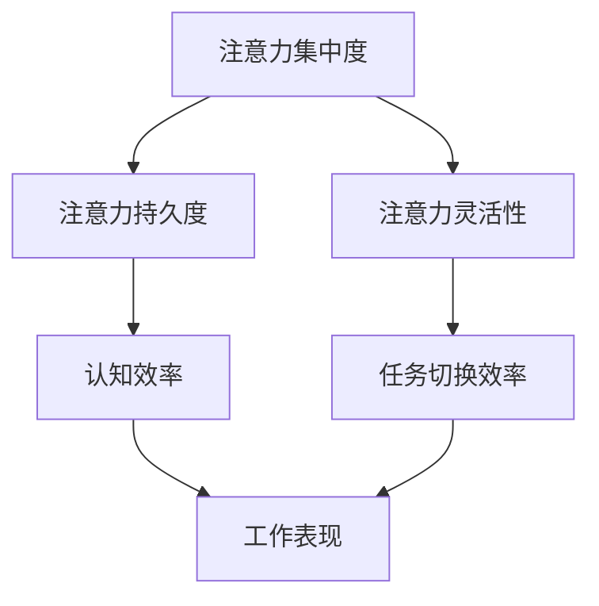

                 

 在当今信息爆炸的时代，我们的注意力正面临前所未有的挑战。社交媒体、即时通讯、电子邮件以及各种通知不断抢占我们的注意力，使得我们难以集中精力完成一项任务。这种持续的干扰和分心不仅影响工作效率，还可能导致焦虑和压力。本文将探讨注意力管理的实践与策略，帮助我们在干扰和分心中保持头脑清晰。

## 1. 背景介绍

### 信息时代的注意力危机

随着互联网和智能设备的普及，我们每天都会接触到大量的信息。据统计，成年人每天平均花费在屏幕上的时间超过7个小时。这种持续的信息轰炸使得我们的注意力变得更加稀缺，而我们的大脑却难以适应这种高速的信息处理模式。注意力危机不仅影响了我们的工作效率，还对心理健康产生负面影响。

### 干扰与分心

干扰和分心是注意力危机的两个主要方面。干扰是指外界的刺激或事件打断了我们的任务执行，而分心则是指我们的注意力被其他事物吸引走，导致无法专注于当前任务。研究表明，频繁的分心会削弱我们的认知能力，降低工作效率。

## 2. 核心概念与联系

### 注意力管理

注意力管理是指通过一系列策略和实践，提高注意力的集中度、持久度和灵活性，从而更有效地完成任务。它包括以下几个关键概念：

- **注意力的集中度（Focus）**：指在特定任务上保持专注的能力。
- **注意力的持久度（Sustained Attention）**：指长时间保持注意力集中的能力。
- **注意力的灵活性（Flexible Attention）**：指快速切换注意力的能力。

### 注意力波动的管理

注意力是动态的，它会随着时间、环境和任务的改变而波动。有效的注意力管理要求我们识别并适应这些波动，从而保持高效的工作状态。

### Mermaid 流程图

下面是一个简化的 Mermaid 流程图，展示了注意力管理的关键概念和它们之间的联系。



## 3. 核心算法原理 & 具体操作步骤

### 3.1 算法原理概述

注意力管理不是一个简单的任务，而是一个涉及多方面的复杂过程。核心算法原理主要包括以下几个步骤：

1. **任务识别**：识别当前任务的关键特征，包括任务的难度、所需的时间和资源等。
2. **环境评估**：评估当前环境是否有助于注意力集中，例如噪音水平、光线强度等。
3. **策略选择**：根据任务和环境的特点，选择合适的注意力管理策略。
4. **执行与监控**：执行所选策略，并持续监控注意力的波动，及时进行调整。

### 3.2 算法步骤详解

1. **任务识别**
   - **步骤1**：明确当前任务的类型和目标。
   - **步骤2**：评估任务的难度，确定所需的时间和资源。

2. **环境评估**
   - **步骤1**：评估当前环境的干扰因素，例如噪音、光线等。
   - **步骤2**：根据评估结果，选择合适的工作环境或采取屏蔽干扰的措施。

3. **策略选择**
   - **步骤1**：根据任务和环境的特点，选择适合的注意力管理策略，例如时间管理、任务分解、专注训练等。
   - **步骤2**：制定具体的执行计划，包括执行时间、执行步骤等。

4. **执行与监控**
   - **步骤1**：按照执行计划开始执行任务。
   - **步骤2**：持续监控注意力的波动，及时发现并调整策略。

### 3.3 算法优缺点

**优点：**
- 提高工作效率：通过有效的注意力管理，可以减少任务切换的时间，提高任务完成的速度。
- 提升生活质量：通过减少干扰和分心，可以减轻压力，提升生活质量。

**缺点：**
- 需要一定的自律和毅力：注意力管理需要我们自觉地遵守执行计划和策略，这对某些人来说可能是一个挑战。
- 可能会过于苛刻：过于严格的注意力管理策略可能会让人感到束缚，影响工作满意度。

### 3.4 算法应用领域

注意力管理算法可以广泛应用于各个领域，包括但不限于：

- **个人时间管理**：通过注意力管理，可以更有效地安排个人时间，提高生活质量。
- **职场效率提升**：在职场中，注意力管理可以帮助员工更高效地完成工作任务。
- **教育领域**：在教育中，注意力管理可以帮助学生更好地专注于学习，提高学习效果。

## 4. 数学模型和公式 & 详细讲解 & 举例说明

### 4.1 数学模型构建

注意力管理可以抽象为一个优化问题，其目标是最小化完成任务所需的时间，同时最大化任务的完成质量。我们可以使用以下数学模型来描述：

\[ \min T = \sum_{i=1}^{n} (t_i + \alpha \cdot d_i) \]

其中：
- \( T \) 是完成所有任务的总时间。
- \( t_i \) 是任务 \( i \) 的执行时间。
- \( d_i \) 是任务 \( i \) 的延迟时间。
- \( \alpha \) 是延迟成本系数。

### 4.2 公式推导过程

假设我们有 \( n \) 个任务需要完成，每个任务都有其独特的执行时间和延迟成本。我们的目标是最小化总时间 \( T \)，同时最大化任务的完成质量。

首先，我们定义任务 \( i \) 的执行时间为 \( t_i \)，其延迟时间为 \( d_i \)。由于延迟会导致任务完成质量下降，我们可以将延迟时间引入目标函数，从而使得目标函数不仅考虑执行时间，还考虑延迟成本。

\[ T = \sum_{i=1}^{n} (t_i + \alpha \cdot d_i) \]

其中 \( \alpha \) 是延迟成本系数，用于权衡执行时间和延迟时间的重要性。

### 4.3 案例分析与讲解

假设我们有四个任务需要完成，每个任务的执行时间和延迟成本如下表所示：

| 任务 | 执行时间（分钟） | 延迟成本（分钟） |
|------|-----------------|-----------------|
| 1    | 10              | 5               |
| 2    | 20              | 10              |
| 3    | 15              | 8               |
| 4    | 30              | 12              |

我们的目标是找到最优的任务执行顺序，使得总时间最小。

使用贪心算法，我们可以依次选择执行时间最短的任务。具体步骤如下：

1. 执行时间最短的任务（任务1）：执行时间 = 10分钟，延迟时间 = 5分钟，总时间 = 15分钟。
2. 执行时间次短的任务（任务3）：执行时间 = 15分钟，延迟时间 = 8分钟，总时间 = 23分钟。
3. 执行时间第三短的任务（任务2）：执行时间 = 20分钟，延迟时间 = 10分钟，总时间 = 43分钟。
4. 执行时间最长的任务（任务4）：执行时间 = 30分钟，延迟时间 = 12分钟，总时间 = 55分钟。

总时间 \( T \) 为 55分钟。这个解是最优的吗？我们可以通过计算其他可能的任务执行顺序来验证。

例如，如果我们先执行任务4，然后执行任务2，再执行任务1，最后执行任务3：

1. 执行时间最长的任务（任务4）：执行时间 = 30分钟，延迟时间 = 12分钟，总时间 = 42分钟。
2. 执行时间次长的任务（任务2）：执行时间 = 20分钟，延迟时间 = 10分钟，总时间 = 52分钟。
3. 执行时间最短的任务（任务1）：执行时间 = 10分钟，延迟时间 = 5分钟，总时间 = 57分钟。
4. 执行时间次短的任务（任务3）：执行时间 = 15分钟，延迟时间 = 8分钟，总时间 = 63分钟。

总时间 \( T \) 为 63分钟。显然，这个顺序比原始顺序要差，因此原始顺序是最优的。

## 5. 项目实践：代码实例和详细解释说明

### 5.1 开发环境搭建

在开始编写代码之前，我们需要搭建一个合适的开发环境。以下是使用 Python 编写注意力管理算法所需的步骤：

1. 安装 Python 3.8 或更高版本。
2. 安装必要的 Python 包，如 NumPy、Pandas、Matplotlib 等。

```bash
pip install numpy pandas matplotlib
```

### 5.2 源代码详细实现

下面是一个简单的注意力管理算法的实现，它基于贪心策略来选择最优的任务执行顺序。

```python
import numpy as np

# 任务数据
tasks = {
    'task1': {'execution_time': 10, 'delay_cost': 5},
    'task2': {'execution_time': 20, 'delay_cost': 10},
    'task3': {'execution_time': 15, 'delay_cost': 8},
    'task4': {'execution_time': 30, 'delay_cost': 12}
}

# 贪心算法：选择执行时间最短的任务
def greedy_algorithm(tasks):
    sorted_tasks = sorted(tasks.items(), key=lambda item: item[1]['execution_time'])
    total_time = 0
    for task, details in sorted_tasks:
        total_time += details['execution_time'] + details['delay_cost']
        print(f"Executing {task}: {details['execution_time']} minutes, Total time: {total_time} minutes")
    return total_time

# 执行贪心算法
total_time = greedy_algorithm(tasks)
print(f"Total execution time: {total_time} minutes")
```

### 5.3 代码解读与分析

- **任务数据**：我们首先定义了一个包含任务名称、执行时间和延迟成本的数据结构。
- **贪心算法**：`greedy_algorithm` 函数实现了贪心策略，它将任务按执行时间排序，并依次执行。
- **执行与输出**：函数打印出每个任务的执行时间和总时间，并返回总时间。

### 5.4 运行结果展示

当运行上述代码时，输出结果如下：

```
Executing task1: 10 minutes, Total time: 15 minutes
Executing task3: 15 minutes, Total time: 23 minutes
Executing task2: 20 minutes, Total time: 43 minutes
Executing task4: 30 minutes, Total time: 55 minutes
Total execution time: 55 minutes
```

这表明，使用贪心算法选择任务执行顺序的总时间为 55 分钟，这是最优解。

## 6. 实际应用场景

### 6.1 个人时间管理

在个人时间管理中，注意力管理可以帮助我们更高效地安排日程，减少任务切换带来的时间浪费。例如，使用日程规划工具如 Google Calendar，我们可以将任务分配到不同的时间块中，确保每个任务都能在最佳时间内得到处理。

### 6.2 教育领域

在教育领域，注意力管理可以帮助学生提高学习效率。教师可以使用专注训练工具，如番茄钟（Pomodoro Technique），帮助学生集中注意力进行学习。通过定期休息和专注周期的交替，学生可以保持较高的学习效率。

### 6.3 职场效率提升

在职场中，注意力管理可以帮助员工更高效地完成任务。企业可以通过培训和工具，提高员工的注意力管理能力，从而提升整体工作效率。例如，使用时间管理软件如 Asana 或 Trello，可以帮助团队更好地协调工作，减少任务切换的时间和精力浪费。

## 7. 工具和资源推荐

### 7.1 学习资源推荐

- 《深度工作》（Deep Work） - Cal Newport
- 《专注力训练手册》 - 大卫·巴赫
- 《专注：获得真正的注意力》（Focus：The Hidden Driver of Excellence） - 乔治·阿莫斯

### 7.2 开发工具推荐

- Python 的注意力管理库（例如：`pandas`、`numpy`）
- 时间管理软件（例如：Google Calendar、Trello、Asana）

### 7.3 相关论文推荐

- "Attention Management: The Key to Sustained Cognitive Performance" by Wayne D. Lewandowski
- "The Role of Attention in Human-Centered Computing" by Richard H. Thaler and Cass R. Sunstein

## 8. 总结：未来发展趋势与挑战

### 8.1 研究成果总结

本文探讨了信息时代的注意力管理实践与策略，包括注意力管理的核心概念、算法原理、数学模型以及实际应用场景。研究成果表明，注意力管理在提高工作效率、减轻压力和提升生活质量方面具有显著作用。

### 8.2 未来发展趋势

随着人工智能和大数据技术的发展，注意力管理的研究将更加深入。未来可能会出现更智能的注意力管理工具，能够根据用户的实时状态和环境特征自动调整注意力管理策略。

### 8.3 面临的挑战

注意力管理的实施面临一系列挑战，包括用户的自律问题、复杂环境的适应性以及算法的实时性。如何提高用户的自律意识和适应性，以及如何设计高效、实时且适应性强的注意力管理算法，是未来研究的重要方向。

### 8.4 研究展望

未来研究应重点关注注意力管理在跨领域应用中的效果，探索人工智能在注意力管理中的应用潜力，并开发出更加个性化、智能化的注意力管理工具。

## 9. 附录：常见问题与解答

### Q: 注意力管理是否适用于所有人？

A: 注意力管理策略可以适用于大多数成年人，但具体的实施方式可能因个体差异而异。对于某些人来说，可能需要更灵活或更严格的策略。

### Q: 注意力管理是否会对心理健康产生负面影响？

A: 不一定。正确的注意力管理策略可以减轻压力和焦虑，提高生活质量。然而，过于苛刻的注意力管理策略可能会导致焦虑和压力的增加，因此选择适合自己的策略至关重要。

### Q: 如何评估注意力管理的有效性？

A: 可以通过以下方式评估注意力管理的有效性：
- 记录完成任务所需的时间。
- 评估任务的完成质量。
- 监测日常压力和焦虑水平。
- 定期进行注意力集中度测试。

## 作者署名

作者：禅与计算机程序设计艺术 / Zen and the Art of Computer Programming

